# 第 4 章：自定义样式

#### 工作原理

在开始之前，您应该了解 APEX 中用于修改应用程序外观时使用的各种术语。表 4-1 描述了其中一些术语。

**表 4-1.** 部分 APEX 术语

| **术语** | **描述** |
| --- | --- |
| `Template` | 模板是一个 HTML 字符串，代表 APEX 应用程序中的用户界面元素。例如，标准按钮模板类似于这样：<br>`<button value="#LABEL#" onclick="#LINK#" class="button-gray" type="button">`<br>`  <span>#LABEL#</span>`<br>`</button>` |
|  | 模板的灵活性在于开发者可以实际修改这些模板，创建在整个应用程序或工作区中使用的标准模板。例如，只需将现有按钮模板修改为包含宽度标签 `<button width="300px"`，整个应用程序中的所有按钮将立即变为 300 像素宽。实际上，开发者甚至可以完全更改 HTML，将 `<button>` 标签替换为 `` 标签以创建图像按钮。 |
| `Theme` | APEX 中的每种控件和用户界面元素都由模板表示。这些模板的完整集合被称为主题。换句话说，主题就是模板的集合。<br>主题使您的开发者能够轻松地为应用程序换肤，并通过点击几下鼠标即可从一个主题切换到另一个主题。 |
| `Substitution String` | 在按钮模板示例中，您可能注意到了像 `#LABEL#` 这样的特殊标签（括在两个井号 `#` 之间的短语）。这些称为替换字符串，为开发者提供了一种在模板中插入动态字段的简便方法。<br>例如，`#LABEL#` 实际上代表将在按钮上显示的文本。当您的表单由 APEX 渲染时，它们会被实际值（在本例中为按钮文本）替换。可以将其视为邮件合并。<br>通过这种方式，您可以重新定位和移动这些替换字符串以实现有趣的效果。例如，您可以编写一个 `onclick` JavaScript 处理程序来提示确认框，该确认框使用 `#LABEL#` 替换字符串显示按钮文本作为其消息的一部分：<br>`<button value="#LABEL#" onclick="if (confirm('Are`<br>`you sure you wish to click the #LABEL# button'))`<br>`#LINK#" ...` |

现在您了解了这些术语，让我们看看如何在 APEX 中使用用户上传的图像。APEX 将图像视为可以在应用程序或工作区内多次重用的资源。在应用程序中使用任何图像之前的第一步是导入它。应用程序的 `Shared Components` 区域，顾名思义，是一个全局区域，页面可以引用它来检索图像资源。

当图像已上传到此全局区域后，您可以轻松地从页面模板的任何部分引用它。但是，您不能仅仅使用其文件名来引用它；您还必须指定文件名的路径。该路径不是指定为 URL，而是指定为替换字符串；APEX 稍后会将其替换为实际的 URL。如果您将图像上传到应用程序，则应使用 `#APP_IMAGES#` 替换字符串，如本食谱前面所见。要使用它，只需在替换字符串后附加文件名（中间没有任何斜杠），如下所示：

`#APP_IMAGES#myfile.jpg`

如果您将图像上传到了工作区（以便工作区中的其他应用程序也可以使用该图像），也可以使用 `#WORKSPACE_IMAGES#`。

### 4-2. 为页面添加自定义 CSS 样式

#### 问题

您需要一种快速方法来声明多个样式表类，并使它们应用于表单中的某些元素。

#### 解决方案

要为页面添加自定义 CSS 样式，请按照以下步骤操作：

1.  在应用程序构建器中单击现有应用程序。
2.  导航到应用程序中的现有表单并单击它以查看其页面定义。
3.  在表单的“页面呈现”区域中，右键单击表单根节点并选择“编辑”菜单项。
4.  在打开的窗口中，单击“HTML 头部和正文属性”选项卡，并粘贴清单 4-1 中显示的样式表类。（您现在应该拥有与图 4-6 中所示相同的屏幕）。

    **清单 4-1.** 一个示例样式类

    ```html
    <style>
    .specialstyle
       {
        font-family : Verdana;
        font-size : 12pt;
        color : #FF0000;
        font-weight : bold;
        text-align :left ;
        vertical-align : middle;
    }
    </style>
    ```

    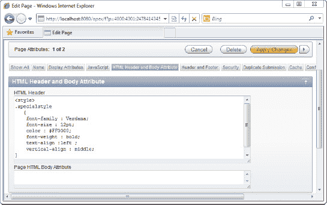

    **图 4-6.** 在 HTML 头部声明自定义样式

5.  单击“应用更改”按钮以保存表单。导航回表单的“页面定义”区域。
6.  在“共享组件”部分，展开“模板”节点，并进一步展开“按钮”节点。右键单击最深层的“按钮”节点，然后选择“编辑”菜单项。
7.  在打开的窗口中，单击“定义”选项卡，并将按钮的类更改为“specialstyle”，如图 4-7 所示。

    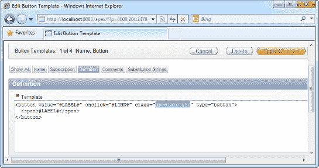

    **图 4-7.** 引用 `specialstyle` 样式

8.  保存更改并运行表单。您现在应该看到表单上的按钮为红色，如样式表类中所声明（参见图 4-8）。

    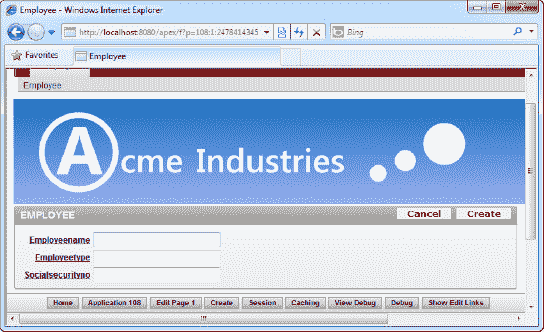

    **图 4-8.** 应用在表单上的 `specialstyle` 样式

#### 工作原理

如果您需要快速声明一些样式表类并在表单中使用它们（而无需在其他表单中重用这些类），声明它们的好地方是在“HTML 头部和正文属性”部分下，如本食谱前面所见。您在此部分中输入的任何内容都会按原样呈现在 APEX 生成的网页顶部。

声明后，您可以通过样式类的名称直接引用这些样式。

 **注意** 通过将样式表类放在 HTML 头部和正文属性部分，您使其仅对该表单可用，而对应用程序中的其他表单不可用。要创建可在整个应用程序或工作区中全局使用的样式集，请考虑改用自定义 CSS 文件（在食谱 4-3 中介绍）。

### 4-3. 使用自定义 CSS 文件

#### 问题

您有大量存储在 `.css` 文件中的样式表类，并且需要在应用程序中引用此 CSS 文件，以便可以将自定义样式应用于表单上的某些元素。


#### 解决方案

要使用自定义 CSS 文件，请按照以下步骤操作：

1.  使用记事本或任何其他编辑器工具创建一个新的 CSS 文件，内容如 代码清单 4-2 所示。

    `代码清单 4-2. 一个示例 CSS 文件`
    ```css
    .buttonstyle_incss
    {
      font-family : Verdana;
      color : #FFFFFF;
      font-weight : bold;
      text-align :left ;
      vertical-align : middle;
      width:150px;
      height:25px;
      background-color:#000000;
    }
    ```
2.  在应用程序构建器中点击一个现有应用程序。
3.  点击 `共享组件` 图标。在随后出现的页面中，点击 `文件` 部分下的 `层叠样式表` 链接。
4.  点击 `创建` 按钮，向您的应用程序添加一个新的样式表。在随后出现的页面中，浏览并找到您的 `.CSS` 文件，然后点击右上角的黄色 `上载` 按钮。
5.  您现在应该能看到您的 CSS 文件，如 图 4-9 所示。

    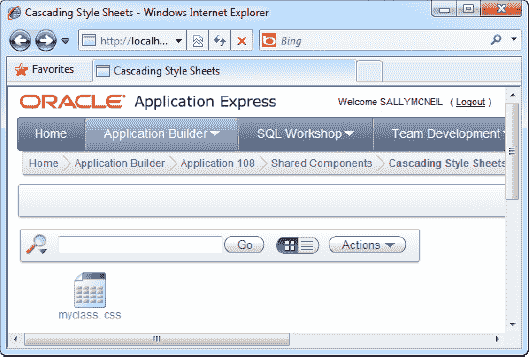

    `图 4-9. 新上载的 myclass.css 文件`

6.  导航到您表单的页面定义区域。右键点击根表单节点，选择 `编辑` 菜单项。
7.  在随后出现的页面中，点击 `HTML 头和主体属性` 选项卡。在 `HTML 头` 文本框中，输入以下代码，将 `myclass.css` 替换为您上载的 CSS 类的名称。请注意，类名区分大小写。
    ```html
    <link href="#WORKSPACE_IMAGES#myclass.css" rel="stylesheet" type="text/css" />
    ```
8.  您现在应该看到如 图 4-10 所示的屏幕。

    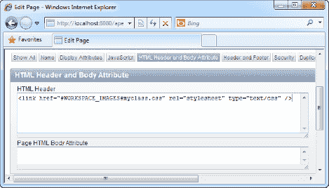

    `图 4-10. 引用 myclass.css 文件`

9.  保存您的更改并返回到表单的 `页面定义` 区域。在 `共享组件` 部分，展开 `模板`  `按钮`，右键点击最深层的 `按钮` 节点，并选择 `编辑` 菜单项。
10. 在随后出现的页面中点击 `定义` 选项卡，并将按钮的 `类` 属性设置为您在 CSS 样式表中定义的类的名称：`buttonstyle_incss`。您应该看到如 图 4-11 所示的屏幕。

    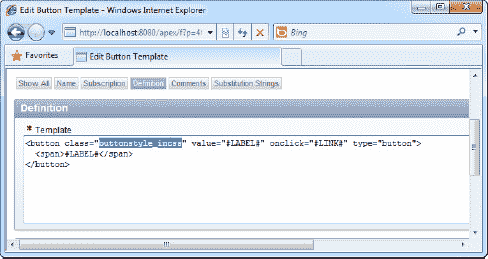

    `图 4-11. 在您的 CSS 文件中引用 buttonstyle_incss 样式`

11. 保存您的更改并运行该表单。您表单上的按钮已经采用了您所附加的 CSS 文件中定义的黑底白字样式，如 图 4-12 所示。

    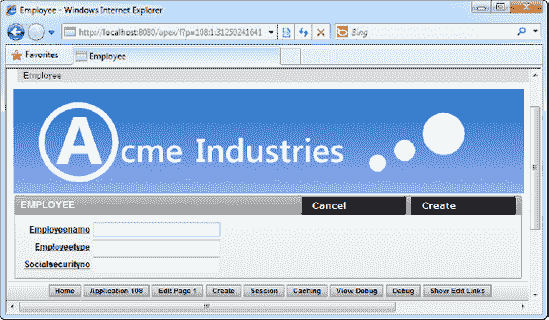

    `图 4-12. 应用在您表单上的 CSS 文件`

#### 工作原理

CSS 文件在 APEX 中也被视为资源。您可以全局上载一个 CSS 文件，并在工作区的任何应用程序中重复使用它。就像标准的 Web 应用程序开发一样，您必须先声明 CSS 文件，然后才能使用其中的样式。您可以通过在表单的 `HTML 头和主体属性` 部分包含 CSS 文件的标准 HTML 声明来实现，如下所示：

`<link href="#WORKSPACE_IMAGES#myclass.css" rel="stylesheet" type="text/css" />`

 **注意** HTML 声明的 `href` 属性需要一个指向 CSS 文件的实际路径，因此您需要包含 `#WORKSPACE_IMAGES#` 替换字符串来告诉 APEX 到哪里去查找它。

### 4-4. 在您的应用程序中创建新主题

#### 问题

您非常喜欢您的新黑底白字按钮，以至于您希望这个按钮成为您所有其他应用程序的事实标准。您希望创建一个包含此按钮作为默认项的特殊主题，以便开发人员可以轻松地将该主题用于其他应用程序。

#### 解决方案

要使用新主题，您必须先创建主题，然后将应用程序主题切换到您的新主题。

##### 创建新主题

要创建新主题，请按照以下步骤操作：

1.  在应用程序构建器中点击一个现有应用程序。
2.  点击 `共享组件` 图标，并点击 `用户界面` 部分内的 `主题` 链接（如 图 4-13 所示）。

    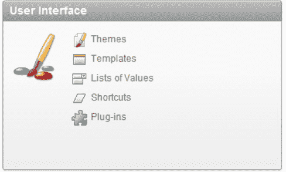

    `图 4-13. 用户界面区域中的主题链接`

3.  在随后出现的窗口中，点击 `创建` 按钮以启动主题创建向导。
4.  在向导的第一步中，选择 `从存储库创建` 主题。
5.  接下来，从主题列表中选择一个主题（选择您希望的任意主题）。最后，点击 `创建` 按钮以创建主题。
6.  您现在应该能在 `主题` 区域看到您新创建的主题，如 图 4-14 所示。我选择了 `主题 8 (Orange)`。

    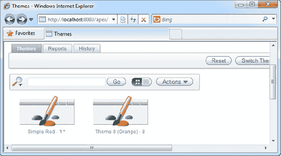

    `图 4-14. 新创建的主题（主题 8 (Orange) - 8）`

7.  现在您拥有一个主题，您需要修改它以包含您的自定义按钮模板。点击该主题。您现在应该看到一个类似 图 4-15 的屏幕。

    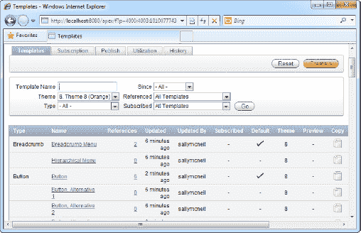

    `图 4-15. 主题的内容`

8.  在此屏幕中，点击 `按钮类型` 部分中的 `按钮` 链接。在随后出现的页面中，从技巧 4-3 复制按钮模板，并将其粘贴到 `定义` 区域下的 `模板` 字段中。您现在应该看到如 图 4-16 所示的屏幕。保存您的更改。

    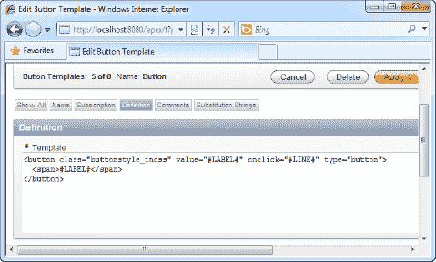

    `图 4-16. 修改主题中的按钮模板`

##### 切换应用程序主题

要将您的应用程序主题切换到新创建的主题，请按照以下步骤操作：

1.  返回应用程序的 `共享组件` 部分。在相同的 `用户界面` 区域下，再次点击 `主题` 链接。
2.  点击 `切换主题` 按钮。您现在应该看到如 图 4-17 所示的屏幕。选择切换到您新创建的主题。

    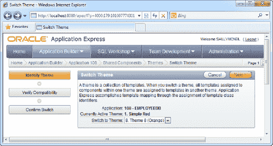

    `图 4-17. 切换应用程序的活动主题`

3.  导航到向导的下一步并确认主题切换。成功切换主题后，将显示一条确认消息。现在，再次运行您的应用程序。您应该看到应用了新主题，以及您的自定义黑底白字按钮模板（如 图 4-18 所示）。

    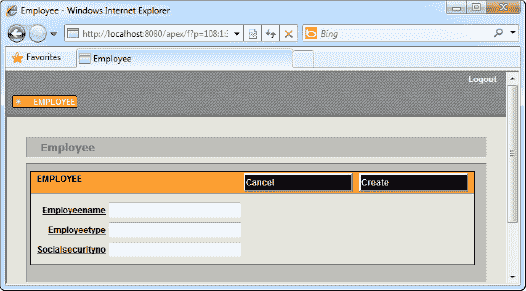

    `图 4-18. 应用在您表单上的新主题`

#### 工作原理

如技巧 4-1 所述，主题是模板的集合，它们是管理用户界面的好方法。一个主题包含 APEX 中每一种用户界面元素类型的模板。主题允许您轻松地为应用程序换肤，并在不同皮肤之间切换。

您还可以通过在 APEX 中制作主题的副本并单独修改其中包含的模板，轻松地创建主题的新变体。

 **注意** 有些网站会出售或提供 APEX 主题。ApexSkins 就是这样一个网站；请访问 [`www.apexskins.com`](http://www.apexskins.com)。

### 4-5. 修改表单控件模板

#### 问题

您的应用程序运行良好。有一天，办公室里有人不小心删除了一些重要数据。高层政治介入，您那些不太懂技术的老板们认为，让表单中的所有按钮在执行任何操作前都额外弹出一个确认提示是个好主意。鉴于您现有的一些表单有大量按钮，并且一个一个地更改表单按钮不会很有趣，您开始寻找更快的替代方案。


#### 解决方案

修改表单控件模板，一次性更改所有按钮的行为。操作步骤如下：

1.  在您的应用程序中打开现有表单。
2.  在表单的“页面定义”区域中，展开“共享组件”部分下的“模板”节点。找到“按钮”节点并将其展开。
3.  右键单击最深层的“按钮”节点，选择编辑该项（如`图 4-19`所示）。
    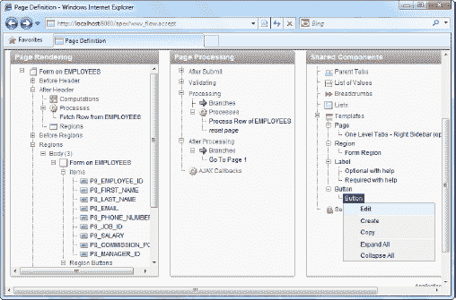
    **`图 4-19.`** 在您的表单上应用的新主题
4.  在弹出的窗口中，找到“定义”面板。在“模板”字段中，修改`APEX`按钮模板，在按钮的`onclick`事件中包含一个确认弹出窗口的`JavaScript`（如`清单 4-3`中粗体突出显示的部分）。
    **`清单 4-3.`** 修改默认按钮模板
    ```
    <button value="#LABEL#" onclick="if (confirm('Are you sure?')) {#LINK#};" class="button-gray" type="button">
      <span>#LABEL#</span>
    </button>
    ```
5.  现在您应该看到如`图 4-20`所示的屏幕。
    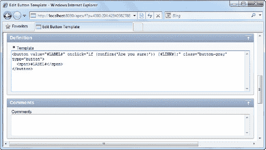
    **`图 4-20.`** 新的按钮模板
6.  保存更改并运行表单。单击表单中的任意按钮。现在您应该看到一个`JavaScript`确认弹出窗口出现，允许您取消或确认操作，如`图 4-21`所示。
    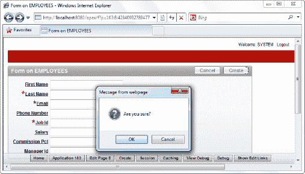
    **`图 4-21.`** 运行中的新按钮

#### 工作原理

对`APEX`而言，一个按钮未必是一个按钮，一个文本框也未必是一个文本框。抛开这种玄妙的说法，`APEX`表示每个表单控件的方式完全可由开发人员自定义。例如，`APEX`附带以下默认的按钮模板：

```
<button value="#LABEL#" onclick="#LINK#;" class="button-gray" type="button">
  <span>#LABEL#</span>
</button>
```

但`APEX`向您公开此模板并允许您修改它，这意味着您可以，例如，完全用其他内容替换前面的`HTML`。一旦您这样做，每当`APEX`应用程序需要渲染按钮时，它将渲染您的`HTML`。

这种灵活性意味着您可以，例如，通过更改按钮模板将表单中的所有按钮更改为图像按钮。或者，在本示例的案例中，添加默认控件中不具备的附加功能。

### 4-6. 创建可重用的代码片段

#### 问题

您的上司指派您在*所有*应用程序表单中创建一个区域，以以下格式显示当前系统日期：“`The date today is XXXXXXXX.`” 您知道可以在每个表单中编写一个简单的一行`PL/SQL`来生成此标签，但更了解您上司的话，您知道他们第二天就会改变主意，要求不同的日期显示方式。考虑到这一点，您需要一种方法在应用程序中集中管理变更点，以便当您在一个位置更改文本时，它会自动在您的所有应用程序表单中生效。

#### 解决方案

创建一个快捷方式，并从每个页面引用该快捷方式。

要创建快捷方式，请按照以下步骤操作：

1.  打开一个现有应用程序。
2.  单击`共享组件`图标。
3.  在`用户界面`部分，单击`快捷方式`链接，如`图 4-22`所示。
    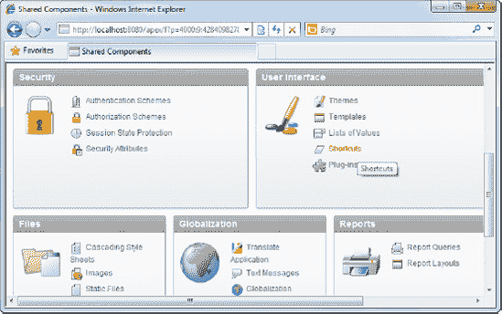
    **`图 4-22.`** 快捷方式链接
4.  在下一个窗口中，单击“创建”按钮，并选择从头开始创建快捷方式。
5.  单击`下一步`按钮。指定`MY_DATE_CAPTION`作为快捷方式的名称，将源`类型`更改为`PL/SQL 函数体`，并在`快捷方式`字段中键入以下文本：`return 'The date today is ' || to_char(sysdate,'DD/MM/YYYY HH24:MI:SS');`
6.  现在您应该看到如`图 4-23`所示的屏幕。
    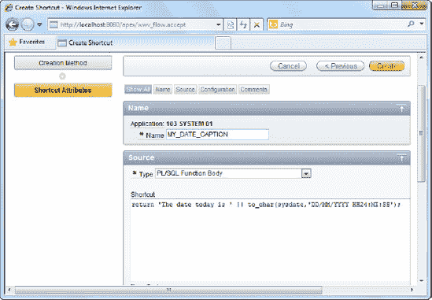
    **`图 4-23.`** 为快捷方式指定源
7.  单击“创建”按钮以创建快捷方式。现在您应该看到新创建的快捷方式，如`图 4-24`所示。
    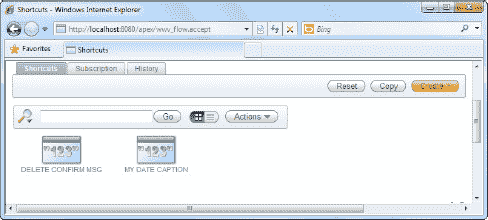
    **`图 4-24.`** 新创建的快捷方式

要从您的表单引用快捷方式，请按照以下步骤操作：

1.  打开一个现有表单。
2.  在表单的“页面定义”区域中，创建一个新区域（右键单击`页面渲染`部分中的`表单`  `区域`  `主体`节点，然后单击`创建`菜单项）。
3.  在向导中选择`HTML`区域类型。
4.  在向导的下一页，选择`HTML 文本（含快捷方式）`，如`图 4-25`所示。
    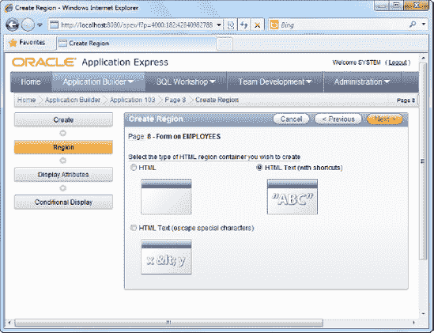
    **`图 4-25.`** 在区域中使用 HTML 文本（含快捷方式）
5.  在下一步中，指定区域的标题。
6.  下一步将允许您指定`HTML 文本区域源`。键入您之前创建的快捷方式的名称，用双引号括起来（如`图 4-26`所示）。
    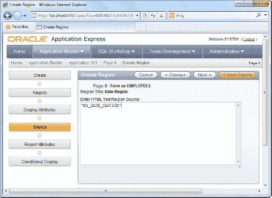
    **`图 4-26.`** 从区域引用快捷方式
7.  现在单击`创建区域`按钮。
8.  现在您应该看到日期值出现在表单的区域中，如`图 4-27`所示。
    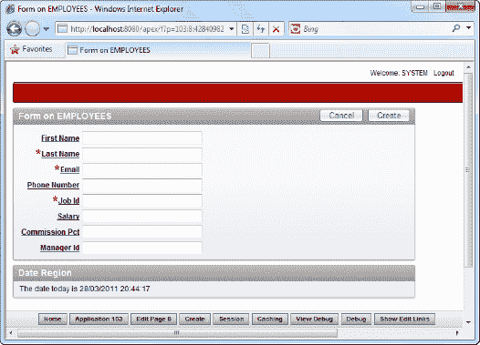
    **`图 4-27.`** 运行中的快捷方式

#### 工作原理

您可以选择不将信息直接硬编码在表单中，而是将它们外部表示为一个动态变量，在需要时从您的应用程序中引用。在`APEX`中，这样的变量称为快捷方式。

使用快捷方式有很多好处。例如，如果您的上司决定将文本从“`The date today is`”更改为“`Current date is`”，您只需在快捷方式中更改它，使用该快捷方式的应用程序每个部分都将显示正确的文本。

### 4-7. 通过插件扩展用户界面

#### 问题

您需要创建一个现有`APEX`控件工具箱中没有的表单控件。您还计划与同事共享此控件，因此需要使其可重用。


#### 解决方案

你决定使用 APEX 插件来实现该控件。在本教程中，你将创建一个专门的超链接控件（用于将用户引导至谷歌网站）作为示例。

### 创建插件

要创建插件，请按照以下步骤操作：

1.  打开一个现有应用程序。
2.  点击 `共享组件` 图标。
3.  点击用户界面部分中的 `插件` 链接，如图 4-28 所示。
    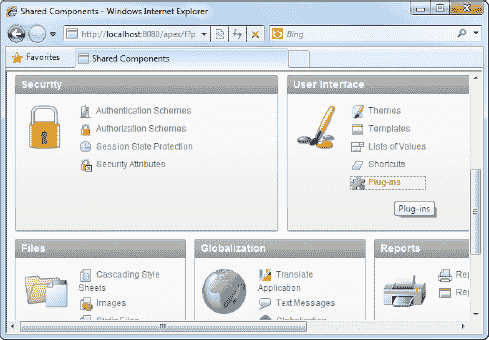
    **图 4-28. 插件链接**
4.  在插件配置页面，指定 `GOOGLELINKIE` 作为插件名称，`mygooglelinkie` 作为插件的内部名称。确保 `类型` 字段设置为 `项`。
5.  在源代码区域，输入代码清单 4-4 中所示的文本。
    **代码清单 4-4. 渲染函数**
    ```
    function RENDER_LINKIE (
        p_item                  in apex_plugin.t_page_item
        , p_plugin              in apex_plugin.t_plugin
        , p_value               in varchar2
        , p_is_readonly         in boolean
        , p_is_printer_friendly in boolean)
    return apex_plugin.t_page_item_render_result
    is
       retval apex_plugin.t_page_item_render_result;
    begin
        htp.p('<a href="http://www.google.com">Jump to Google</a>');
        return retval;
    end;
    ```
6.  确保将 `渲染函数名称` （位于 `回调` 部分下）设置为你的 PL/SQL 函数名称（`RENDER_LINKIE`）。现在你应该拥有如图 4-29 所示的截图。
    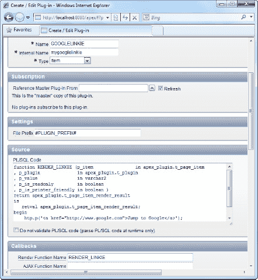
    **图 4-29. 指定插件详细信息**
7.  点击 `创建` 按钮以创建插件。

### 使用插件

要在应用程序中使用插件，请按照以下步骤操作：

1.  打开一个现有表单。
2.  在表单的页面渲染区域，创建一个新的页面项。
3.  在向导第一步的可用项类型列表中，选择 `插件`，如图 4-30 所示。
    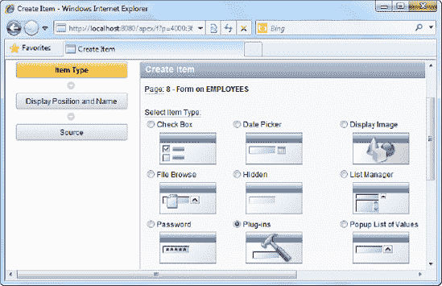
    **图 4-30. 插件项类型**
4.  在向导的下一步中，选择 `GOOGLELINKIE` 插件，如图 4-31 所示。
    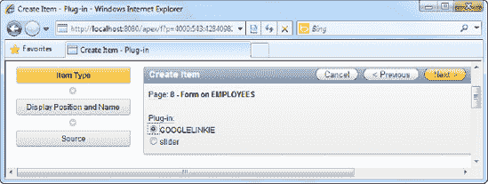
    **图 4-31. 选择 GOOGLELINKIE 插件**
5.  使用默认设置完成向导的其余部分以创建页面项。
6.  现在运行你的应用程序。你可以看到你的控件显示在表单中（“跳转到谷歌”），如图 4-32 所示。点击它将带你前往谷歌网页。
    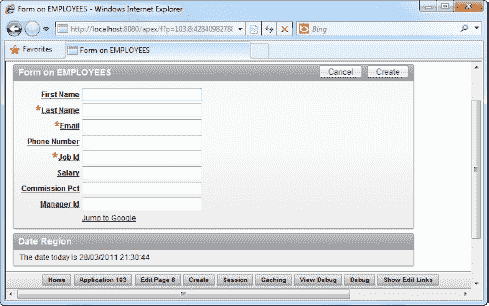
    **图 4-32. 运行中的谷歌 Linkie 插件**

#### 工作原理

插件是扩展现有 APEX 控件工具集的一种方式。插件的结构相当直接。你为插件提供一个 PL/SQL 函数，该函数用于渲染控件的 HTML（及附带的 JavaScript）。

如果你仔细查看之前指定的 PL/SQL 函数，可以看到一条类似如下语句：
```
htp.p('<a href="http://www.google.com">Jump to Google</a>');
```
请注意，`htp` 是一个包，允许你从插件中写入 HTML 输出。使用此函数，你可以渲染实现插件所需功能的任何 HTML 或 JavaScript。

利用 APEX 中的插件框架，你可以构建大量功能丰富且可重用的插件，以便在同事间共享（甚至在线销售！）。

## 可视化你的数据

APEX 真正出色的关键领域之一是其能够创建多种视图来可视化数据库中的数据。如果你的表中至少有一个数字字段，你可以处理数据以创建生动、静态或动画的饼图、环形图、条形图或蜡烛图。如果你的表中至少有一个日期或时间字段，你可以使用该字段神奇地将记录填充到日历上。如果你有一堆销售数据，你可以在高分辨率地图上将其显示在对应的国家/地区上方。

丰富的 APEX 平台允许你（在几分钟内）创建数百种查看数据的新方式——这是你在传统编程中通常无法独自完成的。（尝试自己编写动画图表引擎或地图渲染器吧！）

巧妙的是，APEX 中的视图也被视为页面，因此它们遵循 APEX 的其余架构，这意味着你可以将模板、主题、进程、行为等应用于这些页面。本章重点介绍如何在 APEX 中设置和使用一些基本视图。到本章结束时，你将对 APEX 中可用的不同类型视图有所了解。

### 创建经典报表

#### 问题

你有两个表：员工表和员工请假表。你需要从两个表中提取信息并以静态报表的形式呈现。换句话说，你需要创建一个结合数据库中多个表数据的表格型只读报表。


#### 解决方案

此解决方案包含两个步骤。你必须首先创建示例对象（这些对象将用于本章的其他配方）。之后，你将创建报表本身。

##### 步骤 1：创建示例对象

你将创建的示例对象是员工和员工请假表。使用 SQL Workshop 执行 清单 5-1 中所示的代码。

**清单 5-1.** 创建示例对象

```
CREATE table "EMPLOYEES" (
    "EMPID"         NVARCHAR2(10),
    "EMPNAME"       NVARCHAR2(255),
    "EMPTITLE"      NVARCHAR2(255),
    "EMPDEPARTMENT" NVARCHAR2(255),
    constraint  "EMPLOYEES_PK" primary key ("EMPID")
)
/

CREATE TABLE  "EMPLEAVE"
(   "EMPID" NVARCHAR2(50),
    "LEAVEDATE" DATE,
    "LEAVETYPE" NVARCHAR2(255),
    "LEAVEREASON" NVARCHAR2(255),
    "LEAVEID" NVARCHAR2(50),
    CONSTRAINT "EMPLEAVE_PK" PRIMARY KEY ("LEAVEID") ENABLE
)
/

INSERT INTO EMPLOYEES(EMPID,EMPNAME,EMPTITLE,EMPDEPARTMENT) VALUES('E1','Janet Harris','CFO','Finance')
/
INSERT INTO EMPLOYEES(EMPID,EMPNAME,EMPTITLE,EMPDEPARTMENT) VALUES('E2','Greg Yap','Senior Developer','IT')
/
INSERT INTO EMPLEAVE(EMPID,LEAVEDATE,LEAVETYPE,LEAVEREASON,LEAVEID)
VALUES('E1',TO_DATE('20090329', 'YYYYMMDD'),'Sick Leave','Flu','L1')
/
INSERT INTO EMPLEAVE(EMPID,LEAVEDATE,LEAVETYPE,LEAVEREASON,LEAVEID)
VALUES('E1',TO_DATE('20100517', 'YYYYMMDD'),'Maternity Leave','Maternity','L2')
/
INSERT INTO EMPLEAVE(EMPID,LEAVEDATE,LEAVETYPE,LEAVEREASON,LEAVEID)
VALUES('E2',TO_DATE('20090314', 'YYYYMMDD'),'Emergency leave','To visit a dying friend','L3')
/
```

##### 步骤 2：创建报表

要创建经典报表，请按照以下说明操作：

1.  创建一个新应用程序，并选择在此应用程序中创建一个新页面。
2.  选择“报表”页面类型。
3.  在向导的下一步中，选择“经典报表”类型，如 图 5-1 所示。

    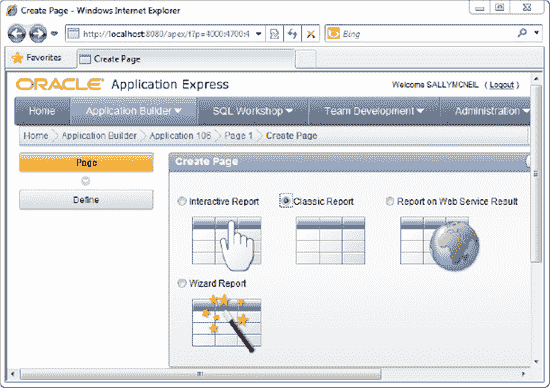

    **图 5-1.** 经典报表

4.  接下来，指定报表的名称。完成后，跳过下一步。你现在将被允许输入报表的 SQL 语句。指定 清单 5-2 中所示的 SQL 语句。

    **清单 5-2.** 为经典报表指定 SQL

    ```
    SELECT * FROM EMPLOYEES LEFT JOIN EMPLEAVE ON EMPLOYEES.EMPID=EMPLEAVE.EMPID
    ```

    你现在应该看到如 图 5-2 所示的屏幕截图。

    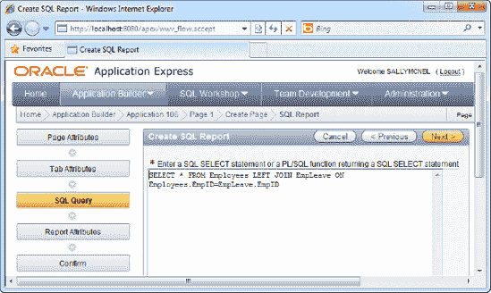

    **图 5-2.** 为经典报表指定 SQL

5.  单击通过向导的其余部分直到结束。
6.  运行报表。你应该看到如 图 5-3 所示的组合数据列表。

    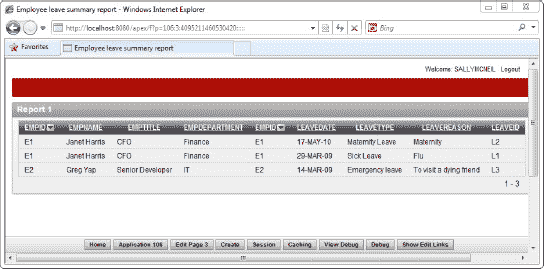

    **图 5-3.** 实际运行中的经典报表

#### 工作原理

你首先在第 2 章中遇到了报表。基本上有两种类型的报表：交互式报表和经典报表。经典报表是静态的——它们只显示信息——而交互式报表允许你与信息进行交互。如本配方所示，两种报表都可以组合多个表的结果。

### 5-2. 创建参数化报表

#### 问题

你的管理层希望能够动态过滤其报表中显示的信息。使用配方 5-1 中的示例数据，你的管理层希望将范围缩小到特定员工的请假记录列表。

 **注意** 如果你还没有这样做，请执行清单 5-1 来创建本配方使用的示例数据。

#### 解决方案

要创建参数化报表，请按照以下说明操作：

1.  打开一个应用程序并选择创建一个新页面。
2.  在向导的第一步中选择“报表”页面类型，如 图 5-4 所示。

    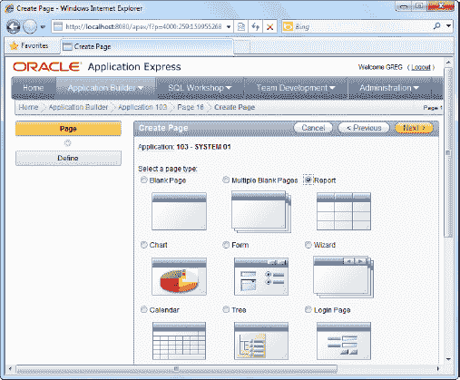

    **图 5-4.** 报表页面类型

3.  在下一步中，选择“交互式报表”类型。
4.  跳过向导中的所有步骤，直到到达允许你指定报表 SQL 语句的步骤。到达此步骤时，指定 清单 5-3 中所示的 SQL。

    **清单 5-3.** 为交互式报表指定 SQL

    ```
    SELECT e1.EmpName, e1.EmpTitle, e1.EmpDepartment, e2.LeaveDate, e2.LeaveType, e2.LeaveReason, e2.LeaveID FROM Employees e1 LEFT JOIN EmpLeave e2 ON e1.EmpID=e2.EmpID
    ```
5.  在同一步骤中，为“唯一标识行依据”字段选择“唯一列”，为“唯一列”字段选择“LeaveID”。你现在应该看到如 图 5-5 所示的屏幕。单击“下一步”继续。

    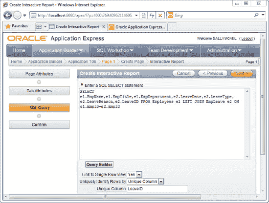

    **图 5-5.** 为交互式报表指定 SQL

6.  跳到最后一步以完成向导。现在运行你的报表。你应该看到配方 5-1 中看到的数据列表，并在列表顶部添加了一个新的搜索栏。
7.  单击搜索栏中的放大镜图标并选择“Empname”条目，如 图 5-6 所示。

    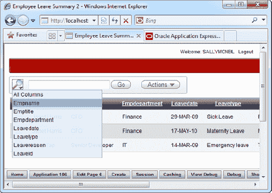

    **图 5-6.** 按员工姓名搜索

8.  完成后，搜索栏现在允许你按员工姓名进行搜索。输入 Janet，然后单击 Enter 开始搜索。报表中显示的结果列表现在被过滤，仅显示与你的搜索条件匹配的条目（参见 图 5-7）。

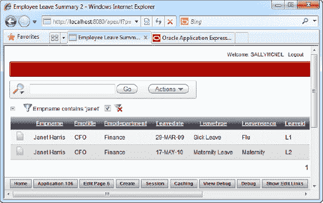

**图 5-7.** 过滤后的结果列表

#### 工作原理

交互式报表带有一个内置的搜索栏，允许最终用户快速、动态地对报表中显示的结果列表应用过滤器。在本配方中，你可以看到如何切换搜索栏的模式，使报表使用特定字段（本例中为“员工姓名”字段）进行搜索。

### 5-3. 用图形图表可视化数据

#### 问题

你希望以图表的形式呈现数据，以便一目了然地分析数据。例如，你希望分析每位员工请假的频率——并且你希望以 3D 饼图的形式将此信息可视化。

 **注意** 如果你还没有这样做，请执行清单 5-1 来创建本配方使用的示例数据。


#### 解决方案

要创建一个以 3D 饼图展示数据的页面，请遵循以下指引：

1.  打开一个应用程序，选择创建新页面。
2.  在向导的第一页中，选择“图表”页面类型，如图 5-8 所示。
    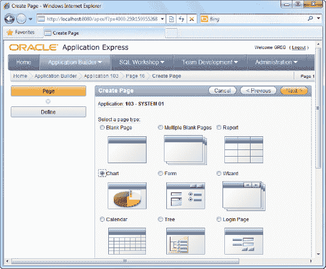
    图 5-8. 图表页面类型
3.  在下一步中，选择“Flash 图表”。
4.  在接下来的步骤中，您需要指定要使用的图表类型。请选择“饼图与圆环图”类型。
5.  在下一步中，您将再次面临图表选择，如图 5-9 所示。选择“3D 饼图”。
    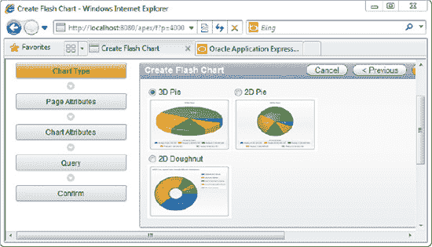
    图 5-9. 选择 3D 饼图
6.  在向导的下一步中，将页面名称指定为“员工休假频率”。
7.  点击通过下一步。现在系统将要求您指定图表标题和动画样式。在“图表标题”字段中指定“员工休假频率”，在“图表动画”字段中选择“从左侧滑入”，如图 5-10 所示。
    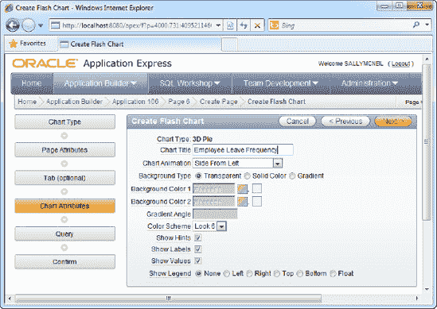
    图 5-10. 指定图表设置
8.  在下一步中，您将指定返回用于渲染图表的数据集的 SQL 语句；使用代码清单 5-4 中的代码。
    代码清单 5-4. 指定图表的 SQL
    ```
    SELECT '',EmpName,count(*) FROM Employees INNER JOIN EmpLeave ON
        Employees.EmpID=EmpLeave.EmpID GROUP BY EmpName
    ```
9.  您应该会看到如图 5-11 所示的屏幕。
    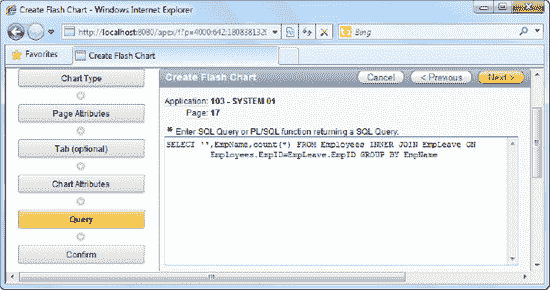
    图 5-11. 为图表指定 SQL
10. 完成向导并运行该图表页面。您应该能看到一个漂亮的动画饼图，显示每位员工的休假频率（参见图 5-12）。
    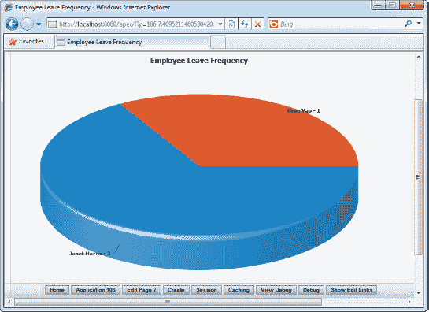
    图 5-12. 动画图表

#### 工作原理

APEX 中大多数视图背后的概念是相似的：视图的核心是您提供给它的 SQL 语句。APEX 只是获取 SQL 查询结果的数据集（该数据集预期具有特定格式）并适当地显示它。

图表视图在概念上与其他任何视图并无不同。具体对于饼图，APEX 始终期望 SQL 查询中的第二个字段是图表上为数据系列显示的标签。第三个字段是该系列的数值。

 **注意** 不同类型的图表，其 SQL 查询的格式有所不同。您始终可以参考向导中同一 SQL 定义页面提供的示例 SQL 脚本。（APEX 在其向导中非常贴心地提供了提示。）

### 5-4. 在多系列图表中可视化数据

#### 问题

您的老板要求您检索两组数据系列（全球和本地销售额），并将其金额显示在单个图表中。您立刻意识到您的老板想要查看一个多系列图表，但不确定如何继续。

#### 解决方案

要创建一个多系列图表，您首先需要为此配方创建示例表和数据。请遵循以下指引：

1.  运行以下 SQL 来创建 `COMPANYSALES` 表及相应的数据：
    ```
    CREATE TABLE  "COMPANYSALES"
       (    "ID" NVARCHAR2(50),
            "GLOBALREVENUE" NUMBER(9,2),
            "LOCALREVENUE" NUMBER(9,2),
            "PRODUCT" NVARCHAR2(255),
             CONSTRAINT "COMPANYSALES_PK" PRIMARY KEY ("ID") ENABLE
      )
    /

    INSERT INTO "COMPANYSALES" ("ID","GLOBALREVENUE","LOCALREVENUE","PRODUCT")
    VALUES(1,1000,2000,'CAR ENGINES')
    /
    INSERT INTO "COMPANYSALES" ("ID","GLOBALREVENUE","LOCALREVENUE","PRODUCT")
    VALUES(2,1500,1900,'SAILBOATS')
    /
    INSERT INTO "COMPANYSALES" ("ID","GLOBALREVENUE","LOCALREVENUE","PRODUCT")
    VALUES(3,200,4000,'BIKES')
    /
    ```

要设置多系列图表，请遵循以下指引：

1.  打开一个现有应用程序，选择创建新页面。
2.  选择“图表”页面类型。
3.  在向导的下一页中，选择“Flash 图表”类型。
4.  在接下来的页面中，选择“柱形图”类型，如图 5-13 所示。
    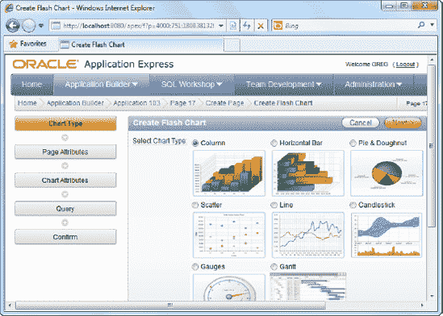
    图 5-13. 柱形 Flash 图表类型
5.  在下一页中，选择“3D 堆积柱形图”类型，如图 5-14 所示。
    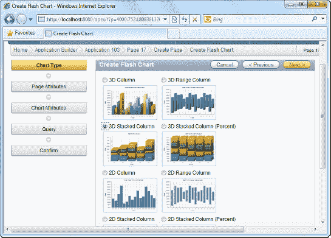
    图 5-14. 3D 堆积柱形图类型
6.  跳过向导的接下来两个步骤。在“图表属性”步骤中，将图表的标题指定为“全球与本地销售摘要”，如图 5-15 所示。
    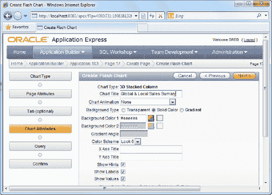
    图 5-15. 指定图表标题
7.  在下一步中，为图表指定以下 SQL 数据源查询：`SELECT NULL, PRODUCT, LOCALREVENUE, GLOBALREVENUE FROM COMPANYSALES`
8.  您现在应该会看到如图 5-16 所示的屏幕截图。
    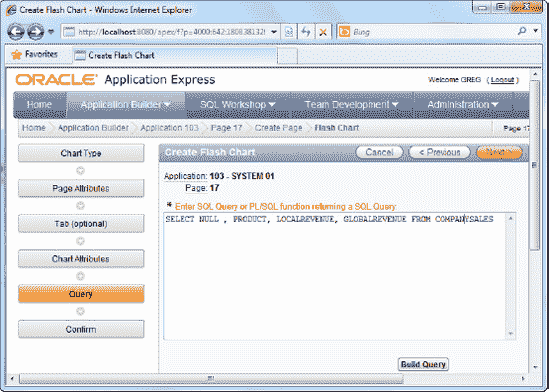
    图 5-16. 为图表指定 SQL 数据源
9.  完成向导并运行该表单。您应该能看到如图 5-17 所示的多系列图表。
    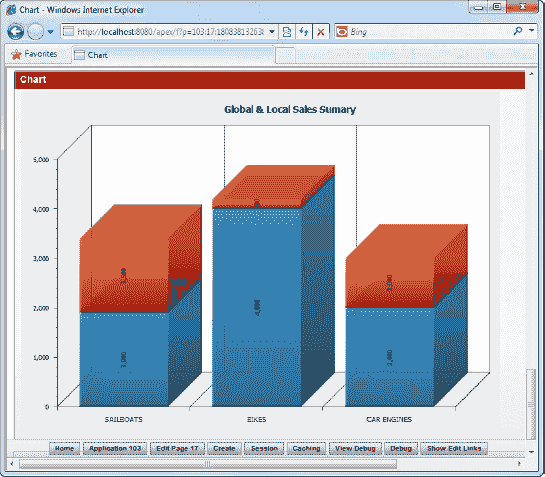
    图 5-17. 运行中的多系列条形图

#### 工作原理

APEX 支持多系列图表，并且它们易于配置。让我们检查一下您用于该图表的 SQL。

```
SELECT NULL, PRODUCT, LOCALREVENUE, GLOBALREVENUE FROM COMPANYSALES
```

第一个 SQL 字段表示一个链接（这允许您为图表中的每个条形指定一个超链接 URL，当您点击它时，可以进一步深入查看另一个图表，或者被重定向到完全不同的页面。

第二个 SQL 字段允许您指定图表的标签。如您在图 5-15 中所见，标签标题显示在每个条形的底部。

SQL 语句中的第三、第四及第 n 个字段表示用于每个数据系列的值。例如，在此配方中，`LOCALREVENUE` 和 `GLOBALREVENUE` 字段构成了图表的第一个和第二个数据系列。

### 5-5. 在日历上可视化数据

#### 问题

您希望看到数据绘制在日历上。您创建的用于显示员工休假记录的报告很好，但您需要以更直观的方式对其进行可视化。您希望根据每条记录的休假日期将记录显示在日历上。

 **注意** 如果您尚未执行，请运行代码清单 5-1 来创建此配方所用的示例数据。


### 5-6. 在地图上可视化数据

#### 解决方案

要在日历上查看数据，请按照以下步骤创建页面：

1.  要运行此示例中的示例，您需要先向 `EmpLeave` 表中添加一条新记录。通过 SQL Workshop 运行如 Listing 5-5 所示的查询。请注意，需将查询中的 `LEAVEDATE` 日期更改为当前月份和年份。

    **清单 5-5.** 插入一条附加示例记录

    ```sql
    INSERT INTO EMPLEAVE(EMPID,LEAVEDATE,LEAVETYPE,LEAVEREASON,LEAVEID)
    VALUES('E1',TO_DATE('20110110', 'YYYYMMDD'),'Maternity Leave','Maternity','L4')
    ```
2.  打开一个应用程序并选择创建新页面。
3.  在向导的第一页中选择日历页面类型，如 图 5-18 所示。

    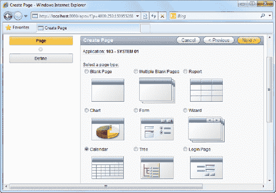

    **图 5-18.** 日历页面类型

4.  在下一步中，选择 SQL 日历。
5.  将页面名称指定为 Employee Leave 日历。
6.  点击进入下一步。您现在将看到一个可以定义日历 SQL 的区域；指定如 清单 5-6 所示的 SQL。

    **清单 5-6.** 为日历指定 SQL

    ```sql
    SELECT EmpName, Leavedate FROM Employees,EmpLeave WHERE Employees.EmpID=EmpLeave.EmpID
    ```
7.  您现在应该看到如 图 5-19 所示的屏幕。

    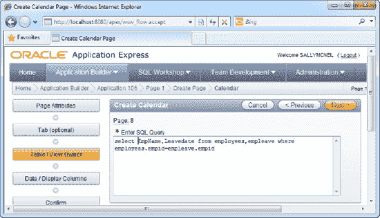

    **图 5-19.** 为日历指定 SQL

8.  在下一步中，系统将要求您指定用于日期列和显示列的数据库字段。为日期列选择 `LEAVEDATE`，为显示列选择 `EMPNAME`。
9.  导航到向导末尾并运行您的日历页面。您应该会看到刚刚创建的记录显示在日历中，如 图 5-20 所示。

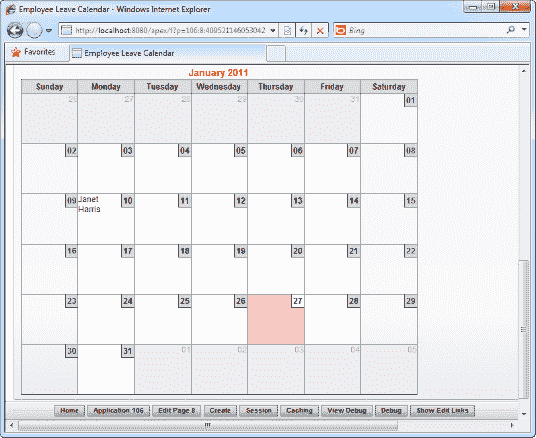

**图 5-20.** 运行中的日历

#### 工作原理

日历视图与图表视图类似，因为您指定的 SQL 必须遵循特定格式。在日历视图中，SQL 查询的第一个字段指的是将在日历上显示的标签，而查询中的第二个字段指的是用于在日历上填充记录的日期字段。

### 5-6. 在地图上可视化数据

#### 问题

您有一个包含欧洲多个国家总销售数据的数据库表。您的老板希望您将这些数据填充到欧洲地图上。您只有一天不到的时间来完成，而且不确定如何进行。

#### 解决方案

要在页面上创建可视化地图，您必须首先设置此示例中使用的销售数据示例表。请按照以下说明操作：

1.  通过运行 清单 5-7 所示的 SQL 创建示例销售表。

    **清单 5-7.** 创建示例 `SalesData` 表

    ```sql
    CREATE TABLE  "SALESDATA"
       (    "SALES" NUMBER(9,2),
            "ID" NVARCHAR2(50),
            "COUNTRY" NVARCHAR2(255),
             CONSTRAINT "SALESDATA_PK" PRIMARY KEY ("ID") ENABLE
       )

    INSERT INTO SALESDATA(SALES,ID,COUNTRY) VALUES(5000,1,'UNITED KINGDOM')

    INSERT INTO SALESDATA(SALES,ID,COUNTRY) VALUES(6000,2,'IRELAND')

    INSERT INTO SALESDATA(SALES,ID,COUNTRY) VALUES(6780,3,'FRANCE')
    ```

要创建地图以显示来自 `SalesData` 表的数据，请按照以下说明操作：

1.  打开现有应用程序并选择创建新页面。在向导的第一页中选择地图页面类型，如 图 5-21 所示。

    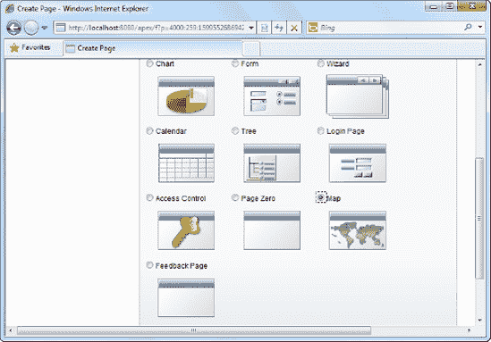

    **图 5-21.** 地图页面类型

2.  在向导的下一页中，选择如 图 5-22 所示的“世界和大陆地图”项。我们选择此地图而不是欧洲地图集合，是因为我们希望使用一个能在单一视图中显示所有欧洲国家的地图。欧洲地图集合则显示单个欧洲国家。

    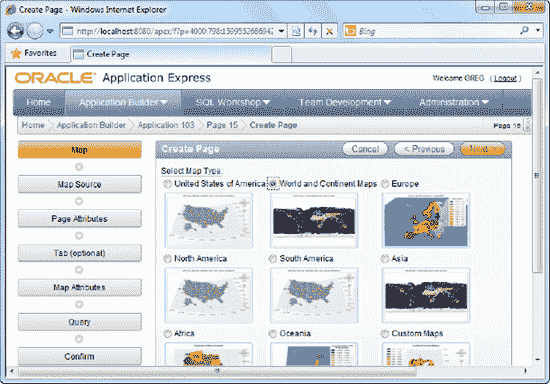

    **图 5-22.** “世界和大陆地图”包

3.  在下一页中，选择如 图 5-23 所示的“欧洲（不含俄罗斯）”地图。当然，如果您有包含俄罗斯销售统计信息的数据，您可以选择“欧洲”地图。

    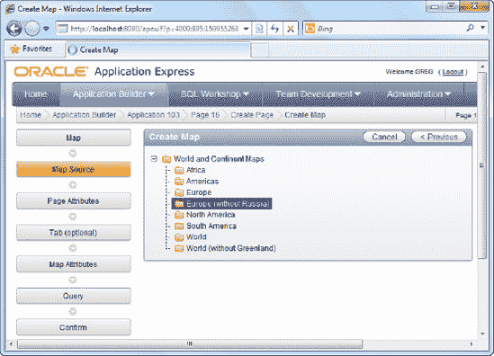

    **图 5-23.** “欧洲（不含俄罗斯）”地图

4.  跳过向导接下来的两页。
5.  在向导的“地图属性”步骤，指定地图标题（例如“ACME 欧洲销售”）。
6.  在向导的下一页，指定以下 SQL 查询：`SELECT NULL LINK, COUNTRY, SUM(SALES) FROM SALESDATA GROUP BY COUNTRY`
7.  您现在应该看到如 图 5-24 所示的屏幕。

    

    **图 5-24.** 为地图指定数据源

8.  跳过向导的下一步，单击“完成”按钮以创建地图。
9.  运行该页面。您应该会看到地图上每个对应国家都显示了您的销售数据，如 图 5-25 所示。

    

    **图 5-25.** 运行中的地图

10. 如果将鼠标悬停在每个国家上，您可以看到一个显示该国家总销售额的小型工具提示。您还可以使用右侧的导航工具对地图进行缩放/缩小和平移。

#### 工作原理

您可以使用 APEX 软件包中提供的可视化地图来呈现数据。APEX 提供了丰富的世界各地地图，并允许您将统计数据覆盖在这些地图上。

您可能已经注意到，APEX 使用您提供的国家名称将您的数据与可视化地图进行匹配。那么，是否有可能获取 APEX 内部识别的国家名称、州名称或省名称的完整列表？APEX 使用第三方 `AnyMap` 组件来渲染其地图（顺便提一下，使用 `AnyCharts` 组件来渲染其 Flash 图表）。前面提到的国家名称实际上是由 `AnyMap` 产品定义的。如果您导航到 AnyMap 的在线文档 [`http://anychart.com/products/anychart/docs/users-guide/index.html?maps-overview.html`](http://anychart.com/products/anychart/docs/users-guide/index.html?maps-overview.html) 并按照路径 Maps  Maps Reference  World  World and Continent Maps  Europe without Russia 进行导航，您将看到此区域的国家名称完整列表（如 图 5-26 所示）。


**图 5-26.** `AnyMap` 文档

 **注意** 这种地图技术与 Google 地图等不同，因为这些不是导航地图，也不允许使用 GPS 坐标在地图上定位对象。这些地图更多用于突出显示或补充统计数据（例如，显示每个国家的人口、一个国家内每个省份的总销售额等）。

