# 5-7. 将所有内容整合到一个仪表板页面中

#### 问题

您需要仪表板功能。您需要在同一个页面上同时显示图形图表和报告以供查看。例如，您希望创建一个显示员工请假频率以及所有员工列表的仪表板，并且您希望员工请假频率以饼图形式显示。


#### 解决方案

要创建一个结合了饼图和报表的仪表板，请按照以下说明操作：

1.  打开一个应用程序并创建一个新页面。
2.  选择创建一个空白页面。
3.  当系统要求时，指定 `HR 仪表板` 作为页面的名称。
4.  点击向导直到完成。页面创建后，选择编辑该页面。
5.  在页面的“页面呈现”部分，右键单击 `区域` 节点，并在弹出的菜单（如图 5-27 所示）中点击 `创建` 项。

    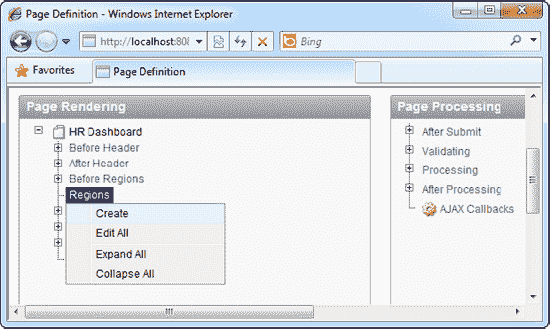

    **图 5-27.** 创建一个新区域

6.  在弹出的向导的第一步中，选择 `图表` 项。在下一步选择 `Flash 图表`，然后下一步选择 `饼图与圆环图`，最后选择 `3D 饼图`。指定 `员工请假频率` 作为该区域的标题。在向导的下一步中，为图表指定相同的标题，并为动画样式选择 `从左侧滑入`。
7.  当进入 SQL 语句区域时，指定代码清单 5-8 中所示的 SQL。

    **代码清单 5-8.** 为图表区域指定 SQL

    ```sql
    SELECT '',EmpName,count(*) FROM Employees INNER JOIN EmpLeave ON
    Employees.EmpID=EmpLeave.EmpID GROUP BY EmpName
    ```
8.  完成向导以创建该区域。您应该能看到新创建的区域，如图 5-28 所示。

    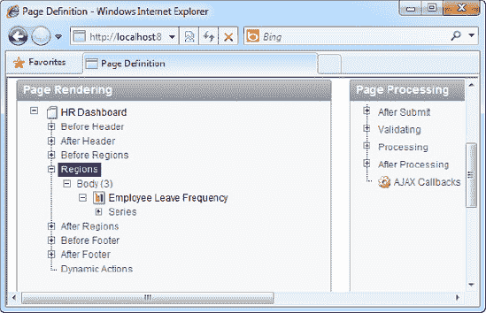

    **图 5-28.** 新创建的区域

9.  现在您需要创建另一个区域。再次右键单击 `区域` 节点并选择 `创建`。
10. 这次，选择 `报表` 作为区域类型。下一步选择 `SQL 报表` 类型，接下来的步骤中指定区域标题为 `员工列表`。
11. 当进入 SQL 区域时，指定代码清单 5-9 中所示的 SQL。

    **代码清单 5-9.** 为报表区域指定 SQL

    ```sql
    SELECT EMPID, EMPNAME, EMPTITLE, EMPDEPARTMENT FROM Employees
    ```
12. 完成向导以创建该区域。现在运行该页面。您应该能在同一个页面上看到您的饼图和员工列表，如图 5-29 所示。

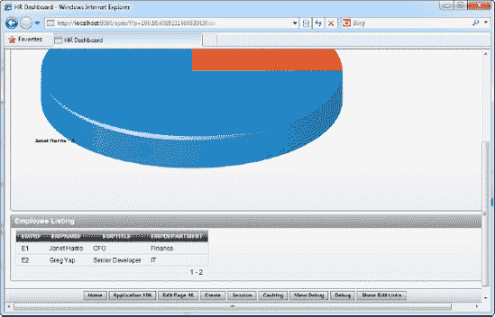

**图 5-29.** 运行中的仪表板

#### 工作原理

区域是 APEX 在单个页面内组织可视化信息的方式。使用区域，您甚至可以将数据输入表单和图表混合放在同一个页面中。区域非常灵活；它们也可以放置在您希望的任何位置。通过这种方式，您可以创建以不同方式传达来自不同来源信息的仪表板。

## 第六章

## 应用程序全球化

我相信您至少有过一次这样的经历：您乘飞机前往一个外国，自豪地展示了您精心打造的、包含数百个网页和精美用户界面的应用程序，结果却被询问是否所有内容都能用泰语显示。没有？那您真幸运！

与普遍看法相反，世界上超过 60%的人不说英语。此外，每个国家都有不同的本地化规范：美国人使用美元货币，英国人使用英镑或欧元，而很有趣的是，法国人在数字中使用逗号符号而不是小数点。

在当今互联网和云计算兴起真正让世界变得更紧密的环境下，您的应用程序不可避免地会被来自世界各地的人们使用。因此，在开发应用程序时，特别是开发部署在互联网上的应用程序时，考虑您自己国家或地区之外的因素非常重要。通过 Oracle 的语言和区域设置功能实现全球化，就是解决方案。

全球化支持包括以下领域：

*   输入双字节字符，例如日语或中文中使用的字符。
*   将应用程序用户界面翻译成各种语言。
*   货币、时区和日期/时间值的显示与数据输入格式。

本章中的“配方”探讨了这三个关注领域以及 APEX 为解决它们所提供的各种功能。

### 6-1. 设置双字节字符输入

#### 问题

您创建了接受双字节字符集（如中文和其他语言使用的字符）输入的表单。您的字段不仅必须接受此类字符，还必须使用户能够使用英语键盘输入这些字符。

#### 解决方案

要将基于 Windows 7 的操作系统设置为支持中文数据输入，请按照以下步骤操作：

 **注意** 此示例说明如何在 Windows 7 上设置中文输入法编辑器。对于其他操作系统，请查阅您的操作系统手册。

1.  单击 Windows 开始按钮并导航到控制面板。
2.  双击控制面板中的 `区域和语言` 图标以启动它，如图 6-1 所示。

    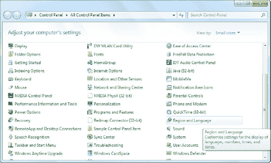

    **图 6-1.** 区域和语言设置

3.  在随后出现的弹出窗口中，单击 `键盘和语言` 选项卡，然后单击 `更改键盘` 按钮。另一个弹出窗口（如图 6-2 所示）将会出现。

    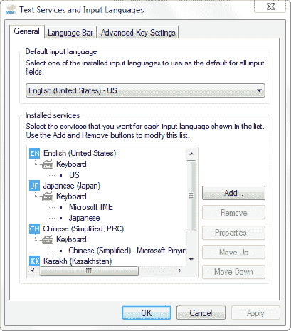

    **图 6-2.** 系统上安装的输入法列表

4.  单击 `添加` 按钮，找到 `中文(简体，中华人民共和国)` 节点。展开此节点，在 `键盘` 节点下，选择 `中文(简体) - 微软拼音 ABC 输入风格` 条目，如图 6-3 所示。

    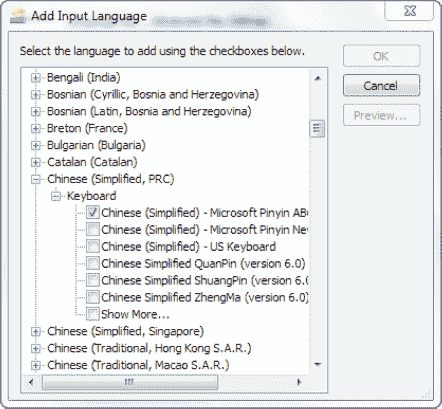

    **图 6-3.** 安装中文输入法

5.  单击 `确定` 按钮添加键盘。应用新设置并关闭所有窗口。您的操作系统现在应该已经安装了中文输入法。
6.  打开一个文本编辑器工具，如记事本，并确保该窗口已获得输入焦点。
7.  在您的 Windows 桌面右下角，当前默认语言应为 `EN`（英语），如图 6-4 所示。

    

    **图 6-4.** 语言栏

8.  单击 `EN` 符号，将您的键盘更改为 `CH`（中文），如图 6-5 所示。

    

    **图 6-5.** 将默认语言更改为中文

9.  语言栏应变为稍长一些的栏（带有更多图标），如图 6-6 所示。确保将第二个符号更改为 `中`（如图 6-6 中红色方框内突出显示的那样）。

    

    **图 6-6.** 启用拼音输入

10. 在键盘上输入以下文本：`nihao shijie`。这大致翻译为中文的“你好世界”。
11. 当您按下空格键时，您的英文文本会立即翻译成中文。您应该会看到如图 6-7 所示的屏幕。

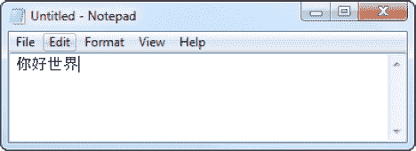

**图 6-7.** 中文的“你好世界”

#### 工作原理

许多书一开始就假设读者知道如何输入双字节字符。我假设我的大多数读者是美国人，因此可能从未体验过用中文、日语或韩语等双字节语言键入数据。

本配方作为在基于 Windows 的操作系统上设置输入法编辑器并使用它输入双字节字符的快速指南。您在本配方中看到的拼音输入法是用户输入中文字符的众多方式之一，在本例中，是通过输入其罗马字母的语音等效字符。

### 6-2. 支持双字节数据输入

#### 问题

您在 APEX 中创建的一个表单要求用户用日语等双字节语言键入数据。


#### 解决方案

此解决方案包含两个步骤。首先，您必须创建示例对象（这些对象也将用于本章的其他配方）。然后，您将在这些示例对象之上创建应用程序。

### 步骤 1：创建示例对象

您将创建的示例对象是 `MYCUSTOMERS` 表。通过 SQL 工作坊执行 清单 6-1 来创建它。请注意，表列被定义为 `NVARCHAR2`，这是 Oracle 的 `VARCHAR2` 的国家语言版本。

**清单 6-1.** 创建示例对象

```sql
CREATE table "MYCUSTOMERS" (
    "CUSTNAME"    NVARCHAR2(255),
    "CUSTREMARKS" NVARCHAR2(2000),
    "CUSTID"      NVARCHAR2(50),
    constraint  "MYCUSTOMERS_PK" primary key ("CUSTID")
)
/
```

### 步骤 2：创建并运行应用程序

现在，创建并运行应用程序以输入一些日文文本。请遵循以下步骤：

1.  创建一个新应用程序。在此应用程序中，基于 `MyCustomers` 表创建一个新表单和交互式报表。
2.  运行表单。使用日文输入法编辑器（IME），输入一些日文文本，如 图 6-8 所示。点击“创建”按钮保存数据。

     **提示** 有关如何在表上创建带报表的表单的更多信息，请参阅配方 2-1 和 2-2。

    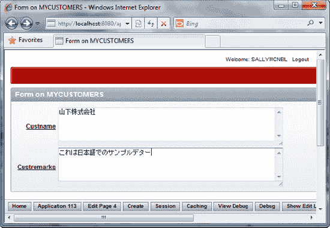

    **图 6-8.** 输入日文字符

3.  运行报表。您应该看到刚刚输入的日文文本，如 图 6-9 所示。

    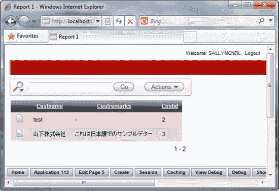

    **图 6-9.** 在数据库中查看日文字符

#### 工作原理

东亚语言使用双字节格式。为了支持双字节数据，数据库表中的字段必须使用带 N 前缀的数据类型来定义。例如，您必须使用 `NVARCHAR2` 而不是 `VARCHAR2`，使用 `NCHAR` 而不是 `CHAR`。

对于其他语言，如西班牙语、德语或意大利语（它们是单字节字符语言），您不需要使用带 N 前缀的数据类型。这将有助于节省数据库空间，因为正如您可能猜到的，带 N 前缀的数据类型在数据库中占用双倍的空间。

### 6-3. 将您的用户界面翻译成另一种语言

#### 问题

根据浏览器的语言偏好设置，您需要您的应用程序以应用程序用户对应的首选语言显示用户界面（所有标签、消息、名称和字段标题）。

#### 解决方案

要将您的应用程序 UI 翻译成另一种语言，请遵循以下步骤：

*   设置全球化属性。
*   映射到已翻译的应用程序。
*   将可翻译文本植入翻译存储库。
*   导出 XLIFF 文件。
*   翻译 XLIFF 文件。
*   导入 XLIFF 文件。
*   发布已翻译的应用程序。
*   测试您的已翻译应用程序。

### 步骤 1：设置全球化属性

执行以下步骤来为应用程序设置全球化属性。这些步骤使用配方 6-1 中的应用程序作为示例基础。

1.  打开您在配方 6-1 中创建的应用程序，然后点击“共享组件”图标。
2.  在页面底部，“全球化”部分下，点击“全球化属性”链接（如 图 6-10 所示）。

    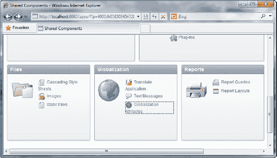

    **图 6-10.** 全球化属性设置

3.  将“应用程序主语言”设置为 English（英语），并将“应用程序语言来源”字段设置为 Browser（浏览器）（使用浏览器语言偏好），如 图 6-11 所示。

    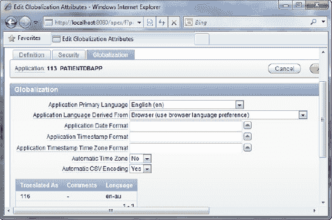

    **图 6-11.** 设置应用程序的主语言

4.  完成后点击“应用更改”按钮。

### 步骤 2：映射到已翻译的应用程序

要将您的主语言应用程序映射到已翻译的应用程序，请遵循以下步骤：

1.  返回“共享组件”页面。这次，点击“翻译应用程序”链接（也在“全球化”部分）。
2.  您现在将看到一个类似 图 6-12 的页面。

    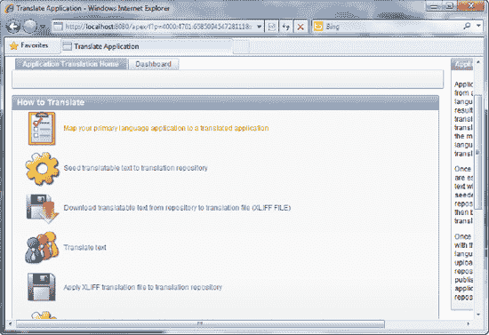

    **图 6-12.** 翻译应用程序的各个步骤

3.  点击第一个链接，“将您的主语言应用程序映射到已翻译的应用程序。”
4.  点击“创建”按钮创建新映射。在随后出现的向导弹窗中，为“翻译应用程序”字段输入任何唯一的整数值。
5.  对于语言代码，将语言设置为冰岛语 (`is`)，图像目录设置为 `is`。您可以指定一些注释（如果需要），但这是可选的。您应该看到类似 图 6-13 的内容。

    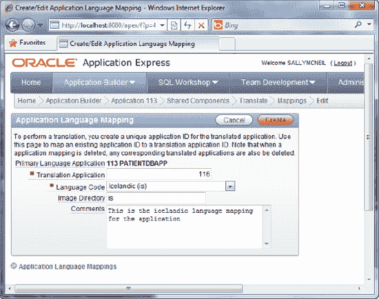

    **图 6-13.** 定义应用程序语言映射

6.  点击“创建”按钮。您将在以下页面中看到创建的映射记录（如 图 6-14 所示）。

    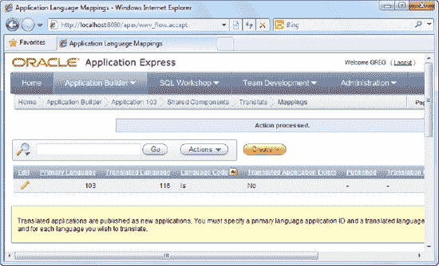

    **图 6-14.** 创建的映射记录

### 步骤 3：将可翻译文本植入翻译存储库

要将您的主语言应用程序映射到已翻译的应用程序，请遵循以下步骤：

1.  返回主“翻译”页面。点击 图 6-15 中显示的第二个链接，“将可翻译文本植入翻译存储库。”

    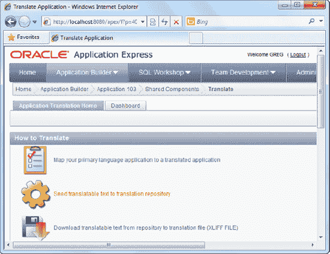

    **图 6-15.** 将可翻译文本植入翻译存储库

2.  在向导中，从“语言映射”字段的下拉列表中选择“（您的主语言应用程序 ID） >>116 (is)”条目，然后点击“下一步”继续。值 116 指的是“待翻译的”应用程序 ID。
3.  点击“植入可翻译文本”按钮以完成向导。
4.  您应该会看到植入过程的简要摘要，如 图 6-16 所示。

    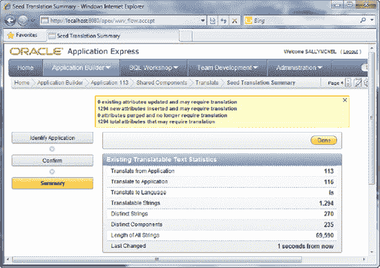

    **图 6-16.** 植入统计

### 步骤 4：导出 XLIFF 文件

要将应用程序中使用的文本资源导出到 XLIFF 文件，请遵循以下步骤：

1.  返回主“翻译”页面。点击 图 6-17 中显示的第三个链接，“从存储库下载可翻译文本到翻译文件（XLIFF FILE）。”

    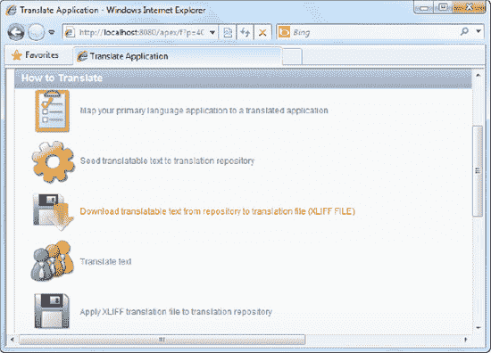

    **图 6-17.** 导出到 XLIFF 文件

2.  在随后的配置页面中，您需要下载整个应用程序的 XLIFF 文件。将“应用程序翻译”字段设置为“（您的主语言应用程序 ID） >>116 (is)”条目。
3.  确保选中“包含 XLIFF 目标元素”复选框。
4.  选择导出所有可翻译元素，如 图 6-18 所示。

    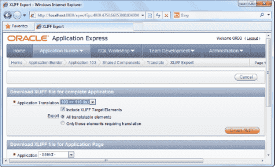

    **图 6-18.** 选择翻译映射

5.  点击“导出 XLIFF”按钮。您可能需要等待几秒钟才能看到下一个提示。提示出现时，您将可以选择下载生成的 XLIFF 文件，如 图 6-19 所示。

    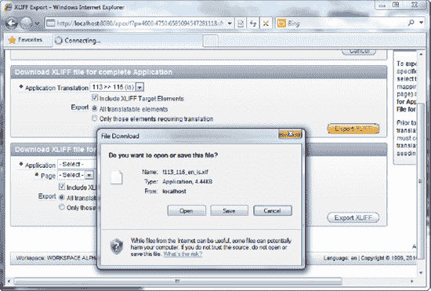

    **图 6-19.** 导出 XLIFF 文件

6.  将 XLIFF 文件保存到您 PC 上的任何位置。


