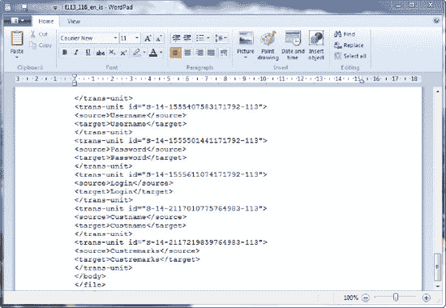
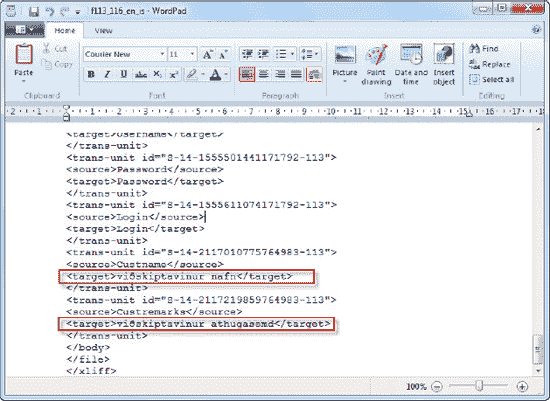

# 步骤 4：翻译 XLIFF 文件

要翻译 XLIFF 文件，请遵循以下步骤：

1.  XLIFF 文件是一个便捷的小文件，包含了你的应用程序使用的所有文本、消息、标签和名称资源。
2.  你通常可以将 XLIFF 文件发送给现实中的翻译人员来翻译其内容。XLIFF 格式是一个开放标准，你可以找到许多 XLIFF 编辑器工具，允许你窥探文件内容并手动编辑。
3.  使用像写字板这样的文本编辑工具打开下载的 XLIFF 文件。
4.  你应该能看到生成的 XML 及其多个翻译条目，如 图 6-20 所示。

    

    **图 6-20.** 窥探 XLIFF 文件内容

5.  每个翻译条目都具有 清单 6-2 中所示的格式。`source` 字段代表原始未翻译文本，`target` 字段代表翻译后的文本。

    **清单 6-2.** 翻译条目格式

    ```
    <trans-unit id="XXXXX">
              <source>Custname</source>
              <target>Custname</target>
    </trans-unit>
    ```
6.  找到 `Custname` 条目，并将其 `<target>` 条目更改为对应的冰岛语：`viðskiptavinur nafn`。将 `Custremarks` 的 `<target>` 条目更改为 `viðskiptavinur athugasemd`，如 图 6-21 中高亮显示的部分。

     **注意** 可能会有多个 `Custname` 和 `Custremarks` 条目，特别是如果你在应用程序中为不同的对象使用了相同的名称。如果不确定应该编辑哪一个，请务必留意对象 ID（由 `<trans-unit>` 标签的 `ID` 属性指示）。这些标识符映射到应用程序中的实际对象 id。

    

    **图 6-21.** 手动翻译

7.  保存你所做的更改。

