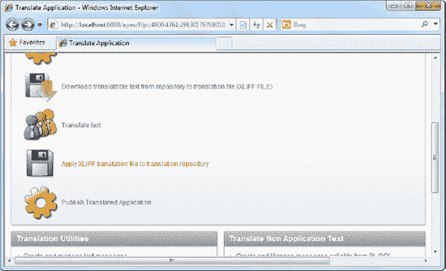
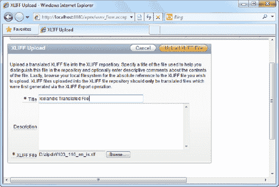
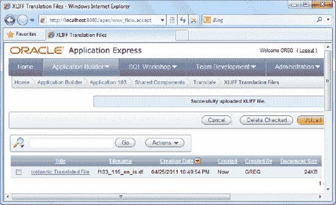

# 步骤 5：导入翻译后的 XLIFF 文件

要将翻译后的 XLIFF 文件重新导入 APEX，请遵循以下步骤：

1.  返回主翻译页面。点击 图 6-22 中显示的第五个链接，“应用 XLIFF 翻译文件到翻译存储库”。

    

    **图 6-22.** 导入翻译后的 XLIFF 文件

2.  在随后出现的窗口中，点击 `Upload XLIFF` 按钮。将弹出一个向导，允许你上传翻译后的 XLIFF 文件。指定你想要的任何标题，并浏览到你电脑上的翻译后的 XLIFF 文件。完成后点击 `Upload XLIFF file` 按钮，如 图 6-23 所示。

    

    **图 6-23.** 导入 XLIFF 文件

3.  你应该在下一个窗口中看到你上传的 XLIFF 文件（见 图 6-24）。

    

    **图 6-24.** 已上传的 XLIFF 文件

