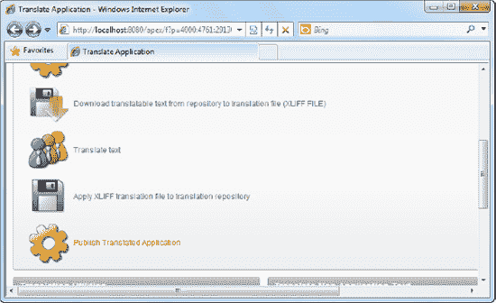
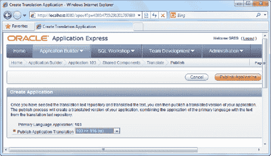

# 步骤 6：发布翻译后的应用程序

要发布翻译后的应用程序，请遵循以下步骤：

1.  返回主翻译页面。点击 图 6-25 中显示的最后一个链接，“发布翻译后的应用程序”。

    

    **图 6-25.** 发布翻译后的应用程序

2.  在随后的页面中，将 `Publish Application Translation` 字段设置为冰岛语映射，并点击 图 6-26 中显示的 `Publish Application` 按钮。

    

    **图 6-26.** 发布应用程序翻译

3.  你现在已成功创建了一个（或多或少）冰岛语版本的应用程序。

