# 步骤 7：测试翻译后的应用程序

要试用你翻译后的应用程序，请遵循以下步骤：

1.  如果你记得，你将全球化属性设置为使用浏览器首选项设置中指定的语言。要试用你翻译后的应用程序，你现在需要将浏览器首选项设置为以冰岛语渲染页面。

     **注意** 此处显示的示例适用于 Microsoft Internet Explorer 浏览器。其他浏览器的屏幕截图和步骤可能有所不同，因此请参阅你的浏览器关于语言首选项设置的文档。

2.  打开 Internet Explorer 并导航到“Internet 选项”窗口。在“常规”选项卡中，点击底部的“语言”按钮。向列表中添加一种新语言：冰岛语 [is]。调整其首选项顺序，使冰岛语成为最顶部的条目，如 图 6-27 所示。

    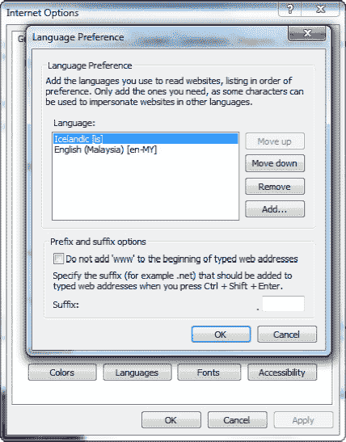

    **图 6-27.** 更改浏览器语言首选项

3.  保存并应用所有更改。现在再次运行你的应用程序。你应该看到表单使用你指定的冰岛语字段标题呈现，如 图 6-28 所示。

    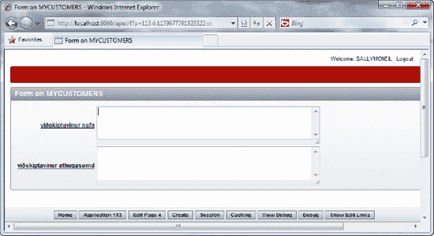

    **图 6-28.** 冰岛语的客户页面

#### 工作原理

要将应用程序翻译成另一种语言，你必须首先提取应用程序中使用的所有资源——即错误消息、标签、字段标题等——到一个 XML 文件中。该文件称为 XLIFF 文件。XLIFF 文件可以发送给现实中的翻译人员，每个条目都会被翻译。然后，生成的 XLIFF 文件被重新导入 APEX，APEX 将使用 XLIFF 文件中的翻译文本来生成一个新应用程序。

本示例中仅翻译了 XLIFF 文件中的两个条目。如果你希望整个应用程序 100% 使用冰岛语，你将需要翻译文件中的每一个条目，包括表单和报表名称、错误消息等。

### 6-4. 存储和显示带时区信息的日期

#### 问题

你有一个需求，需要生成一份报告，列出世界各地不同时区发生的事件。此外，该报告将由来自不同国家和时区的用户查看。你需要根据访问用户的本地时区来显示日期和时间。


#### 解决方案

您首先需要为这个示例创建一个数据表及一些数据。运行清单 6-3 中的 SQL 语句来创建一个`EVENTS`表，并添加几个测试用的事件。

**清单 6-3.** 用于创建`EVENTS`表及一些事件的 SQL

```sql
CREATE TABLE  "EVENTS"
   (    "EVENTLAUNCHDATE" TIMESTAMP (6) WITH LOCAL TIME ZONE,
        "EVENTNAME" NVARCHAR2(255),
        "EVENTID" NVARCHAR2(50),
        CONSTRAINT "EVENTS_PK" PRIMARY KEY ("EVENTID") ENABLE
   )
/
INSERT INTO EVENTS(EVENTID,EVENTLAUNCHDATE,EVENTNAME) VALUES(1,'22-APR-11 08:00:00 AM','GLOBAL SALES EVENT')
/
INSERT INTO EVENTS(EVENTID,EVENTLAUNCHDATE,EVENTNAME) VALUES(2,'23-APR-11 04:00:00 PM','PROJECT KICKOFF MEETING')
/
```

接下来，您需要创建报表来显示事件信息。请按照以下步骤操作：

1.  打开一个现有应用程序。
2.  在应用程序页面中点击`共享组件`图标。
3.  在`全球化`部分下，点击`全球化属性`链接，如图 6-29 所示。

    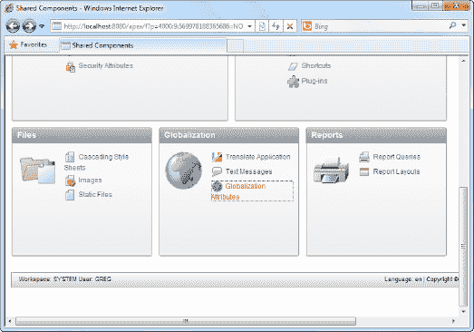

    **图 6-29.** 修改全球化属性

4.  在随后的页面中，将`自动时区`字段从`否`更改为`是`，如图 6-30 所示。

    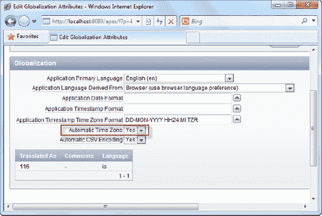

    **图 6-30.** 启用自动时区功能

5.  保存您的更改。现在，在应用程序中创建一个新报表。对于报表的 SQL 查询，请指定以下 SQL：`SELECT * FROM Events`
6.  完成创建报表的向导。之后，编辑报表定义，并选择编辑报表的`EVENTLAUNCHDATE`列，如图 6-31 所示。

    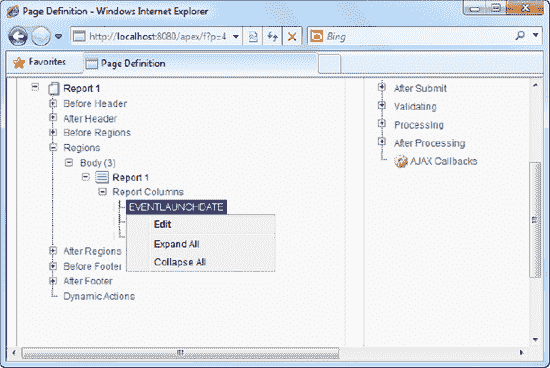

    **图 6-31.** 修改事件启动日期列

7.  将日期/时间格式字段更改为：`DD-MON-YYYY HH24:MI TZR`（如图 6-32 所示）。

    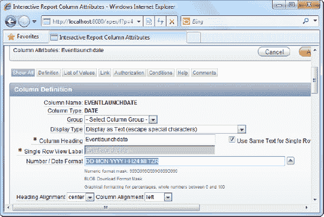

    **图 6-32.** 更改数字/日期格式

8.  保存您的更改并运行报表。您会立即注意到，报表中的日期和时间数据旁边显示了您本地的时区（参见图 6-33）。

    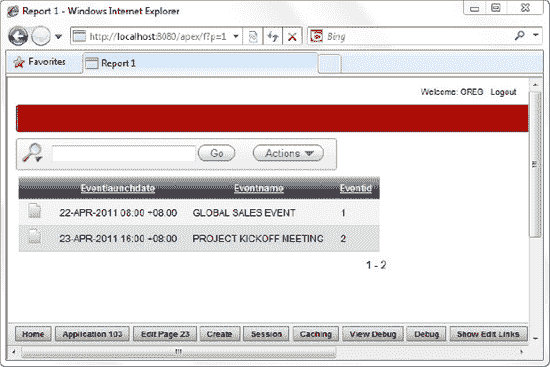

    **图 6-33.** 马来西亚（吉隆坡）时区中的日期和时间

9.  从应用程序中注销。进入您的 Windows 操作系统日期/时间设置，将您的本地时区更改为另一个不同的时区。假设您现在住在塔什干，其时区为`UTC+05:00`。
10. 再次登录到您的`APEX`应用程序。您会注意到，日期和时间数据已自动调整为反映塔什干的本地时区，如图 6-34 所示。

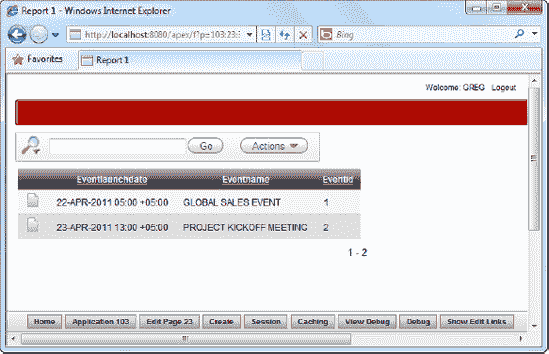

**图 6-34.** 塔什干时区中的日期和时间

#### 工作原理

启用时区支持非常简单，只需在表中使用`TIMESTAMP WITH LOCAL TIME ZONE`数据类型，并在应用程序设置中将`自动时区`支持设置为`是`即可。当您这样做时，`APEX`会在会话中捕获您的本地时区信息，并在每次请求时传输该信息，以便在将日期/时间值保存到数据库之前进行必要的调整。

## 第 7 章 提高应用程序性能

性能一直是快速应用程序开发（RAD）领域的一个重要问题。大多数开发者通常都持相同的观点：如果创建应用程序如此快速简便，那么开发者就不得不在工具的灵活性或应用程序性能方面“付出代价”。

虽然这对于其他集成度较低的 RAD 工具可能确实如此（而对于`APEX`来说，这种影响要小得多），但还没有其他 RAD 工具能像`APEX`这样。`APEX`中的整个业务逻辑层都是用`PL/SQL`编写的，因此在数据库上下文中执行——这带来了比其他工具好得多的性能。事实上，`APEX`通常用于托管关键任务应用程序。`APEX`平台已被用于处理新加坡一个电子商务网站每天成千上万的在线交易，用于创建一个处理乌克兰数百万选民的应用程序，并用于处理马来西亚全国路演期间每小时捕获的数千条销售线索和机会。关键点在于：`APEX`性能足以处理使用密集型的场景。

然而，通过缓存、SQL 查询设计和最佳实践的结合，可以进一步优化`APEX`性能。本章中的示例将让您了解如何实现这种性能提升。

### 7-1. 测量页面访问频率

#### 问题

并非应用程序中的每个页面都对性能至关重要。在开始任何性能调优任务之前，您需要了解哪些页面需要进行性能调优——即最终用户访问最频繁的那些页面。

#### 解决方案

要使用`监控活动`工具测量页面访问频率，请遵循以下说明：

1.  登录`APEX`并点击大的`管理`图标。
2.  您应该看到四个图标，其中两个标记为`监控活动`和`仪表板`（如图 7-1 所示）。

    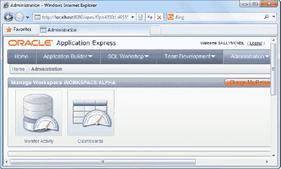

    **图 7-1.** `监控活动`图标

3.  点击`监控活动`图标。向下滚动到`页面视图分析`部分，然后点击`所有应用程序中最常查看的页面`链接。
4.  您将看到一个视图，其中包含工作区中的每个页面和应用程序，以及`计数`列中的访问频率（如图 7-2 所示）。您可以看到`PATIENTDBAPP`应用程序中的`MYCUSTOMERS`页面是访问最频繁的页面，有八次查看。

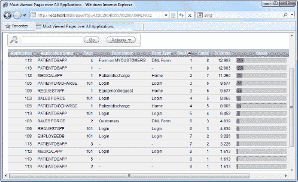

**图 7-2.** 应用程序中每个页面的访问频率

 **提示** 您系统上的页面访问计数可能会有所不同，因为它取决于您实际查看每个相应页面的次数。

#### 工作原理

`监控活动`工具提供了与`APEX`应用程序执行相关的丰富诊断信息。`页面视图分析`部分提供了应用程序使用情况统计的全局视图。表 7-1 描述了其中一些图表及其用途。您的解决方案选择了`所有应用程序中最常查看的页面`图表，从而获得了应用程序中最常用页面的列表。

**表 7-1.** `页面视图分析`部分中的使用情况统计图表

| **图表** | **描述** |
| --- | --- |
| `所有应用程序中最常查看的页面` | 显示所有页面/应用程序的完整列表及其访问频率。这对于找出应用程序中访问最频繁的页面非常有用。 |
| `按日排列的页面视图月度日历` | 按日期（在可视日历上填充）显示访问频率（及用户数）。此视图可用于确定单个月内的使用高峰以及任何一天访问您应用程序的用户数量。 |
| `每日使用情况折线图` | 此图以每日或每小时的时间尺度，以折线图形式显示总页面访问频率。此视图对于精细监控使用高峰非常有用。 |
| `按加权页面性能` | 此图显示所有应用程序中每个页面的平均页面渲染时间。此视图有助于衡量应用程序中每个单独页面的性能。 |

### 7-2. 在 APEX 中测量页面性能

#### 问题

您现在知道了应用程序中哪些页面是重要的。现在您想要测量这些页面中每个页面的性能（以渲染时间计）。您希望将时间花在渲染时间最长的页面上，从而最大化优化工作的回报。


#### 解决方案

要测量页面性能，请按以下步骤操作：

1. 登录 APEX 并点击大型的"管理"图标。点击"监视活动"图标，并导航至"页面视图分析"部分。
2. 向下滚动到"页面视图分析"部分，点击"按加权页面性能"链接。
3. 在"自"下拉列表中，设置所需的时间范围以收集统计信息。如果您最近访问过应用程序中的任何页面，您应该会看到如图 7-3 所示的截图。您可以在"平均耗时"列下看到渲染每个特定页面所花费的平均时间。

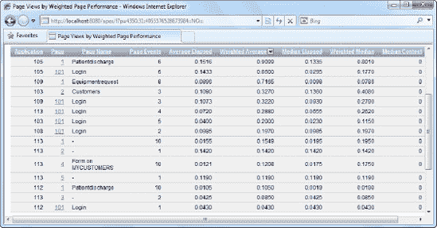
`图 7-3.` 测量页面性能

#### 工作原理

"按加权页面性能显示页面视图"页面显示了应用程序中每个独立页面的平均执行统计数据。此报告显示了几项不同的信息，这些信息在表 7-2 中描述。

`表 7-2.` 页面执行统计信息

| **列名** | **描述** |
| --- | --- |
| `平均耗时` | 显示页面执行所花费的平均时间（以秒为单位）。 |
| `加权平均值` | 每个页面由页面呈现和处理事件组成，这些事件可能影响渲染页面所需的时间量。加权平均值将平均渲染时间乘以页面上的事件数量。 |
| `中位数耗时` | 此列显示每个页面平均渲染时间的中位数。这提供了更接近页面实际渲染耗时的准确读数。 |
| `加权中位数` | （每个页面的）加权中位数是中位数耗时乘以每个页面中的事件数量。 |

这些数字特别有用，因为它们使您能够放大需要性能优化的页面。例如，以下是一系列您可以作为优化策略采取的步骤：

4. 按中位数耗时对所有页面排序，并记下所有超过特定阈值的页面。考虑根据您的企业目标推导该阈值。例如，您的服务质量声明可能包括在不到三秒的时间内向最终用户交付每个页面。这样的目标将让您缩小到一个更小、更易于管理的页面子集进行优化。
 **提示** 值得注意的是，新加坡政府发布的 IT 项目公开招标书通常将三秒最大响应时间列为基于 Web 的应用程序的要求之一。
5. 查看"页面事件"值。仅凭中位数耗时并不是页面性能的良好指标。查看"页面事件"列将让您做出更好的评估，因为页面事件的数量大致与页面的复杂性相关。例如，一个需要三秒加载的页面，如果该页面有 20 个事件，而另一个需要一秒加载的页面只有 1 个事件，那么前者实际上可能比后者具有更好的性能效益。

### 7-3. 在 APEX 中测量区域性能

#### 问题

您现在知道了每个页面的平均耗时。您希望进一步深入分析特定页面中每个独立区域的性能。与前面的方案类似，您的目标是将优化工作集中在那些消耗时间最多的页面和区域上。

#### 解决方案

要测量区域性能，请按以下步骤操作：

1. 登录 APEX 并打开任意包含报表的应用程序。（要创建报表页面，请参阅方案 2-2）。导航至报表页面的"页面呈现"视图。
2. 展开"区域"节点，并右键单击此节点下的任意区域。在弹出菜单中单击"编辑"菜单项（如图 7-4 所示）。
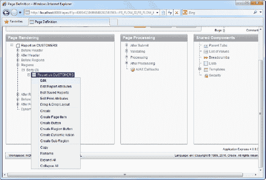
`图 7-4.` 编辑报表区域
3. 在"编辑区域"页面中，单击"页眉和页脚"选项卡。在"区域页脚"部分，输入以下行：
```
#ROWS_FETCHED# 行已提取（总共 #TOTAL_ROWS# 行），耗时 #TIMING# 秒
```
4. 您现在应该会看到如图 7-5 所示的截图。
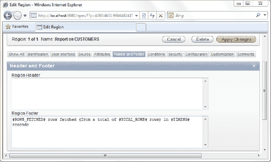
`图 7-5.` 在区域页脚指定替换字符串以收集性能统计信息
5. 应用您的更改并运行报表。您应该会注意到报表区域底部新增了一行，它为您提供了运行查询和渲染该区域（及其包含的项目）所花费的总时间，如图 7-6 所示。

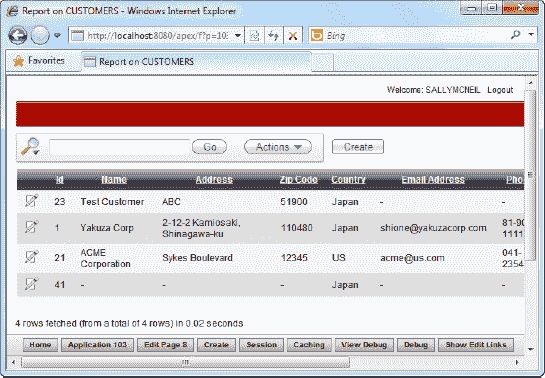
`图 7-6.` 在区域页脚显示的性能统计信息

#### 工作原理

一个页面可能包含多个区域；有些区域可能已经过性能优化，但其他区域则没有。在专注于逐页优化时，通过对页面中的各个组件（区域）进行快速评估来进一步分解问题非常有用。
最好的方法是捕获并打印每个区域的性能统计信息。这个简单的步骤将为您提供页面中所有区域的实际运行时统计信息——并立即揭示出给您带来性能问题的特定区域。Oracle APEX 提供了表 7-3 中描述的替换字符串，以提供性能统计信息的实时信息。

`表 7-3.` 用于收集性能统计信息的实用替换字符串

| **替换字符串** | **描述** |
| --- | --- |
| `#TIMING#` | 显示渲染特定区域所用的耗时（以秒为单位）。 |
| `#TOTAL_ROWS#` | 显示特定区域中的特定 SQL 查询检索到的总行数。 |
| `#ROWS_FETCHED#` | 显示 APEX 从查询中为显示而提取的总行数。 |

您可以将这些替换字符串放置在页面的多个区域中，以找出每个区域的渲染耗时。这将使您能够找到性能不佳的区域，并将性能调整工作集中在那里。
正如您在此方案中所看到的，这三部分信息对于剖析您的页面（和区域）这一目标来说是不可或缺的。重要的是要查看所有三个参数，而不仅仅是 `#TIMING#` 信息。
例如，考虑以下场景：`区域 A` 可能总共需要三秒来渲染，但这可能是由于需要提取 500 行进行显示，而 `区域 B` 虽然需要一秒来渲染，但仅提取了 100 行。在这种情况下，尽管 `区域 B` 的渲染时间更短，`区域 A` 的性能可能实际上比 `区域 B` 更好。因此，在决定一个区域是否需要性能优化时，您应该始终考虑所有三个参数。

### 7-4. 启用区域缓存

#### 问题

您有一个区域，它从数据库中检索固定/静态数据列表进行显示。您希望通过缓存此区域来提高其性能。


#### 解决方案

要启用区域缓存，请按照以下步骤操作：

1.  登录 `APEX` 并打开任何包含表单的应用程序。（如需创建表单页面，请参阅配方 2-1）。导航到表单页面的“页面渲染”视图。
2.  展开“区域”节点，右键单击此节点下的任意区域。在弹出菜单中单击“编辑”菜单项。这将带您进入“区域定义”页面。
3.  单击“缓存”选项卡。将“缓存”下拉列表从“未缓存”更改为“已缓存”。
4.  您将看到若干字段。将缓存的超时值（区域应保持缓存的时间）设置为 `1` 小时，并将“缓存条件类型”设置为“始终”，如图 7-7 所示。

    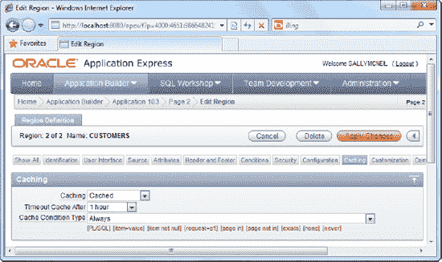

    `图 7-7.` 在页面区域中启用缓存

5.  现在运行您的表单。如果您在区域页脚中包含 `#TIMING#` 统计信息，您会观察到连续运行时渲染区域所花费的时间减少了。

#### 工作原理

应用程序中的页面几乎不可避免地需要处理动态查询、Web 服务调用等。例如，如果您需要调用远程 Web 服务来获取水果列表以在某个区域显示，这将等同于大量的调用！想象一下，如果有 2000 名用户加载此页面——这将产生 2000 次 Web 服务调用。

如果 Web 服务检索到的内容完全相同或很少更改（例如，分支机构联系电话），那么将这些信息缓存起来将是理想的选择，这样 Web 服务只需调用一次。然后，检索到的数据将存储在本地。当下一个用户请求相同数据时，它将从本地存储中获取，而不是再次调用 Web 服务。

当您缓存一个区域时，您正是在做这件事。整个区域的静态 HTML（生成的内容）可以由 `APEX` 缓存，因此当下一个用户渲染该区域时，它将直接从本地缓存存储中获取静态 HTML。这节省了大量的处理周期，甚至可以显著减少网络流量（通过减少对物理上远程系统的动态调用次数）。您可以通过将“缓存”属性设置为 `true` 来选择缓存表单的特定区域。如果您希望始终应用缓存，请选择“始终”条件类型。

您可以明确指定应从缓存中检索数据而不是进行动态渲染的条件。“缓存条件类型”下拉列表允许您指定此条件。例如，如果您正在创建一个在线礼品订购应用程序，您可能希望创建一个检查系统日期的条件，以便仅在十二月应用缓存，因为此时可以预期会有大量假日购物者访问。

## 7-5\. 启用页面缓存

#### 问题

您有一个主要由静态数据组成的页面。您希望提高此页面的渲染性能。

#### 解决方案

与区域缓存相反，页面缓存会缓存整个页面的静态 HTML。要启用页面缓存，请按照以下步骤操作：

1.  登录 `APEX` 并打开任何包含表单的应用程序。（如需创建表单页面，请参阅配方 2-1）。导航到表单页面的“页面渲染”视图。
2.  右键单击根节点，并在弹出菜单中选择“编辑”菜单项。这将带您进入“页面定义”页面。
3.  单击“缓存”选项卡。将“缓存”下拉列表从“否”更改为“是”。
4.  您现在应能将缓存的超时值（区域应保持缓存的时间）设置为 `1` 小时，并将“缓存条件类型”设置为“始终”，如图 7-8 所示。

    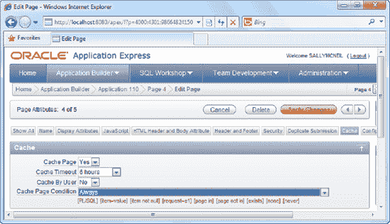

    `图 7-8.` 在页面中启用缓存

5.  现在运行您的表单。如果您使用“活动监控”工具检查页面的加权性能，您会观察到连续运行时渲染页面所花费的时间减少了。

#### 工作原理

缓存不仅适用于区域级别，也适用于页面级别。页面缓存与区域缓存的不同之处在于，它缓存整个页面的静态 HTML。如果您对页面的目标只是显示一些很少更改的静态信息，那么它非常适合进行页面缓存。

“按用户缓存”设置允许按用户缓存页面，而不是按会话缓存。区别在于，如果您按会话缓存页面，所有其他用户将使用缓存中的同一副本；而如果您按用户缓存页面，则只有首次访问该页面的相同用户再次访问时，才会从缓存中检索数据。

 **提示** 页面缓存的一个问题是，有时缓存页面的数据可能已经更改，而 `APEX` 仍在检索缓存副本。在这种情况下，根据某个事件使缓存失效可能是有益的。例如，您可以在用户退出应用程序后或在一段不活动时间后，使用 `APEX_UTIL.CLEAR_PAGE_CACHE(page_number);` 函数使缓存失效。

## 第 8 章

## 保护应用程序安全

您基于 `APEX` 构建的应用程序默认并不会神奇地防黑客。即使是像 `APEX` 这样严格的平台也存在一些安全问题。在 `APEX` 中，这些问题通常围绕三个主要领域：身份验证、授权和漏洞利用。

身份验证是指检查用户是否有权访问（登录）应用程序的过程。这通常通过用户名-密码质询来完成。授权是为每个用户指定对应用程序中特定资源访问权限的过程。例如，授权方案可能允许用户查看报告但不允许删除。最后，安全漏洞利用——例如 SQL 注入攻击和跨站脚本攻击——其工作前提是巧妙地操纵输入数据，使其最终由您的应用程序执行。

好消息是，`APEX` 提供了充足的功能和分配来优雅地处理所有这三个问题。在本章中，您将学习如何加强应用程序的安全性。

### 8-1\. 创建您自己的身份验证方案

#### 问题

您有一个现有的数据库表，其中包含组织内所有用户的列表及其密码。此数据库表是您组织的专有自定义表。您试图说服您的上司将用户帐户列表从自定义表迁移到 `APEX` 中，但他们坚持要求您的应用程序针对此表进行实时身份验证。

因此，您着手处理此任务。您希望创建一个自定义身份验证方案，以针对此外部数据库表对您的 `APEX` 应用程序进行身份验证。

#### 解决方案

你的首要任务是创建本教程中使用的数据库对象。要创建自定义登录表（及示例记录），请运行以下 SQL：

```sql
CREATE TABLE "CUSTOMLOGINS"
  (     "USERID" VARCHAR2(50),
        "USERNAME" VARCHAR2(255),
        "PASSWORD" VARCHAR2(255),
         CONSTRAINT "CUSTOMLOGINS_PK" PRIMARY KEY ("USERID") ENABLE
  )

INSERT INTO CUSTOMLOGINS(USERID,USERNAME,PASSWORD) VALUES('01','greg','1234')
/
INSERT INTO CUSTOMLOGINS(USERID,USERNAME,PASSWORD) VALUES('02','zehoo','7890')
/
```

你的下一个任务是定义实际的认证函数本身。你将创建一个非常简单的认证函数，它仅检查指定的用户名和密码是否存在于表中。如果存在，则授予访问权限。要创建此函数，请打开 SQL 工作坊，并运行清单 8-1 中所示的 PL/SQL。

`清单 8-1. 定义认证函数`

```sql
CREATE OR REPLACE FUNCTION MyCustomAuthenticator (
  p_username IN VARCHAR2,
  p_password IN VARCHAR2
)
  RETURN BOOLEAN
IS
  l_count NUMBER;
BEGIN
   SELECT COUNT(*) into l_count from CUSTOMLOGINS WHERE Username=p_username AND
        Password=p_password;
   IF l_count > 0 THEN
      RETURN TRUE;
   ELSE
      RETURN FALSE;
   END IF;
END;
```

你的下一个任务是定义一个新的认证方案。为此，请按照以下步骤操作：

1.  打开一个现有应用程序并单击“共享组件”(Shared Components)图标。
2.  在“安全性”(Security)部分下，单击“认证方案”(Authentication Schemes)链接，如图 8-1 所示高亮显示。

    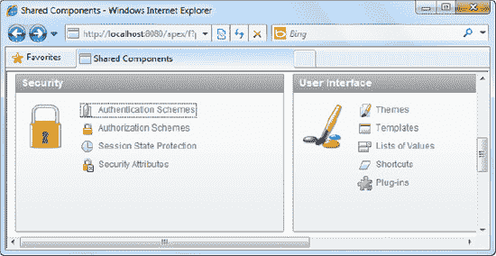

    `图 8-1. 认证方案链接`

3.  在随之出现的页面中，单击“创建”(Create)按钮以创建新的认证方案。
4.  在向导的第一步中，选择从头开始创建方案。
5.  在下一步中，将你的认证方案命名为 `MYCUSTOMAUTH_SCHEME`。
6.  单击“下一步”(Next)按钮，直到到达“认证函数”(Authentication Function)步骤。
7.  在此屏幕中，选择“使用我的自定义函数进行认证”(Use my custom function to authenticate)选项。这将导致在选项底部出现一个“认证函数”(Authentication Function)文本框。
8.  在文本框中键入以下文本：`return MyCustomAuthenticator`。如图 8-2 所示。

    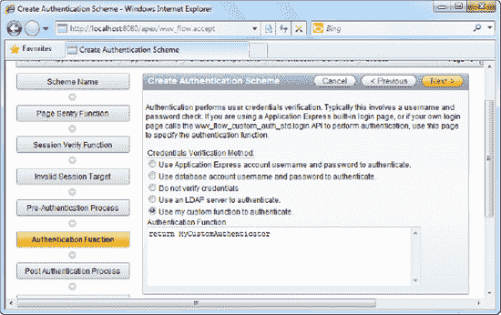

    `图 8-2. 定义认证函数调用`

9.  使用提供的默认设置完成向导的其余部分。
10. 回到“认证方案”(Authentication Schemes)页面，你应该会看到新创建的认证方案。现在你需要将其设置为应用程序的当前认证方案。
11. 在认证方案页面中，单击“更改当前”(Change Current)选项卡。从下拉列表中选择 `MYCUSTOMAUTH_SCHEME` 方案，如图 8-3 所示。

    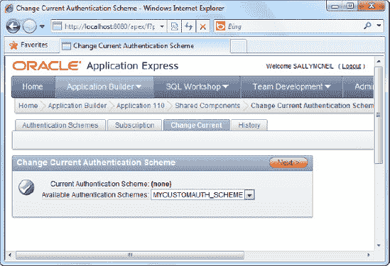

    `图 8-3. 设置当前认证方案`

12. 单击“设为当前”(Make Current)按钮以完成向导并进行更改。
13. 现在运行应用程序中的登录表单。尝试输入随机的用户名和密码。你会发现无法登录应用程序，如图 8-4 所示。

    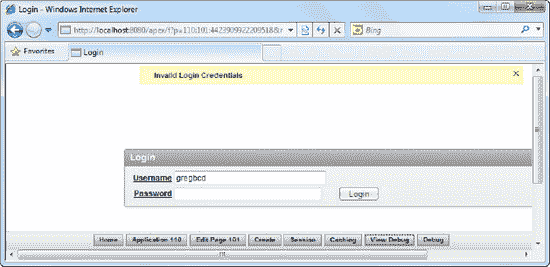

    `图 8-4. 访问被拒绝`

14. 但是，如果你指定用户名 `greg` 和密码 `1234`，你会发现可以成功登录应用程序。这证明登录页面现在使用的是你的自定义认证方案。

#### 工作原理

APEX 足够灵活，允许你修改应用程序底层的认证机制。本教程中所示的方法使用了一个非常简单的认证函数（在 PL/SQL 中硬编码了用户名和密码）；然而，本教程的目的是让你了解如何将认证机制从 APEX 的默认设置切换到自定义设置。

 **注意** 使用 APEX 灵活的认证框架，你可以创建方案以针对 LDAP 存储进行认证，或者指定在你的应用程序中根本不进行认证。你可以在认证方案的属性区域更改这些设置。

让我们进一步了解 PL/SQL 认证函数是如何工作的。此函数的骨架描述在清单 8-2 中。

`清单 8-2. 认证函数骨架`

```sql
CREATE OR REPLACE FUNCTION AuthenticationFunction (
  p_username IN VARCHAR2,
  p_password IN VARCHAR2
)
  RETURN BOOLEAN
AS
BEGIN
    /* 在此处执行你的操作，如果应授予访问权限则返回 TRUE，
       如果应拒绝访问则返回 FALSE。 */
END;
```

你可以修改此认证函数以执行你需要的任何操作。例如，你可以让该函数针对外部表运行一个 `SELECT` 查询，如果用户帐户存在，则从函数返回 `TRUE`。

事实上，没有什么能阻止你针对存储在文本文件中的用户名或密码进行实时认证（尽管这样做可能是个相当糟糕的主意）。然而，这让你了解了在 APEX 灵活的认证方案框架下可以达到的极端程度。

### 8-2. 定义用户访问权限

#### 问题

你有一个显示职位空缺记录列表的交互式报告。你希望允许 John 创建新的职位空缺记录，但不想给 Barry 相同的权限。换句话说，你需要为这个报告配置访问权限。

#### 解决方案

首先，您需要创建本教程中使用的示例对象。为此，请遵循以下步骤：
1.  创建如 代码清单 8-3 所示的示例 `Jobs` 表。
**代码清单 8-3.** 示例 Jobs 表
```sql
CREATE TABLE  "JOBS"
   (   "JOB_ID" VARCHAR2(10),
       "JOB_TITLE" VARCHAR2(35) CONSTRAINT "JOB_TITLE_NN" NOT NULL ENABLE,
       "MIN_SALARY" NUMBER(6,0),
       "MAX_SALARY" NUMBER(6,0),
        CONSTRAINT "JOB_ID_PK" PRIMARY KEY ("JOB_ID") ENABLE
  )
```
2.  使用代码清单 8-4 中的代码向此表中输入一些示例数据。
**代码清单 8-4.** Jobs 表中的示例数据
```sql
INSERT INTO JOBS(JOB_ID,JOB_TITLE,MIN_SALARY,MAX_SALARY) VALUES('AD_PRES','President',20000,40000)
INSERT INTO JOBS(JOB_ID,JOB_TITLE,MIN_SALARY,MAX_SALARY) VALUES('AD_VP','Administration Vice President',15000,30000)
```
3.  现在，创建一个新应用程序。在应用程序中，创建一个新表单，并选择 `Form on a Table with Report` 模板。
 **注意** 您可以参考教程 2-1 了解如何创建新应用程序和表单。
4.  当系统提示您为表单和报表指定基表时，选择 `Jobs` 表，如图 8-5 所示。
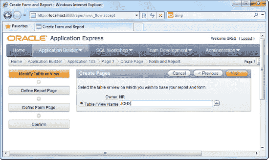
**图 8-5.** 为表单和报表选择基表
5.  使用提供的默认设置完成向导的剩余步骤，完成向导。
6.  从工作区注销，然后使用 `ADMIN` 帐户登录到 `INTERNAL` 工作区。导航到“管理工作区”  “现有工作区”。单击您之前正在使用的工作区，然后单击 `管理用户` 按钮。
7.  创建一个用户名为 `greg` 的新用户。为此帐户设置任何您想要的密码。

现在您已成功创建了示例对象，让我们继续创建授权方案。请遵循以下说明进行操作：
1.  打开您的应用程序并单击 `共享组件` 图标。
2.  在页面的安全区域，单击 `授权方案` 链接（在图 8-6 中高亮显示）。
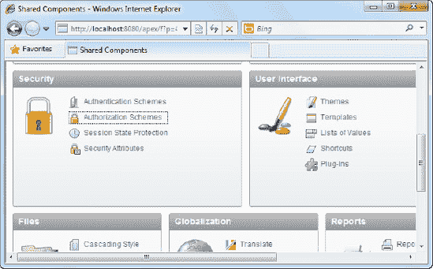
**图 8-6.** 授权方案链接
3.  在下一页，单击 `创建` 按钮以创建新的授权方案。
4.  当提示时，选择从头开始创建方案，如图 8-7 所示。
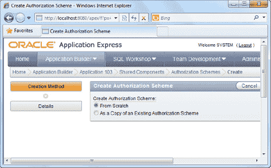
**图 8-7.** 从头开始创建授权方案
5.  在下一页，将您的授权方案命名为 `CHECKFORGREG`。
6.  选择 `存在 SQL 查询` 作为方案类型，并在“表达式 1”字段中输入以下 PL/SQL：`select 1 from jobs where LOWER(v('APP_USER')) = 'greg'`
7.  指定“方案被违反”作为方案违反错误消息。您现在应该看到如图 8-8 所示的屏幕。
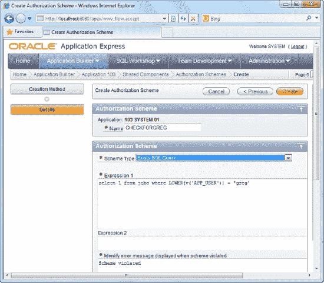
**图 8-8.** 定义授权方案
8.  单击 `创建` 按钮以创建授权方案。

现在您需要将授权方案应用到报表上。
1.  打开您在本教程中早先创建的 `Jobs` 报表。
2.  在报表的“页面呈现”区域，右键单击 `创建` 按钮，并选择编辑它，如图 8-9 所示。
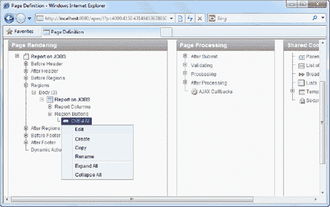
**图 8-9.** 修改“创建”按钮的设置
3.  在下一页，向下滚动到“安全性”部分，并为该按钮项选择 `CHECKFORGREG` 作为授权方案。如图 8-10 所示。
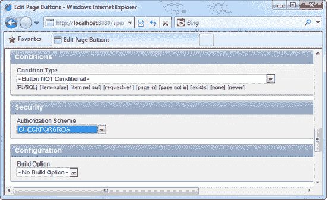
**图 8-10.** 为“创建”按钮设置授权方案
4.  保存您的更改并运行报表。如果您以 `greg` 身份登录应用程序，您将在报表的右上角看到 `创建` 按钮，如图 8-11 所示。
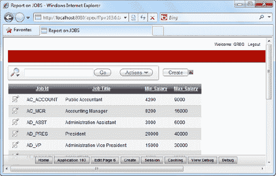
**图 8-11.** 对于名为 greg 的用户，“创建”按钮可见
5.  现在，从应用程序注销并以任何其他用户身份登录。您会注意到该用户看不到 `创建` 按钮，如图 8-12 所示。
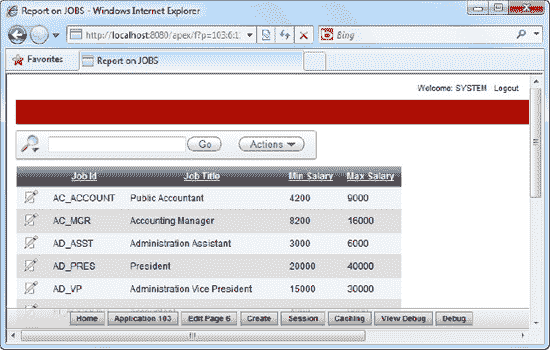
**图 8-12.** 对于名为 system 的用户，“创建”按钮消失

#### 工作原理

授权方案允许您定义一个条件（逻辑），该条件最终评估为真或假。然后，该授权方案可以应用于您应用程序中的任何元素，无论是报表列、报表上的按钮，甚至整个表单本身。当方案（您的逻辑）返回 true 时，当前用户被授予访问该元素的权限。如果返回 false，则当前用户被拒绝访问。

让我们仔细看看您之前创建的授权方案的配置。请注意您选择了 `存在 SQL 查询` 方案类型；这意味着如果您编写的 PL/SQL 返回了一条记录，则方案评估为 true（授予访问权限）。如果返回了一个空结果集，方案将评估为 false（拒绝访问）。

现在，让我们看看本教程前面的 PL/SQL：
```sql
select 1 from jobs where LOWER(v('APP_USER')) = 'greg'
```
 **提示** `v('APP_USER')` 是一个动态字段（称为内置替换字符串），它返回当前登录用户的用户名。APEX 中定义了其他内置替换字符串；APEX 中所有可用替换字符串的完整列表在此处：
[`http://download.oracle.com/docs/cd/B32472_01/doc/appdev.300/b32471/concept.htm#BEIIBAJD`](http://download.oracle.com/docs/cd/B32472_01/doc/appdev.300/b32471/concept.htm#BEIIBAJD)

您实际上定义了：如果当前用户的用户名是 `greg`，那么它会返回一些内容（这里您简单地返回 1，但也可以返回 `abc`，只要返回单条记录即可）。因此，您在本教程中创建的授权方案可以解释为：如果当前用户的用户名是 `greg`，则应授予他访问该元素的权限。

基于这个简单的概念，您可以对您的应用程序应用非常复杂的访问权限控制。例如，您可以创建一个 `员工` 报表，它向经理显示所有列，但在普通职员查看时隐藏 `当前薪水` 列。

 **提示** 在授权方案中硬编码数据（例如用户名 `greg`）仅用于演示目的，绝对不鼓励。您通常会在授权方案中做一些更有意义的事情，例如根据另一个数据库表等检查用户是否是经理或部门主管。

另外值得一提的是，授权方案的概念还提高了可重用性和易于维护性。它是可重用的，因为您可以在应用程序中的多个元素上重用相同的逻辑，而无需多次重写相同的逻辑。更重要的是，这使您更容易维护应用程序。例如，如果有一天逻辑发生变化，您需要在 PL/SQL 中包含一个额外的检查，您只需在一个地方更改它，它就会立即应用到所有使用该授权方案的元素上。

### 8-3. 防止 SQL 注入攻击

#### 问题

您有一个动态报表，显示系统中的客户列表。默认情况下，您的应用程序要求最终用户在从数据库中检索匹配的客户之前指定客户名称。一个 APEX 黑客已经通过 SQL 注入攻击设法检索了数据库中所有客户的完整列表。您希望保护您的应用程序免受未来类似攻击的影响。


#### 解决方案

首先，您需要设置复制攻击场景所需的示例表和表单。为此，请按照以下步骤操作：

1.  如果数据库中尚不存在清单 8-5 中所示的表，请创建它。

**清单 8-5。** 示例客户表

```sql
CREATE TABLE  "CUSTOMERS"
   (    "ID" NVARCHAR2(255) NOT NULL ENABLE,
        "NAME" NVARCHAR2(255),
        "ADDRESS" NVARCHAR2(2000),
        "ZIP_CODE" NVARCHAR2(6),
        "COUNTRY" NVARCHAR2(255),
        "EMAIL_ADDRESS" NVARCHAR2(255),
        "PHONENUMBER" NVARCHAR2(255),
        "EMPLOYEEHEADCOUNT" NUMBER(9,0),
         CONSTRAINT "CUSTOMERS_PK" PRIMARY KEY ("ID") ENABLE
  )
```

2.  创建清单 8-6 中所示的以下示例数据。

**清单 8-6。** 客户表示例数据

```sql
INSERT INTO CUSTOMERS (ID, NAME, ADDRESS, ZIP_CODE, COUNTRY, EMAIL_ADDRESS, PHONENUMBER, EMPLOYEEHEADCOUNT) VALUES ('1','Yakuza Corp','Akihabara,Tokyo','551119','Japan','yakuzacorp@test.com','+8112345678',30)

INSERT INTO CUSTOMERS (ID, NAME, ADDRESS, ZIP_CODE, COUNTRY, EMAIL_ADDRESS, PHONENUMBER, EMPLOYEEHEADCOUNT) VALUES ('2','ACME Corp','ACME City, Texas','12345','United States','acmecity@test.com','987654321',10)

INSERT INTO CUSTOMERS (ID, NAME, ADDRESS, ZIP_CODE, COUNTRY, EMAIL_ADDRESS, PHONENUMBER, EMPLOYEEHEADCOUNT) VALUES ('3','Shin Corp','Bangrak, Bangkok','123456','Thailand','shincorp@test.com','12468086',15)
```

3.  现在，创建一个新应用程序，并在该应用程序中创建一个报表页面。
4.  在报表页面创建向导中，选择创建经典报表类型。对向导中的所有步骤使用默认设置，并单击“下一步”按钮，直到到达可以指定报表 SQL 语句的步骤。
5.  暂时只需在此区域指定 `SELECT * FROM CUSTOMERS`。
6.  报表成功创建后，选择编辑报表。
7.  在报表的“页面渲染”区域中，您应该能在“区域”  “正文”节点下看到报表节点。右键单击报表项 (`Report 1`)，然后选择“创建新页面项”，如图 8-13 所示。

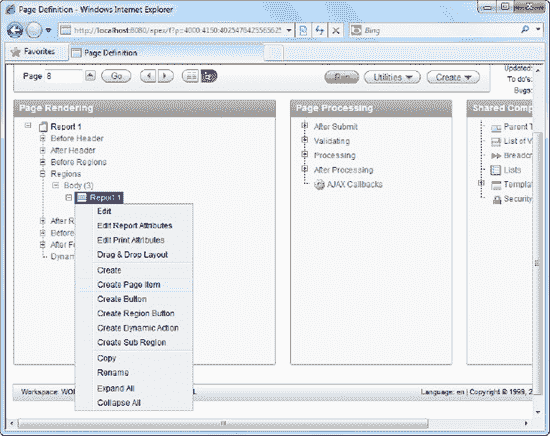

**图 8-13。** 在报表中创建新页面项

8.  在向导中，选择创建文本字段。在向导的下一步中，将文本字段命名为 `PSEARCH_BYNAME`，并将其标签设置为 `Search by Name`。一路单击“下一步”直到向导结束，并使用 APEX 提供的默认设置。
9.  创建字段后，在“页面渲染”区域中右键单击 `PSEARCH_BYNAME` 项，并在弹出菜单中选择“创建按钮”项。将按钮命名为 `PSEARCH_GO` 并创建按钮。现在，您应该在报表的“页面渲染”区域中看到如图 8-14 所示的屏幕。

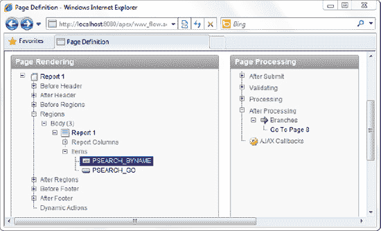

**图 8-14。** 报表中新创建的按钮

10. 右键单击 `Report 1` 项，然后选择编辑报表。向下滚动到“源”部分，在“区域源”字段中，输入清单 8-7 中所示的 SQL 语句。

**清单 8-7。** 指定客户搜索 SQL

```sql
SELECT * FROM CUSTOMERS WHERE NAME = '&PSEARCH_BYNAME.'
```

 **注意** `PSEARCH_BYNAME` 后面有一个句点；别忘了保留它！

11. 您现在应该看到如图 8-15 所示的屏幕。单击“应用更改”按钮保存您的更改。

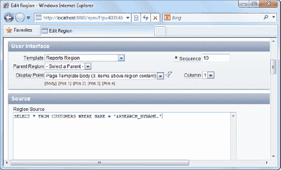

**图 8-15。** 定义报表的 SQL

12. 现在运行报表。您应该会看到一个空白报表（没有任何数据）。但是，在搜索文本框中输入 `Yakuza Corp` 并单击“执行”按钮后，报表会刷新自身，显示匹配的客户，如图 8-16 所示。

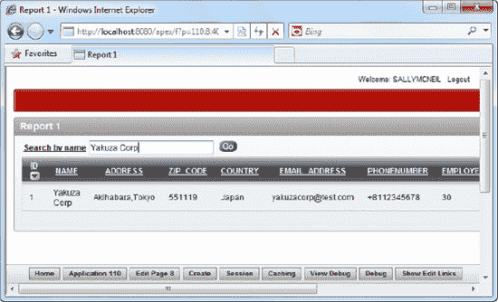

**图 8-16。** 运行您的报表

要执行 SQL 注入攻击，请按照以下步骤操作：

1.  在搜索字段中指定清单 8-8 中所示的文本，然后单击“执行”按钮。

**清单 8-8。** 实施 SQL 注入攻击

```
' OR 1=1--
```

2.  您现在应该看到从表中检索到的每一个客户，如图 8-17 所示。

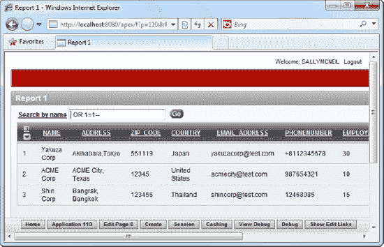

**图 8-17。** 实施 SQL 注入攻击

3.  恭喜！您已成功入侵了自己的应用程序。

为了防止您的应用程序受到 SQL 注入攻击，请按照以下步骤操作：

1.  再次导航到报表的“页面渲染”区域。右键单击 `Report 1` 节点，然后选择编辑报表。
2.  在“区域源”字段中，将 SQL 查询更改为清单 8-9 中所示的查询。

**清单 8-9。** 使用绑定变量

```sql
SELECT * FROM CUSTOMERS WHERE NAME = :PSEARCH_BYNAME
```

3.  您现在应该看到如图 8-18 所示的屏幕。

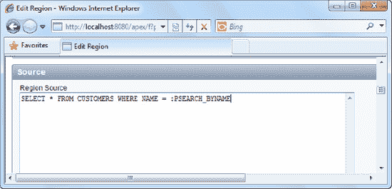

**图 8-18。** 使用绑定变量防御 SQL 注入攻击

4.  应用您的更改并再次运行报表。您会发现报表照常工作，您可以按名称搜索客户。但是，这一次，如果您在搜索字段中指定 `' OR 1=1--` 并单击“执行”按钮，它不会从表中检索完整的客户列表，而是返回一个空的结果集。如图 8-19 所示。

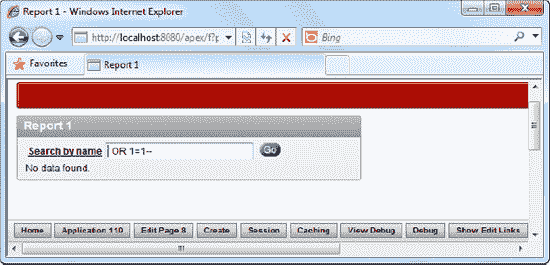

**图 8-19。** 再次尝试 SQL 注入攻击，这次是在受保护的表单上。

5.  您已成功保护您的报表免受 SQL 注入攻击。


#### 工作原理

SQL 注入攻击是对网络应用最常见的攻击形式之一。通常涉及恶意用户通过操纵应用程序生成的动态 SQL 语句来获取未授权的数据访问。这是通过精心构造输入数据，使其成为 SQL 语句本身的一部分来实现的。例如，看看你原始的 SQL 语句。

`SELECT * FROM CUSTOMERS WHERE NAME = '<INPUT DATA FROM SEARCH FIELD>'`

如果恶意用户在搜索字段中输入`' OR 1=1--`，这会与你的 SQL 代码连接，变成：

`SELECT * FROM CUSTOMERS WHERE NAME = '' OR 1=1--'`

 `提示` 符号`--`是 PL/SQL 中的注释指示符，它注释掉了最后一个单引号字符，有效地将你活动的 SQL 语句变成了：

`SELECT * FROM CUSTOMERS WHERE NAME='' OR 1=1`

这允许最终用户从你的数据库中检索整个客户列表！SQL 注入攻击可以以多种方式使用。例如，它可以用于攻击未受保护的登录页面，最终用户只需操纵用户名或密码字段中输入的数据，就能获得对应用程序的未授权访问。

在本教程前面，你看到使用了以下符号：`&PSEARCH_BYNAME`。&符号表示这是一个替换变量；替换变量用于从页面上的表单字段检索数据。然后，该数据（如其名称所示）被按原样替换到目标字符串中。

替换变量是大多数 SQL 注入攻击的根本原因。因为数据只是简单地替换到 SQL 语句中，这允许最终用户输入的撇号最终出现在最终的 SQL 字符串中，导致前面提到的情况。

传统上，在大多数网络应用程序中，SQL 注入攻击是通过转义输入数据中的单引号字符来防止的。“转义”单引号字符仅仅意味着在输入数据中的每个单引号前放置一个转义字符，使其失效。

在 PL/SQL 中，复制单引号字符是转义单引号的一种方法。例如，如果输入数据被转义，最终生成的 SQL 将如下所示：

`SELECT * FROM CUSTOMERS WHERE NAME=''' OR 1=1--'`

 `注释` 上面 SQL 中的输入短语`' OR 1=1--`（在转义其单引号后）被正确地视为字符串，而不是 PL/SQL 代码。

在 Oracle APEX 中，有一种更好的方法来防止 SQL 注入攻击：使用绑定变量。绑定变量的工作方式与向存储过程传递数据非常相似。绑定变量自动将所有输入数据视为“扁平”数据，绝不会将其误认为是 SQL 代码。

将字段项声明为绑定变量的语法是使用冒号字符（:）。只需在字段项名称前加上冒号，像这样：

`:PSEARCH_BYNAME`

 `注释` 你不必显式指定任何包围的单引号字符。APEX 已经知道你变量的数据类型。

在 APEX 中通常鼓励使用绑定变量。除了防止 SQL 注入攻击外，它还有其他与性能相关的好处（更多信息请参见第 7 章）。

## 8-4. 防止跨站脚本（XSS）攻击

#### 问题

你的老板打开一份 APEX 报告，但看到的不是每日财务数据，而是被自动重定向到一个包含不当照片的成人网站。你的老板显然很不高兴。仔细检查报告后，你发现有人在数据库的某个字段中输入了恶意 JavaScript。在显示报告时，输出数据（包含 JavaScript）被执行，导致恶意脚本运行。你认识到这是跨站脚本攻击。你想通过在检索报告数据进行显示时，使其中发现的任何 JavaScript 代码失效，来防止未来的攻击。

#### 解决方案

首先，尝试建立允许跨站脚本攻击发生的相同环境。请按照以下步骤操作：

1.  在你于教程 8-3 中创建的相同应用程序中创建一个新报告。
2.  在报告向导中，选择“交互式报告”类型。
3.  在向导的 SQL 查询步骤中，输入以下 SQL 查询：`SELECT * FROM CUSTOMERS`
4.  完成报告的向导设置。
5.  在报告的“页面渲染”区域中，右键单击`NAME`报告列，选择编辑它，如图 8-20 所示。

    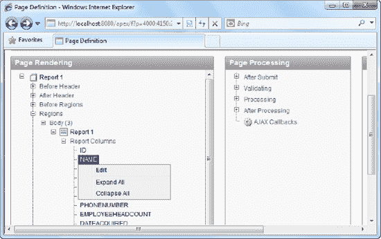

    **图 8-20.** 编辑报告中的`NAME`列

6.  将“显示类型”字段的值设置为“标准报告列”，如图 8-21 所示。

    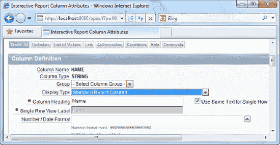

    **图 8-21.** 将列的显示类型更改为“标准报告列”

7.  应用你的更改。现在，在同一个应用程序中创建一个新表单。选择“基于表或视图的表单”类型。
8.  在向导的下一步中，选择`Customers`表或视图。
9.  使用默认设置完成向导的其余部分。

你现在已经准备好发动攻击了。让我们通过让客户报告在最终用户尝试查看报告时自动重定向到 Google 网站来激怒他们。

1.  运行你刚刚创建的表单。
2.  在表单的一个文本字段中，指定清单 8-10 中所示的 JavaScript。

    **清单 8-10.** 恶意脚本

    ```
    <script>window.location='http://www.google.com';</script>
    ```
3.  你现在应该看到如图 8-22 所示的屏幕。单击“创建”按钮保存你的数据。

    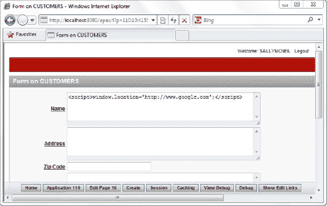

    **图 8-22.** 进行跨站脚本攻击

4.  现在运行你之前创建的报告。你会发现不可能查看报告，因为你将不断被重定向到 Google 网站。你刚刚成功地进行了跨站脚本攻击。

要防止跨站脚本攻击，你必须执行以下操作：

1.  编辑你之前创建的报告。
2.  在“页面渲染”区域中，右键单击`NAME`字段并选择编辑它。
3.  将“显示类型”字段设置为“显示为文本（转义特殊字符）”。
4.  保存你的更改并再次运行报告。
5.  你会发现你的报告现在可以显示了；而且，你之前输入的 JavaScript 已经被适当地转义，现在被视为报告数据而不是代码，如图 8-23 中红色框内所示。

    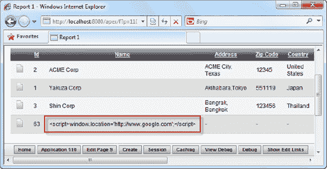

    **图 8-23.** 恶意脚本，现已被处理为无害

6.  你可以对所有其他你希望保护的报告列重复上述步骤 1 到 3。

#### 工作原理

跨站脚本（XSS）攻击试图通过将客户端 JavaScript 代码注入数据输入字段来使其运行。此类攻击可能仅怀有恶作剧的意图（如本示例场景所述），也可能非常危险；想象一下，一种攻击会将您重定向到原始网站的副本，要求您输入密码或个人信息。

XSS 攻击是一种相当简单的攻击类型，其得逞源于以下弱点：
*   在数据录入端没有对输入数据进行验证。
*   在数据显示时没有对特殊字符进行转义。

为了说明攻击如何运作，请考虑一个允许您通过文本框输入客户名称的表单。理想情况下，表单会接收数据并将其保存在数据库中。当需要显示时，数据会原样检索并通过 HTML 显示（例如，放置在表的一行中）。输出结果可能如清单 8-11 所示。

**清单 8-11. 通常的输出**
```html
<table>
        <tr>        
                <td width='100%'>ACME CORP</td>
        </tr>
</table>
```

如果你的应用中没有设置任何检查，并且一个恶意用户输入了一些 JavaScript 代码而不是 `ACME CORP`，那么输出结果将如清单 8-12 所示：

**清单 8-12. 包含恶意脚本的输出**
```html
<table>
        <tr>        
                <td width='100%'>
                        <script>window.location='http://www.google.com';</script>
                </td>
        </tr>
</table>
```

浏览器会将数据误解为客户端脚本代码并执行其中的 JavaScript。

防止这种情况发生的一种方法是在数据录入时验证输入数据（例如，拒绝内容中包含 `<script>` 等标签的数据）。这种方法的一个缺点是，如果你真的需要输入一些包含此类标签的数据，它将无法实现。

 **提示** 可能需要接受包含 HTML 标签数据的一个应用是在线开发者论坛。用户通常会与其他开发者共享他们的代码，将他们代码的示例粘贴到这些数据字段中并不少见。在这种情况下，应用拒绝包含 HTML 标签的数据没有太大意义。

首选方法是在数据显示时，而不是在数据录入时，转义特殊字符。APEX 提供了一种简单的方法来实现这一点，即更改报表列的“显示类型”属性，如你在本示例前面所见。

 **注意** 值得高兴的是，随着最新版 APEX 的发布，所有报表列默认都会转义特殊字符，因此如果你创建一个报表，它将自动受到保护，免受跨站脚本攻击。通过进一步结合频繁使用绑定变量而不是替换字符串，你可以将常见的 Web 和数据库攻击拒之门外。

## 第九章

## 部署应用

将你的应用交付给目标受众的最后一步是部署过程。在传统编程中，程序员通常会将应用程序编译成可执行文件，然后将其打包到自动化安装程序中进行分发。

在 APEX 的世界中，你的整个应用程序都位于数据库内。因此，部署只是将所有数据库对象和依赖项从一个数据库实例复制到另一个实例的问题。话虽如此，确保复制正确的对象仍然很重要，以免你意外遗漏对应用程序正常运行至关重要的表或资源。你的用户最不希望看到的就是，在部署了一个无法工作的应用程序后，还要费力地追踪缺失的文件。

显然，一个完整的打包应用程序应该包含运行应用程序所需的所有资源。一个可靠的部署策略将有助于减少匆忙交付中固有的常见“哎呀，我在补丁中遗漏了那个”的问题。正如你将在本章中看到的，APEX 提供了几种打包应用程序（或其部分）的方法。你将学习应用程序部署的基础知识以及在此过程中要避免的陷阱。

### 9-1. 选择部署方法

#### 问题

你在工作区中花费了大量时间创建了一个完美的应用程序。现在你需要部署它，但你需要知道应用程序或工作区中的哪些对象应包含在部署包中。

#### 解决方案

对于小型组织，如果便利性和部署速度优先于安全性（并且你希望采用最快、最简单的部署方法），请采用以下部署方法：
1.  为应用程序创建必要的最终用户。
2.  简单地将应用程序 URL 暴露给最终用户。
3.  最终用户从你开发它的同一实例中运行应用程序。

如果这些应用程序经常更改（但数据库对象的更改相对较少），请采用以下部署方法：
1.  导出应用程序。
2.  使用新的应用程序 ID 将应用程序导入同一工作区/模式。

对于大型组织，应采用独立于生产服务器的开发服务器（用于开发和测试你的应用程序）。在这种情况下，以下部署方法可能更合适：
1.  导出应用程序。
2.  将应用程序导入不同的工作区（和/或模式）。

如果你需要部署到完全独立的服务器（例如，在客户办公室部署），请采用以下部署方法：
1.  导出应用程序。
2.  将应用程序导入目标 Oracle APEX 实例（使用不同的模式/数据库安装它）。

#### 工作原理

许多大型组织在开发服务器上进行开发，将他们的应用程序转移到预演或用户接受测试（UAT）服务器，并在系统获得用户批准后，再转移到生产服务器。这种类型的部署相当常见，并且有多种方法可以隔离或共享你的 APEX 实例、工作区和模式。一个常见的设置如图 9-1 所示。

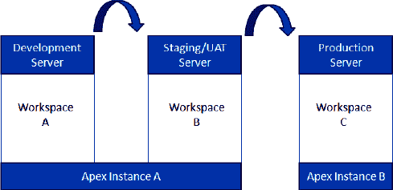

**图 9-1. 典型的部署策略**

对于非常小的部署（和非关键系统），有时可以接受在同一实例和工作区中部署应用程序的开发版本和生产版本。这种方法的好处包括不必管理许多不同的工作区，并通过消除将应用程序交付给用户所需的任何部署来节省时间。

然而，对于其他所有情况，一个好的经验法则是开发实例和生产实例应该完全在不同的 APEX 实例上。由于开发实例通常用作测试平台，将实时生产系统放在同一个 APEX 实例中从来不是一个好主意。至少，你应该使用不同的工作区来分隔开发实例和生产实例，这样开发人员就不可能修改正在运行的实时应用程序。

### 9-2. 生成应用程序依赖项列表

#### 问题

你已准备好导出你的应用程序，但你的应用程序使用了跨多个模式的多种数据库对象，你不确定在导出中是否涵盖了你的应用程序所使用的所有底层数据库对象。

#### 解决方案

要使用数据库对象依赖关系报告来查看应用程序的所有依赖关系，请遵循以下步骤。

1.  登录应用程序构建器。
2.  打开您希望导出的应用程序。
3.  点击页面顶部的实用工具图标，如 图 9-2 所示。

    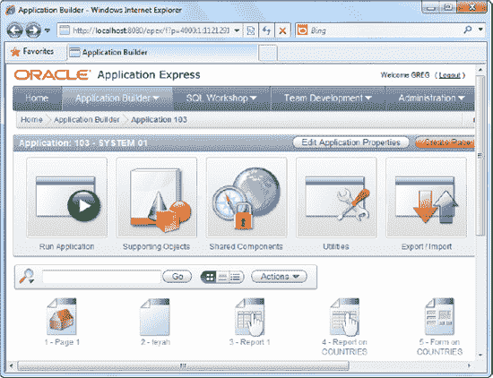

    `图 9-2. 实用工具图标`

4.  在后续页面中，点击数据库对象依赖关系图标，如 图 9-3 所示。

    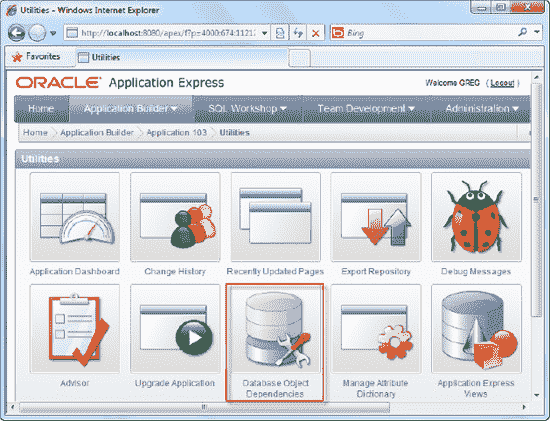

    `图 9-3. 数据库对象依赖关系图标`

5.  在接下来的页面中，点击右上角的**计算依赖关系**链接。
6.  现在，您应该在页面的主区域看到一个表格，描述了应用程序当前使用的所有对象，如 图 9-4 所示。

    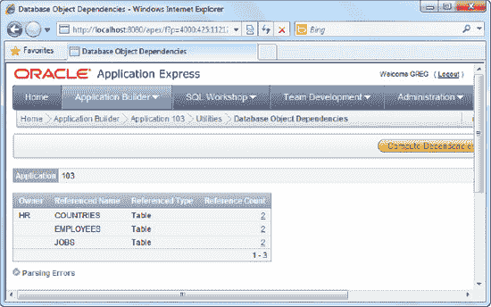

    `图 9-4. 数据库对象依赖关系报告`

#### 工作原理

数据库对象依赖关系查看器提供了应用程序使用的所有数据库对象的单页摘要。这在决定要从应用程序中导出哪些对象时非常有用。

## 9-3. 导出应用程序

#### 问题

您希望将应用程序从一个模式或实例中导出，以便将其部署到生产环境。

#### 解决方案

要导出应用程序，请遵循以下步骤：

1.  登录应用程序构建器。
2.  打开您希望导出的应用程序。
3.  点击页面顶部的**导入/导出**图标，如 图 9-5 所示。

    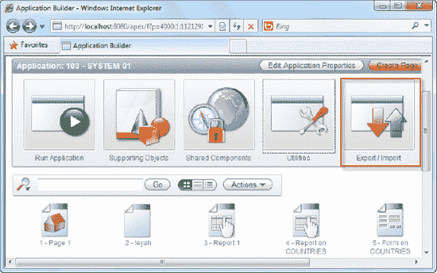

    `图 9-5. 导出/导入图标`

4.  在下一页，选择**导出**并点击**下一步**按钮。
5.  在下一页，确认您希望导出的应用程序，并选择 DOS 文件格式，如 图 9-6 所示。

    对于 UNIX 操作系统的用户，请改选 UNIX 文件格式。不同导出文件格式的主要区别在于行尾的结束方式：基于 UNIX 的文件格式以 `LF` 字符结尾，而基于 Windows 的文件格式以 `CR/LF` 字符结尾。

    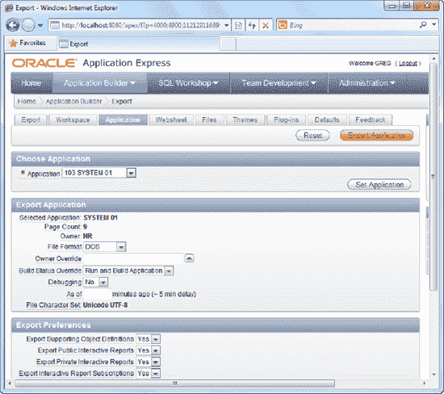

    `图 9-6. 导出应用程序`

6.  点击**导出应用程序**按钮。这将启动导出过程。过程结束时（应该需要几秒钟），系统将提示您下载生成的文件（一个 `.sql` 文件），如 图 9-7 所示。

    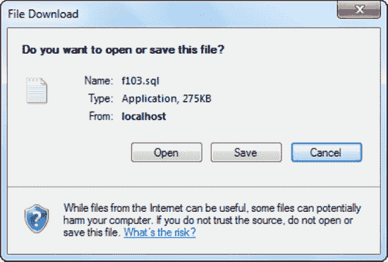

    `图 9-7. 保存导出的 SQL 文件`

#### 工作原理

`APEX` 中的应用程序由元数据、数据和业务逻辑组成，所有这些都很好地存储在 Oracle 数据库中。当您导出应用程序时，它会将所有元数据导出到一个 SQL 文件中。通过运行这个 SQL 文件，它将在目标机器上从头开始重建整个应用程序。

如果您在文本编辑器（如记事本）中打开导出的文件，您会看到文件内容主要是 `PL/SQL` 函数调用和指定数据库模式以及应用程序对象的 `DML`。如 图 9-8 所示。

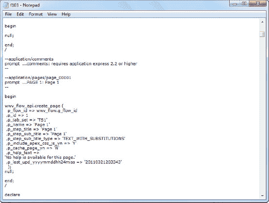

`图 9-8. 探查导出 SQL 文件的内容`

**提示** 因此，您可以在文本编辑器中打开 SQL 文件，手动编辑其中的值，然后将更新后的 SQL 导入到另一个 `APEX` 实例中。（仅建议在您清楚自己在做什么时才进行此操作！）

## 9-4. 导入应用程序

#### 问题

您需要导入一个刚刚从另一个 `APEX` 实例导出的应用程序。

**注意** 本方法演示的是手动导入方式。方法 9-5 展示了如何使用 `SQL*Plus` 脚本化导入以自动运行。

#### 解决方案

使用应用程序构建器，通过便捷的 GUI 界面引导完成导入过程。请遵循以下步骤：

1.  登录应用程序构建器。
2.  打开您希望导入的应用程序。
3.  点击页面顶部的**导入/导出**图标。
4.  在下一页，选择**导入**并点击**下一步**按钮。
5.  在下一页，在**导入文件**字段中浏览选择 `.sql` 文件。
6.  在**文件类型**字段中，选择**数据库应用程序、页面或组件导出**选项，如 图 9-9 所示。

    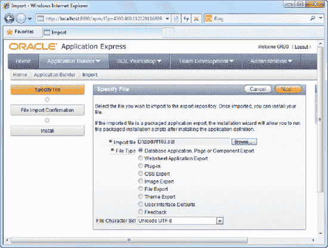

    `图 9-9. 导入 SQL 文件`

7.  点击**下一步**按钮后，页面顶部将出现一个小的进度条，指示导入进度。
8.  导入成功完成后，系统会提供安装应用程序的选项，如 图 9-10 所示。

    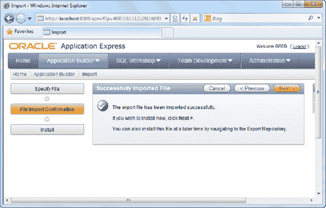

    `图 9-10. 成功导入消息`

9.  点击**下一步**按钮安装应用程序。

    **提示** 导入文件后，它最终会进入一个名为 APEX 导出存储库的内部仓库。在安装之前，您无法以任何方式使用已导入的文件。

10. 现在，您将看到一个页面，允许您指定新应用程序要使用的模式和应用程序 ID。
11. 选择**自动分配新应用程序 ID** 项，如下面的 图 9-11 所示，然后点击**安装**按钮继续。

    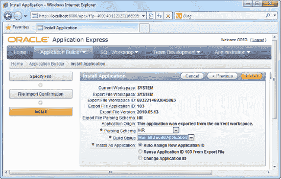

    `图 9-11. 安装应用程序`

12. 您应该会看到一个指示导入进度的进度条。
13. 导入完成后，您会看到一个屏幕，让您可以选择为应用程序创建支持对象。在此页面中，为**安装支持对象**字段选择**是**选项，如 图 9-12 所示。

    

    `图 9-12. 创建数据库支持对象`

14. 点击**下一步**按钮继续。
15. 系统将显示一个确认屏幕。点击**安装**按钮继续安装。
16. 安装完成后，系统将显示如 图 9-13 所示的屏幕。

    

    `图 9-13. 安装向导的最后一步`

17. 现在回到您的主工作区。您应该能看到您的新应用程序。如果您打开该应用程序，可以看到导出应用程序中的一系列表单已在您的 `APEX` 实例中创建，如 图 9-14 所示。

    

    `图 9-14. 已导入的应用程序及其内容`

#### 工作原理

有两种导入应用程序的方式。

*   通过 `APEX` 应用程序构建器窗口可视化导入应用程序。
*   通过 `SQL*Plus` 导入应用程序。

方法 9-5 描述了如何通过 `SQL*Plus` 导入应用程序。

## 9-5. 脚本化应用程序导入

#### 问题

您需要通过批处理脚本自动化应用程序的导入，因此无法通过应用程序构建器界面导入应用程序。


