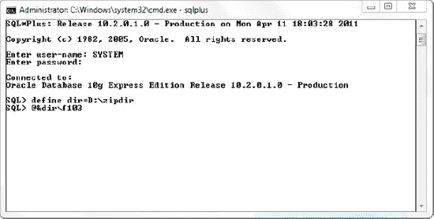
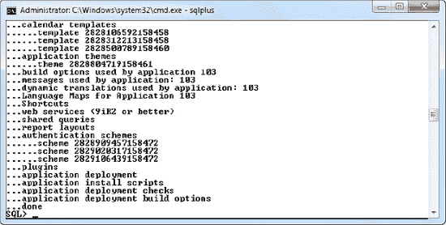
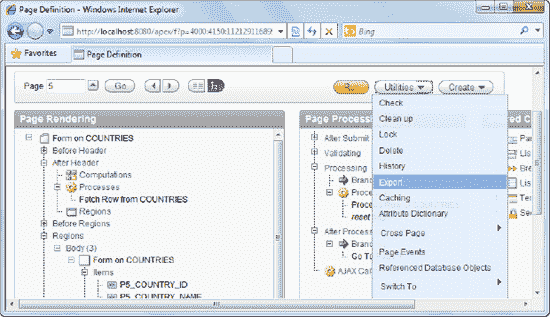
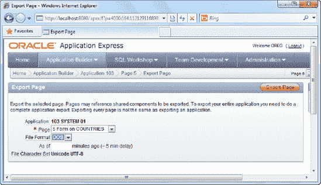
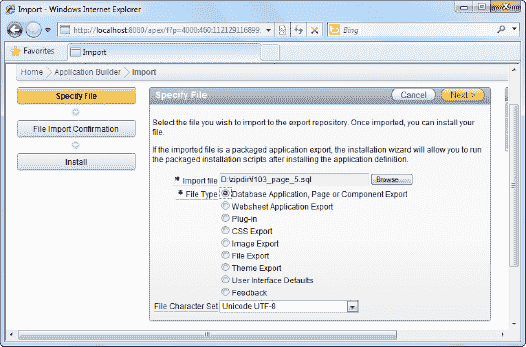
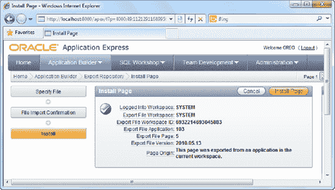
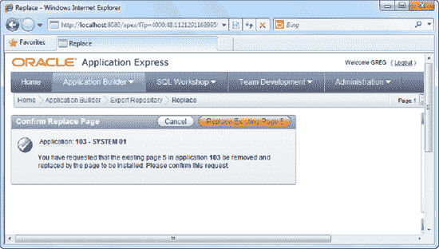
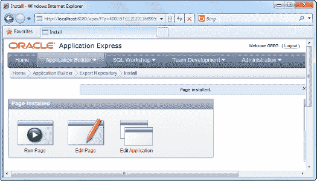
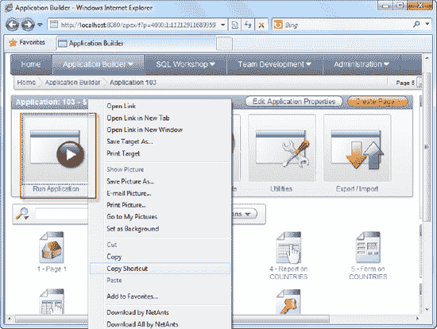

# 9-5. 使用 SQL*Plus 导入应用

#### 解决方案

使用 SQL*Plus 导入该应用程序。通过 SQL*Plus，你用应用程序构建器的图形界面换来了编写脚本和自动化导入的能力。请遵循以下步骤：

1.  运行 `SQL*Plus`。
2.  以系统管理员身份登录到 `SQL*Plus`。
3.  将当前活动文件夹更改为导出的 `.sql` 文件所在的位置。例如，如果你的当前活动文件夹是 `d:\zipdir`，你必须先使用以下代码将活动文件夹更改到此位置：`define dir=D:\zipdir`
4.  在下一行，键入 `&dir`（前面加上别名符号 `@`），后跟导出的文件名。例如，如果你之前导出的文件是 `f103.sql`，请在 `SQL*Plus` 命令提示符下键入 `@&dir\f103`（如图 9-15 所示）。

     **提示** 你也可以直接以这种方式声明完整路径：`@d:\zipdir\f103.sql`

    

    **图 9-15.** 在 `SQL*Plus` 中设置活动目录

5.  运行脚本时，你应该会看到大量日志信息滚动而过。成功安装结束后，你应该会看到如图 9-16 所示的屏幕。

    

    **图 9-16.** 执行导出的 `SQL` 文件

6.  图 9-16 中没有错误信息，表明应用程序已成功导入。
7.  现在尝试登录到应用程序构建器。你应该能看到新导入的应用程序。

#### 工作原理

通过 `SQL*Plus` 导入文件的能力使你能够使用批处理脚本等自动化导入过程。例如，你可能会决定创建一个批处理脚本，将应用程序中新的和更新的页面从开发服务器自动导入到生产服务器上。

### 9-6. 导出单个页面

#### 解决方案

你已经在客户办公室的生产服务器上部署了你的应用程序。你的团队在办公室更新了应用程序中的一个页面，你想将这个更新的页面带到客户那里部署到他们的服务器上。

要导出单个页面，请遵循以下步骤：

1.  打开一个现有应用程序。
2.  在你的应用程序中打开你希望导出的页面。
3.  在“页面定义”区域中，选择“实用工具”“导出”菜单项，如图 9-17 所示。

    

    **图 9-17.** 导出单个页面

4.  在下一页中，系统会让你选择导出的文件格式。选择 `DOS` 文件格式，如图 9-18 所示。

    

    **图 9-18.** 导出页面向导

5.  此时应该会提示你下载导出的页面（一个 `.sql` 文件）。

#### 工作原理

当你不希望导出应用程序的其他部分时，导出单个页面非常有用。导出单个页面的其他优点包括：

*   减小导出应用程序的大小（以保持 `.sql` 文件的大小便于通过互联网传输）。
*   通过仅将导入本地化到一两个页面文件，减少对生产服务器的影响。
*   是将错误修复或更新上传到生产或 `UAT` 服务器的便捷方式。
*   作为将单个页面从开发服务器导出到生产服务器的一种手段。

因此，如果你只更改了一个或几个页面，你可以通过仅移动已更改的页面来最小化对生产环境的影响。

### 9-7. 导入单个页面

#### 解决方案

你已经按照 Recipe 9-6 的说明导出了一个页面。现在需要将该页面导入到目标应用程序中。

要将单个页面导入到你的应用程序中，请遵循以下步骤：

1.  打开你希望导入页面的目标应用程序。
2.  单击页面顶部的 `Export/Import` 图标。
3.  当提示时选择 `Import` 选项。
4.  在下一页中，浏览找到你之前导出的页面。对于“文件类型”选项，选择“数据库应用程序、页面或组件导出”选项，如图 9-19 所示。

    

    **图 9-19.** 导入页面

5.  单击 `Next` 按钮继续。你将看到如图 9-20 所示的页面安装确认步骤。单击 `Install Page` 按钮继续。

    

    **图 9-20.** 安装页面确认步骤

6.  因为你正在部署现有页面的更新版本，向导会提示你覆盖该页面，如图 9-21 所示。

    

    **图 9-21.** 替换页面确认

7.  页面成功替换后，你将看到如图 9-22 所示的屏幕。你的页面已成功部署。

    

    **图 9-22.** 页面已安装消息

#### 工作原理

你也可以使用本配方中描述的方法，轻松地将页面文件导入到同一个应用程序或另一个 `APEX` 实例上的其他应用程序中。事实上，大多数其他应用程序资源（如主题文件、图像文件、共享对象等）都可以以相同的方式导出和导入。

### 9-8. 发布应用程序 URL

#### 解决方案

部署应用程序后，你需要发布应用程序 `URL`，以便最终用户可以访问它，但你不知道它是什么。你需要定位应用程序 `URL`。

要发现应用程序 `URL`，请按照以下说明操作：

1.  打开一个现有应用程序。
2.  将鼠标悬停在“运行应用程序”图标上，右键单击它，然后选择查看该图标的快捷方式/链接，如图 9-23 所示。

    

    **图 9-23.** 访问应用程序的 `URL`

     **提示** 在 `Microsoft Internet Explorer` 中，右键单击图标并选择“复制快捷方式”菜单项。对于其他浏览器，查找允许你检查链接完整 `URL` 的等效菜单项。

3.  如果你将应用程序的链接粘贴到某处（例如，在文本文件中），你将看到应用程序的完整链接类似于这样：`http://localhost:8080/apex/f?p=103:1:1121291168995976:::::`
4.  你可以在任何浏览器中粘贴此链接以直接访问应用程序的登录页面。

#### 工作原理

以下 `URL` 实际上由几个部分组成。让我们详细剖析每个部分以了解它们的含义。表 9-1 详细描述了该 `URL`。

`http://localhost:8080/apex/f?p=103:1:1121291168995976:::::`

**表 9-1.** `APEX` 应用程序 `URL` 详解

| **组件** | **描述** |
| --- | --- |
| `http://localhost:8080` | `localhost` 指的是托管 `APEX` 实例的服务器名称，`8080` 是 `APEX` 服务正在监听的端口号。 |
| `Apex` | 这是数据库访问描述符 (`DAD`) 的名称。此部分描述了 `Oracle HTTP` 服务器如何连接到数据库服务器以满足 `HTTP` 请求。 |
| `f?p=` | 这是 `APEX` 使用的特殊前缀，用于指示后续数据。 |
| `103` | 这是被访问应用程序的 `ID`。 |
| `1` | 这是被访问应用程序中的页面编号。 |
| 1121291168995976 | 这是标识当前会话的 `ID`。值得注意的是，这个值不需要成为暴露给最终用户的 `URL` 的一部分，因为它是由 `APEX` 为每个会话生成的。因此，向最终用户发布以下 `URL` 就足够了：`http://localhost:8080/apex/f?p=103:1::::::` |

