# 第 10 章


## 一个迷你图书目录网站

在最后一章中，你将探索一个在线图书目录的真实场景，并学习如何运用 APEX 在数小时内创建它。可以将这个目录视为一个书店的初始雏形——你甚至不会实现类似购物车这样的功能，但你会运用贯穿本书前面章节所学的各种 APEX 技巧和特性。

在创建在线图书目录之前，让我们先定义一下要构建的应用范围。该应用程序将分为两个主要区域——网站的**管理部分**（用户可在其中管理可用书籍列表）和**前端**（即公众可见的实际图书目录）。

此外，你将创建一个图表报表，让店主可以查看商店中所有书籍的当前库存数量。最后，你将通过使用导航列表和标签页为应用程序提供一个合适的导航方案，将所有这些独立的页面整合在一起。

### 10-1. 为你的图书目录设置主要对象

#### 问题

你需要为图书目录设置底层的数据库表和示例记录（书籍）。

#### 解决方案

要设置图书目录表，请遵循以下步骤。（注意：你可以在本书的示例下载中找到代码——无需手动输入。）

1.  创建主要的 `Books` 表如下，同时插入示例数据：
    ```sql
    CREATE TABLE "BOOKS"
       (    "BOOKID" NVARCHAR2(255),
            "BOOKTITLE" NVARCHAR2(255),
            "BOOKISBN" NVARCHAR2(255),
            "BOOKPUBLISHER" NVARCHAR2(255),
            "BOOKEDITION" NVARCHAR2(255),
            "BOOKCATEGORY" NVARCHAR2(255),
            "BOOKDESCRIPTION" NVARCHAR2(255),
            "BOOKPRICE" FLOAT(9),
            "AUTHOR" NVARCHAR2(255),
            "BOOKIMAGE" BLOB,
    CONSTRAINT "BOOKS_PK" PRIMARY KEY ("BOOKID") ENABLE
       )
    /
    ```
    ```sql
    INSERT INTO BOOKS(BOOKID, BOOKTITLE, BOOKISBN, BOOKPUBLISHER, BOOKEDITION, BOOKCATEGORY,
        BOOKDESCRIPTION, BOOKPRICE, AUTHOR) VALUES('B1','PRO ODP.NET
        PROGRAMMING','9781430228202','APRESS PUBLISHING','2010','C3','This book is a comprehensive and
        easy-to-understand guide for using the Oracle Data Provider (ODP) version 11g on the .NET
        Framework',59.99,'ED ZEHOO')
    /
    ```
    ```sql
    INSERT INTO BOOKS(BOOKID, BOOKTITLE, BOOKISBN, BOOKPUBLISHER, BOOKEDITION, BOOKCATEGORY,
        BOOKDESCRIPTION, BOOKPRICE, AUTHOR) VALUES('B2','IPHONE PROGRAMMING','9781430228400','WROX
        PUBLISHING','2011','C3','This book describes the basics of iPhone and iPad development using
        Objective C',49.99,'GREG YAP')
    /
    ```
    ```sql
    INSERT INTO BOOKS(BOOKID, BOOKTITLE, BOOKISBN, BOOKPUBLISHER, BOOKEDITION, BOOKCATEGORY,
        BOOKDESCRIPTION, BOOKPRICE, AUTHOR) VALUES('B3','HOW MASTER CHIEF BECAME MASTER
        CHEF','1123433328400','TOR BOOKS','2010','C2','Master Chief goes on a vacation in China. Read
        about his exploits in this book!',39.99,'JAMES BURKE')
    /
    ```
    ```sql
    INSERT INTO BOOKS(BOOKID, BOOKTITLE, BOOKISBN, BOOKPUBLISHER, BOOKEDITION, BOOKCATEGORY,
        BOOKDESCRIPTION, BOOKPRICE, AUTHOR) VALUES('B4','THE CURSE OF AMMATTAR','9781430228400','TOR
        BOOKS','2011','C4','Classic horror story set in medieval Thailand',29.99,'SARAH HAWKINS')
    /
    ```
    ```sql
    INSERT INTO BOOKS(BOOKID, BOOKTITLE, BOOKISBN, BOOKPUBLISHER, BOOKEDITION, BOOKCATEGORY,
        BOOKDESCRIPTION, BOOKPRICE, AUTHOR) VALUES('B5','CHING CHONG: THE RISE AND FALL OF
        JACKSON','343322221400','NIECA BOOKS','2011','C1','A story about the misfortunes of Jackson
        Junior as he travels across Asia',12.99,'TARA WILLIAMS')
    /
    ```
    ```sql
    INSERT INTO BOOKS(BOOKID, BOOKTITLE, BOOKISBN, BOOKPUBLISHER, BOOKEDITION, BOOKCATEGORY,
        BOOKDESCRIPTION, BOOKPRICE, AUTHOR) VALUES('B6','UNFORTUNATE
        CIRCUMSTANCES','115062221400','PARAMOUNT BOOKS','2011','C1','Read about the unfortunate
        circumstances of Ali, someone you will absolutely not care about',19.99,'DANA T. ROLLS')
    /
    ```
    ```sql
    INSERT INTO BOOKS(BOOKID, BOOKTITLE, BOOKISBN, BOOKPUBLISHER, BOOKEDITION, BOOKCATEGORY,
        BOOKDESCRIPTION, BOOKPRICE, AUTHOR) VALUES('B7','SCARY LIONS','11553221400','PARAMOUNT
        BOOKS','2011','C1','A book about the greasy politicians in Mootawambaland and how Alex becomes
        one of them',15.99,'TERRY BARRACK')
    /
    ```
    ```sql
    INSERT INTO BOOKS(BOOKID, BOOKTITLE, BOOKISBN, BOOKPUBLISHER, BOOKEDITION, BOOKCATEGORY,
        BOOKDESCRIPTION, BOOKPRICE, AUTHOR) VALUES('B8','THE LIME TREE','22113221400','ZACK
        PUBLISHING','2011','C1','A book about how Sally became a top salesperson when she decides to
        sell lime as lemon',16.99,'JAMES LEE')
    /
    ```

2.  创建 `Inventory` 表如下：
    ```sql
    CREATE TABLE  "INVENTORY"
       (    "ID" NVARCHAR2(255),
            "BOOKID" NVARCHAR2(255),
            "COPIESINSTOCK" NUMBER(9,3),
             CONSTRAINT "INVENTORY_PK" PRIMARY KEY ("ID") ENABLE
       )
    /
    ```
    ```sql
    INSERT INTO INVENTORY(ID,BOOKID,COPIESINSTOCK) VALUES('1','B1',10)
    /
    ```
    ```sql
    INSERT INTO INVENTORY(ID,BOOKID,COPIESINSTOCK) VALUES('2','B2',15)
    /
    ```
    ```sql
    INSERT INTO INVENTORY(ID,BOOKID,COPIESINSTOCK) VALUES('3','B3',1)
    /
    ```
    ```sql
    INSERT INTO INVENTORY(ID,BOOKID,COPIESINSTOCK) VALUES('4','B4',6)
    /
    ```
    ```sql
    INSERT INTO INVENTORY(ID,BOOKID,COPIESINSTOCK) VALUES('5','B5',17)
    /
    ```
    ```sql
    INSERT INTO INVENTORY(ID,BOOKID,COPIESINSTOCK) VALUES('6','B6',9)
    /
    ```
    ```sql
    INSERT INTO INVENTORY(ID,BOOKID,COPIESINSTOCK) VALUES('7','B7',14)
    /
    ```
    ```sql
    INSERT INTO INVENTORY(ID,BOOKID,COPIESINSTOCK) VALUES('8','B8',9)
    /
    ```

3.  创建 `Category` 表如下：
    ```sql
    CREATE TABLE  "CATEGORY"
       (    "CATEGORYID" NVARCHAR2(255),
            "CATEGORYNAME" NVARCHAR2(255),
            "DESCRIPTION" NVARCHAR2(255),
             CONSTRAINT "CATEGORY_PK" PRIMARY KEY ("CATEGORYID") ENABLE
       )
    /
    ```
    ```sql
    INSERT INTO CATEGORY(CATEGORYID, CATEGORYNAME, DESCRIPTION) VALUES('C1','FICTION','Fiction
        selection')
    /
    ```
    ```sql
    INSERT INTO CATEGORY(CATEGORYID, CATEGORYNAME, DESCRIPTION)
        VALUES('C2','SCIENCEFICTION','Science Fiction Selection')
    /
    ```
    ```sql
    INSERT INTO CATEGORY(CATEGORYID, CATEGORYNAME, DESCRIPTION) VALUES('C3','COMPUTERS','Computer
        Books Selection')
    /
    ```
    ```sql
    INSERT INTO CATEGORY(CATEGORYID, CATEGORYNAME, DESCRIPTION) VALUES('C4','HORROR','Best Horror
        Selections')
    /
    ```

#### 工作原理

`Books` 表是主表，存储图书目录中的书籍列表；`Inventory` 表存储每本可用书籍的库存数量；`Category` 表存储目录中可用的完整图书类别（流派）列表。表 10-1 描述了各个相应表中各种键之间的映射关系。

**表 10-1.** 图书目录应用程序中不同表之间的外键映射

| **外键映射** | **描述** |
| --- | --- |
| `Books.BookID = Inventory.BookID` | 每本书在 Inventory 表中都有一个对应的条目，用于存储该书的库存数量详情。 |
| `Books.BookCategory = Category.CategoryID` | 每本书属于一个流派/类别，其详细信息存储在 Category 表中。存储在 `Books.BookCategory` 列中的 ID 用于查找 `Category` 表中的对应条目。 |

### 10-2. 创建页面以管理书籍列表

#### 问题

店主需要一种管理其图书目录中书籍列表的方法。

#### 解决方案

您必须首先创建允许仓库管理员在图书目录中添加、编辑和删除书目的表单。

要创建允许仓库管理员添加/编辑/删除图书的页面，请遵循以下说明：

1.  创建一个名为 `图书目录` 的新 `Database` 应用程序。
2.  在创建应用程序向导的 `页面` 步骤中，选择链接到 `Books` 表的 `报表和表单` 页面类型，如 图 10-1 所示。

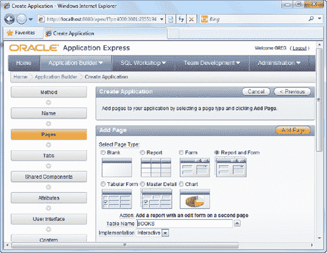

**图 10-1.** 添加报表和表单

3.  点击 `添加页面` 按钮以添加表单和报表。完成后，结束向导以创建应用程序。
4.  您现在应该看到如 图 10-2 所示的界面。

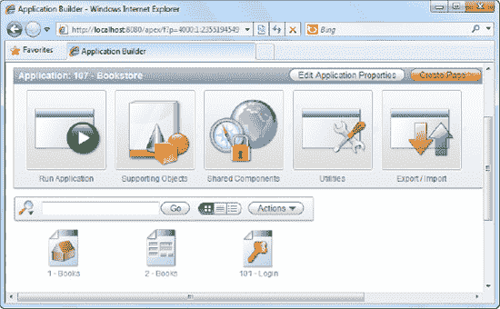

**图 10-2.** 应用程序中的当前页面列表

5.  如果您启动主 Books 表单，您应该看到如 图 10-3 所示的界面。

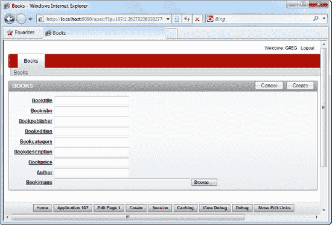

**图 10-3.** 图书详情录入表单

6.  来自 图 10-3 的图书详情录入表单允许仓库管理员向图书目录添加新书，但该表单尚不完整。`BookCategory` 字段应显示一个类别下拉列表，以便仓库管理员可以从列表中选择类别，而无需手动输入类别代码。
7.  编辑该表单。在 `页面渲染` 部分，右键单击 `P1_BOOKCATEGORY` 字段，然后选择编辑该字段（如 图 10-4 所示）。

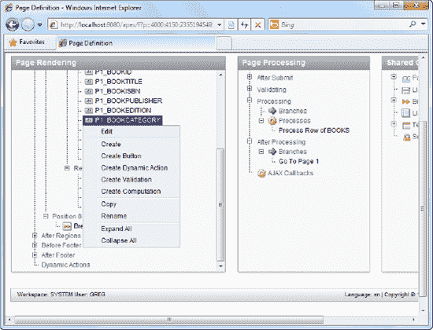

**图 10-4.** 编辑图书类别字段

8.  在字段属性页面中，将 `显示为` 字段从 `文本字段` 更改为 `选择列表`，如 图 10-5 所示。

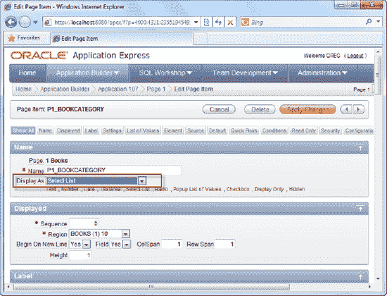

**图 10-5.** 更改“显示为”字段

9.  向下滚动到 `值列表` 区域，并指定以下 SQL：
    ```sql
    SELECT Description, CategoryID FROM Category
    ```
10. 您现在应该看到如 图 10-6 所示的界面。

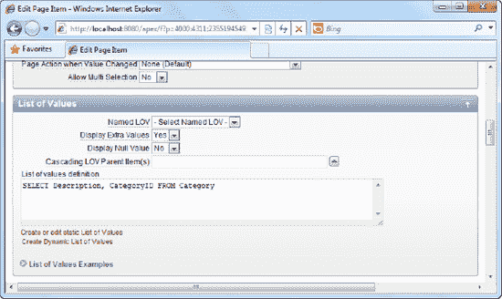

**图 10-6.** 为值列表区域指定 SQL

11. 保存您的更改并运行表单。您应该能够从值列表中选择图书类别，如 图 10-7 所示。

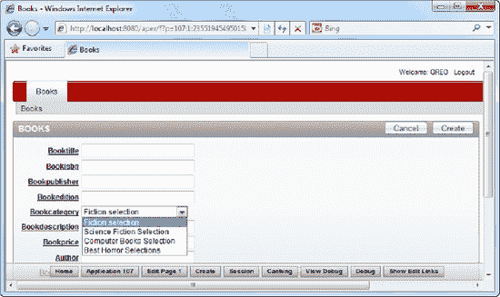

**图 10-7.** 实际运行中的图书类别选择列表

12. 让我们转向之前生成的报表。当您在应用程序中运行该报表时，您应该看到如 图 10-8 所示的图书列表。

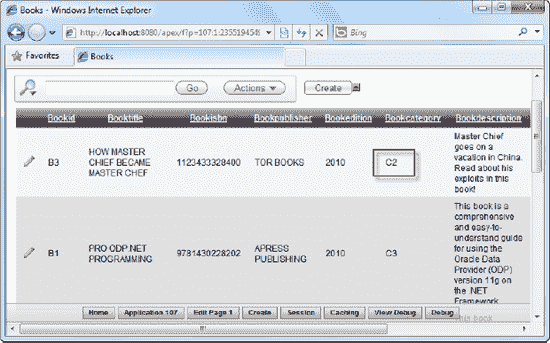

**图 10-8.** 图书列表

13. 此时还有一件事需要完成，即更改 `BookCategory` 列，使其显示完整的类别描述而不是类别代码。为此，请编辑报表。

 **提示** 您可能还想更改报表列的标题，以显示更用户友好/可读的标题。您可以通过编辑报表列并更改 `列标题` 字段来实现。

14. 在报表的 `页面渲染` 区域，右键单击 `Books` 节点，然后选择 `编辑` 链接（如 图 10-9 所示）。

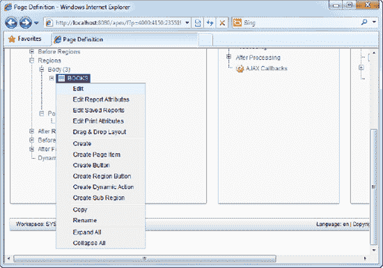

**图 10-9.** 编辑 Books 区域

15. 向下滚动到报表源，并将现有的 SQL 更改为以下内容：
    ```sql
    select
      "BOOKID",
      "BOOKTITLE",
      "CATEGORY"."DESCRIPTION" "BOOKCATEGORY",
      "BOOKISBN",
      "BOOKPUBLISHER",
      "BOOKEDITION",
      "BOOKDESCRIPTION",
      "BOOKPRICE",
      "AUTHOR",
      dbms_lob.getlength("BOOKIMAGE") "BOOKIMAGE"
    from "BOOKS" LEFT JOIN "CATEGORY" ON "BOOKS"."BOOKCATEGORY" = "CATEGORY"."CATEGORYID"
    ```
16. 您现在应该看到如 图 10-10 所示的界面。

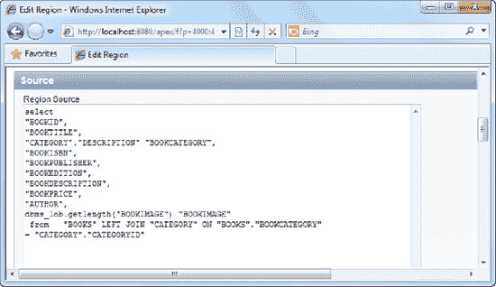

**图 10-10.** 更改区域源的 SQL

17. 应用更改并再次运行报表。请注意，报表显示完整的类别名称而不是类别代码，如 图 10-11 所示。

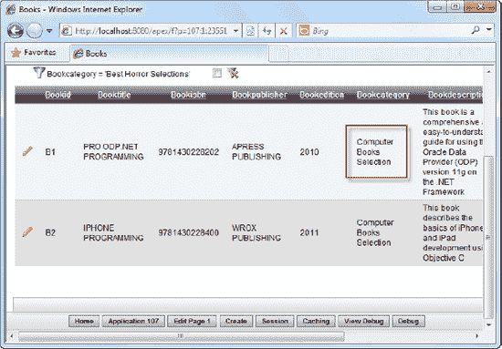

**图 10-11.** 报表中显示的图书完整类别名称

18. 尝试通过您新创建的表单/报表上传图书照片。在报表中，通过单击每行最左侧的编辑图标来编辑一本书。
19. 浏览图书图片并通过表单上传，如 图 10-12 所示。保存对记录的所有更改。

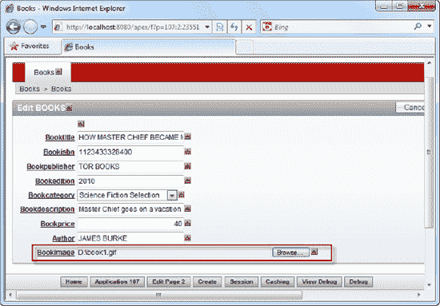

**图 10-12.** 上传图书图片

20. 要确认图片已成功上传，请再次编辑该记录；这次您会在控件旁边看到一个 `下载` 链接。单击下载链接将带您到上传的图片文件，如 图 10-13 所示。

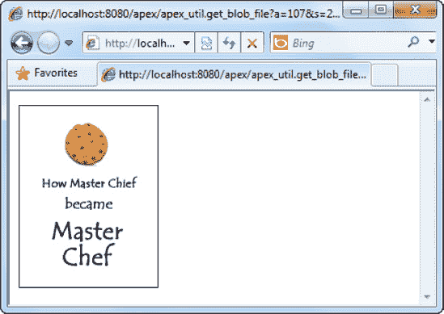

**图 10-13.** 示例图书图片

21. 为 `Books` 表中的所有其他图书上传您自己的照片。

#### 工作原理

正如本书前面章节所演示的，APEX 允许您轻松地从数据库表创建表单和报表组合。这反过来又让您能够轻松快速地在应用程序中设置 CRUD（创建、读取、更新和删除）功能。

本书前面章节还介绍了如何使用从指定 SQL 语句动态生成的值列表（LOV）。如本配方所见，LOV 可用作选择列表（下拉菜单）的数据源。

## 练习 10-1：创建页面以管理类别列表和图书库存

作为一个练习，我留给您来创建表单和报表页面，以管理图书目录应用程序中不同的类别列表以及图书库存。方法与本配方中概述的步骤类似。使用 `Category` 和 `Inventory` 表作为这些页面的基础。

要验证您的操作是否正确，您应该得到如下的类别列表报表。这将为仓库管理员提供一个界面，用于管理图书目录中可用的图书类别。

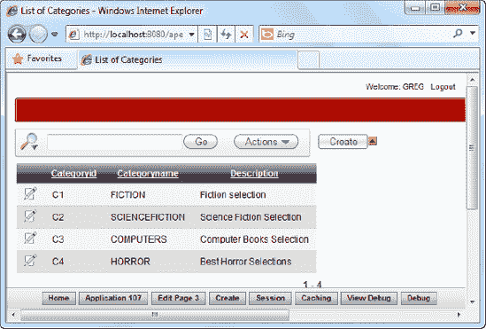

对于库存报表，您最终应该得到如下的报表。要在报表中显示书名以代替图书 ID，您可以使用以下 SQL：

```sql
select "ID",
  "BOOKS"."BOOKTITLE" "BOOKID",
  "COPIESINSTOCK"
from "#OWNER#"."INVENTORY" LEFT JOIN "BOOKS" ON "INVENTORY"."BOOKID"= "BOOKS"."BOOKID"
```

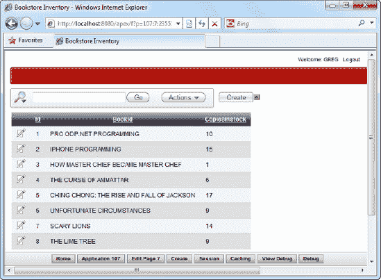

库存报表和表单将允许仓库管理员管理（和查看）图书目录中每本图书的库存数量。

### 10-3. 设置图书目录前端

#### 问题

您在配方 10-2 中完成了目录后端的大部分工作。现在，您需要配套的前端门户，以典型的在线图书目录格式向公众展示目录中可用的图书列表。


#### 解决方案

创建目录前端，请按照以下步骤操作：

1.  在同一个 `Book catalog` 应用程序中，创建一个新的报表。
2.  在向导中，选择创建一个经典报表。
3.  将此报表命名为 "`My Mini Book catalog`"，并将区域标题设置为 "`Browse our books`"。
4.  在报表的 SQL 查询部分，编写以下 SQL：`SELECT "BOOKID", "BOOKTITLE","BOOKISBN","BOOKPUBLISHER","BOOKEDITION","BOOKCATEGORY","BOOKDESCRIPTION","BOOKPRICE","AUTHOR", dbms_lob.getlength("BOOKIMAGE") "BOOKIMAGE" FROM Books`
5.  完成向导以创建报表。创建完成后，再次编辑该报表。你应该能看到如 图 10-14 所示的屏幕。

    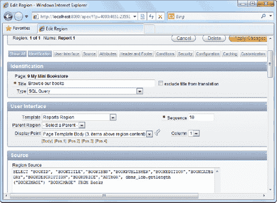

    **图 10-14.** 更改区域源的 SQL

6.  使用默认设置完成向导的其余部分。
7.  如果你运行报表，应该会看到如 图 10-15 所示的标准布局。

    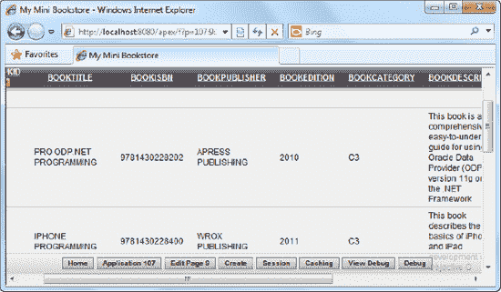

    **图 10-15.** 标准报表布局

8.  当然，这个布局是可行的，但它并不是一个非常用户友好的图书目录。如果能以如 图 10-16 所示的格式列出每个条目会更好。

    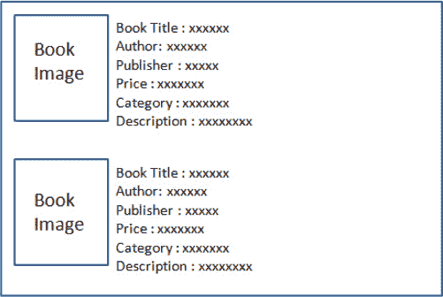

    **图 10-16.** 前端目录中图书列表的期望布局

9.  首先，你需要稍微修改报表，以便实际图书图像能显示在每一行中。为此，请编辑报表。在报表的页面呈现区域中，右键单击 `BookImage` 列并选择编辑。
10. 在 `Number/Date Format` 字段中，输入以下文本：`IMAGE:BOOKS:BOOKIMAGE:BOOKID`
11. 现在你应该能看到如 图 10-17 所示的屏幕截图。

    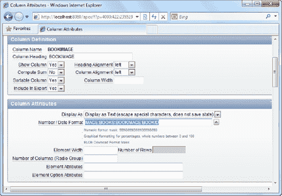

    **图 10-17.** 设置 Number/Date 格式以在报表中显示图像

12. 保存更改并返回到报表的主页定义区域。
13. 单击 `Report Attributes` 选项卡。更改列的排序，使 `BookImage` 列首先显示，如 图 10-18 所示。

    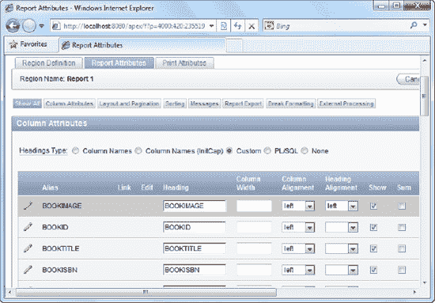

    **图 10-18.** 调整 BOOKIMAGE 列的查看顺序

14. 保存更改并运行报表。现在你应该能看到类似 图 10-19 的内容。

    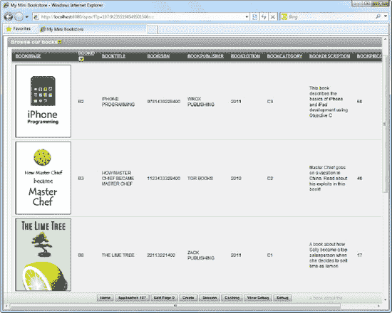

    **图 10-19.** 报表中显示的图书图像

15. 再次编辑报表。在报表的页面呈现区域中，右键单击 "`Browse our books`" 区域并选择编辑。单击 `Reports Attribute` 选项卡。
16. 在列列表中，隐藏除 `BOOKIMAGE` 和 `BOOKTITLE` 列之外的所有列（取消勾选 `Show` 列中的复选框），如 图 10-20 所示。

    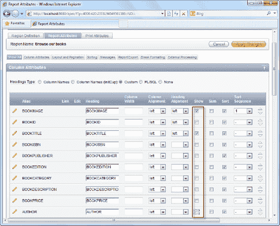

    **图 10-20.** 隐藏所有其他列

17. 保存你的更改，并再次编辑报表。
18. 在页面呈现区域中，右键单击 `BOOKTITLE` 字段并进行编辑。
19. 滚动到 `Column Formatting` 区域，在 `HTML Expression` 字段中，输入以下 HTML：`<b>Title :</b> #BOOKTITLE#<br> <b>Author :</b> #AUTHOR#<br> <b>Publisher :</b> #BOOKPUBLISHER#<br> <b>Price :</b> USD #BOOKPRICE#<br> <b>Description :</b> #BOOKDESCRIPTION#<br>`
20. 现在你应该能看到如 图 10-21 所示的屏幕。

    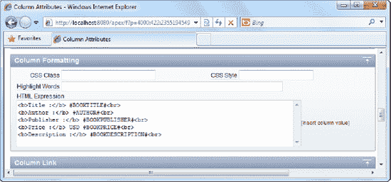

    **图 10-21.** 通过 HTML Expression 字段为行定义显示模板

21. 保存并应用更改。现在尝试再次运行报表。你现在应该能看到图书以更用户友好且易读的方式排列，如 图 10-22 所示。

    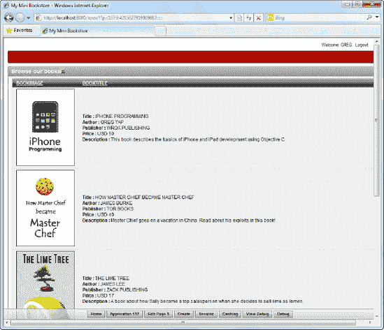

    **图 10-22.** 图书目录前端的修订布局

#### 工作原理

`HTML Expression` 字段允许你定义自己的模板，用于显示报表中每一行的列数据。使用 `#FIELDNAME#` 符号，你可以在 HTML 块中显示来自任何报表列的数据。

 **提示** 同样，你可能希望通过提供更直观的列标题来整理你的界面。

### 10-4. 更改应用程序的主页

#### 问题

`Book catalog` 应用程序当前的主页是管理后端图书报告。你希望将其更改为目录前端页面。

#### 解决方案

要更改应用程序的主页，请按照以下说明操作：

1.  在同一个 `Book catalog` 应用程序中，单击 `Shared Components` 图标。
2.  在 `Security` 区域下，单击 `Security Attributes` 链接，如 图 10-23 所示。

    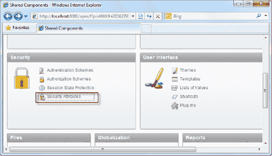

    **图 10-23.** Security Attributes 链接

3.  在随后出现的页面中，将主页链接属性中的页码从 1 更改为你前端目录页面的页码。例如，如果你的前端目录页面页码是 9，你的主页链接属性应设置为：`f?p=&APP_ID.:9:&SESSION.`
4.  保存并应用更改。现在通过单击 `Run Application` 图标运行你的应用程序。应用程序现在会将你重定向到前端目录页面。

#### 工作原理

如 第 9 章 所述，APEX 中指向页面的典型链接具有以下格式：

`f?p=(ApplicationID):(PageNumber):(SessionID):::::`

此配方向你展示了 `&APP_ID.` 和 `&SESSION.` 替换标签，它们分别用于在最终生成的链接中动态放置应用程序 ID 和会话标识符。在此配方中，页码（id: `9`）在链接中是硬编码的。

### 10-5. 为仓库管理员创建库存统计报告

#### 问题

仓库管理员的老板希望看到按类型（类别）统计图书数量（库存统计）的可视化报告（饼图）。

#### 解决方案

要创建库存统计饼图，请按照以下说明操作：

1.  在同一个 `Book catalog` 应用程序中，创建一个新页面。
2.  选择 `Chart` 页面类型，并在向导的下一步中，选择 `Flash Chart` 类型。
3.  选择 `Pie & Doughnut` 图表类型，如 图 10-24 所示。

    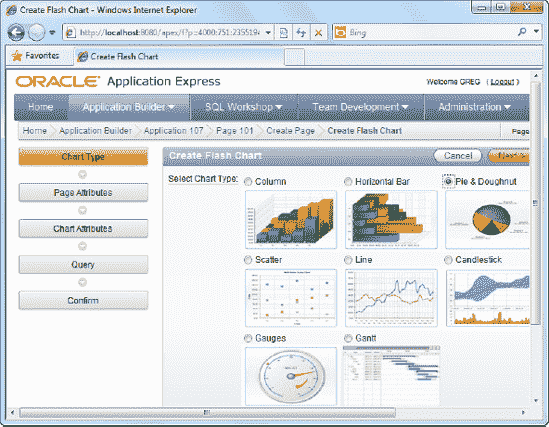

    **图 10-24.** Pie & Doughnut 图表类型

4.  在向导的下一步中选择 `3D Pie` 图表类型，并在页面名称和图表标题中输入 "`Stockcount by Genre`"。
5.  当系统提示你输入图表的 SQL 数据源时，输入以下 SQL：`SELECT NULL LINK, Category.CategoryName LABEL, SUM(Inventory.CopiesInStock) VALUE FROM Category,Books,Inventory WHERE Category.CategoryID= Books.BookCategory AND Books.BookID=Inventory.BookID GROUP BY Category.CategoryName`
6.  现在你应该能看到如 图 10-25 所示的屏幕。

    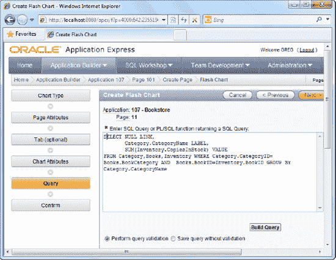

    **图 10-25.** 定义图表的 SQL 数据源

7.  完成向导并运行页面。你应该能立即看到按类别计算的图书总数，如 图 10-26 所示。

    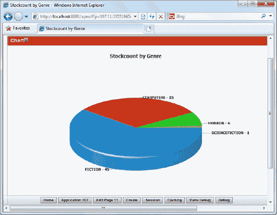

    **图 10-26.** 运行中的库存统计图表

#### 工作原理

正如你在本书前面看到的，你可以轻松地从 SQL 语句生成各种可视化图表。在此配方的示例中，你结合了三个不同表的信息，以检索每个不同图书类别的库存总量。

### 10-6. 设置中央管理页面

#### 问题

你现在有各种页面，但它们都是分散的。你需要提供一个中央管理页面，仓库管理员可以从这里导航到各个管理页面。


#### 解决方案

首先，您必须设置一个导航列表。为此，请按照以下步骤操作：

1.  在同一个 `Book catalog` 应用程序中，点击 `Shared Components` 图标。
2.  在 `Navigation` 区域，点击 图 10-27 所示的 `Lists` 链接。

    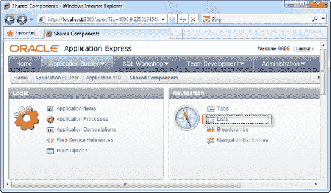

    ***图 10-27.** Lists 链接*

3.  点击右上角的 `Create` 按钮，创建一个新的导航列表。
4.  在向导的第一步，将导航列表命名为 "`AdministrationOptions`"。
5.  在向导的下一步，创建以下四个条目：
    *   Book Categories
    *   Inventory & Stockcount
    *   Books Listing
    *   Stockcount by Genre report
6.  通过点击每个 `Target Page ID or Custom URL` 框旁边的小箭头图标，并从弹出窗口中选择要链接到的正确页面，将每个项目绑定到其各自的报表页面。如 图 10-28 所示。

    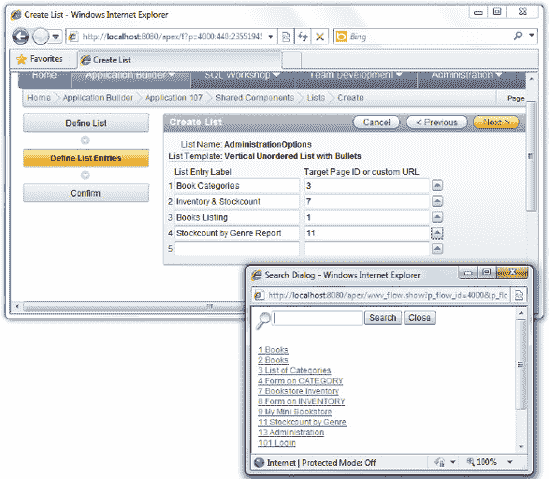

    ***图 10-28.** 设置导航列表*

7.  完成后，完成向导以创建列表。

现在您已经创建了导航列表，需要将其托管在一个页面内——即中央管理页面。要设置此页面，请按照以下步骤操作：

1.  在同一个 `Book catalog` 应用程序中，创建一个新的空白页面。
2.  指定 "`Administration`" 作为页面名称。
3.  使用默认设置完成向导的其余步骤，以创建一个空白页面。
4.  选择编辑该页面。
5.  在 `Page Rendering` 区域，右键单击 `Regions` 节点，并选择创建新区域。
6.  选择 List 区域类型，如 图 10-29 所示。

    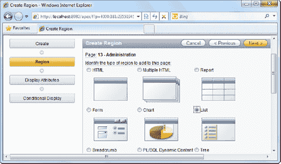

    ***图 10-29.** 创建 List 区域*

7.  将 "`Please pick an option below`" 设置为该区域的标题。
8.  在向导的 `Source` 步骤中，选择您之前创建的 `AdministrationOptions` 列表，如 图 10-30 所示。

    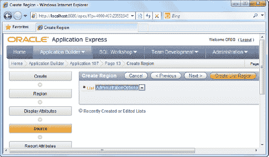

    ***图 10-30.** 为区域选择 AdministrationOptions 列表*

9.  点击 `Create List Region` 按钮完成向导。
10. 现在运行该页面。您应该会看到指向各个管理页面的各种链接，如 图 10-31 所示。尝试点击每个链接以确保您能跳转到正确的页面。

    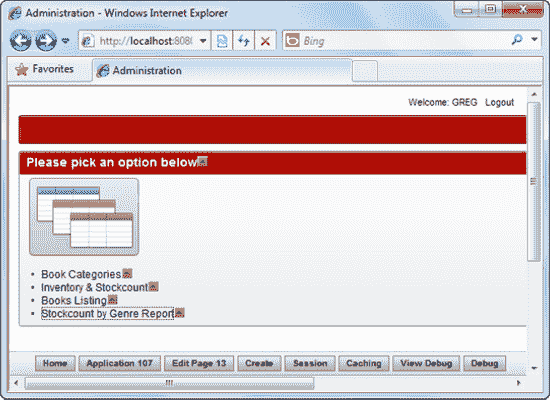

    ***图 10-31.** 运行中的中央管理页面*

#### 工作原理

导航列表提供了一种简单的方法来设置一组链接，这些链接可以直接显示（如本方案所示），甚至可以托管在下拉菜单中。

设置导航列表实际上还有一个附带好处。一旦设置好，它可以在应用程序中被多次重用。这可以简化您应用程序未来的维护工作。例如，当需要删除一个链接时，您不必遍历应用程序中的每个位置去删除该链接。您只需将其从导航列表中移除，所有使用该导航列表的区域都会立即更新。

### 10-7. 在您的应用程序中创建标签页

#### 问题

您有一个中央管理页面——这很好。但是您如何从您的主目录页面（即前端目录页面）导航到那里呢？您意识到您需要标签页。

#### 解决方案

要在您的应用程序中创建标签页，请按照以下步骤操作：

1.  在同一个 `Book catalog` 应用程序中，点击 `Shared Components` 图标。
2.  在 `Navigation` 区域下，点击 图 10-32 所示的 `Tabs` 链接。

    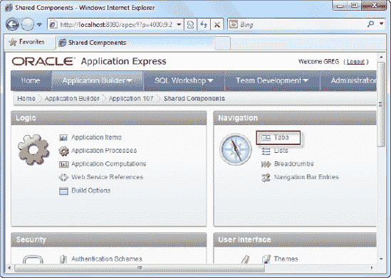

    ***图 10-32.** 导航区域中的 Tabs 链接*

3.  在随后出现的页面上，点击右上角的 `Manage Tabs` 按钮。
4.  点击 `Edit Standard Tabs` 选项卡。
5.  从此列表中移除所有现有的标签页（如果存在条目，请点击 `Edit` 图标，然后在后续页面点击 `Delete` 图标）。
6.  您现在应该看到如 图 10-33 所示的屏幕。

    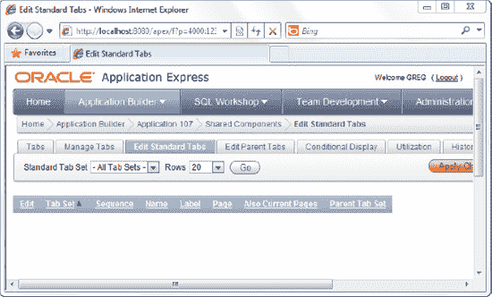

    ***图 10-33.** 移除所有标准标签页*

7.  现在点击 `Manage Tabs` 选项卡，然后点击 图 10-34 中高亮显示的小添加按钮。

    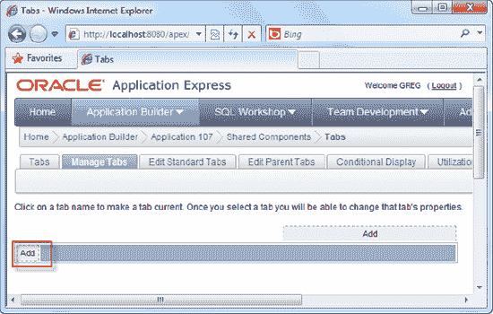

    ***图 10-34.** 添加新标签页*

8.  为新标签集指定名称 "`Book catalogTabs`"，并跳过接下来的几个步骤，直到到达向导的 "`Tab Name`" 步骤。
9.  指定 "`Store`" 作为标签页标签，如 图 10-35 所示。

    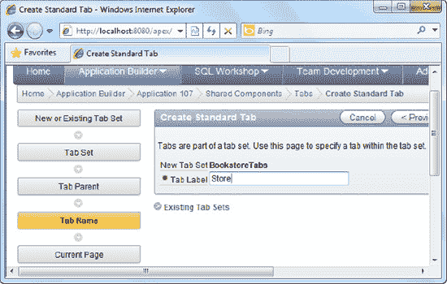

    ***图 10-35.** 创建 Store 标签页*

10. 点击 `Next` 按钮。现在您将能够指定与此标签页关联的页面。通过点击 图 10-36 中高亮显示的箭头，选择 My Mini Book catalog 页面。

    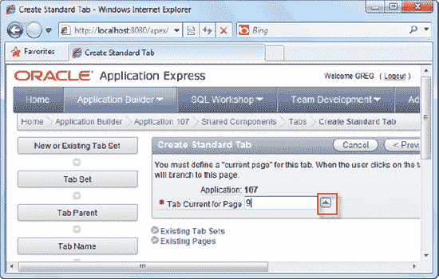

    ***图 10-36.** 为标签页选择关联的页面*

11. 使用提供的默认设置完成向导的其余部分。
12. 您应该会看到您新创建的标签页显示在如 图 10-37 所示的屏幕上。

    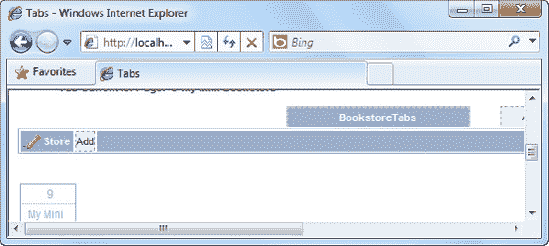

    ***图 10-37.** 新创建的 Store 标签页*

13. 添加另一个标签页，并将其标记为 "`Administration`"。
14. 当系统提示您提供与此标签页关联的页面时，选择中央管理（"`Administration`"）页面。
15. 使用默认设置完成向导的其余部分。
16. 现在再次运行您的应用程序。您将在应用程序顶部看到两个标签页，如 图 10-38 所示。一个将带您到目录前端页面，另一个将带您到中央管理页面。

    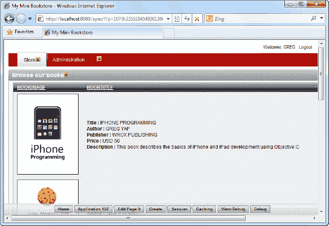

    ***图 10-38.** 带有标签页的最终图书目录网站*

#### 工作原理

APEX 为开发人员承担了大部分标签页视觉表示的工作。一旦您将标签页与特定页面关联起来，APEX 会自动为您高亮显示该标签页（当您位于该页面时），并取消高亮其他标签页。

与导航列表类似，标签页也可以在整个应用程序中重用，并提供相同的易于维护的好处：当需要添加新标签页时，只需将其添加到现有的标签集中，瞧！新标签页会立即出现在应用程序的每个页面上。

## 索引

###  特殊字符与数字

