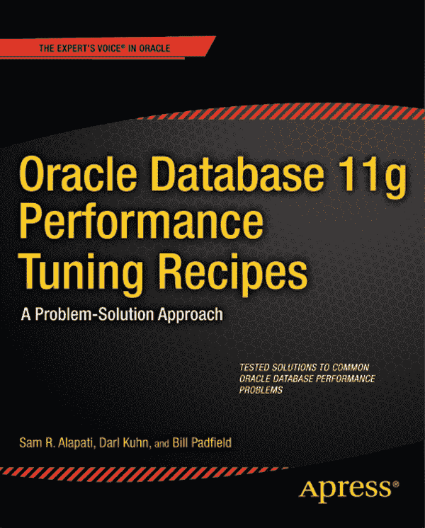
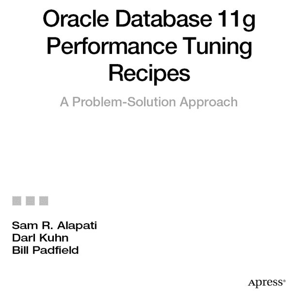

# Oracle Database 11g 性能调优方案：问题-解决方案方法

版权所有 © 2011 Sam R. Alapati, Darl Kuhn 和 Bill Padfield

保留所有权利。未经版权所有者及出版商事先书面许可，不得以任何形式或任何方式（电子或机械方式，包括影印、录制或通过任何信息存储或检索系统）复制或传播本作品的任何部分。

ISBN-13 (平装): 978-1-4302-3662-7

ISBN-13 (电子): 978-1-4302-3663-4

本书中可能出现商标名称、徽标和图片。我们仅以编辑方式使用这些商标名称、徽标和图片，旨在使商标所有者受益，并无侵犯商标的意图。

在本出版物中使用商品名称、商标、服务标志和类似术语，即使未特别标识，也不应被视为表达意见，即这些术语是否受专有权约束。

总裁兼出版人：Paul Manning
主编：Jonathan Gennick
技术评审：Surachart Opun
编辑委员会：Steve Anglin, Mark Beckner, Ewan Buckingham, Gary Cornell, Jonathan Gennick, Jonathan Hassell, Michelle Lowman, James Markham, Matthew Moodie, Jeff Olson, Jeffrey Pepper, Frank Pohlmann, Douglas Pundick, Ben Renow-Clarke, Dominic Shakeshaft, Matt Wade, Tom Welsh
协调编辑：Anita Castro
文字编辑：Mary Ann Fugate
制作支持：Patrick Cunningham
索引：SPI Global
美工：SPI Global
封面设计师：Anna Ishchenko

本书在全球范围内通过 Springer Science+Business Media, LLC.（地址：233 Spring Street, 6th Floor, New York, NY 10013；电话：1-800-SPRINGER；传真：(201) 348-4505；电子邮件：`orders-ny@springer-sbm.com`；或访问网站：`www.springeronline.com`）发行。

如需翻译信息，请发送电子邮件至 `rights@apress.com`，或访问网站 `www.apress.com`。

Apress 和 friends of ED 的图书可批量购买，用于学术、企业或推广用途。大多数图书也提供电子书版本和许可。更多信息，请参考我们的批量销售-电子书许可专页 `www.apress.com/bulk-sales`。

本书信息按“原样”提供，不作任何担保。尽管在编写本作品时已尽一切努力采取预防措施，但作者和 Apress 对因本作品所含信息直接或间接引起的任何损失或损害，不承担任何责任。

*献给 Valerie, Nina 和 Nicholas*
*致以爱意与深情*

*—Sam Alapati*

*献给 Heidi, Brandi 和 Lisa*
*—Darl Kuhn*

*献给 Oyuna 和 Evan，感谢你们包容我，以及我所有花在电脑前、没能陪伴你们的夜晚和周末！！*

*献给 Carol, Gerry, Susan, Doug, Scott, Chris, Jaimie, Katie, Jenny, Jeremy 和 Sean。我爱我的家人！*

*—Bill Padfield*

## 内容概览

关于作者

关于技术评审

致谢

第 1 章：优化表性能

第 2 章：选择与优化索引

第 3 章：优化实例内存

第 4 章：监控系统性能

第 5 章：最小化系统争用

第 6 章：分析操作系统性能

第 7 章：数据库故障排除

第 8 章：创建高效 SQL

第 9 章：手动调优 SQL

第 10 章：追踪 SQL 执行

第 11 章：自动化 SQL 调优

第 12 章：执行计划优化与一致性

第 13 章：配置优化器

第 14 章：实现查询提示

第 15 章：并行执行 SQL

索引

## 目录

关于作者

关于技术审阅者

致谢

## 第 1 章：优化表性能
### 1-1. 构建性能最大化的数据库
### 1-2. 创建表空间以最大化性能
### 1-3. 匹配表类型与业务需求
### 1-4. 为性能选择表特性
### 1-5. 避免创建表时的区分配延迟
### 1-6. 最大化数据加载速度
### 1-7. 高效地移除表数据
### 1-8. 显示自动段指导建议
### 1-9. 手动生成段指导建议
### 1-10. 自动通过电子邮件发送段指导输出
### 1-11. 重建跨越多个块的行
### 1-12. 释放未使用的表空间
### 1-13. 为直接路径加载压缩数据
### 1-14. 为所有 DML 压缩数据
### 1-15. 在列级别压缩数据
### 1-16. 监控表使用情况

## 第 2 章：选择和优化索引
### 2-1. 理解 B-tree 索引
### 2-2. 决定为哪些列创建索引
### 2-3. 创建主键索引
### 2-4. 创建唯一索引
### 2-5. 为外键列创建索引
### 2-6. 决定何时使用组合索引
### 2-7. 通过压缩减小索引大小
### 2-8. 实现基于函数的索引
### 2-9. 为虚拟列创建索引
### 2-10. 避免索引的集中 I/O
### 2-11. 添加索引而不影响现有应用程序
### 2-12. 创建位图索引以支持星型模式
### 2-13. 创建位图连接索引
### 2-14. 创建索引组织表
### 2-15. 监控索引使用情况
### 2-16. 最大化索引创建速度
### 2-17. 回收未使用的索引空间

## 第 3 章：优化实例内存
### 3-1. 自动化内存管理
### 3-2. 管理多个缓冲池
### 3-3. 为内存设置最小值

