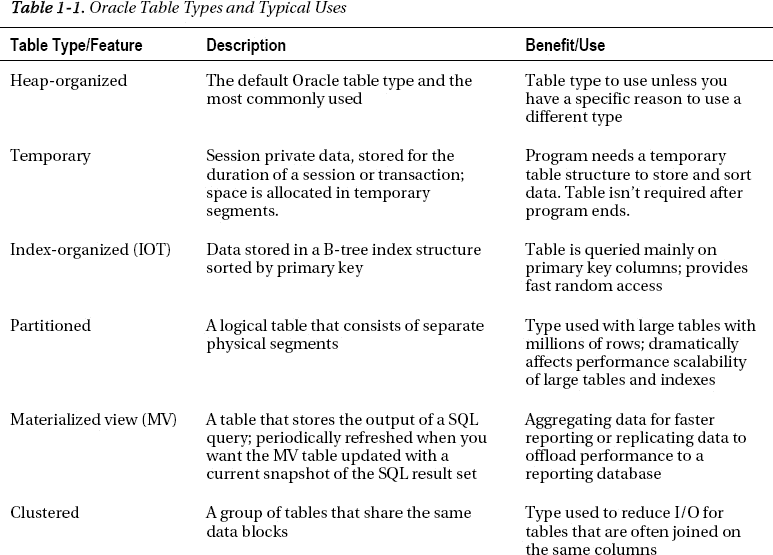
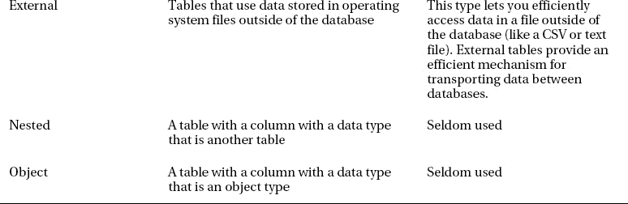
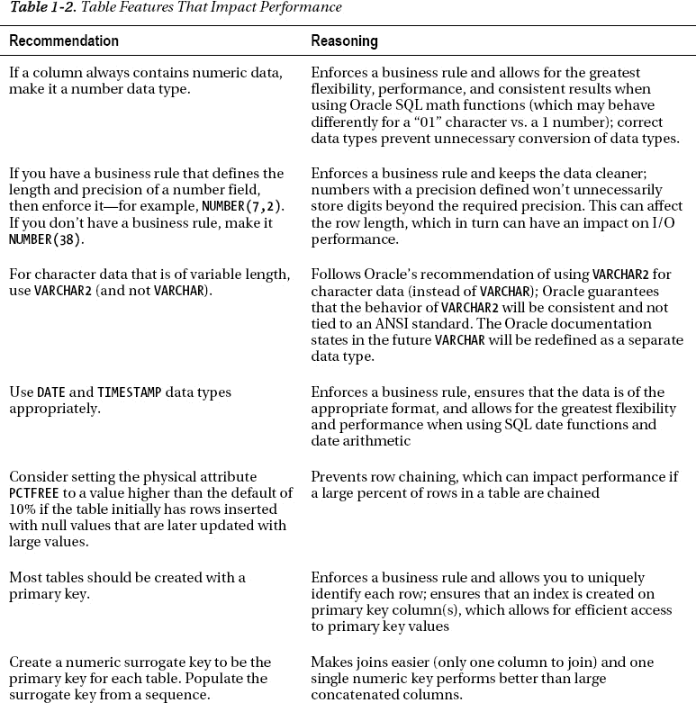
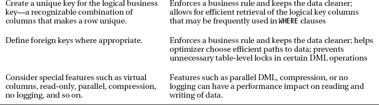
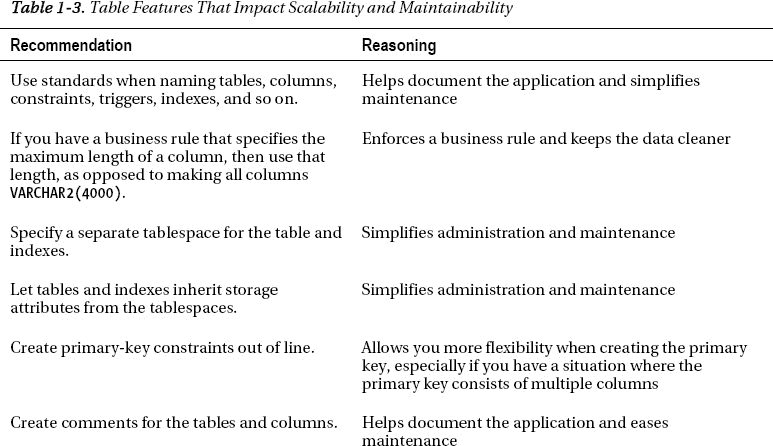
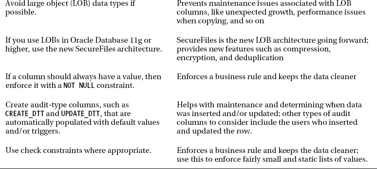

# 第 1 章

## 优化表性能

本章详细介绍了影响表中数据存储与检索性能的数据库特性。表的性能部分取决于在创建表之前实现的数据库特性。例如，首次创建数据库和关联表空间时实现的物理存储特性，会后续影响表的性能。同样，性能也受到您对初始物理特性（如表类型和数据类型）选择的影响。因此，实施实用的数据库、表空间和表创建标准（考虑到性能因素），为优化数据可用性和可扩展性奠定了基础。

一个 `Oracle 数据库` 由用于存储、管理、安全保护和检索数据的物理结构组成。在首次构建数据库时，您可以在数据库创建时实现多个与性能相关的特性。例如，数据文件的初始布局和表空间管理的类型在创建时即被指定。此时做出的架构决策通常具有持久的影响。

`表空间` 是一个逻辑结构，允许您管理一组数据文件。数据文件是磁盘上的物理数据文件。在配置表空间时，有几个需要注意的特性可能对性能产生深远影响，即本地管理的表空间和自动段空间管理（ASSM）的表空间。当您合理地实现这些特性时，就能最大程度地确保未来表的性能可接受。

`表` 是在数据库中存储数据的对象。数据库性能是衡量应用程序执行插入、更新、删除和选择数据操作速度的指标。因此，我们从本书开始就提供关于表性能相关问题的解决方案食谱是恰当的。

我们首先描述影响表性能的数据库和表空间创建的各个方面。接下来，我们将讨论诸如选择满足性能相关业务需求的表类型和数据类型等主题。后续主题包括管理表空间使用的物理实现。我们详细介绍了诸如检测表碎片、处理高水位标记下的空闲空间、行链接和压缩数据等问题。同时介绍了 Oracle 段顾问。这个方便的工具有助于自动检测和解决表碎片及未使用空间的问题。

### 1-1. 构建最大化性能的数据库

#### 问题

您在最初创建数据库时意识到，某些特性（启用时）会对表的性能和可用性产生持久的影响。具体来说，在创建数据库时，您希望执行以下操作：

*   **强制**数据库中创建的所有表空间都必须是本地管理的。本地管理的表空间比已弃用的字典管理技术提供更好的性能。
*   确保用户**自动分配**一个默认的永久表空间。这保证了在创建用户时，他们被分配一个 `SYSTEM` 以外的默认表空间。您绝不希望用户在 `SYSTEM` 表空间中创建对象，因为这可能对性能和可用性产生不利影响。
*   确保用户**自动分配**一个默认的临时表空间。这保证了在创建用户时，他们被分配一个 `SYSTEM` 以外的临时表空间。您绝不希望用户将 `SYSTEM` 表空间用作临时排序空间，因为这可能对性能和可用性产生不利影响。

#### 解决方案

使用如下脚本创建一个符合合理标准的数据库，这些标准为性能良好的数据库奠定了基础：

```sql
CREATE DATABASE O11R2
   MAXLOGFILES 16
   MAXLOGMEMBERS 4
   MAXDATAFILES 1024
   MAXINSTANCES 1
   MAXLOGHISTORY 680
   CHARACTER SET AL32UTF8
DATAFILE
'/ora01/dbfile/O11R2/system01.dbf'
   SIZE 500M REUSE
   EXTENT MANAGEMENT LOCAL
UNDO TABLESPACE undotbs1 DATAFILE
'/ora02/dbfile/O11R2/undotbs01.dbf'
   SIZE 800M
SYSAUX DATAFILE
'/ora03/dbfile/O11R2/sysaux01.dbf'
   SIZE 500M
DEFAULT TEMPORARY TABLESPACE TEMP TEMPFILE
'/ora02/dbfile/O11R2/temp01.dbf'
   SIZE 500M
DEFAULT TABLESPACE USERS DATAFILE
'/ora01/dbfile/O11R2/users01.dbf'
   SIZE 50M
LOGFILE GROUP 1
        ('/ora01/oraredo/O11R2/redo01a.rdo',
         '/ora02/oraredo/O11R2/redo01b.rdo') SIZE 200M,
        GROUP 2
        ('/ora01/oraredo/O11R2/redo02a.rdo',
         '/ora02/oraredo/O11R2/redo02b.rdo') SIZE 200M,
        GROUP 3
        ('/ora01/oraredo/O11R2/redo03a.rdo',
         '/ora02/oraredo/O11R2/redo03b.rdo') SIZE 200M
USER sys    IDENTIFIED BY topfoo
USER system IDENTIFIED BY topsecrectfoo;
```

上述 `CREATE DATABASE` 脚本通过启用以下特性，帮助建立了良好的性能基础：

*   通过 `EXTENT MANAGEMENT LOCAL` 子句将 `SYSTEM` 表空间定义为本地管理；这确保数据库中曾经创建的所有表空间都是本地管理的。如果您使用的是 Oracle Database 11g R2 或更高版本，`EXTENT MANAGEMENT DICTIONARY` 子句已被弃用。
*   定义了一个名为 `USERS` 的默认表空间，用于任何未明确指定默认表空间的用户；这有助于防止用户被分配 `SYSTEM` 表空间作为默认值。使用 `SYSTEM` 作为默认表空间创建的用户可能对性能产生不利影响。
*   为所有用户定义了一个名为 `TEMP` 的默认临时表空间；这有助于防止用户被分配 `SYSTEM` 表空间作为默认临时表空间。使用 `SYSTEM` 作为默认临时表空间创建的用户可能对性能产生不利影响，因为这将导致 `SYSTEM` 表空间中的资源争用。

稳固的性能始于正确配置的数据库。上述建议帮助您为表数据创建一个可靠的基础架构。

## 关于技术审阅者

 `Surachart Opun` 出生于泰国碧差汶府。他获得了计算机工程学士学位。他在互联网服务提供商行业工作了八年多。他在 Oracle 数据库和 Linux 方面拥有丰富经验。他在 Oracle 数据库和 Oracle Real Application Clusters (RAC) 方面工作了六年多。他是 Oracle 认证专家（10g 和 11g）。他也是 Oracle 认证 RAC 专家。他对 Oracle 数据库技术感兴趣并投入了大量时间。他的博客是 [`http://surachartopun.com`](http://surachartopun.com)。他花费了大量时间分享他的 Oracle 知识并帮助人们解决 Oracle 技术问题。2010 年，他成为 Oracle ACE，并在泰国发展 Oracle 用户组，他是该组织的贡献者。


## 工作原理

一个正确配置和创建的数据库将有助于确保您的数据库性能良好。诚然，您可以在数据库创建后修改特性。然而，通常情况下，一个设计不佳的 `CREATE DATABASE` 脚本会导致性能上的永久性限制。在生产数据库环境中，有时很难获得重新配置一个配置不当的数据库所需的停机时间。如果可能，请在创建环境的每一步都考虑性能问题，从如何创建数据库开始。

在创建数据库时，您还应该考虑影响可维护性的特性。一个可持续的数据库带来更长的正常运行时间，这是整体性能等式的一部分。“解决方案”部分中的 `CREATE DATABASE` 语句也考虑了以下可持续性特性：

*   创建一个自动的 `UNDO` 表空间（通过设置 `UNDO_MANAGEMENT` 和 `UNDO_TABLESPACE` 初始化参数来启用自动撤销管理）；这允许 Oracle 自动管理回滚段。这使您免于需要定期监控和调整。
*   将数据文件存放在遵循环境标准的目录中；这有助于维护和可管理性，从而带来更好的长期可用性，进而带来更好的性能。
*   为 DBA 相关用户设置非默认密码；这确保了数据库更安全，长远来看也能影响性能（例如，如果恶意分子侵入数据库并删除数据，那么性能将会受到影响）。
*   建立三组在线重做日志，每组两个成员，大小根据事务负载适当设置；重做日志的大小直接影响其切换频率。当重做日志切换过于频繁时，这会降低性能。

您应该花时间确保您构建的每个数据库都遵循普遍接受的标准，这些标准有助于确保您从一个坚实的性能基础开始。

如果您继承了一个数据库并想验证默认永久表空间设置，请使用如下查询：

```
SELECT *
FROM database_properties
WHERE property_name = 'DEFAULT_PERMANENT_TABLESPACE';
```

如果您需要修改默认永久表空间，请按如下方式操作：

```
SQL> alter database default tablespace users;
```

要验证默认临时表空间的设置，请使用此查询：

```
SELECT *
FROM database_properties
WHERE property_name = 'DEFAULT_TEMP_TABLESPACE';
```

要更改临时表空间的设置，您可以按如下方式操作：

```
SQL> alter database default temporary tablespace temp;
```

您可以通过此查询来验证 `UNDO` 表空间设置：

```
select name, value
from v$parameter
where name in ('undo_management','undo_tablespace');
```

如果您需要更改撤销表空间，首先创建一个新的撤销表空间，然后使用 `ALTER SYSTEM SET UNDO_TABLESPACE` 语句。

### 1-2. 创建表空间以最大化性能

#### 问题

您意识到表空间是数据库对象（如表和索引）的逻辑容器。此外，您知道如果在创建对象时未指定存储属性，那么表和索引将自动继承它们所在表空间的存储特性。因此，您希望以最大化表性能和可维护性的方式创建表空间。

#### 解决方案

当您有选择时，表空间应始终启用以下两个特性创建：

*   本地管理
*   自动段空间管理

这是一个启用前述两个特性的创建表空间的示例：

```
create tablespace tools
  datafile '/ora01/dbfile/INVREP/tools01.dbf'
  size 100m                                -- 固定数据文件大小
  extent management local                  -- 本地管理
  uniform size 128k                        -- 统一区大小
  segment space management auto            -- ASSM
/
```

 注意：自 Oracle 数据库 11g R2 起，`EXTENT MANAGEMENT DICTIONARY` 子句已被弃用。

本地管理的表空间比字典管理的表空间更高效。此特性通过 `EXTENT MANAGEMENT LOCAL` 子句启用。此外，如果您在创建数据库时将 `SYSTEM` 表空间设为本地管理，您将不被允许稍后创建字典管理的表空间。这是期望的行为。

ASSM 特性允许 Oracle 管理许多以前需要由 DBA 在表级别手动调整的存储特性。ASSM 通过 `SEGMENT SPACE MANAGEMENT AUTO` 子句启用。使用 ASSM 使您免于这些手动调整活动。此外，Oracle 的一些空间管理特性（例如收缩表和 SecureFile LOB）仅在使用 ASSM 表空间时才被允许。如果您想利用这些特性，那么您必须使用 ASSM 创建您的表空间。

您可以通过 `UNIFORM SIZE` 子句选择让表空间中每个区的区大小保持一致。或者，您可以指定 `AUTOALLOCATE`。这允许 Oracle 分配 64 KB、1 MB、8 MB 和 64 MB 的区大小。如果表空间中的对象大小通常各不相同，您可能更喜欢自动分配行为。

#### 工作原理

在 Oracle Database 11g R2 之前，您可以选择创建字典管理的表空间。这种架构利用 Oracle 数据字典中的结构来管理对象的区分配和空闲空间。当表或索引的区数量达到数千个时，字典管理的表空间往往会出现性能低下的问题。

您绝不应该再使用字典管理的表空间；而应使用本地管理的表空间。本地管理的表空间使用每个数据文件中的位图来管理对象的区和空闲空间，比已弃用的字典管理架构高效得多。

在早期的 Oracle 版本中，数据库管理员需要花费大量时间监控和修改表的物理空间管理方面。本地管理与自动段空间管理的结合使得许多此类空间设置变得过时。例如，在本地管理的表空间中，以下存储参数是无效的：

*   `NEXT`
*   `PCTINCREASE`
*   `MINEXTENTS`
*   `MAXEXTENTS`
*   `DEFAULT`

`SEGMENT SPACE MANAGEMENT AUTO` 子句指示 Oracle 管理块内的物理空间。使用此子句时，无需再指定诸如以下的参数：

*   `PCTUSED`
*   `FREELISTS`
*   `FREELIST GROUPS`

与 `AUTO` 空间管理对应的是 `MANUAL` 空间管理。使用 `MANUAL` 时，您可以根据应用程序的需求调整前面提到的参数。我们建议您使用 `AUTO`（而不要使用 `MANUAL`）。使用 `AUTO` 可以减少您原本需要配置和管理的参数数量。您可以通过以下查询来验证是否使用了本地管理和 ASSM：

```sql
select
 tablespace_name
,extent_management
,segment_space_management
from dba_tablespaces;
```

以下是一些示例输出：

```sql
TABLESPACE_NAME                EXTENT_MAN SEGMENT
------------------------------ ---------- -------
SYSTEM                         LOCAL      MANUAL
SYSAUX                         LOCAL      AUTO
UNDOTBS1                       LOCAL      MANUAL
TEMP                           LOCAL      MANUAL
USERS                          LOCAL      AUTO
TOOLS                          LOCAL      AUTO
```

 **注意** 您无法使用自动段空间管理来创建 `SYSTEM` 表空间。此外，ASSM 功能仅对永久的、本地管理的表空间有效。

您还可以指定数据文件在变满时自动增长。这是通过 `AUTOEXTEND ON` 子句设置的。如果您使用此功能，我们建议您为数据文件设置一个总体的最大大小。这将防止失控或错误的 SQL 意外消耗所有可用的磁盘空间。以下是一个示例子句：

```sql
SIZE 1G AUTOEXTEND ON MAXSIZE 10G
```

在创建表空间时，您还可以指定表空间类型为 `smallfile` 或 `bigfile`。在 Oracle Database 10g 之前，`smallfile` 是唯一的选择。`smallfile` 表空间允许您为一个表空间关联一个或多个数据文件。这使您可以将（与一个表空间关联的）数据文件分散在许多不同的挂载点上。对于许多环境来说，这种灵活性是必需的。

`bigfile` 表空间只能关联一个数据文件。`bigfile` 功能的主要优点是您可以创建非常大的数据文件，这反过来又允许您创建非常大的数据库。例如，使用 8 KB 块大小，您可以创建最大 32 TB 的数据文件。使用 32 KB 块大小，您可以创建最大 128 TB 的数据文件。此外，使用 `bigfile` 时，通常需要管理和维护的数据文件更少。在您使用 Oracle 自动存储管理功能的环境中，这种行为可能是理想的。在 ASM 环境中，通常只呈现一个逻辑磁盘位置供您分配空间。

以下是创建 `bigfile` 表空间的示例：

```sql
create bigfile tablespace tools_bf
  datafile '/ora01/dbfile/O11R2/tools_bf01.dbf'
  size 100m
  extent management local
  uniform size  128k
  segment space management auto
/
```

您可以通过此查询验证表空间类型：

```sql
SQL> select tablespace_name, bigfile from dba_tablespaces;
```

除非特别指定，默认的表空间类型是 `smallfile`。当您创建数据库时，可以通过 `SET DEFAULT BIGFILE TABLESPACE` 子句将 `bigfile` 设为该数据库的默认表空间类型。您可以使用 `ALTER DATABASE SET DEFAULT BIGFILE TABLESPACE` 语句将数据库的默认表空间类型更改为 `bigfile`。

### 1-3. 将表类型与业务需求相匹配

#### 问题

您刚接触 Oracle，并已了解可用的各种表类型。例如，您可以在堆组织表、索引组织表等之间选择。您想要构建一个数据库应用程序，并需要决定使用哪种表类型。

#### 解决方案

Oracle 提供了多种表类型。默认的表类型是堆组织的。对于大多数应用程序，堆组织表是存储和检索数据的有效结构。然而，还有其他您应该了解的表类型，并且您应该知道在什么情况下应实现每种表类型。表 1-1 描述了每种表类型及其适用场景。





#### 工作原理

在大多数场景下，堆组织表足以满足您的需求。这种 Oracle 表类型是一种经过验证的结构，广泛应用于各种数据库环境。如果您正确设计了数据库（规范化结构）并结合适当的索引和约束，结果应该是一个性能良好且易于维护的系统。

通常，您的大部分表都将是堆组织的。但是，如果您需要利用非堆功能（并确信其益处），那么当然可以这样做。例如，Oracle 分区是构建超大表和索引的一种可扩展方式。物化视图是聚合和复制数据的可靠功能。索引组织表是高效的结构，当大多数列是主键的一部分时（如多对多关系中的连接表），非常适用。等等。

 **注意**  您不应仅仅因为认为某个功能很酷或最近刚听说就选择一种表类型。有时，人们了解到某个功能后，就在不知道其性能收益或维护成本的情况下决定实施它。您应该首先能够测试并证明该功能确实具有切实的性能优势。

### 1-4. 为性能选择表功能

#### 问题

在创建表时，您希望实现能最大化性能、可扩展性和可维护性的适当数据类型和约束。

#### 解决方案

在创建表时，有几个性能和可持续性问题需要考虑。表 1-2 描述了与表性能相关的特定功能。





#### 工作原理

“解决方案”部分描述了与性能相关的表特性。在创建表时，您还应该考虑增强可扩展性和可用性的功能。通常，数据库管理员和开发人员并不认为这些功能是提高性能的方法。然而，构建一个稳定且可支持的数据库与良好的性能是相辅相成的。表 1-3 描述了促进表管理便利性的最佳实践功能。





### 1-5. 避免创建表时的区分配延迟


## 延迟段分配

#### 问题

您正在安装一个包含数千个表和索引的应用程序。每个表和索引都被配置为初始分配一个 10 MB 的区。在将安装 DDL 部署到生产环境时，您希望尽快安装这些数据库对象。您意识到，如果每个对象在创建时都分配 10 MB 的磁盘空间，那么部署 DDL 将需要一些时间。您想知道是否可以以某种方式指示 Oracle 将每个对象的初始区分配推迟到数据实际插入表中时。

#### 解决方案

推迟初始段生成的唯一方法是使用 Oracle Database 11g R2。使用此版本（或更高版本）的数据库时，默认情况下，表（及关联索引）的区物理分配将被推迟，直到记录首次插入该表。一个小示例将有助于说明这个概念。首先创建一个表：

```
SQL> create table f_regs(reg_id number, reg_name varchar2(200));
```

现在查询 `USER_SEGMENTS` 和 `USER_EXTENTS` 以验证尚未分配物理空间：

```
SQL> select count(*) from user_segments where segment_name='F_REGS';
  COUNT(*)
----------
         0

SQL> select count(*) from user_extents where segment_name='F_REGS';
  COUNT(*)
----------
         0
```

接下来插入一条记录，并再次运行之前的查询：

```
SQL> insert into f_regs values(1,'BRDSTN');

1 row created.

SQL>> select count(*) from user_segments where segment_name='F_REGS';
 COUNT(*)
----------
         1

SQL> select count(*) from user_extents where segment_name='F_REGS';
  COUNT(*)
----------
         1
```

先前的行为与 Oracle 的早期版本有很大不同。在早期版本中，一旦您创建对象，就会立即分配段和关联的区。

 注意：延迟段生成也适用于分区表和索引。在记录首次插入给定分区之前，不会为该分区分配区。

#### 工作原理

从 Oracle Database 11g R2 开始，对于在本地管理表空间中创建的非分区堆组织表，初始段创建会被推迟，直到记录插入该表。您需要了解 Oracle 的延迟段创建功能，原因有几个：

*   允许更快地安装包含大量表和索引的应用程序；这提升了安装速度，尤其是在您有数千个对象时。
*   作为 DBA，当您注意到对象没有分配空间时，最初可能会对空间使用报告感到困惑。
*   创建第一行所需的时间会比以前的版本稍长一些（因为现在 Oracle 根据第一行的创建来分配第一个区）。对于大多数应用程序来说，这种性能下降并不明显。

我们意识到，要利用此功能，唯一的“解决方案”是升级到 Oracle Database 11g R2，而这通常并不可行。然而，我们认为讨论此功能很重要，因为您最终会遇到上述特性（当您开始使用 Oracle 的最新版本时）。

您可以通过将数据库初始化参数 `DEFERRED_SEGMENT_CREATION` 设置为 `FALSE` 来禁用延迟段创建功能。此参数的默认值为 `TRUE`。

在创建表时，您也可以控制延迟段创建行为。`CREATE TABLE` 语句有两个新子句：`SEGMENT CREATION IMMEDIATE` 和 `SEGMENT CREATION DEFERRED`——例如：

```
create table f_regs(
 reg_id number
,reg_name varchar2(2000))
segment creation immediate;
```

 注意：在使用 `SEGMENT CREATION DEFERRED` 子句之前，`COMPATIBLE` 初始化参数需要为 11.2.0.0.0 或更高。

### 1-6. 最大化数据加载速度

#### 问题

您正在将大量数据加载到一个表中，并希望尽可能快地插入新记录。

#### 解决方案

结合使用以下两个功能来最大化插入语句的速度：

*   将表的日志记录属性设置为 `NOLOGGING`；这可以最大限度地减少直接路径操作生成的重做日志（此功能对常规 DML 操作无效）。
*   使用直接路径加载功能，例如：
    *   对于使用子查询确定要插入记录的查询，使用 `INSERT /*+ APPEND */`
    *   对于使用 `VALUES` 子句的查询，使用 `INSERT /*+ APPEND_VALUES */`
    *   使用 `CREATE TABLE…AS SELECT`

下面是一个示例来说明 `NOLOGGING` 和直接路径加载。首先，运行以下查询以验证表的日志记录状态。在此示例中，表名为 `F_REGS`：

```
select
 table_name
,logging
from user_tables
where table_name = 'F_REGS';
```

以下是一些示例输出：

```
TABLE_NAME             LOG
------------------------------ ---
F_REGS                     YES
```

以上输出验证了该表是在启用 `LOGGING` 的情况下创建的（默认值）。要启用 `NOLOGGING`，请使用 `ALTER TABLE` 语句，如下所示：

```
SQL> alter table f_regs nologging;
```

既然已启用 `NOLOGGING`，那么直接路径操作应只会生成最少数量的重做日志。以下示例使用直接路径 `INSERT` 语句将数据加载到表中：

```
insert /*+APPEND */ into f_regs
select * from reg_master;
```

前面的语句是一种高效的数据加载方法，因为诸如 `INSERT /*+APPEND */` 与 `NOLOGGING` 结合使用的直接路径操作会生成最少数量的重做日志。


