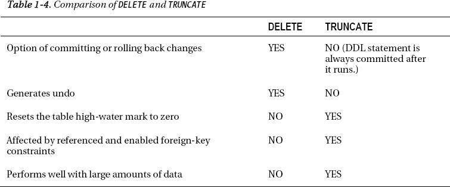
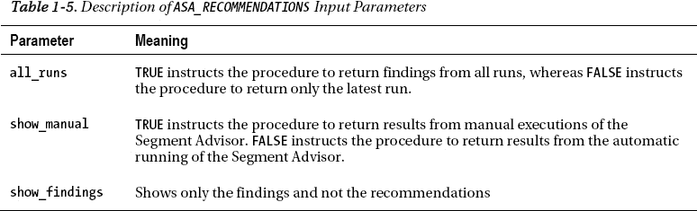
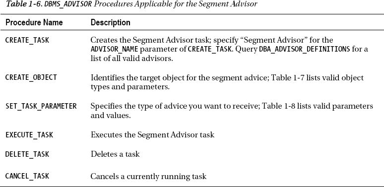
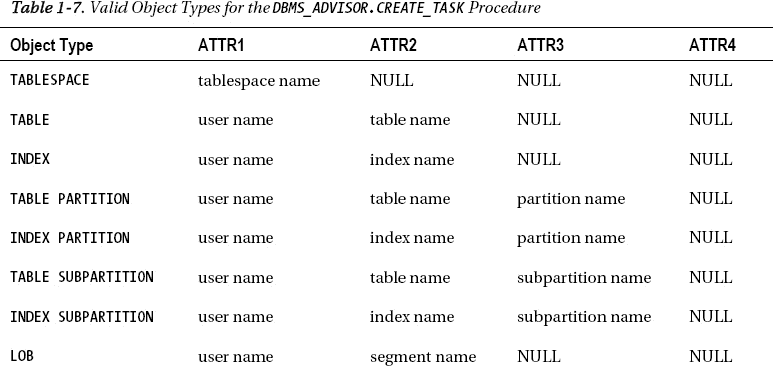
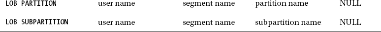
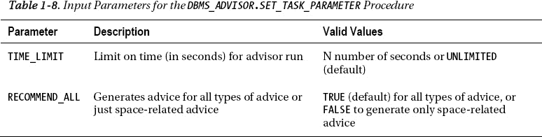

# 1-7. 高效地删除表数据

## 问题

你在从表中删除数据时遇到了性能问题。你希望尽可能高效地移除数据。

## 解决方案

你可以使用 `TRUNCATE` 语句或 `DELETE` 语句来移除表中的记录。`TRUNCATE` 通常更高效，但有一些你必须注意的副作用。例如，`TRUNCATE` 是一条 DDL 语句。这意味着 Oracle 在它运行后会自动提交该语句（以及当前的事务），因此无法回滚 `TRUNCATE` 语句。因为 `TRUNCATE` 语句是 DDL，所以你不能将两个独立的表的截断操作作为一个事务来处理。

此示例使用 `TRUNCATE` 语句移除 `COMPUTER_SYSTEMS` 表中的所有数据：

```sql
SQL> truncate table computer_systems;
```

截断表时，默认情况下，除了由 `MINEXTENTS` 表存储参数定义的空间外，为表分配的所有空间都将被释放。如果你不希望 `TRUNCATE` 语句释放当前已分配的区段，请使用 `REUSE STORAGE` 子句：

```sql
SQL> truncate table computer_systems reuse storage;
```

你可以查询 `DBA_EXTENTS`、`ALL_EXTENTS` 或 `USER_EXTENTS` 视图来验证区段是否已被释放（或未被释放）——例如：

```sql
select count(*)
  from user_extents where segment_name = 'COMPUTER_SYSTEMS';
```


#### 工作原理

如果你需要在删除数据时选择回退（而非提交），那么应该使用 `DELETE` 语句。然而，`DELETE` 语句的缺点在于它会生成大量的撤销和重做信息。因此，对于大表而言，`TRUNCATE` 语句通常是删除数据最高效的方式。

`TRUNCATE` 语句的另一个特点是它会将表的高水位线重置为零。当你使用 `DELETE` 语句从表中删除数据时，高水位线并不会改变。使用 `TRUNCATE` 语句并重置高水位线的一个优势是，全表扫描查询只会搜索高水位线以下的数据块。这对于执行全表扫描的查询可能具有显著的性能影响。

`TRUNCATE` 语句的另一个副作用是，你无法截断一个父表，即使该父表的主键被子表中一个已启用的外键约束所引用——即使子表中没有任何行。在这种情况下，当尝试截断父表时，Oracle 会抛出此错误：
`ORA-02266: unique/primary keys in table referenced by enabled foreign keys`

Oracle 阻止你截断父表，因为在多用户系统中，在你截断子表和随后截断父表之间，有可能另一个会话向子表中填充了数据。在这种情况下，你必须暂时禁用子表引用的外键约束，发出 `TRUNCATE` 语句，然后重新启用这些约束。

将 `TRUNCATE` 的行为与 `DELETE` 语句进行比较。Oracle 确实允许你在约束启用的情况下使用 `DELETE` 语句从父表中删除行（假设子表中没有行）。这是因为 `DELETE` 会生成撤销记录，具有读一致性，并且可以被回滚。表 1-4 总结了 `DELETE` 和 `TRUNCATE` 之间的区别。

如果你需要使用 `DELETE` 语句，你必须发出 `COMMIT` 或 `ROLLBACK` 来完成事务。提交 `DELETE` 语句会使数据更改永久生效：

```sql
SQL> delete from computer_systems;
SQL> commit;
```

 **注意** 提交事务的其他（有时不那么明显）方式包括：发出后续的 DDL 语句（它会隐式提交会话中的活动事务），或正常退出客户端工具（如 SQL*Plus）。

如果你发出的是 `ROLLBACK` 语句而非 `COMMIT`，那么表中的数据将恢复到执行 `DELETE` 之前的状态。

在处理 DML 语句时，你可以通过查询 `V$TRANSACTION` 视图来确认事务的详细信息。例如，假设你刚刚向表中插入了数据；在你发出 `COMMIT` 或 `ROLLBACK` 之前，你可以查看当前连接会话的活动事务信息，如下所示：

```sql
SQL> insert into computer_systems(cs_id) values(1);
SQL> select xidusn, xidsqn from v$transaction;
    XIDUSN      XIDSQN
---------- ----------
         3      12878
SQL> commit;
SQL> select xidusn, xidsqn from v$transaction;
no rows selected
```



 **注意** 另一种从表中删除数据的方法是删除并重新创建表。然而，这意味着你也必须重新创建属于该表的任何索引、约束、授权和触发器。此外，当你删除一个表时，在重新创建它并重新发出任何所需的授权之前，它会暂时不可用。通常，删除并重新创建表仅在开发或测试环境中是可以接受的。

### 1-8. 显示自动化段顾问建议

#### 问题

你有一个访问表的性能不佳的查询。经过进一步调查，你发现该表中只有几行数据。你很疑惑，当行数如此之少时，为什么查询会花费这么长时间。你想检查段顾问的输出，看看是否有任何与空间相关的建议可能有助于改善这种情况下的性能。

#### 解决方案

使用段顾问来显示关于那些可能已分配空间（曾经被使用过）但现在空间为空（由于大量行被删除）的表的信息。具有大量未使用空间的表可能导致全表扫描查询性能低下。这是因为 Oracle 会扫描高水位线下的每个数据块，而不管这些数据块是否包含数据。

此解决方案侧重于通过 `DBMS_SPACE` PL/SQL 包访问段顾问的建议。此包检索段顾问生成的关于可能适合收缩、移动或压缩的段的信息。使用 `DBMS_SPACE` 包（以获取段顾问建议）的一种简单有效的方法是通过 SQL 查询——例如：

```sql
SELECT
 'Segment Advice --------------------------'|| chr(10) ||
 'TABLESPACE_NAME  : ' || tablespace_name   || chr(10) ||
 'SEGMENT_OWNER    : ' || segment_owner     || chr(10) ||
 'SEGMENT_NAME     : ' || segment_name      || chr(10) ||
 'ALLOCATED_SPACE  : ' || allocated_space   || chr(10) ||
 'RECLAIMABLE_SPACE: ' || reclaimable_space || chr(10) ||
 'RECOMMENDATIONS  : ' || recommendations   || chr(10) ||
 'SOLUTION 1       : ' || c1                || chr(10) ||
 'SOLUTION 2       : ' || c2                || chr(10) ||
 'SOLUTION 3       : ' || c3 Advice
FROM
TABLE(dbms_space.asa_recommendations('FALSE', 'FALSE', 'FALSE'));
```

以下是一些示例输出：

```
Segment Advice --------------------------
TABLESPACE_NAME  : USERS
SEGMENT_OWNER    : MV_MAINT
SEGMENT_NAME     : F_REGS
ALLOCATED_SPACE  : 20971520
RECLAIMABLE_SPACE: 18209960
RECOMMENDATIONS  : Perform re-org on the object F_REGS, estimated savings is 18209960 bytes.
SOLUTION 1       : Perform Reorg
SOLUTION 2       :
SOLUTION 3       :
```

在前面的输出中，`F_REGS` 表是收缩操作的候选对象。它占用了 20 MB 空间，其中 18 MB 可以被回收。

## 工作原理

在 Oracle Database 10g R2 及更高版本中，Oracle 会自动调度并运行一个“段顾问”作业。此作业分析数据库中的段，并将其发现的结果存储在内部表中。段顾问的输出包含发现（可能需要解决的问题）和建议（用于解决问题的操作）。段顾问的发现分为以下几种类型：

*   适合执行收缩操作的段
*   存在严重行链接的段
*   可能受益于 OLTP 压缩的段

在查看段顾问的发现和建议时，了解该工具的几个方面非常重要。首先，段顾问通过一个自动调度的 `DBMS_SCHEDULER` 作业定期计算建议。您可以通过查询 `DBA_AUTO_SEGADV_SUMMARY` 视图来确认自动作业上次运行的时间：

```sql
select
 segments_processed
,end_time
from dba_auto_segadv_summary
order by end_time;
```

以下是一些示例输出：

```
SEGMENTS_PROCESSED END_TIME
------------------ ----------------------------
                 9 30-JAN-11 02.02.46.414424 PM
                11 30-JAN-11 06.03.44.500178 PM
                17 30-JAN-11 10.04.35.688915 PM
```

您可以将 `END_TIME` 日期与当前日期进行比较，以确定段顾问是否定期运行。

 **注意** 除了自动生成的段建议外，您还可以选择手动执行段顾问，以针对特定的表空间、表和索引生成建议（详情请参阅配方 1-9）。

当段顾问执行时，它使用自动工作负载仓库 (AWR) 作为其分析的信息来源。例如，段顾问检查 AWR 中的使用情况和增长统计信息以生成段建议。段顾问运行时，会生成建议并将输出存储在内部数据库表中。可以通过以下数据字典视图查看这些建议和推荐：

*   `DBA_ADVISOR_EXECUTIONS`
*   `DBA_ADVISOR_FINDINGS`
*   `DBA_ADVISOR_OBJECTS`

有三种不同的工具可用于检索段顾问的输出：

*   执行 `DBMS_SPACE.ASA_RECOMMENDATIONS`
*   手动查询 `DBA_ADVISOR_*` 视图
*   查看企业管理器的图形界面

在“解决方案”部分，我们描述了如何使用 `DBMS_SPACE.ASA_RECOMMENDATIONS` 过程来获取段顾问建议。`ASA_RECOMMENDATIONS` 的输出可以通过三个输入参数进行修改，这些参数在 表 1-5 中进行了描述。例如，您可以指示该过程显示在手动执行段顾问时生成的信息。



您也可以直接查询数据字典视图来查看段顾问的建议。以下是一个显示过去一天内生成的段顾问建议的查询：

```sql
select
 'Task Name        : ' || f.task_name  || chr(10) ||
 'Start Run Time   : ' || TO_CHAR(execution_start, 'dd-mon-yy hh24:mi') || chr (10) ||
 'Segment Name     : ' || o.attr2    || chr(10) ||
 'Segment Type     : ' || o.type       || chr(10) ||
 'Partition Name   : ' || o.attr3      || chr(10) ||
 'Message          : ' || f.message    || chr(10) ||
 'More Info        : ' || f.more_info  || chr(10) ||
 '------------------------------------------------------' Advice
FROM dba_advisor_findings   f
    ,dba_advisor_objects    o
    ,dba_advisor_executions e
WHERE o.task_id   = f.task_id
AND   o.object_id = f.object_id
AND   f.task_id   = e.task_id
AND   e. execution_start > sysdate - 1
AND   e.advisor_name = 'Segment Advisor'
ORDER BY f.task_name;
```

以下是一些示例输出：

```
Task Name        : SYS_AUTO_SPCADV_53092205022011
Start Run Time   : 05-feb-11 22:09
Segment Name     : CWP_USER_PROFILE
Segment Type     : TABLE
Partition Name   :
Message          : Compress object REP_MV.CWP_USER_PROFILE, estimated savings is
 3933208576 bytes.
More Info        : Allocated Space:3934257152: Used Space:10664: Reclaimable Spa
ce :3933208576:
------------------------------------------------------
```

前面的输出表明一个表段是压缩的候选对象。显示已分配空间、已用空间和可回收空间数字，以帮助您确定可节省的空间。

您也可以从企业管理器查看段顾问建议。要查看建议，首先导航到“顾问中心”页面。接着导航到“段顾问”页面。然后导航到“段顾问建议”。此页面将显示任何最近的段顾问发现和建议。

### 1-9. 手动生成段顾问建议

#### 问题

您有一个经历了大量更新操作的表。您注意到对该表的查询性能已经下降。您怀疑该表可能由于行链接而性能不佳。因此，您想通过段顾问手动确认一个表是否存在行链接问题。

### 解决方案

你可以手动运行段顾问，让其专门分析表空间中的所有段，或查看特定对象（如单个表或索引）。你可以通过执行以下步骤，使用 `DBMS_ADVISOR` 包手动为特定段生成建议：

1.  创建一个任务。
2.  将对象分配给该任务。
3.  设置任务参数。
4.  执行任务。

 **注意** 执行 `DBMS_ADVISOR` 的数据库用户需要 `ADVISOR` 系统权限。此权限通过 `GRANT` 语句管理。

以下示例从一个匿名 PL/SQL 块执行 `DBMS_ADVISOR` 包。被检查的表是 `F_REGS` 表。

```sql
DECLARE
  my_task_id   number;
  obj_id       number;
  my_task_name varchar2(100);
  my_task_desc varchar2(500);
BEGIN
  my_task_name := 'F_REGS Advice';
  my_task_desc := 'Manual Segment Advisor Run';

 ---------
 -- 步骤 1
 ---------
  dbms_advisor.create_task (
  advisor_name => 'Segment Advisor',
  task_id      => my_task_id,
  task_name    => my_task_name,
  task_desc    => my_task_desc);
 ---------
 -- 步骤 2
 ---------
  dbms_advisor.create_object (
  task_name   => my_task_name,
  object_type => 'TABLE',
  attr1       => 'MV_MAINT',
  attr2       => 'F_REGS',
  attr3       => NULL,
  attr4       => NULL,
  attr5       => NULL,
  object_id   => obj_id);
 ---------
 -- 步骤 3
 ---------
  dbms_advisor.set_task_parameter(
  task_name => my_task_name,
  parameter => 'recommend_all',
  value     => 'TRUE');
 ---------
 -- 步骤 4
 ---------
  dbms_advisor.execute_task(my_task_name);
END;
/
```

现在，你可以通过执行 `DBMS_SPACE` 包并指示其从手动执行的段顾问中提取信息（通过输入参数——详见表 1-6）来查看关于此表的段顾问建议，例如：

```sql
SELECT
 'Segment Advice --------------------------'|| chr(10) ||
 'TABLESPACE_NAME  : ' || tablespace_name   || chr(10) ||
 'SEGMENT_OWNER    : ' || segment_owner     || chr(10) ||
 'SEGMENT_NAME     : ' || segment_name      || chr(10) ||
 'ALLOCATED_SPACE  : ' || allocated_space   || chr(10) ||
 'RECLAIMABLE_SPACE: ' || reclaimable_space || chr(10) ||
 'RECOMMENDATIONS  : ' || recommendations   || chr(10) ||
 'SOLUTION 1       : ' || c1                || chr(10) ||
 'SOLUTION 2       : ' || c2                || chr(10) ||
 'SOLUTION 3       : ' || c3 Advice
FROM
TABLE(dbms_space.asa_recommendations('TRUE', 'TRUE', 'FALSE'));
```

以下是一些示例输出：

```
Segment Advice --------------------------
TABLESPACE_NAME  : USERS
SEGMENT_OWNER    : MV_MAINT
SEGMENT_NAME     : F_REGS
ALLOCATED_SPACE  : 20971520
RECLAIMABLE_SPACE: 18209960
RECOMMENDATIONS  : Perform re-org on the object F_REGS, estimated savings is 182
09960 bytes.
SOLUTION 1       : Perform Reorg
SOLUTION 2       :
SOLUTION 3       :
```

你也可以通过查询数据字典视图来检索段顾问建议，例如：

```sql
SELECT
 'Task Name        : ' || f.task_name  || chr(10) ||
 'Segment Name     : ' || o.attr2      || chr(10) ||
 'Segment Type     : ' || o.type       || chr(10) ||
 'Partition Name   : ' || o.attr3      || chr(10) ||
 'Message          : ' || f.message    || chr(10) ||
 'More Info        : ' || f.more_info TASK_ADVICE
FROM dba_advisor_findings f
    ,dba_advisor_objects  o
WHERE o.task_id = f.task_id
AND o.object_id = f.object_id
AND f.task_name like 'F_REGS Advice'
ORDER BY f.task_name;
```

如果表存在行链接的潜在问题，那么建议输出将如下所示：

```
TASK_ADVICE
--------------------------------------------------------------------------------
Task Name        : F_REGS Advice
Segment Name     : F_REGS
Segment Type     : TABLE
Partition Name   :
Message          : Perform re-org on the object F_REGS, estimated savings is 182
09960 bytes.
More Info        : Allocated Space:20971520: Used Space:2761560: Reclaimable Spa
ce :18209960:
```

### 工作原理

`DBMS_ADVISOR` 包用于手动指示段顾问为特定表生成建议。该包包含多个过程，用于执行诸如创建和执行任务等操作。表 1-6 列出了与段顾问相关的过程。



段顾问可以以各种粒度调用。例如，你可以生成表空间中所有对象的建议，或特定表、索引或分区的建议。表 1-7 列出了可以通过 `DBMS_ADVISOR.CREATE_TASK` 过程获取段顾问建议的对象类型。





你还可以指定希望段顾问运行的最长时间。这是通过 `SET_TASK_PARAMETER` 过程控制的。该过程还控制生成的建议类型。表 1-8 描述了此过程的有效输入。



## 1-10. 自动通过电子邮件发送段顾问输出

### 问题

你意识到段顾问会自动生成建议，并希望通过电子邮件自动接收段顾问输出。

### 解决方案

首先将显示段顾问输出的 SQL 封装在一个 shell 脚本中，例如：

```bash
#!/bin/bash
if [ $# -ne 1 ]; then
  echo "Usage: $0 SID"
  exit 1
fi
# source oracle OS variables
. /var/opt/oracle/oraset $1
#
 BOX=`uname -a | awk '{print$2}'`
#
sqlplus -s <<EOF
mv_maint/foo
spo $HOME/bin/log/seg.txt
set lines 80
set pages 100
SELECT
 'Segment Advice --------------------------'|| chr(10) ||
 'TABLESPACE_NAME  : ' || tablespace_name   || chr(10) ||
 'SEGMENT_OWNER    : ' || segment_owner     || chr(10) ||
 'SEGMENT_NAME     : ' || segment_name      || chr(10) ||
 'ALLOCATED_SPACE  : ' || allocated_space   || chr(10) ||
 'RECLAIMABLE_SPACE: ' || reclaimable_space || chr(10) ||
 'RECOMMENDATIONS  : ' || recommendations   || chr(10) ||
 'SOLUTION 1       : ' || c1                || chr(10) ||
 'SOLUTION 2       : ' || c2                || chr(10) ||
 'SOLUTION 3       : ' || c3 Advice
FROM
TABLE(dbms_space.asa_recommendations('FALSE', 'FALSE', 'FALSE'));
EOF
cat $HOME/bin/log/seg.txt | mailx -s "Seg. rpt. on DB: $1 $BOX" dkuhn@oracle.com
exit 0
```

前面的 shell 脚本可以通过 Linux/Unix 实用程序（如 `cron`）定期执行。这是一个 `cron` 条目示例：

```
# Segment Advisor report
16 11 * * * /orahome/oracle/bin/seg.bsh DWREP
```

这样，你就能自动接收段建议，并在问题演变成性能问题之前主动解决它们。

### 工作原理

段顾问会定期自动生成建议。有时主动向自己发送建议会很方便。这使你可以定期审阅输出，并实施有意义的建议。

“解决方案”部分中的 shell 脚本在靠近顶部的位置有一行，通过运行 `oraset` 脚本来设置操作系统变量。这是一个自定义脚本，等同于 Oracle 提供的 `oraset` 脚本。你可以使用脚本来设置操作系统变量，或者将所需的行硬编码到脚本中。调用脚本来设置变量更灵活且易于维护，因为它允许你使用 `oratab` 文件中出现的任何数据库名称作为输入。

## 1-11. 重建跨多个块的行


#### 问题

您有一个表，其中的单行数据被存储在多个数据块中。这种情况会导致较高的 I/O 率，并使针对该表的查询运行缓慢。您需要重建这些跨块行，使得每行都能放入单个数据块中。

例如，您正在运行以下查询，该查询显示了段顾问的建议：

```
SELECT
 'Task Name        : ' || f.task_name  || chr(10) ||
 'Segment Name     : ' || o.attr2      || chr(10) ||
 'Segment Type     : ' || o.type       || chr(10) ||
 'Partition Name   : ' || o.attr3      || chr(10) ||
 'Message          : ' || f.message    || chr(10) ||
 'More Info        : ' || f.more_info TASK_ADVICE
FROM dba_advisor_findings f
    ,dba_advisor_objects  o
WHERE o.task_id   = f.task_id
AND   o.object_id = f.object_id
ORDER BY f.task_name;
```

以下是此示例的输出：

```
TASK_ADVICE
--------------------------------------------------------------------------------
Task Name        : EMP Advice
Segment Name     : EMP
Segment Type     : TABLE
Partition Name   :
Message          : The object has chained rows that can be removed by re-org.
More Info        : 47 percent chained rows can be removed by re-org.
```

从之前的输出来看，`EMP` 表中有很大比例的行受到行链接的影响，并在从该表检索数据时导致性能问题。您希望消除表中的链接行。

#### 解决方案

解决表中行链接的一种方法是使用 `MOVE` 语句。当您移动一个表时，Oracle 需要在该表上获得一个排他锁；因此，您应该在表没有关联的活动事务时执行此操作。

此外，作为 `MOVE` 操作的一部分，所有行都会被分配一个新的 `ROWID`。这将使与该表关联的所有索引失效。因此，作为移动操作的一部分，您应该重建与被移动表关联的所有索引。此示例移动 `EMP` 表：

```
SQL> alter table emp move;
```

移动操作完成后，重建与被移动表关联的所有索引。您可以通过查询 `DBA/ALL/USER_INDEXES` 视图来验证索引的状态：

```
select
 owner
,index_name
,status
from dba_indexes
where table_name='EMP';
```

以下是一些示例输出：

```
OWNER                          INDEX_NAME                     STATUS
------------------------------ ------------------------------ --------
MV_MAINT                       EMP_PK                         UNUSABLE
```

重建索引将使其重新可用：

```
SQL> alter index emp_pk rebuild;
```

您现在可以手动为该段生成段顾问建议（参见配方 1-9），并运行本配方“问题”部分列出的查询，以查看行链接是否已解决。


#### 工作原理

数据块中会保留一定空间，以容纳行内数据的增长。行大小通常因 `UPDATE` 语句增大了列值而增加。如果块内没有足够的空闲空间来容纳增长后的行，Oracle 会创建一个指向另一个有足够空间的块的指针，并将该行的一部分存储到这个额外的块中。当单行数据存储在两个或更多块中时，这被称为 **行链接**。这可能导致性能问题，因为 Oracle 在检索被链接的行时，必须从多个块（而非一个）中获取数据。

少量的链接行不会对性能产生太大影响。一个粗略的指导原则是，如果一个表中超过 15% 的行被链接，那么你应该采取纠正措施（例如移动表以重新组织它）。

块中保留的空闲空间量由表的存储参数 `PCTFREE` 决定。`PCTFREE` 的默认值是 10，意味着块的 10% 被保留为备用空间，用于那些更新后需要更多空间的行。如果你的表中有列在初始插入时为 `NULL`，之后被更新为包含较大的值，那么可以考虑将 `PCTFREE` 设置为更高的值，例如 40%。这将有助于防止行链接。

相反，如果你的表在插入行后从未被更新过，那么可以考虑将 `PCTFREE` 设置为 0。这将导致每个块存储更多的行，在检索数据时可以减少磁盘读取（从而获得更好的性能）。

你可以通过查询 `DBA/ALL/USER_TABLES` 视图来查看 `PCTFREE` 的设置，例如：

```sql
select table_name, pct_free
from user_tables;
```

移动操作会将每条记录从块中移除，并将记录重新插入到一个新块中。对于链接行，旧的链接行会被删除，并在块内重建为一个物理行。如果被移动的表的 `PCTFREE` 设置较低，可以考虑在移动操作中将此参数重置为更高的值，例如：

```sql
SQL> alter table emp move pctfree 40;
```

另一种验证行链接的方法（除了段顾问）是使用 `ANALYZE TABLE` 语句。首先，你必须创建一个表来保存 `ANALYZE TABLE` 语句的输出：

```sql
SQL> @?/rdbms/admin/utlchain.sql
```

前面的脚本会创建一个名为 `CHAINED_ROWS` 的表。现在你可以运行 `ANALYZE` 语句来填充 `CHAINED_ROWS` 表：

```sql
SQL> analyze table emp list chained rows;
```

然后查询 `CHAINED_ROWS` 表中的行数：

```sql
SQL> select count(*) from chained_rows where table_name='EMP';
```

如果链接行的问题已解决，前面的查询将返回零行。通过这种方式识别链接行的好处是，你可以通过以下步骤修复被链接的行，而不会影响表中的其余记录：

1.  创建一个临时表来存储链接行。
2.  从原始表中删除链接行。
3.  将临时表中的行插入回原始表。

下面是一个简短的例子来演示上述步骤。首先，创建一个临时表，其中包含 `EMP` 表中那些在 `CHAINED_ROWS` 表中有对应记录的行：

```sql
create table temp_emp
as select *
from emp
where rowid in
(select head_rowid from chained_rows where table_name = 'EMP');
```

现在，从 `EMP` 表中删除那些在 `CHAINED_ROWS` 表中有对应记录的行：

```sql
delete from emp
where rowid in
(select head_rowid from chained_rows where table_name = 'EMP');
```

现在将临时表中的记录插入到 `EMP` 表中：

```sql
insert into emp select * from temp_emp;
```

如果你重新分析该表，现在应该没有链接行了。完成后可以删除临时表。

### 理解 Oracle ROWID

每个表中的每一行都有一个物理地址。行的地址由以下组合确定：

*   数据文件号
*   块号
*   行在块内的位置
*   对象号

你可以通过查询 `ROWID` 伪列来显示表中行的地址，例如：

```sql
SQL> select rowid, emp_id from emp;
```

这是一些示例输出：

```
ROWID                  EMP_ID
------------------ ----------
AAAFWXAAFAAAAlWAAA          1
```

`ROWID` 伪列的值并未物理存储在数据库中。Oracle 在你查询时计算它的值。`ROWID` 的内容显示为 base-64 值，可以包含字符 A–Z, a–z, 0–9, +, 和 /。你可以通过 `DBMS_ROWID` 包将 `ROWID` 值转换为有意义的信息。例如，要显示行存储的文件号、块号和行号，可以发出以下语句：

```sql
select
 emp_id
,dbms_rowid.rowid_relative_fno(rowid) file_num
,dbms_rowid.rowid_block_number(rowid) block_num
,dbms_rowid.rowid_row_number(rowid)   row_num
from emp;
```

这是一些示例输出：

```
    EMP_ID   FILE_NUM  BLOCK_NUM    ROW_NUM
---------- ---------- ---------- ----------
      2960          4        144        126
      2961          4        144        127
```

你可以在 SQL 语句的 `SELECT` 和 `WHERE` 子句中使用 `ROWID` 值。在大多数情况下，`ROWID` 唯一标识一行。但是，不同表中存储在同一集群中的行可能具有相同的 `ROWID`。

### 1-12. 释放未使用的表空间

#### 问题

你已经分析了段顾问的输出，并确定一个表有大量空闲空间。你想释放未使用的空间以提高执行全表扫描的查询的性能。

#### 解决方案

执行以下步骤来收缩空间并重新调整表的高水位线：

1.  为表启用行移动。
2.  使用 `ALTER TABLE...SHRINK SPACE` 语句释放未使用的空间。

 **注意** 收缩表功能要求表所在表空间使用自动段空间管理。有关如何创建启用 ASSM 的表空间的详细信息，请参阅配方 1-2。

收缩表时，需要移动行（如果有）。这意味着你必须启用行移动。此示例为 `INV` 表启用行移动：

```sql
SQL> alter table inv enable row movement;
```

接下来通过 `ALTER TABLE` 语句执行表收缩操作：

```sql
SQL> alter table inv shrink space;
```

你也可以通过 `CASCADE` 子句来收缩任何索引段的空间：

```sql
SQL> alter table inv shrink space cascade;
```

#### 工作原理

收缩表时，Oracle 会以最节省空间的方式重新组织块。Oracle 还会重新调整表的高水位线。这对导致全表扫描的查询有性能影响。在这些场景中，Oracle 将检查高水位线以下的每个块。如果你注意到当表中没有很多行时，查询返回结果需要很长时间，这可能表明高水位线下有许多未使用的块（因为数据被删除了）。

你可以指示 Oracle 在收缩表时不重新调整高水位线。这是通过 `COMPACT` 子句完成的，例如：

```sql
SQL> alter table inv shrink space compact;
```

当你使用 `COMPACT` 时，Oracle 会对表进行碎片整理，但不改变高水位线。你需要使用 `ALTER TABLE…SHRINK SPACE` 语句来重置高水位线。你可能想这样做是因为担心碎片整理和调整高水位线所需的时间。这允许你将表收缩分成两个较短的步骤，而不是一个较长的操作。

### 1-13. 为直接路径加载压缩数据


### 问题描述

您正在使用一个决策支持系统类型的数据库，并希望优化与其关联的报表应用程序的性能。此环境中包含一些大型表，这些表在加载后会频繁进行全表扫描。您希望在数据加载时进行压缩，因为这样可以将数据压缩到更少的数据库块中，从而减少后续从表中读取所需的 I/O 操作。由于压缩数据需要读取的块数更少，这将提升数据检索性能。

### 解决方案

使用 Oracle 的基本压缩功能来压缩通过直接路径加载到堆组织表中的数据。启用基本压缩的方法如下：

1.  在创建、修改或移动现有表时，使用 `COMPRESS` 子句来启用压缩。
2.  通过直接路径机制加载数据，例如 `CREATE TABLE…AS SELECT` 或 `INSERT /*+ APPEND */`。

 **注意** 在 Oracle Database 11g R2 之前，基本压缩被称为 DSS 压缩，并通过 `COMPRESS FOR DIRECT_LOAD OPERATION` 子句启用。此语法在 Oracle Database 11g R2 及更高版本中已**弃用**。

下面是一个使用 `CREATE TABLE…AS SELECT` 语句创建启用基本压缩的表并通过直接路径加载数据的示例：

```
create table regs_dss
compress
as select reg_id, reg_name
from regs;
```

前面的语句创建了一个包含压缩数据的表。任何后续的直接路径加载操作也将以压缩格式加载数据。

 **提示** 您可以使用 `COMPRESS` 子句或 `COMPRESS BASIC` 子句来启用表的基本压缩功能。`COMPRESS` 子句和 `COMPRESS BASIC` 子句是**同义**的。

您可以通过查询相应的 `DBA/ALL/USER_TABLES` 视图来验证表是否已启用压缩。此示例假设您已作为表的所有者连接到数据库：

```
select table_name, compression, compress_for
from user_tables
where table_name='REGS_DSS';
```

以下是一些示例输出：

```
TABLE_NAME                      COMPRESS COMPRESS_FOR
------------------------------ -------- ------------
REGS_DSS                        ENABLED  BASIC
```

前面的输出显示该表已启用基本模式压缩。如果您正在处理一个已创建的表，则可以使用 `ALTER TABLE` 语句更改其基本压缩特性——例如：

```
SQL> alter table regs_dss compress;
```

当您修改表以启用基本压缩时，这**不会**影响表中当前存在的任何数据；它只会压缩后续的直接路径数据加载操作。

如果您想为现有表中的数据启用基本压缩，请使用 `MOVE COMPRESS` 子句：

```
SQL> alter table regs_dss move compress;
```

请记住，当您移动一个表时，所有相关的索引都将**失效**。您必须重建与已移动表关联的任何索引。

如果您已为表启用了基本压缩，则可以通过 `NOCOMPRESS` 子句禁用它——例如：

```
SQL> alter table regs_dss nocompress;
```

当您修改表以禁用基本压缩时，这**不会**解压缩表中现有的数据。相反，此操作会指示 Oracle 不压缩后续直接路径操作的数据。如果您需要解压缩现有的压缩数据，请使用 `MOVE NOCOMPRESS` 子句：

```
SQL> alter table regs_dss move nocompress;
```

### 工作原理

基本压缩功能作为 Oracle 企业版的一部分**免费提供**。任何创建或修改为使用基本压缩的堆组织表，都将成为后续直接路径加载操作中以压缩格式加载数据的候选对象。压缩数据会带来一些额外的 CPU 开销，但在许多情况下，您可能会发现此开销被因 I/O 减少而带来的性能提升所抵消。

从性能角度来看，使用基本压缩的主要优点是，一旦数据以压缩形式加载，任何后续的 I/O 操作将使用更少的资源，因为读写数据所需的块更少。您需要为您的环境测试性能收益。一般来说，保存大量字符数据的表是基本压缩的候选对象——尤其是在数据一次性直接路径加载，之后多次被查询的场景中。

请记住，Oracle 的基本压缩功能对常规 DML 语句（如 `INSERT`、`UPDATE`、`MERGE` 和 `DELETE`）**没有影响**。如果您需要在所有 DML 语句上发生压缩，那么请考虑使用 OLTP 压缩（详见配方 1-14）。

您还可以在分区和表空间级别指定基本压缩。在使用 `COMPRESS` 子句创建的表空间中创建的任何表，默认情况下都将启用基本压缩。以下是一个创建带有 `COMPRESS` 子句的表空间的示例：

```
CREATE TABLESPACE comp_data
  DATAFILE '/ora01/dbfile/O11R2/comp_data01.dbf'
  SIZE 500M
  EXTENT MANAGEMENT LOCAL
  UNIFORM SIZE 512K
  SEGMENT SPACE MANAGEMENT AUTO
  DEFAULT COMPRESS;
```

您也可以修改现有表空间以设置默认压缩级别：

```
SQL> alter tablespace comp_data default compress;
```

运行此查询以验证表空间的基本压缩是否已启用：

```
select tablespace_name, def_tab_compression, compress_for
from dba_tablespaces
where tablespace_name = 'COMP_DATA';
```

以下是一些示例输出：

```
TABLESPACE_NAME                DEF_TAB_ COMPRESS_FOR
------------------------------ -------- ------------
COMP_DATA                      ENABLED  BASIC
```

 **提示** 您**无法**从启用了基本压缩创建的表中删除列。但是，您可以将列标记为未使用。

## 1-14. 为所有 DML 操作压缩数据

### 问题描述

您身处 OLTP 环境，并注意到从表中读取数据时发生大量的磁盘 I/O。您想知道是否可以通过压缩表内的数据来提高 I/O 性能。其思路是，压缩后的表数据将占用更少的物理存储空间，从而需要更少的 I/O 来从磁盘读取。


#### 解决方案

在创建表时使用 `COMPRESS FOR OLTP` 子句，可以在使用常规 DML 语句操作数据时启用数据压缩。此示例创建了一个启用 OLTP 压缩的表：

```
create table regs
(reg_id   number
,reg_name varchar2(2000)
) compress for oltp;
```

 **注意** 在 Oracle Database 11g R2 之前，OLTP 表压缩是通过 `COMPRESS FOR ALL OPERATIONS` 子句启用的。此语法在 Oracle Database 11g R2 及更高版本中已弃用。

您可以通过查询相应的 `DBA/ALL/USER_TABLES` 视图来验证表是否已启用压缩。此示例假设您以表所有者身份连接到数据库：

```
select table_name, compression, compress_for
from user_tables
where table_name='REGS';
```

以下是一些示例输出：

```
TABLE_NAME                     COMPRESS COMPRESS_FOR
------------------------------ -------- ------------
REGS                           ENABLED  OLTP
```

如果您已经创建了表，可以使用 `ALTER TABLE` 语句在现有表上启用压缩，例如：

```
SQL> alter table regs compress for oltp;
```

当您更改表的压缩模式时，不会影响表中当前的任何数据。后续的 DML 操作将导致数据以压缩方式存储。

如果您想对现有表中的数据启用 OLTP 压缩，请使用 `MOVE COMPRESS FOR OLTP` 子句：

```
SQL> alter table regs move compress for oltp;
```

请记住，当您移动表时，所有关联的索引都会失效。您必须重新构建与移动表相关的任何索引。

如果您已为表启用了 OLTP 压缩，可以通过 `NOCOMPRESS` 子句禁用它，例如：

```
SQL> alter table regs nocompress;
```

当您更改表以禁用 OLTP 压缩时，这不会解压缩表中的现有数据。相反，此操作指示 Oracle 不要压缩后续 DML 操作的数据。

#### 工作原理

OLTP 压缩需要 Oracle 企业版和高级压缩选项（需额外付费许可）。`COMPRESS FOR OLTP` 子句为所有 DML 操作启用压缩。OLTP 压缩不会在数据插入或更新到表中时立即压缩数据。相反，当块内的更改程度达到某个阈值时，压缩会以批处理模式发生。当达到阈值时，所有未压缩的行会同时被压缩。发生压缩的阈值由内部算法决定（您无法控制）。

您还可以在表空间级别指定 OLTP 压缩。在启用 OLTP 压缩的表空间中创建的任何表默认都将继承此压缩设置。以下是一个指定 OLTP 压缩的表空间创建脚本示例：

```
CREATE TABLESPACE comp_data
  DATAFILE '/ora01/dbfile/O11R2/comp_data01.dbf'
  SIZE 10M
  EXTENT MANAGEMENT LOCAL
  UNIFORM SIZE 1M
  SEGMENT SPACE MANAGEMENT AUTO
  DEFAULT COMPRESS FOR OLTP;
```

您也可以更改现有表空间以设置默认压缩级别：

```
SQL> alter tablespace comp_data default compress for oltp;
```

您可以通过此查询验证默认压缩特性：

```
select tablespace_name, def_tab_compression, compress_for
from dba_tablespaces
where tablespace_name = 'COMP_DATA';
```

以下是一些示例输出：

```
TABLESPACE_NAME                DEF_TAB_ COMPRESS_FOR
------------------------------ -------- ------------
COMP_DATA                      ENABLED  OLTP
```

### 1-15. 在列级别压缩数据

#### 问题

您正在使用 Oracle Exadata 产品，并希望高效地压缩数据。您已确定压缩数据将带来更高效的 I/O 操作，尤其是在从磁盘读取数据时。思路是压缩数据将导致 `SELECT` 语句读取的块少得多。

#### 解决方案

要在创建表时启用混合列压缩，请使用 `COMPRESS FOR QUERY` 或 `COMPRESS FOR ARCHIVE` 子句，例如：

```
create table f_regs(
 reg_id number
,reg_desc varchar2(4000))
compress for query;
```

您还可以指定压缩级别为 `LOW` 或 `HIGH`：

```
create table f_regs(
 reg_id number
,reg_desc varchar2(4000))
compress for query high;
```

`QUERY` 的默认压缩级别为 `HIGH`，`ARCHIVE` 的默认压缩级别为 `LOW`。您可以通过此查询验证启用的压缩级别：

```
select table_name, compression, compress_for
from user_tables
where table_name='F_REGS';
```

以下是一些示例输出：

```
TABLE_NAME                     COMPRESS COMPRESS_FOR
------------------------------ -------- ------------
F_REGS                         ENABLED  QUERY HIGH
```

如果您尝试在 Exadata 以外的任何环境中使用混合列压缩，您将收到以下错误：

```
ERROR at line 1:
ORA-64307: hybrid columnar compression is only supported in tablespaces
residing on Exadata storage
```

#### 工作原理

Exadata 是 Oracle 的高性能数据库一体机。它旨在为数据仓库和 OLTP 数据库提供高性能。Exadata 存储支持混合列压缩，并从 Oracle Database 11g R2 开始可用。

混合列压缩逐列压缩数据。列级压缩比 Oracle 基本压缩（参见配方 1-13）或 OLTP 压缩（参见配方 1-14）具有更高的压缩比。混合列压缩有四个级别。这些级别从最低压缩级别到最高级别列出如下：

- `COMPRESS FOR QUERY LOW`
- `COMPRESS FOR QUERY HIGH`
- `COMPRESS FOR ARCHIVE LOW`
- `COMPRESS FOR ARCHIVE HIGH`

`COMPRESS FOR QUERY` 适用于对不经常更新的堆组织表进行批量加载操作。此类压缩针对查询性能进行了优化，因此更适用于 DSS 和数据仓库数据库，而 `COMPRESS FOR ARCHIVE` 最大化压缩程度，更适用于长期存储且不会被更新的数据。

 **注意** 有关混合列压缩的更多信息，请参阅 Oracle Exadata 存储服务器软件文档。

### 1-16. 监控表使用情况

#### 问题

您最近接手了一个包含数百个表的数据库。应用程序正在经历性能问题。作为整体调整策略的一部分，您希望通过确定哪些表正在被哪些类型的 SQL 语句使用，来更好地了解应用程序。未使用的表可以被重命名并随后删除。通过移除未使用的表，您可以释放空间，减少杂乱，并将性能分析集中在活动使用的表上。


