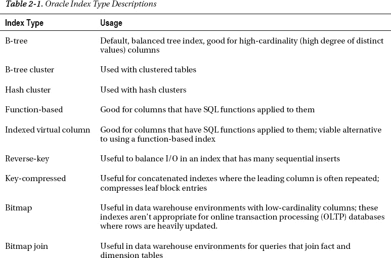
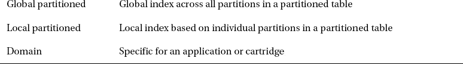
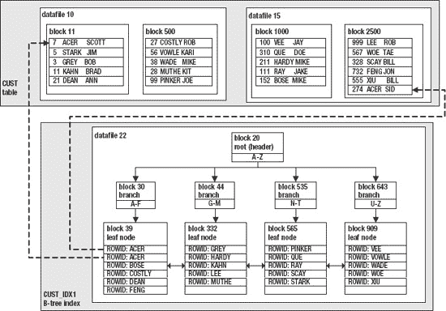
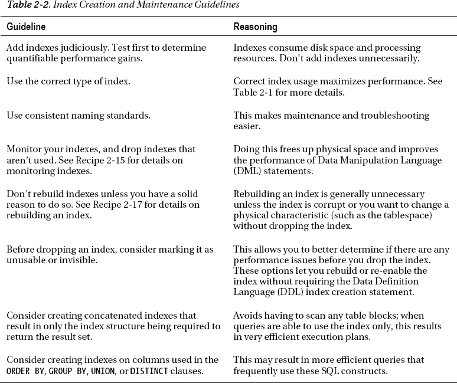

# 解决方案

使用 Oracle 的标准审计功能来确定哪些表正在被使用。审计的启用步骤如下：

1.  设置 `AUDIT_TRAIL` 参数。
2.  停止并启动数据库以使 `AUDIT_TRAIL` 设置生效。
3.  使用 `AUDIT` 语句启用对特定数据库操作的审计。

Oracle 的标准审计功能通过设置 `AUDIT_TRAIL` 初始化参数来启用。当你将 `AUDIT_TRAIL` 参数设置为 `DB` 时，这指定了 Oracle 将审计记录写入名为 `AUD$` 的内部数据库表。例如，当使用 `spfile` 时，设置 `AUDIT_TRAIL` 参数的方法如下：

```
SQL> alter system set audit_trail=db scope=spfile;
```

如果你使用的是 `init.ora` 文件，请用文本编辑器打开它，并将 `AUDIT_TRAIL` 值设置为 `DB`。设置 `AUDIT_TRAIL` 参数后，你需要停止并重启数据库才能使其生效。

 提示：首次设置数据库时，我们建议你将 `AUDIT_TRAIL` 参数设置为 `DB`。这样，当你想要为特定操作启用审计时，无需停止并重启（弹出）数据库。

现在，你可以为特定的数据库操作启用审计。例如，以下语句对 `INV_MGMT` 用户拥有的 `EMP` 表上的所有 DML 语句启用审计：

```
SQL> audit select, insert, update, delete on inv_mgmt.emp;
```

从此时起，对 `EMP` 表的任何 DML 访问都将记录在 `SYS.AUD$` 表中。Oracle 基于 `AUD$` 表提供了若干审计视图，例如 `DBA_AUDIT_TRAIL` 或 `DBA_AUDIT_OBJECT`。你可以查询这些视图来报告审计活动——例如：

```
select
  username
 ,obj_name
 ,to_char(timestamp,'dd-mon-yy hh24:mi') event_time
 ,substr(ses_actions,4,1)  del
 ,substr(ses_actions,7,1)  ins
 ,substr(ses_actions,10,1) sel
 ,substr(ses_actions,11,1) upd
from dba_audit_object;
```

以下是一些示例输出：

```
USERNAME                       OBJ_NAME   EVENT_TIME            DEL INS SEL UPD
------------------------------ ---------- --------------------- --- --- --- ---
INV_MGMT                       EMP        05-feb-11 15:08       -   S   -   S
INV_MGMT                       EMP        05-feb-11 15:10       -   -   S   -
INV_MGMT                       EMP        05-feb-11 15:10       S   -   -   -
```

在前面的 SQL 语句中，请注意使用了 `SUBSTR()` 函数来引用 `DBA_AUDIT_OBJECT` 视图的 `SES_ACTIONS` 列。该列包含一个 16 字符的字符串，其中每个字符表示已发生某种操作。这 16 个字符按以下顺序代表以下操作：`ALTER`, `AUDIT`, `COMMENT`, `DELETE`, `GRANT`, `INDEX`, `INSERT`, `LOCK`, `RENAME`, `SELECT`, `UPDATE`, `REFERENCES`, 和 `EXECUTE`。位置 14、15 和 16 由 Oracle 保留供将来使用。字符 `S` 代表成功，`F` 代表失败，`B` 代表成功和失败都有。

要关闭对某个对象的审计，请使用 `NOAUDIT` 语句：

```
SQL> noaudit select, insert, update, delete on inv_mgmt.emp;
```

 提示：如果你需要查看 `AUD$` 表的 `SQL_TEXT` 或 `SQL_BIND` 列，那么请将 `AUDIT_TRAIL` 初始化参数设置为 `DB_EXTENDED`。

## 工作原理

在排查磁盘空间或性能问题时，了解数据库中哪些表正被应用程序实际使用，有时会很有帮助。如果你继承了一个包含大量表的数据库，可能并不明显哪些对象正在被访问。启用审计可以让你识别哪些类型的 SQL 语句正在访问你感兴趣的表。

一旦你识别出未被使用的表，你可以简单地重命名这些表，观察这是否会破坏应用程序或是否有用户投诉。如果没有投诉，那么过一段时间后，你可以考虑删除这些表。在删除任何你以后可能需要恢复的表之前，请确保使用 RMAN 和 Data Pump 对数据库进行了良好备份。

如果你只是需要知道一个表是否正在被插入、更新或删除，你可以使用 `DBA/ALL/USER_TAB_MODIFICATIONS` 视图来报告此类活动。该视图具有诸如 `INSERTS`、`UPDATES`、`DELETES` 和 `TRUNCATED` 等列，这些列将提供有关表中数据如何被修改的信息——例如：

```
select table_name, inserts, updates, deletes, truncated
from user_tab_modifications;
```

在正常情况下，Oracle 不会即时更新此视图。如果你需要立即查看表的修改情况，那么可以使用 `DBMS_STATS.FLUSH_DATABASE_MONITORING_INFO()` 过程来更新该视图：

```
SQL> exec DBMS_STATS.FLUSH_DATABASE_MONITORING_INFO();
```

## 第 2 章


## 选择与优化索引

索引是一种数据库对象，主要用于提升 SQL 查询的性能。数据库索引的功能类似于书籍末尾的索引。书籍索引将主题与页码关联起来。当你在书中查找信息时，通常先查阅索引、找到感兴趣的主题并确定相关页码，这样会快得多。有了这些信息，你可以直接翻到书中特定的页码。在这种情况下，你需要翻阅的页数是最少的。

如果没有索引，你就必须翻阅书中的每一页来查找信息。这会导致大量的翻页工作，尤其是对于大部头的书。这类似于一个未使用索引的 Oracle 查询，因此必须扫描表中每个已使用的数据块。对于大表而言，这会导致大量的 I/O 操作。

书籍索引的用处直接与主题在书中的唯一性相关。例如，以本书为例，为“性能”这个主题创建索引毫无用处，因为本书的每一页都在讨论性能。然而，为“位图索引”这个主题创建索引则是有效的，因为书中只有少数几页涉及此特性。

请记住，索引并非免费。它会占用书籍末尾的空间，而且如果书中的内容更新（如第二版），每一次修改（插入、更新、删除）都可能需要对索引进行相应的更改。重要的是要记住，索引会消耗空间，并且在发生更新时需要资源。

此外，为书籍创建索引的人必须考虑哪些主题会被频繁查阅。具有高选择性且被频繁访问的主题应被纳入书籍索引中。如果一本书末尾的索引从未被读者查阅过，那么它就浪费了空间。

就像在书末创建索引的过程一样，在创建 Oracle 索引时也必须考虑许多因素。Oracle 提供了丰富的索引特性和选项。这些对象由 DBA 或开发人员手动创建。因此，你需要了解各种特性以及如何利用它们。如果你选择了错误的索引类型或错误地使用了某个特性，可能会对性能产生不利影响。在创建索引之前，需要考虑的方面如下所列：

*   索引类型
*   要包含的表列
*   是使用单列还是列的组合
*   特殊特性，如并行、关闭日志记录、压缩、不可见索引等
*   唯一性
*   命名约定
*   表空间放置
*   初始大小要求和增长
*   对`SELECT`语句性能的影响（提升）
*   对`INSERT`、`UPDATE`和`DELETE`语句性能的影响
*   如果底层表是分区的，则需考虑全局索引或本地索引

当你创建索引时，应该考虑前面列表中提到的每一个方面。你首先需要做的决定之一是索引类型和要包含的列。Oracle 提供了多种强大的索引类型。对于大多数场景，你可以使用默认的 B 树（平衡树）索引。其他常用的类型包括连接索引、位图索引和基于函数的索引。表 2-1 描述了 Oracle 可用的索引类型。





本章重点介绍最常用的索引和特性。本书不涵盖哈希集群索引、分区索引和域索引。如果你需要了解本章或本书未涵盖的索引类型或特性的更多信息，请参阅 Oracle 的 SQL 参考指南，网址为`http://otn.oracle.com`。

本章的第一个“方法”涉及 B 树索引的机制。理解这个数据库对象的工作原理至关重要。即使你已经使用 Oracle 一段时间了，我们认为通读本方法中概述的各种场景也很有用，以确保你了解优化器如何使用这种类型的索引。这将为解决许多不同类型的性能问题（尤其是 SQL 调优）奠定基础。

### 2-1. 理解 B 树索引

#### 问题

你想创建一个索引。你知道 Oracle 中默认的索引类型是 B 树，但不太清楚索引在物理上是如何实现的。你希望充分理解 B 树索引的内部原理，以便在构建数据库应用程序时做出明智的性能决策。

#### 解决方案

一个带有良好图示的示例将有助于说明 B 树索引的机制。即使你使用 B 树索引已有一段时间，一个好的示例也可能阐明使用索引的技术细节。首先，假设你创建了一个如下所示的表：

```
create table cust(
 cust_id number
,last_name varchar2(30)
,first_name varchar2(30));
```

你确定一些 SQL 查询会经常在`WHERE`子句中使用`LAST_NAME`。这促使你创建一个索引：

```
SQL> create index cust_idx1 on cust(last_name);
```

现在向表中插入了几百行数据（此处未显示所有行）：

```
insert into cust values(7, 'ACER','SCOTT');
insert into cust values(5, 'STARK','JIM');
insert into cust values(3, 'GREY','BOB');
insert into cust values(11,'KHAN','BRAD');
.....
insert into cust values(274, 'ACER','SID');
```

插入行后，我们确保表统计信息是最新的，以便为查询优化器提供足够的信息来做出关于如何检索数据的良好选择：

```
SQL> exec dbms_stats.gather_table_stats(ownname=>'MV_MAINT', -
           tabname=>'CUST',cascade=>true);
```

随着行被插入表中，Oracle 将分配由物理数据库块组成的区。Oracle 也会为索引分配块。对于插入表中的每条记录，Oracle 还会在索引中创建一个条目，该条目由`ROWID`和列值（本例中是`LAST_NAME`中的值）组成。每个索引条目的`ROWID`指向存储表列值的数据文件和块。图 2-1 以图形方式展示了数据如何存储在表中以及对应的 B 树索引。在此示例中，数据文件 10 和 15 包含存储在关联块中的表数据，数据文件 22 存储索引块。



**图 2-1.** 表和 B 树索引的物理布局

在图 2-1 中有两条虚线。这些线描绘了索引结构中的`ROWID`如何指向表中`ACER`列值的物理位置。这些特定的值将在本解决方案的后续场景中使用。

当从表及其对应索引中选择数据时，存在三种基本场景：

*   SQL 查询所需的所有表数据都包含在索引结构中。因此只需访问索引块。永远不会读取表的块。
*   查询所需的信息并未全部包含在索引块中。因此查询优化器选择同时访问索引块和表块，以检索满足查询结果所需的数据。
*   查询优化器选择不访问索引。因此只访问表块。

上述情况将在接下来的三个小节中进行介绍。


##### 场景一：所有数据都位于索引块中

本节将展示两种场景：

*   `索引范围扫描`：当优化器确定使用索引结构来检索查询所需的多行数据是高效时，就会发生这种情况。索引范围扫描在各种情况下被广泛使用。
*   `索引快速全扫描`：当优化器确定需要检索表中的大部分行时，就会发生这种情况。然而，所需的所有信息都存储在索引中。由于索引结构通常比表结构小，优化器判定对索引进行全扫描效率更高。这种场景常见于需要统计值的查询。

首先演示索引范围扫描。对于本例，假设执行了这样一个查询：

```sql
SQL> select last_name from cust where last_name='ACER';
```

在继续阅读之前，请看图 2-1，并尝试回答这个问题：“Oracle 为返回此查询的数据需要读取的最少块数是多少？”换句话说，为了满足此查询的结果，访问物理块的最有效方式是什么？优化器可以选择读取表结构中的每个块。但是，这将导致大量的 I/O，因此不是检索数据的最佳方式。

对于本例，检索数据最有效的方式是使用索引结构。要返回 `LAST_NAME` 列中包含值 `ACER` 的行，Oracle 需要读取三个块：块 20、块 30 和块 39。我们可以使用 Oracle 的 `Autotrace` 工具来验证这一点：

```sql
SQL> set autotrace on;
SQL> select last_name from cust where last_name='ACER';
```

以下是部分输出片段：

```
------------------------------------------------------------------------------
| Id  | Operation        | Name      | Rows  | Bytes | Cost (%CPU)| Time     |
------------------------------------------------------------------------------
|   0 | SELECT STATEMENT |           |   101 |   808 |     1   (0)| 00:00:01 |
|*  1 |  INDEX RANGE SCAN| CUST_IDX1 |   101 |   808 |     1   (0)| 00:00:01 |
------------------------------------------------------------------------------
```

之前的输出显示，Oracle 只需要使用 `CUST_IDX1` 索引来检索数据以满足查询的结果集。表数据块未被访问；只需要索引块。对于给定的查询，这是一种特别高效的索引策略。下面是此示例由 `Autotrace` 显示的统计信息：

```
Statistics
----------------------------------------------------------
          1  recursive calls
          0  db block gets
          3  consistent gets
          0  physical reads
```

`consistent gets` 值表明从内存中读取了三个块（`db block gets` 加上 `consistent gets` 等于从内存读取的总块数）。由于索引块已经在内存中，因此返回此查询的结果集不需要物理读取。

接下来演示一个导致索引快速全扫描的示例。考虑这个查询：

```sql
SQL> select count(last_name) from cust;
```

使用 `SET AUTOTRACE ON`，会生成一个执行计划。对应的输出如下：

```
-----------------------------------------------------------------------------------
| Id  | Operation             | Name      | Rows  | Bytes | Cost (%CPU)| Time     |
-----------------------------------------------------------------------------------
|   0 | SELECT STATEMENT      |           |     1 |     8 |     3   (0)| 00:00:01 |
|   1 |  SORT AGGREGATE       |           |     1 |     8 |            |          |
|   2 |   INDEX FAST FULL SCAN| CUST_IDX1 |  1509 | 12072 |     3   (0)| 00:00:01 |
-----------------------------------------------------------------------------------
```

之前的输出显示，仅使用索引结构来确定表中的计数。在这种情况下，优化器判定对索引进行全扫描比对表进行全扫描更高效。

##### 场景二：索引未包含所有信息

现在考虑这种情况：假设我们需要从 `CUST` 表中获取更多信息。这个查询额外选择了 `FIRST_NAME` 列：

```sql
SQL> select last_name, first_name from cust where last_name = 'ACER';
```

使用 `SET AUTOTRACE ON` 并执行上述查询，会产生以下执行计划：

```
-----------------------------------------------------------------------------------------
| Id  | Operation                   | Name      | Rows  | Bytes | Cost (%CPU)| Time     |
-----------------------------------------------------------------------------------------
|   0 | SELECT STATEMENT            |           |   101 |  1414 |     3   (0)| 00:00:01 |
|   1 |  TABLE ACCESS BY INDEX ROWID| CUST      |   101 |  1414 |     3   (0)| 00:00:01 |
|*  2 |   INDEX RANGE SCAN          | CUST_IDX1 |   101 |       |     1   (0)| 00:00:01 |
-----------------------------------------------------------------------------------------
```

之前的输出表明，通过 `INDEX RANGE SCAN` 访问了 `CUST_IDX1` 索引。`INDEX RANGE SCAN` 识别了满足此查询结果所需的索引块。此外，通过 `TABLE ACCESS BY INDEX ROWID` 读取了表。通过索引的 `ROWID` 访问表意味着 Oracle 使用存储在索引中的 `ROWID` 来定位表块中包含的数据。在图 2-1 中，这由映射到包含 `LAST_NAME` 列值 `ACER` 的相应表块的虚线表示。

再次查看图 2-1，在此场景中需要读取多少个表块和索引块？索引要求必须读取块 20、30 和 39。由于 `FIRST_NAME` 不包含在索引中，Oracle 必须读取表块以检索这些值。Oracle 知道表块的 `ROWID` 并直接读取块 11 和 2500 来检索该数据。总共是五个块。以下是 `Autotrace` 生成的部分统计信息片段，确认读取的块数为五：

```
Statistics
----------------------------------------------------------
          1  recursive calls
          0  db block gets
          5  consistent gets
          0  physical reads
```


##### 场景三：仅访问表块

在某些情况下，即使存在索引，Oracle 也会判断仅使用表块更为高效。当 Oracle 检查表中的每一行时，这被称为*全表扫描*。例如，看下面这个查询：

`SQL> select * from cust;`

以下是对应的执行计划和统计信息：

```
--------------------------------------------------------------------------
| Id  | Operation         | Name | Rows  | Bytes | Cost (%CPU)| Time     |
--------------------------------------------------------------------------
|   0 | SELECT STATEMENT  |      |  1509 | 24144 |    12   (0)| 00:00:01 |
|   1 |  TABLE ACCESS FULL| CUST |  1509 | 24144 |    12   (0)| 00:00:01 |
--------------------------------------------------------------------------
```

```
Statistics
----------------------------------------------------------
          0  recursive calls
          0  db block gets
        119  consistent gets
          0  physical reads
```

先前的输出显示总共检查了 119 个块。Oracle 搜索了表中的每一行，以取回满足查询所需的结果。在这种情况下，必须读取表的所有块，Oracle 无法使用索引来加速数据的检索。

 `注意` 对于本技巧中的示例，根据你最初插入表中的行数，结果可能略有不同。本例中我们使用了大约 1,500 行。

#### 工作原理

B 树索引是 Oracle 中的默认索引类型。对于大多数 OLTP 类型的应用程序，此索引类型已足够。这种索引类型被称为 B 树，因为 `ROWID` 和相关的列值存储在一个*平衡*的树状结构中（参见图 2-1）。B 代表平衡。

B 树索引之所以高效，是因为如果使用得当，它们能使查询检索数据的速度远快于没有索引的情况。如果索引结构本身包含了满足查询结果所需的列值，那么就无需访问表数据块。理解这些机制将指导你的索引决策过程。例如，这将帮助你决定对哪些列建立索引，以及对于某些查询，复合索引是否可能更高效，而对于其他查询则不是最优。本章后续技巧将详细讨论这些主题。

**估算索引所需的空间**

在创建索引之前，你可以通过 `DBMS_SPACE.CREATE_INDEX_COST` 过程来估算其将占用多少空间——例如：

```
SQL> set serverout on
SQL> exec dbms_stats.gather_table_stats(user,'CUST');
SQL> variable used_bytes number
SQL> variable alloc_bytes number
SQL> exec dbms_space.create_index_cost( 'create index cust_idx2 on cust(first_name)', -
               :used_bytes, :alloc_bytes );
SQL> print :used_bytes
```

以下是此示例的样本输出：

```
USED_BYTES
----------
    363690
```

```
SQL> print :alloc_bytes
```

以下是此示例的样本输出：

```
ALLOC_BYTES
-----------
    2097152
```

`used_bytes` 变量为你提供索引数据所需空间大小的估算值。`alloc_bytes` 变量则提供将在表空间内分配的空间大小的估算值。

### 2-2. 决定对哪些列建立索引

#### 问题

你管理的一个数据库包含数百张表。每张表通常包含一打或更多的列。你想知道应该对哪些列建立索引。

#### 解决方案

以下是一些决定对哪些列建立索引的通用准则。

*   为每张表定义一个主键约束，这会导致在主键指定的列上自动创建索引（参见技巧 2-3）。
*   在非空且要求唯一（不同于主键列）的列值上创建唯一键约束。这会导致在唯一键约束指定的列上自动创建索引（参见技巧 2-4）。
*   在外键列上显式创建索引（参见技巧 2-5）。
*   在经常作为频繁执行的 SQL 查询的 `WHERE` 子句谓词使用的列上创建索引。

在决定创建索引后，我们建议你遵守有助于轻松维护的索引创建标准。具体来说，创建索引时遵循以下准则：

*   除非有充分理由使用其他索引类型，否则使用默认的 B 树索引。
*   为索引创建单独的表空间。这使你能够更容易地将索引与表分开管理，例如进行备份和恢复任务。
*   让索引从其表空间继承存储属性。这允许你在创建表空间时指定存储属性，而无需管理各个索引的存储属性。
*   如果你的索引有各种存储需求，考虑为每种索引类型创建单独的表空间——例如，分别为 `INDEX_LARGE`、`INDEX_MEDIUM` 和 `INDEX_SMALL` 表空间，每个都定义适合索引大小的存储特性。

下面是一个示例脚本，它封装了上述两个要点列表中的建议：

```
CREATE TABLE cust(
 cust_id    NUMBER
,last_name  VARCHAR2(30)
,first_name VARCHAR2(30));
--
ALTER TABLE cust ADD CONSTRAINT cust_pk PRIMARY KEY (cust_id)
USING INDEX TABLESPACE reporting_index;
--
ALTER TABLE cust ADD CONSTRAINT cust_uk1 UNIQUE (last_name, first_name)
USING INDEX TABLESPACE reporting_index;
--
CREATE TABLE address(
 address_id NUMBER,
 cust_id    NUMBER
,street     VARCHAR2(30)
,city       VARCHAR2(30)
,state      VARCHAR2(30))
TABLESPACE reporting_data;
--
ALTER TABLE address ADD CONSTRAINT addr_fk1
FOREIGN KEY (cust_id) REFERENCES cust(cust_id);
--
CREATE INDEX addr_fk1 ON address(cust_id)
TABLESPACE reporting_index;
```

在前面的脚本中，创建了两张表。父表是 `CUST`，其主键是 `CUST_ID`。子表是 `ADDRESS`，其主键是 `ADDRESS_ID`。`ADDRESS` 表中存在 `CUST_ID` 列作为外键，映射回 `CUST` 表中的 `CUST_ID` 列。


## 工作原理

仅当你确信索引能提升性能时才添加它。滥用索引可能产生严重的负面影响。错误类型或错误列上的索引只会消耗空间和处理资源。作为数据库管理员，你必须制定策略以确保索引能增强性能，而不会对应用程序产生负面影响。

表 2-2 总结了本章涵盖的许多索引管理概念。这些建议并非一成不变：请根据你的环境需要进行调整和修改。



在数据库中创建和管理索引时，请参考这些准则。这些建议旨在帮助你正确使用索引技术。

### 无段索引

你可以通过 `NOSEGMENT` 子句指示 Oracle 创建一个永不会被使用且不会为其分配任何区间的索引：

```sql
SQL> create index cust_idx1 on cust(first_name) nosegment;
```

尽管此索引永远不会被使用，但你可以通过 `_USE_NOSEGMENT_INDEXES` 初始化参数指示 Oracle 判断优化器是否会使用该索引——例如：

```sql
SQL> alter session set "_use_nosegment_indexes"=true;
SQL> set autotrace trace explain;
SQL> select first_name from cust where first_name = 'JIM';
```

以下是一个示例执行计划，显示了优化器将使用该索引（假设你已正常删除并重新创建了它，不带 `NOSEGMENT` 子句）：

```
-----------------------------------------------------------------------------
| Id  | Operation        | Name      | Rows  | Bytes | Cost (%CPU)| Time     |
-----------------------------------------------------------------------------
|   0 | SELECT STATEMENT |           |     1 |    17 |     1   (0)| 00:00:01 |
|*  1 |  INDEX RANGE SCAN| CUST_IDX1 |     1 |    17 |     1   (0)| 00:00:01 |
-----------------------------------------------------------------------------
```

这就引出了一个问题：你为何要创建带 `NOSEGMENT` 的索引？如果你有一个非常大的索引，希望在不分配空间的情况下创建它，以确定优化器是否会使用该索引，那么创建带 `NOSEGMENT` 的索引可以让你测试这种情况。如果你确定该索引有用，可以删除它并重新创建，而不带 `NOSEGMENT` 子句。

### 2-3. 创建主键索引

### 问题

你想要强制主键列在表中唯一。此外，主键中的许多列经常在多个查询的 `WHERE` 子句中使用。你希望确保在主键列上创建索引。

### 解决方案

当你为表定义主键约束时，Oracle 会自动为你创建一个关联的索引。有多种方法可用于创建主键约束。我们推荐的方法是使用 `ALTER TABLE...ADD CONSTRAINT` 语句。这将同时创建索引和约束。此示例创建了一个名为 `CUST_PK` 的主键约束，并指示 Oracle 在 `USERS` 表空间中创建相应的索引（也命名为 `CUST_PK`）：

```sql
alter table cust add constraint cust_pk primary key (cust_id)
using index tablespace users;
```

以下查询和输出提供了关于 Oracle 创建的约束和索引的详细信息。第一个查询显示约束信息：

```sql
select
  constraint_name
,constraint_type
from user_constraints
where table_name = 'CUST';
```
```
CONSTRAINT_NAME                C
------------------------------ -
CUST_PK                        P
```

此查询显示索引信息：

```sql
select
  index_name
,tablespace_name
,index_type
,uniqueness
from user_indexes
where table_name = 'CUST';
```
```
INDEX_NAME      TABLESPACE_NAME INDEX_TYPE      UNIQUENESS
--------------- --------------- --------------- ---------------
CUST_PK         USERS           NORMAL          UNIQUE
```

### 工作原理

本配方的解决方案展示了我们推荐创建主键约束及相应索引的方法。在大多数情况下，这种方法是可接受的。然而，你应该知道还有其他几种创建主键约束和索引的方法。这些方法如下所列：

- 先创建索引，然后使用 `ALTER TABLE...ADD CONSTRAINT`。
- 在 `CREATE TABLE` 语句中内联（与列一起）指定约束。
- 在 `CREATE TABLE` 语句中行外（与列分开）指定约束。

这些技术将在接下来的小节中描述。

#### 分别创建索引和约束

你可以选择先创建索引，然后通过修改表来应用主键约束。示例如下：

```sql
SQL> create index cust_pk on cust(cust_id);
SQL> alter table cust add constraint cust_pk primary key(cust_id);
```

这种方法的优点是，你可以独立于索引删除或禁用主键约束。如果你处理大量数据，可能需要这种灵活性。这种方法允许你在不重建索引的情况下禁用/重新启用约束。

#### 内联创建约束

你可以直接在 `CREATE TABLE` 语句中内联（与列一起）创建索引。这种方法简单，但不允许多列主键，也不能为约束命名：

```sql
SQL> create table cust(cust_id number primary key);
```

如果你没有显式命名约束（如前面的语句），Oracle 会自动生成一个类似 `SYS_C123456` 的名称。如果你想显式提供一个名称，可以按如下方式操作：

```sql
create table cust(cust_id number constraint cust_pk primary key
using index tablespace users);
```

这种方法的优点是非常简单。如果你在开发或测试环境中进行实验，这种方法快速且有效。

#### 行外创建约束

你也可以在 `CREATE TABLE` 语句中行外（与列分开）定义主键约束：

```sql
create table cust(cust_id number
,constraint cust_pk primary key (cust_id)
using index tablespace users);
```

行外方法相对于内联方法有一个优点：你可以为主键指定多个列。

所有上述创建主键约束和相应索引的技术都是有效的。具体使用哪种技术通常取决于数据库管理员或开发人员的偏好。

### 2-4. 创建唯一索引

### 问题

你有一个列（或列的组合），其值应该始终唯一。你希望在该列（或列的组合）上创建一个索引，以强制唯一性，并在查询的 `WHERE` 子句中使用该唯一列时，提供对表的高效访问。

 **注意** 如果你想在主键列上创建唯一约束，那么你应该显式创建一个主键约束（详情参见配方 2-3）。主键和唯一键的一个区别是，每个表只能有一个主键定义，而可以有多个唯一键。此外，唯一键约束允许空值，而主键约束不允许。

#### 解决方案

本方案重点介绍使用 `ALTER TABLE...ADD CONSTRAINT` 语句。当你创建唯一键约束时，Oracle 会自动为你创建一个索引。这是我们创建唯一键约束和索引的推荐方法。此示例在 `CUST` 表的 `LAST_NAME` 和 `FIRST_NAME` 列组合上创建了一个名为 `CUST_UX1` 的唯一约束：

```sql
alter table cust add constraint cust_ux1 unique (last_name, first_name)
using index tablespace users;
```

上述语句创建了唯一约束，此外 Oracle 还自动创建了一个关联的索引。以下查询显示已成功创建的约束：

```sql
select
 constraint_name
,constraint_type
from user_constraints
where table_name = 'CUST';
```

以下是输出片段：

```
CONSTRAINT_NAME                C
------------------------------ -
CUST_UX1                       U
```

此查询显示了随约束自动创建的索引：

```sql
select
 index_name
,tablespace_name
,index_type
,uniqueness
from user_indexes
where table_name = 'CUST';
```

以下是一些示例输出：

```
INDEX_NAME           TABLESPACE INDEX_TYPE UNIQUENESS
-------------------- ---------- ---------- ---------
CUST_UX1             USERS      NORMAL     UNIQUE
```

#### 工作原理

定义唯一约束可确保在插入或更新列值时，任何非空值的组合都是唯一的。除了我们在“解决方案”部分展示的方法外，还有几种其他技术可以创建唯一约束：

*   使用 `CREATE TABLE` 语句。
*   创建一个常规索引，然后使用 `ALTER TABLE` 添加约束。
*   创建唯一索引但不添加约束。

这些技术将在接下来的几个小节中描述。

##### 使用 CREATE TABLE

下面列出了使用 `CREATE TABLE` 语句包含唯一约束的示例。

```sql
create table cust(
 cust_id number
,last_name varchar2(30)
,first_name varchar2(30)
,constraint cust_ux1 unique(last_name, first_name)
 using index tablespace users);
```

这种方法的优点是简单，并将约束和索引创建封装在一个语句中。

##### 先创建索引，然后添加约束

你可以选择先创建一个索引，然后在单独的语句中添加约束——例如：

```sql
SQL> create unique index cust_uidx1 on cust(last_name, first_name) tablespace users;
SQL> alter table cust add constraint cust_uidx1 unique (last_name, first_name);
```

将索引创建与约束分开的优点是，你可以在不删除底层索引的情况下删除或禁用约束。处理大型索引时，你可能需要考虑这种方法。如果需要出于任何原因禁用约束并在以后重新启用，你可以在不删除索引的情况下完成（对于大型索引，删除操作可能非常耗时）。

##### 仅创建唯一索引

你也可以仅创建一个唯一索引而不添加唯一约束——例如：

```sql
SQL> create unique index cust_uidx1 on cust(last_name, first_name) tablespace users;
```

当你显式地仅创建唯一索引时（如前面的语句），Oracle 会创建一个唯一索引，但不会在 `DBA/ALL/USER_CONSTRAINTS` 中为约束添加条目。为什么这很重要？考虑以下场景：

```sql
SQL> insert into cust values (1, 'STARK', 'JIM');
SQL> insert into cust values (1, 'STARK', 'JIM');
```

以下是抛出的相应错误消息：

```
ERROR at line 1:
ORA-00001: unique constraint (MV_MAINT.CUST_UIDX1) violated
```

如果你被要求排查此问题，首先会查看 `DBA_CONSTRAINTS` 中名为 `CUST_UIDX1` 的约束。但是，没有信息：

```sql
select
  constraint_name
from dba_constraints
where constraint_name='CUST_UIDX1';
```

```
no rows selected
```

“未选定行”的消息可能会令人困惑：向表中插入数据时抛出的错误消息表明违反了唯一约束，但在约束相关的数据字典视图中却没有任何信息。在这种情况下，你必须查看 `DBA_INDEXES` 以查看已创建的唯一索引的详细信息——例如：

```sql
select index_name, uniqueness
from dba_indexes where index_name='CUST_UIDX1';
```

```
INDEX_NAME                     UNIQUENESS
------------------------------ ----------
CUST_UIDX1                     UNIQUE
```

### 2-5. 为外键列创建索引

#### 问题

你应用程序中的大量查询使用外键列作为 `WHERE` 子句中的谓词。因此，出于性能原因，你希望确保所有外键列都建有索引。

#### 解决方案

与主键约束不同，Oracle 不会自动在外键列上创建索引。例如，假设你有一个要求：`ADDRESS` 表中的每条记录都必须分配一个在 `CUST` 表中存在的相应 `CUST_ID` 列值。为了强制实施这种关系，你在 `ADDRESS` 表上创建了一个外键约束，如下所示：

```sql
alter table address add constraint addr_fk1
foreign key (cust_id) references cust(cust_id);
```

 **注意** 外键列必须引用父表中定义了主键或唯一键约束的列。否则你会收到错误“ORA-02270: 此列列表没有匹配的唯一或主键”。

你意识到在连接 `CUST` 和 `ADDRESS` 表时，外键列被广泛使用，并且在外键列上建立索引将显著提高性能。在这种情况下，你必须手动创建索引。例如，在 `ADDRESS` 表的 `CUST_ID` 外键列上创建一个常规的 B 树索引：

```sql
SQL> create index addr_fk1 on address(cust_id);
```

你不必将索引命名为与外键名称相同（就像我们在前面的代码行中所做的那样）。是否这样做取决于个人偏好。我们认为，当约束和相应的索引具有相同名称时，维护环境会更加容易。


#### 工作原理

外键的存在是为了确保在向子表中插入数据时，对应的父表记录确实存在。这是一种保证数据符合父子业务关系规则的机制。从性能角度看，通常为外键列创建索引是一个好主意。这是因为父子表经常通过子表中的外键列与父表中的主键列进行连接——例如：

```sql
select
 a.last_name, a.first_name, b.state
from cust a
    ,address b
where a.cust_id = b.cust_id;
```

在大多数情况下，Oracle 查询优化器会选择使用外键列上的索引来识别满足查询结果所需的子记录。如果没有索引，Oracle 就必须对子表执行全表扫描。

如果你继承了一个数据库，那么谨慎的做法是检查定义了外键约束的列是否有对应的索引。以下查询显示了与外键约束关联的索引：

```sql
select
  a.constraint_name cons_name
 ,a.table_name      tab_name
 ,b.column_name cons_column
 ,nvl(c.column_name,'***无索引***') ind_column
from user_constraints  a
     join
     user_cons_columns b on a.constraint_name = b.constraint_name
     left outer join
     user_ind_columns  c on b.column_name = c.column_name
                        and b.table_name  = c.table_name
where constraint_type = 'R'
order by 2,1;
```

如果外键列上没有索引，则会显示 ***无索引*** 信息。例如，假设“解决方案”部分中的索引被意外删除，然后运行了前面的查询。以下是一些示例输出：

```
CONS_NAME          TAB_NAME                CONS_COLUMN               IND_COLUMN
------------------ ----------------------- ------------------------- --------------------
ADDR_FK1           ADDRESS                 CUST_ID                   ***无索引***
```

### 2-6. 决定何时使用复合索引

#### 问题

你有一组（来自同一张表的）列，它们经常在几个 SQL 查询的 `WHERE` 子句中一起使用。例如，你使用 `LAST_NAME` 与 `FIRST_NAME` 的组合来标识客户：

```sql
select last_name, first_name
from cust
where last_name = 'SMITH'
and first_name = 'STEVE';
```

你不确定是创建一个在 `LAST_NAME` 和 `FIRST_NAME` 列组合上的单个复合索引更高效，还是分别在 `LAST_NAME` 和 `FIRST_NAME` 上创建两个单独的索引性能更好。

#### 解决方案

当经常在 `WHERE` 子句中同时访问两个或多个列时，复合索引通常比两个单列索引更具选择性。对于此示例，以下是表创建脚本：

```sql
create table cust(
 cust_id number primary key
,last_name varchar2(30)
,first_name varchar2(30));
```

以下是在 `LAST_NAME` 和 `FIRST_NAME` 上创建的复合索引示例：

```sql
SQL> create index cust_idx1 on cust(last_name, first_name);
```

为了确定是否使用了复合索引，插入了几行数据（这里只显示了部分行）：

```sql
SQL> insert into cust values(1,'SMITH','JOHN');
SQL> insert into cust values(2,'JONES','DAVE');
..........
SQL> insert into cust values(3,'FORD','SUE');
```

接下来，为表和索引生成统计信息：

```sql
SQL> exec dbms_stats.gather_table_stats(ownname=>'MV_MAINT',-
           tabname=>'CUST',cascade=>true);
```

现在启用 Autotrace，以便在运行查询时显示执行计划：

```sql
SQL> set autotrace on;
```

以下是待执行的查询：

```sql
select last_name, first_name
from cust
where last_name = 'SMITH'
and first_name = 'JOHN';
```

接下来列出了一个执行计划，显示优化器正在使用索引：

```
------------------------------------------------------------------------------
| Id  | Operation        | Name      | Rows  | Bytes | Cost (%CPU)| Time     |
------------------------------------------------------------------------------
|   0 | SELECT STATEMENT |           |    13 |   143 |     1   (0)| 00:00:01 |
|*  1 |  INDEX RANGE SCAN| CUST_IDX1 |    13 |   143 |     1   (0)| 00:00:01 |
------------------------------------------------------------------------------
```

前面的输出表明使用了 `INDEX RANGE SCAN` 来访问 `CUST_IDX1` 索引。请注意，满足此查询结果所需的所有信息都包含在索引中。不需要访问表数据。Oracle 只访问了索引。

另外需要考虑的一点是：假设你有这个额外选择了 `CUST_ID` 列的查询：

```sql
select cust_id, last_name, first_name
from cust
where last_name = 'SMITH'
and first_name = 'JOHN';
```

如果你经常将 `CUST_ID` 与 `LAST_NAME` 和 `FIRST_NAME` 一起访问，考虑将 `CUST_ID` 添加到复合索引中。这将为查询提供索引中的所有信息。Oracle 将能够从索引块中检索所需的数据，从而无需访问表块。

#### 工作原理

Oracle 允许你创建包含多于一列的索引。多列索引被称为*复合索引*。当你经常在访问表时在 `WHERE` 子句中使用多个列时，这些索引尤其有效。以下是使用复合索引时需要考虑的一些因素：

*   如果列经常在 `WHERE` 子句中一起使用，考虑创建一个复合索引。
*   如果一个列在（其他查询中）单独用于 `WHERE` 子句，请将该列放在索引的前沿（定义的第一列）。
*   请记住，如果滞后列单独出现在 `WHERE` 子句中，Oracle 仍然可以使用滞后边缘索引（非定义的第一列）（有关详细信息，请参阅此处接下来的几段）。

在旧版本的 Oracle（约 v8）中，优化器仅当前沿列出现在 `WHERE` 子句中时才会使用复合索引。在现代版本中，即使前沿列没有出现在 `WHERE` 子句中，优化器也会使用复合索引。这种无需引用前沿列即可使用索引的能力被称为*跳过扫描*功能。例如，假设你有这个使用 `FIRST_NAME` 列（这是“解决方案”部分创建的复合索引中的一个滞后列）的查询：

```sql
SQL> select last_name from cust where first_name='DAVE';
```

以下是相应的执行计划，表明跳过扫描功能正在发挥作用：

```
------------------------------------------------------------------------------
| Id  | Operation        | Name      | Rows  | Bytes | Cost (%CPU)| Time     |
------------------------------------------------------------------------------
|   0 | SELECT STATEMENT |           |    38 |   418 |     1   (0)| 00:00:01 |
|*  1 |  INDEX SKIP SCAN | CUST_IDX1 |    38 |   418 |     1   (0)| 00:00:01 |
------------------------------------------------------------------------------
```

用于跳过扫描的复合索引比全表扫描更高效。但是，如果你始终只使用复合索引的滞后边缘列，那么请考虑在该滞后列上创建一个单列索引。

### 2-7. 通过压缩减小索引大小


#### 问题

您希望创建一个索引，用以高效处理那些在索引的一个或多个列中具有相同值的行大量存在的情况。例如，假设您有一个定义如下的表：

```sql
create table cust(
 cust_id number
,last_name varchar2(30)
,first_name varchar2(30)
,middle_name varchar2(30));
```

此外，您使用此查询来检查插入到上述表中的数据：

```sql
SQL> select last_name, first_name, middle_name from cust;
```

您会注意到在 `LAST_NAME` 和 `FIRST_NAME` 列中存在大量重复：

```
    LEE                  JOHN                 Q
    LEE                  JOHN                 B
    LEE                  JOHN                 A
    LEE                  JOE                  D
    SMITH                BOB                  A
    SMITH                BOB                  C
    SMITH                BOB                  D
    SMITH                JOHN                 J
    SMITH                JOHN                 A
    SMITH                MIKE                 K
    SMITH                MIKE                 R
    SMITH                MIKE                 S
```

您希望创建一个能压缩值以将条目紧凑存储到块中的索引。当访问索引时，压缩将导致更少的块读取，从而提升性能。具体来说，您希望在此表的 `LAST_NAME` 和 `FIRST_NAME` 列上创建一个键压缩索引。

#### 解决方案

使用 `COMPRESS N` 子句创建压缩索引：

```sql
SQL> create index cust_cidx1 on cust(last_name, first_name) compress 2;
```

前面的代码行指示 Oracle 在两列（`LAST_NAME` 和 `FIRST_NAME`）上创建压缩索引。在此示例中，如果我们确定仅第一列存在高度重复，我们可以通过指定整数 1 来指示 `COMPRESS N` 子句仅压缩第一列（`LAST_NAME`）：

```sql
SQL> create index cust_cidx1 on cust(last_name, first_name) compress 1;
```

#### 工作原理

索引压缩对于包含多列且前导索引列值经常重复的索引非常有用。压缩索引具有以下优势：

*   减少存储空间
*   在叶块中存储更多行，这可能导致访问压缩索引时 I/O 更少

压缩程度将根据为压缩指定的索引列中重复值的数量而变化。您可以通过在创建启用压缩的索引前后运行以下两个查询来验证压缩程度和使用的叶块数量：

```sql
SQL> select sum(bytes) from user_extents where segment_name='&&ind_name';
SQL> select index_name, leaf_blocks from user_indexes where index_name='&&ind_name';
```

您可以按如下方式验证索引压缩是否在使用中以及相应的前缀长度：

```sql
select  index_name, compression, prefix_length
from user_indexes
where index_name = 'CUST_CIDX1';
```

以下是一些示例输出，表明索引已启用压缩，且前缀长度为 2：

```
INDEX_NAME                     COMPRESS PREFIX_LENGTH
------------------------------ -------- -------------
CUST_CIDX1                     ENABLED              2
```

您可以通过重建索引来修改前缀长度。以下代码将前缀长度更改为 1：

```sql
SQL> alter index cust_cidx1 rebuild compress 1;
```

您可以通过重建索引来为现有索引启用或禁用压缩。此示例使用无压缩重建索引：

```sql
SQL> alter index cust_cidx1 rebuild nocompress;
```

 注意 您无法在位图索引上创建键压缩索引。

### 2-8. 实现基于函数的索引

#### 问题

一个查询运行缓慢。您检查 `WHERE` 子句，注意到 SQL `UPPER` 函数已应用于某一列。`UPPER` 函数阻止了该列上现有索引的使用。您希望创建一个基于函数的索引以支持该查询。以下是此类查询的示例：

```sql
SELECT first_name
FROM cust
WHERE UPPER(first_name) = 'DAVE';
```

您检查 `USER_INDEXES`，发现 `FIRST_NAME` 列上存在一个索引：

```sql
select  index_name, column_name
from user_ind_columns
where table_name = 'CUST';
```

```
INDEX_NAME           COLUMN_NAME
-------------------- --------------------
CUST_IDX1            FIRST_NAME
```

您通过 `SET AUTOTRACE TRACE EXPLAIN` 生成解释计划，并注意到当 `UPPER` 函数应用于该列时，未使用索引：

```
--------------------------------------------------------------------------
| Id  | Operation         | Name | Rows  | Bytes | Cost (%CPU)| Time     |
--------------------------------------------------------------------------
|   0 | SELECT STATEMENT  |      |     1 |    17 |     2   (0)| 00:00:01 |
|*  1 |  TABLE ACCESS FULL| CUST |     1 |    17 |     2   (0)| 00:00:01 |
--------------------------------------------------------------------------
```

您需要创建一个 Oracle 将在此情况下使用的索引。

#### 解决方案

有两种方法可以解决此问题：

*   创建基于函数的索引。
*   如果使用 Oracle Database 11g 或更高版本，请创建索引虚拟列（有关详细信息，请参见配方 2-9）。

此解决方案重点介绍使用基于函数的索引。您通过在索引创建语句中引用 SQL 函数和列来创建基于函数的索引。对于此示例，在 `UPPER(name)` 上创建了一个基于函数的索引：

```sql
SQL> create index cust_fidx1 on cust(UPPER(first_name));
```

要验证是否使用了该索引，请打开 Autotrace 工具：

```sql
SQL> set autotrace trace explain;
```

现在执行查询：

```sql
SELECT first_name
FROM cust
WHERE UPPER(first_name) = 'DAVE';
```

以下是显示使用基于函数的索引的执行计划结果：

```
------------------------------------------------------------------------------------------
| Id  | Operation                   | Name       | Rows  | Bytes | Cost (%CPU)| Time     |
------------------------------------------------------------------------------------------
|   0 | SELECT STATEMENT            |            |     1 |    34 |     1   (0)| 00:00:01 |
|   1 |  TABLE ACCESS BY INDEX ROWID| CUST       |     1 |    34 |     1   (0)| 00:00:01 |
|*  2 |   INDEX RANGE SCAN          | CUST_FIDX1 |     1 |       |     1   (0)| 00:00:01 |
------------------------------------------------------------------------------------------
```

 注意 您无法修改已应用基于函数索引的列。您必须先删除索引，修改列，然后重新创建索引。


