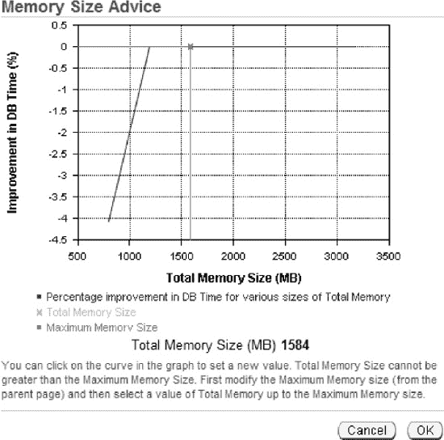

# 2-9. 索引虚拟列

## 问题

你目前使用的是函数索引，但需要更好的性能。你希望用虚拟列替换函数索引，并在虚拟列上放置索引。

 `Note` 虚拟列功能需要 Oracle Database 11g 或更高版本。

## 解决方案

将虚拟列与索引结合使用，为你提供了一种替代方法，用于在 `WHERE` 子句中的列上使用 SQL 函数时实现性能提升。例如，假设你有以下查询：

```sql
SELECT first_name
FROM cust
WHERE UPPER(first_name) = 'DAVE';
```

通常，由于对列应用了 SQL 函数，优化器会忽略 `FIRST_NAME` 列上的任何索引。有两种方法可以提高此情况下的性能：

-   创建函数索引（详情请参阅配方 2-8）。
-   使用虚拟列结合索引。

本解决方案重点介绍后一种方法。首先，向表中添加一个封装了 SQL 函数的虚拟列：

```sql
SQL> alter table cust add(up_name generated always as (UPPER(first_name)) virtual);
```

接下来，在虚拟列上创建索引：

```sql
SQL> create index cust_vidx1 on cust(up_name);
```

这创建了一种非常高效的机制，用于在引用带有 SQL 函数的列时检索数据。

## 工作原理

你可能会问这个问题：“函数索引和带索引的虚拟列，哪个性能更好？” 在我们的测试中，我们能够创建多种场景，其中虚拟列的性能优于函数索引。结果可能因数据而异。

本配方的目的不是说服你立即开始用虚拟列替换系统中的所有函数索引；而是希望你能意识到解决常见性能问题的另一种方法。

虚拟列并非没有成本。如果存在现有表，你必须创建和维护创建虚拟列所需的 DDL，而函数索引可以独立于表进行添加、修改和删除。

虚拟列有几个注意事项：

-   只能在常规的堆组织表上定义虚拟列。不能在索引组织表、外部表、临时表、对象表或集群表上定义虚拟列。
-   虚拟列不能引用其他虚拟列。
-   虚拟列只能引用其定义所在表中的列。
-   虚拟列的输出必须是标量值（单个值，而不是一组值）。

要查看虚拟列的定义，请使用 `DBMS_METADATA` 包来查看与表关联的 DDL。如果从 SQL*Plus 中选择，需要将 `LONG` 变量设置为足够大的值以显示所有返回的数据：

```sql
SQL> set long 10000;
SQL> select dbms_metadata.get_ddl('TABLE','CUST') from dual;
```

以下是显示虚拟列详细信息的部分输出片段：

```
"UP_NAME" VARCHAR2(30) GENERATED ALWAYS AS (UPPER("FIRST_NAME"))
VIRTUAL VISIBLE) SEGMENT CREATION IMMEDIATE
```

你还可以通过查询 `DBA/ALL/USER_IND_EXPRESSIONS` 视图来查看虚拟列的定义。如果你使用的是 SQL*Plus，请务必先发出 SET LONG 命令，例如：

```sql
SQL> SET LONG 500
SQL> select index_name, column_expression from user_ind_expressions;
```

此示例中的 `SET LONG` 命令告诉 SQL*Plus 显示 `COLUMN_EXPRESSION` 列中最多 500 个字符，该列的类型为 `LONG`。

### 2-10. 避免索引的集中 I/O

## 问题

你使用序列来填充表的主键，并意识到这可能会导致索引前导边缘上的争用，因为索引值非常相似。这导致多个插入操作进入同一个数据块，从而引起争用。你希望将索引的插入操作分散开，使插入更均匀地分布在索引结构中。你希望使用反向键索引来实现这一点。

## 解决方案

使用 `REVERSE` 子句创建反向键索引：

```sql
SQL> create index inv_idx1 on inv(inv_id) reverse;
```

你可以通过运行以下查询来验证索引是否是反向键索引：

```sql
SQL> select index_name, index_type from user_indexes;
```

以下是一些示例输出，显示 `INV_IDX1` 索引是反向键索引：

```
INDEX_NAME                      INDEX_TYPE
------------------------------ ---------------------------
INV_IDX1                        NORMAL/REV
USERS_IDX1                      NORMAL
```

 `Note` 你不能为位图索引或索引组织表指定 `REVERSE`。

## 工作原理

反向键索引类似于 B-tree 索引，只是在创建索引条目时，索引键的字节会被反转。例如，如果索引值是 100, 101 和 102，则反向键索引值是 001, 101 和 201：

```
Index value              Reverse key value
-------------            --------------------
100                      001
101                      101
102                      201
```

反向键索引在需要一种方法来均匀分布本应相似值聚集在一起的索引数据的场景中可以表现更好。因此，使用反向键索引时，你可以避免在插入大量顺序值期间，索引中的 I/O 集中在单个物理磁盘位置。这种类型的索引的缺点是它不能用于索引范围扫描，从而限制了其用途。

你可以使用 `REBUILD REVERSE` 子句将现有索引重建为反向键索引，例如：

```sql
SQL> alter index f_regs_idx1 rebuild reverse;
```

类似地，如果你想将反向键索引更改为正常的有序索引，请使用 `REBUILD NOREVERSE` 子句：

```sql
SQL> alter index f_regs_idx1 rebuild noreverse;
```

### 2-11. 添加索引而不影响现有应用程序

## 问题

根据经验，你知道有时向第三方应用程序添加索引可能会导致性能问题，并且也可能违反与供应商的支持协议。你希望以一种应用程序永远不会使用该索引的方式来实现索引。


## 解决方案

通常，第三方供应商不支持客户为其应用程序添加自己的索引。不过，在某些情况下，你确信可以在不影响应用程序中其他查询性能的前提下提升某个查询的性能。这时，你可以创建一个不可见的索引，然后通过提示（hint）明确指示某个查询使用该索引——例如：

```sql
SQL> create index inv_idx1 on inv(inv_id) invisible;
```

接下来，确保将初始化参数 `OPTIMIZER_USE_INVISIBLE_INDEXES` 设置为 `TRUE`（默认值为 `FALSE`）。这将指示优化器考虑不可见索引：

```sql
SQL> alter system set optimizer_use_invisible_indexes=true;
```

现在，使用一个提示来告知优化器该索引存在：

```sql
SQL> select /*+ index (inv INV_IDX1) */ inv_id from inv where inv_id=1;
```

你可以通过设置 `AUTOTRACE TRACE EXPLAIN` 并运行 `SELECT` 语句来验证索引是否被使用：

```sql
SQL> set autotrace trace explain;
SQL> select /*+ index (inv INV_IDX1) */ inv_id from inv where inv_id=1;
```

以下是示例输出，表明优化器选择使用了不可见索引：

```
-----------------------------------------------------------------------------
| Id  | Operation        | Name     | Rows  | Bytes | Cost (%CPU)| Time     |
-----------------------------------------------------------------------------
|   0 | SELECT STATEMENT |          |     1 |    13 |     1   (0)| 00:00:01 |
|*  1 |  INDEX RANGE SCAN| INV_IDX1 |     1 |    13 |     1   (0)| 00:00:01 |
-----------------------------------------------------------------------------
```

请记住，索引不可见仅意味着优化器看不到它。与任何其他索引一样，不可见索引在执行 `DML` 语句时也会消耗空间和资源。

## 工作原理

在 Oracle Database 11g 及更高版本中，你可以选择使索引对优化器不可见。Oracle 仍然会维护不可见索引，但不会使其可供优化器使用。如果你希望优化器使用某个不可见索引，可以通过 SQL 提示来实现。不可见索引有几个有趣的用途：

*   你可以向第三方应用程序添加一个不可见索引，而不影响现有代码或支持协议。
*   在删除索引之前将其更改为不可见状态，可以让你在日后发现需要该索引时快速恢复。

第一个要点已在本方案的“解决方案”部分讨论。第二个场景将在本节讨论。例如，假设你已识别出一个未被使用的索引，并考虑删除它。在 Oracle 的早期版本中，你可以将索引标记为 `UNUSABLE`，然后稍后删除那些你确定未被使用的索引。如果你后来发现需要某个不可用的索引，重新启用它的唯一方法是重建它。对于大型索引，这可能需要很长时间并消耗大量的数据库资源。

使索引不可见的优势在于，它只告诉优化器不要使用该索引。当底层表有记录被插入、更新或删除时，不可见索引仍然会被维护。如果你决定日后需要该索引，则无需重建它。你只需将其重新标记为可见即可——例如：

```sql
SQL> alter index inv_idx1 visible;
```

你可以通过以下查询验证索引的可见性：

```sql
SQL> select index_name, status, visibility from user_indexes;
```

以下是示例输出：

```
INDEX_NAME                     STATUS   VISIBILITY
------------------------------ -------- ----------
INV_IDX1                       VALID    VISIBLE
```

## 老派做法：指示优化器不要使用索引

在过去，基于规则的优化器（已弃用）有时会选择使用一个会显著降低性能的索引。在这些情况下，`DBA` 和开发人员会手动指示优化器不要在基于数字的列上使用索引，如下所示：

```sql
SQL> select cust_id from cust where cust_id+0 = 12345;
```

在上述语句中，`+0` 对 SQL 语句的逻辑没有任何增加（因此对结果集没有影响）。在这种情况下，优化器将自动不使用经过算术表达式修改的数字列上的索引。

类似地，对于基于字符的列，如果对其连接了字符，索引将被忽略——例如：

```sql
SQL> select last_name from cust where last_name || '' = 'SMITH';
```

在上述语句中，`||''` 对 SQL 的逻辑没有任何增加，但会导致优化器不使用 `LAST_NAME` 列上的索引（如果存在的话）。

## 2-12. 为支持星型模型创建位图索引

## 问题

你有一个包含星型模型的数据仓库。星型模型由一个大型事实表和多个维度（查找）表组成。维度表的主键列映射到事实表中的外键列。你希望在事实表的所有外键列上创建位图索引。

## 解决方案

你使用 `BITMAP` 关键字来创建位图索引。下一行代码在 `F_SALES` 表的 `CUST_ID` 列上创建了一个位图索引：

```sql
SQL> create bitmap index f_sales_cust_fk1 on f_sales(cust_id);
```

通过以下查询可以验证索引类型：

```sql
SQL> select index_name, index_type from user_indexes where index_name='F_SALES_CUST_FK1';
```

```
INDEX_NAME                     INDEX_TYPE
------------------------------ ---------------------------
F_SALES_CUST_FK1               BITMAP
```

## 工作原理

位图索引存储行的 `ROWID` 和对应的位图。你可以将位图视为 1 和 0 的组合。1 表示存在某个值，0 表示该值不存在。位图索引非常适合低基数列（不同值很少）以及应用程序不频繁更新表的情况。位图索引通常用于采用星型模型设计的数据仓库环境。

一个典型的星型模型结构由一个大型事实表和许多小型维度（查找）表组成。在这些场景下，通常会在事实表的外键列上创建位图索引。事实表通常按日加载，并且（通常）后续不会被更新或删除。

你不应在具有高 `INSERT`/`UPDATE`/`DELETE` 活动的 `OLTP` 数据库上使用位图索引，因为这会导致锁定问题。锁定问题之所以产生，是因为位图索引的结构可能导致在 `DML` 操作期间锁定许多行，从而导致高事务量的 `OLTP` 系统出现锁定问题。

 **注意** 位图索引和位图连接索引仅在 Oracle 数据库的企业版中可用。

### 2-13. 创建位图连接索引

## 问题

你正在一个数据仓库环境中工作。你有一个相当大的维度表，经常与一个极大的事实表进行连接。你想知道是否有一种方法可以创建位图索引，从而消除优化器为满足查询结果而访问维度表数据块的需要。


### 2-14. 创建索引组织表

#### 问题

你想要创建一个表，作为另外两个表之间多对多关系的交集。这个交集表将包含两列。每一列都是一个外键，映射回父表中的相应主键。

#### 解决方案

当表数据通常通过查询主键来访问时，索引组织表（IOT）是高效的对象。使用 `ORGANIZATION INDEX` 子句来创建一个 IOT：

```
create table cust_assoc
(cust_id number
,user_group_id number
,create_dtt timestamp(5)
,update_dtt timestamp(5)
,constraint cust_assoc_pk primary key(cust_id, user_group_id)
)
organization index
including create_dtt
pctthreshold 30
tablespace nsestar_index
overflow
tablespace dim_index;
```

请注意，`DBA/ALL/USER_TABLES` 包含了创建 IOT 时所用表名的条目。以下两个查询展示了 Oracle 如何在数据字典中记录 IOT 的信息：

```
select table_name, iot_name
from user_tables
where iot_name = 'CUST_ASSOC';
```

以下是一些示例输出：

```
TABLE_NAME                      IOT_NAME
------------------------------ ------------------------------
SYS_IOT_OVER_184185             CUST_ASSOC
```

接下来是另一个略有不同的查询及其输出：

```
select table_name, iot_name
from user_tables
where table_name = 'CUST_ASSOC';
```

以下是一些示例输出：

```
TABLE_NAME                      IOT_NAME
------------------------------ ------------------------------
CUST_ASSOC
```

此外，`DBA/ALL/USER_INDEXES` 包含一条记录，其名称为指定的主键约束名。对于 IOT，`INDEX_TYPE` 列的值为 `IOT - TOP`：

```
select index_name, index_type
from user_indexes
where table_name = 'CUST_ASSOC';
```

以下是一些示例输出：

```
INDEX_NAME                      INDEX_TYPE
------------------------------ ---------------------------
CUST_ASSOC_PK                   IOT - TOP
```

#### 工作原理

IOT 在 B 树索引结构中存储表行的全部内容。对于那些在主键上进行精确匹配和/或范围搜索的查询，IOT 提供了快速的访问。

在 `INCLUDING` 子句中指定并包含的列之前的所有列，都与 `CUST_ASSOC_PK` 主键列存储在同一个块中。换句话说，`INCLUDING` 子句指定了保留在表段中的最后一列。列在 `INCLUDING` 子句中指定列之后的列将存储在溢出数据段中。在前面的例子中，`UPDATE_DTT` 列存储在溢出段中。

`PCTTHRESHOLD` 指定了为 IOT 行在索引块中保留的空间百分比。该值可以是 1 到 50，如果未指定值，则默认为 50。索引块中必须有足够的空间来存储主键。`OVERFLOW` 子句详细说明了应使用哪个表空间来存储溢出数据段。

### 2-15. 监控索引使用情况

#### 问题

你维护一个包含数千个索引的大型数据库。作为主动维护的一部分，你希望确定是否有任何索引未被使用。你意识到未使用的索引会对性能产生负面影响，因为每次插入、更新和删除行时，都必须维护相应的索引。这会消耗 CPU 资源和磁盘空间。如果一个索引没有被使用，就应该将其删除。

#### 解决方案

使用 `ALTER INDEX...MONITORING USAGE` 语句来启用基本的索引监控。以下示例在名为 `F_REGS_IDX1` 的索引上启用索引监控：

```sql
SQL> alter index f_regs_idx1 monitoring usage;
```

第一次访问该索引时，Oracle 会记录下来；你可以通过 `V$OBJECT_USAGE` 视图查看索引是否已被访问过。要报告哪些索引正在被监控并且曾经被使用过，请运行以下查询：

```sql
SQL> select index_name, table_name, monitoring, used from v$object_usage;
```

如果该索引曾在 `SELECT` 语句中使用过，那么 `USED` 列将包含 `YES` 值。以下是先前查询的一些示例输出：

```
INDEX_NAME                      TABLE_NAME                     MON USED
------------------------------ ------------------------------ --- ----
F_REGS_IDX1                     F_REGS                         YES YES
```

很可能，你不会只监控一个索引。相反，你会希望监控某个用户的所有索引。在这种情况下，使用 SQL 生成 SQL 来创建一个可以运行的脚本，以打开对所有索引的监控。下面就是这样一个脚本：

```sql
set pagesize 0 head off linesize 132
spool enable_mon.sql
select
  'alter index ' || index_name || ' monitoring usage;'
from user_indexes;
spool off;
```

要禁用对索引的监控，请使用 `NOMONITORING USAGE` 子句——例如：

```sql
SQL> alter index f_regs_idx1 nomonitoring usage;
```


#### 工作原理

监控索引使用情况的主要优势在于识别未被使用的索引。这允许你找出可以删除的索引，从而释放磁盘空间并提升 DML 语句的性能。

`V$OBJECT_USAGE` 视图仅显示当前连接用户的信息。你可以通过检查 `DBA_VIEWS` 中 `V$OBJECT_USAGE` 定义的 `TEXT` 列来验证此行为：

```sql
SQL> select text from dba_views where view_name = 'V$OBJECT_USAGE';
```

请注意输出中的以下行：

```sql
where io.owner# = userenv('SCHEMAID')
```

该行指示视图仅显示当前连接用户的信息。如果你以具有 DBA 权限的用户登录，并希望查看所有启用了监控的索引状态（无论用户是谁），请执行此查询：

```sql
select io.name, t.name,
       decode(bitand(i.flags, 65536), 0, 'NO', 'YES'),
       decode(bitand(ou.flags, 1), 0, 'NO', 'YES'),
       ou.start_monitoring,
       ou.end_monitoring
from sys.obj$ io
     ,sys.obj$ t
     ,sys.ind$ i
     ,sys.object_usage ou
where i.obj# = ou.obj#
and io.obj# = ou.obj#
and t.obj# = i.bo#;
```

之前的查询移除了将输出限制为仅显示当前登录用户信息的那一行。这为你提供了一种便捷的方式来查看所有受监控的索引。

### 2-16. 最大化索引创建速度

#### 问题

你正在基于一个包含数百万行的表创建索引。你希望尽可能快地创建该索引。

#### 解决方案

本解决方案描述了两种提高索引创建速度的技术：

*   关闭重做日志生成
*   提高并行度

你可以独立使用这两种功能，也可以结合使用它们。

##### 关闭重做日志生成

你可以选择使用 `NOLOGGING` 子句创建索引。这样做有以下影响：

*   不会生成在发生介质故障时恢复索引所需的重做日志。
*   随后的直接路径操作也不会生成在发生介质故障时恢复索引信息所需的重做日志。

以下是一个使用 `NOLOGGING` 子句创建索引的示例：

```sql
create index inv_idx1 on inv(inv_id, inv_id2)
nologging
tablespace inv_mgmt_index;
```

你可以运行此查询来确定索引是否是用 `NOLOGGING` 创建的：

```sql
SQL> select index_name, logging from user_indexes;
```

##### 提高并行度

在大型数据库环境中，当你试图为一个填充了大量行的表创建索引时，通过使用 `PARALLEL` 子句，你可能能够减少创建索引所需的时间。例如，以下语句在创建索引时将并行度设置为 2：

```sql
create index inv_idx1 on inv(inv_id)
parallel 2
tablespace inv_mgmt_data;
```

你可以通过此查询验证索引的并行度：

```sql
SQL> select index_name, degree from user_indexes;
```

 **注意** 如果你不指定并行度，Oracle 会基于 CPU 核心数乘以 `PARALLEL_THREADS_PER_CPU` 的值来选择一个并行度。

#### 工作原理

`NOLOGGING` 的主要优势在于，当你创建索引时，生成的重做信息量极少，这对于创建大型索引可能具有显著的性能优势。缺点是，如果你在索引创建后不久经历了介质故障（或者通过直接路径操作插入了记录），并且随后发生了导致你必须从备份（在索引创建之前拍摄的）恢复的故障，那么在访问索引时可能会看到此错误：

```sql
ORA-01578: ORACLE data block corrupted (file # 4, block # 11407)
ORA-01110: data file 4: '/ora01/dbfile/O11R2/inv_mgmt_index01.dbf'
ORA-26040: Data block was loaded using the NOLOGGING option
```

此错误表明索引存在逻辑损坏。在这种情况下，你必须在索引可用之前重新创建或重建它。在大多数场景下，创建索引时使用 `NOLOGGING` 子句是可以接受的，因为索引可以被重新创建或重建，而不会影响其基础表。

除了 `NOLOGGING`，你还可以使用 `PARALLEL` 子句来提高索引创建速度。对于大型索引，这可以显著减少创建索引所需的时间。

请记住，你可以将 `NOLOGGING` 与 `PARALLEL` 结合使用。下一个示例以并行方式重建索引，同时生成最小数量的重做日志：

```sql
SQL> alter index inv_idx1 rebuild parallel nologging;
```

### 2-17. 回收未使用的索引空间

#### 问题

你有一个索引在段中占用了空间，但实际上并未使用该空间。例如，你正在运行以下查询来显示段顾问的建议：

```sql
SELECT
 'Task Name        : ' || f.task_name  || CHR(10) ||
 'Start Run Time   : ' || TO_CHAR(execution_start, 'dd-mon-yy hh24:mi') || chr (10) ||
 'Segment Name     : ' || o.attr2      || CHR(10) ||
 'Segment Type     : ' || o.type       || CHR(10) ||
 'Partition Name   : ' || o.attr3      || CHR(10) ||
 'Message          : ' || f.message    || CHR(10) ||
 'More Info        : ' || f.more_info  || CHR(10) ||
 '------------------------------------------------------' Advice
FROM dba_advisor_findings   f
    ,dba_advisor_objects    o
    ,dba_advisor_executions e
WHERE o.task_id   = f.task_id
AND   o.object_id = f.object_id
AND   f.task_id   = e.task_id
AND   e. execution_start > sysdate - 1
AND   e.advisor_name = 'Segment Advisor'
ORDER BY f.task_name;
```

将显示以下输出：

```sql
ADVICE
--------------------------------------------------------------------------------
Task Name        : F_REGS Advice
Start Run Time   : 19-feb-11 09:32
Segment Name     : F_REGS_IDX1
Segment Type     : INDEX
Partition Name   :
Message          : Perform shrink, estimated savings is 84392870 bytes.
More Info        : Allocated Space:166723584: Used Space:82330714: Reclaimable S
pace :84392870:
------------------------------------------------------
```

你想要收缩索引以释放未使用的空间。

#### 解决方案

有几种有效的方法可以释放与索引关联的未使用空间：

*   重建索引
*   收缩索引

在执行这两种操作中的任何一种之前，首先检查 `USER_SEGMENTS` 以验证使用的空间量是否与段顾问的建议相符。在此示例中，段名称是 `F_REGS_IDX1`：

```sql
SQL> select bytes from user_segments where segment_name = 'F_REGS_IDX1';
```

```sql
BYTES
----------
 166723584
```

此示例使用 `ALTER INDEX...REBUILD` 语句来重组和压缩索引使用的空间：

```sql
SQL> alter index f_regs_idx1 rebuild;
```

或者，使用 `ALTER INDEX...SHRINK SPACE` 语句来释放索引中的未使用空间，例如：

```sql
SQL> alter index f_regs_idx1 shrink space;
```

```sql
Index altered.
```

现在再次查询 `USER_SEGMENTS` 以验证空间是否已被释放。以下是此示例的输出：

```sql
  BYTES
----------
    524288
```

索引消耗的空间已显著减少。


#### 工作原理

通常，重建索引是回收索引占用的未用空间最快、最有效的方法。因此，我们推荐使用这种方法来回收未使用的索引空间。释放空间是可取的，因为它确保你只使用对象所需的空间量。它还具有性能优势，因为 Oracle 在执行读取操作时需要管理和排序的块更少。

除了释放空间，你可能还因为以下额外原因考虑重建索引：

*   索引已损坏。
*   你希望修改存储特性（例如更改表空间）。
*   之前标记为不可用的索引现在需要重建以使其重新可用。

请记住，Oracle 会尝试获取表上的锁并在线重建索引。如果有任何未提交的活动事务，那么 Oracle 将无法获得锁，并会抛出以下错误：

`ORA-00054: resource busy and acquire with NOWAIT specified or timeout expired`

在这种情况下，你可以等到数据库活动很少时再操作，或者尝试设置 `DDL_LOCK_TIMEOUT` 参数：

`SQL> alter session set ddl_lock_timeout=15;`

`DDL_LOCK_TIMEOUT` 初始化参数在 Oracle Database 11g 或更高版本中可用。它指示 Oracle 在指定的时间内反复尝试获取锁。

如果未指定表空间，Oracle 会在索引当前所在的表空间中重建它。如果你希望索引在不同的表空间中重建，请指定一个表空间：

`SQL> alter index inv_idx1 rebuild tablespace inv_index;`

 **提示** 如果你正在处理大型索引，可以考虑使用 `NOLOGGING` 和/或 `PARALLEL` 等功能（详见配方 2-16）。

如果你使用 `ALTER INDEX...SHRINK SPACE` 操作来释放未使用的索引空间，请记住此功能要求目标对象必须在启用了自动段空间管理的表空间中创建。如果你尝试收缩在使用手动段空间管理的表空间中创建的表或索引，你将收到此错误：

`ORA-10635: Invalid segment or tablespace type`

正如我们在本章其他地方指出的，我们建议你尽可能使用 ASSM 功能。这使你可以利用所有的 Oracle 段管理功能。

`ALTER INDEX...SHRINK SPACE` 语句有一些需要注意的细微差别。例如，你可以通过 `COMPACT` 子句指示 Oracle 仅尝试合并索引块的内容（而不释放空间）：

`SQL> alter index f_regs_idx1 shrink space compact;`

前面的操作等同于 `ALTER INDEX...COALESCE` 语句。以下是使用 `COALESCE` 的示例：

`SQL> alter index f_regs_idx1 coalesce;`

如果你想最大化压缩的空间，要么重建索引，要么使用 `SHRINK SPACE` 子句，如本配方的“解决方案”部分所示。`COMPACT` 空间实际上并不启动更大程度的已释放空间，这有点违反直觉。`COMPACT` 子句指示 Oracle 仅在可能的情况下合并索引块，而不去最大化释放的空间量。

### 优化实例内存

优化分配给 Oracle 数据库的内存是你作为 DBA 需要执行的最关键任务之一。多年来，Oracle DBA 习惯于花费大量时间分析数据库的内存使用情况，并尝试提出最佳的内存分配方案。在 Oracle Database 11g 中，分配 Oracle 内存的负担几乎完全转移给了数据库本身。本章向你展示如何利用 Oracle 的自动内存管理功能，这样你就可以让数据库优化内存使用，而你则专注于更重要的事务。

本章首先解释如何为数据库设置自动内存管理。本章还向你展示即使在自动内存管理下，如何为某些内存组件设置最小值。它还包括一些配方，解释如何创建多个缓冲池、如何监控 Oracle 的内存使用，以及如何使用 Oracle Enterprise Manager 的 Database Control（或 Grid Control）工具从 Oracle 获取有关最佳内存分配大小的建议。你还将学习如何优化程序全局区（PGA）的使用，这是 Oracle 的一个关键内存组件，尤其在数据仓库环境中。

在 Oracle Database 11g 中，Oracle 引入了一项令人兴奋的新结果缓存功能。Oracle 现在可以在 Oracle 内存的共享池组件中缓存 SQL 查询和 PL/SQL 函数的结果。我们将在本章讨论该服务器结果缓存。此外，你还会找到一个解释如何利用 Oracle 客户端结果缓存功能的配方。最后，我们展示如何使用名为 Oracle Database Smart Flash Cache 的令人兴奋的新功能。

### 3-1. 自动化内存管理

##### 问题

你希望在 Oracle 数据库中自动化内存管理。你的数据库中同时运行着 OLTP 和批处理作业。你希望利用 Oracle Database 11g 内置的自动内存管理功能。

##### 解决方案

如果你已经设置了 `SGA_TARGET` 或 `PGA_AGGREGATE_TARGET` 参数（或两者），以下是实现在数据库中自动内存管理的步骤。我们假设将为 `MEMORY_MAX_TARGET` 参数分配 2000 MB，为 `MEMORY_TARGET` 参数分配 1000 MB。

1.  使用 SYSDBA 权限连接到数据库。
2.  假设你使用的是 `SPFILE`，首先为 `MEMORY_MAX_TARGET` 参数设置一个值：

    `SQL> alter system set memory_max_target=2G scope=spfile;`
    `System altered.`

    你必须在 `alter system` 命令中指定 `SCOPE` 参数，因为 `MEMORY_MAX_TARGET` 不是动态参数，这意味着你不能在实例运行时动态更改它。

3.  请注意，如果你是使用传统的 `init.ora` 参数文件而不是 `SPFILE` 启动的实例，你必须将以下内容添加到你的 `init.ora` 文件中：`memory_max_target = 2000M`
    `memory_target = 1000M`
4.  重启数据库。
5.  通过发出以下 `ALTER SYSTEM` 命令关闭 `SGA_TARGET` 和 `PGA_AGGREGATE_TARGET` 参数：`SQL> alter system set sga_target = 0;`
    `SQL> alter system set pga_aggregate_target = 0;`
6.  通过设置 `MEMORY_TARGET` 参数来开启自动内存管理：`SQL> alter system set memory_target = 1000M;`

从这一点开始，数据库将在自动内存管理模式下运行，根据持续工作负载的需求，收缩和增长对 Oracle 内存各个组件的分配。只要不超过为 `MEMORY_MAX_TARGET` 参数设置的值，你可以随时动态更改 `MEMORY_TARGET` 参数的值。

 **提示** 在诸如 `memory_target` 和 `pga_memory_target` 等参数中，“target”一词的含义正是如此——Oracle 将尝试保持在目标水平以下，但无法保证它永远不会超过该水平。如果必要，它偶尔可能会超过目标分配。

你不必将 `SGA_TARGET` 和 `PGA_AGGREGATE_TARGET` 参数设置为 0 才能使用自动内存管理。在配方 3-3 中，我们展示了即使在选择实现自动内存管理时，如何为这些参数设置最小值。该配方假设你正在实现自动内存管理，但出于某种原因，你需要为 SGA 和 PGA 等组件指定自己的最小值。


#### 工作原理

在 Oracle 数据库的早期版本中，数据库管理员需要为各种 SGA 组件设置值，或者为 SGA 和 PGA 指定值。从 Oracle Database 11g 版本开始，Oracle 通过仅设置一个初始化参数 `MEMORY_TARGET`，即可完全自动化整个实例的内存分配，这被称为自动内存管理。在本教程中，我们将向您展示如何在数据库中设置自动内存管理功能。

如果您正在使用数据库配置助手创建新的 Oracle 数据库，您可以在自动内存管理、共享内存管理和手动内存管理之间进行选择。选择自动内存管理选项，并为两个与自动内存相关的参数指定值：`MEMORY_TARGET` 和 `MEMORY_MAX_TARGET`。第一个参数设置数据库当前的内存分配值，第二个参数设置您可以在必要时提高第一个参数值的上限。

Oracle 的内存结构由两个不同的内存区域组成。系统全局区包含数据和控制信息，由所有服务器和后台进程共享。SGA 保存着 Oracle 从磁盘检索的数据块。程序全局区包含服务器进程的数据和控制信息。每个服务器进程都被分配自己的 PGA 区块。管理 Oracle 的内存分配需要仔细校准数据库的需求。某些数据库实例的特定内存组件需要更多内存。例如，数据仓库需要更多的 PGA 内存来执行此类环境中常见的大规模排序操作。此外，在一天的过程中，实例的内存需求可能会发生变化；例如，在工作时间内，实例可能处理更多的联机事务处理工作，而在工作时间后，它可能运行涉及数据仓库处理的大型批处理作业，这些作业通常需要每个进程更高的 PGA 分配。

在之前的 Oracle 数据库版本中，数据库管理员必须仔细决定分配给数据库各内存组件的最佳内存分配。从技术上讲，您仍然可以手动设置 SGA 各个组件的值，并为 PGA 设置一个值，或者通过设置 `SGA_TARGET` 和 `PGA_AGGREGATE_TARGET` 等参数来部分自动化此过程。虽然 Oracle 仍然允许您手动配置内存的各个组件，但自动内存管理是管理 Oracle 内存分配的推荐方法。一旦您通过设置 `MEMORY_TARGET` 和 `MEMORY_MAX_TARGET` 参数指定了一定量的内存，Oracle 就会通过在 SGA 和 PGA 之间重新分配内存来自动调整实际的内存分配。

 **提示** 当您使用数据库配置助手创建数据库时，自动内存管理是默认选项。

如果您选择通过设置 `MEMORY_TARGET` 和 `MEMORY_MAX_TARGET` 参数来实施自动内存管理，Oracle Database 11g 可让您自动化实例的所有内存分配，包括共享内存和 PGA 内存。在自动内存管理机制下，Oracle 会自动调整总 SGA 大小、SGA 组件大小、实例 PGA 大小以及各个 PGA 大小。Oracle 实例的这种动态内存调优优化了数据库性能，因为 Oracle 会自动更改内存分配以匹配不断变化的数据库工作负载。自动内存管理意味着一旦设置了 `MEMORY_TARGET` 参数，您就可以完全忽略以下参数，而无需设置它们：

*   `SGA_TARGET`
*   `PGA_AGGREGATE_TARGET`
*   `DB_CACHE_SIZE`
*   `SHARED_POOL_SIZE`
*   `LARGE_POOL_SIZE`
*   `JAVA_POOL_SIZE`

如果您正从使用 `SGA_TARGET` 和 `PGA_AGGREGATE_TARGET` 参数的系统迁移过来，可以按照本教程“解决方案”部分中展示的步骤，迁移到更新的自动内存管理模式来管理 Oracle 的内存分配。请注意，虽然设置 `MEMORY_TARGET` 参数对于实施自动内存管理是强制性的，但 `MEMORY_MAX_TARGET` 参数不是——如果您不设置此参数，Oracle 会在内部将其值设置为 `MEMORY_TARGET` 参数的值。此外，`MEMORY_MAX_TARGET` 参数充当 `MEMORY_TARGET` 参数的上限。Oracle 对 `MEMORY_TARGET` 参数有不同的最小允许设置，具体取决于操作系统。如果您尝试将此参数设置为低于其最小允许值，数据库将发出错误。某些内存组件无法快速缩小，并且某些组件必须具有最小大小数据库才能正常运行。因此，Oracle 不允许您为 `MEMORY_TARGET` 参数设置过低的值。以下示例展示了这一点：

```sql
SQL> alter system set memory_target=360m scope=both;
alter system set memory_target=360m scope=both
*
ERROR at line 1:
ORA-02097: parameter cannot be modified because specified value is invalid
ORA-00838: Specified value of MEMORY_TARGET is too small, needs to be at least
544M

SQL> alter system set memory_target=544m scope=both;

alter system set memory_target=544m scope=both
*
ERROR at line 1:
ORA-02097: parameter cannot be modified because specified value is invalid
ORA-00838: Specified value of MEMORY_TARGET is too small, needs to be at least
624M

SQL>  alter system set memory_target=624m scope=both;

System altered.

SQL>
```

您会注意到，当我们尝试为 `MEMORY_TARGET` 参数设置一个非常低的值时，Oracle 发出了错误。请注意，Oracle 通过多次尝试来告知您 `MEMORY_TARGET` 参数的最小允许级别。

如何设置 `MEMORY_MAX_TARGET` 参数的值呢？这很简单——您只需选择一个足够高的值，不仅要满足当前的工作负载，还要满足数据库未来的需求。由于 `MEMORY_TARGET` 参数是动态的，您可以随时更改它，并在必要时在运行于服务器上的多个实例之间重新分配内存。只需确保将 `MEMORY_MAX_TARGET` 参数的值设置为至少等于当前 `SGA_TARGET` 和 `PGA_AGGREGATE_TARGET` 参数设置值的总和（如果您是从 10g 版本迁移而来）。务必与您的系统管理员确认，以便不会为 Oracle 实例分配过多的内存，否则可能导致操作系统级别的页面交换等问题，这不仅会影响您的 Oracle 数据库，还会影响该服务器上运行的所有其他内容。

### 3-2. 管理多个缓冲区池

#### 问题

您正在使用自动内存管理，但决定为缓冲区池组件分配一个最小值。您希望配置缓冲区池，使其保留经常访问的段，这些段可能面临从缓冲区池中老化出局的风险。


## 3-2. 使用多个缓冲池

### 解决方案

你可以使用多个缓冲池，而不是 Oracle 单一的默认缓冲池，以确保频繁使用的**段**能保留在缓冲池中，而不会被回收。为了在数据库中实现多个缓冲池，你需要做两件事：创建两个独立的缓冲池——`KEEP` 缓冲池和 `RECYCLE` 缓冲池。完成此操作后，你必须在创建段时在 `STORAGE` 子句中指定 `BUFFER_POOL` 关键字。例如，如果你想让一个段被缓存（或固定）在缓冲池中，你必须指定 `KEEP` 缓冲池。

 `Note` 无论是 `KEEP` 池还是 `RECYCLE` 池，都不是默认 `BUFFER CACHE` 的一部分。这两个池都位于默认缓冲缓存之外。

以下是创建这两种类型缓冲池的方法。

在 `SPFILE` 或 `init.ora` 文件中，指定两个参数以及你希望分配给每个池的大小：

```
db_keep_cache_size=1000m
db_recycle_cache_size=100m
```

以下是如何为段指定默认缓冲池：

```
SQL> alter table employees
     storage (buffer_pool=keep);

表已更改。
SQL>
```

### 工作原理

当你的数据库包含被频繁引用的表时，配置一个 `KEEP` 缓冲池是一个理想的解决方案。你可以将此类频繁访问的段存储在 `KEEP` 缓冲缓存中。通过这样做，你不仅将这些段隔离到缓冲池的特定部分，还能确保物理 I/O 被最小化。`KEEP` 缓冲池应该多大，取决于你想要分配给该池的对象的总大小。你可以通过汇总该池所有候选对象的大小来获得一个粗略的概念，或者你可以检查 `DBA_TABLES` 视图（`BLOCKS` 列）的值来弄清楚这一点。

谈到这个话题，我们想指出 `KEEP` 缓冲池的对应物——`RECYCLE` 缓冲池。通常，Oracle 数据库使用最近最少使用算法来决定当需要更多空闲空间时，应从缓冲缓存中清除哪些对象。如果你的数据库每天大约只访问一次非常大的对象，你可以防止这些对象占用缓冲缓存的大部分空间，而是在它们被访问后让它们直接从缓冲缓存中老化移除。你可以通过在创建对象时或之后通过设置适当的存储参数，允许候选对象使用 `RECYCLED` 缓冲池来配置这种行为，如下例所示（注意，你必须先设置 `DB_RECYCLE_CACHE_SIZE` 初始化参数，如本方案“解决方案”部分所示）。

你可以执行以下查询来确定每个段当前有多少块在缓冲缓存中：

```
SQL> select o.object_name, count(*) number_of_blocks
     from dba_objects o, v$bh v
     where o.data_object_id = v.objd
     and o.owner !='SYS'
     group by o.object_name
     order by count(*);
```

当你的数据库访问大段并为处理查询检索数据时，有时可能会过早地使其他段从缓冲池中老化移出。如果你之后需要这些过早老化移出的段，就需要额外的 I/O。什么构成大表或索引段取决于你的理解。考虑到对象大小相对于你分配给缓冲缓存的总内存的比例，可能是比较安全的思考方式。Oracle 认为，如果一个段在（非顺序）物理读取中占据了超过 10%，那么就决定是否需要使用 `KEEP` 或 `RECYCLE` 缓冲池的目的而言，它就是一个大段。因此，少数几个这样的大段可以占据缓冲缓存的很大一部分，并损害数据库的性能。

如果你有其他数据库访问的段，比如每秒钟访问一次，它们不会从缓冲池中老化移出，因为它们一直在使用中。然而，可能会有其他段受到数据库读入其缓冲缓存的少数大段的负面影响。正是在这种情况下，你的数据库通过将 `RECYCLE` 池专用于大段受益最大。当然，如果你想绝对、完全确保关键段根本不会老化移出，那么你可以创建 `KEEP` 缓冲缓存并将这些对象分配给这个池。

## 3-3. 设置内存的最小值

### 问题

你正在使用自动内存管理，但你认为数据库有时没有为 `PGA_AGGREGATE_TARGET` 组件分配足够的内存。

### 解决方案

尽管自动内存管理应该如其所言——自动化内存分配——但有时你会意识到 Oracle 没有最优地分配某些内存组件。你可以为主要 Oracle 内存组件——缓冲缓存、共享池、大池、Java 池和 PGA 内存——中的任何一个设置最小值。例如，即使在指定自动内存管理后，你仍然可以使用以下命令为实例 PGA 指定一个目标，而无需重启数据库：

```
SQL> alter system set pga_aggregate_target=1000m;
```

从现在起，Oracle 将永远不会将 PGA 内存分配减少到低于你设置的值——这个值隐式地为内存参数设置了一个最小值。数据库将继续自动为 SGA 的各个组件分配内存，但它首先会从 `MEMORY_TARGET` 参数值中减去你显式分配给 PGA 的内存——本例中为 1,000 MB。剩下的内存就是数据库将分配给实例 SGA 的部分。

### 工作原理

自 Oracle 在 Oracle Database 10g 中引入 `SGA_TARGET`（以自动化共享内存管理）和在 Oracle Database 11g 中引入 `MEMORY_TARGET` 参数（以自动化共享内存和 PGA 内存管理）以来，一些 DBA 抱怨这些参数有时没有正确调整 Oracle 内存的某些组件，例如缓冲缓存。

有证据表明，在自动内存管理下，数据库可能会滞后于需要突然增加 SGA 单个组件或 PGA 分配的事件。例如，你可能有一个数据库活动激增，需要快速调整内存的共享池组件——数据库可能只有在注意到需要更多内存的事件后才会达到最佳共享池大小分配水平。因此，数据库可能会经历暂时的性能下降。因此，一些 DBA 发现，只要你为缓冲缓存或 PGA 或两者都设置了最小值——通过为 `SGA_TARGET` 和 `PGA_AGGREGATE_TARGET` 初始化参数指定显式值，而不是让它们保持默认值零——自动内存管理就可以正常工作。数据库仍将使用自动内存管理，但现在会将你为任何内存组件设置的特定值用作最小值。话虽如此，根据我们的经验，自动内存管理在大多数情况下都能如宣传的那样工作；然而，根据特定数据库中任何特殊的基于时间的工作负载变化，你的情况可能会有所不同。在这种时候，设置代表你自己对处理需求理解的最小值，而不是盲目依赖 Oracle 的自动内存算法，是完全没问题的。

## 3-4. 监控内存调整操作

### 问题

你已经在数据库中实施了自动内存管理，并希望监控数据库当前如何分配各种动态调整的内存组件。


#### 解决方案

在自动内存管理模式下，可以通过查询`V$MEMORY_DYNAMIC_COMPONENTS`视图来查看任何实例中当前的内存分配情况。查询此视图可提供重要信息，帮助调整`MEMORY_TARGET`参数。以下是如何对该视图执行查询：

```
SQL> select * from v$memory_target_advice order by memory_size;

MEMORY_SIZE MEMORY_SIZE_FACTOR ESTD_DB_TIME ESTD_DB_TIME_FACTOR    VERSION
----------- ------------------ ------------ ------------------- ----------
        468                .75        43598              1.0061          0
        624                  1        43334                   1          0
        780               1.25        43334                   1          0
        936                1.5        43330               .9999          0
       1092               1.75        43330               .9999          0
       1248                  2        43330               .9999          0

6 rows selected.

SQL>
```

当前内存分配由`MEMORY_SIZE_FACTOR`值为 1 的行显示（本例中为 624 MB）。`MEMORY_SIZE_FACTOR`列显示了`MEMORY_TARGET`参数的替代大小，其值为当前`MEMORY_TARGET`参数值的倍数。`ESTD_DB_TIME`列显示了 Oracle 估计使用特定`MEMORY_TARGET`值完成当前工作负载所需的时间。因此，查询结果展示了通过调整`MEMORY_TARGET`参数值，数据库处理工作可以加快多少。

#### 工作原理

使用`V$MEMORY_TARGET_ADVICE`视图可以快速了解`MEMORY_TARGET`分配是否最优。需要在数据库处理了代表性工作负载后，基于此视图运行查询以获得有用的结果。如果视图报告增加`MEMORY_TARGET`设置没有带来收益，您就不必通过向数据库实例分配更多内存来浪费宝贵的系统内存。通常，查询可能报告潜在性能（由`V$MEMORY_TARGET_ADVICE`视图的`ESTD_DB_TIME`列指示）在`MEMORY_SIZE_FACTOR`值小于 1 时并未下降。在这种情况下，您可以安全地减少`MEMORY_TARGET`参数的设置。

您还可以使用`V$MEMORY_RESIZE_OPS`视图来查看在过去 800 次完成的内存调整操作间隔内，实例如何调整了各种内存组件的大小。您会看到数据库会根据遇到的工作负载自动增加或缩小`SGA_TARGET`和`PGA_AGGREGATE_TARGET`参数的值。以下查询展示了如何使用`V$MEMORY_RESIZE_OPS`视图来了解 Oracle 的实例内存动态分配：

```
SQL> select component,oper_type,oper_mode,parameter, final_size,target_size
     from v$memory_resize_ops

COMPONENT               OPER_TYPE   OPER_MODE      PARAMETER      FINAL_SIZE   TARGET_SIZE
---------------------  -----------  ---------  ---------------  ------------  ------------

DEFAULT buffer cache    GROW        DEFERRED   db_cache_size        180355072     180355072
shared pool             GROW        DEFERRED   shared_pool_size     264241152     264241152
…
20 rows selected.
SQL>
```

`OPER_TYPE`列可以取两个值——`GROW`或`SHRINK`，这取决于随着数据库工作负载随时间波动，数据库是增长还是缩小单个内存组件。正是这种通过自动为各种内存组件配置必要内存来响应这些变化的能力，构成了这种“自动”内存管理。DBA 最好随时间监控此视图，以确保自动内存管理为其数据库运行良好。

### 3-5. 优化内存使用

#### 问题

您已在数据库中设置了自动内存管理，并希望借助 Oracle 的内存顾问来优化内存使用。

#### 解决方案

无论您设置的是自动内存管理、自动共享内存管理，甚至是手动内存管理方案，您都可以使用 Oracle 的内存顾问来指导内存调整工作。在本示例中，我们展示了如何使用 Oracle Enterprise Manager Database Control 轻松调整内存使用。步骤如下：

1.  转到 Database Control 中的 Database Home 页面。点击页面底部的 Advisor Central。
2.  在出现的 Memory Advisors 页面中，点击 Automatic Memory Management 下 Total Memory Size 框旁的 Advice。

Memory Size Advice 图会出现在一个单独的窗口中，如图 3-1 所示。在此图中，DB 时间的改进与当前为`MEMORY_TARGET`参数设置的总内存相对应绘制。DB 时间改进的值越高，性能就越好。该图显示了随着您更改`MEMORY_TARGET`参数值，性能（DB 时间改进）将如何变化。您分配的总内存不能超过此实例允许的最大内存，这在图中由虚线直线表示。



**图 3-1.** Database Control 中的 Memory Size Advice 图

#### 工作原理

当您实施自动内存管理时，Oracle 会根据实例的工作负载特征，在实例运行过程中自动调整总内存的各个组件——SGA 和 PGA 之间的内存。您无需运行各种视图的查询来确定当前内存分配是否最优，而是可以遵循几个简单的步骤来快速了解情况。您可以查看自动数据库诊断监视器报告，看看它们是否包含关于内存不足的任何评论或建议。如果 ADDM 认为当前内存分配不足以实现最佳性能，它会建议您为`MEMORY_TARGET`参数增加更多内存。

如果 ADDM 报告建议您增加`MEMORY_TARGET`参数的大小，下一个问题是应该增加多少内存分配。Oracle 内置的内存顾问正是用于此目的。即使没有 ADDM 的建议，您也可以使用内存顾问来了解增加或减少`MEMORY_TARGET`参数将如何影响性能。

您还可以通过点击 Memory Advisors 页面顶部的 PGA，从同一页面优化 PGA 内存分配。对于 PGA，在 PGA Target Advice 页面中，图表将 PGA 缓存命中率与 PGA 目标大小相对应绘制。理想情况下，您会希望 PGA 缓存比率大约在 70%以上。PGA Target Advice 页面将帮助您确定应为`PGA_AGGREGATE_TARGET`参数分配什么值以实现您的性能目标。

### 3-6. 调优 PGA 内存分配

#### 问题

您决定为`PGA_AGGREGATE_TARGET`参数设置一个特定的最小内存大小，尽管您正在使用 Oracle 的自动内存管理来分配内存。您想知道确定最佳 PGA 内存分配的最佳方法。

#### 解决方案

没有硬性规定来分配`PGA_AGGREGATE_TARGET`参数的大小。话虽如此，如果您运营的是数据仓库，您更可能需要为 Oracle 内存分配的 PGA 组件预留更大的内存量。您可以遵循以下基本步骤来分配 PGA 内存水平：

1.  大致猜测 PGA 可能需要多少内存，以此作为起始分配。
2.  让数据库运行一两个完整周期的代表性工作负载。然后您可以访问各种 Oracle 视图来确定您最初对 PGA 的估计是否准确。


#### 工作原理

尽管自动内存管理旨在优化 Oracle 内存的两个主要组件——`SGA` 和 `PGA`——之间的内存分配，但许多 `DBA` 决定自行设置 `SGA` 和 `PGA` 的值，这当然也很常见。这要么是作为替代内存管理模式（即自动共享内存管理，在此模式下你显式设置 `SGA_TARGET` 和 `PGA_AGGREGATE_TARGET` 参数来管理内存）的一部分，要么甚至是在更新的自动内存管理系统下进行的。与 `SGA_TARGET` 参数不同（其缓存命中率可能会误导你对实例效能的判断），你会发现对 `PGA_AGGREGATE_TARGET` 参数命中率的分析不仅有效，而且对于配置该参数的适当大小非常有用。

Oracle 数据库使用 `PGA` 内存来执行排序和哈希等操作。分配给 `PGA` 组件的内存由数据库中运行的各种 SQL 工作区使用（连同其他 `PGA` 内存使用者，如 `PL/SQL` 和 `Java` 程序）。理想情况下，你希望所有工作区都具有最佳的 `PGA` 内存分配。当内存分配理想时，工作区会在内存中执行整个操作。例如，如果一个 `SQL` 操作涉及排序操作，在最佳的 `PGA` 分配下，所有的排序都会在分配给该进程的 `PGA` 内存中完成。如果 `PGA` 内存分配不是最优的，工作区将对数据进行一次或多次遍历——这意味着它们必须在磁盘上执行操作，涉及耗时的 `I/O`。数据库被迫进行的遍历次数越多，`I/O` 就越多，处理工作所需的时间也越长。

Oracle 使用以下公式计算 `PGA` 缓存命中百分比：

```
Bytes Processed * 100 /(Bytes processed + Extra Bytes Processed)
```

`Bytes Processed` 是自实例启动以来，所有使用 `SQL` 操作的 `PGA` 内存处理的总字节数。你应该力求使这个比率尽可能接近 100——如果你的 `PGA` 缓存命中百分比大约是 33.37%，那绝对是时候通过提高你为 `PGA_AGGREGATE_TARGET` 参数设置的值来增加 `PGA` 内存分配了。幸运的是，`PGA_AGGREGATE_TARGET` 参数是动态的，因此你可以即时调整它，而无需重启数据库，以应对由于大量排序和哈希活动导致的数据库性能突然下降。

你可以执行以下简单查询来找出 `PGA` 缓存命中百分比以及一些与 `PGA` 性能相关的值。

```
SQL>select  * from v$pgastat;
NAME                                     VALUE             UNIT
--------------------------------       -------------     ----------
aggregate PGA target parameter             570425344     bytes
aggregate PGA auto target                  481397760     bytes
total PGA inuse                            35661824     bytes
total PGA allocated                        70365184     bytes
maximum PGA allocated                     195681280     bytes
over allocation count                           0     bytes processed
extra bytes read/written                        0     bytes
cache hit percentage                          100     percent
SQL>
```

由于我们这里使用的是测试数据库，缓存命中百分比是满值 100%，但在真实的数据库中不要期望如此，尤其是当它正在处理大量数据仓库类型的操作时！

你也可以使用 `V$SQL_WORKAREA_HISTOGRAM` 视图来了解数据库以最优方式执行了多少工作。如果一个工作区以最优方式执行其工作，即完全在 `PGA` 内存中完成，它会被计入 `OPTIMAL_COUNT` 列。如果它进行了一次或多次遍历，它将被归入 `ONEPASS_COUNT` 或 `MULTIPASS_COUNT` 列。下面是一个展示如何执行此操作的查询：

```
SQL> select optimal_count, round(optimal_count*100/total, 2) optimal_perc,
  2  onepass_count, round(onepass_count*100/total, 2) onepass_perc,
  3  multipass_count, round(multipass_count*100/total, 2) multipass_perc
  4  from
  5   (select decode(sum(total_executions), 0, 1, sum(total_executions)) total,
  6   sum(OPTIMAL_EXECUTIONS) optimal_count,
  7   sum(ONEPASS_EXECUTIONS) onepass_count,
  8   sum(MULTIPASSES_EXECUTIONS) multipass_count
  9   from  v$sql_workarea_histogram
 10* where low_optimal_size > (64*1024))
SQL> /
OPTI_COUNT     OPTI_PERC    ONEPASS_CT     ONEPASS_PERC   MULTIPASS_CT     MULTIPASS_PERC
-----------   -----------  -----------    -------------   --------------   ---------------
8069              100             0            0               0                 0
```

一次遍历比没有遍历要慢，但多次遍历操作绝对是数据库出现问题的迹象，尤其是在涉及大型工作区时。你很可能会发现，当数据库被迫执行即使是中等数量的涉及大型工作区（例如那些大小在 256 MB 到 2 GB 之间的）的多次遍历执行时，数据库已慢如蜗牛，无法有效扩展。为确保你没有任何大型工作区以多次遍历模式运行，请执行以下查询：

```
SQl> select low_optimal_size/1024 low,
     (high_optimal_size+1)/1024 high,
     optimal_executions, onepass_executions, multipasses_executions
     from v$sql_workarea_histogram
     where total_executions !=0;
```

你还可以执行涉及 `V$SYSSTAT` 和 `V$SESSTAT` 等视图的简单查询，如下所示，以准确找出数据库在最优内存大小（在 `PGA` 中）、一次遍历内存大小和多次遍历内存大小下执行了多少个工作区。

```
SQL>select name profile, cnt, decode(total, 0, 0, round(cnt*100/total)) percentage
    from (SELECT name, value cnt, (sum(value) over ()) total
    from V$SYSSTAT
    where name like 'workarea exec%');
```

请记住，此查询显示的是自数据库启动以来，在三种不同执行模式（最优、一次遍历和多次遍历）下执行的工作区总数。要获取特定时间段内的相同信息，你可以使用涉及自动会话历史（`ASH`）的查询。

你也可以查看自动工作量存储库（`AWR`）的内容，以获取关于数据库在任意你选择的区间内如何使用其 `PGA` 内存的信息。如果你定期创建这些报告并保存它们，就可以拥有 `PGA` 分配在一段时间内的历史记录。你还可以查看特定时间段的 `ADDM` 报告，以评估数据库在前面讨论的三种执行模式下分别执行了多大比例的工作。在数据仓库环境中，数据库需要处理巨大的排序和哈希操作，`PGA` 内存的最优分配是 `DBA` 可执行的最关键任务之一。

### 3-7. 配置服务器查询缓存

#### 问题

你想要设置作为 Oracle 内存分配一部分的服务器查询缓存。


#### 服务器查询缓存

##### 配置方案

你可以通过设置三个初始化参数来控制服务器查询缓存的行为：`RESULT_CACHE_MAX_SIZE`、`RESULT_CACHE_MAX_RESULT` 和 `RESULT_CACHE_REMOTE_EXPIRATION`。例如，你可以为这三个与服务器结果缓存相关的初始化参数使用以下值集：

```
RESULT_CACHE_MAX_SIZE=500M      /* 兆字节 */
RESULT_CACHE_MAX_RESULT=20      /* 百分比 */
RESULT_CACHE_REMOTE_EXPIRATION=3600       /* 分钟 */
```

你可以通过将 `RESULT_CACHE_MAX_SIZE` 参数设置为 0 来禁用服务器结果缓存（该参数的任何非零值都会启用缓存）。

如果你将 `RESULT_CACHE_MODE` 初始化参数设置为 `FORCE`，则数据库会缓存所有查询结果，除非你指定 `/*+ NO_RESULT_CACHE */` 提示来排除某个查询的结果。该参数的默认值（也是推荐值）是 `MANUAL`，这意味着数据库仅在你使用相应的查询提示或表注解（稍后解释）时才会缓存查询结果。你可以在系统级别或会话级别设置此参数，如下所示：

```
SQL> alter session set result_cache_mode=force;
```

你可以通过使用 `DBMS_RESULT_CACHE` 包中的 `FLUSH` 过程来从服务器结果缓存中移除缓存的结果，如下所示：

```
SQL> execute dbms_result_cache.flush
```

##### 工作原理

服务器结果缓存提供了一种极佳的方式来存储频繁执行的 SQL 查询和 PL/SQL 函数的结果。借助我们在“配置方案”部分描述的三个初始化参数，此功能易于配置。但是，请记住，Oracle 并不保证无论怎样，特定的查询或 PL/SQL 函数结果都会被缓存。

在某些方面，你可以将 Oracle 结果缓存功能与其他 Oracle 结果存储机制进行比较，例如共享的 PL/SQL 集合以及物化视图。但请注意，Oracle 将 PL/SQL 集合存储在私有的 PGA 区域中，而将结果缓存作为共享池组件之一存储在共享池中。如你所知，共享池是 SGA 的一部分。物化视图存储在磁盘上，而结果缓存则存储在速度更快的随机存取存储器中。因此，当你利用结果缓存来存储结果集时，相比于在物化视图中存储预计算结果，你可以预期获得远胜一筹的性能。最重要的是，结果缓存为 Oracle DBA 提供了一种完全无需干预的存储频繁访问结果集的模式——你无需像创建物化视图那样创建任何对象、为其建立索引或刷新它们。Oracle 会为你处理好一切。

服务器查询缓存是 SGA 共享池组件的一部分。你可以使用此缓存来存储 SQL 查询结果以及 PL/SQL 函数结果。Oracle 可以在 SQL 结果缓存中缓存 SQL 结果，并在 PL/SQL 函数结果缓存中缓存 PL/SQL 函数结果。你通常使用服务器查询缓存来使数据库缓存那些频繁执行但每次执行需要访问大量行的查询。你可以通过在数据库中设置以下初始化参数来配置服务器查询缓存。

*   `RESULT_CACHE_MAX_SIZE`：这设置了分配给服务器结果缓存的内存。
*   `RESULT_CACHE_MAX_RESULT`：这是缓存中单个结果可使用的最大内存量，以百分比表示。默认是服务器结果缓存的 5%。
*   `RESULT_CACHE_REMOTE_EXPIRATION`：默认情况下，任何涉及远程对象的结果都不会被缓存。因此，`RESULT_CACHE_REMOTE_EXPIRATION` 参数的默认设置是 0。但是，你可以通过为 `RESULT_CACHE_REMOTE_EXPIRATION` 参数设置一个显式值来启用涉及远程对象的结果的缓存。

仅为服务器结果缓存设置这三个初始化参数仅仅是启用了缓存。要实际将缓存用于你的 SQL 查询结果或 PL/SQL 函数结果，你必须在数据库范围内启用缓存，或针对特定查询启用缓存，如下面的配方所述。

一旦数据库将结果存储在服务器结果缓存中，它会一直保留该结果，直到你使用 `DBMS_RESULT_CACHE.FLUSH` 过程手动移除它，或者直到缓存达到由 `RESULT_CACHE_MAX_SIZE` 参数设置的最大大小。当服务器结果缓存容量耗尽，需要为更新结果腾出空间时，数据库将从缓存中移除最旧的结果。

#### 管理服务器查询缓存

##### 问题

你已经启用了服务器结果缓存，但不确定查询是否正在利用它。你还想了解服务器结果缓存的运行状况。

##### 解决方案

你可以通过使用 `DBMS_RESULT_CACHE` 包来检查服务器结果缓存的状态。例如，使用以下查询检查缓存是否已启用：

```
SQL> select dbms_result_cache.status() from dual;

DBMS_RESULT_CACHE.STATUS()
-----------------------------------------------------
ENABLED

SQL>
```

在为查询启用缓存后，你可以查看查询的执行计划，以检查该查询是否确实使用了 SQL 查询缓存，如下例所示。查询的执行计划显示该查询确实在使用结果缓存的 SQL 查询缓存组件。

```
SQL> select  /*+ RESULT_CACHE */ department_id, AVG(salary)
     from hr.employees
     group by department_id;
.
.
.
--------------------------------------------------------------
| Id | Operation          | Name                       |Rows
--------------------------------------------------------------
|  0 | SELECT STATEMENT   |                            |  11
|  1 |  RESULT CACHE      | 8fpza04gtwsfr6n595au15yj4y |
|  2 |   HASH GROUP BY    |                            |  11
|  3 |    TABLE ACCESS FULL| EMPLOYEES                  | 107
--------------------------------------------------------------
```

你可以使用 `DBMS_RESULT_CACHE` 包的 `MEMORY_REPORT` 过程来查看 Oracle 如何为结果缓存分配内存，如下所示：

```
SQL> SET SERVEROUTPUT ON
SQL> execute dbms_result_cache.memory_report

R e s u l t   C a c h e   M e m o r y   R e p o r t
[Parameters]
Block Size     = 1024 bytes
Maximum Cache Size = 950272 bytes (928 blocks)
Maximum Result Size = 47104 bytes (46 blocks)
[Memory]
Total Memory = 46340 bytes [0.048% of the Shared Pool]
... Fixed Memory = 10696 bytes [0.011% of the Shared Pool]
... State Object Pool =  2852 bytes [0.003% of the Shared Pool]
... Cache Memory = 32792 bytes (32 blocks) [0.034% of the Shared Pool]
....... Unused Memory = 30 blocks
....... Used Memory = 2 blocks
........... Dependencies = 1 blocks
........... Results = 1 blocks
............... SQL = 1 blocks

PL/SQL procedure successfully completed.
SQL>
```

你可以通过执行以下查询来监控服务器结果缓存统计信息：

```
SQL> select name, value from V$RESULT_CACHE_STATISTICS;

NAME                          VALUE
--------------------          ----------
Block Size (Bytes)            1024
Block Count Maximum           3136
Block Count Current             32
Result Size Maximum (Blocks)   156
Create Count Success              2
Create Count Failure              0
Find Count                        0
Invalidation Count                0
Delete Count Invalid              0
Delete Count Valid                0
SQL>
```

`Create Count Success` 列显示数据库已在服务器结果缓存中缓存的查询数，`Invalidation Count` 列显示数据库使缓存结果无效的次数。


### 3-9\. 缓存 SQL 查询结果

#### 工作原理

你可以使用 Oracle 提供的 `DBMS_RESULT_CACHE` 包来监控和管理服务器结果缓存。此包允许你管理服务器结果缓存的两个组件：SQL 结果缓存 和 PL/SQL 函数结果缓存。你可以使用 `DBMS_RESULT_CACHE` 包来管理服务器结果缓存的内存分配，以及绕过和重新启用缓存（例如在重新编译 PL/SQL 包时）、清空缓存以及查看与服务器查询缓存内存使用相关的统计信息。

服务器结果缓存是 Oracle SGA 共享池组件的一部分。根据所使用的内存管理系统，Oracle 在启动数据库时会为服务器结果缓存分配一定比例的内存。以下是 Oracle 决定分配多少共享池内存给服务器结果缓存的规则：

*   如果你通过设置 `MEMORY_TARGET` 参数来使用自动内存管理，Oracle 会将 `MEMORY_TARGET` 参数值的 0.25% 分配给服务器结果缓存。
*   如果你使用 `SGA_TARGET` 参数进行自动共享内存管理，则分配量为 `SGA_TARGET` 参数的 0.5%。
*   如果你通过设置 `SHARED_POOL_SIZE` 参数进行手动内存管理，则分配量为 `SHARED_POOL_SIZE` 参数的 1%。

在 Oracle RAC 环境中，你可以在每个实例上为服务器缓存设置不同的大小，就像处理 `MEMORY_TARGET` 和其他实例相关参数一样。同样地，当你通过将 `RESULT_CACHE_MAX_SIZE` 设置为 0 来禁用服务器结果缓存时，必须在集群的所有实例上都进行此操作。

服务器结果缓存可以通过避免重新计算结果来减少你的 CPU 开销，否则可能需要从缓冲区缓存中重复获取数据，这会导致更高的逻辑 I/O 次数。当你选择将结果缓存在缓存中，而不是预先计算并将它们存储在物化视图中时，你也有可能减少数据库的磁盘 I/O。请记住，结果缓存的主要目的不是简单地在内存中存储任何结果——它主要是为了帮助提高涉及静态或基本静态数据的查询的性能。因此，数据仓库或决策支持系统很可能从这一新的性能特性中获益最大。

#### 问题

你已在数据库中配置了服务器结果缓存。现在你希望配置一组查询，使其结果能够被缓存在服务器结果缓存中。

#### 解决方案

将 `RESULT_CACHE_MODE` 初始化参数设置为适当的值，以使查询有资格被缓存到服务器结果缓存中。你可以将 `RESULT_CACHE_MODE` 设置为 `FORCE`，以强制所有 SQL 结果都被数据库缓存。Oracle 建议你将 `RESULT_CACHE_MODE` 参数值设置为 `MANUAL`，这恰好是默认设置。`RESULT_CACHE_MODE` 参数是动态的，因此你可以使用 `ALTER SYSTEM`（或 `ALTER SESSION`）命令来设置此参数。

当你将 `RESULT_CACHE_MODE` 参数值设置为 `MANUAL` 时，数据库仅缓存特定查询的结果——那些你通过使用查询提示或表注解启用了缓存的查询。以下示例展示了如何使用查询提示方法来指定将查询结果缓存到服务器结果缓存中。

```sql
SQL> select /*+ RESULT_CACHE */ prod_id, sum(amount_sold)
     from  sales
     group by prod_id
     order by prod_id;
```

查询提示 `/*+RESULT_CACHE */` 告诉数据库缓存前一个查询的结果。你可以使用 `/*+ NO_RESULT_CACHE */` 提示来关闭此查询的结果缓存，如下例所示。

```sql
SQL> select /*+ NO_RESULT_CACHE */ prod_id, SUM(amount_sold)
     from  sales
     group by prod_id
     order by prod_id;
```

当你运行此查询时，服务器将不再缓存此查询的结果，因为你已将 `RESULT_CACHE_MODE` 初始化参数设置为 `MANUAL`。

指定缓存查询结果的另一种方法是使用表注解方法。在此方法中，你在创建表或更改表时指定 `RESULT_CACHE` 属性。你可以使用两种不同的模式为 `CREATE TABLE` 或 `ALTER TABLE` 语句添加 `RESULT_CACHE` 属性注解：`DEFAULT` 或 `FORCE`，如下列示例所示：

```sql
SQL> create table stores (...) RESULT_CACHE (MODE DEFAULT);
SQL> alter table stores RESULT_CACHE (MODE FORCE);
```

我们将在“工作原理”部分解释将 `RESULT_CACHE_MODE` 初始化参数设置为 `FORCE` 的影响。

#### 工作原理

如果你将 `RESULT_CACHE_MODE` 参数的值设置为 `FORCE`，Oracle 将只执行所有后续查询一次。在后续执行这些查询时，数据库将从缓存中检索结果。显然，你不想存储每一条 SQL 语句的结果，因为这会带来性能影响，并且服务器结果缓存可能会耗尽空间。因此，Oracle 建议你为 `RESULT_CACHE_MODE` 参数指定 `MANUAL` 设置。

如果可以通过使用 SQL 提示来设置结果缓存行为，为什么还要使用表注解？表注解是一种指定缓存的简便方法，无需通过添加 SQL 提示直接修改应用程序查询。只需对一组表发出一个 `ALTER TABLE` 语句，即可启用使用该组表的多个查询的缓存，这样更为简单。请注意，当你为表添加注解时，这些注解适用于整个查询，而不是查询的片段。

如果你为表添加了注解*并且*指定了用于查询缓存的 SQL 提示，Oracle 将选择哪种方法来确定是否缓存查询结果？数据库优先考虑查询提示，而非表注解。然而，SQL 提示和表注解之间的关系很复杂，数据库是否缓存查询结果还取决于表注解的具体值，如下文总结的讨论所示。

##### 表注解与查询提示

如前所述，你可以同时使用 SQL 提示和表注解来指定希望结果缓存存储的查询结果，其中提示的优先级高于注解。使用 `ALTER TABLE` 或 `CREATE TABLE` 语句为表添加结果缓存模式注解。以下是为表或一组表添加注解时 `CREATE` 或 `ALTER TABLE` 语句的语法：

```sql
CREATE|ALTER TABLE [<schema>.]<table> ... [RESULT_CACHE (MODE {FORCE|DEFAULT})]
```

关于表注解，请注意以下重要几点：

*   `DEFAULT` 模式值当然是默认值，它仅仅是移除你可能已设置的任何表注解，并且不允许缓存涉及该表的查询结果。
*   如果你将至少一个表设置为 `DEFAULT` 模式，则涉及该表的任何查询都不允许将其结果存储在缓存中。
*   如果你将查询中的所有表都设置为 `FORCE` 模式，Oracle 将总是考虑缓存该查询——除非你在查询中使用 `NO_RESULT_CACHE` 提示关闭缓存。
*   如果你通过如下的 `CREATE TABLE` 语句注解，将查询中的至少一个表设置为 `DEFAULT`，则 Oracle 仅当你将 `RESULT_CACHE_MODE` 参数设置为 `FORCE` 或指定了 `RESULT_CACHE` 提示时，才会缓存此查询的结果。

```sql
SQL> CREATE TABLE sales (id number) RESULT_CACHE (MODE DEFAULT);
```

请注意，上面的语句等效于下面的语句，因为 `RESULT_CACHE` 属性的默认值是 `DEFAULT`。

```sql
SQL> CREATE TABLE sales (id number);
```

你可以检查数据库创建的 `SALES` 表，其 `RESULT_CACHE` 属性被设置为值 `DEFAULT`：

```sql
SQL> select table_name, result_cache from user_tables where table_name ='SALES';

TABLE_NAME                     RESULT_
------------------------------ -------
SALES                          DEFAULT

SQL>
```

如果你在表创建语句中指定了 `RESULT_CACHE(MODE FORCE)` 选项，这将覆盖你在会话级别设置的 `RESULT_CACHE_MODE` 初始化参数的 `MANUAL` 设置。以下示例说明了这是如何工作的。

1.  首先，修改表 `STORES` 以指定带有 `MODE FORCE` 选项的 `RESULT_CACHE` 属性：`SQL> alter table stores result_cache (mode force);`
2.  然后确保你已将 `RESULT_CACHE_MODE` 初始化参数设置为值 `MANUAL`。
3.  接着执行以下查询：
    ```sql
    SQL> select prod_id, sum(amount_sold)
         from stores
         group by prod_id
         having prod_id=999;
    ```

在后续执行中，数据库将从服务器结果缓存中检索前述查询的结果。之所以如此，是因为当你指定 `RESULT_CACHE (MODE FORCE)` 注解时，它会覆盖 `RESULT_CACHE_MODE` 参数的 `MANUAL` 设置。请记住，当你将此参数设置为 `MANUAL` 模式时，Oracle 仅在你指定查询提示或注解时才会缓存查询结果。这里显示的查询没有使用提示，但其结果被缓存，因为 `RESULT_CACHE (MODE FORCE)` 注解使数据库的行为与 `RESULT_CACHE_MODE` 参数设置为 `FORCE` 时相同——它会缓存所有符合条件的查询的查询结果。

然而，查询提示最终优先于 `RESULT_CACHE (MODE FORCE)` 注解，如以下示例所示。

首先，修改表 `STORES` 以指定带有 `MODE FORCE` 选项的 `RESULT_CACHE` 属性：

```sql
SQL> alter table stores result_cache (mode force);
```

确保你已将 `RESULT_CACHE_MODE` 初始化参数设置为值 `MANUAL`。

执行以下查询：

```sql
SQL>select /*+ no_result_cache */ *
     from stores
     order by time_id desc;
```

在此示例中，即使你已将 `STORES` 表注解为允许使用 `MODE FORCE` 选项进行缓存，但 `/*+ no_result_cache */` 提示覆盖了该注解，并阻止缓存任何涉及 `STORES` 表的查询的结果。

##### 使用结果缓存的要求

为了使数据库能够使用结果缓存，查询必须满足一些读一致性要求：

*   在涉及快照的情况下，如果一个读一致性快照构建了一个结果，它必须检索数据的最新已提交状态，或者该查询必须使用闪回查询来指向特定时间点。
*   当会话事务正在主动引用查询中的表或视图时，出于读一致性目的，数据库不会缓存此查询的结果。

除了结果缓存的读一致性要求外，查询中如果存在以下对象或函数，则该查询不符合缓存条件：

*   `CURRVAL` 和 `NEXTVAL` 伪列
*   `CURRENT_DATE`、`CURRENT_TIMESTAMP`、`USERENV_CONTEXT`、`SYS_CONTEXT`（带有非常量变量）、`SYSDATE` 和 `SYS_TIMESTAMP`
*   临时表
*   由 `SYS` 和 `SYSTEM` 拥有的表

### 3-10. 缓存客户端结果集

#### 问题

你使用了许多涉及重复查询的 OCI 应用程序。你想探索如何在客户端缓存结果集。

## 解决方案

您可以通过启用客户端结果缓存来实现 SQL 查询结果的客户端查询缓存。客户端结果缓存在许多方面与服务器端结果缓存类似，但它是独立于服务器端缓存的。您可以通过设置以下初始化参数来配置客户端结果缓存：

*   `CLIENT_RESULT_CACHE_SIZE`：要启用客户端结果缓存，请将此参数设置为 32 KB 或更高，最大可达 2 GB。默认情况下，此参数设置为零，表示客户端查询缓存被禁用。与服务器端结果缓存的情况不同，`CLIENT_RESULT_CACHE_SIZE` 参数值设置的是每个进程的结果集缓存的最大大小，而非整个实例的大小。由于此参数不是动态参数，重置它需要重启实例。您需要根据可能被缓存的结果数量以及结果集的平均大小（这取决于结果集中行的大小和行数）来确定此参数的大小。

     **提示** Oracle 建议您不要在数据库创建期间设置 `CLIENT_RESULT_CACHE_SIZE`，以免出现潜在错误。

*   `CLIENT_RESULT_CACHE_LAG`：此参数允许您指定客户端结果缓存落后于影响结果集值的更改的最大时间量。默认情况下，此参数的值设置为 3,000 毫秒，因此如果此时间间隔对您来说足够，您可以省略此参数。更改此参数也需要重启数据库，因为它是一个静态参数。

 **注意** 您可以在所有使用 OCI 构建的 OCI 应用程序和驱动程序中使用客户端查询缓存。

此外，您必须将初始化参数 `COMPATIBLE` 的值指定为 11.0.0 或更高，才能启用客户端结果缓存。如果您想在客户端缓存视图，则 `COMPATIBLE` 参数的值必须为 11.2.0.0 或更高。

除了必须在数据库服务器上设置的初始化参数外，Oracle 还允许您包含一个可选的客户端配置文件，以指定覆盖初始化文件中客户端查询缓存相关参数值的值。如果您指定了这些参数中的任何一个，则该参数的值将覆盖服务器初始化文件中相应参数的值。您可以在可选的客户端配置文件中指定以下一个或多个参数，该文件可以包含在客户端的 `sqlnet.ora` 文件中：

> `OCI_RESULT_CACHE_MAX_SIZE`：每个独立进程的查询缓存最大大小（以字节为单位）
>
> `OCI_RESULT_CACHE_MAX_RSET_SIZE`：任何进程中结果集的最大大小（以字节为单位）
>
> `OCI_RESULT_CACHE_MAX_RSET_ROWS`：任何进程中结果集的最大行数

您无法在客户端文件中设置任何与查询缓存延迟相关的参数。一旦设置了适当的初始化参数和可选的客户端配置文件，您必须使用 `/*+ result_cache +/`（和 `/*+ no_result_cache +/`）提示或表注释来启用或禁用查询的缓存。完成此操作后，数据库将尝试在客户端查询缓存中缓存所有符合条件的查询。

## 工作原理

您可以部署客户端查询结果缓存来加速您的数据库在 OCI 应用程序中频繁执行的查询的响应速度。数据库会保持结果集数据与任何数据库更改（包括会话更改）的一致性。对于重复查询，您可能会看到巨大的性能提升，因为数据库从本地 OCI 客户端进程检索结果，而不必通过网络重新访问服务器并重新执行相同的查询来获取这些结果。当 OCI 应用程序发出 `OCIStmtExecute()` 或 `OCIStmtFetch()` 调用时，如果查询结果已在客户端查询缓存中缓存，Oracle 会在客户端本地处理这些调用。

使用客户端查询缓存的一大优势是它可以节省服务器内存使用，并帮助您扩展应用程序以服务更多进程。客户端查询缓存是基于每个进程而非每个会话组织的。多个客户端会话可以共享相同的缓存结果集，所有会话都可以通过多个线程和多个语句并发访问相同的结果集。如果 OCI 进程在数据库服务器上发现重大的数据库更改，缓存会自动使缓存的结果集失效。一旦结果集失效，查询将被再次执行，并将新的结果集存储在缓存中。

 **提示** Oracle 建议您仅对只读或主要是只读的查询使用客户端缓存。

您可以选择设置 `RESULT_CACHE_MODE` 参数（参见配方 3-7）来控制缓存行为，但默认情况下，此参数设置为 `MANUAL`，因此您可以保持不变。您真的不希望将其替代值设置为 `FORCE`，这会强制数据库缓存每个符合条件的 SQL 查询的结果——显然，缓存很快就会用尽空间！然后，您可以在 SQL 级别指定适当的查询提示，或在表级别指定表注释来控制客户端结果缓存。如果您已经通过服务器查询缓存设置了服务器端结果缓存怎么办？没关系。您仍然可以启用客户端结果缓存。只需记住，默认情况下，客户端缓存是禁用的，而服务器端结果缓存是启用的。

在实现客户端查询缓存时，重要的是要发出 `OCIStmtExecute()` 调用，以便语句句柄可以匹配缓存的结果。OCI 语句句柄的首次 `OCIStmtExecute()` 调用总是会发送到服务器，无论是否存在缓存的结果集。随后的 `OCIStmtExecute()` 调用如果匹配，将使用缓存的结果。类似地，只有首次 `OCIStmtFetch()` 调用会获取行，直到获得“未找到数据”错误——如果调用与缓存的结果集匹配，则随后的获取调用在获得此错误之前不需要获取数据。Oracle 建议您的 OCI 应用程序要么缓存 OCI 语句，要么为 OCI 语句句柄使用语句缓存，以便它们可以返回已执行的 OCI 语句。缓存集允许多个 OCI 语句句柄从单个或多个会话进行多次访问。

与服务器端缓存一样，您可以将 `RESULT_CACHE_MODE` 参数设置为 `FORCE` 以指定所有查询的缓存。Oracle 建议您将此参数设置为替代值 `MANUAL`，并在应用程序传递给 `OCIStmtPrepare()` 和 `OCIStmtPrepare2()` 调用的 SQL 代码中使用 SQL 提示（`/*+ result_cache */`）。您也可以使用表注释，如配方 3-7 所述，在创建或更改表时指定缓存。随后所有包含该表的查询都将遵循该缓存规范。

您可以查询 `V$CLIENT_RESULT_CACHE_STATS` 视图以获取详细信息，例如缓存的结果集数量、失效的缓存结果集数量以及缓存未命中次数。例如，统计信息 `Create Count Success` 显示了数据库在缓存结果集的所有行之前未使其失效的次数。统计信息 `Create Count Failure` 显示了未能获取结果集中所有行的缓存结果集的数量。

### 3-11. 缓存 PL/SQL 函数结果

#### 问题

您已经在数据库中设置了服务器查询缓存，并希望实现对某些 PL/SQL 函数结果的缓存。

#### 解决方案

Oracle 的服务器查询缓存（参见配方 3-7）可帮助您缓存常规 SQL 查询结果以及 PL/SQL 函数结果。通过使用服务器结果缓存，您可以指示数据库将 PL/SQL 函数的结果缓存到 SGA 中。其他会话可以使用这些缓存结果，就像它们可以使用查询结果缓存中的缓存查询结果一样。一旦您通过设置适当的初始化参数配置好服务器查询缓存（请参阅配方 3-7），就可以开始使用此功能了。

您必须在函数内指定`RESULT_CACHE`子句，以使数据库将函数结果缓存在 PL/SQL 函数结果缓存中。在启用缓存后，当一个会话调用该函数时，它首先检查缓存中是否存有具有相同参数值的函数结果。如果有，它就直接获取缓存结果，而无需执行函数体。请注意，如果您先声明了一个函数，那么除了在函数体本身中指定该子句外，还必须在函数声明中也指定`RESULT_CACHE`子句。

`清单 3-1`展示了如何缓存 PL/SQL 函数的结果。

**清单 3-1.** 创建带有`/*+result_cache*/`提示的 PL/SQL 函数

```
`SQL> create or replace package store_pkg is`
`      type store_sales_record is record (`
`      store_name stores.store_name%TYPE,`
`      mgr_name   employees.last_name%type,`
`      store_size  PLS_INTEGER`
`      );`
`      function get_store_info (store_id PLS_INTEGER)`
`       RETURN store_info_record`
`       RESULT_CACHE;`
`      END store_pkg;`
`    /`
`Create or replace package body store_pkg is`
`    FUNCTION get_store_sales (store_id PLS_INTEGER)`
`    RETURN store_sales_record`
`    RESULT_CACHE RELIES_ON (stores, employees)`
`  IS`
`    rec  store_sales_record;`
`  BEGIN`
`    SELECT store_name INTO rec.store_name`
`    FROM stores`
`    WHERE store_id = store_id;`
`    SELECT e.last_name INTO rec.mgr_name`
`    FROM stores d, employees e`
`    WHERE d.store_id = store_id`
`    AND d.manager_id = e.employee_id;`
`     SELECT COUNT(*) INTO rec.store_size`
`    FROM EMPLOYEES`
`    WHERE store_id = store_id;`
`     RETURN rec;`
`  END get_store_sales;`
`END store_pkg;`
`/`
```

假设您使用以下值调用该函数：

`SQL> execute store_pkg.get_store_sales(999)`

第一次执行会将 PL/SQL 函数的结果缓存到服务器结果缓存中。之后任何使用相同参数（999）执行此函数时，数据库都不必重新执行它——它只需从服务器结果缓存中获取结果即可。

请注意，除了在函数声明中指定`RESULT_CACHE`子句外，您还可以选择在函数体中指定`RESULT_CACHE RELIES ON`子句，正如我们在本例中所做的那样。在这种情况下，指定`RESULT_CACHE_RELIES_ON`子句意味着结果缓存依赖于表`STORES`和`EMPLOYEES`。这意味着每当这些表发生更改时，数据库都会使`get_store_info`函数的所有缓存结果失效。

#### 工作原理

PL/SQL 函数结果缓存使用与查询结果缓存相同的服务器端结果缓存，您可以使用`RESULT_CACHE_MAX_SIZE`和`RESULT_CACHE_MAX_RESULT`初始化参数来设置缓存的大小，其中第一个参数固定了缓存可以使用的最大 SGA 内存量，后者则固定了单个结果可以占用的最大缓存百分比。与查询结果缓存不同，PL/SQL 函数缓存可能会快速收集大量缓存结果，因为缓存将根据参数值存储同一函数的多个值。如果缓存空间不足，则会移除较旧的缓存函数结果以为新结果腾出空间。

Oracle 建议您使用 PL/SQL 函数结果缓存来缓存那些执行频繁但依赖于静态或基本静态数据的函数的结果。规定静态数据要求的原因很简单：Oracle 会自动使任何底层视图或表发生已提交更改的函数的缓存结果失效。发生这种情况时，调用该函数将导致重新执行。

每当您引入结果缓存函数所依赖的程序包的修改版本时（如`清单 3-1`所示），数据库应该自动从 PL/SQL 函数缓存中刷新该函数的缓存结果。在我们的示例中，当您热补丁（重新编译）程序包`store_pkg`时，Oracle 技术上必须刷新与`get_store_info`函数关联的缓存结果。但是，有时数据库可能无法自动刷新这些结果。为了确保函数的缓存结果被移除，每当您重新编译包含缓存启用函数的 PL/SQL 单元（如程序包）时，请执行以下步骤：

1.  将结果缓存置于旁路模式。
    `SQL> execute DBMS_RESULT_CACHE.bypass(true);`
2.  使用`flush`过程清除缓存。
    `SQL> execute DBMS_RESULT_CACHE.flush;`
3.  重新编译包含缓存启用函数的程序包。
    `SQL> alter package store_pkg compile;`
4.  使用`bypass`过程重新启用结果缓存。
    `SQL> execute DBMS_RESULT_CACHE.bypass(false);`

 **提示** 如果您同时使用 SQL 查询缓存和 PL/SQL 函数结果缓存，请记住，这两个缓存实际上都是同一服务器查询缓存的一部分。在这种情况下，请确保您将`RESULT_CACHE_SIZE`参数设置得足够大，以容纳来自 SQL 查询和 PL/SQL 函数的缓存结果。

如果您在 Oracle RAC 环境中运行，则必须在每个 RAC 实例上运行启用和禁用缓存的步骤。

当然，当您以这种方式临时旁路缓存时，在缓存被旁路期间，数据库将执行该函数，而不是尝试从缓存中检索其结果。如果某个会话正在对函数所依赖的表或视图执行 DML 语句，数据库也会自动为该函数旁路结果缓存。数据库的这种自动旁路结果缓存机制可确保用户在其自己的会话中看不到另一个会话未提交的更改，从而确保读一致性。

您可以使用`V$RESULT_CACHE_STATISTICS`、`V$RESULT_CACHE_MEMORY`、`V$RESULT_CACHE_OBJECTS`和`V$RESULT_CACHE_DEPENDENCY`视图来监控服务器结果缓存的使用情况，该缓存既包括 SQL 结果缓存，也包括 PL/SQL 函数结果缓存。

##### 重要注意事项

虽然 PL/SQL 函数缓存能让你获得比重复执行函数快得多的结果，但基于 PL/SQL 集合（数组）的处理可能更快，因为 PL/SQL 运行时引擎是从 PGA 中的集合缓存获取结果，而非 SGA。然而，由于这需要为每个会话额外消耗 PGA 内存，当会话数量大幅增长时，使用集合方法会遇到问题。PL/SQL 函数很容易被所有并发会话共享，而要设置集合共享则只能通过额外的编码实现。

你必须警惕这样一种可能性：如果你的数据库经历频繁的 DML 变更，PL/SQL 函数缓存可能并不适合你——它主要适用于从不变更或极少变更的数据。即使你将`RESULT_CACHE_REMOTE_EXPIRATION`参数设置为较高的值，任何 DML 变更都会迫使数据库使已缓存的 PL/SQL 函数缓存结果集失效。

当结果缓存输出过时时，Oracle 会使其失效。因此，当一条 DML 语句修改了你已启用函数缓存的 PL/SQL 函数所涉及表的行时，数据库就会使该函数的缓存结果失效。即使被修改的特定行并不属于该 PL/SQL 函数的结果集，这种情况也可能发生。再次提醒，这个限制可以通过在主要为只读的数据库中使用 PL/SQL 函数缓存来“绕过”。

##### PL/SQL 函数缓存的限制

为使函数结果能被缓存，该函数必须满足以下要求：

*   该函数不使用`OUT`或`IN OUT`参数。
*   函数的`IN`参数是以下类型之一：`BLOB`、`CLOB`、`NCLOB`、`REF CURSOR`、`Collection Object`和`Record`。
*   该函数不是管道化表函数。
*   该函数不是匿名块的一部分。
*   该函数不属于任何使用调用者权利而非定义者权利的模块。
*   该函数的返回类型不包括以下类型：`BLOB`、`CLOB`、`NCLOB`、`REF CURSOR`、`Object`、`Record`，或包含前述不支持的返回类型的 PL/SQL 集合。

### 3-12. 配置 Oracle 数据库智能闪存缓存

#### 问题

你的 AWR（自动工作负载 Repository）报告表明你需要一个大得多的缓冲区缓存。你还注意到共享池的大小设置是合理的，因此无法通过减少共享池的内存分配来为缓冲区缓存设置更高的最小级别。此外，你能分配给 Oracle 的额外内存量也有限。

#### 解决方案

根据你的操作系统，当数据库表明需要为缓冲区缓存分配大得多的内存时，你可以使用新的 Oracle 数据库智能闪存缓存特性。目前，闪存缓存特性仅限于 Solaris 和 Oracle Linux 操作系统。

设置以下参数以开启闪存缓存功能：

*   `DB_FLASH_CACHE_FILE`：此参数设置闪存缓存的路径名和文件名。你指定的文件名将用于存放闪存缓存。你必须使用闪存设备作为闪存缓存文件，它可以位于操作系统文件系统、原始磁盘或 Oracle ASM 磁盘组中——例如：
    `DB_FLASH_CACHE_FILE= "/dev/sdc"`
    `DB_FLASH_CACHE_FILE = "/export/home/oracle/file_raw"          /* 原始文件`
    `DB_FLASH_CACHE_FILE = "+dg1/file_asm"                        /* 使用 ASM 存储`
*   `DB_FLASH_CACHE_SIZE`：此参数设置闪存缓存存储的大小。例如：`DB_FLASH_CACHE_SIZE = 8GB`

你可以通过使用`alter system`命令在启用和不启用闪存缓存的系统之间切换，如下所示：

```
SQL> alter system set db_flash_cache_size = 0;       /* 禁用闪存缓存 */
SQL> alter system set db_flash_cache_size = 8G;      /* 重新启用闪存缓存 */
```

请注意，尽管你可以如上所示动态地成功启用和禁用闪存缓存，但 Oracle 并不支持这种方法。

 `注意` 如果你使用的是 Oracle RAC，为了利用闪存缓存特性，你必须在集群的所有节点上启用它。

#### 工作原理

Oracle 数据库智能闪存缓存是 Oracle Database 11.2 版本的一项功能，作为数据库服务器企业版的一部分包含在内。闪存缓存利用了基于闪存设备的 I/O 速度优势，其性能远优于基于磁盘的存储。例如，小型基于磁盘的读取提供 4 毫秒的响应时间，而基于闪存的设备执行相同的读取仅需 0.4 毫秒。

请注意，闪存缓存实际上是一个只读缓存——当因空间压力导致未修改的（干净的）数据块从缓冲区缓存中被淘汰时，这些块会被移至闪存缓存。如果之后需要它们，数据库会将这些已传输的数据块从闪存缓存移回系统全局区。假设您和 Oracle 数据库总能访问无限内存并不总是现实的。如果您最多只能为 Oracle 系统全局区分配 12 GB，但结果证明如果拥有 50 GB 内存，数据库运行速度会快得多呢？Oracle 数据库智能闪存缓存正是为这类情况设计的。

Oracle 建议您将闪存缓存的大小设置为缓冲区缓存大小的一个倍数。这里没有硬性规定：请采用试错法，将其设置为缓冲区缓存大小的一到十倍之间，并校准结果。Oracle 还建议，如果`db file sequential read`等待事件成为首要等待事件，并且您有足够的 CPU 容量，应考虑使用闪存缓存。

一旦启用闪存缓存，Oracle 会将数据块从缓冲区缓存移至闪存缓存（您创建的文件），并将有关这些块的元数据保存在数据库缓冲区缓存中。根据移入闪存缓存的块数量，您可能需要调高`MEMORY_TARGET`参数的值，以免累积的元数据影响留给其他组件的内存量。

Oracle 为闪存缓存存储提供了两种设备——Sun Storage F5100 Flash Array 和 Sun Flash Accelerator F20 PCIe Card。由于您只能指定一个闪存设备，因此需要一个卷管理器。根据 Oracle 的测试，Oracle 自动存储管理器是这些设备的最佳卷管理器。

如果您在 Oracle 真正应用集群环境中使用闪存缓存，则必须为每个实例创建一个单独的闪存缓存文件路径，并且还需要为每个实例的闪存缓存创建一个单独的自动存储管理磁盘组。

Oracle 对数据库智能闪存缓存功能的测试表明，它特别适合 I/O 受限的工作负载。如果并发的只读事务量非常大，磁盘系统在某个时间点后可能会饱和。Oracle 数据库智能闪存缓存通过处理更多的每秒 I/O 操作来提高此类系统的吞吐量。Oracle 对此功能的测试结果还显示，当引入智能闪存缓存来处理因磁盘 I/O 吞吐量达到上限而面临显著性能下降的工作负载时，响应时间提高了五倍。截至本书撰写时，Oracle 仅针对完全或主要是只读操作的工作负载做出这些声明。虽然 Oracle 仍在测试闪存缓存对写密集型工作负载的效果，但请注意，即使对于只读操作，使用闪存缓存减少磁盘系统的负载也意味着您将有更多的 I/O 带宽来处理写操作。

### 3-13. 调优重做日志缓冲区

#### 问题

您想知道如何调优重做日志缓冲区，因为您查看了几份 AWR 报告，其中指出生产数据库的重做日志缓冲区设置过小。

#### 解决方案

您通过设置初始化参数`LOG_BUFFER`的值来配置重做日志缓冲区的大小。此参数是静态的，因此对其任何更改都需要重启数据库。您在`init.ora`文件中按如下方式设置该参数：

```
log_buffer=4096000
```

您也可以使用以下`ALTER SYSTEM`语句来更改日志缓冲区的大小：

```
SQL> alter system set log_buffer=4096000 scope=spfile;
系统已更改
SQL>
```

对于许多数据库而言，`LOG_BUFFER`参数的默认值太小。Oracle 声明通常无需为此参数设置大于 1 MB 的值。但是，如果情况需要，您应该毫不犹豫地将其提高到更大的数值。


