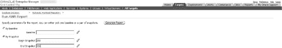
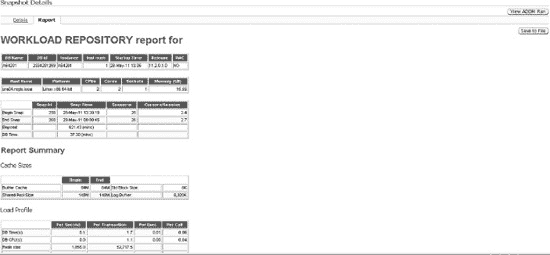

# 4. AWR（自动工作负载存储库）

## 工作原理

AWR 的前身是 Statspack，它需要手动设置和配置才能启用统计数据收集。如前所述，通常不需要设置，除非`STATISTICS_LEVEL`参数被更改为`BASIC`设置。默认情况下，AWR 快照每小时在数据库上拍摄一次，默认存储八天。这些是可配置的设置，如果需要可以进行修改。有关修改 AWR 快照默认设置的信息，请参阅配方 4-2。

除了简单地查看`STATISTICS_LEVEL`参数的值外，您还可以查看`V$STATISTICS_LEVEL`视图以获取此信息，该视图包含有关`STATISTICS_LEVEL`设置以及数据库中所有其他相关统计组件的信息：

```sql
SELECT statistics_name, activation_level, system_status
FROM v$statistics_level;
```

```
STATISTICS_NAME                                  ACTIVAT SYSTEM_S
---------------------------------------- ------- --------
Buffer Cache Advice                             TYPICAL ENABLED
MTTR Advice                                     TYPICAL ENABLED
Timed Statistics                                TYPICAL ENABLED
Timed OS Statistics                             ALL     DISABLED
Segment Level Statistics                        TYPICAL ENABLED
PGA Advice                                      TYPICAL ENABLED
Plan Execution Statistics                       ALL     DISABLED
Shared Pool Advice                              TYPICAL ENABLED
Modification Monitoring                         TYPICAL ENABLED
Longops Statistics                              TYPICAL ENABLED
Bind Data Capture                               TYPICAL ENABLED
Ultrafast Latch Statistics                      TYPICAL ENABLED
Threshold-based Alerts                          TYPICAL ENABLED
Global Cache Statistics                         TYPICAL ENABLED
Active Session History                          TYPICAL ENABLED
Undo Advisor, Alerts and Fast Ramp up           TYPICAL ENABLED
Streams Pool Advice                             TYPICAL ENABLED
Time Model Events                               TYPICAL ENABLED
Plan Execution Sampling                         TYPICAL ENABLED
Automated Maintenance Tasks                     TYPICAL ENABLED
SQL Monitoring                                  TYPICAL ENABLED
Adaptive Thresholds Enabled                     TYPICAL ENABLED
V$IOSTAT_* statistics                           TYPICAL ENABLED
Session Wait Stack                              TYPICAL ENABLED

24 rows selected.
```

AWR 中存储的信息类型包括以下内容：

*   关于对象访问和使用的统计信息
*   时间模型统计信息
*   系统统计信息
*   会话统计信息
*   SQL 语句

收集的信息然后按类别进行分组和格式化。报告中找到的一些类别包括以下内容：

*   实例效率
*   前 5 个定时事件
*   内存和 CPU 统计信息
*   等待信息
*   SQL 语句信息
*   各种操作系统和数据库统计信息
*   数据库文件和表空间使用信息

 注意 要使用 AWR 功能，必须满足以下条件。首先，您必须拥有 Oracle Diagnostics Pack 的许可，否则您需要使用 Statspack。其次，`CONTROL_MANAGEMENT_PACK_ACCESS`参数必须设置为`DIAGNOSTIC+TUNING`或`DIAGNOSTIC`。

## 4-2. 修改统计信息间隔和保留期

### 问题

您需要将 AWR 快照的间隔或保留期设置为默认值以外的值。

### 解决方案

通过使用`DBMS_WORKLOAD_REPOSITORY` PL/SQL 包，您可以修改数据库的默认快照设置。为了首先验证 AWR 快照的当前保留和间隔设置，请运行以下查询：

```sql
SQL> column awr_snapshot_retention_period format a40
SQL> SELECT EXTRACT(day from retention) || ':' ||
       EXTRACT(hour from retention) || ':' ||
       EXTRACT (minute from retention)  awr_snapshot_retention_period,
       EXTRACT (day from snap_interval) *24*60+
       EXTRACT (hour from snap_interval) *60+
       EXTRACT (minute from snap_interval) awr_snapshot_interval
FROM dba_hist_wr_control;
```

```
AWR_SNAPSHOT_RETENTION_PERIOD      AWR_SNAPSHOT_INTERVAL
------------------------------ ---------------------
8:13:45                                            60
```

上面显示的保留期输出采用日：时：分格式。因此，我们当前的保留期是 8 天 13 小时 45 分钟。间隔，即收集 AWR 快照的频率，在前面的示例中是 60 分钟。然后，要修改保留期和间隔设置，您可以使用`DBMS_WORKLOAD_REPOSITORY`包的`MODIFY_SNAPSHOT_SETTINGS`过程。要更改数据库的这些设置，请发出如下示例所示的命令，该示例将保留期修改为 30 天（以分钟数指定），并将拍摄快照的快照间隔修改为 30 分钟。当然，您可以选择只设置一个参数或另一个参数，而不必同时更改两个设置。以下示例仅出于演示目的显示了两个参数：

```sql
SQL> exec DBMS_WORKLOAD_REPOSITORY.MODIFY_SNAPSHOT_SETTINGS(retention=>43200, interval=>30);
```

```
PL/SQL procedure successfully completed.
```

然后，您可以简单地重新运行来自`DBA_HIST_WR_CONTROL`数据字典视图的查询，以验证您的更改现已生效：

```sql
SQL> /
```

```
AWR_SNAPSHOT_RETENTION_PERIOD               AWR_SNAPSHOT_INTERVAL
---------------------------------------- ---------------------
30:0:0                                                          30
```

### 工作原理

修改数据库的默认设置通常是一个好主意，因为八天的保留期在诊断可能的数据库问题或在数据库上执行数据库调优活动时通常不够。例如，如果您被告知月度流程存在问题，那么表示该流程上次成功执行的普通时间框架将不再可用，除非快照存储了给定的间隔。因此，如果可能的话，最好存储至少 45 天的快照，或者如果数据库上的存储不是问题，则存储更长时间。如果您希望快照无限期存储，可以指定零值，这告诉 Oracle 无限期保留快照信息（实际上是 40,150 天，或 110 年）。参见以下示例：

```sql
SQL> exec DBMS_WORKLOAD_REPOSITORY.MODIFY_SNAPSHOT_SETTINGS(retention=>0);
```

```
PL/SQL procedure successfully completed.
```

```sql
SQL> /
```

```
AWR_SNAPSHOT_RETENTION_PERIOD               AWR_SNAPSHOT_INTERVAL
---------------------------------------- ---------------------
40150:0:0                                                      30
```

默认的快照间隔为一小时，对于大多数数据库来说通常足够精细，因为当有更频繁或更接近实时的需求时，您可以使用活动会话历史（ASH）信息。通过将默认快照间隔增加到大于一小时，实际上可能使诊断性能问题变得更加困难，因为增加窗口的统计信息可能使得更难区分和识别特定时间段内的性能问题。

### 4-3. 手动生成 AWR 报告

### 问题

您想要生成一个 AWR 报告，并知道收集信息的时间范围。

## 4-4. 通过企业管理器生成 AWR 报告

### 问题

您希望从企业管理器中生成一份 AWR 报告。

### 解决方案

在企业管理器中，根据版本的不同，生成 AWR 报告的方式可能有所不同。通常也有不止一种生成方法。在图 4-1 中，这个特定的屏幕显示您需要输入开始和结束的快照范围，在您点击“Generate Report”按钮后，一份 AWR HTML 报告将立即在浏览器窗口中显示。生成的 AWR 报告样本屏幕如图 4-2 所示。



**图 4-1. 在企业管理器中生成 AWR 报告**



**图 4-2. HTML AWR 报告**

### 工作原理

如果您配置了数据库控制（Database Control），或者正在使用网格控制（Grid Control），就可以通过企业管理器生成 AWR 报告。要使用此功能，您必须拥有 Oracle 诊断包（Diagnostics Pack）的许可。

### 4-5. 为单个 SQL 语句生成 AWR 报告

### 问题

您希望查看单个 SQL 语句的统计信息，并且不希望从 AWR 报告中生成所有其他相关统计信息。


#### 解决方案

您可以运行 `awrsqrpt.sql` 脚本，其操作与 `awrrpt.sql` 非常相似。系统将提示您输入所有相同的信息，但会多出一个提示，要求输入一个特定的 SQL ID 值。例如：

```
Specify the SQL Id
~~~~~~~~~~~~~~~~~~
Enter value for sql_id: 5z1b3z8rhutn6
SQL ID specified:  5z1b3z8rhutn6
```

生成的报告将专注于特定于您的 SQL 语句的信息，包括 `CPU Time`、`Disk Reads` 和 `Buffer Gets`。它还提供了详细的执行计划供审查。请参见报告中的以下片段：

```
Stat Name                                         Statement   Per Execution % Snap
------------------------------------------------ ---------- -------------- -------
Elapsed Time (ms)                                   210,421      105,210.3     9.4
CPU Time (ms)                                        22,285       11,142.3     1.6
Executions                                                2            N/A     N/A
Buffer Gets                                           1,942,525      971,262.5    12.5
Disk Reads                                            1,940,578      970,289.0    14.0
Parse Calls                                                9            4.5     0.0
Rows                                                       0            0.0     N/A
User I/O Wait Time (ms)                              195,394            N/A     N/A
Cluster Wait Time (ms)                                    0            N/A     N/A
Application Wait Time (ms)                                0            N/A     N/A
Concurrency Wait Time (ms)                                0            N/A     N/A
Invalidations                                             0            N/A     N/A
Version Count                                             2            N/A     N/A
Sharable Mem(KB)                                         22            N/A     N/A
```

```
Execution Plan
-----------------------------------------------------------------------------------------------
| Id  | Operation            | Name      | Rows  | Bytes | Cost (%CPU)| Time     |PQ Dis
-----------------------------------------------------------------------------------------------
|   0 | SELECT STATEMENT     |           |       |       | 73425 (100)|          |
|   1 |  PX COORDINATOR      |           |       |       |            |          |
|   2 |   PX SEND QC (RANDOM)| :TQ10000  |     1 |    39 | 73425   (1)| 00:14:42 | P->S
|   3 |    PX BLOCK ITERATOR |           |     1 |    39 | 73425   (1)| 00:14:42 | PCWC
|   4 |     TABLE ACCESS FULL| EMPPART   |     1 |    39 | 73425   (1)| 00:14:42 | PCWP
-----------------------------------------------------------------------------------------------
```

```
Full SQL Text

SQL ID         SQL Text
------------ ------------------------------------------------------------------
5z1b3z8rhutn  /* SQL Analyze(98, 0) */ select * from emppart where empno > 12345
```

#### 工作原理

利用此功能是获取给定 SQL 语句历史统计信息的一种便捷方式。对于当前语句，您可以继续使用其他机制（如 `AUTOTRACE`），但在 SQL 语句运行后，使用 `awrsqrpt.sql` 脚本提供了一种简单的机制，可帮助分析过去的运行语句，并辅助对性能不佳的 SQL 语句进行追溯性调优。

### 4-6. 为您的数据库创建统计基线

#### 问题

您希望建立能够代表数据库操作正常状态的基线统计信息。

#### 解决方案

您可以创建 AWR 基线，以便为您的数据库建立一个保存的工作负载视图，该视图可用于后续与其他 AWR 快照进行比较。基线的目的是为预定义的时间段建立数据库的正常工作负载视图。AWR 基线的性能统计信息保存在您的数据库中，不会被自动清除。基线有两种类型——固定基线和移动基线。

##### 固定基线

最常见的基线类型称为固定基线。这是一个单一的、静态的视图，旨在代表正常的系统工作负载。要手动创建 AWR 基线，您可以使用 `DBMS_WORKLOAD_REPOSITORY` PL/SQL 包的 `CREATE_BASELINE` 过程。以下示例说明了如何基于已知的开始和结束日期时间创建基线：

```
SQL> exec dbms_workload_repository.create_baseline -
    (to_date('2011-06-01:00:00:00','yyyy-mm-dd:hh24:mi:ss'), -
    to_date('2011-06-01:06:00:00','yyyy-mm-dd:hh24:mi:ss'),'Batch Baseline #1');

PL/SQL procedure successfully completed.
```

对于上述基线，我们希望为数据仓库批处理窗口（午夜至凌晨 6 点之间）建立一个正常工作负载视图。除非显式删除（管理 AWR 基线请参见配方 4-7），否则此基线将无限期保留。您创建的任何固定基线在创建新基线之前一直有效。如果您希望基线有明确的过期时间，可以在创建时使用 `EXPIRATION` 参数（以天为单位指定）简单地指定基线的保留期：

```
exec dbms_workload_repository.create_baseline( -
start_time=>to_date('2011-06-01:00:00:00','yyyy-mm-dd:hh24:mi:ss'), -
end_time=>to_date('2011-06-01:06:00:00','yyyy-mm-dd:hh24:mi:ss'), -
baseline_name=>'Batch Baseline #1', -
expiration=>30);
```

您也可以基于已创建的 AWR 快照 ID 创建基线。为此，您可以如下运行 `CREATE_BASELINE` 过程：

```
exec dbms_workload_repository.create_baseline( -
start_snap_id=>258,end_snap_id=>268,baseline_name=>'Batch Baseline #1', -
expiration=>30);
```

##### 移动基线

与固定基线类似，移动基线用于在一段时间内捕获指标。最大的区别在于，移动基线的指标是基于整个 AWR 保留期捕获的。例如，默认的 AWR 保留期是八天（有关更改 AWR 保留期，请参见配方 4-2）。这些指标，也称为自适应阈值，是基于整个八天的窗口捕获的。此外，随着给定数据库的 AWR 窗口逐日移动，基线也每天都在变化。因此，随着数据库的演变和性能负载随时间变化，给定时间段内的指标可能会发生变化。系统会自动创建一个默认的移动基线——`SYSTEM_MOVING_BASELINE`。建议增加默认的 AWR 保留期，因为这可以提供更完整的指标集，以更准确地分析性能。移动窗口的最大大小是 AWR 保留期。要修改移动窗口基线，请使用 `DBMS_WORKLOAD_REPOSITORY` 包的 `MODIFY_BASELINE_WINDOW_SIZE` 过程，如下例所示：

```
SQL>  exec dbms_workload_repository.modify_baseline_window_size(30);

PL/SQL procedure successfully completed.
```


