# 工作原理

设置 AWR 保留期可能是使用移动基线时最重要的配置事项，因为所有自适应阈值指标都基于整个保留期的信息。在为移动基线设置保留期时，请再次记住它不能超过 AWR 保留期，否则可能会收到以下错误：

```sql
SQL> exec dbms_workload_repository.modify_baseline_window_size(45);
BEGIN dbms_workload_repository.modify_baseline_window_size(45); END;
*
ERROR at line 1:
ORA-13541: system moving window baseline size (3888000) greater than retention
(2592000)
ORA-06512: at "SYS.DBMS_WORKLOAD_REPOSITORY", line 686
ORA-06512: at line 1
```

如果你将 AWR 保留期设置为无限制值，移动基线保留期仍然有一个上限，如果你设置的移动基线保留期过高，并且 AWR 保留期被设置为无限制，你可能会收到以下错误：

```sql
exec dbms_workload_repository.modify_baseline_window_size(92);
BEGIN dbms_workload_repository.modify_baseline_window_size(92); END;
*
ERROR at line 1:
ORA-13539: invalid input for modify baseline window size (window_size, 92)
ORA-06512: at "SYS.DBMS_WORKLOAD_REPOSITORY", line 686
ORA-06512: at line 1
```

对于固定基线，AWR 保留期不是决定因素，它仅仅基于你希望将快照与基线进行对比的时间跨度来考虑。设置任何基线后，你可以从数据字典中获取有关基线的信息。要获取数据库中基线的信息，你可以使用如下查询，该查询将显示你已配置的任何固定基线，以及自动配置的移动基线：

```sql
  SELECT baseline_name, start_snap_id start_id,
         TO_CHAR(start_snap_time, 'yyyy-mm-dd:hh24:mi') start_time,
         end_snap_id end_id,
         TO_CHAR(end_snap_time, 'yyyy-mm-dd:hh24:mi') end_time,
         expiration
  FROM dba_hist_baseline
  ORDER BY baseline_id;
```

```
BASELINE_NAME          START_ID START_TIME           END_ID END_TIME          EXPIRATION
-------------------- ---------- ---------------- ---------- ---------------- ----------
SYSTEM_MOVING_WINDOW        255 2011-05-27:22:00        358 2011-06-08:22:00
Batch Baseline #1           258 2011-05-28:13:39        268 2011-05-29:00:00       30
```

从上述结果来看，移动基线包含了基于 AWR 保留期的整个快照范围；因此其过期时间显示为`NULL`。你可以通过使用`DBMS_WORKLOAD_REPOSITORY`包的`SELECT_BASELINE_DETAILS`函数获取类似信息。你需要提供`baseline_id`编号传入函数以获得所需结果：

```sql
SELECT start_snap_id, start_snap_time, end_snap_id, end_snap_time,
       pct_total_time pct  FROM (SELECT * FROM
       TABLE(DBMS_WORKLOAD_REPOSITORY.select_baseline_details(12)));
```

```
START_SNAP_ID START_SNAP_TIME           END_SNAP_ID END_SNAP_TIME                    PCT
------------- ------------------------- ----------- ------------------------- ----------
           258 28-MAY-11 01.39.19.296 PM         268 29-MAY-11 12.00.45.211 AM     100
```

要获取数据库中关于移动基线的更具体信息，你需要深入研究自适应指标的统计信息。例如，要查看基于移动窗口的每个与“读取”相关的指标的平均值和最大值，你可以使用以下查询：

```sql
column metric_name format a50
SELECT metric_name, average, maximum FROM
(SELECT * FROM TABLE
(DBMS_WORKLOAD_REPOSITORY.select_baseline_metric('SYSTEM_MOVING_WINDOW')))
where lower(metric_name) like '%read%'
order by metric_name;
```

```
METRIC_NAME                                             AVERAGE    MAXIMUM
-------------------------------------------------- ---------- ----------
Average Synchronous Single-Block Read Latency      .159658155 53.8876404
Consistent Read Changes Per Sec                    2.99232446 3984.11246
Consistent Read Changes Per Txn                    117.812978      239485
Consistent Read Gets Per Sec                       202.570936  64677.436
Consistent Read Gets Per Txn                       3930.41373 372602.889
Logical Reads Per Sec                              224.984307 64690.6884
Logical Reads Per Txn                              4512.34119      840030
Logical Reads Per User Call                        276.745756      135804
Physical Read Bytes Per Sec                        1249601.48 528672777
Physical Read IO Requests Per Sec                  6.44664078 2040.73828
Physical Read Total Bytes Per Sec                  1272159.18 528699475
Physical Read Total IO Requests Per Sec            7.82238122 2042.31792
Physical Reads Direct Lobs Per Sec                 .006030572  4.6953047
Physical Reads Direct Lobs Per Txn                 .231642268        141
Physical Reads Direct Per Sec                      59.3280451 64535.1513
Physical Reads Direct Per Txn                      602.336945 371825.222
Physical Reads Per Sec                             152.539244 64535.2511
Physical Reads Per Txn                             2966.04803 371831.889
```

## 4-7. 通过企业管理器管理 AWR 基线

### 问题

你想使用企业管理器创建和管理 AWR 基线。

### 解决方案

使用企业管理器，你可以轻松配置或修改基线。在图 4-3 中，你可以看到用于建立或修改现有基线（包括任何固定基线以及系统移动基线）的窗口。要创建一个新的固定基线，你可以点击`Create`（创建）按钮，这将导航到如图 4-4 所示的屏幕，在那里你可以配置新的固定基线。在此屏幕中，你为基线命名，并在基于快照或基于时间的基线之间进行选择。

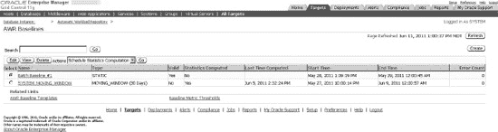

图 4-3. 在企业管理器中管理基线

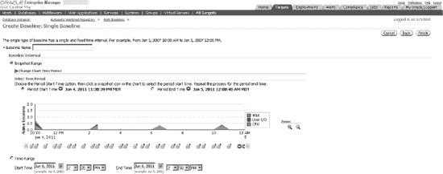

图 4-4. 在企业管理器中创建新的固定基线

当决定修改现有基线时，屏幕选项在修改固定基线和修改系统移动基线之间有所不同。图 4-5 显示了固定基线的可修改选项。如你所见，唯一可以实际修改的是基线名称本身。图 4-6 展示了如何在企业管理器中更改移动基线窗口。如前所述，实际屏幕可能因企业管理器工具的版本而异。

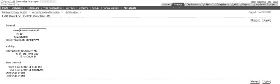

图 4-5. 在企业管理器中修改固定基线

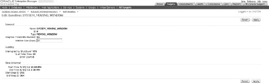

图 4-6. 在企业管理器中修改移动基线


#### 工作原理

对于任何创建的固定基线或系统移动基线，您还可以简单地基于特定基线生成 AWR 报告。图 4-1 展示了如何点击 **按快照** 按钮生成基于快照的 AWR 报告。使用同一屏幕，您也可以通过点击 **按基线** 按钮为基线生成 AWR 报告。

如果您想在 Enterprise Manager 中删除基线，只需选中要删除基线的单选按钮，然后点击 **删除** 按钮，如图 4-7 所示。图 4-8 展示了实际删除基线的操作。您可以通过选择相应的单选按钮来决定保留或清除基线数据。

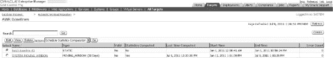

**图 4-7. 选择要删除的基线**

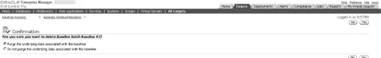

**图 4-8. 删除基线**

 **注意**  您无法删除系统移动基线。

### 4-8. 管理 AWR 统计信息存储库

#### 问题

您的数据库中已存在 AWR 快照和基线，需要对您的 AWR 信息执行定期维护活动。

#### 解决方案

通过使用 `DBMS_WORKLOAD_REPOSITORY` 包，您可以执行对基线的大部分维护操作，包括：

*   重命名基线
*   删除基线
*   删除快照范围

要重命名基线，请使用 `DBMS_WORKLOAD_REPOSITORY` 包的 `RENAME_BASELINE` 过程：

```sql
SQL>  exec dbms_workload_repository.rename_baseline -
      ('Batch Baseline #9','Batch Baseline #10');

PL/SQL procedure successfully completed.
```

要删除基线，只需使用 `DROP_BASELINE` 过程：

```sql
SQL> exec dbms_workload_repository.drop_baseline('Batch Baseline #1');

PL/SQL procedure successfully completed.
```

如果您认为有些 AWR 快照不再需要，可以通过使用 `DROP_BASELINE` 过程删除快照范围来减少数据库中保存的 AWR 快照数量：

```sql
SQL>  exec dbms_workload_repository.drop_snapshot_range(255,256);

PL/SQL procedure successfully completed.
```

#### 工作原理

除了 `DBMS_WORKLOAD_REPOSITORY` 包，您还可以采取其他措施来分析 AWR 信息，以帮助管理数据库中的所有 AWR 信息，包括：

*   从数据字典中查看 AWR 信息
*   将 AWR 信息移动到另一个数据库位置的存储库中

如果您希望将整个数据库网格的 AWR 信息存储在单个数据库中，Oracle 提供了可运行的脚本，用于根据快照范围从给定数据库提取 AWR 信息，然后将这些信息加载到不同的数据库。

要从数据库中提取给定快照范围的 AWR 信息，您需要运行 `awrextr.sql` 脚本。这是一个交互式脚本，会询问与使用 `awrrpt.sql` 脚本生成 AWR 报告时类似的信息。运行此脚本时需要回答以下问题：

1.  DBID（默认为当前数据库的 DBID）
2.  要显示以供提取的快照天数
3.  要提取的起始快照号
4.  要提取的结束快照号
5.  用于存放包含指定快照范围所有 AWR 信息的结果输出文件的 Oracle 目录；目录必须以大写输入。
6.  输出文件名（默认为 `awrdat` 加上快照范围编号）

请记住，此过程生成的输出文件会占用空间，其大小根据快照时活动的会话数而变化。每个需要提取的单个快照可能占用 1 MB 或更多的存储空间，因此请仔细评估所需的快照量。如有必要，如果目标目录空间不足，可以将提取过程分成几部分进行。

此外，对于生成的每个输出文件，还会生成一个小的输出日志文件，其中包含有关提取过程的信息，这有助于确定提取的信息是否与您认为已提取的信息相符。这是确保您提取了所需 AWR 信息的宝贵审计。

一旦您有了提取输出文件，您需要将它们（如果需要）传输到目标服务器位置，以加载到目标数据库位置。加载过程使用 `awrload.sql` 脚本完成。加载脚本所需的输入包括：

1.  用于存放包含指定快照范围所有 AWR 信息的结果输出文件的 Oracle 目录；目录必须以大写输入。
2.  文件名（应与提取过程（即 `awrextr.sql` 脚本）第 6 步中输入的名称相同；输入文件名时，请省略 `.dmp` 后缀，因为它会自动追加）。
3.  目标模式（默认模式名为 `AWR_STAGE`）
4.  将创建对象的目标表空间（提供选项列表）
5.  将创建对象的目标临时表空间（提供选项列表）

数据加载完成后，AWR 数据将移动到目标数据库数据字典表中的 `SYS` 模式。然后，临时目标模式（例如 `AWR_STAGE`）将被删除。

为了生成从一个数据库加载到另一个数据库的 AWR 报告，请使用 `DBMS_WORKLOAD_REPOSITORY` 包的 `AWR_REPORT_TEXT` 函数。例如，假设我们已将快照 300 到 366 加载并存储到我们的独立 AWR 数据库中。如果我们想为某个数据库生成快照 365 到 366 之间信息的 AWR 报告，我们将运行以下命令，并指定源数据库的 DBID 以及起始和结束快照号：

```sql
SELECT  dbms_workload_repository.awr_report_text
        (l_dbid=>2334201269,l_inst_num=>1,l_bid=>365,l_eid=>366)
FROM dual;
```

### 4-9. 自动创建 AWR 基线

#### 问题

您希望定期在数据库中自动创建基线。

#### 解决方案

您可以创建一个 AWR 重复模板，这使您能够根据预定义的间隔和时间范围自动创建基线。通过使用 `DBMS_WORKLOAD_REPOSITORY` 包中的 `CREATE_BASELINE_TEMPLATE` 过程，您可以为这个重复的间隔和时间范围自动创建一个固定基线。参见以下示例来设置 AWR 模板：

```sql
SQL> alter session set nls_date_format = 'yyyy-mm-dd:hh24:mi:ss';

SQL> exec DBMS_WORKLOAD_REPOSITORY.create_baseline_template( -
>    day_of_week          => 'WEDNESDAY', -
>    hour_in_day          => 0, -
>    duration             => 6, -
>    start_time           => '2011-06-14:00:00:00', -
>    end_time             => '2011-06-14:06:00:00', -
>    baseline_name_prefix => 'Batch Baseline ', -
>    template_name        => 'Batch Template', -
>    expiration           => 365);

PL/SQL procedure successfully completed.
```

对于上述模板，将基于每周三午夜到早上 6 点的时间窗口创建一个固定基线。在这种情况下，此模板为常规的批处理窗口时间框架创建基线。

如果您使用的是 Enterprise Manager，可以使用相同的参数创建模板。示例请参见图 4-9。

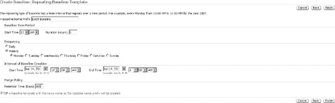

**图 4-9. 创建 AWR 模板**


#### 工作原理

如果您需要删除模板，只需使用 `DBMS_WORKLOAD_REPOSITORY` 包中的 `DROP_BASELINE_TEMPLATE` 过程。请参见以下示例：

```sql
SQL> exec dbms_workload_repository.drop_baseline_template('Batch Template');

PL/SQL procedure successfully completed.
```

如果您希望查看您已创建的任何模板的信息，可以查询 `DBA_HIST_BASELINE_TEMPLATE` 视图。请参见以下示例查询：

```sql
column template_name format a14
column prefix format a14
column hr format 99
column dur format 999
column exp format 999

SELECT template_name, baseline_name_prefix prefix,
to_char(start_time,'mm/dd/yy:hh24') start_time,
to_char(end_time,'mm/dd/yy:hh24') end_time,
substr(day_of_week,1,3) day, hour_in_day hr, duration dur, expiration exp,
to_char(last_generated,'mm/dd/yy:hh24') last
FROM dba_hist_baseline_template;

TEMPLATE_NAME  PREFIX         START_TIME  END_TIME    DAY  HR  DUR  EXP LAST
-------------- -------------- ----------- ----------- --- --- ---- ---- -----------
Batch Template Batch Baseline 06/14/11:00 06/14/11:06 WED   0    6  365 06/14/11:00
```

### 4-10. 快速分析 AWR 输出

#### 问题

您已生成 AWR 报告，并希望快速解读报告的关键部分，以确定数据库是否存在性能问题。

#### 解决方案

AWR 报告与其前身——早期 Oracle 版本的 Statspack 和 UTLBSTAT/UTLESTAT——一样，包含大量统计信息，可帮助您确定数据库的运行和性能状况。报告包含许多部分。评估数据库性能时，首先要看的三个地方是：

1.  数据库时间
2.  实例效率
3.  前五大计时事件

报告显示的第一部分是报告快照窗口的摘要，以及对经过时间（代表快照窗口）和数据库时间（代表数据库活动）的简要查看。如果数据库时间超过经过时间，则表示数据库繁忙。如果它比经过时间高出很多，可能意味着某些会话正在等待资源。虽然这不够具体，但可以让您快速查看数据库整体是否繁忙并可能已超负荷。从以下此部分的示例中，通过比较经过时间和数据库时间，我们可以看出这是一个非常繁忙的数据库：

```
              快照 ID       快照时间        会话数  游标/会话
            --------- ------------------- -------- ---------
开始快照:    18033 11-Jun-11 00:00:43        59       2.3
  结束快照:    18039 11-Jun-11 06:00:22        69       2.4
   经过时间:              359.66 (分钟)
   数据库时间:          7,713.90 (分钟)
```

实例效率部分可以让您非常快速地了解数据库上的运行是否充分。通常，此部分中的大多数百分比应高于 90%。`Parse CPU to Parse Elapsd` 指标显示 CPU 在解析 SQL 语句上花费了多少时间。此指标越低越好。在以下示例中，它约为 2%，非常低。如果此指标达到 5%，可能意味着需要调查以确定为什么 CPU 要花费这么多时间仅仅解析 SQL 语句。

```
实例效率百分比（目标 100%）
~~~~~~~~~~~~~~~~~~~~~~~~~~~~~~~~~~~~~~~~~~~~~
            缓冲区立即获得 %:   99.64       重做无等待 %:   99.99
            缓冲区命中率 %:   91.88    内存中排序 %:   99.87
            库缓存命中率 %:   98.92        软解析 %:   94.30
         执行到解析比率 %:   93.70         闩锁命中率 %:   99.89
解析 CPU 时间与解析耗时比率 %:    2.10     % 非解析 CPU:   99.75
```

快速了解数据库性能的第三个地方是“前五大计时事件”部分。此部分让您快速了解在快照期间，数据库内资源消耗最高的具体位置。根据这些结果，它可能显示花费了过多时间执行全表扫描，或通过数据库链接获取数据。以下示例显示，使用最多资源的操作是索引扫描（由 `db file sequential read` 标明）。我们可以看到在 `local write wait`、`enq: CF – contention` 和 `free buffer waits` 上花费了大量时间，这让我们快速了解了数据库可能存在的争用和等待事件，并为调查和分析提供了直接方向。

```
前五大计时前台事件                                  平均
~~~~~~~~~~~~~~~~~~~~~~~~~~~~~                          等待时间   % 数据库
事件                                 等待次数    耗时(秒)   (毫秒)   时间 等待类别
------------------------------ ------------ ----------- ------ ------ ----------
db file sequential read           3,653,606      96,468     26   20.8   用户 I/O
local write wait                     94,358      67,996    721   14.7   用户 I/O
enq: CF - contention                 18,621      46,944   2521   10.1      其他
free buffer waits                 3,627,548      38,249     11    8.3 配置
db file scattered read            2,677,267      32,400     12    7.0   用户 I/O
```

#### 工作原理

在查看了数据库时间、实例效率和前五大计时事件部分后，如果您想更详细地查看特定 AWR 报告的部分，请参阅第 7 章中的方案 7-17 获取更多信息。由于 AWR 报告中的信息量非常庞大，强烈建议创建代表正常处理窗口的基线。然后，可以将 AWR 快照与基线进行比较，那些在给定 AWR 报告中可能只是数字的指标，当特定指标显著高于或低于正常范围时，就会凸显出来。

### 4-11. 手动获取活动会话信息

#### 问题

您需要对执行过于频繁或时间太短以至于无法在可用 AWR 快照中捕获的会话进行性能分析。AWR 快照的采样频率不足以捕捉您需要的信息。


## 解决方案

您可以使用 Oracle 活动会话历史 (ASH) 信息来获取实时或接近实时的会话信息。虽然 AWR 信息非常有用，但它受限于报告周期（默认情况下每小时运行一次）。ASH 信息包含活动会话信息，每秒从 `V$SESSION` 采样一次，可以显示更实时或接近实时的会话信息，以协助对数据库进行性能分析。有几种方法可以从数据库获取活动会话信息：

*   运行预定义的 ASH 报告
*   在 Enterprise Manager 中运行 ASH 报告（参见配方 4-12）
*   从数据字典中获取 ASH 信息（参见配方 4-13）

获取活动会话信息最简单的方法是运行 `ashrpt.sql` 脚本，其性质类似于运行 `awrrpt.sql` 脚本来生成 AWR 报告。当您运行 `ashrpt.sql` 脚本时，它会询问以下信息：

*   报告类型（文本或 HTML 格式）
*   报告开始时间（默认为当前时间减去 15 分钟）
*   报告结束时间（默认为当前时间）
*   报告名称

ASH 报告包含多个部分。有关每个部分的简要说明，请参见 表 4-1。以下是 ASH 报告许多部分的片段摘录。为简洁起见，某些部分已缩短。

```
Top User Events
DB/Inst: ORCL/ORCL  (Jun 18 12:00 to 12:45)

                                                          Avg Active
Event                            Event Class     % Activity   Sessions
----------------------------------- --------------- ---------- ----------
CPU + Wait for CPU                  CPU                  35.36       1.66
db file scattered read              User I/O             33.07       1.55
db file sequential read             User I/O             21.33       1.00
read by other session               User I/O              6.20       0.29
direct path read temp               User I/O              2.59       0.12
          -------------------------------------------------------------
```

```
Top Background Events
DB/Inst: ORCL/ORCL (Jun 18 12:00 to 12:45)

                                                          Avg Active
Event                            Event Class     % Activity   Sessions
----------------------------------- --------------- ---------- ----------
Log archive I/O                     System I/O           12.77       0.68
CPU + Wait for CPU                  CPU                   6.38       0.34
log file parallel write             System I/O            5.66       0.30
log file sequential read            System I/O            4.91       0.26
log file sync                       Commit                1.06       0.06
          -------------------------------------------------------------
```

```
Top Event P1/P2/P3 Values
DB/Inst: ORCL/ORCL (Jun 18 12:00 to 12:45)

Event                          % Event  P1 Value, P2 Value, P3 Value % Activity
------------------------------ ------- ----------------------------- ----------
Parameter 1                Parameter 2                Parameter 3
-------------------------- -------------------------- --------------------------
db file scattered read           17.30           "775","246084","16"       0.14
file#                      block#                      blocks

Datapump dump file I/O            6.32         "1","32","2147483647"       6.32
count                      intr                       timeout

RMAN backup & recovery I/O        5.83         "1","32","2147483647"       5.80
count                      intr                       timeout
```

```
Top Service/Module
DB/Inst: ORCL/ORCL (Jun 18 12:00 to 12:45)

Service        Module                   % Activity Action               % Action
-------------- ------------------------ ---------- ------------------ ----------
SYS$BACKGROUND UNNAMED                       31.00 UNNAMED                 31.00
               DBMS_SCHEDULER                18.87 GATHER_STATS_JOB        18.87
               Data Pump Worker              18.87 APP_IMPORT              18.87
SYS$BACKGROUND MMON_SLAVE                     1.95 Auto-Flush Slave A       1.42
          -------------------------------------------------------------
```

```
Top SQL Command Types
DB/Inst: ORCL/ORCL (Jun 18 12:00 to 12:45)

                                           Distinct            Avg Active
SQL Command Type                             SQLIDs % Activity   Sessions
---------------------------------------- ---------- ---------- ----------
INSERT                                            2      18.88       1.00
SELECT                                           27       2.36       0.12
          -------------------------------------------------------------
```

```
Top SQL Statements
DB/Inst: ORCL/ORCL (Jun 18 12:00 to 12:45)

       SQL ID    Planhash % Activity Event                         % Event
------------- ----------- ---------- ------------------------------ ----------
av2f2stsjfr5k  3774074286       1.16 CPU + Wait for CPU               0.80
select a.tablespace_name, round(sum_free/sum_bytes,2)*100 pct_free from
(select tablespace_name, sum(bytes) sum_bytes from sys.dba_data_files group by t
ablespace_name) a, (select tablespace_name, sum(bytes) sum_free , max(bytes)
bigchunk from sys.dba_free_space group by tablespace_name) b where a.table
Top Sessions              DB/Inst: ORCL/ORCL  (Jun 18 12:00 to 12:45)

   Sid, Serial# % Activity Event                         % Event
--------------- ---------- ------------------------------ ----------
User                 Program                             # Samples Active     XIDs
-------------------- ------------------------------ ------------------ --------
      365, 3613      18.87 CPU + Wait for CPU               12.29
D_USER               oracle@oraprod (DW01)         1,755/2,700 [ 65%]        8

                           Datapump dump file I/O               6.32
                                                     903/2,700 [ 33%]        8

      515, 8721      18.87 db file scattered read              17.26
SYS                    oracle@oraprod (J000)         2,465/2,700 [ 91%]        1
```

```
Top Blocking Sessions
DB/Inst: ORCL/ORCL (Jun 18 12:00 to 12:45)

   Blocking Sid % Activity Event Caused                      % Event
--------------- ---------- ------------------------------ ----------
User                 Program                             # Samples Active     XIDs
-------------------- ------------------------------ ------------------ --------
      549,    1        2.09 enq: CF - contention                 2.03
SYS                    oracle@oraprod (CKPT)            248/2,700 [  9%]        0
```

```
Top DB Objects
DB/Inst: ORCL/ORCL (Jun 18 12:00 to 12:45)

      Object ID % Activity Event                         % Event
--------------- ---------- ------------------------------ ----------
Object Name (Type)                                    Tablespace
----------------------------------------------------- -------------------------
        1837336       3.25 db file scattered read               3.25
STG.EMPPART.EMPPART10_11P (TAB EMP_S

        1837324       3.05 db file scattered read               3.05
STG.EMPPART.EMPPART10_10P (TAB EMP_S
```

```
Top DB Files
DB/Inst: ORCL/ORCL (Jun 18 12:00 to 12:45)
```


`        文件 ID % 活动事件                     % 事件`
`--------------- ------------------------------ ----------`
`文件名                                           表空间`
`----------------------------------------------------- -------------------------`
`            200       6.31 数据泵转储文件 I/O               6.31`
`/opt/vol01/ORCL/app_s_016.dbf                       APP_S`

`          -------------------------------------------------------------`
`按时间的活动` `数据库实例: ORCL/ORCL` `（6 月 18 日 12:00 至 12:45）`

`                             插槽                                       事件`
`插槽时间（持续时间）    计数 事件                                      计数 % 事件`
`-------------------- ------------------------------ -------- -------`
`12:00:00   （5.0 分钟）    2,672 CPU + 等待 CPU                        1,789   12.52`
`                               db file scattered read                     290    2.03`
`                               enq: CF - contention                        290    2.03`
`12:05:00   （5.0 分钟）    2,586 CPU + 等待 CPU                        1,396    9.77`
`                               RMAN 备份与恢复 I/O                  305    2.14`
`                               db file scattered read                      287    2.01`
`12:10:00   （5.0 分钟）    2,392 CPU + 等待 CPU                        1,068    7.48`
`                               日志归档 I/O                             423    2.96`
`                               RMAN 备份与恢复 I/O                  356    2.49`
`...`
`          -------------------------------------------------------------`

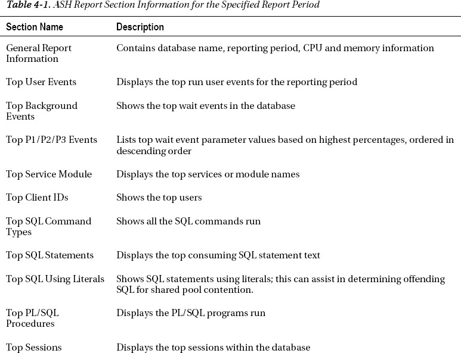

## 工作原理

如果您需要比从 AWR 报告中能获取的更实时的会话信息，那么检索 ASH 信息是必要的。再次说明，AWR 信息默认情况下是每小时生成一次。ASH 信息则从`V$SESSION`中每秒收集一次，并存储最有用的会话信息，以帮助评估数据库在任何特定时刻的性能。

ASH 信息存储在 SGA 的一个循环缓冲区中。Oracle 文档指出，缓冲区大小按如下方式计算：

```
Max [Min [ #CPUs * 2 MB, 5% of Shared Pool Size, 30MB ], 1MB ]
```

信息在数据字典中存储的时间长短取决于数据库内的活动情况。如果您的数据库非常活跃，您可能需要查看`DBA_HIST_ACTIVE_SESS_HISTORY`历史视图，以便获取所需的 ASH 信息。有关查询`DBA_HIST_ACTIVE_SESS_HISTORY`视图的示例，请参阅方法 4-13。要快速查看历史视图中保存了多少数据，您可以简单地从`DBA_HIST_ACTIVE_SESS_HISTORY`视图中获取最早的`SAMPLE_TIME`：

```
SELECT min(sample_time) FROM dba_hist_active_sess_history;
```

```
MIN(SAMPLE_TIME)
---------------------------------------------------------------------------
20-MAR-11 11.00.27.433 PM
```

管理 AWR 每小时快照的 MMON 后台进程，同时也会将 ASH 信息刷新到历史视图中。如果数据库上活动频繁，并且缓冲区在小时级 AWR 快照之间填满，MMNL 后台进程将唤醒并将 ASH 数据刷新到历史视图中。

`V$ACTIVE_SESSION_HISTORY`和`DBA_HIST_ACTIVE_SESS_HISTORY`视图包含的信息比本方法中展示的样本要详细得多，如果您愿意，可以深入挖掘并在会话级别获取更多信息，包括有关实际 SQL 语句、SQL 操作、阻塞会话信息以及文件 I/O 信息。

### 4-12. 从 Enterprise Manager 获取 ASH 信息

#### 问题

您希望从 Enterprise Manager 中获取 ASH 信息，因为您使用 Enterprise Manager 进行性能调优活动。

#### 解决方案

从 Enterprise Manager 生成的 ASH 报告包含与表 4-1 中指定的相同部分（参见方法 4-11）。要从 Enterprise Manager 生成 ASH 报告，通常需要位于“性能”选项卡中，具体取决于您使用的 Enterprise Manager 特定版本。与运行`ashrpt.sql`脚本一样，您需要指定所需报告期的开始和结束时间段。有关用于生成 ASH 报告的屏幕示例，请参见图 4-10；有关 ASH 报告输出的示例，请参见图 4-11：

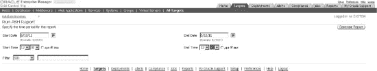

图 4-10. 从 Enterprise Manager 生成 ASH 报告

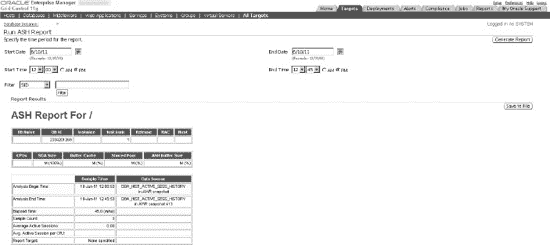

图 4-11. Enterprise Manager 中的 ASH 报告示例

#### 工作原理

生成 ASH 报告时，您可以选择根据特定条件进行筛选。在图 4-12 中，请参阅“筛选器”下拉菜单。如果您的数据库非常活跃，并且希望直接关注某个特定的 SQL_ID，例如，您可以从“筛选器”下拉菜单中选择 SQL_ID 选项，并输入 SQL_ID 值。生成的报告将仅显示基于筛选条件的信息。

可筛选的选项包括：

*   `SID`
*   `SQL_ID`
*   `等待类`
*   `服务`
*   `模块`
*   `操作`
*   `客户端`

许多前述筛选器都可以在`V$SESSION`视图中找到。要获取可能的等待类列表，您可以查询`DBA_HIST_EVENT_NAME`视图，如下例所示：

```
SELECT DISTINCT wait_class FROM dba_hist_event_name;
```

```
WAIT_CLASS
----------------------------------------------------------------
Concurrency
User I/O
Administrative
System I/O
Scheduler
Configuration
Other
Application
Cluster
Network
Idle
Commit
```

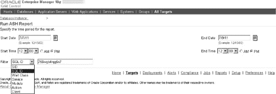

图 4-12. 通过筛选器自定义 ASH 报告

### 4-13. 从数据字典获取 ASH 信息

#### 问题

您希望查看 Oracle 数据字典中保存了哪些 ASH 信息。


#### 解决方案

有几个数据字典视图可用于获取 ASH 信息。第一个是 `V$ACTIVE_SESSION_HISTORY`，可用于获取数据库中当前或最近会话的信息。第二个是 `DBA_HIST_ACTIVE_SESS_HISTORY`，用于存储较旧的历史 ASH 信息。

如果想查看数据库中过去 15 分钟内所有事件及其总等待时间，可以执行以下查询：

```sql
SELECT s.event, sum(s.wait_time + s.time_waited) total_wait
FROM v$active_session_history s
WHERE s.sample_time between sysdate-1/24/4 AND sysdate
GROUP BY s.event
ORDER BY 2 desc;
```

```
EVENT                                                      TOTAL_WAIT
---------------------------------------------------------------- ----------
                                                             20002600
db file scattered read                                      15649078
read by other session                                        9859503
db file sequential read                                       443298
direct path read temp                                         156463
direct path write temp                                        139984
log file parallel write                                        49469
db file parallel write                                         21207
log file sync                                                  11793
SGA: allocation forcing component growth                       11711
control file parallel write                                     4421
control file sequential read                                    2122
SQL*Net more data from client                                    395
SQL*Net more data to client                                       66
```

如果想获取更具体的会话信息，并查看过去 15 分钟内使用 CPU 资源最多的前 5 个会话，可以执行以下查询：

```sql
column username format a12
column module format a30

SELECT * FROM
(
SELECT s.username, s.module, s.sid, s.serial#, count(*)
FROM v$active_session_history h, v$session s
WHERE h.session_id = s.sid
AND   h.session_serial# = s.serial#
AND   session_state= 'ON CPU' AND
      sample_time > sysdate - interval '15' minute
GROUP BY s.username, s.module, s.sid, s.serial#
ORDER BY count(*) desc
)
where rownum <= 5;
```

```
USERNAME     MODULE                                SID    SERIAL#   COUNT(*)
------------ ---------------------------- ---------- ---------- ----------
SYS          DBMS_SCHEDULER                         536          9         43
APPLOAD      etl1@app1 (TNS V1-V3)                 1074       3588         16
APPLOAD      etl1@app1 (TNS V1-V3)                 1001       4004         12
APPLOAD      etl1@app1 (TNS V1-V3)                  968        108          5
DBSNMP       emagent@ora1 (TNS V1-V3)               524          3          2
```

`SESSION_STATE` 列有两个有效值：`ON CPU` 和 `WAITING`，它们表示会话是活动的还是在等待资源。如果想查看正在等待资源的会话，可以使用与之前相同的查询，只需将 `SESSION_STATE` 改为 `WAITING`。

如果想查看特定采样期间内使用最频繁的数据库对象，可以将 `V$ACTIVE_SESSION_HISTORY` 与 `DBA_OBJECTS` 视图连接以获取该信息。在以下示例中，我们获取了过去 15 分钟内使用最多的前 5 个数据库对象列表，以及与该数据库对象关联的事件：

```sql
SELECT * FROM
(
SELECT o.object_name, o.object_type, s.event,
       SUM(s.wait_time + s.time_waited) total_waited
FROM v$active_session_history s, dba_objects o
WHERE s.sample_time between sysdate - 1/24/4 and sysdate
AND s.current_obj# = o.object_id
GROUP BY o.object_name, o.object_type, s.event
ORDER BY 4 desc
)
WHERE rownum <= 5;
```

```
OBJECT_NAME                    OBJECT_TYPE     EVENT                        TOTAL_WAITED
---------------------------- --------------- ---------------------------- ------------
WRI$_ALERT_OUTSTANDING         TABLE           Streams AQ: enqueue block      110070196
                                               ed on low memory
APP_ETL_IDX1                   INDEX           read by other session          65248777
APP_SOURCE_INFO                TABLE PARTITION db file scattered read         33801035
EMPPART_PK_I                   INDEX PARTITION read by other session          28077262
APP_ORDSTAT                    TABLE PARTITION db file scattered read         15569867
```

#### 工作原理

`DBA_HIST_ACTIVE_SESS_HISTORY` 视图可以提供已从 `V$ACTIVE_SESSION_HISTORY` 视图中老化退出的会话的历史信息。假设某天数据库性能特别差。只要信息仍保留在 `DBA_HIST_ACTIVE_SESS_HISTORY` 视图中，您就可以聚焦于特定时间范围内的历史会话信息。例如，如果想获取在性能较差的某一天消耗资源最多的用户，可以执行以下查询：

```sql
SELECT * FROM
(
SELECT u.username, h.module, h.session_id sid,
       h.session_serial# serial#, count(*)
FROM dba_hist_active_sess_history h, dba_users u
WHERE h.user_id = u.user_id
AND   session_state= 'ON CPU'
AND  (sample_time between to_date('2011-05-15:00:00:00','yyyy-mm-dd:hh24:mi:ss')
AND   to_date('2011-05-15:23:59:59','yyyy-mm-dd:hh24:mi:ss'))
AND u.username != 'SYS'
GROUP BY u.username, h.module, h.session_id, h.session_serial#
ORDER BY count(*) desc
)
where rownum <= 5;
```

```
USERNAME       MODULE                              SID    SERIAL#   COUNT(*)
-------------- ---------------------------- ---------- ---------- ----------
APPLOAD1       etl1@app1 (TNS V1-V3)              1047        317       1105
APPLOAD1       etl1@app1 (TNS V1-V3)              1054        468        659
APPLOAD1       etl1@app1 (TNS V1-V3)              1000        909        387
STG            oracle@ora1 (TNS V1-V3)             962       1707        353
APPLOAD1       etl1@app1 (TNS V1-V3)               837      64412        328
```

然后，要聚焦于数据库对象，可以针对相同的时间范围执行以下查询：

```sql
SELECT * FROM
(
SELECT o.object_name, o.object_type, s.event,
       SUM(s.wait_time + s.time_waited) total_waited
FROM dba_hist_active_sess_history s, dba_objects o
WHERE s.sample_time
between to_date('2011-05-15:00:00:00','yyyy-mm-dd:hh24:mi:ss')
AND   to_date('2011-05-15:23:59:59','yyyy-mm-dd:hh24:mi:ss')
AND s.current_obj# = o.object_id
GROUP BY o.object_name, o.object_type, s.event
ORDER BY 4 desc
)
WHERE rownum <= 5;
```

```
OBJECT_NAME                    OBJECT_TYPE     EVENT                        TOTAL_WAITED
---------------------------- --------------- ---------------------------- ------------
EMPPART                        TABLE PARTITION PX Deq Credit: send blkd     8196703427
APPLOAD_PROCESS_STATUS         TABLE           db file scattered read        628675085
APPLOAD_PROCESS_STATUS         TABLE           read by other session         408577335
APP_SOURCE_INFO                TABLE PARTITION db file scattered read       288479849
APP_QUALITY_INFO               TABLE PARTITION Datapump dump file I/O       192290534
```

## 第五章


## 最小化系统竞争

Oracle DBA 接到用户被数据库锁定或“阻塞”的电话并不罕见。Oracle 的锁定机制极其精密，支持多用户同时使用数据库。但有时由于应用程序设计缺陷，可能会出现一个用户阻塞其他用户工作的情况。本章将解释 Oracle 如何处理锁，以及如何识别阻塞其他会话的会话。

Oracle 数据库可能遇到两种主要类型的资源竞争。第一种是对表行事务锁的竞争。第二种竞争是由同时请求共享内存区域（`SGA`）引起的，这会导致**门竞争**。除了向你展示如何排查典型锁定问题外，我们还将演示如何处理数据库中各种类型的门竞争。

Oracle 等待接口是一个方便的名称，用于指代 Oracle 内部用于分类和衡量 Oracle 实例中等待不同类型资源的机制。理解 Oracle 等待事件是实例调优的关键，因为高等待会拖慢响应时间。我们将在本章解释 Oracle 等待接口，并展示如何减少那些困扰 Oracle DBA 的最常见等待事件。我们将向你展示如何使用各种 SQL 脚本来解开 Oracle 等待接口的奥秘，同时也会说明如何利用 Oracle Enterprise Manager 快速追踪导致数据库竞争的 SQL 语句和会话。

### 5-1. 理解响应时间

#### 问题

你想了解数据库响应时间是什么，以及它与等待时间的关系。

#### 解决方案

数据库中最关键的性能指标是响应时间。响应时间是指客户端向数据库发送查询后，从数据库获得响应所需的时间。响应时间简单来说是两个组成部分之和：

`响应时间 = 处理时间 + 等待时间`

上述关系也常表示为 `R = S + W`，其中 `R` 是响应时间，`S` 是服务时间，`W` 代表等待时间。处理时间部分是数据库实际处理请求所花费的时间。而等待时间则是数据库实际浪费的时间——是数据库等待资源（如表行锁、库缓存门，或查询完成处理所需的众多资源之一）所花费的时间。Oracle 有数百个官方等待事件，其中大约十几个对排查查询运行缓慢至关重要。

##### 你是否存在等待问题？

很容易找出数据库在等待资源而非实际执行上花费的时间比例。执行以下查询，找出数据库中等待时间与实际 CPU 处理时间的相对百分比：

```sql
SQL> select metric_name, value
   2 from v$sysmetric
   3 where metric_name in ('Database CPU Time Ratio',
   4 'Database Wait Time Ratio') and
   5 intsize_csec =
   6 (select max(INTSIZE_CSEC) from V$SYSMETRIC);

METRIC_NAME                                     VALUE
————————————————————------------              ————————————
Database Wait Time Ratio                        11.371689
Database CPU Time Ratio                         87.831890
SQL>
```

如果查询显示 `Database Wait Time Ratio` 的值非常高，或者 `Database Wait Time Ratio` 远大于 `Database CPU Time Ratio`，则表明数据库花费在等待上的时间多于处理时间，你必须更深入地研究 Oracle 等待事件，以确定导致此情况的具体等待事件。

##### 查找详细信息

你可以使用以下 Oracle 视图来查找等待事件实际在等待什么以及每种资源等待了多长时间的详细信息。

> `V$SESSION`：此视图显示每个会话当前正在等待的事件以及上一次等待的事件。
>
> `V$SESSION_WAIT`：此视图列出每个会话当前正在等待的事件或上一次等待的事件。它还显示等待状态和等待时间。
>
> `V$SESSION_WAIT_HISTORY`：此视图显示每个当前会话的最后十个等待事件。
>
> `V$SESSION_EVENT`：此视图显示每个会话累计的事件等待历史记录。此视图中的数据仅在会话处于活动状态时可用。
>
> `V$SYSTEM_EVENT`：此视图显示自实例启动以来，整个实例为每个等待事件所等待的时间。
>
> `V$SYSTEM_WAIT_CLASS`：此视图按等待类别显示等待事件统计信息。


#### 工作原理

在性能调优时，你的目标是**最小化总响应时间**。如果“`Database Wait Time Ratio`”（见“解决方案”部分的查询）较高，由于系统中的等待或瓶颈，你的响应时间也会相应较高。另一方面，“`Database CPU Time Ratio`”值较高则表明数据库运行良好，几乎没有等待或瓶颈。“`Database CPU Time Ratio`”是通过将数据库使用的总 CPU 时间除以 Oracle 时间模型统计信息“`DB time`”来计算的。

Oracle 使用时间模型统计信息来按操作类型衡量在数据库中花费的时间。数据库时间，即“`DB time`”，是最重要的时间模型统计信息——它代表了在数据库调用中花费的总时间，是衡量实例总工作负载的指标。“`DB time`”是通过将所有会话（不包括空闲事件的等待）的 CPU 时间和等待时间相加来计算的。AWR 报告会显示实例在 AWR 快照覆盖期间的总“`DB time`”（在标题为“Time Model System Stats”的部分）。如果时间模型统计信息“`DB CPU`”占据了实例大部分的“`DB time`”，则表明数据库在大部分时间都在积极地进行处理。理解“`DB time`”，或者说理解数据库是如何花费其时间的，是理解性能的基础。

前台会话进行数据库调用所花费的总时间由 I/O 时间、CPU 时间和等待非空闲事件的时间组成。你的“`DB time`”会随着系统负载的增加而增加——也就是说，随着更多用户登录和执行更大的查询，系统负载会更大。然而，即使系统负载没有增加，“`DB time`”也可能由于 I/O 或应用程序性能的下降而增加。随着应用程序性能下降，等待时间会增加，因此“`DB time`”（即响应时间）也会增加。

“`DB time`”由内部检测工具、`ASH`、`AWR` 和 `ADDM` 捕获，你可以通过查询各种视图或通过 Enterprise Manager 找到详细的性能信息。

 注意：如果主机系统 CPU 资源紧张，你将会看到“`DB time`”增加。在那种特定情况下，你必须首先调优 CPU 使用率，然后再关注等待事件。

`V$SESSION_WAIT` 视图比 `V$SESSION_EVENT` 和 `V$SYSTEM_EVENT` 视图显示了更详细的信息。虽然 `V$SESSION_EVENT` 和 `V$SESSION_WAIT` 视图都显示了诸如“`db file scattered read`”事件之类的等待，但只有 `V$SESSION_WAIT` 视图显示了文件号 (`P1`)、读取的块号 (`P2`) 和读取的块数 (`P3`)。此视图中的 `P1` 和 `P2` 列可帮助你识别当前发生的等待事件所涉及的段。

 注意：自动工作负载仓库 (`AWR`) 会查询 `V$SYSTEM_EVENT` 视图进行其与等待事件相关的分析。

你可以先查询 `V$SYSTEM_EVENT` 视图，按每个事件的总等待时间和平均等待时间对顶级等待事件进行排序。然后，你可以通过关注事件列表顶部的事件，下钻到等待事件级别。请注意，你也可以查询 `V$WAITSTAT` 视图以获得相同的信息。除了提供有关阻塞和被阻塞用户以及当前等待事件的信息外，`V$SESSION` 视图还通过提供对象的文件号和块号来显示导致问题的对象。

### 5-2. 识别等待最多的 SQL 语句

#### 问题

你希望识别出数据库中导致最多等待的 SQL 语句。

#### 解决方案

执行以下查询，以识别数据库中经历最多等待的 SQL 语句：

```sql
SQL> select ash.user_id,
  2  u.username,
  3  s.sql_text,
  4  sum(ash.wait_time +
  5  ash.time_waited) ttl_wait_time
  6  from v$active_session_history ash,
  7  v$sqlarea s,
  8  dba_users u
  9  where ash.sample_time between sysdate - 60/2880 and sysdate
 10  and ash.sql_id = s.sql_id
 11  and ash.user_id = u.user_id
 12  group by ash.user_id,s.sql_text, u.username
 13* order by ttl_wait_time
SQL>
```

前面的查询根据每个查询的总等待时间，对过去 30 分钟内运行的查询进行排序。

#### 工作原理

当你遇到性能问题时，查看哪些 SQL 语句等待最多是个好主意。这些就是使用了大部分数据库资源的语句。要找出等待最多的查询，你必须为特定的 SQL 语句，对 `V$ACTIVE_SESSION_HISTORY` 中“`wait_time`”和“`time_waited`”列的值求和。为此，你必须使用 `SQL_ID` 作为连接列，将 `V$SQLAREA` 视图与 `V$ACTIVE_SESSION_HISTORY` 视图连接起来。

除了 SQL 语句的 `SQL_ID`，`V$ACTIVE_SESSION_HISTORY` 视图还包含有关 SQL 语句使用的执行计划的信息。你可以使用此信息来识别为什么某个 SQL 语句会经历大量等待。你还可以运行活动会话历史 (`ASH`) 报告（使用 SQL 脚本或通过 Oracle Enterprise Manager）以获取有关采样会话活动中顶级 SQL 语句的详细信息。`ASH` 报告的“Top SQL”部分可帮助你识别导致性能问题的高负载 SQL 语句。检查“Top SQL”报告可能会显示，例如，一个糟糕的查询导致了大部分的数据库活动。

### 5-3. 分析等待事件

#### 问题

你想要分析 Oracle 等待事件。

#### 解决方案

本章中的几个方法将向你展示如何分析最重要的 Oracle 等待事件。数据库中绝大多数等待时间是由于与 I/O 相关的等待引起的，例如由全表扫描或索引读取引起的等待。虽然索引读取表面上看起来可能完全正常，但过多的索引读取也会降低性能。因此，你必须调查为什么数据库会执行大量的索引读取。例如，如果你在等待事件列表顶部看到“`db file sequential read`”事件（表示索引读取），你必须进一步查看数据库是如何累积这些读取事件的。如果你发现数据库正在执行数十万次查询执行，而每次查询只进行少量索引读取，那是没问题的。但是，如果你发现仅仅几个查询就导致了大量的逻辑读，那么很可能，这些查询读取了比必要更多的数据。你必须调优这些查询以减少“`db file sequential read`”事件。


#### 工作原理

等待事件是服务器进程或线程在等待某个事件完成以便继续处理时递增的统计信息。例如，一条 SQL 语句可能正在修改数据，但服务器进程可能必须等待从磁盘读取一个数据块，因为它不在 SGA 中可用。尽管等待事件数量庞大，但最常见的事件包括以下这些：
*   `buffer busy waits`（缓冲区忙等待）
*   `free buffer waits`（空闲缓冲区等待）
*   `db file scattered read`（数据文件分散读取）
*   `db file sequential read`（数据文件顺序读取）
*   `enqueue waits`（队列锁等待）
*   `log buffer space`（日志缓冲区空间）
*   `log file sync`（日志文件同步）

分析 Oracle 等待事件是在排查运行缓慢的查询时需要执行的最重要的性能调优任务。当一个查询运行缓慢时，通常意味着存在过多某种类型的等待。有些等待可能是由于缺少索引导致 I/O 过多所致。其他等待则可能由闩锁或锁事件引起。本章中的多个方法将向您展示如何识别和修复各种与 Oracle 等待相关的性能问题。

通常，占据最多等待时间的等待事件值得进一步调查。然而，重要的是要理解，等待事件只显示了潜在问题的**症状**——因此，您应将等待事件视为观察特定问题的窗口，而不是问题本身。当 Oracle 遇到诸如缓冲区争用或闩锁争用之类的问题时，它只会递增与该闩锁或缓冲区相关的特定类型的等待事件。通过这样做，数据库显示了它在哪里不得不等待特定资源，因而无法继续处理。

缓冲区或闩锁争用通常可追溯到有缺陷的应用程序逻辑，但有些等待事件也可能源自系统问题，例如配置错误的 RAID 系统。缺少索引、不合适的初始化参数、与内存相关的初始化参数值不足，以及重做日志文件大小不足，都只是可能导致数据库中等待过多的部分原因。分析 Oracle 等待事件的最大好处在于，它消除了性能调优中的猜测成分——您可以看到导致性能下降的确切原因，因此您可以立即着手修复问题。

### 5-4. 理解等待类别事件

#### 问题

您想了解 Oracle 如何将等待事件分类到不同的类别中。

#### 解决方案

每个 Oracle 等待事件都属于一个特定的等待事件类别。Oracle 将等待事件分组为诸如 `Administrative`（管理）、`Application`（应用程序）、`Cluster`（集群）、`Commit`（提交）、`Concurrency`（并发）、`Configuration`（配置）、`Scheduler`（调度程序）、`System I/O`（系统 I/O）和 `User I/O`（用户 I/O）等类别，以方便分析等待事件。以下是其中部分类别中典型等待的一些示例：

> `Application`: 与锁相关的等待信息
> 
> `Commit`: 在提交事务后等待确认重做日志写入
> 
> `Network`: 由于通过网络发送数据延迟导致的等待
> 
> `User I/O`: 等待从磁盘读取数据块

两个关键的等待类别是 `Application` 和 `User I/O` 等待类别。`Application` 等待类别包含由于应用程序引起的行锁和表锁导致的等待。`User I/O` 类别包括 `db file scattered read`、`db file sequential read`、`direct path read` 和 `direct path write` 事件。`System I/O` 类别包括重做日志相关的等待事件以及其他等待。`Commit` 类别仅包含 `log file sync` 等待信息。还有一个“空闲”类别的等待事件，例如 `SQL*Net message from client`，它们仅仅表示一个不活动的会话。您可以忽略这些空闲等待。

#### 工作原理

等待事件的类别帮助您快速查明是哪种类型的活动影响了数据库性能。例如，`Administrative` 等待类别可能显示大量的等待，因为您正在重建索引。`Concurrency` 等待指向对内部数据库资源（如闩锁）的等待。如果 `Cluster` 等别显示了最多的等待事件，那么您的 RAC 实例可能正在经历全局缓存资源的争用（例如 `gc cr block busy` 事件）。请注意，`System I/O` 等待类别包括后台进程 I/O 的等待，例如 DBWR（数据库写入器）等待事件 `db file parallel write`。

`Application` 等待类别包含由用户应用程序代码导致的等待——您的大部分队列锁（enqueue）等待都属于这个等待类别。`Commit` 类别中唯一的等待事件是 `log file sync` 事件，我们将在本章后面详细研究它。`Configuration` 类别的等待包括那些由日志文件大小过小等原因引起的等待。

### 5-5. 检查会话等待

#### 问题

您想要找出一个会话中的等待事件。

#### 解决方案

您可以使用 `V$SESSION_WAIT` 视图快速了解特定会话正在等待什么，如下所示：

```
SQL> select event, count(*) from v$session_wait
     group by event;

EVENT                                                                   COUNT(*)
---------------------------------------------------------------- ----------
SQL*Net message from client                                                    11
Streams AQ: waiting for messages in the queue                                   1
enq: TX - row lock contention                                                   1
…
15 rows selected.

SQL>
```

该查询的输出表明，一个会话正在等待队列锁（enqueue lock），可能是因为被另一个会话持有的阻塞锁。如果您看到大量会话正在经历行锁争用，则必须进一步调查并确定阻塞会话。

以下是另一种查询 `V$SESSION_WAIT` 视图的方法，用于找出是什么拖慢了特定会话：

```
SQL> select event, state, seconds_in_wait siw
     from   v$session_wait
     where  sid = 81;

EVENT                                         STATE             SIW
----------------------------------------     -----------        ------
enq: TX - row lock contention                 WAITING             976
```

前面的查询显示，SID 为 81 的会话一直在等待一个队列锁事件，因为它想要更新的行（或多行）被另一个事务锁定了。

 **注意** 在 Oracle Database 11g 中，数据库将每个资源等待计为仅仅一次等待，即使该会话因等待而经历了许多内部超时。例如，等待一个队列锁 15 秒可能包含 5 次不同的、每次 3 秒长的等待调用——数据库将这些仅视为一次单独的队列锁等待。


### 5-6. 按类别检查等待事件

#### 问题

你希望检查 Oracle 的等待事件类别。

#### 解决方案

以下查询显示了不同的等待类别以及与每个类别关联的等待事件。

```sql
SQL> select  wait_class, name
  2  from v$event_name
  3  where name LIKE 'enq%'
  4  and wait_class <> 'Other'
  5* order by wait_class
SQL> /

WAIT_CLASS                                  NAME
--------------------               --------------------------
Administrative                     enq: TW - contention
Concurrency                        enq: TX - index contention
…
SQL>
```

要查看当前按各种等待类别分组的等待情况，请执行以下查询：

```sql
SQL> select wait_class, sum(time_waited), sum(time_waited)/sum(total_waits)
  2  sum_waits
  3  from v$system_wait_class
  4  group by wait_class
  5* order by 3 desc;

WAIT_CLASS                         SUM(TIME_WAITED)                SUM_WAITS
---------------- ----------               -----------------        -----------------
Idle                                          249659211               347.489249
Commit                                         1318006               236.795904
Concurrency                                     16126                 4.818046
User I/O                                        135279                 2.228869
Application                                        912                .0928055
Network                                            139                .0011209
…
SQL>
```

如果你看到 `Idle` 等待类别的总和非常高，不必担心——实际上，在任何健康的数据库中，你都应该期望看到这个。然而，在典型的生产环境中，你肯定会看到更多在 `User I/O` 和 `Application` 等待类别下的等待。例如，如果你注意到数据库为 `Application` 或 `User I/O` 等待类别积累了非常长的等待时间，那么就需要进一步研究这两个类别。在下面的例子中，我们深入研究了几个等待类别，以找出是哪些特定的等待事件导致了 `Application` 和 `Concurrency` 类别下的总等待时间过高。为此，除了 `V$SYSTEM_WAIT_CLASS` 视图外，我们还使用了 `V$SYSTEM_EVENT` 和 `$EVENT_NAME` 视图。关注点不仅在于总等待时间，还在于平均等待时间，以评估等待事件的影响。

```sql
SQL> select a.event, a.total_waits, a.time_waited, a.average_wait
     from v$system_event a, v$event_name b, v$system_wait_class c
     where a.event_id=b.event_id
     and b.wait_class#=c.wait_class#
     and c.wait_class in ('Application','Concurrency')
     order by average_wait desc;
EVENT                       TOTAL_WAITS   TIME_WAITED    AVERAGE_WAIT
----------- ------------    -----------   -------------  -------------
enq: UL - contention                  1             499          499.19
latch: shared pool                  251           10944           43.6
library cache load lock              24             789          32.88
SQL>
```

>  **提示** 两个最常见的 Oracle 等待事件是 `db file scattered read` 和 `db file sequential read` 事件。`db file scattered read` 等待事件是由于对大表进行全表扫描引起的。如果你遇到这个等待事件， investigate 为表添加索引的可能性。`db file sequential read` 等待事件是由于索引读引起的。虽然索引读看起来是好事，但大量的索引读可能表明存在需要优化的低效查询。如果 `db file sequential read` 等待事件的高值是由大量小型索引读引起的，这并不是真正的问题——这在数据库中很常见。如果少数查询导致了大部分等待，你就应该关注了。

你可以看到，由行锁争用引起的入队等待是这两个类别下导致最多等待的原因。现在你确切地知道是什么拖慢了数据库中的查询！要找到性能受到行锁争用影响的会话，请使用以下查询深入到会话级别：

```sql
SQL> select a.sid, a.event, a.total_waits, a.time_waited, a.average_wait
     from v$session_event a, v$session b
     where time_waited > 0
     and a.sid=b.sid
     and b.username is not NULL
     and a.event='enq: TX - row lock contention';

  SID               EVENT                      TOTAL_WAITS    time_waited      average_wait
----------     ------------------------------  ------------   -----------      ------------
        68      enq: TX - row lock contention             24           8018              298
SQL>
```

输出显示，SID 为 68 的会话正在等待被另一个事务持有的行锁。

#### 工作原理

理解各种 Oracle 等待事件类别能增强你快速诊断 Oracle 与等待相关问题的能力。按类别分析等待事件可以让你知道是争用、用户 I/O 还是配置问题导致了高等待。“解决方案”部分中的示例展示了如何基于等待事件类别开始分析等待。这有助于识别等待的来源，例如并发问题。一旦你识别出导致大部分等待的等待事件类别，你就可以深入研究该等待事件类别，找出导致该类别下总等待时间过高的具体等待事件。然后，你可以使用“解决方案”部分中显示的最终查询，识别正在等待这些等待事件的用户会话。

### 5-7. 解决缓冲区忙等待

#### 问题

根据 AWR 报告的输出，你的数据库正在经历大量的缓冲区忙等待。你想要解决这些等待。

#### 解决方案

...

### 5-6. 按类别检查等待事件

#### 工作原理

“解决方案”部分中显示的第一个查询提供了一种简单的方法来查明哪些等待事件（如果有的话）正在拖慢用户会话。当你在不指定 `SID` 的情况下发出查询时，它会显示数据库中所有会话的当前和最后一次等待。例如，如果你在数据库中遇到锁定情况，你可以定期发出查询，以查看总入队等待次数是否在下降。如果整个实例的入队等待次数在增长，则意味着更多会话因被阻塞的锁而遇到性能下降。

`V$SESSION_WAIT` 视图显示每个会话的当前或上一次等待。该视图中的 `STATE` 列告诉你会话是否正在等待。以下是 `STATE` 列的可能值：

> `WAITING:` 会话当前正在等待资源。
>
> `WAITED UNKNOWN TIME`: 上一次等待的持续时间未知（仅在你将 `TIMED_STATISTICS` 参数设置为 `false` 时才显示此值）。
>
> `WAITED SHORT TIME`: 最近一次等待少于百分之一秒。
>
> `WAITED KNOWN TIME`: `WAIT_TIME` 列显示上一次等待的持续时间。

请注意，该查询利用 `seconds_in_wait` 列来查明此会话已等待了多长时间。Oracle 已弃用此列，转而使用 `wait_time_micro` 列，该列以微秒为单位显示等待时间。如果会话当前正在等待，这两列都显示当前等待已等待的时间量。如果会话当前没有等待，`wait_time_micro` 列显示上一次等待期间已等待的时间量。


## 解决方案

Oracle 有多种缓冲区类，例如数据块、段头、撤销头和撤销块。您如何修复缓冲区忙等待情况，取决于导致问题的缓冲区类类型。您可以通过执行以下两个查询来找出导致缓冲区等待的缓冲区类型。请注意，您需要先从第一个查询中获取 `row_wait_obj#` 的值，并将其用作第二个查询中 `data_object_id` 的值。

```
SQL> select row_wait_obj#
     from v$session
     where event = 'buffer busy waits';
```

```
SQL> select owner, object_name, subobject_name, object_type
     from dba_objects
     where data_object_id = &row_wait_obj;
```

上述查询将揭示导致高缓冲区等待的具体缓冲区类型。您的修复措施将取决于哪个缓冲区类导致了缓冲区等待，如下文各小节所述。

### 段头

如果您的查询显示缓冲区等待是由段头争用引起的，那么数据库中存在空闲列表争用，这是因为多个进程试图向同一个数据块插入数据——每个进程在能向该块插入数据之前都需要获取一个空闲列表。如果您尚未使用自动段空间管理 (`ASSM`)，则必须从手动空间管理切换到 `ASSM`——在 `ASSM` 下，数据库不使用空闲列表。但是请注意，在大多数情况下，切换到 `ASSM` 可能并不容易实现。在无法实施 `ASSM` 的情况下，您必须为相关段增加空闲列表数量。您也可以尝试同时增加空闲列表组数量。

### 数据块

数据块缓冲区争用可能与表或索引有关。此类争用通常由右式索引引起，即导致多个进程在同一点插入的索引，例如当您使用序列号生成器来产生键值时。同样，如果您使用的是手动段管理，请切换到 `ASSM` 或为该段增加空闲列表。

### 撤销头和撤销块

如果您使用的是自动撤销管理，那么很少或根本没有缓冲区等待会是由于撤销段头或撤销段块争用引起的。如果您确实看到其中一种缓冲区类是罪魁祸首，那么您可以增加撤销表空间的大小来解决缓冲区忙等待问题。

## 工作原理

缓冲区忙等待表明有多个进程同时访问同一个数据块。导致大量缓冲区忙等待的原因之一是一个低效的查询将过多的数据块读入了缓冲区缓存，从而可能让其他想要访问其中一个或多个相同块的会话陷入等待。不仅如此，一个将过多数据读入缓冲区缓存的查询还可能导致必要的块被老化换出缓存。您必须调查涉及导致缓冲区忙等待的段的查询，以期减少它们读入缓冲区缓存的数据块数量。

如果您对缓冲区忙等待的调查显示大多数时候都涉及同一个块或同一组块，那么一个有效的策略是删除其中一些行并将其重新插入表中，从而强制它们位于不同的数据块上。

检查您当前分配给缓冲区缓存的内存，如果需要，请增加其大小。更大的缓冲区缓存可以减少会话等待从磁盘读取数据的情况，因为更多的数据已经存在于缓冲区缓存中。您还可以通过在缓冲区缓存中使用 `KEEP POOL` 将问题表放置在内存中（请参阅配方 3-7）。通过使热点块始终在内存中可用，您将避免高缓冲区忙等待。

具有非常少唯一值的索引称为低基数索引。低基数索引通常会导致过多的块读取。因此，如果同时发生多个 DML 操作，某些索引块可能会成为“热点”并导致高缓冲区忙等待。作为长期解决方案，您可以尝试减少数据库中低基数索引的数量。

每个 Oracle 数据段（例如表或索引）都包含一个头块，其中记录诸如可用空闲块等信息。当多个会话试图从同一段插入或删除行时，最终可能会导致对该数据段头块的争用。

缓冲区忙等待也是由对空闲列表的争用引起的。向段中插入数据的会话需要首先检查该段的空闲列表信息，以查找有空闲空间可以插入数据的块。如果您在数据库中使用 `ASSM`，则不应该看到任何因空闲列表争用而导致的等待。

### 5-8. 解决日志文件同步等待

### 问题

您看到大量的 `log file sync` 等待事件，它们位于数据库所有等待事件的首位。您希望减少这些等待事件。

### 解决方案

以下是处理数据库中高 `log file sync` 等待的两种策略。

*   如果您注意到等待次数非常多，但每次等待的平均等待时间很短，这表明数据库发出了太多的提交语句。您必须通过批处理提交来更改提交行为。例如，您可以指定在每 500 行之后进行提交，而不是每行之后都提交。
*   如果您注意到由于 `redo log file sync` 事件而累积的大量等待时间是由写入重做日志文件的长等待（该事件的高平均等待时间）引起的，那么这更多的是关于您的 I/O 子系统速度的问题。您可以将重做日志文件分布在不同的磁盘上来减少争用。您也可以查看是否可以专门为重做日志分配磁盘，而不允许其他文件放在这些磁盘上——这将减少 LGWR 将缓冲区写入磁盘时的 I/O 争用。最后，作为长期解决方案，您可以考虑将重做日志放置在更快的设备上，例如，将它们从 RAID 5 移动到 RAID 1 设备。


#### 工作原理

Oracle（实际上是 LGWR 后台进程）在会话发出`COMMIT`语句时，会自动将会话的重做信息刷新到重做日志文件中。数据库在将控制权返回给客户端之前，会先将提交记录写入磁盘。因此，服务器进程会等待写入重做日志完成。这是默认行为，但您也可以通过`COMMIT_WRITE`初始化参数来控制数据库提交行为。

 `注意` `COMMIT_WRITE`参数是一个高级参数，在 Oracle Database 11.2 中已被弃用。由于它可能对性能产生不利影响，您可能希望保持该参数不变，并依赖 Oracle 的默认提交行为。

会话将通知 LGWR 进程，将会话的重做信息从重做日志缓冲区写入磁盘上的重做日志文件。LGWR 进程在完成将缓冲区内容写入磁盘后，会向用户会话发出信号。`log file sync`等待事件包括等待 LGWR 将日志缓冲区写入磁盘的时间，以及将该信息通知会话的时间。服务器进程必须等待，直到获得 LGWR 进程已完成将日志缓冲区内容写入重做日志文件的确认。

`log file sync`事件是由将日志缓冲区内容写入重做日志文件时的争用引起的。检查`V$SESSION_WAIT`视图以确定 Oracle 是否在递增`SEQ#`列。如果 Oracle 在递增此列，则意味着 LGWR 进程是罪魁祸首，因为它可能被卡住了。

由于`log file sync`等待事件是由 LGWR 进程引起的争用造成的，看看您是否可以使用`NOLOGGING`选项来消除这些等待。当然，在生产系统中，当数据库正在处理用户请求时，您不能使用`NOLOGGING`选项，因此该选项在大多数情况下用途有限。

`log file sync`等待事件也可能是由于`LOG_BUFFER`初始化参数设置过大引起的。`LOG_BUFFER`参数值过大会导致 LGWR 进程更少地将数据写入重做日志文件。例如，如果您将`LOG BUFFER`设置为 12 MB 左右，它会将一个内部参数`log_io_size`设置为一个较高的值。`log_io_size`参数充当 LGWR 何时写入重做日志文件的阈值。在没有提交请求或检查点的情况下，LGWR 会等待直到达到`log_io_size`阈值。因此，当数据库发出`COMMIT`语句时，LGWR 进程将被迫立即将大量数据写入重做日志文件，导致会话在`log file sync`等待事件上等待。这是因为每个等待的会话都在等待 LGWR 将会话的重做日志缓冲区内容刷新到重做日志文件。虽然数据库会自动计算`log_io_size`参数的值，但您可以通过发出如下命令来为其指定一个值：

```
SQL> alter system set "_log_io_size"=1024000 scope=spfile;

System altered.

SQL>
```

### 5-9. 最小化“由其他会话读取”等待事件

#### 问题

您的 AWR 报告显示，`read by other session`等待事件是导致最多等待的原因。您希望减少高`read by other session`等待。

#### 解决方案

您看到`read by other session`等待事件的主要原因是多个会话试图读取相同的数据块（无论是表块还是索引块），并且不得不等待当前正在读取这些块的会话。您可以通过执行以下命令找到会话正在等待的数据块：

```
SQL> select p1 "file#", p2 "block#", p3 "class#"
     from v$session_wait
     where event = 'read by other session';
```

然后，您可以获取`block#`并在以下查询中使用，以识别导致`read by other session`等待的确切段（表或索引）。

```
SQL> select relative_fno, owner, segment_name, segment_type
     from dba_extents
     where file_id = &file
     and &block between block_id
     and block_id + blocks - 1;
```

一旦您识别出热点块及其所属的段，就需要识别使用这些数据块和段的查询，并尽可能调整这些查询。您也可以尝试删除并重新插入热点块内的行。

为了减少每个热点块中的数据量从而减少此类等待，您还可以尝试创建一个具有较小块大小的新表空间，并将段移动到该表空间。检查是否使用了任何低基数索引也是一个好主意，因为这类索引会使数据库将大量数据块读入缓冲区缓存，可能导致`read by other session`等待事件。如果可能，将任何低基数索引替换为在高基数列上的索引。

#### 工作原理

`read by other session`等待事件表明一个或多个会话正在等待另一个会话将相同的数据块从磁盘读取到 SGA 中。显然，大量的此类等待会降低性能。您的首要目标应该是识别实际的数据块以及这些块所属的对象。例如，这些等待可能是由多个会话试图读取相同的索引块引起的。多个会话也可能试图同时对同一张表执行全表扫描。

### 5-10. 减少直接路径读取等待事件

#### 问题

您注意到大量的`direct path read`等待事件，以及`direct path read temp`等待事件，并且您希望减少这些事件的发生。


## 5-10. 处理直接路径读取等待

### 解决方案

`Direct path read` 和 `direct path read temp` 事件是会话将数据直接读入 PGA 而不是读入 SGA 时发生的相关等待事件。将数据读入 PGA 本身并不是问题——对于某些操作（例如排序）来说，这是正常行为。`direct path read` 和 `direct path read temp` 事件通常表明正在进行的排序非常大，PGA 无法容纳这些排序。

执行以下命令以获取正在等待的块的文件 ID：

```sql
SQL> select p1 "file#", p2 "block#", p3 "class#"
     from v$session_wait
     where event = 'direct path read temp';
```

列 `P1` 显示读取调用的文件 ID。列 `P2` 显示起始 `BLOCK_ID`，列 `P3` 显示块的数量。然后，您可以执行以下语句来检查此文件 ID 是否对应于临时表空间临时文件：

```sql
SQL> select relative_fno, owner, segment_name, segment_type
     from dba_extents
     where file_id = &file
     and &block between block_id and block_id + &blocks - 1;
```

直接读取类型的等待可能由过度的磁盘排序或全表扫描引起。为了查明读取的实际原因，请检查 `V$SESSION_WAIT` 视图的 `P1` 列（读取调用的文件 ID）。通过这种方式，您可以确定读取是由于从 `TEMP` 表空间读取数据进行磁盘排序引起的，还是由于并行从属进程进行全表扫描引起的。

如果确定磁盘排序是导致高 `direct read` 等待事件的主要原因，请增加 `PGA_AGGREGATE_TARGET` 参数的值（或者，如果您使用自动内存管理，请为其指定最小大小）。当查询执行大型哈希连接时，增加 PGA 大小也是一个很好的策略，因为如果 PGA 不足以处理大型哈希连接，可能会导致过度的磁盘 I/O。当您为表设置高度并行时，Oracle 倾向于使用并行从属进程进行全表扫描。如果您的 I/O 系统无法处理所有的并行从属进程，您会注意到大量的直接路径读取。解决方案是降低相关表或表的并行度。此外，调查是否可以通过指定适当的索引来避免全表扫描。

### 工作原理

通常，在顺序数据库读取或分散数据库读取操作期间，数据库将数据从磁盘读入 SGA。`direct path read` 是指从磁盘进行的单块或多块读取直接到 PGA，绕过 SGA。理想情况下，数据库应在 PGA 中完成整个数据排序。当巨大的排序无法放入可用的 PGA 时，Oracle 会将部分排序数据直接写入磁盘。当服务器进程从磁盘（而不是从 PGA）读取此数据时，就会发生直接读取。

当 I/O 子系统过载时，也可能发生 `direct path read` 事件，这很可能是由于为表设置高度并行而导致的，这使得数据库返回缓冲区的速度低于服务器进程处理速度所需的速度。良好的磁盘条带策略会对此有所帮助。Oracle 的自动存储管理 (ASM) 会自动为您条带化数据。如果您尚未使用 ASM，请考虑在数据库中实施它。

`Direct path write` 和 `direct path write temp` 等待事件类似于 `direct path read` 和 `direct path read temp` 等待。通常，由 DBWR 将数据从缓冲区高速缓存写出。当进程直接从 PGA 写入数据缓冲区时，Oracle 使用 `direct path write`。如果您的数据库正在执行大量溢出到磁盘的排序或并行 DML 操作，您偶尔可能会遇到 `direct path write` 事件。当您执行直接路径加载事件（例如并行 `CTAS` (`create table as select`) 或直接路径 `INSERT` 操作）时，您也可能看到此等待事件。与 `direct path read` 事件一样，`direct path write` 事件的解决方案取决于导致等待的原因。如果等待主要是由于大型排序引起的，那么您可以考虑增加 `PGA_AGGREGATE_TARGET` 参数的值。如果操作（如并行 DML）导致等待，您必须研究如何在所有磁盘上适当分散 I/O，并确保您的 I/O 子系统能够处理 DML 操作期间的高度并行性。

### 5-11. 最小化恢复写入器等待

### 问题

您已在数据库中启用了 Oracle Flashback Database 功能。由于恢复写入器 (RVWR) 进程缓慢，您现在看到大量等待事件。您想要减少恢复写入器等待。

### 解决方案

Oracle 将所有更改的块从内存写入磁盘上的闪回日志。当数据库写入闪回日志时，您可能会遇到 `flashback buf free by RVWR` 等待事件作为首要等待事件。为了减少这些恢复写入器等待，您必须调整闪回恢复区域文件系统和存储。具体来说，您必须执行以下操作：

*   由于闪回日志往往相当大，您的数据库在写入这些文件时会产生一些 CPU 开销。您可以考虑的一件事是将闪回恢复区域移动到更快的文件系统。此外，Oracle 建议您使用基于 ASM 的文件系统，因为它们不受操作系统文件缓存（往往会减慢 I/O 速度）的影响。
*   通过为闪回恢复区域所在的文件系统配置多个磁盘主轴来增加其磁盘吞吐量。这将加快闪回日志的写入速度。
*   条带化存储卷，理想情况下使用较小的条带大小（例如，128 KB）。
*   将 `LOG_BUFFER` 初始化参数设置为至少 8 MB 的最小值——为写入闪回数据库日志分配的内存取决于 `LOG_BUFFER` 参数的设置。

### 工作原理

与重做日志缓冲区的情况不同，Oracle 以不频繁的间隔将闪回缓冲区写入闪回日志，以保持 Oracle Flashback Database 的开销较低。当会话等待 RVWR 进程时，会发生 `flashback buf free by RVWR` 等待事件。RVWR 进程将闪回缓冲区的内容写入磁盘上的闪回日志。当 RVWR 在此过程中落后时，闪回缓冲区已满，无法为通过 DML 操作更改数据的会话提供可用缓冲区。会话将继续等待，直到 RVWR 通过将其内容写入闪回日志来释放缓冲区。高 RVWR 等待表明您的 I/O 系统无法支持 RVWR 需要将闪回缓冲区刷新到磁盘上闪回日志的速率。

### 5-12. 查找谁持有阻塞锁

### 问题

您的用户抱怨他们的一些会话非常缓慢。您怀疑这些会话可能因某种原因被 Oracle 锁定，并希望找到找出谁在阻碍这些会话的最佳方法。


### 解决方案

正如本章引言中所述，Oracle 使用多种锁来控制由多个会话执行的事务，以防止数据库中的破坏性行为。阻塞锁可能会“拖慢”会话——实际上，该会话只是在等待另一个持有对象锁（例如一行或一组行，甚至是一整张表）的会话。或者，在开发场景中，开发人员可能启动了多个会话，其中一些会话相互阻塞。

在分析 Oracle 锁时，必须检查的一些关键数据库视图是 `V$LOCK` 和 `V$SESSION` 视图。`V$LOCKED_OBJECT` 和 `DBA_OBJECTS` 视图对于识别被锁定的对象也非常有用。要查明一个会话是否被另一个会话应用的锁阻塞，您可以执行以下查询：

```sql
SQL> select s1.username || '@' || s1.machine
  2  || ' ( SID=' || s1.sid || ' )  is blocking '
  3  || s2.username || '@' || s2.machine || ' ( SID=' || s2.sid || ' ) ' AS blocking_status
  4  from v$lock l1, v$session s1, v$lock l2, v$session s2
  5  where s1.sid=l1.sid and s2.sid=l2.sid
  6  and l1.BLOCK=1 and l2.request > 0
  7  and l1.id1 = l2.id1
  8  and l2.id2 = l2.id2 ;

BLOCKING_STATUS
--------------------------------------------------------------------

HR@MIRO\MIROPC61 ( SID=68 )  is blocking SH@MIRO\MIROPC61 ( SID=81 )

SQL>
```

此查询的输出显示了阻塞会话以及所有被阻塞的会话。

一个快速检查实例中是否存在任何用户阻塞锁的方法是简单地运行以下查询：

```sql
SQL> select * from V$lock where block > 0;
```

如果您没有从该查询中获得任何返回行——很好——您的实例当前没有任何阻塞锁！我们将在解释部分更详细地说明此视图。

### 工作原理

Oracle 使用两种类型的锁来防止破坏性行为：排他锁和共享锁。只有一个事务能获得对一行或一张表的排他锁，而多个共享锁可以被获取到同一个对象上。Oracle 在两个级别使用锁——行级和表级。行锁（由符号 `TX` 表示）对于将被 `INSERT`、`UPDATE` 和 `DELETE` 等 DML 语句修改的每一行，仅锁定表中的单个行。对于 `MERGE` 或 `SELECT … FOR UPDATE` 语句也是如此。包含这些语句之一的事务会抓取一个排他行锁以及一个行共享表锁。事务（和会话）将持有这些锁，直到它提交或回滚该语句。在它执行这两件事之一之前，所有其他打算修改该特定行的会话都将被阻塞。请注意，每当事务打算修改表中的一行或多行时，它也会在该表上持有一个表锁（`TM`），以防止数据库在事务尝试修改其某些行时允许任何 DDL 操作（如 `DROP TABLE`）。

在 Oracle 数据库中，锁机制按如下方式工作：

*   读取器不会阻塞另一个读取器。
*   读取器不会阻塞写入器。
*   写入器不会阻塞同一数据的读取器。
*   写入器会阻塞另一个想要修改相同数据的写入器。

正是列表中的最后一种情况，即两个会话打算修改表中的相同数据时，Oracle 的自动锁定机制才会启动，以防止破坏性行为。包含更新现有行语句的第一个事务将获得该行的排他锁。当锁定行的第一个会话继续持有该锁（直到它发出 `COMMIT` 或 `ROLLBACK` 语句）时，其他会话可以修改该表中除锁定行之外的任何其他行。第一个会话伴随持有的表锁仅仅是为了防止任何其他会话发出 DDL 语句来更改表的结构。Oracle 使用复杂的锁定机制，其中行级锁不会自动升级到表级，甚至不会升级到数据块级别。

### 5-13. 识别被阻塞和阻塞的会话

### 问题

您注意到数据库中存在队列锁，并怀疑可能存在阻塞锁阻碍了其他会话。您希望识别出阻塞会话和被阻塞的会话。

### 解决方案

当您在 Oracle 数据库中看到“enqueue”等待事件时，很可能是一个锁定现象阻碍了某些会话执行其 SQL 语句。当一个会话在“enqueue”等待事件上等待时，该会话正在等待由另一个会话持有的锁。阻塞会话持有的锁模式与被阻塞会话请求的锁模式不兼容。您可以发出以下命令来查看有关被阻塞会话和阻塞会话的信息：

```sql
SQL> select decode(request,0,'Holder: ','Waiter: ')||sid sess,
     id1, id2, lmode, request, type
     from v$lock
     where (id1, id2, type) in
     (select id1, id2, type from v$lock where request>0)
     order by id1, request;
```

`V$LOCK` 视图显示实例中是否存在任何阻塞锁。如果有阻塞锁，它还会显示阻塞会话和被阻塞会话。请注意，如果所有会话都需要同一个被阻塞的对象，一个阻塞会话可以同时阻塞多个会话。以下是一个显示存在锁的示例：

```sql
SQL> select sid,type,lmode,request,ctime,block from v$lock;

       SID           TY           LMODE          REQUEST       CTIME        BLOCK
--------------      --------      -----------    -----------   -------      -------
       127           MR               4             0         102870          0
        81           TX               0             6           778          0
       191           AE               4             0           758          0
       205           AE               4             0           579          0
       140           AE               4             0         11655          0
        68           TM               3             0           826          0
        68           TX               6             0           826          1
…
SQL>
```

需要关注的关键列是 `BLOCK` 列——阻塞会话在此列的值为 1。在我们的示例中，会话 68 是阻塞会话，因为它在 `BLOCK` 列下显示值 1。因此，`V$LOCK` 视图证实了我们在本方案“解决方案”部分中的初步发现。SID 为 68 的阻塞会话还在 `LMODE` 列下显示了锁模式 6，表示它以排他模式持有此锁——这就是会话 81 “挂起”无法执行其更新操作的原因。当然，被阻塞的会话是受害者——所以它在 `BLOCK` 列中显示值 0。它还在 `REQUEST` 列下显示值 6，因为它正在请求一个排他锁以执行其列更新。反过来，阻塞会话将在 `REQUEST` 列中显示值 0，因为它没有请求任何锁——它已经持有了。

如果您想查明阻塞会话的等待类别以及它阻塞了其他会话多长时间，可以通过查询 `V$SESSION` 视图来实现，如下所示：

```sql
SQL> select  blocking_session, sid,  wait_class,
     seconds_in_wait
     from     v$session
     where blocking_session is not NULL
     order by blocking_session;

BLOCKING_SESSION        SID        WAIT_CLASS        SECONDS_IN_WAIT
-----------------    -------       -------------    ----------------
      68                81          Application                  7069

SQL>
```

该查询显示，SID=68 的会话正在阻塞 SID=81 的会话，并且阻塞已经开始 7,069 秒。

#### 工作原理

以下是 Oracle 数据库中最常见的几种入队锁：

*   `TX`： 由于事务锁引起，通常由有问题的应用程序逻辑导致。
*   `TM`： 这些是表级 DML 锁，最常见的原因是子表中的外键约束未建立索引。

此外，你偶尔也可能注意到 ST 入队锁。这些表示当 Oracle 正在执行空间管理操作（例如为执行排序而分配临时段）时，会话正在等待。

### 5-14. 处理阻塞锁

#### 问题

你已经在数据库中识别出了阻塞锁。你想知道如何处理这些锁。

#### 解决方案

处理阻塞锁有两种基本策略——短期策略和长期策略。首先你需要做的是消除阻塞锁，这样会话就不会持续排队——一个阻塞锁导致数十甚至数百个会话全部等待被阻塞的对象，这种情况并不少见。既然你已经知道了阻塞会话的 `SID`（在我们的示例中是 68），只需先查询 `V$SESSION` 视图以获取该会话对应的 `serial#`，然后像这样杀掉该会话：

```
SQL> alter system kill session '68, 1234';
```

短期解决方案是快速清除阻塞锁，以免它们损害数据库性能。清除方法就是简单地杀掉阻塞会话。如果你看到一长串被阻塞的会话在阻塞会话后面排队，就杀掉阻塞会话，这样其他会话就可以继续执行了。

但从长远来看，你必须调查阻塞会话为何会表现出这种行为。通常，你会在应用程序逻辑中发现缺陷。不过，你可能需要深入挖掘阻塞会话正在执行的 SQL 代码。

#### 工作原理

在这个例子中，显然阻塞锁是一个 DML 锁。然而，即使你事先不知道这一点，也可以通过检查 `V$LOCK` 视图的 `TYPE` (`TY`) 列来确定锁的类型。Oracle 使用几种内部“系统”锁来维护库缓存和其他与实例相关的组件，但这些锁是正常的，你在 `V$LOCK` 视图中找不到任何与这些锁相关的信息。

对于 DML 操作，Oracle 使用两种基本类型的锁——事务锁 (`TX`) 和 DML 锁 (`TM`)。还有第三种类型的锁，用户锁 (`UL`)，但它在解决常规锁定问题中不起作用。事务锁是你在解决 Oracle 锁定问题时最常遇到的一种锁。每次事务修改数据时，都会调用一个 `TX` 锁，这是一个行事务锁。而 DML 锁 `TM`，则是为每个被 DML 语句更改的对象获取一次。

`LMODE` 列显示锁模式，值为 6 表示排他锁。`REQUEST` 列显示请求的锁模式。第一个修改行的会话将持有 `LMODE=6` 的排他锁。该会话的 `REQUEST` 列将显示值 0，因为它没有请求锁——它已经持有一个锁了！被阻塞的会话需要但无法在同一行上获得排他锁，因此它也以排他模式 (`MODE=6`) 请求一个 `TX` 锁。所以，被阻塞会话的 `REQUEST` 列将显示值 6，而其 `LMODE` 列显示值 0（被阻塞的会话在任何模式下都没有锁）。

前面的讨论适用于行锁，行锁总是以排他模式获取。`TM` 锁通常以模式 3（即 `Shared Row Exclusive` 模式）获取，而 DDL 语句将需要 `TM exclusive` 锁。

### 5-15. 识别被锁定的对象

#### 问题

你意识到存在锁定情况，并且想找出正在被锁定的对象。

#### 解决方案

你可以通过查看 `V$LOCK` 视图中的 `ID1` (LockIdentifier) 列的值来找到被锁定对象的标识（参见配方 5-13）。当 `TYPE` 列为 `TM`（DML 入队）时，`ID1` 列的值标识了被锁定的对象。假设你已经确定 `ID1` 列的值是 99999。然后你可以发出以下查询来识别被锁定的表：

```
SQL> select object_name from dba_objects where object_id=99999;

OBJECT_NAME
------------
TEST
SQL>
```

一个更简单的方法是使用 `V$LOCKED_OBJECT` 视图来找出被锁定的对象、对象类型以及对象的所有者。

```
SQL> select lpad(' ',decode(l.xidusn,0,3,0)) || l.oracle_username "User",
       o.owner, o.object_name, o.object_type
       from v$locked_object l, dba_objects o
       where l.object_id = o.object_id
       order by o.object_id, 1 desc;
User       OWNER      OBJECT_NAME      OBJECT_TYPE
------     ------     ------------     ------------
HR         HR         TEST             TABLE
SH         HR         TEST             TABLE

SQL>
```

注意，此查询同时显示了阻塞用户和被阻塞用户。

#### 工作原理

正如“解决方案”部分所示，识别被锁定的对象相当容易。你当然可以使用 Oracle Enterprise Manager 快速识别被锁定的对象、涉及锁定的 ROWID 以及导致锁定的 SQL 语句。然而，理解包含锁定信息的底层 Oracle 视图总是很重要的，而这正是本配方所演示的。使用本配方中显示的查询，你可以轻松地识别被锁定的对象，而无需借助诸如 Oracle Enterprise Manager 之类的监控工具。

在解决方案显示的示例中，被锁定的对象是一个表，但它也可能是任何其他类型的对象，包括一个 PL/SQL 包。通常，查询挂起的原因正是查询所需的某个对象被锁定了。在其他用户能够访问该对象之前，你可能需要先杀掉持有该对象锁的会话。

### 5-16. 解决 enq: TM 争用

#### 问题

数据库中的几个会话执行一些插入语句花费了很长时间。结果，“活动”会话计数非常高，数据库无法接受新的会话连接。经检查，你发现数据库正经历大量的 `enq: TM – contention` 等待事件。

#### 解决方案

`enq: TM – contention` 事件通常是由于 Oracle DML 操作所涉及的表缺少外键约束引起的。一旦你通过向相关表添加外键约束来修复问题，`enq: TM – contention` 事件就会消失。

等待 `enq: TM – contention` 事件的、正等待执行插入操作的会话，几乎总是由于未索引的外键约束。当一个依赖表或子表的外键约束引用父表，但该外键相关的键上缺少索引时，就会发生这种情况。如果 Oracle 在父表中执行对主键列的修改（该主键列被子表的外键引用），它就会在子表上获取一个表锁。注意，这些是表级锁 (`TM`)，而不是行级锁 (`TX`)——因此，这些锁不限于一行，而是针对整个表。自然地，一旦获取了这个表锁，Oracle 将阻塞所有试图修改子表数据的其他会话。一旦你在子表中为引用父表的列创建了索引，由于 `TM` 争用而导致的等待就会消失。

## 工作原理

如果你没有为子表中的外键约束创建索引，Oracle 会在子表上获取一个排他锁。为了说明未索引的外键如何因锁导致争用，我们使用以下示例。创建两个表：`STORES`和`PRODUCTS`，如下所示：

```sql
create table stores
     (store_id       number(10)     not null,
      supplier_name  varchar2(40)   not null,
      constraint stores_pk primary key (store_id));

create table products
    (product_id     number(10)     not null,
     product_name   varchar2(30)   not null,
     supplier_id    number(10)     not null,
     store_id       number(10)     not null,
     constraint fk_stores
     foreign key (store_id)
     references stores(store_id)
     on delete cascade);
```

如果你现在删除`STORES`表中的任何行，你将注意到由于锁导致的等待。通过简单地为`PRODUCTS`表中指定为外键的列创建索引，就可以消除这些等待：

```sql
create index fk_stores on products(store_id);
```

你可以通过执行以下查询来查找数据库中所有未索引的外键约束：

```sql
select * from (
     select c.table_name, co.column_name, co.position column_position
     from   user_constraints c, user_cons_columns co
     where  c.constraint_name = co.constraint_name
     and    c.constraint_type = 'R'
     minus
     select ui.table_name, uic.column_name, uic.column_position
     from   user_indexes ui, user_ind_columns uic
     where  ui.index_name = uic.index_name
     )
     order by table_name, column_position;
```

如果你不索引外键列，你会注意到子表经常被锁定，从而导致与争用相关的等待。Oracle 建议你始终为外键创建索引。

 `Tip` 如果子表外键匹配的唯一键或主键永远不会被更新或删除，你就不必在子表中为该外键列创建索引。

如果你没有为外键列创建索引，Oracle 倾向于在子表上获取表锁。如果你向父表插入一行，父表不会在子表上获取锁；但是，如果你在父表中更新或删除一行，数据库将在子表上获取一个完整的表锁。也就是说，对父表主键的任何修改都会导致子表上的完整表锁（`TM`）。在我们的例子中，`STORES`表是`PRODUCTS`表的父表，后者包含外键`STORE_ID`。`PRODUCTS`表作为依赖表，其`STORE_ID`列中的值必须与父表`STORES`的唯一键或主键的值相匹配。在这种情况下，`STORES`表中的`STORE_ID`列是该表的主键。

每当你修改父表（`STORES`）的主键时，数据库就会在`PRODUCTS`表上获取一个完整的表锁。其他会话无法更改`PRODUCTS`表中的任何值，包括外键列以外的列。这些会话只能查询而不能修改`PRODUCTS`表。在此期间，任何试图修改`PRODUCTS`表中任何列的会话都必须等待（`TM`：enq 争用等待）。Oracle 只有在完成修改父表`STORES`中的主键后，才会释放对子表`PRODUCTS`的锁。如果你有一堆会话等待修改`PRODUCTS`表中的数据，它们都必须等待，如果你有一个在线事务处理类型的数据库，其中有许多执行简短 DML 操作的用户，活动会话计数自然会迅速上升。请注意，你在子表上执行的任何 DML 操作都不需要在父表上获取表锁。

### 5-17. 识别最近被锁定的会话

#### 问题

一个会话在数据库中经历了严重的等待，很可能是由于另一个会话放置了阻塞锁。你尝试使用`V$LOCK`和其他视图来更深入地研究锁定问题，但无法在锁处于活动状态时“捕获”它。你希望使用不同的视图来“查看”你可能在锁定发生时错过的较旧的锁定数据。

#### 解决方案

你可以执行以下基于 ASH 的语句，以找出过去五分钟内数据库中持有的所有锁的信息。当然，你可以将时间间隔调整为更小或更大的周期，只要该时间段内有 ASH 数据覆盖。

```sql
select to_char(h.sample_time, 'HH24:MI:SS') TIME,h.session_id,
       decode(h.session_state, 'WAITING' ,h.event, h.session_state) STATE,
       h.sql_id,
       h.blocking_session BLOCKER
  from v$active_session_history h, dba_users u
 where u.user_id = h.user_id
   and h.sample_time > systimestamp-(2/1440);
```

```
TIME            SID                      STATE                        SQL_ID          BLOCKER
------------   -----      -----------------------------------      -------------    ---------
17:00:52        197          116 enq: TX - row lock contention     094w6n53tnywr     191
17:00:51        197          116 enq: TX - row lock contention     094w6n53tnywr     191
17:00:50        197          116 enq: TX - row lock contention     094w6n53tnywr     191
…
```

你可以看到，ASH 记录了由阻塞会话（SID=191）放置的所有锁，这些锁导致了被阻塞会话（SID=197）的“挂起”情况。


## 工作原理

通常，当你的数据库用户抱怨性能问题时，你可能会查询 `V$SESSION` 或 `V$LOCK` 视图，但可能找不到任何有用的信息，因为等待问题可能在那时已经解决了。在这种情况下，你可以查询 `V$ACTIVE_SESSION_HISTORY` 视图，以找出过去 60 分钟内数据库中发生的情况。该视图提供了访问活动会话历史（ASH）的窗口，这是一个内存缓冲区，每秒收集所有活动会话的信息。`V$ACTIVE_SESSION_HISTORY` 为每个活动会话包含一行，并且由于 ASH 是一个循环缓冲区，更新的信息会不断覆盖旧数据。

我们通过创建正在讨论的场景，然后逐步处理该场景，可以最好地演示解决方案。首先创建一个包含几列的测试表：

```sql
SQL> create table test (name varchar(20), id number (4));
Table created.
SQL>
```

向测试表中插入一些数据。

```sql
SQL> insert into test values ('alapati','9999');
1 row created.
SQL> insert into test values ('sam', '1111');
1 row created.
SQL> commit;
Commit complete.
SQL>
```

在会话 1（当前会话）中，对表 `TEST` 执行 `SELECT * FOR UPDATE` 语句——这将锁住该表。

```sql
SQL> select * from test for update;
SQL>
```

在另一个不同的会话，即会话 2 中，执行以下 `UPDATE` 语句：

```sql
SQL> update test set name='Jackson' where id = '9999';
```

会话 2 现在会挂起，因为它被会话 1 发出的 `SELECT FOR UPDATE` 语句阻塞了。现在继续从会话 1 执行 `ROLLBACK` 或 `COMMIT`：

```sql
SQL> rollback;
Rollback complete.
SQL>
```

当你执行 `ROLLBACK` 语句时，会话 1 会释放它当前在表 `TEST` 上持有的所有锁。你会注意到，此前一直被阻塞的会话 2 立即处理了之前处于“挂起”状态、等待会话 2 持有的锁的 `UPDATE` 语句。

因此，我们确信在你的数据库中曾短暂地存在一个阻塞锁，其中会话 1 是阻塞会话，会话 2 是被阻塞会话。然而，你无法在 `V$LOCK` 视图中找到任何证据，因为该视图以及其他所有与锁相关的视图只显示当前持有的锁的详细信息。这正是活动会话历史视图大放异彩的地方——它们可以为你提供最近持有但已在你通过查询 `V$LOCK` 或 `V$SESSION` 视图查看之前就消失的锁的信息。


```
注意：执行本解决方案部分中所示的活动会话历史（ASH）查询时请小心。正如第一列（`SAMPLE_TIME`）所示，ASH 会每秒记录一次会话信息。如果你在很长的时间范围内执行此查询，可能会得到大量只是重复相同锁定信息的输出。为了处理这些输出，你可以在 SQL*Plus 中指定 `SET PAUSE ON` 选项。这将使输出在每页暂停，使你能够滚动浏览几行输出以识别问题。
```

使用以下查询找出此会话在过去一小时内等待过的等待事件。

```sql
SQL> select sample_time, event, wait_time
     from v$active_session_history
     where session_id = 81
     and session_serial# = 422;
```

列 `SAMPLE_TIME` 让你精确知道此会话由于特定等待事件而遭受性能打击的时间。你可以通过结合使用 `V$SQL` 视图和 `V$ACTIVE_SESSION_HISTORY` 视图，来识别该时间段内此会话正在执行的实际 SQL 语句，如下所示：

```sql
SQL> select sql_text, application_wait_time
     from v$sql
     where sql_id in ( select sql_id from v$active_session_history
     where sample_time = '08-MAR-11 05.00.52.00 PM'
     and session_id = 68 and session_serial# = 422);
```

或者，如果你已经从 `V$ACTIVE_SESSION_HISTORY` 视图中获得了 `SQL_ID`，你可以从 `V$SQLAREA` 视图中获取 `SQL_TEXT` 列的值，如下所示：

```sql
SQL> select sql_text FROM v$sqlarea WHERE sql_id = '7zfmhtu327zm0';
```

一旦你有了 `SQL_ID`，也容易提取此 SQL 语句的 SQL 执行计划，通过执行以下基于 `DBMS_XPLAN` 包的查询：

```sql
SQL> select * FROM table(dbms_xplan.display_awr('7zfmhtu327zm0'));
```

后台进程 MMON 每小时在创建 AWR 快照时会将 ASH 数据刷新到磁盘。当 MMON 将 ASH 数据刷新到磁盘时会发生什么？嗯，你将无法再使用 `V$ACTIVE_SESSION_HISTORY` 视图查询更早的数据。不用担心，因为你仍然可以使用 `DBA_HIST_ACTIVE_SESS_HISTORY` 视图来查询旧数据。此视图的结构与 `V$ACTIVE_SESSION_HISTORY` 视图类似。`DBA_HIST_ACTIVE_SESS_HISTORY` 视图显示了近期系统活动的内存中活动会话历史内容的历史记录。你还可以查询 `V$SESSION_WAIT_HISTORY` 视图来检查会话仍处于活动状态时的最后十个等待事件。与只显示最近一次等待信息的 `V$SESSION` 和 `V$SESSION_WAIT` 视图相比，此视图为最近的等待事件提供了更可靠的信息。这是一个使用 `V$SESSION_WAIT_HISTORY` 视图的典型查询。

```sql
SQL> select sid from v$session_wait_history
     where wait_time = (select max(wait_time) from v$session_wait_history);
```

`WAIT_TIME` 列下的任何非零值代表此会话为最后一个等待事件所等待的时间。此列值为零表示会话当前正在等待一个等待事件。

### 5-18. 分析数据库中最近的等待事件

#### 问题

你想找出最近数据库中最重要的等待，以及造成这些等待的主要用户、SQL 语句和对象。

#### 解决方案

查询 `V$ACTIVE_SESSION_HISTORY` 视图以获取最常见的等待事件，以及造成这些等待的 SQL 语句、数据库对象和用户的信息。以下是一些有用的查询。

要找出过去 15 分钟内最重要的等待事件，请执行以下查询：

```sql
SQL> select event,
     sum(wait_time +
     time_waited) total_wait_time
     from v$active_session_history
     where sample_time between
     sysdate – 30/2880 and sysdate
     group by event
     order by total_wait_time desc
```

要找出过去 15 分钟内哪些用户经历的等待最多，请执行以下查询：

```sql
SQL> select s.sid, s.username,
     sum(a.wait_time +
     a.time_waited) total_wait_time
     from v$active_session_history a,
     v$session s
     where a.sample_time between sysdate – 30/2880 and sysdate
     and a.session_id=s.sid
     group by s.sid, s.username
     order by total_wait_time desc;
```

执行以下查询以找出等待最多的对象。

```sql
SQL> select a.current_obj#, o.object_name, o.object_type, a.event,
     sum(a.wait_time +
     a.time_waited) total_wait_time
     from v$active_session_history a,
     dba_objects d
     where a.sample_time between sysdate – 30/2880 and sysdate
     and a.current_obj# = d.object_id
     group by a.current_obj#, d.object_name, d.object_type, a.event
     order by total_wait_time;
```

你可以用此查询识别在过去 15 分钟内等待时间最长的 SQL 语句。

```sql
SQL> select a.user_id,u.username,s.sql_text,
     sum(a.wait_time + a.time_waited) total_wait_time
     from v$active_session_history a,
     v$sqlarea s,
     dba_users u
     where a.sample_time between sysdate – 30/2880 and sysdate
     and a.sql_id = s.sql_id
     and a.user_id = u.user_id
     group by a.user_id,s.sql_text, u.username;
```


#### 工作原理

“解决方案”部分展示了如何将 `V$ACTIVE_SESSION_HISTORY` 视图与其他视图（如 `V$SESSION`、`V$SQLAREA`、`DBA_USERS` 和 `DBA_OBJECTS`）关联起来，以准确找出过去几分钟内导致等待事件数量最多的原因，或者谁等待得最久。在诊断“实时”数据库性能问题时，这些信息极具价值。

### 5-19. 识别因锁定导致的等待时间

#### 问题

你希望识别出会话因锁定问题而花费的总等待时间。

#### 解决方案

你可以使用以下查询来识别（并量化）由于表行锁定引起的等待。由于该查询按等待时间对事件排序，你可以快速查看哪种类型的等待事件在你的实例中占据了大部分等待。

```sql
select wait_class, event, time_waited / 100 time_secs
from v$system_event e
where e.wait_class <> 'Idle' AND time_waited > 0
union
select 'Time Model', stat_name NAME,
round ((value / 1000000), 2) time_secs
from v$sys_time_model
where stat_name NOT IN ('background elapsed time', 'background cpu time')
order by 3 desc;
```

```
WAIT_CLASS                                EVENT                            TIME_SECS
-------------------------       ------------------------------   --------------
System I/O                      log file parallel write                45066.32
System I/O                      control file sequential read           23254.41
Time Model                      DB time                                11083.91
Time Model                      sql execute elapsed time                7660.04
Concurrency                     latch: shared pool                      5928.73
Application                     enq: TX - row lock contention           3182.06
…
SQL>
```

在此示例中，等待事件 `enq: TX - row lock contention` 揭示了由于行锁排队等待事件导致的总时间。请注意，共享池闩锁事件被归类在 **Concurrency**（并发）等待类下，而排队 `TX - row lock contention` 事件则被归类为 **Application**（应用程序）类等待事件。

#### 工作原理

“解决方案”部分中的查询关联了 `V$SYSTEM_EVENT` 和 `V$SYS_TIME_MODEL` 视图，以向你显示因各种等待事件而导致的总等待时间。在我们的场景中，我们关注的是因排队锁定导致的总等待时间。如果你对特定会话的总等待时间感兴趣，可以使用一些不同的 `V$` 视图来找出会话处于等待状态的时间，但我们推荐使用 `V$SESSION` 视图，因为它显示了阻塞会话和被阻塞会话的各种有用属性。以下是一个示例，展示如何找出一个会话被另一个会话阻塞了多长时间。

```sql
SQL> select sid, username, event, blocking_session,
    seconds_in_wait, wait_time
    from v$session where state in ('WAITING');
```

该查询揭示了关于 SID 为 81、处于 `WAITING` 状态的会话的以下信息：

`SID  : 81` （这是被阻塞的会话）
`username: SH` （当前被阻塞的用户）
`event: TX - row lock contention` （显示了确切的锁竞争类型）
`blocking session: 68` （这是“阻塞者”）
`seconds_in_wait: 3692` （被阻塞会话在此状态下的等待时长）

查询显示，SID 为 81 的用户 SH 已被阻塞了将近一个小时（3692 秒）。用户 SH 显示正在等待一个当前被会话 68 锁定的表的锁。虽然 `V$SESSION` 视图对于识别阻塞和被阻塞会话非常有用，但它无法告诉你涉及阻塞表的 SQL 语句。通常，识别出涉及阻塞情况的 SQL 语句有助于找出该语句导致锁定行为的确切原因。要找出涉及的实际 SQL 语句，你必须关联 `V$SESSION` 和 `V$SQL` 视图，如下所示。

```sql
SQL> select sid, sql_text
     from v$session s, v$sql q
     where sid in (68,81)
     and (
     q.sql_id = s.sql_id or  q.sql_id = s.prev_sql_id)
SQL> /
```

```
      SID                       SQL_TEXT
-------------     -----------------------------------------------------
      68           select * from test for update
      81           update hr.test set name='nalapati' where user_id=1111
SQL>
```

查询的输出显示，会话 81 被阻塞是因为它试图更新表中的一行，而该表已被会话 68 使用 `SELECT … FOR UPDATE` 语句锁定。在这种情况下，如果你发现有很长的用户会话队列被另一个会话阻塞，你必须终止阻塞会话，以便其他会话可以继续处理它们的工作。在这些情况下，你还会在数据库中看到较高的活动用户计数——终止阻塞会话为你提供了解决由排队锁引起的争用的直接方法。之后，你可以调查阻塞发生的原因，以便预防这些情况。

对于任何会话，你可以通过执行以下查询来识别该会话在每个等待类上花费的总等待时间：

```sql
SQL> select wait_class_id, wait_class,
     total_waits, time_waited
     from v$session_wait_class
     where sid = <SID>;
```

如果你发现，例如，此会话在应用程序等待类（此类的等待类 ID 为 4217450380）中承受了非常高的等待次数，你可以使用 `V$SYSTEM_EVENT` 视图执行以下查询，以找出具体是哪些等待造成的：

```sql
SQL> select event, total_waits, time_waited
     from v$system_event e, v$event_name n
     where n.event_id = e.event_id
     and e.wait_class_id = 4217450380;
```

```
EVENT                                          TOTAL_WAITS                 TIME_WAITED
----------------------        ----------------------     --------------------
enq: TM - contention                                     82                          475
…
SQL>
```

在我们的示例中，应用程序类（ID 4217450380）中的等待是由于锁定争用造成的，如等待事件 `enq:TM - contention` 所揭示。你可以进一步使用 `V$EVENT_HISTOGRAM` 视图，找出自实例启动以来，会话为特定等待事件等待的次数和时长。以下是找出排队锁等待模式所需的查询：

```sql
SQL> select wait_time_milli bucket, wait_count
     from v$event_histogram
     where event = 'enq: TX - row lock contention';
```

由于锁定行为导致的高数量排队等待通常是由有缺陷的应用程序设计引起的。当应用程序对同一行或一组行执行多次更新时，你有时会遇到这种情况。由于这种类型的高锁定等待是由设计不当的应用程序造成的，你自己能做的来减少这些等待的事情不多。告知你的应用团队这些等待发生的原因，并请他们考虑修改应用程序逻辑以避免这些等待。

以下四种 DML 语句中的任何一种都可能导致锁争用：`INSERT`、`UPDATE`、`DELETE` 和 `SELECT FOR UPDATE`。`INSERT` 语句会等待锁，因为另一个会话正试图插入具有相同值的行。当你有一个具有主键或唯一约束的表，并且由应用程序生成键值时，通常会发生这种情况。请改用 Oracle 序列来生成键值，以避免此类锁定情况。你可以在 `SELECT FOR UPDATE` 语句中指定 `NOWAIT` 选项，以消除由于锁导致的会话阻塞。你还可以使用 `SELECT FOR UPDATE NOWAIT` 语句，以避免会话在发出 `UPDATE` 或 `DELETE` 语句时等待锁。`SELECT FOR UPDATE NOWAIT` 语句会锁定行而不等待。

### 5-20. 最小化闩锁争用


## 问题

您遇到了大量的**闩锁等待**，并希望减少**闩锁争用**。

## 解决方案

严重的**闩锁争用**会显著拖慢您的数据库。当您处理**闩锁争用**问题时，首先执行以下查询，以查明**闩锁**的具体类型以及每次等待导致的总等待时间。

```
SQL> select event, sum(P3), sum(seconds_in_wait) seconds_in_wait
     from v$session_wait
     where event like 'latch%'
     group by event;
```

前面的查询显示当前此会话正在等待的**闩锁**。要查明整个实例为各种**闩锁**等待的总时间，请执行以下 SQL 语句。

```
SQL> select wait_class, event, time_waited / 100 time_secs
     from v$system_event e
     where e.wait_class <> 'Idle' AND time_waited > 0
     union
     select 'Time Model', stat_name NAME,
     round ((value / 1000000), 2) time_secs
     from v$sys_time_model
     where stat_name not in ('background elapsed time', 'background cpu time')
     order by 3 desc;
```

```
WAIT_CLASS                                         EVENT                               TIME_SECS
-------------------- ----------------------------- -----------------
Concurrency              library cache pin                           622.24
Concurrency              latch: library cache                        428.23
Concurrency              latch: library cache lock                    93.24
Concurrency              library cache lock                          24.20
Concurrency              latch: library cache pin                    60.28
-
```

查询的部分输出显示了与**闩锁**相关的等待事件，这些事件属于 `Concurrency` 等待类。

您还可以查看 AWR 报告中的前五个等待事件，以确认**闩锁争用**是否是个问题，如下所示：

```
Event                                   Waits           Time (s)     (ms)      Time      Wait Class
------------------------   ------------    ----------    -------   --------   ------------
db file sequential read      42,005,780       232,838          6       73.8      User I/O
CPU time                                    124,672                  39.5      Other
latch free                   11,592,952        76,746          7       24.3      Other
wait list latch free            107,553         2,088         19        0.7      Other
latch: library cache          1,135,976         1,862          2        0.6      Concurrency
```

### 常见的闩锁等待类型及减少方法

以下是最常见的 Oracle **闩锁**等待类型以及您可以如何减少它们。

> `Shared pool` 和 `library latches`：这些主要由数据库反复执行几乎相同但略有变化的 SQL 语句引起。例如，数据库可能执行一个 SQL 语句 10,000 次，每次为某个变量使用不同的值。所有此类情况的解决方案是使用**绑定变量**。应用程序在每次执行后显式关闭所有**游标**也可能导致这种等待。其解决方案是设置 `CURSOR_SPACE_FOR_TIME` 初始化参数。**共享池**太小也可能导致**闩锁**问题，因此请检查您的 SGA 大小。
> 
> `Cache buffers LRU chain`：这些**闩锁**事件通常由过度的**缓冲区缓存**使用引起，可能由过多的物理读以及逻辑读导致。要么是数据库在执行大型**全表扫描**，要么是在执行大型**索引范围扫描**。这类**闩锁**等待的常见原因是缺少索引或存在非选择性索引。另外，请检查是否需要增加**缓冲区缓存**的大小。
> 
> `Cache buffer chains`：这些等待是由于一个或多个**热点块**被反复访问造成的。应用程序代码通过更新表的行来生成序列号，而不是使用 Oracle **序列**，可能会导致此类**热点块**。当太多进程使用相似的谓词扫描一个非选择性索引时，您也可能会看到 `cache buffer chains` 等待事件。

### 优化 Oracle 序列

此外，如果您正在使用 Oracle **序列**，请使用更大的 `CACHE` 设置重新创建它们，并尽量避免使用 `ORDER` 子句。序列的 `CACHE` 子句决定了数据库必须在 SGA 中缓存的序列值数量。如果您的数据库正在处理大量的插入和更新，请考虑增加缓存大小以避免对序列值的**争用**。默认情况下，缓存设置为 20 个值。如果请求值的速度足够快以至于经常耗尽缓存，就可能导致**争用**。如果您正在处理 RAC 环境，使用 `NOORDER` 子句将防止由于强制排队序列值而导致的入队**争用**。


#### 工作原理

Oracle 使用称为锁存器（latches）的内部锁来保护各种内存结构。当服务器进程尝试获取锁存器但失败时，该尝试会被计为一次 `latch free wait event`。Oracle 并非将所有锁存器等待归为一个 `latch free wait event`。Oracle 确实使用了一个通用的 `latch free wait event`，但这仅用于次要的、与锁存器相关的等待事件。对于最常见的锁存器，Oracle 使用了各种锁存器等待事件的子组，其名称即为等待事件类型。你可以通过查看锁存器事件名称来识别确切的锁存器类型。例如，锁存器事件 `latch: library cache` 表示库缓存锁存器的争用。同样，`latch: cache buffer chains` 事件表示缓冲区缓存的争用。

Oracle 使用各种类型的锁存器来防止多个会话同时更新 `SGA` 的相同区域。各种数据库操作要求会话读取或更新 `SGA`。例如，当会话将数据块从磁盘读入 `SGA` 时，它必须修改缓冲区缓存中最近最少使用的链。同样，当数据库解析 `SQL` 语句时，该语句必须被添加到 `SGA` 的 `library cache` 组件中。Oracle 使用锁存器来防止数据库操作相互干扰并破坏 `SGA`。

数据库操作需要获取并持有一个锁存器的时间非常短暂，通常只持续几纳秒。如果会话最初因锁存器已被占用而获取失败，它会尝试几次，然后进入“睡眠”。如果会话仍然无法获得所需的锁存器，它会再次醒来并尝试几次，然后再次进入睡眠模式。每次会话进入睡眠模式，其停留时间会变长，从而增加了后续尝试获取锁存器的时间间隔。因此，如果你的数据库中锁存器争用严重，将导致响应时间和吞吐量的严重下降。

即使在一个设计良好、运行在极快硬件上的数据库中看到锁存器争用，也不必感到惊讶。某种程度的锁存器争用，尤其是 `cache buffers chain` 锁存器事件，几乎是不可避免的。你只需在锁存器等待时间极高并拖慢数据库性能时才需要关注。

由 `library cache` 锁存器以及 `shared pool` 锁存器引起的争用，通常是因为应用程序未使用绑定变量。如果你的应用程序无法重新编码以加入绑定变量，也并非全无办法。你可以设置 `CURSOR_SHARING` 参数，以强制 Oracle 使用绑定变量，即使你的应用程序在代码中没有指定它们。你可以选择将此参数设置为 `FORCE` 或 `SIMILAR`，以强制用绑定变量替换硬编码的变量值。此参数的默认设置为 `EXACT`，这意味着数据库不会用绑定变量替换字面值。当你将 `CURSOR_SHARING` 参数设置为 `FORCE` 时，Oracle 会将所有字面量转换为绑定变量。`SIMILAR` 设置会导致语句仅在不会改变其执行计划的情况下使用绑定变量。因此，`SIMILAR` 设置似乎是强制数据库使用绑定变量而非字面量更安全的方式。尽管有一些关于将 `CURSOR_SHARING` 参数设置为 `FORCE` 的安全性的担忧，但我们尚未发现使用此设置的实际问题。一旦你将 `CURSOR_SHARING` 参数设置为 `FORCE` 或 `SIMILAR`，`library cache` 争用通常就会消失。`CURSOR_SHARING` 参数是 Oracle 的少数“银弹”之一，能通过消除锁存器争用立即提升数据库性能。在处理 `library cache` 锁存器争用时，请放心使用它。

`cache buffer chains` 锁存器争用通常是由于会话反复读取相同的数据块造成的。首先识别出导致最高 `cache buffers chain` 锁存器等待的 `SQL` 语句，看看是否能对其进行优化。如果这不能减少锁存器争用，你必须识别出被反复读取的实际热点数据块。

如果热点数据块属于索引段，你可以考虑对表进行分区并使用本地索引。例如，哈希分区方案可以让你将负载分散到多个分区索引上。你也可以考虑将表转换为基于索引列的哈希集群。这样，你就可以完全避免使用索引。如果热点数据块属于表段，你仍然可以考虑对表进行分区以将负载分散到各个分区中。你可能还需要重新审视应用程序设计，以了解为什么相同的块被反复访问，从而导致它们变得“热”。

### 5-21. 通过 Oracle Enterprise Manager 管理锁

#### 问题

你希望了解如何通过 Oracle Enterprise Manager Database Control GUI 界面处理锁问题。

#### 解决方案

你可以使用 Oracle Enterprise Manager (`OEM`) `DB Control` 来识别和解决锁情况，而不是执行多个 `SQL` 查询来快速消失的锁定事件。你可以找到实例中当前所有的锁，包括阻塞的和被阻塞的会话——你也可以从 `OEM` 中终止阻塞会话。

以下是你可以通过 `OEM` 管理锁问题的方式：

*   在 `DB Control` 的主页中，你会在“警报”表中看到锁信息。查找“用户阻塞”类别以识别阻塞会话。你需要查找的警报名称是 `Blocking Session Count`。点击此警报显示的消息链接（例如“Session 68 is blocking 12 other sessions”）将带你转到 `Blocking Session Count` 页面。在此页面的“警报历史”表中，你可以查看有关阻塞和被阻塞会话的详细信息。

    同样在主页中，在“相关警报”下，你会找到“ADDM 性能”表。锁问题通过存在 `Row Lock Waits` 链接来揭示。点击 `Row Lock Waits` 链接转到 `Row Lock Waits` 页面。此页面（如 图 5-1 所示）让你可以查看所有被发现正在等待行锁的 `SQL` 语句。

    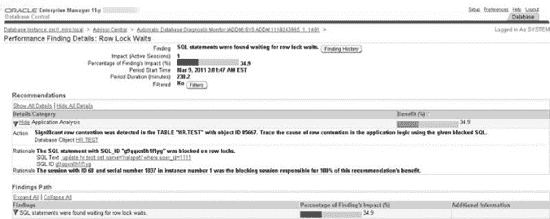

    **图 5-1.** `OEM` 中的行锁等待页面

*   你也可以通过点击主页中的“性能”选项卡来查看阻塞会话详情。点击“其他监控链接”部分下的 `Blocking Sessions` 转到 `Blocking Sessions` 页面。`Blocking Sessions` 页面包含阻塞会话以及被阻塞会话的详细信息。你可以看到确切的等待事件，当一个会话阻塞另一个时，该事件将是 `enq: TX row lock contention`。通过点击此页面上的 `SQL ID` 链接，你可以找出涉及阻塞会话的确切 `SQL` 语句。你可以通过点击页面左上角的 `Kill Session` 按钮从此页面终止阻塞会话。
*   在“其他监控链接”部分中还有另一个名为 `Instance Locks` 的链接，它会带你转到 `Instance Locks` 页面。`Instance Locks` 页面显示阻塞和被阻塞会话的会话详细信息。你可以点击 `SQL ID` 链接来查看阻塞者和被阻塞会话当前正在执行的 `SQL`。你还可以找出被锁定对象的名称。你可以通过点击 `Kill Session` 按钮来终止阻塞会话。


#### 工作原理

你不一定需要执行多个 SQL 脚本来分析数据库中的锁行为。我们之前在各种案例中展示的 SQL 代码是为了解释 Oracle 锁机制如何工作。在日常工作中，直接使用 **Oracle 企业管理器**（OEM）来快速找出谁在阻塞会话以及原因，通常更为实用和高效。

### 5-22. 使用 Oracle 企业管理器分析等待事件

#### 问题

你希望使用 Oracle 企业管理器来管理数据库实例中的等待事件。

#### 解决方案

OEM 界面让你能够快速分析数据库中的当前等待事件，而无需运行 SQL 脚本。在主页中，“活动会话”图显示了等待、I/O 和 CPU 的相对比例。点击此图中的“等待”链接，可以查看“活动会话”图。在图形右侧，你会看到诸如“并发”、“应用程序”、“集群”、“管理”、“用户 I/O”等链接。点击这些链接中的每一个，都将带你进入一个页面，显示所有正在等待该等待类别下事件的活动会话。我们在此总结了这些最重要的等待类别下的等待事件。

> `用户 I/O`：这显示诸如 `db file scattered read`、`db file sequential read`、`direct path read`、`direct path write` 和 `read by other session` 等等待事件。你可以点击各种等待的链接以获取等待事件的图表。例如，点击“db file scattered read”链接将带你进入“等待事件：db file scattered read”页面的直方图。
> 
> `系统 I/O`：这显示由于 `db file parallel write`、`log file parallel write`、`control file parallel write` 和 `control file sequential read` 等事件导致的等待。
> 
> `应用程序`：这显示正在等待诸如队列锁等事件的活动会话。

#### 工作原理

一旦你理解了 Oracle 等待接口背后的理论，就可以使用 OEM 快速分析数据库中的当前等待事件。你不仅能找出哪些等待事件正在对性能产生不利影响，还能找出涉及哪些 SQL 语句和用户。你可以从“活动会话”页面深入钻取的所有详情页，都显示了自实例启动以来特定等待事件类别的图表。这些页面还包含名为“Top SQL”和“Top Users”的表，它们精确地显示了哪些 SQL 和用户受到了等待事件的影响。

## 第 6 章 分析操作系统性能

解决数据库性能问题有时需要使用操作系统（OS）实用程序。这些工具通常能提供有助于隔离数据库性能问题的信息。考虑以下情况：

*   你在一台服务器上运行多个数据库和多个应用程序，并希望使用操作系统实用程序来确定哪个数据库（及相应的进程）消耗了最多的操作系统资源。当一个数据库应用程序消耗资源到导致该服务器上其他数据库性能变差时，这种方法非常有价值。
*   你需要验证数据库服务器在 CPU、内存、磁盘 I/O 和网络带宽方面是否足以应对当前的应用程序工作负载。
*   需要进行分析以确定服务器在何时将无法处理更大（未来）的工作负载。
*   你已经使用数据库工具识别了系统瓶颈，并希望通过操作系统工具再次检查分析结果。

在这些场景中，为了有效地进行分析、调优和故障排除，你将需要采用操作系统工具来识别资源密集型进程。此外，如果你的服务器上运行着多个数据库和应用程序，在排查性能问题时，通常更有效的方法是首先确定哪个数据库和进程消耗了最多的资源。操作系统实用程序有助于精确定位瓶颈是 CPU、内存、磁盘 I/O 还是网络问题。在 Linux/Unix 环境中，一旦获得了操作系统标识符，你就可以查询数据库以显示任何相应的数据库进程和 SQL 语句。

看一下图 6-1。该流程图详细描述了 DBA 在诊断服务器性能缓慢时所遵循的决策过程以及相关的 Linux/Unix 操作系统工具。例如，当你遇到性能问题时，一个常见的初步任务是登录到服务器，并使用 `df` 和 `du` 等操作系统实用程序快速检查磁盘空间问题。挂载点已满是导致数据库不可用的常见原因。

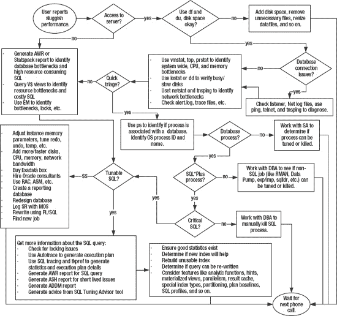

`图 6-1. 排查性能低下问题`

检查完磁盘空间问题后，下一个任务是使用 `vmstat`、`top` 或 `ps` 等操作系统实用程序来确定你遇到了哪种类型的瓶颈。例如，性能缓慢是否与磁盘 I/O、CPU、内存或网络问题有关？确定瓶颈类型后，下一步是确定是否是数据库进程导致了瓶颈。

`ps` 命令对于显示消耗资源会话的进程名称和 ID 非常有用。当你在一台服务器上运行多个数据库时，你可以从进程名称确定该进程与哪个数据库相关联。一旦你有了进程 ID 和关联的数据库，就可以登录到数据库并运行 SQL 查询，以确定该进程是否与某个 SQL 查询相关。如果问题是与 SQL 相关的，那么你可以进一步确定有关该 SQL 查询的详细信息以及可能在哪里进行调优。

图 6-1 总结了排查性能问题的复杂性。准确找出性能问题的原因并推荐有效的解决方案，往往说起来容易做起来难。在尝试解决问题时，有些路径会导致相对高效且成本低廉的解决方案，例如终止失控的操作系统进程或重新生成最新的统计信息。而其他决策可能会让你得出结论，需要增加昂贵的硬件或重新设计系统。你的性能调优结论可能对公司产生长期的财务影响，从而影响你保住工作的能力。显然，你希望专注于性能问题的根本原因，而不仅仅是处理症状。如果你能持续识别性能问题的根本原因并推荐有效且廉价的解决方案，这将极大地改善你的就业机会。

本章的重点是提供详细的示例，展示如何使用 Linux/Unix 操作系统实用程序来识别服务器性能问题。这些实用程序对于提供数据库内部工具之外的诊断信息非常宝贵。操作系统实用程序就像是额外的一双眼睛，帮助精准定位数据库性能低下的原因。

### 6-1. 检测磁盘空间问题

#### 问题

用户报告说无法连接到数据库。你登录到数据库服务器，尝试连接 SQL*Plus，收到此错误：

```
ORA-09817: Write to audit file failed.
Linux Error: 28: No space left on device
Additional information: 12
```

你希望快速确定是否是某个挂载点已满，以及该挂载点内最大的文件位于何处。


### 磁盘空间问题解决方案

在 Linux/Unix 环境中，使用 `df` 命令来识别磁盘空间问题。此示例使用 `-h` 选项来格式化输出，以便以兆字节或千兆字节报告空间使用情况：
```
$ df -h
```

以下是一些示例输出：
```
Filesystem            Size  Used Avail Use% Mounted on
/dev/mapper/VolGroup00-LogVol00
                       29G   28G     0 100% /
/dev/sda1              99M   19M   75M  20% /boot
```

以上输出表明，此服务器上的根 (`/`) 文件系统已满。在这种情况下，一旦识别出已满的挂载点，就可以使用 `find` 命令来定位目录结构中的最大文件。此示例导航到 `ORACLE_HOME` 目录，然后连接 `find`、`ls`、`sort` 和 `head` 命令来识别该目录下最大的文件：
```
$ cd $ORACLE_HOME
$ find . -ls | sort -nrk7 | head -10
```

如果您有一个已满的挂载点，还应考虑查找以下类型的可以移动或删除的文件：

*   删除数据库跟踪文件
*   删除大型 Oracle Net 日志文件
*   移动、压缩或删除旧的归档重做日志文件
*   删除旧的安装文件或二进制文件
*   如果数据文件有大量可用空间，请考虑将其调整为更小的大小

另一种识别磁盘空间使用情况的方法是查找给定目录下占用空间最大的目录。此示例结合使用 `du`、`sort` 和 `head` 命令来显示当前工作目录下最大的十个目录：
```
$ du -S . | sort -nr | head -10
```

前面的命令对于识别可能没有大文件但有很多占用空间的小文件（如跟踪文件）的目录特别有用。

 **注意** 在 Solaris Unix 系统上，前面的命令需要使用带 `-o` 选项的 `du`。

### 工作原理

当数据库因磁盘空间很少或没有剩余空间而挂起时，您应该快速找到可以安全删除而不影响数据库可用性的文件。在 Linux/Unix 服务器上，`df`、`find` 和 `du` 命令特别有用。

处理生产数据库服务器时，强烈建议主动监控磁盘空间，以便在挂载点即将满时收到警告。下面列出了一个简单的 shell 脚本，用于监控给定挂载点的磁盘空间：
```
#!/bin/bash
mntlist="/orahome /oraredo1 /oraarch1 /ora01 /oradump01 /"
for ml in $mntlist
do
echo $ml
usedSpc=$(df -h $ml | awk '{print $5}' | grep -v capacity | cut -d "%" -f1 -)
BOX=$(uname -a | awk '{print $2}')
#
case $usedSpc in
[0-9])
arcStat="relax, lots of disk space: $usedSpc"
;;
[1-7][0-9])
arcStat="disk space okay: $usedSpc"
;;
[8][0-9])
arcStat="space getting low: $usedSpc"
;;
[9][0-9])
arcStat="warning, running out of space: $usedSpc"
echo $arcStat $ml | mailx -s "space on: $BOX" dkuhn@oracle.com
;;
[1][0][0])
arcStat="update resume, no space left: $usedSpc"
echo $arcStat $ml | mailx -s "space on: $BOX" dkuhn@oracle.com
;;
*)
arcStat="huh?: $usedSpc"
esac
#
BOX=$(uname -a | awk '{print $2}')
echo $arcStat
#
done
#
exit 0
```

您必须修改脚本以匹配您的环境。例如，脚本的第二行指定了被监控机器上的挂载点：
```
mntlist="/orahome /oraredo1 /oraarch1 /ora01 /oradump01 /"
```

这些挂载点应与 `df -h` 命令输出中列出的挂载点匹配。对于运行此脚本的 Solaris 机器，以下是 `df` 的输出：
```
Filesystem             size   used  avail capacity  Mounted on
/                      35G   5.9G    30G    17%    /
/ora01                 230G   185G    45G    81%    /ora01
/oraarch1              100G    12G    88G    13%    /oraarch1
/oradump01             300G    56G   244G    19%    /oradump01
/orahome                20G    15G   5.4G    73%    /orahome
/oraredo1               30G   4.9G    25G    17%    /oraredo1
```

另外，根据您使用的 Linux/Unix 版本，您还必须修改这一行：
```
usedSpc=$(df -h $ml | awk '{print $5}' | grep -v capacity | cut -d "%" -f1 -)
```

前面的代码行依赖于 `df` 命令的输出，该输出可能因操作系统供应商和版本而有所不同。例如，在一个 Linux 系统上，`df` 的输出可能跨越两行并报告 `Use%` 而不是 `capacity`，因此在此场景下，`usedSpc` 变量的填充方式如下所示：
```
usedSpc=$(for x in `df -h $ml | grep -v "Use%"` ; do echo $x ; done | \
grep "%" |  cut -d "%" -f1 -)
```

前面的代码（为了适应页面而分成两行）运行几个 Linux/Unix 命令并将输出放入 `usedSpc` 变量。该命令首先运行 `df -h`，然后通过管道传递给 `awk` 命令。`awk` 命令获取输出并打印第五列。然后通过管道传递给 `grep` 命令，该命令使用 `-v` 从输出中排除单词 `Use%`。最后通过管道传递给 `cut` 命令，该命令从输出中切出“%”字符。

在 Linux/Unix 系统上，像前面这样的 shell 脚本可以很容易地从 `cron` 等调度工具运行。例如，如果 shell 脚本名为 `filesp.bsh`，则是一个示例 `cron` 条目：
```
#-----------------------------------------------------------------
# Filesystem check
7 * * * * /orahome/oracle/bin/filesp.bsh 1>/orahome/oracle/bin/log/filesp.log 2>&1
#-----------------------------------------------------------------
```

前面的条目指示系统在每天每小时的第七分钟运行 `filesp.bsh` shell 脚本。

### 6-2. 识别系统瓶颈 (vmstat)

#### 问题

您想确定服务器性能问题是否特别与磁盘 I/O、CPU、内存或网络相关。

 **注意** 如果您在 Solaris 下运行，请参阅 Recipe 6-3 以获取适用于该操作系统的特定解决方案。

#### 解决方案

使用 `vmstat` 来确定系统资源在何处受到限制。例如，以下命令在 Linux 系统上每五秒报告一次系统资源使用情况：
```
$ vmstat 5
```

以下是一些示例输出：
```
procs -----------memory---------- ---swap-- -----io---- --system-- -----cpu------
 r  b   swpd   free   buff  cache   si   so    bi    bo   in   cs us sy id wa st
2  0 228816 2036164  78604 3163452   0    0     1   16    0    0 29  0 70  0  0
 2  0 228816 2035792  78612 3163456   0    0     0   59  398  528 50  1 49  0  0
 2  0 228816 2035172  78620 3163448   0    0     0   39  437  561 50  1 49  0  0
```

要在此模式下退出 `vmstat`，请按 Ctrl+C。您也可以让 `vmstat` 报告特定的运行次数。例如，这指示 `vmstat` 每六秒运行一次，总共报告十次：
```
$ vmstat 6 10
```

以下是解释 `vmstat` 输出时可以使用的一些通用启发式方法：

*   如果 `wa`（等待 I/O 的时间）列很高，这通常表明存储子系统过载。有关识别 I/O 争用源，请参阅 Recipe 6-6。
*   如果 `b`（正在睡眠的进程）持续大于 0，则您可能没有足够的 CPU 处理能力。有关识别消耗最多 CPU 的 Oracle 进程和 SQL 语句，请参阅 Recipe 6-5 和 6-9。
*   如果 `so`（换出到磁盘的内存）和 `si`（从磁盘换入的内存）持续大于 0，您可能存在内存瓶颈。有关识别消耗最多内存的 Oracle 进程和 SQL 语句的详细信息，请参阅 Recipe 6-5。


#### 工作原理

`vmstat`（虚拟内存统计）工具有助于快速识别服务器上的瓶颈。使用`vmstat`的输出可以帮助确定性能瓶颈是否与 CPU、内存或磁盘 I/O 相关。表 6-1 描述了`vmstat`输出中可用的列。这些列可能因您的操作系统和版本而有所不同。

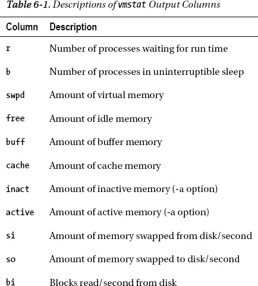

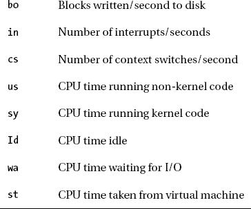

`OS WATCHER`

Oracle 提供了一套收集操作系统指标的脚本，用于收集 CPU、内存、磁盘 I/O 和网络使用情况的指标。OS Watcher 工具套件自动化了使用`top`、`vmstat`、`iostat`、`mpstat`、`netstat`等工具收集统计信息的过程。

您可以从 My Oracle Support 网站 (support.oracle.com) 获取 OS Watcher。导航到支持网站并搜索 OS Watcher。OS Watcher 用户指南可在文档 ID`301137.1`下找到。此工具在大多数 Linux/Unix 系统上受支持，也有适用于 Windows 平台的版本。

### 6-3. 识别系统瓶颈 (Solaris)

#### 问题

您正在一个 Solaris 系统上工作，愤怒的用户报告数据库应用程序运行缓慢。此机器上运行着多个数据库，您希望识别哪些进程消耗了最多的 CPU 资源。一旦在操作系统层面识别出消耗资源的进程，您希望将它们（如果可能的话）映射到数据库进程。

 **注意** 如果您没有运行 Solaris，请参阅解决方案 6-2。

#### 解决方案

在大多数 Solaris 系统上，使用`prstat`实用程序来识别哪些进程消耗了最多的 CPU 资源。例如，您可以指示`prstat`每五秒报告一次系统统计信息：

```
$ prstat 5
```

以下是一些示例输出：

```
   PID USERNAME  SIZE   RSS STATE  PRI NICE      TIME  CPU PROCESS/NLWP
 16609 oracle   2364M 1443M cpu2    60    0   3:14:45  20% oracle/11
 27565 oracle   2367M 1590M cpu3    21    0   0:11:28  16% oracle/14
 23632 oracle   2284M 1506M run     46    2   0:16:18 6.1% oracle/11
  4066 oracle   2270M 1492M sleep   59    0   0:02:52 1.7% oracle/35
 15630 oracle   2274M 1482M sleep   48    0  19:40:41 1.2% oracle/11
```

输入`q`或按 Ctrl+C 退出`prstat`。在上面的输出中，进程 16609 始终显示为顶级 CPU 消耗进程。

识别出顶级资源消耗进程后，您可以使用`ps`命令确定该进程关联的数据库。此示例报告与 PID 16609 关联的进程信息：

```
$ ps -ef | grep 16609
  oracle 16609  3021  18   Mar 09 ?         196:29 ora_dw00_ENGDEV
```

在此示例中，进程名称是`ora_dw00_ENGDEV`，关联的数据库是`ENGDEV`。

#### 工作原理

如果您在 Solaris 服务器上工作，通常没有安装`top`实用程序。在这些环境中，可以使用`prstat`命令来确定系统上资源消耗最高的进程。表 6-2 描述了`prstat`默认输出中显示的几列。

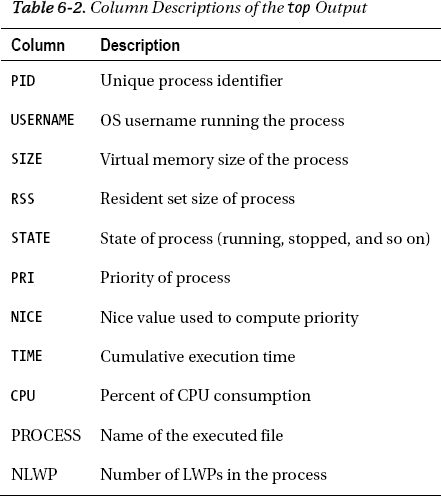

### 6-4. 识别顶级服务器资源消耗者 (top)

#### 问题

您有一台托管多个数据库的 Linux 服务器。用户报告使用其中一个数据库的应用程序响应迟缓。您希望识别哪些进程在服务器上消耗了最多的资源，然后确定顶级消耗进程是否与数据库关联。

#### 解决方案

`top`命令实时显示服务器上资源消耗最高的进程。运行`top`的最简单方法如下：

```
$ top
```

以下是输出片段：

```
top - 04:40:05 up 353 days, 15:16,  3 users,  load average: 2.84, 2.34, 2.45
Tasks: 454 total,   4 running, 450 sleeping,   0 stopped,   0 zombie
Cpu(s): 64.3%us,  3.4%sy,  0.0%ni, 20.6%id, 11.8%wa,  0.0%hi,  0.0%si,  0.0%st
Mem:   7645184k total,  6382956k used,  1262228k free,   176480k buffers
Swap:  4128760k total,      184k used,  4128576k free,  3953512k cached

  PID USER      PR  NI  VIRT  RES  SHR S %CPU %MEM    TIME+  COMMAND
19888 oracle    25   0  148m  13m  11m R 100.1  0.2 313371:45 oracle
19853 oracle    25   0  148m  13m  11m R 99.8  0.2 313375:41 oracle
 9722 oracle    18   0 1095m 287m 150m R 58.6  3.8   0:41.89 oracle
  445 root      11  -5     0    0    0 S  0.3  0.0   8:32.67 kjournald
 9667 oracle    15   0  954m  55m  50m S  0.3  0.7   0:01.03 oracle
    2 root      RT  -5     0    0    0 S  0.0  0.0   2:17.99 migration/0
```

输入`q`或按 Ctrl+C 退出`top`。在上面的输出中，第一部分显示了通用系统信息，例如服务器运行了多长时间、用户数、CPU 信息等。第二部分显示了哪些进程消耗了最多的 CPU 资源（从上到下排列）。在上面的输出中，进程 ID 19888 消耗了大量 CPU。要确定此进程关联的数据库，请使用`ps`命令：

```
$ ps 19888
```

相关输出如下：

```
PID TTY      STAT   TIME COMMAND
19888 ?        Rs   313393:32 oracleO11R2 (DESCRIPTION=(LOCAL=YES)
```

在上面的输出中，第四列显示了`oracleO11R2`的值。这表明这是一个与`O11R2`数据库关联的 Oracle 进程。如果该进程持续消耗资源，您可以进一步确定是否有关联的 SQL 语句（参见解决方案 6-9）或终止该进程（参见解决方案 6-10）。

 **提示** 如果您在 Solaris 操作系统环境中工作，请使用`prstat`命令查看顶级 CPU 消耗进程（详情参见解决方案 6-3）。

#### 工作原理

如果已安装，`top`实用程序通常是 DBA 和系统管理员用来识别服务器上资源密集型进程的第一个调查工具。如果某个进程持续消耗过多的系统资源，那么您应该进一步确定该进程是否与数据库以及特定的 SQL 语句相关联。

默认情况下，`top`会重复刷新（每隔几秒）有关 CPU 最密集型进程的信息。在`top`运行时，您可以交互式地更改其输出。例如，如果您输入 `>`，这将使`top`排序的列向右移动一个位置。表 6-3 列出了最有用的热键功能，用于将`top`显示更改为您需要的格式。

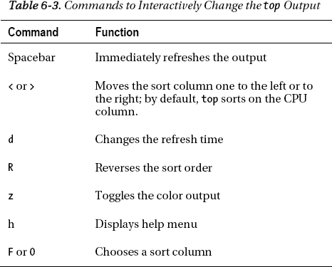

表 6-4 描述了`top`显示的几列。使用这些描述来帮助解释输出。

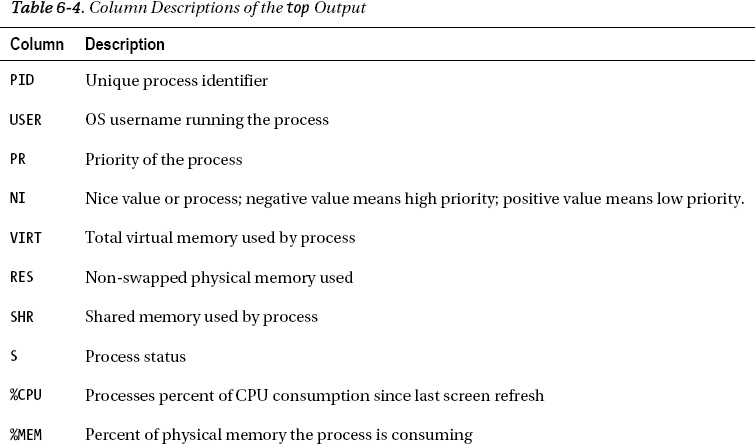

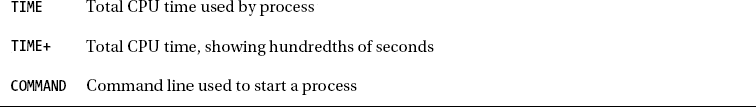

### 6-5. 识别 CPU 和内存瓶颈 (ps)

#### 问题

您希望快速隔离服务器上哪些进程消耗了最多的 CPU 和内存资源。

#### 解决方案

`ps`（进程状态）命令对于快速识别顶级资源消耗进程非常方便。例如，此命令显示本机上消耗最多的十个 CPU 资源：

```
$ ps -e -o pcpu,pid,user,tty,args | sort -n -k 1 -r | head
```

以下是部分输出：

```
97.8 26902 oracle   ?        oracleO11R2 (DESCRIPTION=(LOCAL=YES)(ADDRESS=(PROTOCOL=beq)))
 0.5 27166 oracle   ?        ora_diag_O11R2
0.0     9 root      ?        [ksoftirqd/2]
```

在上面的输出中，名为`oracleO11R2`的进程在服务器上消耗了异常多的 CPU 资源。进程名称表明这是一个与`O11R2`数据库关联的 Oracle 进程。

类似地，您也可以显示顶级内存消耗进程：

```
$ ps -e -o pmem,pid,user,tty,args | sort -n -k 1 -r | head
```


