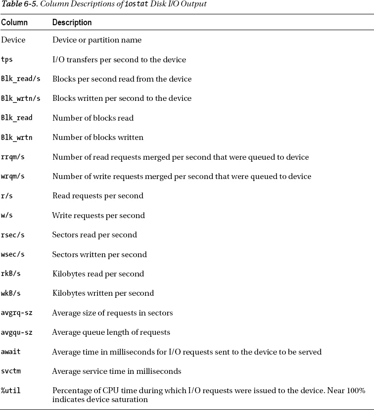

# 工作原理

Linux/Unix 的 `ps` 命令用于显示服务器上当前活动进程的信息。`pcpu` 开关指示进程状态命令报告每个进程的 CPU 使用率。类似地，`pmem` 开关指示 `ps` 报告进程内存使用情况。这为你提供了一种快速简便的方法来确定哪些进程消耗了最多的资源。

当在一行中使用多个命令时（如 `ps`、`sort` 和 `head`），通常希望将命令组合与一个快捷方式（别名）关联起来。以下是创建别名的示例：

```bash
$ alias topc='ps -e -o pcpu,pid,user,tty,args | sort -n -k 1 -r | head'
$ alias topm='ps -e -o pmem,pid,user,tty,args | sort -n -k 1 -r | head'
```

现在，你可以使用别名代替输入长长的命令行——例如：

```bash
$ topc
```

另外，考虑在启动文件（如 `.bashrc` 或 `.profile`）中建立这些别名，这样当你登录到数据库服务器时，命令会自动定义。

### 6-6. 识别 I/O 瓶颈

### 问题

你正遇到性能问题，并希望确定问题是否与缓慢的磁盘 I/O 相关。

### 解决方案

使用带有 `-x`（扩展）选项的 `iostat` 命令，结合 `-d`（设备）选项来生成 I/O 统计信息。下一个示例每十秒显示一次扩展的设备统计信息：

```bash
$ iostat –xd 10
```

你需要一个相当宽的屏幕来查看此输出；以下是部分列表：

```
Device:    rrqm/s wrqm/s   r/s   w/s  rsec/s  wsec/s    rkB/s    wkB/s avgrq-sz
avgqu-sz   await  svctm  %util
sda          0.01   3.31  0.11  0.31    5.32   28.97     2.66    14.49    83.13
0.06  138.44   1.89   0.08
```

这种周期性的扩展输出允许你实时查看哪些设备出现了读写活动的激增。要退出前面的 `iostat` 命令，请按 `Ctrl+C`。选项和输出可能因你的操作系统而异。例如，在一些 Linux/Unix 发行版上，`iostat` 输出可能将磁盘利用率报告为 `%b`（繁忙百分比）。

在尝试确定设备 I/O 是否是瓶颈时，检查 `iostat` 输出时有一些通用准则：

*   查找每秒读取或写入块数异常高的设备。
*   如果任何设备的利用率接近 100%，这强烈表明 I/O 是瓶颈。

### 工作原理

`iostat` 命令可以帮助你确定磁盘 I/O 是否可能是性能问题的根源。表 6-5 描述了 `iostat` 输出中显示的列。



你还可以指示 `iostat` 按指定的时间间隔显示报告。显示的第一份报告将报告自上次服务器重启以来的平均值；每份后续报告显示自上一次生成快照以来的统计信息。以下示例每三秒显示一次设备统计报告：

```bash
$ iostat -d 3
```

你还可以指定要生成的有限数量的报告。这对于收集一段时间内要分析的指标很有用。此示例指示 `iostat` 每 2 秒报告一次，总共报告 15 次：

```bash
$ iostat 2 15
```

在处理本地连接的磁盘时，`iostat` 命令的输出将清楚地显示 I/O 发生的位置。然而，在使用外部阵列进行存储的环境中，情况就不那么明确了。你在文件系统层看到的是某种虚拟磁盘，它可能也由卷管理器配置。在虚拟化存储环境中，你必须与你的系统管理员或存储管理员合作，以确定到底是哪些磁盘正经历高 I/O 活动。

一旦确定了你存在磁盘 I/O 争用问题，你就可以使用诸如 AWR（如果已许可）、Statspack（无需许可）或 `V$` 视图等实用程序来确定你的数据库是否承受 I/O 压力。例如，AWR 报告包含一个 I/O 统计部分，其中包含以下小节：

*   按功能统计的 IOStat 摘要
*   按文件类型统计的 IOStat 摘要
*   按功能/文件类型统计的 IOStat 摘要
*   表空间 I/O 统计
*   文件 I/O 统计

你还可以直接查询数据字典视图，如 `V$SQL`，以确定哪些 SQL 语句使用了过多的 I/O——例如：

```sql
SELECT *
FROM
(SELECT
  parsing_schema_name
 ,direct_writes
 ,SUBSTR(sql_text,1,75)
 ,disk_reads
FROM v$sql
ORDER BY disk_reads DESC)
WHERE rownum < 20;
```

要确定哪些会话当前正在等待 I/O 资源，请查询 `V$SESSION`：

```sql
SELECT
  username
,program
,machine
,sql_id
FROM v$session
WHERE event LIKE 'db file%read';
```

要查看正在等待 I/O 资源的对象，请运行如下查询：

```sql
SELECT
  object_name
,object_type
,owner
FROM v$session   a
    ,dba_objects b
WHERE a.event LIKE 'db file%read'
AND   b.data_object_id = a.row_wait_obj#;
```

一旦你确定了查询（使用本部分前面的查询），那么请考虑以下因素，这些因素可能导致 SQL 语句消耗过多的 I/O：

*   编写糟糕的 SQL
*   不当的索引
*   并行性的不当使用（这可能导致过多的全表扫描）

你必须检查每个查询，并尝试确定是否是上述某一项导致了与 I/O 相关的性能不佳。

### 6-7. 识别网络密集型进程

### 问题

你正在调查数据库服务器上的性能问题。作为调查的一部分，你希望确定系统上是否存在网络瓶颈。

### 解决方案

使用 `netstat`（网络统计）命令显示网络流量。也许查看 `iostat` 输出最有用的方式是使用 `-ptc` 选项。这些选项显示进程 ID 和 TCP 连接，并持续更新输出：

```bash
$ netstat -ptc
```

按 Ctrl+C 退出前面的命令。以下是输出的部分列表：

```
(并非所有进程都能被识别，非属主进程的信息
 将不会显示，你需要 root 权限才能看到全部信息。)
Active Internet connections (w/o servers)
Proto Recv-Q Send-Q Local Address  Foreign Address  State       PID/Program name
tcp        0      0 rmug.com:62386 rmug.com:1521    ESTABLISHED 22864/ora_pmon_RMDB
tcp        0      0 rmug.com:53930 rmug.com:1521    ESTABLISHED 6091/sqlplus
tcp        0      0 rmug.com:1521  rmug.com:53930   ESTABLISHED 6093/oracleRMDB1
tcp        0      0 rmug.com:1521  rmug.com:62386   ESTABLISHED 10718/tnslsnr
```

如果 `Send-Q`（未被远程主机确认的字节数）列对于某个进程的值异常高，这可能表明网络过载。前述输出的有用之处在于，你可以确定与网络连接关联的操作系统进程 ID（PID）。如果你怀疑有问题的连接是一个 `oracle` 会话，可以使用“6-9 解决方案”部分中描述的技术将操作系统 PID 映射到 Oracle 进程或 SQL 语句。

### 工作原理

当遇到性能问题时，网络通常不是原因。你更有可能发现性能不佳与编写糟糕的 SQL 语句、不足的磁盘 I/O 或不够的 CPU 或内存资源有关。然而，作为 DBA，你需要了解所有性能瓶颈的来源以及如何诊断它们。在当今高度互联的世界中，你必须掌握网络故障排除和监控技能。`netstat` 实用程序是监控服务器网络连接的一个良好起点。

### 6-8. 排查数据库网络连接问题

### 问题

一位用户报告说他/她无法连接到数据库。你知道网络连接涉及许多组件，并希望找出问题的根本原因。


## 解决方案

当诊断 Oracle 数据库网络连接问题时，请遵循以下步骤作为指导：

1.  使用操作系统的 `ping` 工具来确定远程主机是否可访问——例如：
    ```
    $ ping dwdb
    dwdb is alive
    ```
    如果 `ping` 不起作用，请联系您的系统或网络管理员，确保已建立服务器到服务器的连接。
2.  使用 `telnet` 查看您是否可以连接到远程服务器和端口（即监听器正在监听的端口）——例如：
    ```
    $ telnet ora03 1521
    Trying 127.0.0.1...
    Connected to ora03.
    Escape character is '^]'.
    ```
    上述输出表明到服务器和端口的连接正常。如果上述命令挂起，请联系您的系统管理员或网络管理员以获取进一步协助。
3.  使用 `tnsping` 来确定 Oracle Net 是否正常工作。该工具将验证是否可以通过网络建立到数据库的 Oracle Net 连接——例如：
    ```
    $ tnsping dwrep
    ..........
    Used TNSNAMES adapter to resolve the alias
    Attempting to contact (DESCRIPTION = (ADDRESS = (PROTOCOL = TCP)
    (HOST = dwdb1.us.farm.com)(PORT = 1521))
    (CONNECT_DATA = (SERVER = DEDICATED) (SERVICE_NAME = DWREP)))
    OK (500 msec)
    ```
    如果 `tnsping` 无法联系到远程数据库，请验证远程监听器和数据库是否都已启动并运行。在远程主机上，使用 `lsnrctl status` 命令来验证监听器是否已启动。通过使用非 `SYS` 帐户建立本地连接来验证远程数据库是否可用（`SYS` 帐户通常可以在其他方案无法工作时连接到有问题的数据库）。
4.  验证 `TNS` 信息是否正确。如果远程监听器和数据库工作正常，那么请确保用于确定 `TNS` 信息的机制（如 `tnsnames.ora` 文件）包含正确的信息。
    有时客户端机器可能有多个 `TNS_ADMIN` 位置和 `tnsnames.ora` 文件。验证是否正在使用某个特定 `tnsnames.ora` 文件的一种方法是重命名它，然后在尝试连接到远程数据库时查看是否会出现不同的错误。

## 工作原理

网络连接问题可能难以诊断，因为其正确运行需要多个架构组件就位。您需要确保以下各项到位：

*   功能正常的网络
*   端到端开放的端口
*   正确安装和配置的 Oracle Net
*   目标数据库和监听器已启动并运行
*   从客户端到目标数据库的正确导航信息

如果您仍然遇到问题，请检查客户端的 `sqlnet.log` 文件和远程服务器的 `listener.log` 文件。有时这些日志文件会显示能够定位问题的附加信息。

### 6-9. 将资源密集型进程映射到数据库进程

### 问题

那是一个漆黑风雨交加的夜晚，系统性能糟糕。您在主机上识别出一个操作系统级别的资源密集型进程。您希望将该操作系统进程映射回数据库进程。如果该数据库进程是一个 SQL 进程，您还想显示 SQL 语句的用户及其 SQL 文本。

### 解决方案

在 Linux/Unix 环境中，如果您能识别出资源密集型的操作系统进程，那么您可以轻松检查该进程是否与数据库进程相关联。该过程包括以下步骤：

1.  运行操作系统命令以识别资源密集型进程及关联的 ID。
2.  确定与该进程关联的数据库。
3.  从数据库数据字典视图中提取有关该进程的详细信息。
4.  如果是 SQL 语句，则获取这些详细信息。
5.  为该 SQL 语句生成执行计划。

例如，假设您使用 `ps` 命令识别出消耗 CPU 最多的查询：
```
$ ps -e -o pcpu,pid,user,tty,args|grep -i oracle|sort -n -k 1 -r|head
```
这是一些示例输出：
```
16.4 11026   oracle ?       oracleDWREP (DESCRIPTION=(LOCAL=YES)(ADDRESS=(PROTOCOL=beq)))
 0.1  6448   oracle ?       oracleINVPRD (LOCAL=NO)
 0.5  3639   oracle ?       ora_dia0_STAGE
 0.4 28133   oracle ?       ora_dia0_DEVSEM
 0.4  4093   oracle ?       ora_dia0_DWODI
 0.4  3534   oracle ?       ora_dia0_ENGDEV
 0.2  4111   oracle ?       ora_mmnl_DWODI
```
上述输出识别出一个操作系统进程消耗了过多的 CPU（16.4%）。进程 ID 是 11026，名称是 `oracleDWREP`。从进程名称看，这是与 `DWREP` 数据库关联的一个 Oracle 进程。

您可以通过查询数据字典来确定这是哪种类型的 Oracle 进程：
```sql
SELECT
  'USERNAME   : ' || s.username     || CHR(10) ||
  'SCHEMA     : ' || s.schemaname   || CHR(10) ||
  'OSUSER     : ' || s.osuser       || CHR(10) ||
  'PROGRAM    : ' || s.program      || CHR(10) ||
  'SPID       : ' || p.spid         || CHR(10) ||
  'SID        : ' || s.sid          || CHR(10) ||
  'SERIAL#    : ' || s.serial#      || CHR(10) ||
  'KILL STRING: ' || '''' || s.sid || ',' || s.serial# || ''''  || CHR(10) ||
  'MACHINE    : ' || s.machine      || CHR(10) ||
  'TYPE       : ' || s.type         || CHR(10) ||
  'TERMINAL   : ' || s.terminal     || CHR(10) ||
  'SQL ID     : ' || q.sql_id       || CHR(10) ||
  'SQL TEXT   : ' || q.sql_text
FROM v$session s
    ,v$process p
    ,v$sql     q
WHERE s.paddr  = p.addr
AND   p.spid   = '&&PID_FROM_OS'
AND   s.sql_id = q.sql_id(+);
```
上述脚本会提示您输入操作系统进程 ID。这是本示例的输出：
```
USERNAME   : MV_MAINT
SCHEMA     : MV_MAINT
OSUSER     : oracle
PROGRAM    : sqlplus@dwdb (TNS V1-V3)
SPID       : 11026
SID        : 410
SERIAL#    : 30653
KILL STRING: '410,30653'
MACHINE    : dwdb
TYPE       : USER
TERMINAL   : pts/2
SQL ID     : by3c8848gyngu
SQL TEXT   : SELECT "A1"."REGISTRATION_ID","A1"."PRODUCT_INSTANCE_ID"
,"A1"."SOA_ID","A1"."REG_SOURCE_IP_ADDR","A1"...
```
输出表明这是一个 SQL*Plus 进程，其数据库 `SID` 为 410，`SERIAL#` 为 30653。如果您决定使用 `ALTER SYSTEM KILL SESSION` 语句终止该进程（详情请参阅配方 6-10），您将需要这些信息。

在此示例中，由于该进程正在运行 SQL 语句，可以通过生成执行计划来提取有关该查询的更多详细信息：
```sql
SQL> SELECT * FROM table(DBMS_XPLAN.DISPLAY_CURSOR(('&&sql_id')));
```
运行上述语句时，系统将提示您输入 `sql_id`（在此示例中，`sql_id` 是 `by3c8848gyngu`）。以下是部分输出列表：


