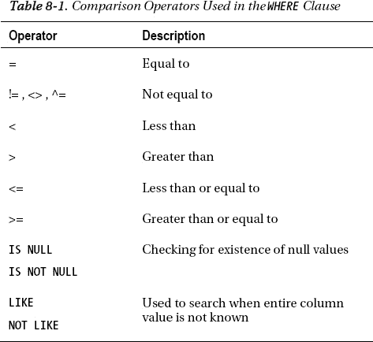

# 第 8 章

## 前 5 个前台事件

“前 5 个定时前台事件”部分显示了在 AWR 报告涵盖的时间段内，导致等待时间最长的事件。

```
`Top 5 Timed Foreground Events`
`~~~~~~~~~~~~~~~~~~~~~~~~~~~~~`
`                                                                        Avg Wait    % DB`
`Event                                              Waits    Time(s)    (ms)      time   Wait Class`
`---------------------------------------------- ------------ ----------- ------ ---------- ----------`
`db file sequential read                          13,735         475     35      23.4      User I/O`
`DB CPU                                                        429                  21.1`
`latch: shared pool                                 801          96    120       4.7  Concurrency`
`db file scattered read                             998          49     49       2.4      User I/O`
`control file sequential read                     9,785          31      3       1.5      System I/O`
```

“前 5 个定时前台事件”部分通常是你发现性能问题的地方，它向你展示了会话“等待”的原因。“前 5 个事件”的信息显示了所有会话的总等待时间，但通常一两个会话是造成大部分等待的原因。务必分别分析总等待次数和平均等待时间（毫秒），以确定等待是否显著。仅仅查看等待事件的总等待次数或总等待时间可能会误导你对重要性的判断。你也必须密切关注事件的平均等待时间。在一个运行良好的数据库中，你应该看到 `CPU` 和 `I/O` 是主要的等待事件，如本例所示。如果来自并发等待类别的事件（如 `latches`）出现在顶部，请进一步调查这些等待。例如，如果你看到诸如 `enq: TX - row lock contention`、`gc_buffer_busy`（RAC）或 `latch free` 等事件，通常表明数据库存在争用。如果你看到 `log file sync` 事件的平均等待时间超过 2 毫秒，请进一步调查该等待事件（第 5 章说明了如何分析各种等待事件）。如果你看到由于 `db file sequential read` 或 `db file scattered read` 等待事件导致的大量等待，这表明存在大量的索引读取（这是正常的）或全表扫描正在进行。你可以在 AWR 报告中找到这些读取事件涉及的 SQL 语句和表。

## 时间模型统计

时间模型统计让你了解数据库如何分配其时间，包括执行 SQL 语句与解析语句所花费的时间。如果解析时间非常高，或者硬解析很显著，你必须进一步调查。

```
`Time Model Statistics                 DB/Inst: ORCL1/orcl1  Snaps: 1878-1879`

`Statistic Name                                           Time (s)  % of DB Time`
`---------------------------------------------- ------------------ ------------`
`sql execute elapsed time                              1,791.5          88.2`
`parse time elapsed                                      700.1          34.5`
`hard parse elapsed time                                 653.7          32.2`
```

## 前 5 个 SQL 语句

AWR 报告的这部分让你能够快速识别出开销最大的 SQL 语句。

```
`SQL ordered by Elapsed Time            DB/Inst: ORCL1/orcl1  Snaps: 1878-1879`
`-> Captured SQL account for   13.7% of Total DB Time (s):           2,032`
`-> Captured PL/SQL account for   19.8% of Total DB Time (s):           2,032`

`        Elapsed                  Elapsed Time`
`        Time (s)    Executions  per Exec (s)  %Total    %CPU     %IO    SQL Id`
`---------------- -------------- ------------- ------ ------ ------ -------------`
`           292.4              1        292.41   14.4    8.1   61.2 b6usrg82hwsas`
`…`
```

你可以使用报告中这部分的 SQL ID 为开销大的 SQL 语句生成执行计划。

## PGA 直方图

`PGA 聚合目标直方图`显示了数据库执行排序和哈希操作的性能——例如：

```
 `PGA Aggr Target Histogram               DB/Inst: ORCL1/orcl1  Snaps: 1878-1879`
`-> Optimal Executions are purely in-memory operations`

 `  Low       High`
`Optimal  Optimal    Total Exe cs  Optimal Exe cs 1-Pass Exe cs M-Pass Exe cs`
`------- ------- -------------- -------------- ------------ ------------`
 `     2K      4K         13,957         13,957            0            0`
 `    64K    128K             86             86            0            0`
 `   128K    256K             30             30            0            0`
```

在此示例中，数据库正在 PGA 内以最优方式执行所有排序和哈希操作。如果你看到大量的单次通过执行，甚至有一些大型的多次通过执行，这表明 PGA 太小，你应该考虑增加其大小。

### 工作原理

分析 AWR 报告应该是你排除数据库性能问题（例如查询运行缓慢）的第一步。AWR 报告让你能够快速发现诸如连接数、每秒事务数、缓存命中率、等待事件信息以及使用最多 CPU 和 I/O 的 SQL 语句等信息。它向你展示了哪些 SQL 语句使用了最多的资源，以及哪些等待事件拖慢了数据库。或许最重要的是，报告告诉你数据库性能在某个特定时间段（白天或夜晚）是否与其通常性能有显著差异。“解决方案”部分总结的 AWR 报告章节只是 AWR 报告的一小部分。以下是排查性能问题时你必须查看的报告中的其他一些关键部分：

*   前台等待事件
*   按缓冲区 Gets 排序的 SQL
*   按读取次数排序的 SQL
*   按物理读取排序的 SQL
*   实例活动统计
*   日志切换
*   队列活动
*   按表空间、数据文件和 SQL 语句的读取
*   按表扫描的段
*   按行锁等待的段
*   Undo 段摘要

根据你正在调查的性能问题的性质，报告中的这些部分中的几个可能会被证明是有用的。除了性能和等待统计信息外，AWR 报告还提供了针对 PGA 和 SGA 的建议。当你排除几乎任何数据库性能问题时，AWR 报告确实是你最好的朋友。通常只需几分钟，你就能找到问题的根本原因并想出潜在的解决方法。AWR 为你完成了大部分工作——你只需要知道该查找什么！


## 创建高效的 SQL

结构化查询语言（SQL）与任何其他编程语言一样，可以编写得好，也可以编写得差，或者介于两者之间。关于如何编写高效的 SQL 语句，已有无数书籍进行了讨论。本章将聚焦于基本的 SQL 编码基础，并介绍一些提升 SQL 语句性能的技术。此外，本章还将重点阐述编写不良的 SQL 所带来的影响，以及在应用程序的 SQL 语句中应避免的一些常见陷阱。

第一次就写出优秀的 SQL 语句，是获得 SQL 查询良好性能的最佳方式。掌握基础知识是实现良好性能目标的关键。本章将重点介绍 SQL 语言的基础：
*   `SELECT` 语句
*   `WHERE` 子句
*   表连接
*   子查询
*   集合运算符

然后，我们将聚焦于提升查询性能的基本技术，同时也有助于确保您的查询不会妨碍数据库中其他查询的性能。重要的是要花时间在第一次就编写出高效的 SQL 语句——这说起来容易，但在平衡客户需求、预算和项目时间表时却难以做到。然而，如果您遵循基本的编码实践和基础知识，就能极大地提升 SQL 查询的性能。

 `注意` 在本章中，我们会多次区分 ISO 语法和传统的 Oracle 语法。具体来说，是在连接语法方面。然而，这种区分的表述稍欠准确。除了 Oracle 使用`(+)`表示外连接之外，Oracle 的所有连接语法都符合 ISO SQL 标准，因此它`全部`是 ISO 语法。不过，业界通常将较新实现的语法称为“ISO 语法”，本章也遵循这一惯例。

### 8-1. 从表中检索所有行

### 问题

您需要编写一个查询，从数据库中的给定表中检索所有行。

### 解决方案

在 SQL 语言中，您使用`SELECT`语句从数据库中检索数据。`SELECT`语句之后的所有内容都告诉 Oracle 您需要从数据库中获取什么数据。您需要确定的第一件事是从哪个（些）表中检索数据。一旦确定了这一点，您就拥有了运行查询以从数据库获取数据所需的一切。如果我们的 Oracle 数据库中有一个`EMPLOYEES`表，我们可以对该表执行`describe`操作以查看其结构。通过这样做，我们可以看到表的列名，并确定要从数据库中选择哪些列。

```
SQL> describe employees
 Name                                      Null?    Type
 ----------------------------------------- -------- ----------------------------
 EMPLOYEE_ID                               NOT NULL NUMBER(6)
 FIRST_NAME                                         VARCHAR2(20)
 LAST_NAME                                 NOT NULL VARCHAR2(25)
 EMAIL                                     NOT NULL VARCHAR2(25)
 PHONE_NUMBER                                       VARCHAR2(20)
 HIRE_DATE                                NOT NULL DATE
 JOB_ID                                   NOT NULL VARCHAR2(10)
 SALARY                                            NUMBER(8,2)
 COMMISSION_PCT                                    NUMBER(2,2)
 MANAGER_ID                                         NUMBER(6)
 DEPARTMENT_ID                                      NUMBER(4)
```

如果我们想从`EMPLOYEES`表中检索所有员工的姓名列表，我们现在就拥有了构建一个针对数据库中`EMPLOYEES`表的简单查询所需的全部信息。我们知道我们是从`EMPLOYEES`表中选择数据，这是`FROM`子句所需的。我们也知道我们想选择员工的姓名，这是满足`SELECT`子句所需的。此时，我们可以向数据库发出以下查询：

```
SELECT last_name, first_name
FROM employees;
```

```
LAST_NAME                 FIRST_NAME
------------------------- --------------------
Abel                      Ellen
Baer                      Hermann
Cabrio                    Anthony
Dilly                     Jennifer
Ernst                     Bruce
```

如果我们想从`EMPLOYEES`表中选择所有列，我们可以在`SELECT`子句中列出表中的每一列，或者我们也可以用星号代替列出每一列，这表示我们想要检索所有列：

```
SELECT *
FROM employees;
```

如果我们希望经理的输出格式是所有员工姓名的逗号分隔列表，我们可以修改查询来完成这个任务：

```
SELECT last_name || ', ' || first_name AS "Employee Name"
FROM employees;
```

```
Employee Name
-----------------------------------------------
Abel, Ellen
Baer, Hermann
Cabrio, Anthony
Dilly, Jennifer
Ernst, Bruce
```

在上述案例中，我们在查询中放置了连接字符（由两个竖线组成），表示我们将多个列的内容组合成一个输出列。同时，我们使用`AS`子句创建了一个列别名，并将组合后的姓和名称为“Employee Name”。

### 工作原理

`SELECT`是从 Oracle 数据库中检索数据所需的最基本语句。尽管`SELECT`语句有许多子句和特性，但从其最基本的形式来看，实际上只需要两个子句就能从 Oracle 数据库中首次检索数据——这些子句就是`SELECT`子句和`FROM`子句。通常，要准确检索所需的结果集需要更多条件。您可能只需要数据库表中的列的子集，并且可能只需要给定表中的行的子集。此外，您可能希望对从数据库中提取的数据执行操作。所有这些都需要比简单的`SELECT`语句更复杂的 SQL 语言组件。然而，`SELECT`和`FROM`子句是构建查询的基本构建块，从最简单的查询到最复杂的查询都是如此。

 `注意` 为了从任何数据库表中选择数据，您需要拥有该表，或者已被授予从指定表集选择数据的权限。

### 8-2. 从表中检索行的子集

### 问题

您希望过滤数据库`SELECT`查询的数据，以仅返回数据库表中行的子集。

### 解决方案

`WHERE`子句赋予用户过滤行并仅从数据库返回所需结果集的能力。构建`WHERE`子句有多种方式，本小节将回顾其中几种。在`WHERE`子句中首先发生的是将一个或多个列的值与另一个值进行比较。可在`WHERE`子句中使用的比较运算符列表请参见表 8-1。其中一种更常见的比较运算符是等号，它表示一个等值条件：

```
SELECT *
FROM EMP
WHERE deptno = 20;
```

在上述查询中，我们从`EMP`表中选择所有列（由星号表示），并且我们只想要部门为 20 的行，这是由`WHERE`子句决定的。




