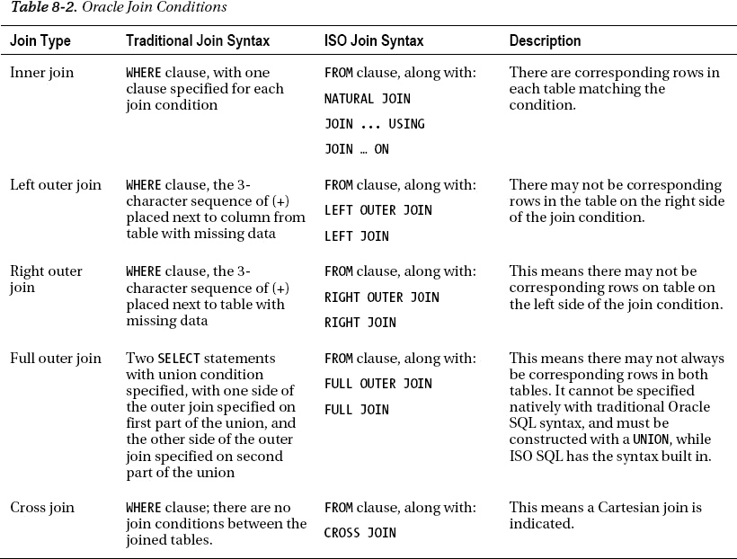

# WHERE 子句中的多个条件

在许多 SQL 语句中，`WHERE`子句可能存在多个条件。编写多个条件需要使用逻辑运算符`OR`、`AND`和`IN`。如果 SQL 语句中有多个逻辑运算符，Oracle 将始终首先计算所有`AND`子句，然后再计算任何`OR`子句。如果同一语句中有多个相同的逻辑运算符，则按从左到右的顺序计算。在构建复杂的`WHERE`条件时，这可能会令人困惑。因此，在`WHERE`子句中编写多个条件时，应使用括号分隔每个子句，否则可能无法得到预期的结果。这是良好的 SQL 编码实践，并使 SQL 代码更易于阅读和维护。例如：

```sql
SELECT last_name, first_name, salary, email
FROM employees
WHERE (department_id = 20
OR department_id = 30)
AND commission_pct > 0;
```

如果我们在语句中需要多个`OR`逻辑运算符，可以用`IN`逻辑运算符替换它们，这可以简化我们的 SQL 语句。通过重写前面的查询以使用`IN`逻辑运算符，我们的查询将如下所示：

```sql
SELECT last_name, first_name, salary, email
FROM employees
WHERE department_id IN (20,30)
AND commission_pct > 0;
```

如果想查找除部门 20 或 30 以外的所有部门的相同信息，SQL 代码如下所示：

```sql
SELECT last_name, first_name, salary, email
FROM employees
WHERE (department_id != 20
AND department_id <> 30)
AND commission_pct > 0;
```

请注意，在上面的示例中，为了演示，我们使用了两种“不等于”比较运算符。通常，良好的编码实践是保持一致性，并在所有 SQL 代码中使用相同的运算符。这可以避免其他需要查看或修改你的 SQL 代码的人产生混淆。即使是这样细微的差异，也可能让别人思考为什么一段 SQL 代码用一种方式完成，而另一段 SQL 代码却用不同的方式完成。编写 SQL 代码时，追求效率很重要，但同样重要的是以可维护性为出发点来编写代码。如果 SQL 代码保持一致，它将更易于阅读和维护。

采用前面的 SQL 语句，我们将再次使用逻辑`OR`运算符，添加`NOT`操作数，并完成相同的任务：

```sql
SELECT last_name, first_name, salary, email
FROM employees
WHERE department_id NOT IN(20,30)
AND commission_pct > 0;
```

最后两个查询都提供了正确的结果，但在这种情况下，使用`IN`子句简化了我们的 SQL 语句。

### 8-3. 连接具有对应行的表

#### 问题

在单个查询中，你希望从多个表中检索匹配的行。这些表至少有一个公共列，用于匹配表之间的数据。

#### 解决方案

SQL 语言中的连接条件用于在单个查询中组合来自多个表的数据。当连接过程中涉及的所有表中都存在对应的行时，这称为“内连接”。这意味着基于表之间的公共连接列，只返回两个表之间匹配的数据。

假设你想获取公司所有部门所在的城市。在编写 SQL 语句之前，有两种不同的方法来处理这个问题。你可以使用传统的 Oracle 语法，也可以使用较新的 ISO 语法。使用传统的 Oracle SQL，语法如下：

```sql
SELECT d.location_id, department_name, city
FROM departments d, locations l
WHERE d.location_id = l.location_id;
```

使用 ISO 语法编写相同的语句，有几种可用的方法：

*   `自然连接（NATURAL JOIN）`
*   `JOIN … USING`子句
*   `JOIN … ON`子句

如果使用`NATURAL JOIN`子句，你是在让 Oracle 确定自然连接条件以及将基于哪些列进行连接，因此语句中没有连接子句或条件：

```sql
SELECT location_id, department_name, city
FROM departments NATURAL JOIN locations;
```

如果要连接的表具有同名的连接列，你可以指定`JOIN ... USING`子句，并在括号中指定这个公共列：

```sql
SELECT location_id, department_name, city
FROM departments JOIN locations
USING (location_id);
```

表之间的连接条件通常需要列名不同才能完成连接条件。在这些情况下，`JOIN ... ON`子句是合适的：

```sql
SELECT d.loc_id, department_name, city
FROM departments d JOIN locations l
ON l.location_id = d.loc_id;
```

#### 工作原理

使用传统的 Oracle SQL 时，需要在`WHERE`子句中指定所有连接条件。因此，`WHERE`子句将包含所有连接条件以及任何过滤条件。

使用 ISO SQL 时，一个关键优势是连接条件在`FROM`子句中完成，而`WHERE`子句仅用于过滤条件。这使得 SQL 语句更易于阅读和解读。你不再需要在`WHERE`子句中区分哪些是连接条件，哪些是过滤条件。当你连接三个或更多表时，这一优势更加明显。过滤条件仅在`WHERE`子句中，一目了然：

```sql
SELECT last_name, first_name, department_name, city,
state_province state, postal_code zip, country_name
FROM employees
JOIN departments USING (department_id)
JOIN locations USING (location_id)
JOIN countries USING (country_id)
JOIN regions USING (region_id)
WHERE department_id = 20;
```

如果你倾向于使用传统的 Oracle SQL 编写 SQL 语句，为了代码的可读性和可维护性，一个好的做法是将所有连接条件放在`WHERE`子句的前面，将所有过滤条件放在`WHERE`子句的末尾。如果能使代码简单对齐，也会使代码更易于阅读和维护。这是一种可选的做法，但有助于任何可能需要查看你 SQL 代码的人：

```sql
SELECT last_name, first_name, department_name, city,
state_province state, postal_code zip, country_name
FROM employees e, departments d, locations l, countries c, regions r
WHERE e.department_id = d.department_id
  AND d.location_id   = l.location_id
  AND l.country_id    = c.country_id
  AND c.region_id     = r.region_id
  AND d.department_id = 20;
```

此外，当使用`JOIN ... ON`或`JOIN ... USING`子句时，指定可选的`INNER`关键字可能更清晰，因为可以立即知道正在执行的是内连接：

```sql
SELECT location_id, department_name, city
FROM departments INNER JOIN locations
USING (location_id);
```

### 8-4. 当可能缺少对应行时连接表

#### 问题

你需要来自两个或多个表的数据，但其中一个或多个表中缺少部分数据。例如，你想获取公司所有部门的列表及其基地位置。无论出于何种原因，你被告知公司中列出的位置并不都对应单个部门，这种情况下，没有列出部门位置。


#### 解决方案

你需要展示所有地点，因此内连接在此情况下无法实现。此时，可以使用所谓的外连接。注意以下示例中的 `(+)` 语法：

```sql
SELECT l.location_id, city, department_id, department_name
FROM locations l, departments d
WHERE l.location_id = d.location_id(+)
ORDER BY 1;
```

```
LOCATION_ID CITY                 DEPARTMENT_ID DEPARTMENT_NAME
----------- -------------------- ------------- -------------------------
       1100 Venice
       1400 Southlake                       60 IT
       1500 South San Francisco             50 Shipping
       1700 Seattle                        170 Manufacturing
       1700 Seattle                        240 Sales
       1700 Seattle                        270 Payroll
       1700 Seattle                        120 Treasury
       1700 Seattle                        110 Accounting
       1700 Seattle                        100 Finance
       1700 Seattle                         30 Purchasing
       1800 Toronto                         20 Marketing
       2000 Beijing
       2400 London                          40 Human Resources
       2700 Munich                          70 Public Relations
       3200 Mexico City
```

要在传统的 Oracle SQL 中指定外连接，只需在 `WHERE` 子句的连接条件中，在你已知有缺失数据的表的列旁边放置一个带括号的加号。从前述案例我们知道，有些地点没有被分配到任何一个部门。从结果中，我们可以看到那些没有分配部门的地点。

要使用 ISO SQL 语法执行相同的查询，你可以使用 `LEFT OUTER JOIN` 或 `RIGHT OUTER JOIN` 子句，它们可以简写为 `LEFT JOIN` 或 `RIGHT JOIN`——例如：

```sql
SELECT location_id, city, department_id, department_name
FROM locations LEFT JOIN departments d
USING (location_id)
ORDER BY 1;
```

现在假设你需要执行一个查询，其中连接的任一侧的任一张表都可能缺失一个或多个对应的行。一种方法是创建两个外连接查询的并集：

```sql
SELECT last_name, first_name, department_name
FROM employees e, departments d
WHERE e.manager_id = d.manager_id(+)
UNION
SELECT last_name, first_name, department_name
FROM employees e, departments d
WHERE e.manager_id(+) = d.manager_id
ORDER BY department_name, last_name, first_name;
```

```
LAST_NAME                 FIRST_NAME           DEPARTMENT_NAME
------------------------- -------------------- -------------------------
Gietz                     William              Accounting
                                                 Administration
                                                 Benefits
Cambrault                 Gerald               Executive
Chen                      John                 Finance
                                                 Government Sales
                                                 Human Resources
Pataballa                 Valli                IT
                                                 Manufacturing
Fay                       Pat                  Marketing
                                                 Payroll
                                                 Public Relations
Tobias                    Sigal                Purchasing
Tucker                    Peter                Sales
                                                 Shareholder Services
Sarchand                  Nandita              Shipping
                                                 Treasury
Lee                       Linda
Morse                     Steve
```

从前面的结果中，我们可以看到所有管理部门的员工、所有不管理部门的员工，以及那些没有指定经理的部门。

要使用 ISO SQL 语法进行相同的查询，请使用 `FULL OUTER JOIN` 子句，它可以简写为 `FULL JOIN`：

```sql
SELECT last_name, first_name, department_name
FROM employees FULL JOIN departments
USING (manager_id);
```

#### 工作原理

根据你的具体情况，实际上可以进行三种外连接。表 8-2 描述了所有可能的连接条件。使用传统语法或 ISO SQL 语法的 SQL 语句都是完全可以接受的。然而，ISO SQL 通常比传统的 Oracle SQL 更容易编写、阅读和维护。

ISO 语法的主要优点之一是，对于多表连接，所有的连接条件都在 `FROM` 子句中指定，因此是隔离的且易于查看。在 Oracle SQL 中，连接条件在 `WHERE` 子句中指定，与查询所需的任何其他过滤条件放在一起。如果你继承了结构不佳的 SQL 代码，那么阅读那些连接条件和过滤条件交织在单个 `WHERE` 子句中的更长、更复杂的 SQL 语句就会更加困难。

另一种尚未提及的连接类型是交叉连接，即笛卡尔连接。虽然这种连接类型很少有用，但偶尔会带来便利。假设你是一名 DBA，正在为企业数据库收集数据库大小信息，并将结果放在一个电子表格中。你需要为每个查询获取数据库和主机信息。你可以执行以下查询：

```sql
SELECT d.name, i.host_name, round(sum(f.bytes)/1048576) megabytes
FROM v$database d
CROSS JOIN v$instance i
CROSS JOIN v$datafile f
GROUP BY d.name, i.host_name;
```

```
NAME      HOST_NAME                       MEGABYTES
--------- ------------------------------ ----------
ORCL      DREGS-PC                             2333
```

在这种情况下，`v$instance` 和 `v$database` 视图只包含一行数据，因此进行笛卡尔连接没有问题。上述连接也可以用传统的 Oracle SQL 来编写：

```sql
SELECT d.name, i.host_name, round(sum(f.bytes)/1048576) megabytes
FROM v$database d, v$instance i, v$datafile f
GROUP BY d.name, i.host_name;
```



### 8-5. 构建简单子查询

#### 问题

你需要从数据库中检索数据，但无法使用单个查询获取所需的数据。

#### 解决方案

关系数据库的数据需求往往很复杂，以至于无法在单个 SQL `SELECT` 语句中检索数据，这是很常见的。与其必须串行运行两个或多个查询，不如构建多个 SQL `SELECT` 语句并将它们放在一个查询中。这些额外的 `SELECT` 语句被称为子查询、子选择或嵌套选择。

假设你想获取公司里薪水最高的员工姓名，以便向你的老板要求加薪。由于你不知道最高薪水是多少，你必须先运行一个查询来确定：

```sql
SELECT MAX(salary) FROM employees;
```

```
MAX(SALARY)
-----------
      24000
```

然后，知道了最高薪水是多少，你可以运行第二个查询来获取拿该薪水的员工：

```sql
SELECT last_name, first_name
FROM employees
WHERE salary = 24000;
```

```
LAST_NAME                 FIRST_NAME
------------------------- --------------------
King                      Steven
```

将前述两个查询组合起来，并构建一个带子查询的单个 SQL 语句来完成相同的任务，是非常简单的：

```sql
SELECT last_name, first_name
FROM employees
WHERE salary =
(SELECT MAX(salary) FROM employees);
```

```
LAST_NAME                 FIRST_NAME
------------------------- --------------------
King                      Steven
```


#### 工作原理

在 SQL 语句中，子查询可以放置在 `SELECT`、`WHERE` 或 `HAVING` 子句中。你也可以将一个查询放在 `FROM` 子句中，这也被称为内联视图，这将在另一个教程中介绍。可以构造几种类型的子查询：

*   单行或标量子查询
*   多行子查询
*   多列子查询
*   相关子查询（将在另一个教程中介绍）

子查询本身也被称为内部查询。除了相关子查询，内部查询首先被执行，然后其结果被传递给外部查询，之后外部查询再被执行。

##### 单行子查询

单行子查询返回单行单列。“解决方案”部分展示的例子就是一个单行子查询。使用时需谨慎，并确保子查询只返回一个值；否则你可能会遇到如下错误：

```sql
SELECT last_name, first_name
FROM employees
WHERE salary =
(SELECT salary FROM employees WHERE department_id = 30);
```

```
(SELECT salary FROM employees WHERE department_id = 30)
 *
ERROR at line 4:
ORA-01427: single-row subquery returns more than one row
```

在上面的例子中，部门 30 有多名员工，因此子查询会返回所有匹配的行。

如果你想了解你的薪水与公司员工平均薪水的对比情况，你可以在 `SELECT` 子句中使用一个子查询来实现：

```sql
SELECT last_name, first_name, salary, ROUND((SELECT AVG(salary) FROM employees)) avg_sal
FROM employees
WHERE last_name = 'King';
```

```
LAST_NAME                 FIRST_NAME               SALARY    AVG_SAL
------------------------- -------------------- ---------- ----------
King                      Steven                    24000       6462
```

假设你想知道哪些部门的总体平均薪资高于公司平均水平。通过将子查询放在 `HAVING` 子句中，你可以获得想要的结果：

```sql
column avg_sal format 99999.99

SELECT department_id, ROUND(avg(salary),2) avg_sal
FROM employees
GROUP BY department_id
HAVING avg(salary) > (SELECT AVG(salary) FROM employees)
ORDER BY 2;
```

```
DEPARTMENT_ID   AVG_SAV
------------- ---------
           40   6500.00
          100   8600.00
           80   8955.88
           20   9500.00
           70  10000.00
          110  10150.00
           90  19333.33

8 rows selected.
```

##### 多行子查询

如果你知道期望的子查询将返回多行，你可以使用 `IN`、`ANY`、`ALL` 和 `SOME` 操作符。`IN` 操作符等同于在 `SELECT` 语句中使用多个 `OR` 条件。例如，在下面的 SQL 语句中，我们获取部门编号为 20、30 和 40 的部门名称。

```sql
SELECT department_id, department_name
FROM departments
WHERE department_id = 20
OR department_id = 30
OR department_id = 40;
```

```
DEPARTMENT_ID DEPARTMENT_NAME
------------- ------------------------------
           20 Marketing
           30 Purchasing
           40 Human Resources
```

使用 `IN` 操作符，我们可以简化 SQL 语句并达到相同的结果：

```sql
SELECT department_id, department_name
FROM departments
WHERE department_id IN (20,30,40);
```

`ANY` 和 `SOME` 操作符功能相同。它们用于将从数据库中检索到的值与查询中列出的每个值进行比较。它们与比较操作符 =、!=、<>、<、<=、> 或 >= 一起使用。使用 `ANY` 或 `SOME` 时需谨慎，因为它会单独评估每个值，而不考虑整个值列表。例如，使用相同的查询来获取部门编号为 20、30 或 40 的部门名称，如果我们修改此查询以使用 `ANY` 或 `SOME`，我们可以看到 Oracle 如何评估 `ANY` 子句中的每个值。由于我们使用了 `ANY` 子句，部门 10、20 和 30 都被包含在结果中，即使部门 20 和 30 在我们的 `ANY` 子句中。这是因为在返回结果集之前，每个值都是被单独评估的。

```sql
SELECT department_id, department_name
FROM departments
WHERE department_id < ANY (20,30,40);
```

```sql
SELECT department_id, department_name
FROM departments
WHERE department_id < SOME (20,30,40);
```

```
DEPARTMENT_ID DEPARTMENT_NAME
------------- ------------------------------
           10 Administration
           20 Marketing
           30 Purchasing
```

`ALL` 操作符实质上使用逻辑 `AND` 操作符来比较查询中列出的值。使用 `ANY` 操作符时，每个值都是单独比较以查看是否存在匹配项，而 `ALL` 操作符需要比较列表中的每个值才能确定是否存在匹配项。以我们的部门表为例，请看以下查询。在此查询中，如果 `DEPARTMENT_ID` 的值小于或等于列表中*所有*值，我们将从表中检索部门名称：

```sql
SELECT department_id, department_name
FROM departments
WHERE department_id <= ALL (20,30,40);
```

```
DEPARTMENT_ID DEPARTMENT_NAME
------------- ------------------------------
           10 Administration
           20 Marketing
```

##### 多列子查询

有时，你需要根据多个列来匹配数据。如果放置在 `WHERE` 子句中，列列表需要放在括号内。例如，如果你想获取各部门中薪资最高的员工列表，你可以编写一个如下所示的多列子查询：

```sql
SELECT last_name, first_name, department_id, salary
FROM employees
WHERE (department_id, salary) IN
(SELECT department_id, max(salary)
FROM employees
GROUP BY department_id)
ORDER BY department_id;
```

```
LAST_NAME                 FIRST_NAME           DEPARTMENT_ID     SALARY
------------------------- -------------------- ------------- ----------
Whalen                    Jennifer                        10       4400
Hartstein                 Michael                         20      13000
Raphaely                  Den                             30      11000
Mavris                    Susan                           40       6500
Fripp                     Adam                            50       8200
Hunold                    Alexander                       60       9000
Baer                      Hermann                         70      10000
Russell                   John                            80      14000
King                      Steven                          90      24000
Greenberg                 Nancy                          100      12000
Higgins                   Shelley                        110      12000

11 rows selected.
```

### 8-6. 构造相关子查询

#### 问题

你正在编写一个子查询，从数据库中的给定表集中检索数据，但为了获取正确的结果，你确实需要在内部查询中引用外部查询。

#### 解决方案

相关子查询是 SQL 语言的一个强大组成部分。它之所以被称为“相关”的，是因为它允许你在内部查询中引用外部查询。例如，我们想查看每位当前员工在公司中曾经担任过的所有职位：

```sql
SELECT employee_id, job_id
FROM job_history h
WHERE job_id in
(SELECT job_id FROM employees e
WHERE e.job_id = h.job_id)
ORDER BY 1;
```

```
EMPLOYEE_ID JOB_ID
----------- ----------
        101 AC_ACCOUNT
        101 AC_MGR
        102 IT_PROG
        114 ST_CLERK
        122 ST_CLERK
        176 SA_REP
        176 SA_MAN
        200 AD_ASST
        200 AC_ACCOUNT
        201 MK_REP

10 rows selected.
```

#### 工作原理

由于你在内部查询中引用了外部查询，执行关联子查询的过程本质上与简单子查询相反。在关联子查询中，外部查询会首先执行，因为内部查询需要外部查询的数据才能处理查询并检索结果。

执行关联子查询的步骤如下。这些步骤会针对外部查询的每一行重复执行：

1.  从外部查询中检索一行。
2.  执行内部查询。
3.  外部查询比较从内部查询返回的值。
4.  如果在步骤 3 中存在值匹配，则该行将返回给用户。

另一种关联子查询是在子查询中使用 `EXISTS` 子句。当你使用 `EXISTS` 时，会进行测试以查看内部查询是否至少返回一行。这是使用 `EXISTS` 运算符时发生的重要测试。从以下示例可以看出，内部查询中 `SELECT` 子句的列列表是无关紧要的。在那里包含一些内容只是为了满足正确的 SQL 语法。如果我们想查看哪些员工也是经理，我们可以使用 `EXISTS` 运算符与回`employees`表的自连接来确定此信息：

```sql
SELECT employee_id, last_name, first_name
FROM employees e
WHERE EXISTS
(SELECT 'ANY LITERAL WILL DO HERE'
FROM employees m
WHERE e.employee_id = manager_id);
```

```
EMPLOYEE_ID LAST_NAME                   FIRST_NAME
----------- ------------------------- --------------------
        100 King                        Steven
        101 Kochhar                     Neena
        102 De Haan                     Lex
        103 Hunold                      Alexander
        108 Greenberg                   Nancy
        114 Raphaely                    Den
        120 Weiss                       Matthew
        121 Fripp                       Adam
        122 Kaufling                    Payam
        123 Vollman                     Shanta
        124 Mourgos                     Kevin
        145 Russell                     John
        146 Partners                    Karen
        147 Errazuriz                   Alberto
        148 Cambrault                   Gerald
        149 Zlotkey                     Eleni
        201 Hartstein                   Michael
        205 Higgins                     Shelley

18 rows selected.
```

如果你想在查询中测试相反的条件，也可以使用 `NOT EXISTS`。例如，你的 CEO 想要确定公司内经理与员工的比例。使用前一个示例的查询，我们可以首先使用 `EXISTS` 运算符来确定公司内经理的数量：

```sql
SELECT count(*)
FROM employees e
WHERE EXISTS
(SELECT 'TESTING 1,2,3'
FROM employees m
WHERE e.employee_id = manager_id);
```

```
  COUNT(*)
----------
        18
```

如果我们将 `EXISTS` 转换为 `NOT EXISTS`，我们可以确定公司内非经理的数量：

```sql
SELECT count(*)
FROM employees e
WHERE NOT EXISTS
(SELECT 'X'
FROM employees m
WHERE e.employee_id = manager_id);
```

```
 COUNT(*)
---------
       89
```

### 8-7. 比较两张表以找出缺失的行

#### 问题

你需要比较两个表中某子集列的数据。你需要找出在一个表中存在但在另一个表中缺失的行。

#### 解决方案

你可以使用 Oracle 的 `MINUS` 集合运算符来比较两组数据，并显示其中一个表中缺失的数据。使用任何 Oracle 集合运算符时，`SELECT` 子句在列的数量以及每列的数据类型方面必须完全相同。

举个例子，假设你为一家有线电视公司工作，你想找出哪些频道是免费提供的。为了测试，你可以先简单地获取你的公司提供的频道列表：

```sql
SELECT channel_id FROM channels;
```

```
CHANNEL_ID
----------
         2
         3
         4
         5
         9
```

然后，你可以通过查询 `COSTS` 表来运行一个查询，找出哪些频道有关联成本：

```sql
SELECT DISTINCT channel_id FROM costs
ORDER BY channel_id;
```

```
CHANNEL_ID
----------
         2
         3
         4
```

通过快速目视检查结果，免费频道是 5 和 9。通过使用集合运算符，在这个例子中是 `MINUS`，你可以从单个查询中得到这个结果：

```sql
SELECT channel_id
FROM channels
MINUS
SELECT channel_id
FROM costs;
```

```
CHANNEL_ID
----------
         5
         9
```

#### 工作原理

在查询中使用集合运算符以获取有关缺失数据的更多信息也很常见。例如，你已经获得了免费频道列表，但你确实需要获取有关这些免费频道的更多信息，并希望在一个查询中完成所有操作：

```sql
SELECT channel_id, channel_desc FROM channels
WHERE channel_id IN
(SELECT channel_id
FROM channels
MINUS
SELECT channel_id
FROM costs);
```

```
CHANNEL_ID CHANNEL_DESC
---------- --------------------
         5 Catalog
         9 Tele Sales
```

### 8-8. 比较两张表以找出匹配的行

#### 问题

你需要比较两个表中某子集列的数据。你需要查看这些表中所有匹配的行。

#### 解决方案

你可以使用 Oracle 的 `INTERSECT` 集合运算符来比较两组数据，并显示两个表之间的匹配数据。再次强调，使用任何 Oracle 集合运算符时，`SELECT` 子句在列的数量以及每列的数据类型方面必须完全相同。

使用免费频道的例子，我们现在想看看哪些频道不是免费的，并且有关联的成本。通过使用 `INTERSECT` 集合运算符，我们将只看到两个表之间匹配的行：

```sql
SELECT channel_id
FROM channels
INTERSECT
SELECT channel_id
FROM costs;
```

```
CHANNEL_ID
----------
         2
         3
         4
```

#### 工作原理

使用 `INTERSECT` 时，可以将其视为基于 `SELECT` 语句中的列列表，两个表之间重叠的数据。

### 8-9. 合并类似 SELECT 语句的结果

#### 问题

你需要合并两个类似 `SELECT` 语句之间的结果，并希望在一个查询中完成。

#### 解决方案

你可以使用 Oracle 集合运算符 `UNION` 或 `UNION ALL` 来合并两个类似查询的结果。使用 `UNION` 和 `UNION ALL` 的区别在于，`UNION` 会自动消除任何重复行，结果集的每一行都是唯一的。而使用 `UNION ALL` 时，它会显示所有匹配的行，包括重复行。使用 `UNION ALL` 可能比 `UNION` 性能更好，因为避免了用于消除重复项的排序操作。如果你的应用程序可以在处理过程中消除重复项，那么使用 `UNION ALL` 所获得的性能提升可能是值得的。

在 Oracle 的示例模式中，我们有 `SCOTT.EMP` 表和 `HR.EMPLOYEES` 表。如果我们想查看两个表中的所有员工，可以使用 `UNION` 集合运算符来获取结果：

```sql
SELECT empno, hiredate FROM scott.emp
UNION
SELECT employee_id, hire_date FROM hr.employees;
```

```
     EMPNO HIREDATE
---------- ---------
       100 17-JUN-87
       101 21-SEP-89
       102 13-JAN-93
       ...
      7902 03-DEC-81
      7934 23-JAN-82
      7997 15-AUG-11

122 rows selected.
```

## 工作原理

你正在运行两个查询，它们的列列表几乎相同，但假设其中一个表多出了一列。在此例中，我们在 `SCOTT.EMP` 表中有一个额外的 `COMM` 列，它表示员工已获得的佣金金额。而 `HR.EMPLOYEES` 表中没有对应的列。通过在缺失的列中使用 `NULL`，只要考虑到操作两侧的任何缺失列，你仍然可以使用 `UNION` 这样的集合操作符：

```sql
SELECT empno, mgr, hiredate, sal, deptno, comm
FROM scott.emp
UNION
SELECT employee_id, manager_id, hire_date, salary, department_id, NULL
FROM hr.employees;
```

```
     EMPNO        MGR HIREDATE          SAL      DEPTNO        COMM
---------- --------- ---------- ---------- ---------- ----------
       100            17-JUN-87       24000         90
       101        100 21-SEP-89       17000         90
       102        100 13-JAN-93       17000         90
       ...
      7369       7902 17-DEC-80         800         20
      7499       7698 20-FEB-81        1600         30        300
      7521       7698 22-FEB-81        1250         30        500
      7566       7839 02-APR-81        2975         20
      7654       7698 28-SEP-81        1250         30       1400
```

检查 `HR.EMPLOYEES` 表后，发现有一个名为 `COMMISSION_PCT` 的列。我们可以根据此列计算出实际的佣金，并将其添加到之前的查询中。此外，我们的经理告诉我们，他希望看到佣金列对所有员工都有一个值，即使他们没有获得佣金：

```sql
SELECT empno, mgr, hiredate, sal, deptno, nvl(comm,0)
FROM scott.emp
UNION
SELECT employee_id, manager_id, hire_date, salary, department_id,
nvl(salary*commission_pct/100,0)
FROM hr.employees;
```

```
     EMPNO        MGR HIREDATE          SAL      DEPTNO NVL(COMM,0)
---------- --------- ---------- ---------- ---------- -----------
       100            17-JUN-87       24000         90            0
       101        100 21-SEP-89       17000         90            0
       102        100 13-JAN-93       17000         90            0
       ...
       147        100 10-MAR-97       12000         80           36
       148        100 15-OCT-99       11000         80           33
       149        100 29-JAN-00       10500         80           21
       ...
      7499       7698 20-FEB-81        1600         30          300
      7521       7698 22-FEB-81        1250         30          500
      7566       7839 02-APR-81        2975         20            0
```

这里需要再次强调的一点是，每列的数据类型也必须相同。例如，我们要在 `SCOTT.DEPT` 表和 `HR.DEPARTMENTS` 表之间进行联合，并希望看到部门编号及其位置的组合列表。然而，根据数据类型列表，我们不能为此使用 Oracle 的集合操作符（如 `UNION`），因为每个表的位置列是不同的：

```sql
SQL> desc scott.dept
 Name                                      Null?    Type
 ----------------------------------------- -------- ------------------------
 DEPTNO                                    NOT NULL NUMBER(2)
 DNAME                                              VARCHAR2(14)
 LOC                                                VARCHAR2(13)

SQL> desc hr.departments
 Name                                      Null?    Type
 ----------------------------------------- -------- ------------------------
 DEPARTMENT_ID                             NOT NULL NUMBER(4)
 DEPARTMENT_NAME                           NOT NULL VARCHAR2(30)
 MANAGER_ID                                         NUMBER(6)
 LOCATION_ID                                        NUMBER(4)
```

```sql
SQL> l
  1  SELECT deptno, loc FROM scott.dept
  2  UNION
  3* select department_id, location_id from hr.departments
SQL> /
SELECT deptno, loc FROM scott.dept
               *
ERROR at line 1:
ORA-01790: expression must have same datatype as corresponding expression
```

### 8-10. 搜索值范围

### 问题

你需要根据给定列的值范围从数据库中检索数据。

### 解决方案

`BETWEEN` 子句通常用于从数据库中检索值的范围。它最常用于日期、时间戳和数字，但也可用于字母数字数据。当在 `WHERE` 子句中不知道某个列的确切值集合时，这是从数据库中检索数据的有效方法。例如，如果我们想查看在 2000 年至 2010 年期间雇用的所有员工，查询可以这样编写：

```sql
SELECT last_name, first_name, hire_date
FROM employees
WHERE hire_date BETWEEN '2000-01-01' and '2010-12-31'
ORDER BY hire_date;
```

使用 `BETWEEN` 子句是查找列值范围的有效方法，并且适用于多种数据类型。如果你想获取 `SALARY` 列（`NUMBER` 数据类型）的值范围，可以给出一个范围：

```sql
SELECT last_name, first_name, salary
FROM employees
WHERE salary BETWEEN 20000 and 30000
ORDER BY salary;
```

如果你想在上述查询的基础上，只获取姓氏在字母表前半部分的员工，你可以提供一个范围来满足这个要求。为了确保包含所有可能的值，我们将范围填充到了 `last_name` 列的最大长度 25 个字符：

```sql
SELECT last_name, first_name, salary
FROM employees
WHERE salary BETWEEN 20000 and 30000
AND last_name BETWEEN 'Aaaaaaaaaaaaaaaaaaaaaaaaa'
AND 'Mzzzzzzzzzzzzzzzzzzzzzzzz'
ORDER BY salary;
```


### 工作原理

使用`BETWEEN`子句时一个常见的陷阱是处理日期类型的列，无论是`DATE`数据类型、`TIMESTAMP`数据类型还是其他任何基于日期的数据类型。如果构造不当，结果集中可能会遗漏所需的行。

这种情况经常发生的原因是，日期查询通常使用年、月、日的组合来完成。重要的是要记住，尽管 Oracle 数据库中基于日期的字段格式通常默认为年、月、日的格式，但时间元素必须始终被考虑在内，否则查询可能会遗漏行。在第一个示例中，我们有一位员工 Sarah Bell，她于 1996 年 2 月 4 日入职：

```
SELECT hire_date FROM employees
WHERE email = 'SBELL';
```

```
HIRE_DATE
----------
1996-02-04
```

如果我们查询数据库，并且没有考虑任何日期列的时间元素，就可能会遗漏结果集中的关键行。因此，了解列的时间部分是否包含在数据构成中非常重要。在本例中，`hire_date`列确实存在时间元素：

```
SELECT last_name, first_name, hire_date
FROM employees
WHERE hire_date = '1996-02-04';
```

```
no rows selected
```

有时，当行被插入数据库时，日期或时间戳的时间部分可能会被截断。然而，在编写高效的 SQL 时，必须始终假设所有基于日期的列都存在时间元素。基于这个假设，我们可以修改前面的查询以考虑`hire_date`列中的时间元素：

```
SELECT last_name, first_name, to_char(hire_date,'yyyy-mm-dd:hh24:mi:ss') hire_date
FROM employees
WHERE hire_date
BETWEEN TO_DATE('1996-02-04:00:00:00','yyyy-mm-dd:hh24:mi:ss')
AND TO_DATE('1996-02-04:23:59:59','yyyy-mm-dd:hh24:mi:ss');
```

```
LAST_NAME                  FIRST_NAME           HIRE_DATE
------------------------- -------------------- -------------------
Bell                      Sarah                1996-02-04:12:30:46
```

这是一个类似的案例，我们在查询中执行`SELECT`以检索给定月份的所有数据。在本例中，我们检索 1997 年 9 月入职的所有员工。如果我们从`BETWEEN`子句中省略时间元素，实际上可能会遗漏符合查询条件的数据：

```
SELECT last_name, first_name, hire_date
FROM employees
WHERE hire_date
BETWEEN '1997-09-01' and '1997-09-30';
```

```
LAST_NAME                  FIRST_NAME           HIRE_DATE
------------------------- -------------------- ----------
Chen                      John                 1997-09-28
```

```
SELECT last_name, first_name, hire_date
FROM employees
WHERE hire_date
BETWEEN TO_DATE('1997-09-01:00:00:00','yyyy-mm-dd:hh24:mi:ss')
AND TO_DATE('1997-09-30:23:59:59','yyyy-mm-dd:hh24:mi:ss');
```

```
LAST_NAME                  FIRST_NAME           HIRE_DATE
------------------------- -------------------- ----------
Chen                      John                 1997-09-28
Sciarra                   Ismael               1997-09-30
```

如果你在查询中使用`BETWEEN`子句，并且`WHERE`子句中指定的列上存在索引，那么 Oracle 优化器可以使用该索引来检索数据。你需要执行执行计划来验证是否属于这种情况，但使用`BETWEEN`意味着如果存在索引，通常可以使用它，并且可以成为使用值范围从数据库中选择数据的有效方式：

```
SELECT last_name, first_name, salary
FROM employees
WHERE last_name between 'Ba' and 'Bz'
ORDER BY salary;
```

```
----------------------------------------------------
| Id  | Operation                    | Name        |
----------------------------------------------------
|   0 | SELECT STATEMENT             |             |
|   1 |  SORT ORDER BY               |             |
|   2 |   TABLE ACCESS BY INDEX ROWID| EMPLOYEES   |
|   3 |    INDEX RANGE SCAN          | EMP_NAME_IX |
----------------------------------------------------
```

### 8-11. 处理空值

#### 问题

你的一些数据库数据中存在空值，需要了解在数据中处理空值的后果。你还需要编写查询来正确处理此类空值。

#### 解决方案

空值必须以特定方式处理，具体取决于你是在`SELECT`子句中搜索数据中的空值，还是在`WHERE`子句中尝试确定在发现空值时该怎么做。


