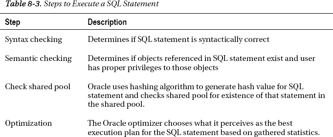
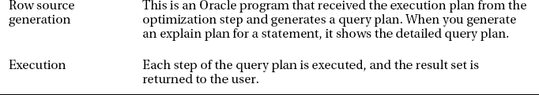
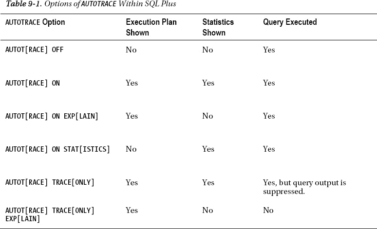
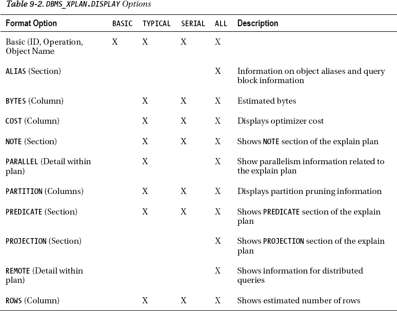
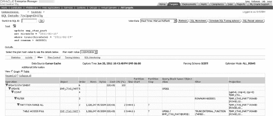
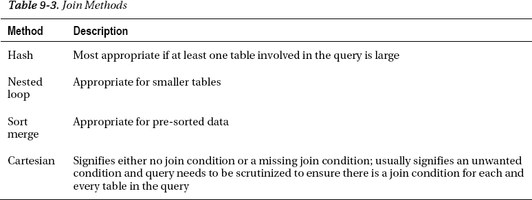
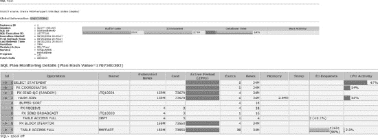

# 工作原理

`LIKE` 子句在您不确定数据库中存储的确切列值时，对于查找数据极为有用。使用 `LIKE` 子句时需要考虑性能方面的影响。主要考虑因素是，当使用 `LIKE` 子句时，优化器使用索引来辅助检索数据的可能性会降低。由于索引是基于列的完整值建立的，仅搜索列完整值的一部分会使优化器难以使用索引。

以前面查找在 1995 年开始工作的员工的例子为例，以下是该查询的执行计划：

```
---------------------------------------
| Id  | Operation         | Name      |
---------------------------------------
|   0 | SELECT STATEMENT  |           |
|   1 |  TABLE ACCESS FULL| EMPLOYEES |
---------------------------------------
```

由于索引是基于整个值建立的，如果搜索条件中保留了值的前部分，优化器就能识别出可以使用索引。在值的两侧放置百分号等同于说“包含”。如果我们只在值的末尾放置百分号，则等同于“以...开始”。由于值的开头部分保持完整，优化器将能够根据 `LIKE` 子句中的值与现有索引进行有效比较，因此可以使用该索引（如果该列上存在索引的话）：

```
SELECT employee_id, last_name, first_name, hire_date
FROM employees
WHERE hire_date LIKE '1995%';
```

```
EMPLOYEE_ID LAST_NAME                 FIRST_NAME           HIRE_DATE
----------- ------------------------- -------------------- ----------
        115 Khoo                      Alexander            1995-05-18
        122 Kaufling                  Payam                1995-05-01
        137 Ladwig                    Renske               1995-07-14
        141 Rajs                      Trenna               1995-10-17
```

```
---------------------------------------------------
| Id  | Operation                   | Name        |
---------------------------------------------------
|   0 | SELECT STATEMENT            |             |
|   1 |  TABLE ACCESS BY INDEX ROWID| EMPLOYEES   |
|   2 |   INDEX RANGE SCAN          | EMP_NAME_IX |
---------------------------------------------------
```

有时，下划线很可能正是被搜索数据的一部分。在这种情况下，必须在下划线前加上转义字符。如果您是一名 DBA，并且正在数据库中搜索表空间名（它很容易包含下划线字符），请务必考虑到下划线是一个通配符符号，必须加以处理。参见以下示例：

```
SELECT tablespace_name FROM dba_tablespaces
WHERE tablespace_name like '%EE_DATA';
```

```
TABLESPACE_NAME
------------------------------
EMPLOYEE_DATA
EMPLOYEE1DATA
```

下划线很可能被当作数据搜索，而不是 `LIKE` 子句的替换字符。如果在查询中插入转义字符，就可以避免得到不期望的结果。通过在下划线前直接插入转义字符，下划线将被视为数据的一部分，而不是替换字符：

```
SELECT tablespace_name FROM dba_tablespaces
WHERE tablespace_name LIKE '%EE^_DATA' ESCAPE '^';
```

```
TABLESPACE_NAME
------------------------------
EMPLOYEE_DATA
```

`LIKE` 子句的好处是它提供了基于列数据的部分值查找数据的灵活性。可能的代价是性能。使用 `LIKE` 子句的查询通常更不可能使用索引。作为 `LIKE` 的替代方案，`BETWEEN` 子句虽然在 SQL 语句中编写起来不那么简单，但通常更可能使用索引。然而，有时由于性能影响，`LIKE` 子句可能被视为应避免使用的子句，但如果避免使用前导百分号，优化器通常会在有索引可用的情况下使用它。

在“解决方案”部分的 `TO_CHAR` 示例中，您会注意到 `TO_CHAR` 函数被放置在比较运算符的左侧。通常，当这种情况发生时，意味着不会使用过滤列上的索引（有关此主题的更多讨论，请参见配方 8-14）。然而，对于某些 Oracle 函数及其转换方式，仍然可能使用索引。唯一确定的方法就是简单地在您的查询上运行一个执行计划。对于我们前面使用 `TO_CHAR` 的查询，尽管函数被放置在比较运算符的左侧，它仍然使用了索引：

```
SELECT employee_id, last_name, first_name, hire_date
FROM employees
WHERE to_char(hire_date,'yyyy') = '1995'
ORDER BY hire_date;
```

```
----------------------------------------------------
| Id  | Operation                   | Name         |
----------------------------------------------------
|   0 | SELECT STATEMENT            |              |
|   1 |  TABLE ACCESS BY INDEX ROWID| EMPLOYEES    |
|   2 |   INDEX FULL SCAN           | EMPLOYEES_I1 |
----------------------------------------------------
```

## 8-13. 在共享池中重用 SQL 语句

### 问题

您的 SQL 语句经历了过量的硬解析，并希望减少经过硬解析过程的 SQL 语句数量。


#### 解决方案

在应用程序中实现**绑定变量**可以极大地提高查询的效率和性能。本质上，绑定变量也称为替换变量，用于替换查询中的字面值。通过将绑定变量放入 SQL 语句中，这些语句可以在内存中被重复使用，从而无需经历整个昂贵的 SQL 解析过程。

这是一个普通 SQL 语句的示例，`WHERE` 子句中显示了字面值：

```sql
SELECT employee_id, last_name || ', ' || first_name employee_name
FROM employees
WHERE employee_id = 115;
```

```
EMPLOYEE_ID EMPLOYEE_NAME
----------- -------------------------
        115 Khoo, Alexander
```

在 Oracle 中有几种定义绑定变量的方法。首先，你可以直接使用 SQL Plus。要在 SQL Plus 中完成此操作，首先需要定义一个变量及其数据类型。然后，你可以使用 `exec` 命令，该命令实际上会运行一个 PL/SQL 命令，用所需的值填充该变量。请注意，在 SQL Plus 中引用绑定变量时，需要在变量名前加一个冒号：

```sql
SQL> variable g_emp_id number
SQL> exec :g_emp_id := 115;
```

```
PL/SQL procedure successfully completed.
```

定义变量并为其赋值后，你只需在 SQL 语句中替换该变量名即可。同样，由于它是一个绑定变量，你需要在它前面加一个冒号：

```sql
SELECT employee_id, last_name || ', ' || first_name employee_name
FROM employees
WHERE employee_id = :g_emp_id;
```

```
EMPLOYEE_ID EMPLOYEE_NAME
----------- -------------------------
        115 Khoo, Alexander
```

你也可以在 PL/SQL 中为变量赋值。PL/SQL 的一个显著优点是，只要在 PL/SQL 中使用变量，它们就会自动成为绑定变量，因此不需要特殊的编码。而且，与 SQL Plus 不同，引用在 PL/SQL 块内定义的变量时不需要冒号：

```sql
SQL> set serveroutput on
  1  DECLARE
  2    v_emp_id employees.employee_id%TYPE := 200;
  3    v_last_name employees.last_name%TYPE;
  4    v_first_name employees.first_name%TYPE;
  5  BEGIN
  6    SELECT last_name, first_name
  7    INTO v_last_name, v_first_name
  8    FROM employees
  9    WHERE employee_id = v_emp_id;
 10    dbms_output.put_line('Employee Name = ' || v_last_name || ', ' || v_first_name);
 11* END;
SQL> /
```

```
Employee Name = Whalen, Jennifer
```

#### 工作原理

使用绑定变量可以增加 SQL 语句在共享池中被重用的可能性。Oracle 使用哈希算法为每个唯一的 SQL 语句分配一个值。如果 SQL 语句中使用了字面值，那么两个原本相同的语句的哈希值将会不同。通过使用绑定变量，这些语句在共享池中将具有相同的哈希值，从而可以避免部分昂贵的解析过程。

##### 重用是高效的

重用之所以高效，是因为 Oracle 不需要为这些 SQL 语句经历整个解析过程。如果你的 SQL 语句中不使用绑定变量，而是使用字面值，那么这些语句就需要被完全解析。

请参阅 表 8-3 以回顾处理 SQL 语句所采取的步骤。一个被“硬解析”的语句必须执行所有步骤。如果一个语句是“软解析”，优化器通常不会执行优化和行源生成步骤。





##### 可以避免硬解析

通过使用绑定变量，可以避免硬解析，这有助于提升 SQL 查询的性能，并减少共享池中可能发生的内存量抖动。`TKPROF` 实用程序是验证 SQL 语句是否在共享池中被重用的一种方法。稍后，将提供使用绑定变量的 PL/SQL 代码示例，以及未使用绑定变量的 PL/SQL 代码示例。

使用 `TKPROF` 实用程序，我们可以查看这些语句是如何被处理的。为了使用 `TKPROF` 实用程序查看此信息，我们必须首先在会话中启用跟踪：

```sql
alter session set sql_trace=true;
```

跟踪文件会生成在由 `diagnostic_dest` 或 `user_dump_dest` 参数设置指定的位置。以下 PL/SQL 块更新 employees 表，为所有员工加薪 3%。由于所有 PL/SQL 变量都被视为绑定变量，我们可以通过 `TKPROF` 输出看到，update 语句只被解析了一次，但执行了 107 次：

```sql
BEGIN
FOR i IN 100..206
LOOP
UPDATE employees
SET salary=salary*1.03
WHERE employee_id = i;
END LOOP;
COMMIT;
END;
```

以下是 `TKPROF` 生成报告的摘录，该报告总结了启用跟踪的会话信息：

```
SQL ID : f7mtnudzhm2py
UPDATE EMPLOYEES SET SALARY=SALARY*1.03
WHERE
 EMPLOYEE_ID = :B1

call     count       cpu    elapsed       disk      query    current        rows
------- ------  -------- ---------- ---------- ---------- ----------  ----------
Parse        1      0.00       0.00          0          0          0           0
Execute    107      0.01       0.00          0        107        112         107
Fetch        0      0.00       0.00          0          0          0           0
------- ------  -------- ---------- ---------- ---------- ----------  ----------
total      108      0.01       0.00          0        107        112         107
```

在以下示例中，我们使用 `execute immediate` 命令通过动态 SQL 完成同样的操作：

```sql
BEGIN
FOR i IN 100..206
LOOP
execute immediate 'UPDATE employees SET salary=salary*1.03 WHERE employee_id = ' || i;
END LOOP;
COMMIT;
END;
```

由于整个语句在执行前被组合在一起，变量在执行前被转换成了字面值。我们可以通过 `TKPROF` 输出看到，该语句在每次执行时都被解析：

```
SQL ID : 67776qbqqz5wc
UPDATE employees SET salary=salary*:"SYS_B_0"
WHERE
 employee_id = :"SYS_B_1"

call     count       cpu    elapsed       disk      query    current        rows
------- ------  -------- ---------- ---------- ---------- ----------  ----------
Parse      107      0.00       0.00          0          0          0           0
Execute    107      0.00       0.04          0        107        112         107
Fetch        0      0.00       0.00          0          0          0           0
------- ------  -------- ---------- ---------- ---------- ----------  ----------
total      214      0.00       0.05          0        107        112         107
```


## 绑定变量可与 EXECUTE IMMEDIATE 一起使用

若要更高效地使用 `execute immediate` 命令，我们可以将其转换为使用带有 `USING` 子句的绑定变量，并在 `execute immediate` 语句中指定一个绑定变量。结果显示该语句仅被解析了一次：

```
BEGIN
  FOR i IN 100..206
  LOOP
    execute immediate 'UPDATE employees SET salary=salary*1.03 WHERE employee_id = :empno' USING i;
  END LOOP;
  COMMIT;
END;
```

```
SQL ID : 4y09bqzjngvq4
update employees set salary=salary*1.03
where
  employee_id = :empno
```

```
call     count       cpu    elapsed       disk      query    current        rows
------- ------  -------- ---------- ---------- ---------- ----------  ----------
Parse        1      0.00       0.00          0          0          0           0
Execute    107      0.01       0.01          0        107        112         107
Fetch        0      0.00       0.00          0          0          0           0
------- ------  -------- ---------- ---------- ---------- ----------  ----------
total      108      0.01       0.01          0        107        112         107
```

 **提示** 对于 DDL 语句，总是会发生硬解析。

### 8-14. 避免意外的全表扫描

#### 问题

你有一些查询本应使用索引，但却进行了全表扫描。你希望在优化器可以使用索引检索数据时，避免进行全表扫描。

#### 解决方案

在构造 SQL 语句时，如果可能，应尽量遵循一条基本原则：避免在比较运算符的左侧使用函数。函数本质上是将列转换为字面值，因此 Oracle 优化器不再将该转换后的值识别为列，而是识别为一个值。

在此，我们试图获取自 1999 年以来入职的所有员工的列表。因为我们在比较运算符的左侧放置了一个函数，即使 `HIRE_DATE` 列上有索引，优化器也被迫进行全表扫描：

```
SELECT employee_id, salary, hire_date
FROM employees
WHERE TO_CHAR(hire_date,'yyyy-mm-dd') >= '2000-01-01';
```

```
---------------------------------------
| Id  | Operation         | Name      |
---------------------------------------
|   0 | SELECT STATEMENT  |           |
|   1 |  TABLE ACCESS FULL| EMPLOYEES |
---------------------------------------
```

通过将函数移到比较运算符的右侧，并保持 `HIRE_DATE` 作为 `WHERE` 子句中的原始列，优化器现在可以使用 `HIRE_DATE` 上的索引：

```
SELECT employee_id, salary, hire_date
FROM employees
WHERE hire_date >= TO_DATE('2000-01-01','yyyy-mm-dd');
```

```
-------------------------------------------------
| Id  | Operation                   | Name      |
-------------------------------------------------
|   0 | SELECT STATEMENT            |           |
|   1 |  TABLE ACCESS BY INDEX ROWID| EMPLOYEES |
|   2 |   INDEX RANGE SCAN          | EMP_I5    |
-------------------------------------------------
```

#### 原理说明

函数是用于转换值或根据从数据库中所需内容返回期望值的绝佳工具，但如果在 SQL 语句中使用不当，它们可能成为性能杀手。确保所有函数都位于比较运算符的右侧，优化器将能够使用 `WHERE` 子句中指定列上的任何索引。这条规则适用于任何函数。在某些情况下，即使函数位于比较运算符的左侧，Oracle 仍可能使用索引，但这通常是例外。有关这方面的示例，请参见配方 8-12。

请记住，`WHERE` 子句中给定列的数据类型可能会影响如何修改 SQL 语句以将函数有效地移动到比较运算符的右侧。在下面的示例中，我们必须更改比较运算符才能有效地移动函数：

```
SELECT last_name, first_name
FROM employees
WHERE SUBSTR(phone_number,1,3) = '515';
```

```
---------------------------------------
| Id  | Operation         | Name      |
---------------------------------------
|   0 | SELECT STATEMENT  |           |
|   1 |  TABLE ACCESS FULL| EMPLOYEES |
---------------------------------------
```

为了有效地获取所有 515 区域号码的电话，我们可以使用 `BETWEEN` 子句并捕获所有可能的值。我们也可以使用 `LIKE` 子句，只要通配符位于条件的末尾。通过使用这两种方法中的任何一种，优化器都将执行计划更改为使用索引：

```
SELECT last_name, first_name
FROM employees
WHERE phone_number BETWEEN '515.000.0000' and '515.999.9999';
```

```
SELECT last_name, first_name
FROM employees
WHERE phone_number LIKE '515%';
```

```
-------------------------------------------------
| Id  | Operation                   | Name      |
-------------------------------------------------
|   0 | SELECT STATEMENT            |           |
|   1 |  TABLE ACCESS BY INDEX ROWID| EMPLOYEES |
|   2 |   INDEX RANGE SCAN          | EMP_I6    |
-------------------------------------------------
```

### 8-15. 创建高效的临时视图

#### 问题

你需要一个不存在的表或数据视图来构造所需的查询，但你没有在数据库上创建此类表或视图的权限。


#### 解决方案

有时，在单个 SQL 语句中，你可能想“即时”创建一个仅供查询使用的表，并且之后永远不会再用到。在查询的 `FROM` 子句中，你通常放置要从中检索数据的表或视图的名称。如果所需的数据视图不存在，你可以使用一种称为“内联视图”的方式，即时创建该数据的临时视图，即直接在查询的 `FROM` 子句中指定该视图的特征：

```sql
SELECT last_name, first_name, department_name dept, salary
FROM employees e join
( SELECT department_id, max(salary) high_sal
FROM employees
GROUP BY department_id ) m
USING (department_id) join departments
USING (department_id)
WHERE e.salary = m.high_sal
ORDER BY SALARY desc;
```

```
LAST_NAME                  FIRST_NAME           DEPT                     SALARY
------------------------- -------------------- -------------------- ----------
King                      Steven               Executive                 24000
Russell                   John                 Sales                     14000
Hartstein                 Michael              Marketing                 13000
Greenberg                 Nancy                Finance                   12000
Higgins                   Shelley              Accounting                12000
Raphaely                  Den                  Purchasing                11000
Baer                      Hermann              Public Relations          10000
Hunold                    Alexander            IT                         9000
Fripp                     Adam                 Shipping                   8200
Mavris                    Susan                Human Resources            6500
Whalen                    Jennifer             Administration             4400
```

在上述查询中，我们获取了每个部门工资最高的员工。我们的数据库中并不存在这样的视图。此外，在单个查询中，也无法直接连接 `employees` 表和 `departments` 表来检索此数据。因此，内联视图被创建为 SQL 语句的一部分，并且只包含我们所需的关键信息——它拥有高薪和部门信息，现在可以基于匹配该工资的员工轻松地与 `employees` 表进行连接。

#### 工作原理

与 SQL 语言的许多组件一样，内联视图需要谨慎使用。虽然极其有用，但如果滥用或过度使用，内联视图可能会导致数据库性能问题，特别是在临时表空间的使用方面。由于内联视图仅在查询执行期间创建和使用，其结果保存在程序全局内存区域中，如果数据量过大，则会使用临时表空间。在使用内联视图之前，应考虑以下问题：

1.  最重要的是，包含内联视图的 SQL 将多久运行一次？（如果只运行一次或很少运行，那么最好直接执行查询，而无需担心任何潜在的性能影响）。
2.  内联视图将包含多少行？
3.  内联视图的行长度是多少？
4.  为 `pga_aggregate_target` 或 `memory_target` 设置分配了多少内存？
5.  你的 Oracle 用户或模式所使用的临时表空间有多大？

如果你正在进行一个简单的即席查询，可能不需要进行这种分析。如果你创建的 SQL 语句将在生产环境中运行，进行这种分析就很重要，因为如果临时表空间被一个内联视图完全占用，不仅会影响该查询的完成，还会影响任何可能使用该特定临时表空间的用户处理的顺利进行。在许多数据库环境中，只有一个临时表空间。因此，如果一个用户进程通过单个操作消耗了所有临时空间，这将影响数据库中每个用户的操作。

考虑以下查询：

```sql
WITH service_info AS
(SELECT
product_id,
geographic_id,
sum(qty) quantity
FROM services
GROUP BY
product_id,
geographic_id),
product_info AS
(SELECT product_id, product_group, product_desc
FROM products
WHERE source_sys = 'BILLING'),
billing_info AS
(SELECT journal_date, billing_date, product_id
FROM BILLING
WHERE journal_date = TO_DATE('2011-08-15', 'YYYY-MM-DD'))
SELECT
product_group,
product_desc,
journal_date,
billing_date,
sum(service_info.quantity)
FROM service_info JOIN product_info
ON service_info.product_id = product_info.product_id JOIN billing_info
ON  service_info.product_id = billing_info.product_id
WHERE
service_info.quantity > 0
GROUP BY
product_group,
product_desc,
journal_date,
billing_date;
```

在这个查询中，创建了三个内联视图：`SERVICE_INFO` 视图、`PRODUCT_INFO` 视图和 `BILLING_INFO` 视图。在最终处理以最后一个 `SELECT` 语句开头的真正用户查询之前，每个查询都会被处理，并且结果会存储在程序全局区域或临时表空间中。虽然通过执行单个查询来获得所需结果在效率上是可取的，但上述查询的处理效率可能非常低，具体取决于表中数据的大小，因为将可能数百万行的数据存储到临时表空间会消耗整个数据库用户群体所需的关键资源。在此类示例中，在数据库层面创建保存内联视图所定义数据的表——在此例中是三个独立的表——通常更有效。然后，可以通过连接这三个永久表来提取最终查询以生成结果。虽然这可能需要开发团队和 `DBA` 进行更多的前期工作，但如果该查询定期运行，这很可能会带来回报。此外，随着 SQL 语句复杂性的增加，其可维护性会降低。因此，总的来说，将复杂语句分解成多个部分更高效，通常也更易于维护。

内联视图提供了巨大的好处。但是，在生产环境中实施使用此类视图之前，请进行适当的分析和研究。

**注意** 大型内联视图很容易消耗大量的临时表空间

### 8-16. 避免使用 NOT 子句

#### 问题

你有一些使用了 `NOT` 子句的查询性能不佳，并希望修改它们以提高性能。


#### 解决方案

正如我们经常为相等条件查询数据库一样，我们也会为非相等条件查询数据库。从数据库中检索数据的本质以及 SQL 语言的本质，就是允许用户执行此类操作。

在 SQL 语句中使用`NOT`子句会带来性能上的缺陷，因为它们会触发全表扫描。以下是一个来自先前示例的查询：

```sql
SELECT last_name, first_name, salary, email
FROM employees_big
WHERE department_id NOT IN(20,30)
AND commission_pct > 0;
```

```
-----------------------------------------------------------------------------------
| Id  | Operation         | Name          | Rows  | Bytes | Cost (%CPU)| Time  |
-----------------------------------------------------------------------------------
|   0 | SELECT STATEMENT  |               |   697K|    21M|  4480   (1)| 00:00:54 |
|*  1 |  TABLE ACCESS FULL| EMPLOYEES_BIG |   697K|    21M|  4480   (1)| 00:00:54 |
-----------------------------------------------------------------------------------
```

尽管我们在`department_id`列上有索引，但通过使用`NOT`子句，我们导致 Oracle 绕过该索引的使用，以正确搜索并确保所有行都不在部门 20 或 30 中。请注意 Oracle 为此查询分配的总成本 4480。

通过重写查询，可以启用索引的使用。例如，让我们使用一个子查询来获取所有`department_id`值不是 20 或 30 的列表，然后将该列表传递给父查询。通过这样做，我们将`NOT`子句移到了小得多的`departments`表上，因此对该表的表扫描会很快。这些值被传递给父查询，父查询可以使用索引，因为它不再需要`NOT`子句。

以下是新的查询及其执行计划。

```sql
SELECT last_name, first_name, salary, email
FROM employees_big
WHERE department_id IN
(SELECT department_id FROM departments
WHERE department_id NOT IN (20,30))
AND commission_pct > 0;
```

```
---------------------------------------------------------------------------------
| Id  | Operation          | Name       | Rows  | Bytes | Cost (%CPU)| Time  |
---------------------------------------------------------------------------------
|   0 | SELECT STATEMENT   |            |    33 |  1188 |     3   (0)| 00:00:01 |
|   1 |  NESTED LOOPS      |            |    33 |  1188 |     3   (0)| 00:00:01 |
|*  2 |   TABLE ACCESS FULL| EMPLOYEES  |    34 |  1088 |     3   (0)| 00:00:01 |
|*  3 |   INDEX UNIQUE SCAN| DEPT_ID_PK |     1 |     4 |     0   (0)| 00:00:01 |
---------------------------------------------------------------------------------
```

请注意，在更改之后，查询现在使用了索引，Oracle 分配的总成本从 4480 下降到了 3。

#### 工作原理

你可以通过以下几种方式有效使用`NOT`子句：
*   比较运算符（'<>', '!=', '^='）
*   `NOT IN`
*   `NOT LIKE`

通过使用`NOT`，以下每个查询都具有相同的基本效果，即它会否定对`NOT`所应用列上任何可能索引的使用：

```sql
SELECT last_name, first_name, salary, email
FROM employees
WHERE department_id != 20
AND commission_pct > 0;
```

```sql
SELECT last_name, first_name, salary, email
FROM employees
WHERE department_id NOT IN(20,30)
AND commission_pct > 0;
```

```sql
SELECT last_name, first_name, salary, email
FROM employees
WHERE hire_date NOT LIKE '2%'
AND commission_pct > 0;
```

```
---------------------------------------
| Id  | Operation         | Name      |
---------------------------------------
|   0 | SELECT STATEMENT  |           |
|   1 |  TABLE ACCESS FULL| EMPLOYEES |
---------------------------------------
```

有时，全表扫描是必需的。即使存在索引，如果你需要读取表中超过一定百分比的行，Oracle 优化器可能无论如何都会执行全表扫描。尽管如此，如果你尽可能尝试避免使用`NOT`，你可能能够提高查询的性能。

综上所述，你可以尝试使用`NOT EXISTS`作为替代方案，它可能在这些条件下提高性能。使用前面的查询并修改为使用`NOT EXISTS`，你仍然可以使用索引来提高查询性能：

```sql
SELECT last_name, first_name, salary, email
FROM employees
WHERE NOT EXISTS
(SELECT department_id FROM departments
WHERE department_id in(20,30))
AND commission_pct > 0;
```

```
------------------------------------------
| Id  | Operation           | Name       |
------------------------------------------
|   0 | SELECT STATEMENT    |            |
|   1 |  FILTER             |            |
|   2 |   TABLE ACCESS FULL | EMPLOYEES  |
|   3 |   INLIST ITERATOR   |            |
|   4 |    INDEX UNIQUE SCAN| DEPT_ID_PK |
------------------------------------------
```

### 8-17. 控制事务大小

#### 问题

你正在执行一系列 DML 活动，并希望更好地管理工作单元和事务的可恢复性。

#### 解决方案

通过使用保存点，你可以更轻松地将事务拆分为逻辑块，并在失败时更有效地管理它们。利用保存点，你可以将一系列 DML 语句回滚到你创建的增量保存点。在你的 SQL 会话中，只需在处理过程中适当的位置创建一个保存点，以便更轻松地隔离一个“逻辑工作单元”。以下是一个展示如何创建保存点的示例：

```
SQL> savepoint A;

Savepoint created.
```

例如，如果你有一个在线书店，一位客户正在下在线订单，当他或她提交订单时，该事务的一个逻辑工作单元如下所示：
*   向`orders`表添加一行
*   向`orderitems`表添加一或多行

在处理这个在线订单时，你会希望将订单的所有信息以及订单的所有项目作为一个事务提交。这涉及多个数据库 DML 语句，但需要逐个处理以维护客户订单的完整性；因此它可以被视为一个“逻辑工作单元”。通过使用保存点，你可以更轻松地将多个 DML 语句作为逻辑工作单元进行处理。创建保存点时，本质上是基于系统更改号（SCN）创建了一个别名。创建保存点后，你就可以方便地将事务回滚到基于你创建的保存点的那个 SCN。


#### 工作原理

假设贵公司为两个新成立的部门招聘了员工。你需要在对应的 `DEPT` 和 `EMP` 表中插入行，但需要为每个部门单独执行一个事务。如果出现错误，你可以回滚到上一个逻辑事务完成的点。首先，我们可以查看 `DEPT` 表的当前情况：

```
SELECT * FROM dept;

    DEPTNO DNAME          LOC
---------- -------------- -------------
        10 ACCOUNTING     NEW YORK
        20 RESEARCH       DALLAS
        30 SALES          CHICAGO
        40 OPERATIONS     BOSTON
```

我们首先将第一个部门的信息插入到 `DEPT` 和 `EMP` 表中，然后创建一个保存点：

```
INSERT INTO dept VALUES (50,'PAYROLL','LOS ANGELES');

1 row created.

INSERT INTO emp VALUES (7997,'EVANS','ACCTNT',7566,'2011-08-15',900,0,50);

1 row created.

savepoint A;

Savepoint created.
```

然后我们开始处理第二个部门的信息。假设在事务处理到一半时，在向 `DEPT` 表插入和向 `EMP` 表插入之间发生了未知错误。这种情况下，我们知道这个为招聘部门插入信息的事务必须被回滚。同时，我们希望提交工资部门的事务。利用我们创建的保存点，我们可以提交事务的一部分，同时回滚我们不想要保留的那部分事务：

```
INSERT INTO dept VALUES (60,'RECRUITING','DENVER');

1 row created.

ROLLBACK to savepoint A;

Rollback complete.

COMMIT;

Commit complete.
```

由于保存点的存在，我们的回滚仅回滚了部门 60 的未完成事务，随后的提交将部门 50 的完整事务写入了数据库的 `DEPT` 和 `EMP` 表：

```
SELECT * FROM dept;

    DEPTNO DNAME          LOC
---------- -------------- -------------
        10 ACCOUNTING     NEW YORK
        20 RESEARCH       DALLAS
        30 SALES          CHICAGO
        40 OPERATIONS     BOSTON
        50 PAYROLL        LOS ANGELES

SELECT * FROM emp
WHERE empno = 7997;

     EMPNO ENAME      JOB              MGR HIREDATE    SAL       COMM  DEPTNO
---------- ---------  ---------- ---------- ---------- ---- ---------- -------
      7997 EVANS      ACCTNT          7566 2011-08-15  900          0      50
```

在编程语言（如 PL/SQL）中，你可以使用许多类似的机制或编码技术。SQL 语言中的 `SAVEPOINT` 命令是一种简单的方法来管理事务，而无需编写更复杂的程序结构。

## 第 9 章 手动调整 SQL

书籍、文章和其他出版物中多次提到，数据库中超过 90% 的性能问题是由编写不当的 SQL 引起的。当查询性能不足时，数据库管理员常常被赋予“修复数据库”的任务。在证明清白之前，数据库管理员往往就被认定有罪——并且经常需要证明性能问题并非源于数据库本身，而仅仅是 SQL 语句编写效率低下。当然，目标是让 SQL 语句在第一次编写时就足够高效。本章的重点是帮助监控和分析现有查询，说明其性能不佳的原因，并展示一些改进查询的步骤。

如果你有正在维护或需要帮助提升性能的 SQL 代码，首先需要问的一些问题包括：

*   该查询之前是否成功运行过？
*   过去该查询的性能是否可以接受？
*   是否有该查询成功运行时耗时的度量指标？
*   该查询通常返回多少数据？
*   最近一次对查询中引用的对象收集统计信息是什么时候？

一旦这些问题得到解答，就有助于将焦点引导到问题可能所在之处。然后，你可能希望为该查询运行一个执行计划，以查看执行计划乍看之下是否合理。阅读执行计划的技能需要时间，并随着经验而提高。有时，特别是在被查询对象之上存在视图时，执行计划可能会很长且令人望而生畏。因此，重要的是首先知道要关注什么，然后随着深入再挖掘细节。

有时，运行不佳的 SQL 可能会暴露出数据库配置问题，但通常，性能不佳的 SQL 查询是由于 SQL 语句编写不当造成的。再次强调，作为数据库管理员或数据库开发人员，最佳方法是尽可能提前花时间在 SQL 语句运行于生产环境之前对其进行调整。通常，查询的耗时是效率的基准，但这很容易让人陷入误区。随着时间的推移，数据库的特性会发生变化，应用程序可能会存储更多的历史数据，一个在初始安装时性能良好的查询在应用程序成熟时就可能无法很好地扩展。因此，第一次就花时间把它做对很重要，这说起来容易，但在平衡客户需求、预算和项目时间表时却很难做到。

### 9-1. 显示查询的执行计划

#### 问题

你想在 SQL Plus 中快速获取一个查询的执行计划。

#### 解决方案

在 SQL Plus 中，你可以使用 `AUTOTRACE` 功能来快速获取查询的执行计划。这个 SQL Plus 工具在获取执行计划以及查询执行计划的统计信息时非常方便。最基本的形式是，在你的会话中启用 `AUTOTRACE`，在 SQL Plus 中执行以下命令：

```
SQL> set autotrace on
```

然后，你可以使用 `AUTOTRACE` 运行一个查询，这将显示该查询的执行计划和执行统计信息：

```
SELECT last_name, first_name
FROM employees NATURAL JOIN departments
WHERE employee_id = 101;

LAST_NAME                 FIRST_NAME
------------------------- --------------------
Kochhar                   Neena

--------------------------------------------------------------------------------------------
| Id  | Operation                    | Name          | Rows  | Bytes | Cost (%CPU)| Time   |
--------------------------------------------------------------------------------------------
|   0 | SELECT STATEMENT             |               |     1 |    33 |     2   (0)| 00:00:01
|   1 |  NESTED LOOPS                |               |     1 |    33 |     2   (0)| 00:00:01
|   2 |   TABLE ACCESS BY INDEX ROWID| EMPLOYEES     |     1 |    26 |     1   (0)| 00:00:01
|*  3 |    INDEX UNIQUE SCAN         | EMP_EMP_ID_PK |     1 |       |     0   (0)| 00:00:01
|*  4 |   TABLE ACCESS BY INDEX ROWID| DEPARTMENTS   |    11 |    77 |     1   (0)| 00:00:01
|*  5 |    INDEX UNIQUE SCAN         | DEPT_ID_PK    |     1 |       |     0   (0)| 00:00:01
--------------------------------------------------------------------------------------------

Statistics
----------------------------------------------------------
          0  recursive calls
          0  db block gets
          4  consistent gets
          0  physical reads
          0  redo size
        490  bytes sent via SQL*Net to client
        416  bytes received via SQL*Net from client
          2  SQL*Net roundtrips to/from client
          0  sorts (memory)
          0  sorts (disk)
          1  rows processed
```

#### 工作原理

使用 `AUTOTRACE` 时有多个选项可供选择，基本要素如下：

1.  是否要执行查询？
2.  是否要查看查询的执行计划？
3.  是否要查看查询的执行统计信息？

如表 9-1 所示，您可以选择缩写每个命令。方括号中的部分是可选的。



`AUTOTRACE` 最常见的用途是在不运行查询的情况下获取其执行计划。这样做可以让您快速判断执行计划是否合理，且无需实际执行查询：

```sql
SQL> set autot trace exp

SELECT l.location_id, city, department_id, department_name
  FROM locations l, departments d
  WHERE l.location_id = d.location_id(+)
  ORDER BY 1;
-----------------------------------------------------------------------------------
| Id  | Operation           | Name        | Rows  | Bytes | Cost (%CPU)| Time     |
-----------------------------------------------------------------------------------
|   0 | SELECT STATEMENT    |             |    27 |   837 |     8  (25)| 00:00:01 |
|   1 |  SORT ORDER BY      |             |    27 |   837 |     8  (25)| 00:00:01 |
|*  2 |   HASH JOIN OUTER   |             |    27 |   837 |     7  (15)| 00:00:01 |
|   3 |    TABLE ACCESS FULL| LOCATIONS   |    23 |   276 |     3   (0)| 00:00:01 |
|   4 |    TABLE ACCESS FULL| DEPARTMENTS |    27 |   513 |     3   (0)| 00:00:01 |
-----------------------------------------------------------------------------------
```

对于上述查询，如果您只想查看查询的执行统计信息，而不希望看到所有查询输出，您可以这样做：

```sql
SQL> set autot trace stat
SQL> /

43 rows selected.

Statistics
----------------------------------------------------------
          0  recursive calls
          0  db block gets
         14  consistent gets
          0  physical reads
          0  redo size
       1862  bytes sent via SQL*Net to client
        438  bytes received via SQL*Net from client
          4  SQL*Net roundtrips to/from client
          1  sorts (memory)
          0  sorts (disk)
         43  rows processed
```

一旦您在某个会话中使用完 `AUTOTRACE`，并希望将其关闭以便在不使用 `AUTOTRACE` 的情况下运行其他查询，请在您的 SQL Plus 会话中运行以下命令：

```sql
SQL> set autot off
```

每个 SQL Plus 会话的默认设置是 `AUTOTRACE OFF`，但如果您想检查给定会话的当前 `AUTOTRACE` 设置，可以通过执行以下命令来完成：

```sql
SQL> show autot
autotrace OFF
```

### 9-2. 自定义执行计划输出

#### 问题

您想根据特定需求配置查询的解释计划输出。

#### 解决方案

Oracle 提供的 PL/SQL 包 `DBMS_XPLAN` 具有广泛的功能，可用于获取给定查询的解释计划信息。`DBMS_XPLAN` 包中包含许多函数。`DISPLAY` 函数可用于快速获取查询的执行计划，并可根据您的具体需求自定义所呈现的信息。以下是一个调用基本显示功能的示例：

```sql
explain plan for
SELECT last_name, first_name
FROM employees JOIN departments USING(department_id)
WHERE employee_id = 101;

Explained.

SELECT * FROM table(dbms_xplan.display);

PLAN_TABLE_OUTPUT
--------------------------------------------------------------------------------------------
Plan hash value: 1833546154

--------------------------------------------------------------------------------------------
| Id  | Operation                   | Name          | Rows  | Bytes | Cost (%CPU)| Time    |
--------------------------------------------------------------------------------------------
|   0 | SELECT STATEMENT            |               |     1 |    22 |     1   (0)| 00:00:01|
|*  1 |  TABLE ACCESS BY INDEX ROWID| EMPLOYEES     |     1 |    22 |     1   (0)| 00:00:01|
|*  2 |   INDEX UNIQUE SCAN         | EMP_EMP_ID_PK |     1 |       |     0   (0)| 00:00:01|
--------------------------------------------------------------------------------------------

Predicate Information (identified by operation id):
---------------------------------------------------

   1 - filter("EMPLOYEES"."DEPARTMENT_ID" IS NOT NULL)
   2 - access("EMPLOYEES"."EMPLOYEE_ID"=101)
```

`DBMS_XPLAN.DISPLAY` 过程在配置输出显示方式方面非常灵活。如果您只想查看最基本的执行计划输出，使用上述查询，您可以配置 `DBMS_XPLAN.DISPLAY` 函数来获取该输出：

```sql
SELECT * FROM table(dbms_xplan.display(null,null,'BASIC'));

-----------------------------------------------------
| Id  | Operation                   | Name          |
-----------------------------------------------------
|   0 | SELECT STATEMENT            |               |
|   1 |  TABLE ACCESS BY INDEX ROWID| EMPLOYEES     |
|   2 |   INDEX UNIQUE SCAN         | EMP_EMP_ID_PK |
-----------------------------------------------------
```

#### 工作原理

`DBMS_XPLAN.DISPLAY` 函数具有丰富的内置功能，可根据您的需求提供自定义输出。该函数提供四个基本的输出详细级别：

*   `BASIC`
*   `TYPICAL`（默认）
*   `SERIAL`
*   `ALL`

表 9-2 显示了每个详细级别选项中所包含的格式选项。



如果您只需要默认的输出格式，则无需传入任何特殊格式选项：

```sql
SELECT * FROM table(dbms_xplan.display);
```

如果您想获取查询的所有可用输出，请使用 `ALL` 详细级别格式输出选项：

```sql
SELECT * FROM table(dbms_xplan.display(null,null,'ALL'));
```

```
--------------------------------------------------------------------------------------------
| Id  | Operation                   | Name          | Rows  | Bytes | Cost (%CPU)| Time    |
--------------------------------------------------------------------------------------------
|   0 | SELECT STATEMENT            |               |     1 |    22 |     1   (0)| 00:00:01|
|*  1 |  TABLE ACCESS BY INDEX ROWID| EMPLOYEES     |     1 |    22 |     1   (0)| 00:00:01|
|*  2 |   INDEX UNIQUE SCAN         | EMP_EMP_ID_PK |     1 |       |     0   (0)| 00:00:01|
--------------------------------------------------------------------------------------------

Query Block Name / Object Alias (identified by operation id):
-------------------------------------------------------------

   1 - SEL$38D4D5F3 / EMPLOYEES@SEL$1
   2 - SEL$38D4D5F3 / EMPLOYEES@SEL$1

Predicate Information (identified by operation id):
---------------------------------------------------

   1 - filter("EMPLOYEES"."DEPARTMENT_ID" IS NOT NULL)
   2 - access("EMPLOYEES"."EMPLOYEE_ID"=101)

Column Projection Information (identified by operation id):
-----------------------------------------------------------

   1 - "EMPLOYEES"."FIRST_NAME"[VARCHAR2,20], "EMPLOYEES"."LAST_NAME"[VARCHAR2,25]
   2 - "EMPLOYEES".ROWID[ROWID,10]

Note
-----
   - rule based optimizer used (consider using cbo)
```

`DBMS_XPLAN.DISPLAY` 函数一个非常好的特性是，在确定了您需要的详细信息基础级别后，您可以添加个别选项，以便在该级别基础输出之外额外显示。例如，如果您只需要最基本的输出信息，但还想了解成本信息，可以按如下方式格式化 `DBMS_XPLAN.DISPLAY`：

```sql
SELECT * FROM table(dbms_xplan.display(null,null,'BASIC +COST'));
```

```
--------------------------------------------------------------------------------
| Id  | Operation                    | Name                       | Cost (%CPU)|
--------------------------------------------------------------------------------
|   0 | SELECT STATEMENT             |                            |     1   (0)|
|   1 |  RESULT CACHE                | 0fnzzb94z0dj2b5vzkmq4f4xcu |            |
|   2 |   TABLE ACCESS BY INDEX ROWID| EMPLOYEES                  |     1   (0)|
|   3 |    INDEX UNIQUE SCAN         | EMP_EMP_ID_PK              |     0   (0)|
--------------------------------------------------------------------------------
```

您也可以做相反的操作，即减去您不想看到的信息。如果您想查看使用 `TYPICAL` 级别的输出，但不想看到 `ROWS` 或 `BYTES` 信息，可以执行以下查询来显示该级别的输出：

```sql
SELECT * FROM table(dbms_xplan.display(null,null,'TYPICAL -BYTES -ROWS'));
```

```
-----------------------------------------------------------------------------
| Id  | Operation                   | Name          | Cost (%CPU)| Time     |
-----------------------------------------------------------------------------
|   0 | SELECT STATEMENT            |               |     1   (0)| 00:00:01 |
|*  1 |  TABLE ACCESS BY INDEX ROWID| EMPLOYEES     |     1   (0)| 00:00:01 |
|*  2 |   INDEX UNIQUE SCAN         | EMP_EMP_ID_PK |     0   (0)| 00:00:01 |
-----------------------------------------------------------------------------
```

### 9-3. 图形化显示执行计划

#### 问题

您希望无需运行 SQL 语句即可快速查看执行计划。您希望通过 GUI 查看计划，以便只需点击即可获取。

#### 解决方案

在 Enterprise Manager 中，您可以快速找到查询的执行计划。要使用此功能，您必须在环境中配置 Enterprise Manager。这可以是管理单个数据库的 Database Control，也可以是管理企业数据库的 Grid Control。要查看给定查询的执行计划，您需要导航到 Enterprise Manager 的 Top Sessions 屏幕。（请参阅您特定版本的 Oracle Enterprise Manager 文档。）在 Top Sessions 屏幕上，您可以深入查看会话特定信息。首先，找到您的会话。然后，单击 Current SQL 下显示的 SQL ID。从那里，您可以单击 Plan，执行计划就会出现，如 图 9-1 所示。



`图 9-1. Enterprise Manager 中的示例执行计划输出`

#### 工作原理

使用 Enterprise Manager 可以非常轻松地找到数据库中当前正在运行的 SQL 操作的执行计划。如果某个特定 SQL 语句的性能不如预期，此方法是确定正在运行的查询或其他 SQL 操作的执行计划的最快方法之一。要使用此功能，您必须拥有 Enterprise Manager 的 Tuning Pack 许可。

### 9-4. 阅读执行计划

#### 问题

您已为给定 SQL 语句运行了执行计划解释，并希望了解如何阅读该计划。

#### 解决方案

SQL 操作的执行计划会逐步详细说明 Oracle 优化器将如何执行您的 SQL 操作。使用`AUTOTRACE`，我们可以获取以下查询的执行计划：

```sql
set autotrace trace explain

SELECT ename, dname
FROM emp JOIN dept USING (deptno);
```

```
----------------------------------------------------------------------------------------
| Id  | Operation                    | Name    | Rows  | Bytes | Cost (%CPU)| Time     |
----------------------------------------------------------------------------------------
|   0 | SELECT STATEMENT             |         |    14 |   308 |     6  (17)| 00:00:01 |
|   1 |   MERGE JOIN                 |         |    14 |   308 |     6  (17)| 00:00:01 |
|   2 |    TABLE ACCESS BY INDEX ROWID| DEPT    |     4 |    52 |     2   (0)| 00:00:01 |
|   3 |     INDEX FULL SCAN          | PK_DEPT |     4 |       |     1   (0)| 00:00:01 |
|*  4 |    SORT JOIN                 |         |    14 |   126 |     4  (25)| 00:00:01 |
|   5 |     TABLE ACCESS FULL        | EMP     |    14 |   126 |     3   (0)| 00:00:01 |
----------------------------------------------------------------------------------------

Predicate Information (identified by operation id):
---------------------------------------------------

   4 - access("EMP"."DEPTNO"="DEPT"."DEPTNO")
       filter("EMP"."DEPTNO"="DEPT"."DEPTNO")

Note
-----
   - automatic DOP: Computed Degree of Parallelism is 1 because of parallel threshold
```

一旦您有了一个需要解读的执行计划，就可以判断哪些步骤最先执行，因为最内层或缩进最深的步骤最先执行，并且执行顺序是从内到外，自顶向下。在上述查询中，我们正在连接`EMP`和`DEPT`表。根据执行计划，该查询的处理步骤如下：

1.  扫描`PK_DEPT`索引（ID 3）。
2.  扫描`EMP`表的所有行（ID 5）。
3.  根据`PK_DEPT`索引中的匹配条目，从`DEPT`表中检索行（ID 2）。
4.  对来自`EMP`表的结果数据进行排序（ID 4）。
5.  然后通过`MERGE JOIN`连接来自`EMP`和`DEPT`表的数据（ID 1）。
6.  查询的结果数据返回给用户（ID 0）。

#### 工作原理

当您第一次查看一个执行计划，并希望快速了解查询将按哪些步骤执行时，请执行以下操作：

1.  在计划中寻找缩进最深的行（最右边的行）。这些将最先执行。
2.  如果有多个行处于同一缩进级别，它们将在计划中按自顶向下的方式执行，即计划中最顶部的行先执行，然后向下移动。
3.  查看下一个缩进级别最深的行或行，并继续向外层处理。
4.  执行计划的顶部对应于计划中缩进最少或最左边的部分，通常是结果返回给用户的地方。

一旦您有了一个查询的执行计划，并能理解查询将被处理的顺序，您就可以进行一些分析，以确定您正在查看的执行计划是否高效。在查看执行计划时，请回答这些问题，并在确定计划是否高效时考虑以下因素：

*   查询的访问路径是什么（查询是执行全表扫描还是使用索引）？
*   查询的连接方法是什么（如果存在连接条件）？
*   查看查询`WHERE`子句中的过滤条件所涉及的列，并确定它们是否被索引。
*   获取查询中每个表的数据量或行数。这些表是小型、中型还是大型？这可能有助于您确定最合适的连接方法。关于连接方法类型的概要，请参见表 9-3。
*   查询所涉及对象的统计信息上次收集是什么时候？
*   查看执行计划的`COST`列，获取初始成本。

通过查看我们最初的执行计划，我们确定`EMP`表尺寸较大，并且在`DEPT`和`EMP`表之间连接条件中使用的`DEPTNO`列上没有索引。通过在`EMP`表的`DEPTNO`列上创建索引并收集`EMP`表的统计信息，新的计划现在使用了索引：

```
---------------------------------------------------------------------------------------
| Id  | Operation                    | Name   | Rows  | Bytes | Cost (%CPU)| Time     |
---------------------------------------------------------------------------------------
|   0 | SELECT STATEMENT             |        |    14 |   280 |     6  (17)| 00:00:01 |
|   1 |   MERGE JOIN                 |        |    14 |   280 |     6  (17)| 00:00:01 |
|   2 |    TABLE ACCESS BY INDEX ROWID| EMP    |    14 |    98 |     2   (0)| 00:00:01 |
|   3 |     INDEX FULL SCAN          | EMP_I2 |    14 |       |     1   (0)| 00:00:01 |
|*  4 |    SORT JOIN                 |        |     4 |    52 |     4  (25)| 00:00:01 |
|   5 |     TABLE ACCESS FULL        | DEPT   |     4 |    52 |     3   (0)| 00:00:01 |
---------------------------------------------------------------------------------------
```



有关并行执行计划的信息，请参见第 15 章。

 **提示** 导致执行计划次优的最常见原因之一是查询所涉及的一个或多个对象缺少最新的统计信息。

### 9-5. 监控长时间运行的 SQL 语句

#### 问题

您有一个运行时间很长的 SQL 语句，希望能够监控该语句的进度并了解它何时完成。

#### 解决方案

通过查看数据字典视图`V$SESSION_LONGOPS`中长时间运行查询的信息，您可以估算查询大概何时完成。假设您正在对一个大型表运行以下带有连接条件的查询：

```sql
SELECT last_name, first_name FROM employees_big
WHERE last_name = 'EVANS';
```

通过对`V$SESSION_LONGOPS`视图进行一个简单的查询，您可以快速了解查询将执行多长时间以及何时完成：

```sql
SELECT username, target, sofar blocks_read, totalwork total_blocks,
round(time_remaining/60) minutes
FROM v$session_longops
WHERE sofar <> totalwork
and username = 'HR';
```

```
USERNAME     TARGET               BLOCKS_READ TOTAL_BLOCKS    MINUTES
------------ -------------------- ----------- ------------ ----------
HR           HR.EMPLOYEES_BIG           81101      2353488         10
```

随着查询的进行，您会看到`BLOCKS_READ`列增加，而`MINUTES`列减少。通常需要添加`WHERE`子句来排除已完成的行，这就是为什么在上面的查询中，它要求显示`SOFAR`列不等于`TOTALWORK`的行。

#### 工作原理

为了能够在`V$SESSION_LONGOPS`视图中监控查询，需满足以下要求：

*   查询必须运行六秒或更长时间。
*   被访问的表必须大于 10,000 个数据库块。
*   必须设置`TIMED_STATISTICS`或启用`SQL_TRACE`。
*   查询中的对象必须通过`DBMS_STATS`或`ANALYZE`进行过分析。

此视图可以包含`SELECT`语句、DML 语句（如`UPDATE`）以及 DDL 语句（如`CREATE INDEX`）的信息。一些常见的会出现在`V$SESSION_LONGOPS`视图中的操作包括表扫描、索引扫描、连接操作、并行操作、RMAN 备份操作、排序操作和 Data Pump 操作。

### 9-6. 识别当前正在执行的、消耗资源的 SQL 语句


## 9-6. 识别资源消耗最大的 SQL

### 问题

您的数据库中存在争用问题，并希望识别消耗系统资源最多的 SQL 语句。

 **注意** 配方 9-9 展示了如何检查历史记录，以查找过去执行过、但当前未在执行的资源消耗大的 SQL 语句。

### 解决方案

查看`V$SQLSTATS`视图，它提供了当前或最近运行的 SQL 语句的信息。如果您想获取最近执行磁盘 I/O 最多的前五个 SQL 语句，可以执行以下查询：

```sql
SELECT sql_text, disk_reads FROM
  (SELECT sql_text, buffer_gets, disk_reads, sorts,
   cpu_time/1000000 cpu, rows_processed, elapsed_time
   FROM v$sqlstats
   ORDER BY disk_reads DESC)
WHERE rownum <= 5;
```

如果您想按 CPU 时间、排序次数、加载次数、失效次数或任何其他列查看前五个 SQL 语句，只需将上述查询中的`disk_reads`列替换为您期望的列即可。`SQL_TEXT`列可能会使结果看起来很杂乱，因此另一种方法是使用`SQL_ID`列替代`SQL_TEXT`列，然后根据显示的统计数据，您可以运行一个查询，仅基于给定的`SQL_ID`获取其`SQL_TEXT`。

### 工作原理

`V$SQLSTATS`视图旨在帮助更快速地查找有关资源消耗大的 SQL 语句的信息。`V$SQLSTATS`包含与`V$SQL`和`V$SQLAREA`视图相同的信息，但它只包含了这些视图的一个列子集。然而，数据在`V$SQLSTATS`中保留的时间比在`V$SQL`或`V$SQLAREA`中更长。

有时，会存在一些与维护数据库运行的后台处理相关的 SQL 语句，您可能不希望看到这些语句，而只希望看到与您的应用程序相关的那些。如果您将`V$SQLSTATS`与`V$SQL`连接，就可以看到特定用户的信息。请参见以下示例：

```sql
SELECT schema, sql_text, disk_reads, round(cpu,2) FROM
  (SELECT s.parsing_schema_name schema, t.sql_id, t.sql_text, t.disk_reads,
  t.sorts, t.cpu_time/1000000 cpu, t.rows_processed, t.elapsed_time
   FROM v$sqlstats t join v$sql s on(t.sql_id = s.sql_id)
  WHERE parsing_schema_name = 'SCOTT'
  ORDER BY disk_reads DESC)
WHERE rownum <= 5;
```

请记住，`V$SQL`代表保存在共享池中的 SQL，其数据老化清除的速度比`V$SQLSTATS`中的数据快，因此此查询不会返回已经从共享池中老化清除的 SQL 的数据。

### 9-7. 查看当前运行 SQL 的执行统计信息

### 问题

您想查看当前正在运行的 SQL 语句的执行统计信息。

### 解决方案

您可以使用`V$SQL_MONITOR`视图来查看当前运行 SQL 的实时统计信息，并根据 CPU 使用率、缓冲区获取次数、磁盘读取次数和查询耗时等统计信息，查看给定查询所使用的资源消耗。首先，让我们在数据库中查找一个当前正在执行的查询：

```sql
SELECT sid, sql_text FROM v$sql_monitor
WHERE status = 'EXECUTING';
```
```
       SID SQL_TEXT
---------- -----------------------------------------------------------------
       100 select department_name, city, avg(salary)
           from employees_big join departments using(department_id)
           join locations using (location_id)
           group by department_name, city
           having avg(salary) > 2000
           order by 2,1
```

对于在`V$SQL_MONITOR`中找到的上述正在执行的查询，我们可以在其执行时查看该语句的资源利用情况：

```sql
SELECT sid, buffer_gets, disk_reads, round(cpu_time/1000000,1) cpu_seconds
FROM v$sql_monitor
WHERE SID=100
AND status = 'EXECUTING';
```
```
       SID BUFFER_GETS DISK_READS CPU_SECONDS
---------- ----------- ---------- -----------
       100      149372       4732        39.1
```

`V$SQL_MONITOR`视图包含当前正在运行的 SQL 语句，以及最近运行过的 SQL 语句。如果您想查看数据库中消耗 CPU 最多的前五个查询，可以执行以下查询：

```sql
SELECT * FROM (
  SELECT sid, buffer_gets, disk_reads, round(cpu_time/1000000,1) cpu_seconds
  FROM v$sql_monitor
  ORDER BY cpu_time desc)
WHERE rownum <= 5;
```
```
       SID BUFFER_GETS DISK_READS CPU_SECONDS
---------- ----------- ---------- -----------
        20     1332665      30580       350.5
       105      795330      13651       269.7
        20      259324       5449        71.6
        20      259330       5485        71.3
       100      259236       8188        67.9
```


### 工作原理

SQL 语句在 `V$SQL_MONITOR` 中针对以下条件进行监控：

*   对任何并行语句自动监控
*   对任何 DML 或 DDL 语句自动监控
*   如果特定 SQL 语句消耗了至少五秒的 CPU 或 I/O 时间，则自动监控
*   对任何在语句级别设置了监控的 SQL 语句进行监控

要在语句级别开启监控，可以使用提示。参见以下示例：

```sql
SELECT /*+ monitor */ ename, dname
FROM emppart JOIN dept USING (deptno);
```

如果由于某种原因，你不想监控某些语句，可以在语句中使用 `NOMONITOR` 提示来阻止监控的发生。

`V$SQL_MONITOR` 中的统计信息几乎是实时更新的，即每秒更新一次。任何当前正在执行并被监控的 SQL 语句都可以在 `V$SQL_MONITOR` 中找到。已完成的查询在执行结束后至少会保留一分钟，并且根据新执行查询所需的空间要求，可能会保留更长时间。`V$SQL_MONITOR` 视图的一个关键优势是它为给定查询的每一次执行都提供了详细的统计信息，这与 `V$SQL` 不同，后者是多个 SQL 语句执行的累积结果。为了深入查看 SQL 语句的特定执行，你需要来自 `V$SQL_MONITOR` 的三个列：

1.  `SQL_ID`
2.  `SQL_EXEC_START`
3.  `SQL_EXEC_ID`

如果我们想查看给定查询的所有执行（基于 `SQL_ID` 列），我们可以通过查询这三个必要的列来钻取到 SQL 查询的特定执行来获取该信息：

```sql
SELECT * FROM (
  SELECT sql_id, to_char(sql_exec_start,'yyyy-mm-dd:hh24:mi:ss') sql_exec_start,
         sql_exec_id, sum(buffer_gets) buffer_gets,
         sum(disk_reads) disk_reads, round(sum(cpu_time/1000000),1) cpu_secs
  FROM v$sql_monitor
  WHERE sql_id = 'fcg00hyh7qbpz'
  GROUP BY sql_id, sql_exec_start, sql_exec_id
  ORDER BY 6 desc)
WHERE rownum <= 5;
```

```
SQL_ID        SQL_EXEC_START      SQL_EXEC_ID BUFFER_GETS DISK_READS CPU_SECS
------------- ------------------- ----------- ----------- ---------- --------
fcg00hyh7qbpz 2011-05-21:12:28:10    16777222      259324       5449     71.6
fcg00hyh7qbpz 2011-05-21:12:29:24    16777223      259330       5485     71.3
fcg00hyh7qbpz 2011-05-21:12:26:08    16777220      213823       4502     58.4
fcg00hyh7qbpz 2011-05-21:12:27:09    16777221      211752       4579     58.1
fcg00hyh7qbpz 2011-05-21:12:25:37    16777219      107973       2414     29.4
```

请记住，如果语句在并行运行，查询的每个并行线程都会出现一行，包括查询协调器。但是，它们将共享相同的 `SQL_ID`、`SQL_EXEC_START` 和 `SQL_EXEC_ID` 值。在这种情况下，如果你愿意，可以对特定统计信息执行聚合。参见以下并行查询示例，其中由 `PX_SERVER#` 列表示并行从属信息：

```sql
SELECT sql_id, sql_exec_start, sql_exec_id, px_server# px#, disk_reads,
       cpu_time/1000000 cpu_secs, buffer_gets
FROM v$sql_monitor
WHERE status = 'EXECUTING'
ORDER BY px_server#;
```

```
SQL_ID        SQL_EXEC_S SQL_EXEC_ID PX# DISK_READS CPU_SECS BUFFER_GETS
------------- ---------- ----------- --- ---------- -------- -----------
0gzf8010xdasr 2011-05-21    16777216   1       4306     38.0      136303
0gzf8010xdasr 2011-05-21    16777216   2       4625     40.6      146497
0gzf8010xdasr 2011-05-21    16777216   3       4774     41.6      149717
0gzf8010xdasr 2011-05-21    16777216   4       4200     37.6      132167
0gzf8010xdasr 2011-05-21    16777216         6     92.2          53
```

然后，要对给定查询（在我们的例子中是并行查询）执行简单聚合，聚合是针对构成给定 SQL 语句单次执行的三个关键列进行的：

```sql
SELECT sql_id, sql_exec_start, sql_exec_id, sum(buffer_gets) buffer_gets,
       sum(disk_reads) disk_reads, round(sum(cpu_time/1000000),1) cpu_seconds
FROM v$sql_monitor
WHERE sql_id = '0gzf8010xdasr'
GROUP BY sql_id, sql_exec_start, sql_exec_id;
```

```
SQL_ID        SQL_EXEC_S SQL_EXEC_ID BUFFER_GETS DISK_READS CPU_SECONDS
------------- ---------- ----------- ----------- ---------- -----------
0gzf8010xdasr 2011-05-21    16777216      642403      20351       283.7
```

如果你想对一个 SQL 语句执行聚合，不管它执行了多少次，只需在 `SQL_ID` 列上运行聚合查询即可，如下所示：

```sql
SELECT sql_id, sum(buffer_gets) buffer_gets,
       sum(disk_reads) disk_reads, round(sum(cpu_time/1000000),1) cpu_seconds
FROM v$sql_monitor
WHERE sql_id = '0gzf8010xdasr'
GROUP BY sql_id;
```

 **注意** 必须将初始化参数 `STATISTICS_LEVEL` 设置为 `TYPICAL` 或 `ALL`，并且将 `CONTROL_MANAGEMENT_PACK_ACCESS` 设置为 `DIAGNOSTIC+TUNING`，SQL 监控才能发生。

### 9-8. 监控 SQL 执行计划的进度

#### 问题

你想从正在使用的执行计划中查看查询的进度。

## 解决方案

有几种方法可以获取信息，以查看查询在执行计划中的执行位置。首先，通过查询`V$SQL_PLAN_MONITOR`视图，您可以获取所有正在进行的查询以及最近已完成查询的信息。如果我们连接两个表以获取员工和部门信息，我们的查询如下所示：

```sql
SELECT ename, dname
FROM emppart JOIN dept USING (deptno);
```

执行计划输出为：

```
--------------------------------------------
| Id  | Operation               | Name     |
--------------------------------------------
|   0 | SELECT STATEMENT        |          |
|   1 |  PX COORDINATOR         |          |
|   2 |   PX SEND QC (RANDOM)   | :TQ10001 |
|   3 |    HASH JOIN            |          |
|   4 |     BUFFER SORT         |          |
|   5 |      PX RECEIVE         |          |
|   6 |       PX SEND BROADCAST | :TQ10000 |
|   7 |        TABLE ACCESS FULL| DEPT     |
|   8 |     PX BLOCK ITERATOR   |          |
|   9 |      TABLE ACCESS FULL  | EMPPART  |
--------------------------------------------
```

要在上述查询运行时查看其信息，您可以发出如下所示的查询（为简洁起见，已删除部分行）：

```sql
column operation format a25
column plan_line_id format 9999 heading 'LINE'
column plan_options format a10 heading 'OPTIONS'
column status format a10
column output_rows heading 'ROWS'
break on sid on sql_id on status

SELECT sid, sql_id, status, plan_line_id,
plan_operation || ' ' || plan_options operation, output_rows
FROM v$sql_plan_monitor
WHERE status not like '%DONE%'
ORDER BY 1,4;
```

查询输出结果如下：

```
       SID SQL_ID        STATUS      LINE OPERATION                               ROWS
---------- ------------- ---------- ----- ------------------------- --------------------
        18 36bdwxutr5n75 EXECUTING      0 SELECT STATEMENT                         3929326
                                                          1 PX COORDINATOR                3929326
        27 36bdwxutr5n75 EXECUTING      0 SELECT STATEMENT                              0
                                                          2 PX SEND QC (RANDOM)          1752552
                                                          3 HASH JOIN                    1752552
                                                          8 PX BLOCK ITERATOR            1752552
                                                          9 TABLE ACCESS FULL            1752552
       101 36bdwxutr5n75 EXECUTING      0 SELECT STATEMENT                              0
                                                          2 PX SEND QC (RANDOM)          2148232
                                                          3 HASH JOIN                    2148232
                                                          8 PX BLOCK ITERATOR            2148232
                                                          9 TABLE ACCESS FULL            2148232
```

在此特定示例中，`EMPPART`表的并行度为 2，我们可以看到对于 SID 27 和 101，这些是获取数据的并行从属进程。当这些进程将数据传递回查询协调器，然后再返回给用户时，我们可以查看 SID 18 时看到这一点。如果我们只是针对`V$SQL_PLAN_MONITOR`视图运行后续查询，我们就可以在查询执行时查看其进度。在上述示例中，我们只看到随着查询的进行，输出的行值在增加。

另一种通过执行计划查看查询进度的方法是使用`DBMS_SQLTUNE.REPORT_SQL_MONITOR`函数。如果我们使用与上一个示例中针对`EMPPART`和`DEPT`表相同的查询，我们可以运行`REPORT_SQL_MONITOR`函数来获取进度的图形化视图。请参阅以下示例，了解如何生成可产生 HTML 文件的文件，该文件随后可用于查看我们的进度。图 9-2 显示了生成报告的部分内容。

```sql
set pages 9999
set long 1000000
SELECT DBMS_SQLTUNE.REPORT_SQL_MONITOR(sql_id=> '36bdwxutr5n75',type=>'HTML') FROM dual;
```



*图 9-2. `DBMS_SQLTUNE.REPORT_SQL_MONITOR`生成的 HTML 报告示例*

## 工作原理

`V$SQL_PLAN_MONITOR`视图是从`V$SQL_MONITOR`视图填充的（参见配方 9-7）。这两个视图都是 Oracle 11g 新增的，并在语句执行的每秒钟更新一次。每当 SQL 语句被监控时，`V$SQL_MONITOR`视图就会被填充。

`DBMS_SQLTUNE.REPORT_SQL_MONITOR`函数可以通过多种方式调用。报告中细节的详细程度以及您希望看到的细节类型，可以根据传递给函数的参数进行更改。输出可以多种格式查看，包括纯文本、HTML 和 XML。默认输出格式是纯文本。例如，假设我们想查看针对`EMPPART`和`DEPT`表的连接查询的输出。在这种情况下，我们希望输出为文本格式。我们希望聚合细节，并且只想看到最基本级别的细节。我们的查询将按如下方式运行：

```sql
SELECT DBMS_SQLTUNE.REPORT_SQL_MONITOR
(sql_id=>'36bdwxutr5n75',event_detail=>'NO',report_level=>'BASIC') FROM dual;
```

报告输出如下：

```
SQL Monitoring Report

SQL Text
------------------------------
select ename, dname from emppart join dept using (deptno)

Global Information
------------------------------
 Status              :  EXECUTING
 Instance ID         :  1
 Session             :  SCOTT (27:229)
 SQL ID              :  36bdwxutr5n75
 SQL Execution ID    :  16777225
 Execution Started   :  05/15/2011 14:56:16
 First Refresh Time  :  05/15/2011 14:56:16
 Last Refresh Time   :  05/15/2011 15:09:47
 Duration            :  812s
 Module/Action       :  SQL*Plus/-
 Service             :  SYS$USERS
 Program             :  sqlplus@ora
 Fetch Calls         :  6131367

Global Stats
==========================================================================================
| Elapsed |   Cpu   |    IO    | Concurrency |  Other   | Fetch | Buffer | Read | Read  |
| Time(s) | Time(s) | Waits(s) |  Waits(s)   | Waits(s) | Calls |  Gets  | Reqs | Bytes |
=========================================================================================
|     398 |     235 |     6.45 |        0.04 |      156 |    6M |   556K | 17629|   4GB |
=========================================================================================
```

有关执行`REPORT_SQL_MONITOR`函数可用的所有参数的完整列表，请参阅《Oracle PL/SQL Packages and Types Reference》。这是一个非常强大的函数，根据您的具体需求，有无数种组合可以进行报告。

### 9-9. 识别过去执行过的消耗资源的 SQL 语句

#### 问题

您希望查看以前运行的 SQL 语句的信息，以帮助识别资源密集型操作。

 **注意** 配方 9-6 展示了如何识别*当前正在执行的*资源密集型语句。


## 解决方案

`DBA_HIST_SQLSTAT` 和 `DBA_HIST_SQLTEXT` 视图是用于获取 SQL 语句历史信息及其资源消耗统计信息的视图之一。例如，要获取历史信息以了解哪些 SQL 语句导致了最多的磁盘读取，您可以针对 `DBA_HIST_SQLSTAT` 执行以下查询：

```sql
SELECT * FROM (
  SELECT sql_id, sum(disk_reads_delta) disk_reads_delta,
                 sum(disk_reads_total) disk_reads_total,
                 sum(executions_delta) execs_delta,
                 sum(executions_total) execs_total
  FROM dba_hist_sqlstat
  GROUP BY sql_id
  ORDER BY 2 desc)
WHERE rownum <= 5;
```

```
SQL_ID        DISK_READS_DELTA DISK_READS_TOTAL EXECS_DELTA EXECS_TOTAL
------------- ---------------- ---------------- ----------- -----------
36bdwxutr5n75          6306401         10933153          13          24
0bx1z9rbm10a1          1590538          1590538           2           2
0gzf8010xdasr           970292          1848743           1           3
1gtkxf53fk7bp           969785           969785           7           7
4h81qj5nspx6s           869588           869588           2           2
```

由于 SQL 的实际文本并未存储在 `DBA_HIST_SQLSTAT` 中，因此您可以查看关联的 `DBA_HIST_SQLTEXT` 视图以获取磁盘读取次数最高的查询的 SQL 文本：

```sql
SELECT sql_text FROM dba_hist_sqltext
WHERE sql_id = '36bdwxutr5n75';
```

```
SQL_TEXT
----------------------------------------
select ename, dname
from emppart join dept using (deptno)
```

## 工作原理

从 `DBA_HIST_SQLSTAT` 视图中可以获取许多关于历史 SQL 语句的有用统计信息，包括以下内容：

*   CPU 利用率
*   执行耗时
*   执行次数
*   总磁盘读取和写入次数
*   缓冲区获取信息
*   并行服务器信息
*   处理的行数
*   解析调用
*   失效次数

此外，这些信息被分为两个数据视图。一组列中包含“总计”信息，另一组列中包含“增量”信息。“总计”列是基于实例启动计算的。“增量”列则基于 `DBA_HIST_SNAPSHOT` 视图中的 `BEGIN_INTERVAL_TIME` 和 `END_INTERVAL_TIME` 列的值。

如果您想查看历史 SQL 语句的执行计划信息，有一个关联的视图可用于检索给定查询的该信息。您可以访问 `DBA_HIST_SQL_PLAN` 视图以获取历史 SQL 语句的执行计划信息。请参见以下示例：

```sql
SELECT id, operation || ' ' || options operation, object_name, cost, bytes
FROM dba_hist_sql_plan
WHERE sql_id = '0gzf8010xdasr'
ORDER BY 1;
```

```
        ID OPERATION                 OBJECT_NAME        COST      BYTES
---------- ------------------------- ------------ ---------- ----------
         0 SELECT STATEMENT                                    73679
         1 PX COORDINATOR
         2 PX SEND QC (RANDOM)       :TQ10001          73679 3506438144
         3 HASH JOIN                                     73679 3506438144
         4 BUFFER SORT
         5 PX RECEIVE                                         3          52
         6 PX SEND BROADCAST         :TQ10000              3          52
         7 TABLE ACCESS FULL         DEPT                  3          52
         8 PX BLOCK ITERATOR                           73550 1434451968
         9 TABLE ACCESS FULL        EMPPART            73550 1434451968

10 rows selected.
```

### 9-10. 比较系统变更后的 SQL 性能

#### 问题

您正在进行系统变更，并希望查看该变更对 SQL 语句性能的影响。

#### 解决方案

通过使用 Oracle SQL 性能分析器，特别是 `DBMS_SQLPA` 包，您可以量化系统变更将对一个或多个 SQL 语句产生的性能影响。系统变更可以是初始化参数变更、数据库升级或可能影响 SQL 语句性能的任何其他环境变更。

假设您将执行数据库升级，并希望查看升级对数据库中运行的一系列 SQL 语句的影响。使用 `DBMS_SQLPA` 包，执行分析所需的基本步骤通常如下：

1.  基于单个或一系列 SQL 语句创建分析任务。
2.  基于当前配置运行这些语句的分析。
3.  对环境执行给定的变更（如数据库升级）。
4.  基于新配置运行这些语句的分析。
5.  运行“前后”比较以确定变更对 SQL 语句性能的影响。
6.  生成报告以查看比较结果的输出。

使用上述步骤，参见以下针对单个查询的示例。首先，我们需要创建一个分析任务。对于数据库升级示例，这将在合适的 Oracle 11g 测试数据库上完成。在本例中，我们将在 SQL*Plus 中对一个特定的 SQL 语句进行分析：

```sql
variable g_task varchar2(100);
```

```sql
EXEC :g_task := DBMS_SQLPA.CREATE_ANALYSIS_TASK(sql_text => 'select ename, dname from emppart join dept using(deptno)');
```

为了正确模拟此场景，在我们的 Oracle 11g 数据库上，我们将 `optimizer_features_enable` 参数设置回 Oracle 10g。然后，我们使用“变更前”条件——在本例中，使用先前版本的优化器——运行查询分析：

```sql
alter session set optimizer_features_enable='10.2.0.4';
```

```sql
EXEC DBMS_SQLPA.EXECUTE_ANALYSIS_TASK(task_name=>:g_task,execution_type=>'test execute',execution_name=>'before_change');
```

完成变更前分析后，我们将优化器设置为当前数据库版本，在本例中，这代表我们将升级到的数据库版本：

```sql
alter session set optimizer_features_enable='11.2.0.1';
```

```sql
EXEC DBMS_SQLPA.EXECUTE_ANALYSIS_TASK(task_name=>:g_task,execution_type=>'test execute',execution_name=>'after_change');
```

现在，我们已经基于给定的 SQL 语句创建了分析任务，并基于变更条件为该语句运行了“前后”分析任务，我们现在可以运行一个分析任务来比较查询的两次执行结果。有多个指标可以比较。在本例中，我们比较“缓冲区获取次数”：

```sql
EXEC DBMS_SQLPA.EXECUTE_ANALYSIS_TASK(task_name=>:g_task,execution_type=>'COMPARE PERFORMANCE',execution_name=>'compare change',execution_params => dbms_advisor.arglist('comparison_metric','buffer_gets'));
```

最后，我们现在可以使用 `DBMS_SQLPA` 包的 `REPORT_ANALYSIS_TASK` 函数来查看结果。在以下示例中，我们希望仅在执行计划发生更改时才查看输出。输出可以是多种格式，最流行的是 HTML 和纯文本。对于我们的示例，我们生成了文本输出：

```sql
set long 100000 longchunksize 100000 linesize 200 head off feedback off echo off
spool compare_report.txt
```

```sql
SELECT DBMS_SQLPA.REPORT_ANALYSIS_TASK(:g_task, 'TEXT', 'CHANGED_PLANS', 'ALL')
FROM DUAL;
```

```
General Information
--------------------------------------------------------------------------------------------
 Task Information:                              Workload Information:
----------------------------------------------  --------------------------------------------
  Task Name    : TASK_1383
  Task Owner   : SCOTT
  Description  :
```


