# 工作原理

`trcsess` 实用程序是 Oracle 数据库的一部分，可在性能调优和调试过程中帮助你合并多个跟踪文件。以下是 `trcsess` 命令的语法：

```shell
trcsess [output=output_file_name]
           [session=session_id]
           [client_id=cleint_id]
           [service=service_name]
           [action=action_name]
           [module=module_name]
           [trace_files]
```

发出 `trcsess` 命令时，必须指定以下五个选项之一：`session`、`client_id`、`service`、`action` 和 `module`。例如，如果你按如下方式发出命令，该命令会包含当前目录中某个会话的所有跟踪文件，并将其合并为一个文件：

```shell
$ trcsess output=main.trc session=196.614
```

在我们的示例中，我们使用 `output` 选项指定了合并后跟踪文件的名称。如果未指定输出选项，`trcsess` 会将输出打印到标准输出。一旦使用 `trcsess` 将多个跟踪文件的输出合并为一个文件，你就可以使用 `TKPROF` 实用程序来分析该文件，就像分析单个跟踪文件一样。

### 10-14. 查找用于跟踪的正确会话

### 问题

你想从你自己的会话为某个用户发起会话跟踪，并且你想找出要跟踪的正确会话。

### 解决方案

你必须拥有要跟踪其会话的用户的 `SID` 和序列号。当然，一旦你知道用户名，就可以从 `V$SESSION` 视图中找到这些信息。然而，你必须获取有关该用户会话的若干其他详细信息才能识别正确的会话，因为该用户可能打开了多个会话。使用以下查询获取用户信息：

```sql
SQL> select a.sid, a.serial#, b.spid, b.pid,
     a.username, a.osuser, a.machine
     from
     v$session a,
     v$process b
     where a.username IS NOT NULL
     and a.paddr=b.addr;
```

该查询提供了诸如 `USERNAME`、`OSUSER` 和 `MACHINE` 等多个属性，这些属性可帮助你明确无误地选择正确的会话。

### 工作原理

你不能总是依赖为要跟踪其会话的用户找到的第一组 `SID` 和序列号。`SID` 和序列号共同唯一标识一个会话。但是，你可能会发现同一用户有多个 `SID` 和序列号组合，因为你的数据库可能使用公共用户登录。因此，除了 `SID` 和序列号外，查询 `V$SESSION` 视图的其他信息（如 `OSUSER` 和 `MACHINE`）有助于识别正确的用户会话。

`V$SESSION` 视图的列（如 `COMMAND`、`SERVER`、`LOGON_TIME`、`PROGRAM` 和 `LAST_CALL_ET`）有助于识别要跟踪的正确会话。如果仍然找不到正确的会话，你可能需要连接 `V$SESSION` 和 `V$SQLAREA` 视图来识别。

### 10-15. 跟踪 SQL 会话

### 问题

你想为某个会话开启 SQL 跟踪以诊断性能问题。

### 解决方案

有多种方法可以跟踪会话，但 Oracle 推荐的方法是使用 `DBMS_MONITOR` 包来访问 SQL 跟踪功能。要跟踪会话，首先使用以下命令识别会话（假设你知道该会话的用户名或 SID）：

```sql
SQL> select sid, serial#, username from v$session;
```

一旦从上一个查询中获取了 `SID` 和 `SERIAL#`，就调用 `DBMS_MONITOR` 包的 `session_trace_enable` 过程，如下所示：

```sql
SQL> execute dbms_monitor.session_trace_enable(session_id=>138,serial_num=>242,
waits=>true,binds=>false);
PL/SQL procedure successfully completed.
SQL>
```

**注意** SQL 跟踪确实会给数据库带来开销——在生产环境中跟踪会话时需要非常谨慎，因为跟踪文件可能会填满磁盘或对 CPU 使用率产生不利影响。

在此示例中，我们选择同时跟踪等待信息，但这是可选的。执行此命令后，让用户执行你正在测试的 SQL 语句（在开发或测试环境中）。在生产环境中，等待足够长的时间以确保捕获了 SQL 语句的执行，然后再关闭跟踪。调用 `session_trace_disable` 过程以禁用该会话的 SQL 跟踪，如下所示：

```sql
SQL> execute dbms_monitor.session_trace_disable();
PL/SQL procedure successfully completed.
SQL>
```

完成会话活动的跟踪后，你可以从跟踪目录中获取该会话的跟踪文件，并使用 `TKPROF` 实用程序（或其他分析器）获取报告。该跟踪文件将具有你设置为跟踪文件标识符的后缀 `mytrace1`。

要跟踪当前用户会话，请使用以下命令对：

```sql
SQL> execute dbms_monitor.session_trace_enable();
SQL> execute dbms_monitor.session_trace_disable();
```

### 工作原理

跟踪整个会话在资源使用方面代价高昂，只有在尚未识别出性能不佳的 SQL 语句时才应这样做。会话跟踪收集以下类型的信息：

- 会话中运行的每个语句的物理读和逻辑读
- CPU 时间和耗时
- 每个语句处理的行数
- 库缓存中的未命中次数
- 提交和回滚次数
- 显示每个语句实际执行计划的行操作
- 每个 SQL 语句的等待事件

**注意** 你需要 DBA 角色才能执行 `DBMS_MONITOR` 包中的过程和函数。

> 你可以为 `session_trace_enable` 过程指定以下参数：
>
> `session_id`：标识要跟踪的会话（`SID`）；如果省略此项，将跟踪你自己的会话。
>
> `serial_num`：会话的序列号
>
> `waits`：如果要捕获等待信息，请将其设置为 true（默认 = false）。
>
> `binds`：如果要捕获绑定信息，请将其设置为 true（默认=false）。
>
> `plan_stat`：确定行源统计信息（执行计划和执行统计信息）转储的频率
>
> `session_trace_enable` 过程的所有参数都是自解释的，除了 `plan_stat` 参数。你可以为此参数设置以下值：
>
> `never`：跟踪文件将不包含任何有关行源操作的信息。
>
> `first_execution`（等同于将 `plan_stat` 参数设置为 `null`）：行源信息在语句首次执行后写入一次。
>
> `all_executions`：为游标的每次执行都写入执行计划和执行统计信息，而不仅是在游标关闭时。

由于语句的执行计划在程序运行过程中可能会改变，如果你想捕获语句所有可能的执行计划，可能需要将 `plan_stat` 参数的值设置为 `all_executions`。

## 10-16. 通过进程 ID 跟踪会话

### 问题

你想使用操作系统进程 ID 来识别并跟踪一个会话。


### 10-16. 通过操作系统进程 ID 追踪会话

#### 解决方案

执行 `alter session`（或 `alter system`）`set events` 命令，以根据操作系统的进程 ID 追踪会话，该 ID 由 `V$PROCESS` 视图中的 `SPID` 列显示。此命令的通用格式如下：

`alter session set events ‘sql_trace {process:pid}'`

以下是根据操作系统进程 ID 追踪会话的步骤。

> 1.  通过查询 `V$PROCESS` 视图获取操作系统进程 ID。
>     `SQL> select spid,pname from v$process;`
> 2.  一旦确定了用户的 `SPID`，请执行以下语句以开始对该会话的追踪：
>     `SQL> alter session set events ‘sql_trace {process:2714}';`
>     `Session altered.`
>     `SQL>`
> 3.  通过以下方式关闭追踪：
>     `SQL> alter session set events ‘sql_trace {process:2714} off';`
>     `Session altered.`
>     `SQL>`
> 4.  您也可以通过以下方式执行 `set events` 命令，以连接两个进程：
>     `SQL> alter system set events ‘sql_trace {process:2714|2936}';`
>     `System altered.`
>     `SQL> alter system set events ‘sql_trace {process:2714|2936} off';`
>     `System altered.`
>     `SQL>`

当您连接两个进程时，数据库会生成两个独立的跟踪文件，每个进程一个，如下所示：

`orcl1_ora_2714.trc`
`orcl1_ora_2936.trc`

#### 工作原理

在 Oracle Database 11g 中，`alter session set events` 命令得到了增强，允许您通过指定进程 ID（`PID`）、进程名称（`PNAME`）或 Oracle 进程 ID（`ORAPID`）来追踪进程。您也可以使用具有相同通用语法的 `alter system` 命令。该命令的语法如下：

`alter session set events ‘sql_trace {process : pid = <pid>, pname = <pname>, orapid = <orapid>} rest of event specification'`

`V$PROCESS` 视图包含有关所有当前活动进程的信息。在 `V$PROCESS` 视图中，以下列可帮助您识别三个与进程相关的值：

`PID: the Oracle process identifier`
`SPID: the Operating System process identifier`
`PNAME: name of the process`

在本方法中，我们展示了如何使用操作系统进程标识符（`V$PROCESS` 视图中的 `SPID` 列）生成跟踪文件。您可以使用此处显示的通用语法来生成使用 `PID` 或进程名称的跟踪。

### 10-17. 追踪多个会话

#### 问题

您想要追踪属于单个用户的多个 SQL 会话。

#### 解决方案

您可以使用 `DBMS_MONITOR` 包中的 `client_id_trace_enable` 过程来追踪属于一个用户的多个会话。在执行 `dbms_monitor.client_id_trace_enable` 过程之前，必须使用 `DBMS_SESSION` 包为会话设置 `client_identifier`，如下所示：

`SQL> execute dbms_session.set_identifier('SH')`

一旦如上设置了客户端标识符，`V$SESSION` 视图中的 `client_identifier` 列就会被填充。您可以通过执行以下语句来确认 `client_identifier` 列的值：

`SQL> select sid, serial#,username from v$session where client_identifier='SH';`

现在您可以执行 `dbms_monitor.client_id_trace_enable` 过程：

`SQL> execute dbms_monitor.client_id_trace_enable(client_id=>'SH', waits=>true, binds=>false);`

您可以使用以下命令禁用追踪：

`SQL> execute dbms_monitor.client_id_trace_disable(client_id=>'SH');`

#### 工作原理

设置 `client_identifier` 列允许您在多个用户可能作为同一 Oracle 用户连接时（尤其是在使用连接池的应用程序中）启用对多个会话的追踪。`client_id_trace_enable` 过程为所有具有特定客户端 ID 的会话收集统计信息。

请注意，您必须指定的 `client_id` 不必属于当前活动的会话。默认情况下，`waits` 和 `binds` 参数设置为 `false`，您可以在执行 `client_id_trace_enable` 过程时添加这些参数来同时设置对等待和绑定的追踪：

`SQL> exec dbms_monitor.client_id_trace_enable('SH',true,true);`
`PL/SQL procedure successfully completed.`

您可以查询 `DBA_ENABLED_TRACES` 视图以查找使用客户端标识符执行的跟踪的状态。在此视图中，`TRACE_TYPE` 列显示值 `CLIENT_ID`，`PRIMARY_ID` 显示客户端标识符的值。

`SQL> select trace_type, primary_id,waits,binds from dba_enabled_traces;`
`TRACE_TYPE       PRIMARY_ID        WAITS     BINDS`
`-------------    ---------------   --------  --------------`
`CLIENT_ID        SH                TRUE      TRUE`

### 10-18. 追踪实例或数据库

#### 问题

您想要追踪整个实例或数据库中所有 SQL 语句的执行情况。

#### 解决方案

使用 `dbms_monitor.database_trace_enable` 过程来追踪特定实例或整个数据库。执行以下命令以开始和停止对 *单个实例* 的追踪。

`SQL> execute dbms_monitor.database_trace_enable(instance_name=>'instance1');`
`SQL> execute dbms_monitor.database_trace_disable(instance_name=>'instance1');`

您可以选择指定 `waits` 和 `binds` 属性。以下命令在 *数据库级别* 启用和禁用 SQL 追踪：

`SQL> execute dbms_monitor.database_trace_enable();`
`SQL> execute dbms_monitor.database_trace_disable();`

您也可以将 `sql_trace` 初始化参数设置为 `true` 来打开和关闭 SQL 追踪，但此参数已不推荐使用。Oracle 建议您使用 `dbms_monitor`（或 `dbms_session`）包进行 SQL 追踪。

#### 工作原理

显然，实例级别和数据库级别的 SQL 追踪会带来严重的开销，并很可能成为另一个性能问题的来源！您通常不需要这样做——应使用会话级追踪来识别性能问题。如果您因为不知道查询可能从哪个会话执行而必须追踪整个实例，请尽快关闭追踪以减少开销。

### 10-19. 为会话生成事件 10046 跟踪

#### 问题

您想要获取会话的 Oracle 事件 10046 跟踪。

#### 解决方案

您可以按照以下步骤获取 Oracle 事件 10046 跟踪（也称为扩展跟踪）：

> 1.  设置您的跟踪文件标识符。
>     `SQL> alter session set tracefile_identifier='10046';`
> 2.  执行以下语句以开始跟踪。
>     `SQL> alter session set events '10046 trace name context forever, level 12'`
> 3.  执行您想要跟踪的 SQL 语句。
>     `SQL> select sum(amount_sold) from sales;`
> 4.  使用以下命令关闭跟踪：
>     `SQL> alter session set events '10046 trace name context off';`

您会在由 `diagnostic_dest` 参数指定的跟踪目录（`($DIAG_HOME/rdbms/db/inst/trace`）中找到跟踪转储文件。您可以使用 `TKPROF` 或 Oracle Trace Analyzer 等其他实用程序分析此跟踪文件。


## 工作原理

以下是设置 10046 跟踪语法中各个关键词的含义：

`set events`：设置特定的 Oracle 事件，此处为事件 10046。

`10046`：指定何时应采取操作。

`trace`：当事件 10046 发生时，数据库必须执行此操作。

`name`：指示转储或跟踪的类型。

`context`：指定 Oracle 应生成上下文相关的跟踪；如果将 `context` 替换为 `errorstack`，数据库将不会跟踪 SQL 语句。它在遇到 10046 事件时转储错误堆栈。

`forever`：指定关键词 `forever` 告知数据库在每次调用事件 10046 时都调用该操作（跟踪），直到你禁用 10046 跟踪。如果省略关键词 `forever`，则该操作仅被调用一次，之后事件会自动禁用。

`level 12`：指定跟踪级别——在此情况下，它捕获绑定变量和等待事件信息。

虽然 Oracle 事件 10046 已存在多年，但此跟踪与你可以使用 `DBMS_MONITOR` 包的 `session_trace_enable` 过程生成的跟踪完全相同：
```sql
SQL> execute dbms_monitor.session_trace_enable(session_id=>99, serial_num=>88,waits=>true,binds=>true);
```
此处显示的 10046 事件和 `dbms_monitor.session_trace_enable` 过程都生成相同的跟踪信息，称为扩展跟踪，因为它包含了等待事件和绑定变量数据。

如果你没有使用 Oracle Database 11g 引入的新诊断基础设施 (ADR)，请务必将转储文件大小设置为 `unlimited` 值，因为 10046 跟踪通常会产生非常大的跟踪文件，如果跟踪转储目录中空间不足，数据库将截断转储文件。

你为 10046 跟踪指定的级别决定了跟踪收集哪些类型的信息。默认级别是 1，收集基本信息。级别 4 允许你捕获绑定变量值，这些值显示为 `:bi`、`:b2` 等。你可以看到 Oracle 为每个绑定变量替换的实际值。级别 8 提供级别 1 跟踪的所有信息，外加在 SQL 查询执行过程中所有等待事件的详细信息。级别 12 跟踪是级别 4 和级别 8 跟踪的组合，意味着它将包含绑定变量和等待事件信息。级别 16 在 Oracle Database 11g 中是新增的，它为查询的每次执行提供 STAT 行转储。请注意，这与在使用 `dbms_monitor.session_trace_enable` 过程进行跟踪时为 `plan_level` 参数设置 `all_executions` 值相同。

 **提示** 如果在禁用跟踪之前会话没有正常关闭，你的跟踪文件可能不包含重要的跟踪信息。

虽然获取 10046 跟踪并分析它确实提供了关于绑定变量使用和等待事件的宝贵信息，但你需要谨慎选择何时跟踪会话。如果实例整体性能不佳，运行跟踪产生的开销甚至可能使性能变得更差。此外，完成跟踪、通过 `TKPROF` 或其他分析器运行它，并审查报告中数十条 SQL 语句都需要时间。以下是在我们自己的工作中行之有效的通用策略：

如果你正在诊断一般的性能问题，一个好的第一步是获取 AWR 报告，最好是以 1-15 分钟的间隔拍摄多个快照。通常，通过审查 AWR 报告就可以识别问题。该报告将突出显示诸如低效的 SQL 语句、各种类型的争用、内存问题、闩锁以及影响性能的全表扫描等内容。无需运行 10046 跟踪即可获取所有这些信息。

当用户报告问题而你无法通过 AWR 报告识别问题时，请运行 10046 跟踪。如果你已经明确识别出一个性能不佳的进程，可以跟踪相关的会话。你也可以在开发环境中运行此跟踪，以帮助开发人员理解查询执行细节并优化其查询。

### 10-20. 为实例生成事件 10046 跟踪

#### 问题

你想要跟踪有问题的 SQL 查询，但无法提前识别会话。你希望跟踪实例执行的所有 SQL 语句。

#### 解决方案

连接到你想要跟踪的实例后，可以使用以下 `alter system` 命令在实例级别开启跟踪：
```sql
SQL> alter system set events '10046 trace name context forever,level 12';
```
前面的命令会启用所有在执行该命令后启动的会话的跟踪——它不会跟踪已经连接的会话。

通过发出以下命令来禁用跟踪：
```sql
SQL> alter system set events '10046 trace name context off';
```
此命令会禁用所有会话的跟踪。

#### 工作原理

当已知有问题的查询正在运行，但无法提前识别会话时，实例范围的跟踪会很有帮助。请确保仅在别无选择时才启用实例范围的跟踪，并在捕获到必要的诊断信息后立即将其关闭。在繁忙的环境中，任何实例范围的跟踪不仅会产生非常大的跟踪文件，还会显著增加系统工作负载。

### 10-21. 在运行中的会话中设置跟踪

#### 问题

你想要在一个会话中设置跟踪，但该会话已经开始。

 **注意** 用户打电话求助一个长时间运行的查询，就是一个你可能希望在当前执行的会话中发起跟踪的例子。例如，一些商业智能查询会运行数十分钟甚至几小时，因此有时间在查询中途发起跟踪并诊断性能问题。

#### 解决方案

你可以使用操作系统进程 ID (PID)，在 `oradebug` 实用程序的帮助下，在一个运行中的会话中设置跟踪。一旦确定了你要跟踪的会话的 PID，就发出以下命令来跟踪该会话。
```sql
SQL> connect / as sysdba
SQL> oradebug setospid <SPID>
SQL> oradebug unlimit
SQL> oradebug event 10046 trace name context forever,level 12
SQL> oradebug event 10046 trace name context off
```
在此处的示例中，我们指定了级别 12，但与使用 `alter session` 命令设置的 10046 跟踪一样，你也可以指定较低的跟踪级别 4 或 8。


#### 工作原理

当你无法访问要跟踪的会话，或者会话在你能够设置跟踪之前已经开始时，`oradebug` 工具就派上用场了。`oradebug` 允许你附加到会话并启动 SQL 跟踪。如果你不确定与 Oracle 会话关联的操作系统 PID（或 SPID），可以通过以下查询找到它。

```sql
SQL> select p.PID,p.SPID,s.SID
  2  from v$process p,v$session s
  3  where s.paddr = p.addr
  4* and s.sid = &SESSION_ID
```

`oradebug` 只是一个允许你设置跟踪的**工具**——它本身并不是一个跟踪过程。使用 `oradebug` 命令获得的 `10046` 跟踪结果与使用常规事件 `10046` 跟踪命令获得的结果是**相同的**。

在“解决方案”部分显示的示例中，我们使用了 Oracle 用户的操作系统 PID。你也可以指定 Oracle 进程标识符（PID）来跟踪会话，而不是操作系统 PID。

```sql
SQL> connect / as sysdba
SQL> oradebug setorapid 9834
SQL> oradebug unlimit
SQL> oradebug event 10046 trace name context forever,level 12
```

在 Oracle RAC 环境中，与所有其他类型的 Oracle 跟踪一样，请确保在开始跟踪之前连接到正确的实例。作为使用 `oradebug` 的替代方法，你可以使用 `dbms_system.set_sql_trace_in_session` 过程在正在运行的会话中设置跟踪。请注意，`DBMS_SYSTEM` 是一个较旧的软件包，从 Oracle Database `10g` 版本开始，推荐跟踪会话的方式是使用 `DBMS_MONITOR` 软件包。

### 10-22. 在登录后启用会话跟踪

#### 问题

你想要跟踪用户的会话，但该会话在登录后立即开始执行查询。

#### 解决方案

如果一个会话在登录后立即开始执行查询，你就没有足够的时间来获取会话信息并开始跟踪该会话。在这种情况下，你可以创建一个 `登录触发器`，在会话开始时自动开始跟踪会话。以下是创建一个登录触发器为特定用户创建的会话设置跟踪的一种方法：

```sql
SQL> create or replace trigger trace_my_user
  2    after logon on database
  3    begin
  4     if user='SH' then
  5     dbms_monitor.session_trace_enable(null,null,true,true);
  6     end if;
  8*   end;
SQL> /
```

```
Trigger created.
```

```
SQL>
```

在创建登录触发器之前，请确保授予用户 `alter session` 权限，如下所示：

```sql
SQL> grant alter session to sh,hr;
```

```
Grant succeeded.
```

```
SQL>
```

#### 工作原理

通常，你会发现很难跟踪会话活动，因为会话在你能够设置跟踪之前就已经开始执行语句。这在 RAC 环境中尤其如此，因为 DBA 更难识别实例并快速为正在运行的会话设置跟踪。登录触发器是解决此类情况的完美方案。请注意，在 RAC 环境中，数据库会在用户连接到的实例的跟踪目录中生成跟踪文件。

用于跟踪会话的登录触发器非常有用，它通过在用户登录时立即设置跟踪来跟踪特定用户发出的 SQL 语句。从那时起，数据库会跟踪该用户发出的所有 SQL 语句。请确保在完成对感兴趣的 SQL 语句的跟踪后，禁用跟踪并删除登录触发器。同时记得从用户那里撤销 `alter session` 权限。

### 10-23. 跟踪优化器的执行路径

#### 问题

你想要跟踪基于成本的优化器（CBO）以检查 SQL 语句的执行路径。

#### 解决方案

你可以通过设置 Oracle 事件 `10053` 来跟踪优化器的执行路径。步骤如下。

1.  为跟踪文件设置跟踪标识符。
    ```sql
    SQL> alter session set tracefile_identifier='10053_trace1'
    ```
    ```
    Session altered.
    ```
    ```
    SQL>
    ```

2.  发出 `alter session set events` 语句以开始跟踪。
    ```sql
    SQL> alter session set events '10053 trace name context forever,level 1';
    ```
    ```
    Session altered.
    ```
    ```
    SQL>
    ```

3.  执行你想要跟踪其执行路径的 SQL 语句。
    ```sql
    SQL> select * from users
      2  where user_id=88 and
      3  account_status='OPEN'
      4  and username='SH';
    ```
    ```
    ...
    ```
    ```
    SQL>
    ```

4.  关闭跟踪。
    ```sql
    SQL> alter session set events '10053 trace name context off';
    ```
    ```
    Session altered.
    ```
    ```
    SQL>
    ```

你可以直接检查原始的跟踪文件，以了解优化器是如何为 SQL 语句选择执行计划的。


## 工作原理

事件 10053 跟踪让你能够深入了解优化器在为 SQL 语句选择最优执行计划时的工作方式。例如，你可能想知道为什么在某个特定情况下优化器没有使用索引——事件 10053 跟踪会向你展示优化器跳过该索引时所使用的逻辑。优化器会考虑查询中所有对象的可用统计信息，并评估各种连接顺序和访问路径。事件 10053 跟踪还揭示了优化器执行的所有评估过程，以及它如何得出执行查询的最佳连接顺序和最佳访问路径。

你可以为事件 10053 跟踪设置级别 1 或级别 2。级别 2 捕获以下类型的信息：

*   列统计信息
*   单表访问路径
*   优化器考虑的表连接
*   连接成本
*   优化器考虑的连接方法

级别 1 的跟踪包含上述所有内容，外加优化器使用的所有默认初始化参数列表。你还会找到优化器在确定最佳执行计划时使用的详细索引统计信息。跟踪文件捕获了成本优化器考虑的大量统计信息，并解释了 CBO 如何创建执行计划。以下是你在 CBO 跟踪文件中可以找到的一些重要内容。

*   所有内部优化器相关初始化参数的列表
*   SQL 语句中绑定变量的窥探值
*   优化器转换后的最终查询
*   系统统计信息（`CPUSPEEDNW`， `IOTFRSPEED`， `IOSEEKTIM`， `MBRC`）
*   查询中所有对象的访问路径分析
*   连接顺序评估

与原始的 10046 事件跟踪文件不同，10053 事件跟踪文件读起来相当容易（也很有趣）。以下是我们跟踪文件中的关键摘录。该跟踪文件显示了优化器应用的基于成本的查询转换：

`OBYE:   Considering Order-by Elimination from view SEL$1 (#0)`
`OBYE:     OBYE performed.`

在这个例子中，优化器消除了我们 SQL 语句中的 `order by` 子句。执行完所有转换后，优化器得到了“转换后的最终查询”，如下所示：

`select channel_id,count(*)`
`from sh.sales`
`group by channel_id`

接下来，输出文件显示了对你查询中每个表的访问路径分析。

`Access path analysis for SALES`
`***************************************`
`SINGLE TABLE ACCESS PATH`
`  Single Table Cardinality Estimation for SALES[SALES]`
`  Table: SALES  Alias: SALES`
`    Card: Original: 918843.000000  Rounded: 918843  Computed: 918843.00  Non Adjusted: 918843.00`
`  Access Path: TableScan`
`    Cost:  495.47  Resp: 495.47  Degree: 0`
`      Cost_io: 481.00  Cost_cpu: 205554857`
`      Resp_io: 481.00  Resp_cpu: 205554857`
`  Access Path: index (index (FFS))`
`    Index: SALES_CHANNEL_BIX`
`    resc_io: 42.30  resc_cpu: 312277`
`    ix_sel: 0.000000  ix_sel_with_filters: 1.000000`
`  Access Path: index (FFS)`
`    Cost:  42.32  Resp: 42.32  Degree: 1`
`      Cost_io: 42.30  Cost_cpu: 312277`
`      Resp_io: 42.30  Resp_cpu: 312277`
`  ****** trying bitmap/domain indexes ******`
`  Access Path: index (FullScan)`
`    Index: SALES_CHANNEL_BIX`
`    resc_io: 75.00  resc_cpu: 552508`
`    ix_sel: 1.000000  ix_sel_with_filters: 1.000000`
`    Cost: 75.04  Resp: 75.04  Degree: 0`
`  Access Path: index (FullScan)`
`    Index: SALES_CHANNEL_BIX`
`    resc_io: 75.00  resc_cpu: 552508`
`    ix_sel: 1.000000  ix_sel_with_filters: 1.000000`
`    Cost: 75.04  Resp: 75.04  Degree: 0`
`  Bitmap nodes:`
`    Used SALES_CHANNEL_BIX`
`      Cost = 75.038890, sel = 1.000000`
`  Access path: Bitmap index - accepted`
`    Cost: 75.038890 Cost_io: 75.000000 Cost_cpu: 552508.000000 Sel: 1.000000`
`    Believed to be index-only`
`  ****** finished trying bitmap/domain indexes ******`
`******** Begin index join costing ********`
`******** End index join costing ********`
`  Best:: AccessPath: IndexFFS`
`  Index: SALES_CHANNEL_BIX`
`         Cost: 42.32  Degree: 1  Resp: 42.32  Card: 918843.00  Bytes: 0`

在这个例子中，优化器评估了各种访问路径，并将最佳访问路径显示为索引快速全扫描（`IndexFFS`）。

然后优化器会考虑各种连接顺序的排列组合，并估算它所考虑的每个连接顺序的成本：

`Considering cardinality-based initial join order.`
`Join order[1]:  SALES[SALES]#0`
`GROUP BY sort`
`GROUP BY adjustment factor: 1.000000`
`      Total IO sort cost: 0      Total CPU sort cost: 834280255`
`      Best so far:  Table#: 0  cost: 101.0459  card: 918843.0000  bytes: 2756529`
`Number of join permutations tried: 1`
`GROUP BY adjustment factor: 1.000000`
`GROUP BY cardinality:  4.000000, TABLE cardinality:  918843.000000`
`     Total IO sort cost: 0      Total CPU sort cost: 834280255`
`  Best join order: 1`
`  Cost: 101.0459  Degree: 1  Card: 918843.0000  Bytes: 2756529`

正如我们对 10053 跟踪输出的简要回顾所示，你可以得到一些令人困惑的问题的答案，例如优化器为何选择了特定的连接顺序或访问路径，以及它为何忽略了一个索引。答案都在那里！

### 10-24. 生成自动的 Oracle 错误跟踪

### 问题

你希望在发生特定的 Oracle 错误时创建自动的错误转储文件。

### 解决方案

你可以通过在 `hanganalyze` 或 `systemstate` 命令中指定错误号来创建错误转储，以诊断数据库中的各种问题。例如，诊断死锁的原因通常很棘手。你可以要求数据库在遇到 `ORA-00060: Deadlock detected` 错误时转储一个跟踪文件。为此，使用 `hanganalyze` 或 `systemstate` 命令指定事件号 60：

```sql
SQL> alter session set events '60 trace name hanganalyze level 4';

Session altered.

SQL> alter session set events '60 trace name systemstate level 266';

Session altered.

SQL>
```

这两个命令都将在数据库下次遇到 `ORA-00060` 错误时自动转储诊断数据。你可以在 Oracle RAC 数据库中使用相同的技术。例如，你可以执行以下命令来生成自动的 `hanganalyze` 转储：

```sql
SQL>alter session set events '60 trace name hanganalyze_global level 4';
```

此 `alter session` 语句会在数据库遇到 `ORA-00060` 错误的任何实例中调用 `hanganalyze` 命令。

### 工作原理

为错误设置事件号将确保当指定错误下次发生时，Oracle 会自动为你转储错误信息。当你要诊断一个偶尔发生的错误，并且获取当前的 `systemstate` 转储或 `hanganalyze` 转储没有帮助时，这就非常方便。某些事件（如死锁）具有文本别名，在这种情况下，你可以指定别名而不是错误号。对于 `ORA-00060` 错误，文本别名是 `deadlock`，因此你可以执行以下命令来跟踪该错误：

```sql
SQL> alter session set events 'deadlock trace name systemstate level 266';

Session altered.

SQL>
```

同样，对于其他错误事件，你可以在可用的地方使用文本别名。

### 10-25. 跟踪后台进程

### 问题

你想要跟踪一个后台进程。


## 解决方案

如果您不确定要跟踪的后台进程的确切名称，可以通过执行以下命令列出所有后台进程的确切名称：

```sql
SQL> select name,description from v$bgprocess;
```

假设您想要跟踪 `dbwo` 进程。请执行以下命令来启动和停止跟踪。

```sql
SQL> alter system set events 'sql_trace {process:pname=dbw0}';
系统已更改。
SQL> alter system set events 'sql_trace {process:pname=dbw0} off';
系统已更改。
SQL>
```

您可以通过指定管道符 (`|`) 来分隔进程名称，从而同时跟踪两个后台进程：

```sql
SQL> alter system set events 'sql_trace {process:pname=dbw0|dbw1}';
系统已更改。

SQL> alter system set events 'sql_trace {process:pname=dbw0|dbw1} off';
系统已更改。
SQL>
```

## 工作原理

Oracle Database 11g 版本对 SQL 跟踪设施提供了多项改进。其中之一是新的功能，允许您执行 `alter system set events` 命令来跟踪一个进程（或一组进程）或特定的 SQL 语句（或一组语句）。本方法展示了如何通过指定进程名称来跟踪后台进程。

### 10-26. 启用 Oracle 监听器跟踪

### 问题

您希望出于诊断目的跟踪 Oracle 监听器。

### 解决方案

要为 Oracle 监听器生成跟踪文件，请在默认位于 `$ORACLE_HOME/network/admin` 目录下的 `listener.ora` 文件中添加以下两行：

```plaintext
trace_level_listener=support
trace_timestamp_listener=true
```

您还可以选择通过添加 `trace_file_listener=<file_name>` 行来指定监听器跟踪的文件名。使用 `lsnrctl reload` 命令重新加载监听器，然后使用 `lsnrctl status` 命令检查监听器状态。您应该会在输出中看到列出的跟踪文件：

```bash
C:\>lsnrctl reload

命令执行成功

C:\>lsnrctl status
...

监听器参数文件   C:\app\ora\product\11.2.0\dbhome_1\network\admin\listener.ora
监听器日志文件     c:\app\ora\diag\tnslsnr\MIROPC61\listener\alert\log.xml
监听器跟踪文件     c:\app\ora\diag\tnslsnr\MIROPC61\listener\trace\ora_8640_9960.trc
...
  实例 "orcl1", 状态 READY, 有 1 个处理程序用于此服务...
服务 "orcl1XDB.miro.local" 有 1 个实例。
  实例 "orcl1", 状态 READY, 有 1 个处理程序用于此服务...
命令执行成功

C:>
```

输出显示了您刚刚配置的监听器跟踪文件。

 注意：本方法和下一个方法与 SQL 跟踪无关，后者是本章的重点。然而，我们认为这两个方法很有用，而且没有更合适的章节来放置它们！

### 工作原理

您可以为监听器跟踪指定不同的级别。您可以指定级别 4 (`user`) 用于用户跟踪信息，级别 10 (`admin`) 用于管理跟踪信息。Oracle 支持部门在解决 Oracle 监听器问题时可能会要求级别 16 (`support`)。

如果您无法重新加载或重启监听器，可以通过执行以下命令动态配置跟踪：

```bash
C:\>lsnrctl

LSNRCTL> set current_listener listener
当前监听器为 listener
LSNRCTL> set trc_level 16

连接到 (DESCRIPTION=(ADDRESS=(PROTOCOL=IPC)(KEY=EXTPROC1521)))
监听器参数 "trc_level" 被设置为 support
命令执行成功
LSNRCTL>
```

您可以通过执行命令 `set trc_level off` 来关闭监听器跟踪，这是该参数的默认值：

```bash
LSNRCTL> set trc_level off
连接到 (DESCRIPTION=(ADDRESS=(PROTOCOL=IPC)(KEY=EXTPROC1521)))
监听器参数 "trc_level" 被设置为 off
命令执行成功
LSNRCTL>
```

您会注意到 `lsnrctl status` 命令不再显示监听器跟踪文件。请注意，监听器的跟踪文件不会位于 `$ORACLE_HOME\rdbms\network\admin` 目录中。相反，数据库会将跟踪文件存储在数据库诊断存储库 (ADR) 的 `diag` 目录中，位于 `tnslsnr` 目录下，如下所示：

```plaintext
监听器跟踪文件      c:\app\ora\diag\tnslsnr\myhost\listener\trace\ora_8640_9960.trc
```

### 10-27. 为 Data Guard 设置归档跟踪

### 问题

您希望在 Data Guard 环境中跟踪归档日志的创建和传输。

### 解决方案

您可以通过设置 `log_archive_trace` 初始化参数来跟踪主数据库或备用数据库上的归档日志：

```sql
log_archive_trace=跟踪级别(整数)
```

例如，如果您想在主服务器上设置级别 15 的跟踪，您可以如下设置此参数：

```sql
SQL> alter system set log_archive_trace=15
```

默认情况下，`log_archive_trace` 参数设置为零，这意味着归档日志跟踪被禁用。

### 工作原理

虽然当您将 `log_archive_trace` 参数保留为其默认级别零时归档日志跟踪被禁用，但数据库仍会在跟踪文件和警报日志中记录错误状况。当您将 `log_archive_trace` 参数设置为非零值时，Oracle 会将归档日志进程生成的相应跟踪输出写入审计跟踪。审计跟踪与 SQL 跟踪文件所在的跟踪目录相同——即 ADR 中的 *trace* 目录（这与 `user_dump_dest` 初始化参数指定的用户转储目录相同）。

在主数据库上，`log_archive_trace` 参数控制 `ARCn`（归档器）、`FAL`（获取归档日志）和 `LGWR`（日志写入器）后台进程的输出。在备用数据库上，它跟踪 `ARCn`、`RFS`（远程文件服务器）和 `FAL` 进程的工作。

您可以指定 15 个归档日志跟踪级别中的任意一个。以下是重要跟踪级别的含义：

级别 1：跟踪日志文件的归档
级别 2：按目的地跟踪归档日志状态
级别 4：跟踪归档操作阶段
级别 8：跟踪归档日志目的地活动
级别 128：跟踪 LGWR 重做传输网络活动
级别 4096：跟踪实时应用活动
级别 8192：跟踪重做应用活动（介质恢复或物理备用）

当您指定更高的跟踪级别时，跟踪将包含所有较低跟踪级别的信息。例如，如果您指定级别 15，跟踪文件将包含来自级别 1、2、4 和 8 的跟踪信息。

## 第 11 章

## 自动 SQL 调优

在 Oracle Database 11g 之前，准确识别性能不佳的 SQL 查询并推荐解决方案，主要还是资深 SQL 调优专家的领域。通常需要懂得如何识别高资源消耗的 SQL 语句和瓶颈，生成并解读执行计划，从动态性能视图中提取数据，理解等待事件和统计数据，然后整合这些知识来写出好的 SQL 查询。正如你将在本章看到的，Oracle SQL 调优的范式已经有所转变。

随着自动 SQL 调优功能的出现，从新手到专家的任何人都可以为 SQL 性能问题生成并推荐解决方案。这为处理有问题的 SQL 打开了新的大门。例如，想象一下你的老板每天早上带着调优建议来找你，并询问实施改进的计划是什么。这很不一样。

自动 SQL 调优功能并非解决 SQL 性能焦虑的万能药。如果你是一位专家级 SQL 调优人员，无需担心自己的技能会过时或工作会丢失。总需要有人来验证建议并成功实施解决方案。仍然需要人工来审阅自动 SQL 调优的输出，并确认修复措施的价值。

尽管如此，识别 SQL 性能问题并推荐解决方案的方式已经发生了变化。一些守旧派可能不同意，并认为不能让任何人都能生成 SQL 调优建议。无论如何，Oracle 已经让这些自动化工具对普通用户（需付费）可用且易于使用。因此，你需要理解这些功能的基础原理以及如何使用它们。

本章重点介绍以下自动 SQL 调优工具：

*   自动 SQL 调优
*   SQL 调优集 (`STS`)
*   SQL 调优建议器
*   自动数据库诊断监控器 (`ADDM`)

从 Oracle Database 11g 开始，`自动 SQL 调优`是一个预设的后台数据库作业，默认每天运行。此任务会检查自动工作量仓库 (`AWR`) 中的高资源消耗语句。然后，它会调用`SQL 调优建议器`，并为每个分析的语句生成调优建议（如果有）。作为自动 SQL 调优的一部分，你可以配置一些特性，例如自动接受某些建议（如 SQL 配置文件，有关 SQL 配置文件的详细信息请参见第 12 章）。

一个`SQL 调优集` (`STS`) 是一个数据库对象，包含一个或多个 SQL 语句*以及*相关的执行统计信息。你可以从多个来源填充 SQL 调优集，例如记录在`AWR`中的 SQL、内存中的 SQL，或者提供特定的 SQL 语句。熟悉 SQL 调优集至关重要。此功能被用作 Oracle 多个性能调优和管理工具的输入，例如`SQL 调优建议器`、`SQL 计划管理`、`SQL 访问建议器`和`SQL 性能建议器`。

`SQL 调优建议器`是 Oracle `自动 SQL 调优`功能的核心。此工具定期自动运行，并为在`AWR`中发现的高资源消耗 SQL 语句生成调优建议。你也可以手动运行`SQL 调优建议器`，并提供特定的`AWR`快照时间段、内存中的高资源消耗 SQL 或用户提供的 SQL 语句作为输入。此工具可以通过`DBMS_SQLTUNE`包、`SQL Developer`或`Enterprise Manager`调用。

`自动数据库诊断监控器` (`ADDM`) 分析`AWR`中的信息，并就数据库性能问题（包括高资源消耗 SQL 语句）提供建议。`ADDM`的主要目标是帮助你减少数据库处理用户请求所花费的总时间（`DB 时间`指标）。此工具可以通过 Oracle 提供的 SQL 脚本、`DBMS_ADDM`包或`Enterprise Manager`调用。

前面列出的所有工具都需要从 Oracle 获得额外许可。你可能没有运行这些工具的许可。即使没有，我们仍然建议你了解这些工具的功能。例如，你可能是一位经理，在询问这些自动化工具是否值得其成本；或者你可能与一位正在测试环境中研究使用这些工具的开发人员合作。作为一名 SQL 调优专家，你需要熟悉这些工具，因为你迟早会遇到这些自动化功能。

在探究本章的实践方法之前，请仔细查看图 11-1。该图展示了各种自动化工具如何交互，以及在何种场景下你会使用特定功能。在完成本章的实践方法时，请参考此图。特别要注意的是，你可以轻松地将`AWR`中发现的 SQL 语句或当前内存中的 SQL 作为各种 Oracle 调优工具的输入。这使你能够系统地识别高资源 SQL 语句，并将其作为各种性能调优活动的目标。

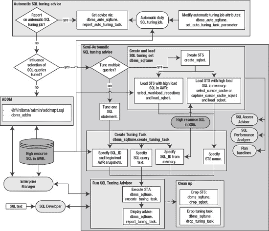

**图 11-1.** Oracle 的自动 SQL 调优工具

本章的前几个实践方法涉及`自动 SQL 调优`功能。你将学习如何确定自动作业是否启用以及何时运行，以及如何修改其特性。本章中间部分重点介绍如何创建和管理 SQL 调优集。SQL 调优集被广泛用作各种 Oracle 性能调优工具的输入。最后，本章向你展示如何手动运行`SQL 调优建议器`和`ADDM`，为 SQL 语句生成性能建议。

 **注意** 在本章的示例中，我们侧重于向你展示如何通过 SQL 和内置 PL/SQL 包来使用功能。虽然我们确实展示了一些来自`Enterprise Manager`的截图，但我们不关注图形工具的使用。无论`Enterprise Manager`是否安装，你都应该能够使用 SQL 和 PL/SQL。此外，手动方法让你能够理解流程的每个环节，并在问题出现时帮助你进行诊断。

### 11-1. 显示自动 SQL 调优作业详细信息

#### 问题

你有一个 Oracle Database 11g 环境，并想确定`自动 SQL 调优`作业是否已启用并定期运行。如果作业已启用，你想显示其他方面信息，例如它何时启动以及执行多长时间。

#### 解决方案

使用以下查询来确定是否有任何`自动 SQL 调优`作业已启用：

```sql
SELECT client_name, status, consumer_group, window_group
FROM dba_autotask_client
ORDER BY client_name;
```

以下输出显示有三个启用的自动作业在运行，其中一个是`SQL 调优建议器`：

```
CLIENT_NAME                      STATUS   CONSUMER_GROUP            WINDOW_GROUP
------------------------------- -------- ------------------------- --------------------
sql tuning advisor              ENABLED  ORA$AUTOTASK_SQL_GROUP    ORA$AT_WGRP_SQ
auto space advisor              ENABLED  ORA$AUTOTASK_SPACE_GROUP  ORA$AT_WGRP_SA
auto optimizer stats collection ENABLED  ORA$AUTOTASK_STATS_GROUP  ORA$AT_WGRP_OS
```

运行以下查询以查看`自动 SQL 调优建议器`作业最近几次的运行情况：

```sql
SELECT task_name, status, TO_CHAR(execution_end,'DD-MON-YY HH24:MI')
FROM dba_advisor_executions
WHERE task_name='SYS_AUTO_SQL_TUNING_TASK'
ORDER BY execution_end;
```

以下是一些示例输出：

```
TASK_NAME                      STATUS     TO_CHAR(EXECUTION_END
------------------------------ ---------- ---------------------
SYS_AUTO_SQL_TUNING_TASK       COMPLETED   30-APR-11 06:00
SYS_AUTO_SQL_TUNING_TASK       COMPLETED   01-MAY-11 06:02
```


#### 工作原理

当你在 Oracle Database 11g 或更高版本中创建数据库时，Oracle 会自动实施三个自动维护任务：

*   自动 SQL 优化建议器
*   自动段顾问
*   自动优化器统计信息收集

这些任务被自动配置为在维护窗口中运行。维护窗口是指定任务运行的时间和持续时长。你可以使用此查询查看维护窗口的详细信息：

```sql
SELECT window_name,TO_CHAR(window_next_time,'DD-MON-YY HH24:MI:SS')
,sql_tune_advisor, optimizer_stats, segment_advisor
FROM dba_autotask_window_clients;
```

以下是此示例的输出片段：

```sql
WINDOW_NAME      TO_CHAR(WINDOW_NEXT_TIME SQL_TUNE OPTIMIZE SEGMENT_
---------------- ------------------------ -------- -------- --------
THURSDAY_WINDOW  28-APR-11 22:00:00       ENABLED  ENABLED  ENABLED
FRIDAY_WINDOW    29-APR-11 22:00:00       ENABLED  ENABLED  ENABLED
SATURDAY_WINDOW  30-APR-11 06:00:00       ENABLED  ENABLED  ENABLED
SUNDAY_WINDOW    01-MAY-11 06:00:00       ENABLED  ENABLED  ENABLED
```

有几个与自动调度任务相关的数据字典视图。有关这些视图的描述，请参见表 11-1。

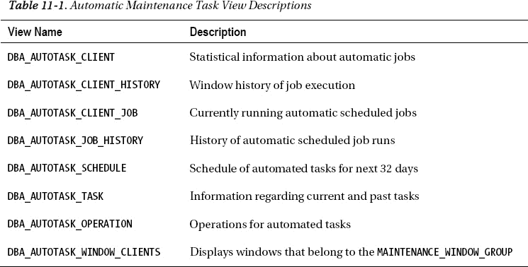

### 11-2. 显示自动 SQL 优化建议

#### 问题

你已知 Oracle 会自动运行一个每日任务来生成 SQL 优化建议。你希望查看该建议。

#### 解决方案

如果你使用的是 Oracle Database 11g Release 2 或更高版本，以下是显示自动生成的 SQL 优化建议的最快方法：

```sql
SQL> SET LINESIZE 80 PAGESIZE 0 LONG 100000
SQL> SELECT DBMS_AUTO_SQLTUNE.REPORT_AUTO_TUNING_TASK FROM DUAL;
```

 **注意** 从 Oracle Database 11g Release 2 开始，应使用 `DBMS_AUTO_SQLTUNE` 包（而不是 `DBMS_SQLTUNE`）来管理自动 SQL 优化功能。如果你使用的是旧版 Oracle，请使用 `DBMS_SQLTUNE.REPORT_AUTO_TUNING_TASK` 查看自动 SQL 优化建议。

根据数据库的活动情况，输出内容可能会非常多。以下是一个非常活跃的数据库输出的一小部分样本：

```sql
GENERAL INFORMATION SECTION
-------------------------------------------------------------------------------
Tuning Task Name                        : SYS_AUTO_SQL_TUNING_TASK
Tuning Task Owner                       : SYS
Workload Type                           : Automatic High-Load SQL Workload
Execution Count                         : 30
Current Execution                       : EXEC_3483
Execution Type                          : TUNE SQL
Scope                                   : COMPREHENSIVE
.....
Completion Status                       : COMPLETED
Started at                              : 04/10/2011 06:00:01
Completed at                            : 04/10/2011 06:02:41
Number of Candidate SQLs                : 103
Cumulative Elapsed Time of SQL (s)      : 49124
-------------------------------------------------------------------------------
SUMMARY SECTION
-------------------------------------------------------------------------------
                      Global SQL Tuning Result Statistics
-------------------------------------------------------------------------------
Number of SQLs Analyzed                      : 103
Number of SQLs in the Report                 : 8
Number of SQLs with Findings                 : 8
Number of SQLs with Alternative Plan Findings: 1
Number of SQLs with SQL profiles recommended : 1
-------------------------------------------------------------------------------
    SQLs with Findings Ordered by Maximum (Profile/Index) Benefit, Object ID
-------------------------------------------------------------------------------
object ID  SQL ID        statistics profile(benefit) index(benefit) restructure
---------- ------------- ---------- ---------------- -------------- -----------
      9130 crx9h7tmwwv67                      51.44%
```

**自动通过电子邮件发送 SQL 输出**

在 Linux/Unix 系统上，实现 SQL 脚本输出的自动电子邮件发送相当容易。首先将 SQL 封装在 shell 脚本中，然后使用 `cron` 等实用程序来自动执行并生成电子邮件。以下是一个示例 shell 脚本：

```bash
#!/bin/bash
if [ $# -ne 1 ]; then
  echo "Usage: $0 SID"
  exit 1
fi
# source oracle OS variables
. /var/opt/oracle/oraset $1
#
BOX=`uname -a | awk '{print$2}'`
OUTFILE=$HOME/bin/log/sqladvice.txt
#
sqlplus -s <<EOF
mv_maint/foo
SPO $OUTFILE
SET LINESIZE 80 PAGESIZE 0 LONG 100000
SELECT DBMS_AUTO_SQLTUNE.REPORT_AUTO_TUNING_TASK FROM DUAL;
EOF
cat $OUTFILE | mailx -s "SQL Advice: $1 $BOX" larry@oracle.com
exit 0
```

以下是对应的 `cron` 条目，用于每日运行该报告：

```bash
#-----------------------------------------------------------------
# SQL Advice report from SQL auto tuning
16 11 * * * /orahome/oracle/bin/sqladvice.bsh DWREP
   1>/orahome/oracle/bin/log/sqladvice.log 2>&1
#-----------------------------------------------------------------
```

在之前的 `cron` 条目中，命令被分成两行以适应本书页面的宽度。


## 工作原理

“解决方案”部分描述了一种简单方法，用于显示数据库中高负载查询的深度调优建议。根据数据库的活动和负载情况，报告可能不包含任何建议，也可能提供大量建议。自动 SQL 调优作业使用 AWR 中识别的高负载 SQL 语句作为报告的目标 SQL 语句。建议报告包含一个或多个以下通用小节：

*   基本信息
*   摘要
*   详细信息
*   调查结果
*   执行计划
*   备选执行计划
*   错误

基本信息部分包含有关开始和结束时间、考虑的 SQL 语句数量、SQL 语句的累计耗时等高级别信息。

摘要部分包含有关已分析 SQL 语句的信息，例如：

```
                      Global SQL Tuning Result Statistics
-------------------------------------------------------------------------------
Number of SQLs Analyzed                      : 26
Number of SQLs in the Report                 : 5
Number of SQLs with Findings                 : 5
Number of SQLs with Alternative Plan Findings: 1
Number of SQLs with SQL profiles recommended : 5
Number of SQLs with Index Findings           : 2
-------------------------------------------------------------------------------
    SQLs with Findings Ordered by Maximum (Profile/Index) Benefit, Object ID
-------------------------------------------------------------------------------
object ID  SQL ID        statistics profile(benefit) index(benefit) restructure
---------- ------------- ---------- ---------------- -------------- -----------
      1160 31q9w59vpt86t                     98.27%          99.90%
      1167 3u8xd0vf2pnhr                     98.64%
```

详细信息部分包含描述特定 SQL 语句的信息，例如所有者和 SQL 文本。以下是一个小示例：

```
DETAILS SECTION
-------------------------------------------------------------------------------
Statements with Results Ordered by Maximum (Profile/Index) Benefit, Object ID
-------------------------------------------------------------------------------
Object ID  : 1160
Schema Name: CHN_READ
SQL ID     : 31q9w59vpt86t
SQL Text   : SELECT "A2"."UMID","A2"."ORACLE_UNIQUE_ID","A2"."PUBLIC_KEY","A2"
             ."SERIAL_NUMBER",:1||"A1"."USER_NAME","A1"."USER_NAME",NVL("A2"."
             CREATE_TIME_DTT",:2),NVL("A2"."UPDATE_TIME_DTT",:3) FROM
             "COMPUTER_SYSTEM" "A2","USERS" "A1" WHERE
```

调查结果部分包含建议，例如接受 SQL 配置文件或创建索引，例如：

```
FINDINGS SECTION
-------------------------------------------------------------------------------
1- SQL Profile Finding (see explain plans section below)
--------------------------------------------------------
  A potentially better execution plan was found for this statement.
  Recommendation (estimated benefit: 98.27%)
  ------------------------------------------
  - Consider accepting the recommended SQL profile to use
parallel execution for this statement.
    execute dbms_sqltune.accept_sql_profile(task_name =>
            'SYS_AUTO_SQL_TUNING_TASK', object_id => 1160, task_owner =>
            'SYS', replace => => TRUE, profile_type => DBMS_SQLTUNE.PX_PROFILE);
................. 
2- Index Finding (see explain plans section below)
-------------------------------------------------
The execution plan of this statement can be improved by creating
one or more indices.
  Recommendation (estimated benefit: 99.9%)
  -----------------------------------------
  - Consider running the Access Advisor to improve the physical schema design
    or creating the recommended index.
    create index CHAINSAW.IDX$$_90890002 on
    CHAINSAW.COMPUTER_SYSTEM("UPDATE_TIME_DTT");
```

在适当情况下，会显示查询的原始执行计划以及建议的修复方案和新的执行计划。这样你可以查看调整前后的计划差异。这对于确定调查结果（如添加索引）是否会改善性能非常有用。

最后，报告还有一个错误部分。对于大多数场景，报告中通常不会有错误部分。

“解决方案”部分展示了如何从 SQL 语句中执行`REPORT_AUTO_TUNING_TASK`函数。此函数也可以从匿名 PL/SQL 块中调用。这是一个示例：

```
VARIABLE tune_report CLOB;
BEGIN
  :tune_report := DBMS_AUTO_SQLTUNE.report_auto_tuning_task(
    begin_exec   => NULL
   ,end_exec     => NULL
   ,type         => DBMS_AUTO_SQLTUNE.type_text
   ,level        => DBMS_AUTO_SQLTUNE.level_typical
   ,section      => DBMS_AUTO_SQLTUNE.section_all
   ,object_id    => NULL
   ,result_limit => NULL);
END;
/
--
SET LONG 1000000
PRINT :tune_report
```

`REPORT_AUTO_TUNING_TASK`函数的参数在表 11-2 中有详细描述。这些参数让你可以灵活地自定义建议输出。

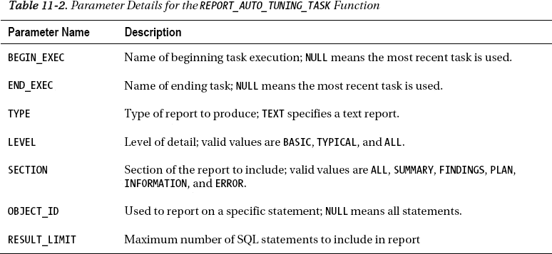

### 11-3. 生成用于实施自动调优建议的 SQL 脚本

### 问题

你已经生成了自动调优建议的报告。现在你想要生成一个可用于实施调优建议的 SQL 脚本。

### 解决方案

使用`DBMS_SQLTUNE.SCRIPT_TUNING_TASK`函数来生成实施调优任务建议的 SQL 语句。你需要提供自动调优任务的名称作为输入。在此示例中，任务名称为`SYS_AUTO_SQL_TUNING_TASK`：

```
SET LINES 132 PAGESIZE 0 LONG 10000
SELECT DBMS_SQLTUNE.SCRIPT_TUNING_TASK('SYS_AUTO_SQL_TUNING_TASK') FROM dual;
```

以下是此示例输出的一小部分：

```
execute dbms_stats.gather_index_stats(ownname => 'STAR2', indname => 'F_CONFIG_P
ROD_INST_FK1', estimate_percent => DBMS_STATS.AUTO_SAMPLE_SIZE);
create index NSESTAR.IDX$$_17F5F0004 on NSESTAR.D_DATES("FISCAL_YEAR","FISCAL_WE
EK_NUMBER_IN_YEAR","DATE_DTT");
```

### 工作原理

`SCRIPT_TUNING_TASK`函数生成用于实施自动 SQL 调优作业所推荐建议的 SQL 语句。如果调优任务没有任何建议，那么输出中将不会生成任何 SQL 语句。`SYS_AUTO_SQL_TUNING_TASK`是自动 SQL 调优任务的默认名称。如果你不确定此任务的详细信息，可以查询`DBA_ADVISOR_LOG`视图：

```
select task_name, execution_start from dba_advisor_log
where task_name='SYS_AUTO_SQL_TUNING_TASK'
order by 2;
```

以下是此示例的一些示例输出：

```
TASK_NAME                      EXECUTION
------------------------------ ---------
SYS_AUTO_SQL_TUNING_TASK       19-APR-11
```

### 11-4. 修改自动 SQL 调优功能

### 问题

你注意到，有时自动 SQL 调优建议作业会建议对 SQL 语句应用 SQL 配置文件（有关 SQL 配置文件的详细信息，请参见第 12 章）。调优建议作业的默认行为是不自动接受 SQL 配置文件建议。你想要修改此行为，让自动 SQL 调优作业自动将其推荐的任何 SQL 配置文件置于已接受状态。


## 解决方案

使用 `DBMS_AUTO_SQLTUNE.SET_AUTO_TUNING_TASK_PARAMETER` 过程来修改自动 SQL 调优的默认行为。例如，如果您希望自动接受 SQL 配置文件，可以按如下方式操作：

```sql
BEGIN
  DBMS_AUTO_SQLTUNE.SET_AUTO_TUNING_TASK_PARAMETER(
    parameter => 'ACCEPT_SQL_PROFILES', value => 'TRUE');
END;
/
```

您可以通过此查询验证是否启用了自动 SQL 配置文件接受：

```sql
SELECT parameter_name, parameter_value
FROM dba_advisor_parameters
WHERE task_name = 'SYS_AUTO_SQL_TUNING_TASK'
AND  parameter_name ='ACCEPT_SQL_PROFILES';
```

这是一些示例输出：

```
PARAMETER_NAME                 PARAMETER_VALUE
------------------------------ ------------------------------
ACCEPT_SQL_PROFILES            TRUE
```

要禁用 SQL 配置文件的自动接受，请向过程传递一个 `FALSE` 值：

```sql
BEGIN
  DBMS_AUTO_SQLTUNE.SET_AUTO_TUNING_TASK_PARAMETER(
    parameter => 'ACCEPT_SQL_PROFILES', value => 'FALSE');
END;
/
```

 `Note` 从 Oracle Database 11g Release 2 开始，应使用 `DBMS_AUTO_SQLTUNE` 包（而不是 `DBMS_SQLTUNE`）来管理自动 SQL 调优功能。

## 工作原理

`DBMS_AUTO_SQLTUNE.SET_AUTO_TUNING_TASK_PARAMETER` 过程允许您修改自动 SQL 调优作业的默认行为。您可以通过此查询查看自动 SQL 调优的所有当前设置：

```sql
SELECT parameter_name ,parameter_value
FROM dba_advisor_parameters
WHERE task_name = 'SYS_AUTO_SQL_TUNING_TASK'
AND  parameter_name IN ('ACCEPT_SQL_PROFILES',
                        'MAX_SQL_PROFILES_PER_EXEC',
                        'MAX_AUTO_SQL_PROFILES',
                        'EXECUTION_DAYS_TO_EXPIRE');
```

这是一些示例输出：

```
PARAMETER_NAME                 PARAMETER_VALUE
------------------------------ ------------------------------
ACCEPT_SQL_PROFILES            FALSE
EXECUTION_DAYS_TO_EXPIRE       30
MAX_SQL_PROFILES_PER_EXEC      20
MAX_AUTO_SQL_PROFILES          10000
```

前面的参数在 表 11-3 中描述。

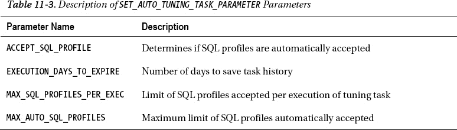

您还可以使用 Enterprise Manager 来管理自动 SQL 调优的相关功能。从主数据库页面，导航到“顾问中心”页面。接下来，单击“SQL 顾问”链接。现在单击“自动 SQL 调优结果”页面。您应该会看到一个类似于 图 11-2 的屏幕。

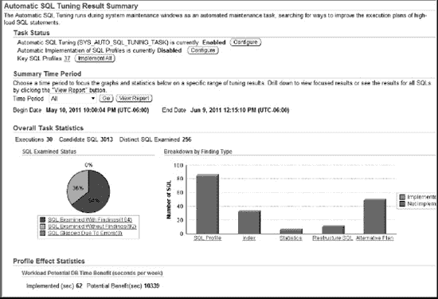

`图 11-2.` 使用 Enterprise Manager 管理自动 SQL 调优

从这个屏幕，您可以配置、查看结果、禁用和启用自动 SQL 调优的各个方面。

### 11-5. 禁用和启用自动 SQL 调优

#### 问题

您想要完全禁用，然后重新启用自动 SQL 调优作业。

#### 解决方案

使用 `DBMS_AUTO_TASK_ADMIN.DISABLE` 过程来禁用自动 SQL 调优作业。此示例禁用自动 SQL 调优顾问作业。

```sql
BEGIN
  DBMS_AUTO_TASK_ADMIN.DISABLE(
  client_name => 'sql tuning advisor',
  operation => NULL,
  window_name => NULL);
END;
/
```

要重新启用作业，请使用 `ENABLE` 过程，如下所示：

```sql
BEGIN
  DBMS_AUTO_TASK_ADMIN.ENABLE(
  client_name => 'sql tuning advisor',
  operation => NULL,
  window_name => NULL);
END;
/
```

您可以通过此查询报告自动调优作业的状态：

```sql
SELECT client_name ,status ,consumer_group
FROM dba_autotask_client
ORDER BY client_name;
```

这是一些示例输出：

```
CLIENT_NAME                      STATUS          CONSUMER_GROUP
-------------------------------- --------------- ------------------------------
auto optimizer stats collection  ENABLED         ORA$AUTOTASK_STATS_GROUP
auto space advisor               ENABLED         ORA$AUTOTASK_SPACE_GROUP
sql tuning advisor               ENABLED         ORA$AUTOTASK_SQL_GROUP
```

#### 工作原理

您可能希望禁用自动 SQL 调优作业，因为您的数据库非常活跃，并希望确保此作业不会影响数据库的整体性能。`DBMS_AUTO_TASK_ADMIN.ENABLE/DISABLE` 过程允许您打开和关闭自动 SQL 调优作业。这些过程接受三个参数（详见 表 11-4）。这些过程的行为取决于您传递的参数：

*   如果提供了 `CLIENT_NAME`，并且 `OPERATION` 和 `WINDOW_NAME` 都是 `NULL`，则禁用该客户端。
*   如果提供了 `OPERATION`，则禁用该操作。
*   如果提供了 `WINDOW_NAME`，并且 `OPERATION` 是 `NULL`，则在提供的窗口名称中禁用该客户端。

前面的参数允许您以精细的细节控制自动任务的调度。根据前面的规则，您可以按如下方式在周二维护窗口期间禁用自动 SQL 调优作业：

```sql
BEGIN
  dbms_auto_task_admin.disable(
  client_name => 'sql tuning advisor',
  operation => NULL,
  window_name => 'TUESDAY_WINDOW');
END;
/
```

您可以通过此查询验证窗口是否已被禁用：

```sql
SELECT window_name,TO_CHAR(window_next_time,'DD-MON-YY HH24:MI:SS')
,sql_tune_advisor
FROM dba_autotask_window_clients;
```

这是输出的一个片段：

```
WINDOW_NAME      TO_CHAR(WINDOW_NEXT_TIME SQL_TUNE
---------------- ------------------------ --------
TUESDAY_WINDOW   03-MAY-11 22:00:00       DISABLED
```

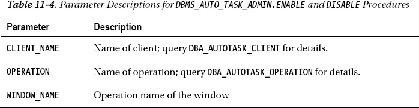

### 11-6. 修改维护窗口属性

#### 问题

您意识到自动任务（如自动 SQL 调优作业）在定期安排的维护窗口期间运行。您想要修改与维护窗口相关联的持续时间。

#### 解决方案

以下示例将周日维护窗口的持续时间更改为两小时：

```sql
BEGIN
  dbms_scheduler.set_attribute(
  name => 'SUNDAY_WINDOW',
  attribute => 'DURATION',
  value => numtodsinterval(2, 'hour'));
END;
/
```

您可以通过此查询确认对维护窗口的更改：

```sql
SELECT window_name, next_start_date, duration
FROM dba_scheduler_windows;
```

这是输出的一个片段：

```
WINDOW_NAME      NEXT_START_DATE                                   DURATION
---------------- ------------------------------------------------ --------
SATURDAY_WINDOW  07-MAY-11 06.00.00.000000 AM US/MOUNTAIN         +000 20:00:00
SUNDAY_WINDOW    08-MAY-11 06.00.00.000000 AM US/MOUNTAIN         +000 02:00:00
```

#### 工作原理

理解如何修改维护窗口的关键在于，它是数据库作业调度程序的一个属性，因此必须通过 `DBMS_SCHEDULER` 包来维护。当您安装 Oracle Database 11g 时，默认配置了三个自动维护作业：

*   自动 SQL 调优
*   统计信息收集
*   段建议

这些作业在预配置的每日维护窗口中自动执行。维护窗口由一周中的某天和作业运行的时长组成。

您可以通过此查询查看未来一个月的计划作业：

```sql
SELECT window_name, to_char(start_time,'dd-mon-yy hh24:mi'), duration
FROM dba_autotask_schedule
ORDER BY start_time;
```

这是输出的一个小样本：

```
WINDOW_NAME          TO_CHAR(START_TIME,'DD DURATION
-------------------- -------------------- --------------------
SATURDAY_WINDOW      14-may-11 06:00     +000 20:00:00
SUNDAY_WINDOW        15-may-11 06:00     +000 02:00:00
```

 `Tip` 有关管理计划作业的更多详细信息，请参阅 Oracle 的 *Database Administrator's Guide*（可在 Oracle Technology Network 网站上获取）。

### 11-7. 创建 SQL 调优集对象


## 问题

你正在处理一个需要分析一组 SQL 语句的性能问题。在将这些 SQL 语句作为一个集合处理之前，你需要创建一个 SQL 调优集对象。

## 解决方案

使用 `DBMS_SQLTUNE.CREATE_SQLSET` 过程来创建一个 SQL 调优集对象——例如：

```sql
BEGIN
  DBMS_SQLTUNE.CREATE_SQLSET(
  sqlset_name => 'HIGH_IO',
  description => 'High disk read tuning set');
END;
/
```

前面的代码创建了一个名为 `HIGH_IO` 的调优集。至此，你已经创建了一个命名的调优集对象。该调优集尚未包含任何 SQL 语句。

## 工作原理

在向调优集填充 SQL 语句之前，必须先创建一个 SQL 调优集对象（有关向 STS 添加 SQL 语句的详细信息，请参见配方 11-9 到 11-11）。你可以通过查询 `DBA_SQLSET` 视图来查看数据库中任何已定义的 SQL 调优集：

```sql
SQL> select id, name, created, statement_count from dba_sqlset;
```

以下是一些示例输出：

```
        ID NAME                           CREATED   STATEMENT_COUNT
---------- ------------------------------ --------- ---------------
         5 HIGH_IO                        26-APR-11               0
```

如果需要删除一个 SQL 调优集对象，则使用 `DBMS_SQLTUNE.DROP_SQLSET` 过程来删除调优集。以下示例删除了一个名为 `MY_TUNING_SET` 的调优集：

```sql
SQL> EXEC  DBMS_SQLTUNE.DROP_SQLSET(sqlset_name => 'MY_TUNING_SET' );
```

### 11-8. 在 AWR 中查看资源密集型 SQL

## 问题

在填充 SQL 调优集之前，你想查看 AWR 中的高负载 SQL 语句。你希望最终使用 AWR 中包含的 SQL 作为填充 SQL 调优集的输入。

## 解决方案

可以使用 `DBMS_SQLTUNE.SELECT_WORKLOAD_REPOSITORY` 函数来提取存储在 AWR 中的 SQL。这个特定的查询选择了快照 8200 到 8201 之间，按磁盘读取使用类别排名前 10 的 SQL：

```sql
SELECT
sql_id
,substr(sql_text,1,20)
,disk_reads
,cpu_time
,elapsed_time
FROM table(DBMS_SQLTUNE.SELECT_WORKLOAD_REPOSITORY(8200,8201,
            null, null, 'disk_reads',null, null, null, 10))
ORDER BY disk_reads DESC;
```

以下是一小段输出：

```
SQL_ID         SUBSTR(SQL_TEXT,1,20 DISK_READS      CPU_TIME  ELAPSED_TIME
-------------- -------------------- ---------- ------------- -------------
achffburdff9j   delete from "MVS"."      101145     814310000     991574249
5vku5ap6g6zh8  INSERT /*+ BYPASS_RE       98172      75350000      91527239
```

## 工作原理

在使用 SQL 调优集之前，理解你可以使用 `DBMS_SQLTUNE.SELECT_WORKLOAD_REPOSITORY` 函数从 AWR 中检索高资源使用率的 SQL 至关重要。这个 PL/SQL 函数检索的结果集可以用作填充 SQL 调优集的输入。有关 `SELECT_WORKLOAD_REPOSITORY` 函数参数的描述，请参见表 11-5。

你使用这个函数有很大的灵活性。几个例子将帮助说明这一点。假设你想从 AWR 中检索不是由 `SYS` 用户解析的 SQL。执行此操作的 SQL 如下：

```sql
SELECT sql_id, substr(sql_text,1,20)
,disk_reads, cpu_time, elapsed_time, parsing_schema_name
FROM table(
DBMS_SQLTUNE.SELECT_WORKLOAD_REPOSITORY(8200,8201,
'parsing_schema_name <> ''SYS''',
NULL, NULL,NULL,NULL, 1, NULL, 'ALL'));
```

以下示例检索按缓冲区获取排名前 10 的非 `SYS` 用户查询：

```sql
SELECT
 sql_id
,substr(sql_text,1,20)
,disk_reads
,cpu_time
,elapsed_time
,buffer_gets
,parsing_schema_name
FROM table(
DBMS_SQLTUNE.SELECT_WORKLOAD_REPOSITORY(
 begin_snap => 21730
,end_snap => 22900
,basic_filter => 'parsing_schema_name <> ''SYS'''
,ranking_measure1 => 'buffer_gets'
,result_limit => 10
));
```

在前面的查询中，`SYS` 关键字被两个单引号括起来（换句话说，`SYS` 周围的不是双引号）。

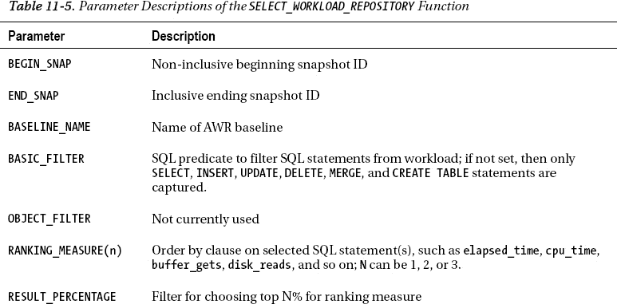

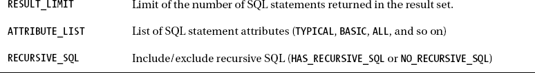

### 11-9. 在内存中查看资源密集型 SQL

## 问题

在填充 SQL 调优集之前，你想查看内存中游标缓存里的高负载 SQL 语句。你希望最终使用内存中包含的 SQL 作为填充 SQL 调优集的输入。

## 解决方案

使用 `DBMS_SQLTUNE.SELECT_CURSOR_CACHE` 函数查看内存中当前的高资源消耗 SQL 语句。此查询选择需要超过一百万次磁盘读取的内存中 SQL 语句：

```sql
SELECT
 sql_id
,substr(sql_text,1,20)
,disk_reads
,cpu_time
,elapsed_time
FROM table(DBMS_SQLTUNE.SELECT_CURSOR_CACHE('disk_reads > 1000000'))
ORDER BY sql_id;
```

以下是一些示例输出：

```
SQL_ID        SUBSTR(SQL_TEXT,1,20 DISK_READS   CPU_TIME ELAPSED_TIME
------------- -------------------- ---------- ---------- ------------
0s6gq1c890p4s  delete from "MVS"."    3325320 8756130000   1.0416E+10
b63h4skwvpshj BEGIN dbms_mview.ref    9496353 1.4864E+10   3.3006E+10
```

## 工作原理

在使用 SQL 调优集之前，理解你可以使用 `DBMS_SQLTUNE.SELECT_CURSOR_CACHE` 函数从内存中检索高资源使用率的 SQL 至关重要。这个 PL/SQL 函数检索的结果集可以用作填充 SQL 调优集的输入。有关 `SELECT_CURSOR_CACHE` 函数参数的描述，请参见表 11-6。

你使用这个函数有很大的灵活性。下面是一个例子，它选择内存中的 SQL，但排除了由 `SYS` 用户解析的语句，并且只返回经过时间大于 100,000 的语句：

```sql
SELECT sql_id, substr(sql_text,1,20)
,disk_reads, cpu_time, elapsed_time
FROM table(DBMS_SQLTUNE.SELECT_CURSOR_CACHE('parsing_schema_name <> ''SYS''
                                             AND elapsed_time > 100000'))
ORDER BY sql_id;
```

在前面的查询中，`SYS` 关键字被两个单引号括起来（换句话说，`SYS` 周围的不是双引号）。`SQL_TEXT` 列被截断为 20 个字符，以便输出更容易在页面上显示。以下是一些示例输出：

```
SQL_ID        SUBSTR(SQL_TEXT,1,20 DISK_READS   CPU_TIME ELAPSED_TIME
------------- -------------------- ---------- ---------- ------------
byzwu34haqmh4 SELECT /* DS_SVC */           0     140000       159828
```

一旦你确定了一个资源密集型 SQL 语句的 `SQL_ID`，你可以通过这个查询查看其所有执行细节：

```sql
SELECT *
FROM table(DBMS_SQLTUNE.SELECT_CURSOR_CACHE('sql_id = ''byzwu34haqmh4'''));
```

请注意，前面语句中的 `SQL_ID` 被两个单引号括起来（不是双引号）。

下一个例子选择内存中按 CPU 时间排名前 10 的非 `SYS` 用户查询：

```sql
SELECT
 sql_id
,substr(sql_text,1,20)
,disk_reads
,cpu_time
,elapsed_time
,buffer_gets
,parsing_schema_name
FROM table(
DBMS_SQLTUNE.SELECT_CURSOR_CACHE(
 basic_filter => 'parsing_schema_name <> ''SYS'''
,ranking_measure1 => 'cpu_time'
,result_limit => 10
));
```

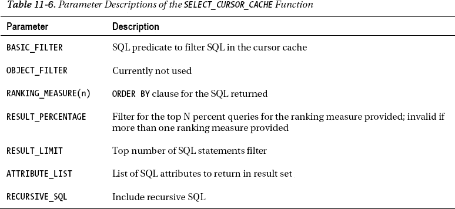

### 11-10. 从 AWR 中的高资源消耗 SQL 填充 SQL 调优集

## 问题

你想创建一个 SQL 调优集，并用在 AWR 中找到的 I/O 消耗最高的 SQL 语句来填充它。


#### 解决方案

使用以下步骤，从 AWR 中高资源消耗的语句填充 SQL 调优集：

1.  创建一个 SQL 调优集对象。
2.  确定起始和结束的 AWR 快照 ID。
3.  使用在 AWR 中找到的高资源 SQL 填充 SQL 调优集。

前述步骤将在以下小节中详细说明。

##### 步骤 1：创建 SQL 调优集对象

创建一个 SQL 调优集。下面这段代码创建了一个名为 `IO_STS` 的调优集：

```sql
BEGIN
  dbms_sqltune.create_sqlset(
    sqlset_name => 'IO_STS'
   ,description => 'STS from AWR');
END;
/
```

##### 步骤 2：确定起始和结束的 AWR 快照 ID

如果您不确定数据库中有哪些可用的快照，可以运行 AWR 报告或从 `DBA_HIST_SNAPSHOTS` 中查询 `SNAP_ID`：

```sql
select snap_id, begin_interval_time
from dba_hist_snapshot order by 1;
```

##### 步骤 3：使用在 AWR 中找到的高资源 SQL 填充 SQL 调优集

现在，SQL 调优集将按磁盘读取排序，填充前 15 条 SQL 语句。起始和结束的 AWR 快照 ID 分别为 26800 和 26900：

```sql
DECLARE
  base_cur dbms_sqltune.sqlset_cursor;
BEGIN
  OPEN base_cur FOR
    SELECT value(x)
    FROM table(dbms_sqltune.select_workload_repository(
      26800,26900, null, null,'disk_reads',
      null, null, null, 15)) x;
  --
  dbms_sqltune.load_sqlset(
    sqlset_name => 'IO_STS',
    populate_cursor => base_cur);
END;
/
```

上述代码填充了 AWR 中按磁盘读取排序的前 15 条 SQL 语句。`DBMS_SQLTUNE.SELECT_WORKLOAD_REPOSITORY` 函数用于根据排名条件，使用 AWR 信息填充一个 PL/SQL 游标。然后，使用 `DBMS_SQLTUNE.LOAD_SQLSET` 过程，以该游标为输入来填充 SQL 调优集。

#### 工作原理

`DBMS_SQLTUNE.SELECT_WORKLOAD_REPOSITORY` 函数可以通过多种方式使用 AWR 中的查询来填充 SQL 调优集。您可以指示它按磁盘读取、耗用时间、CPU 时间、缓冲区获取等条件加载 SQL 语句。有关此函数的参数描述，请参见表 11-5。当指定 AWR 作为输入时，可以使用以下任一方式：

*   起始和结束的 AWR 快照 ID
*   您先前创建的 AWR 基线

您可以通过此查询查看 SQL 调优集（在“解决方案”部分中创建）的详细信息：

```sql
SELECT
 sqlset_name
,elapsed_time
,cpu_time
,buffer_gets
,disk_reads
,sql_text
FROM dba_sqlset_statements
WHERE sqlset_name = 'IO_STS';
```

### 11-11. 从内存中的高资源消耗 SQL 填充 SQL 调优集

#### 问题

您希望从当前在内存中的高资源消耗 SQL 语句填充一个调优集。

#### 解决方案

使用 `DBMS_SQLTUNE.SELECT_CURSOR_CACHE` 函数，用当前在内存中的语句填充 SQL 调优集。此示例创建一个调优集，并用不属于 `SYS` 模式且磁盘读取大于 1,000,000 的高负载资源消耗语句填充它：

```sql
-- 创建调优集
EXEC DBMS_SQLTUNE.CREATE_SQLSET('HIGH_DISK_READS');
-- 从游标缓存填充调优集
DECLARE
  cur DBMS_SQLTUNE.SQLSET_CURSOR;
BEGIN
  OPEN cur FOR
  SELECT VALUE(x)
  FROM table(
  DBMS_SQLTUNE.SELECT_CURSOR_CACHE(
  'parsing_schema_name <> ''SYS'' AND disk_reads > 1000000',
  NULL, NULL, NULL, NULL, 1, NULL,'ALL')) x;
--
  DBMS_SQLTUNE.LOAD_SQLSET(sqlset_name => 'HIGH_DISK_READS',
    populate_cursor => cur);
END;
/
```

在上述代码中，请注意 `SYS` 用户被两组单引号（不是双引号）包围。`SELECT_CURSOR_CACHE` 函数将 SQL 语句加载到 PL/SQL 游标中，`LOAD_SQLSET` 过程则使用这些 SQL 语句填充 SQL 调优集。

#### 工作原理

`DBMS_SQLTUNE.SELECT_CURSOR_CACHE` 函数（有关函数参数描述，请参见表 11-6）允许您从内存中提取 SQL 语句及相关统计信息到 SQL 调优集。该过程允许您根据各种资源消耗条件过滤 SQL 语句，例如：

*   `ELAPSED_TIME`（耗用时间）
*   `CPU_TIME`（CPU 时间）
*   `BUFFER_GETS`（缓冲区获取）
*   `DISK_READS`（磁盘读取）
*   `DIRECT_WRITES`（直接写入）
*   `ROWS_PROCESSED`（处理行数）

这为您如何过滤和填充 SQL 调优集提供了极大的灵活性。

### 11-12. 用内存中的所有 SQL 填充 SQL 调优集

#### 问题

您希望创建一个 SQL 调优集，并用当前在内存中的所有 SQL 语句填充它。

#### 解决方案

使用 `DBMS_SQLTUNE.CAPTURE_CURSOR_CACHE_SQLSET` 过程，高效捕获当前存储在游标缓存（内存中）的所有 SQL。此示例创建一个名为 `PROD_WORKLOAD` 的 SQL 调优集，然后通过采样内存 3,600 秒（每次轮询事件之间等待 20 秒）进行填充：

```sql
BEGIN
  -- 创建调优集
  DBMS_SQLTUNE.CREATE_SQLSET(
    sqlset_name => 'PROD_WORKLOAD'
   ,description => 'Prod workload sample');
  --
  DBMS_SQLTUNE.CAPTURE_CURSOR_CACHE_SQLSET(
    sqlset_name     => 'PROD_WORKLOAD'
   ,time_limit      => 3600
   ,repeat_interval => 20);
END;
/
```

#### 工作原理

`DBMS_SQLTUNE.CAPTURE_CURSOR_CACHE_SQLSET` 过程允许您轮询内存中的查询，并使用找到的任何查询来填充 SQL 调优集。当需要捕获所有正在执行的 SQL 语句的样本集时，这是一种强大的技术。

在指示 `DBMS_SQLTUNE.CAPTURE_CURSOR_CACHE_SQLSET` 捕获内存中的 SQL 语句方面，您拥有极大的灵活性（有关所有参数的详细信息，请参见表 11-7）。例如，您可以通过指定 `CAPTURE_MODE` 为 `DBMS_SQLTUNE.MODE_ACCUMULATE_STATS`，来指示该过程捕获每条 SQL 语句的累计统计信息集。

```sql
BEGIN
  DBMS_SQLTUNE.CAPTURE_CURSOR_CACHE_SQLSET(
    sqlset_name     => 'PROD_WORKLOAD'
   ,time_limit      => 60
   ,repeat_interval => 10
   ,capture_mode    => DBMS_SQLTUNE.MODE_ACCUMULATE_STATS);
END;
/
```

这比默认设置更消耗资源，但能为每条 SQL 语句生成更准确的统计信息。

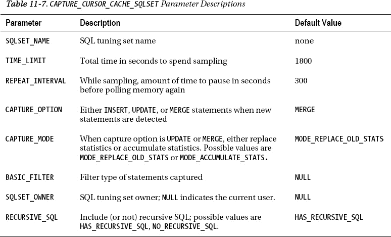

### 11-13. 显示 SQL 调优集的内容

#### 问题

您已填充了一个 SQL 调优集，并希望验证其特性，例如 SQL 语句及相应的统计信息。

#### 解决方案

您可以通过此查询确定数据库中 SQL 调优集的名称和 SQL 语句数量：

```sql
SELECT name, created, statement_count
FROM dba_sqlset;
```

以下是一些示例输出：

```
NAME                           CREATED   STATEMENT_COUNT
------------------------------ --------- ---------------
test1                          19-APR-11              29
```

使用以下查询显示 SQL 调优集中每个查询的 SQL 文本及相关统计信息：

```sql
SELECT sqlset_name, elapsed_time, cpu_time, buffer_gets, disk_reads, sql_text
FROM dba_sqlset_statements;
```

下面是一小段输出。为了适应页面显示，`SQL_TEXT` 列已被截断：

```
SQLSET_NAME     ELAPSED_TIME   CPU_TIME BUFFER_GETS DISK_READS SQL_TEXT
--------------- ------------ ---------- ----------- ---------- ----------------------------
test1              235285363   45310000      112777       3050 INSERT ......
test1               52220149   22700000      328035      18826  delete from.....
```

#### 工作原理

回想一下，一个 SQL 调优集包含一个或多个 SQL 语句及其对应的执行统计信息。这些信息可以从 `DBA_SQLSET_*` 视图中查看。表 11-8 描述了这些视图中包含的 SQL 调优集信息类型。

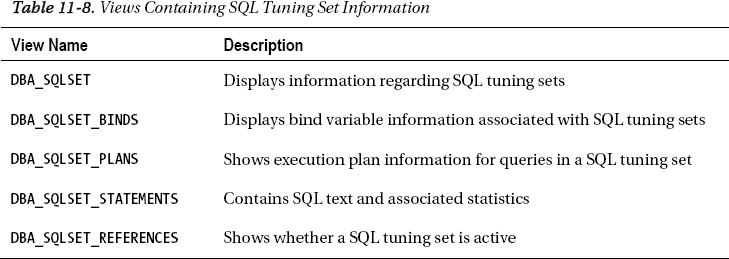

您也可以使用 `DBMS_SQLTUNE.SELECT_SQLSET` 函数来检索关于 SQL 调优集的信息——例如：

```sql
SELECT
  sql_id
  ,elapsed_time
  ,cpu_time
  ,buffer_gets
  ,disk_reads
  ,sql_text
FROM TABLE(DBMS_SQLTUNE.SELECT_SQLSET('&&sqlset_name'));
```

究竟是使用 `DBMS_SQLTUNE.SELECT_SQLSET` 函数还是直接查询数据字典视图，完全取决于您的个人偏好或业务需求。

### 11-14. 从 SQL 调优集中选择性删除语句

#### 问题

您想要从 STS 中删除那些不符合特定性能度量的 SQL 语句，例如删除磁盘读取少于 2,000,000 次的查询。

#### 解决方案

首先，查看与某个 STS 关联的现有 SQL 信息：

```sql
select sqlset_name, disk_reads, cpu_time, elapsed_time, buffer_gets
from dba_sqlset_statements;
```

以下是一些示例输出：

```
SQLSET_NAME                       DISK_READS   CPU_TIME ELAPSED_TIME BUFFER_GETS
------------------------------ ---------- ---------- ------------ -----------
IO_STS                             3112941 3264960000   7805935285     2202432
IO_STS                             2943527 3356460000   8930436466     1913415
IO_STS                             2539642 2310610000   5869237421     1658465
IO_STS                             1999373 2291230000   6143543429     1278601
IO_STS                             1993973 2243180000   5461607976     1272271
IO_STS                             1759096 1930320000   4855618689     1654252
```

现在，使用 `DBMS_SQLTUNE.DELETE_SQLSET` 过程，根据指定的条件从 STS 中移除 SQL 语句。此示例从名为 `IO_STS` 的 SQL 调优集中删除磁盘读取少于 2,000,000 次的 SQL 语句：

```sql
BEGIN
  DBMS_SQLTUNE.DELETE_SQLSET(
    sqlset_name  => 'IO_STS'
   ,basic_filter => 'disk_reads < 2000000');
END;
/
```

#### 工作原理

理解的关键在于，一个 SQL 调优集由以下部分组成：

*   一个或多个 SQL 语句
*   每个 SQL 语句的关联度量/统计信息

因为度量/统计信息是 STS 的一部分，所以您可以基于关联度量/统计信息的特性，从 SQL 调优集中删除 SQL 语句。您可以使用 `DBMS_SQLTUNE.DELETE_SQLSET` 过程，基于诸如以下的统计信息来删除 STS 中的语句：

*   `ELAPSED_TIME`
*   `CPU_TIME`
*   `BUFFER_GETS`
*   `DISK_READS`
*   `DIRECT_WRITES`
*   `ROWS_PROCESSED`

如果您想删除 SQL 调优集中的所有 SQL 语句，则不要指定过滤器——例如：

```
SQL> exec   DBMS_SQLTUNE.DELETE_SQLSET(sqlset_name  => 'IO_STS');
```

### 11-15. 传输 SQL 调优集

#### 问题

您已在生产环境中识别出一些资源消耗大的 SQL 语句。您希望将这些语句和相关的统计信息传输到测试环境，以便您可以在不影响生产的情况下对这些语句进行调优。

#### 解决方案

以下步骤用于将 SQL 调优集从一个数据库复制到另一个数据库：

1.  在源数据库中创建一个暂存表。
2.  用 STS 数据填充暂存表。
3.  将暂存表复制到目标数据库。
4.  在目标数据库中解包暂存表。

上述步骤将在以下小节中详细阐述。

##### 步骤 1：在源数据库中创建暂存表

使用 `DBMS_SQLTUNE.CREATE_STGTAB_SQLSET` 过程创建一个表，该表将用于包含 SQL 调优集元数据。此示例创建一个名为 `STS_TABLE` 的表：

```sql
BEGIN
  dbms_sqltune.create_stgtab_sqlset(
  table_name => 'STS_TABLE'
,schema_name => 'MV_MAINT');
END;
/
```

##### 步骤 2：用 STS 数据填充暂存表

现在使用 `DBMS_SQLTUNE.PACK_STGTAB_SQLSET` 用 STS 元数据填充暂存表：

```sql
BEGIN
  dbms_sqltune.pack_stgtab_sqlset(
  sqlset_name          => 'IO_STS'
 ,sqlset_owner         => 'SYS'
 ,staging_table_name   => 'STS_TABLE'
 ,staging_schema_owner => 'MV_MAINT');
END;
/
```

如果您不确定要传输的 STS 名称，可以运行以下查询获取详细信息：

```sql
SELECT name, owner, created, statement_count
FROM dba_sqlset;
```

##### 步骤 3：将暂存表复制到目标数据库

您可以通过 Data Pump、旧的 `exp`/`imp` 实用程序或使用数据库链接将表从一个数据库复制到另一个数据库。此示例在目标数据库中创建一个数据库链接，然后从源数据库复制表：

```sql
create database link source_db
connect to mv_maint
identified by foo
using 'source_db';
```

在目标数据库中，可以使用 `CREATE TABLE AS SELECT` 语句直接从源数据库复制表：

```
SQL> create table STS_TABLE as select * from STS_TABLE@source_db;
```

##### 步骤 4：在目标数据库中解包暂存表

使用 `DBMS_SQLTUNE.UNPACK_STGTAB_SQLSET` 过程，获取暂存表的内容并用 SQL 调优集元数据填充数据字典。此示例解包暂存表中包含的所有 SQL 调优集：

```sql
BEGIN
DBMS_SQLTUNE.UNPACK_STGTAB_SQLSET(
  sqlset_name        => '%'
 ,replace            => TRUE
 ,staging_table_name => 'STS_TABLE');
END;
/
```

#### 工作原理

一个 SQL 调优集包含一个或多个查询及其对应的执行统计信息。您偶尔会需要将 SQL 调优集从一个数据库复制到另一个数据库。例如，您可能遇到了生产数据库的性能问题，但希望捕获并移动消耗资源最多的语句到一个测试数据库，在那里您可以诊断 STS 中的 SQL，而不影响生产。

请记住，STS 可作为以下任何工具的输入：

*   SQL 调优顾问
*   SQL 访问顾问
*   SQL 执行计划管理
*   SQL 性能分析器

上述工具被广泛用于故障排除和测试 SQL 性能。将 SQL 调优集从一个环境传输到另一个环境，使您可以在测试或开发环境中使用这些工具。

 **注意** SQL 调优集只能传输到 Oracle Database 10g R2 或更高版本的数据库。

### 11-16. 创建调优任务

#### 问题

您意识到，作为手动运行 SQL 调优顾问的一部分，您需要首先创建一个调优任务。

 **提示** 有关手动运行 SQL 调优顾问所需的过程流详情，请参阅图 11-1。

## 解决方案

使用 `DBMS_SQLTUNE.CREATE_TUNING_TASK` 过程来创建 SQL 调优任务。在创建 SQL 调优任务时，可以使用以下输入：

*   特定 SQL 语句的文本
*   从内存中游标缓存获取的特定 SQL 语句的标识符
*   给定一系列快照 ID 的 AWR 中的单个 SQL 语句
*   SQL 调优集名称（关于如何创建 SQL 调优集的详细信息，请参见方案 11-7 至 11-11）

以下小节描述了创建 SQL 调优任务的上述技术示例。

 注意：创建调优任务的用户需要 `ADMINISTER SQL MANAGEMENT OBJECT` 系统权限。

### 特定 SQL 语句的文本

此示例在创建调优任务时提供 SQL 语句的文本：

```
DECLARE
  tune_task VARCHAR2(30);
  tune_sql  CLOB;
BEGIN
  tune_sql := 'select count(*) from mgmt_db_feature_usage_ecm';
  tune_task := DBMS_SQLTUNE.CREATE_TUNING_TASK(
    sql_text    => tune_sql
   ,user_name   => 'MV_MAINT'
   ,scope       => 'COMPREHENSIVE'
   ,time_limit  => 60
   ,task_name   => 'tune_test'
   ,description => 'Provide SQL text'
);
END;
/
```

### 从游标缓存获取的特定 SQL 语句的 SQL ID

首先通过查询 `V$SQL` 来识别 `SQL_ID`：

```
SELECT sql_id, sql_text
FROM v$sql where sql_text like '%&&mytext%';
```

一旦有了 `SQL_ID`，就可以将其作为输入提供给 `DBMS_SQLTUNE.CREATE_TUNING_TASK`：

```
DECLARE
  tune_task VARCHAR2(30);
  tune_sql  CLOB;
BEGIN
  tune_task := DBMS_SQLTUNE.CREATE_TUNING_TASK(
    sql_id      => '98u3gf0xzq03f'
   ,task_name   => 'tune_test2'
   ,description => 'Provide SQL ID'
);
END;
/
```

### 给定一系列快照 ID 的 AWR 中的单个 SQL 语句

以下是一个通过提供 `SQL_ID` 和一系列 AWR 快照 ID 来创建 SQL 调优任务的示例：

```
DECLARE
  tune_task VARCHAR2(30);
  tune_sql  CLOB;
BEGIN
  tune_task := DBMS_SQLTUNE.CREATE_TUNING_TASK(
    sql_id      => '1tbu2jp7kv0pm'
   ,begin_snap  => 21690
   ,end_snap    => 21864
   ,task_name   => 'tune_test3'
);
END;
/
```

如果不确定使用哪个 `SQL_ID`（及相关查询），请运行此查询：

```
SQL> select sql_id, sql_text from dba_hist_sqltext;
```

如果不知道可用的快照 ID，请运行此查询：

```
SQL> select snap_id from dba_hist_snapshot order by 1;
```

 提示：默认情况下，AWR 只包含高资源消耗的查询。你可以通过以下方式将特定 SQL 语句添加到 AWR（无论其资源消耗如何），从而修改此行为以确保其包含在每个快照中：

```
SQL> exec dbms_workload_repository.add_colored_sql('98u3gf0xzq03f');
```

### SQL 调优集名称

如果需要针对多个 SQL 查询运行 SQL 调优顾问，则需要一个 SQL 调优集。要使用 SQL 调优集作为输入创建调优任务，请按如下方式操作：

```
SQL> variable mytt varchar2(30);
SQL> exec :mytt := DBMS_SQLTUNE.CREATE_TUNING_TASK(sqlset_name => 'IO_STS');
SQL> print :mytt
```

## 工作原理

在手动执行 SQL 调优顾问之前，首先需要定义将哪些 SQL 语句用作输入。这是通过创建 SQL 调优任务来完成的。Oracle 在如何向调优任务添加 SQL 语句方面提供了极大的灵活性。如“解决方案”部分所示，你可以执行以下操作：

*   硬编码特定 SQL 查询的文本
*   使用内存中的 SQL 查询
*   使用 AWR 中的 SQL 查询
*   在调优多个查询时定义 SQL 调优集

上述技术提供了多种方法来识别将由 SQL 调优顾问分析的 SQL 语句。创建调优任务后，可以通过此查询查看其详细信息：

```
select owner, task_name, advisor_name, created
from dba_advisor_tasks
order by created;
```

创建调优任务后，现在可以手动执行 SQL 调优顾问（方案 11-17）。如果需要删除调优任务，可以按如下方式操作：

```
SQL> exec dbms_sqltune.drop_tuning_task(task_name => '&&task_name');
```

### 11-17. 手动运行 SQL 调优顾问

#### 问题

你想要手动执行 SQL 调优顾问并获取针对某条 SQL 语句的调优建议。

#### 解决方案

按照以下步骤手动运行 SQL 调优顾问：

1.  创建一个调优任务（完整细节请参见方案 11-16）；这定义了哪些 SQL 语句将被调优。这可以是单个 SQL 语句，也可以是 SQL 调优集中的多个 SQL 语句。
2.  执行调优任务。
3.  显示调优任务的结果。

此示例为单个 SQL 语句运行 SQL 调优顾问。首先创建一个调优任务。

```
DECLARE
  tune_task VARCHAR2(30);
  tune_sql  CLOB;
BEGIN
  tune_sql := 'select a.emp_id, b.dept_name ' ||
              'from emp a, dept b ' ||
              'where a.dept_id = b.dept_id';
  --
  tune_task := DBMS_SQLTUNE.CREATE_TUNING_TASK(
    sql_text    => tune_sql
   ,user_name   => 'MV_MAINT'
   ,scope       => 'COMPREHENSIVE'
   ,time_limit  => 60
   ,task_name   => 'tune_test'
   ,description => 'Tune a SQL statement.'
);
END;
/
```

接下来执行调优任务：

```
SQL> exec dbms_sqltune.execute_tuning_task(task_name => 'tune_test');
```

最后，生成一份报告显示调优建议：

```
SQL> set long 10000 longchunksize 10000
SQL> set linesize 132 pagesize 200
SQL> select dbms_sqltune.report_tuning_task('tune_test') from dual;
```

以下是一些示例输出：

```
1- 统计信息查找
---------------------
  表 "MV_MAINT"."DEPT" 未被分析。
  建议
  --------------
  - 考虑为此表收集优化器统计信息。
....
2- 索引查找（参见下面的执行计划部分）
--------------------------------------------------
  通过创建一个或多个索引，可以改进此语句的执行计划。
  建议（预计收益：97.98%）
  ------------------------------------------
  - 考虑运行访问顾问以改进物理模式设计，或创建推荐的索引。
    create index MV_MAINT.IDX$$_21E10001 on MV_MAINT.EMP("DEPT_ID");
```

上述输出包含关于为查询中的表生成统计信息以及添加索引的具体建议。你需要在生产环境实施这些建议之前对其进行测试，以确保性能确实有所提升。

### 优化器调优模式

优化器在两种不同的模式下运行：常规模式和调优模式。当执行 SQL 语句时，优化器运行在常规模式下，并快速确定一个合理的执行计划。在此模式下，优化器只花费几分之一秒的时间来尝试确定最佳计划。

当 SQL 调优顾问分析查询时，它让优化器运行在调优模式下。在此模式下，优化器可能花费几分钟来分析执行计划的每个步骤，并生成一个可能比常规模式下生成的计划效率高得多的执行计划。

这有点像计算机象棋游戏。如果你允许象棋软件每步只花一秒或更少的时间，很容易击败程序。然而，如果你允许象棋游戏每步花一分钟或更长时间，在此模式下，游戏会做出更优的决策。


### 11-18. 从自动数据库诊断监视器获取 SQL 调优建议

## 工作原理

SQL 调优顾问有助于自动化调整性能不佳的查询任务。该工具相当易于使用，它会就如何调优查询提供建议，例如：

*   重写 SQL
*   添加索引
*   实施 SQL 概要文件或计划基线
*   生成统计信息

你还可以从 SQL Developer 或 Enterprise Manager 手动运行 SQL 调优顾问。接下来的两个小节将简要介绍如何从这些工具运行 SQL 调优顾问。

### 从 SQL Developer 运行 SQL 调优顾问

如果你可以访问 SQL Developer 3.0 或更高版本，那么为查询运行 SQL 调优顾问就非常容易了。请按照以下简单步骤操作：

1.  打开一个 SQL 工作表。
2.  输入查询。
3.  单击与 SQL 调优顾问关联的按钮。

你将看到任何发现和建议。如果你可以访问 SQL Developer（可免费下载），这是运行 SQL 调优顾问最简单的方法。

 `注意` 在运行 SQL 调优顾问之前，请确保你连接的用户已被授予 `ADVISOR` 系统权限。

### 从 Enterprise Manager 运行 SQL 调优顾问

你也可以在 Enterprise Manager 中运行该顾问。登录 Enterprise Manager 并按照以下步骤操作：

1.  在主数据库页面，单击 `Advisor Central` 链接（靠近底部）。
2.  在顾问部分下，单击 `SQL Advisors` 链接。
3.  单击 `SQL Tuning Advisor` 链接。

你应该会看到一个类似于 图 11-3 所示的页面。

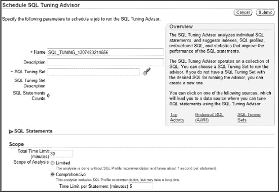

**图 11-3.** 从 Enterprise Manager 安排 SQL 调优顾问作业

从这里，你可以对顶级 SQL 语句或 AWR 中的 SQL 运行 SQL 调优顾问任务，或者提供一个 SQL 调优集作为输入。

## 问题

你想从自动数据库诊断监视器 (ADDM) 获取关于问题 SQL 语句的建议。

## 解决方案

你可以通过以下工具查看 ADDM 报告：

*   SQL*Plus 脚本
*   `DBMS_ADDM` 包
*   Enterprise Manager

以下小节详细阐述了这些技术。

### SQL 方法

你可以手动运行 ADDM 报告，如下所示：

```
SQL> @?/rdbms/admin/addmrpt.sql
```

系统将提示你指定开始和结束的快照。以下是一些示例输出：

```
实例     数据库名        快照 ID    快照开始时间    级别
------------ ------------ --------- ------------------ -----
DWREP        DWREP            26482 2011 年 04 月 09 日 08:00      1
                              26483 2011 年 04 月 09 日 09:00      1
                              26484 2011 年 04 月 09 日 10:00      1
                              26485 2011 年 04 月 09 日 11:00      1
                              26486 2011 年 04 月 09 日 12:00      1

指定开始和结束快照 ID
~~~~~~~~~~~~~~~~~~~~~~~~~~~~~~~~~~~~~~
输入 begin_snap 的值：
```

然后系统会提示你输入报告名称：

```
默认的报告文件名是 addmrpt_1_26468_26486.txt。若要使用此名称，
请按 <回车> 继续，否则请输入一个替代名称。
输入 report_name 的值：
```

报告执行后，你可以检查输出。有一个“顶级 SQL 语句”部分，报告针对顶级资源消耗 SQL 语句的调优建议。以下是一些示例输出：

```
发现 1: 顶级 SQL 语句
影响为 0.79 个活动会话，占总活动的 72.17%。
--------------------------------------------------------
发现了消耗大量数据库时间的 SQL 语句。这些
语句提供了性能改进的良好机会。
   建议 1: SQL 调优
   预估收益为 0.58 个活动会话，占总活动的 53.07%。
   -------------------------------------------------------------------
   操作
      调查 SQL_ID 为 "2nw0mmysuma43" 的 INSERT 语句，以
      寻求可能的性能改进。你可以使用此 SQL_ID 的 ASH 报告
      来补充此处提供的信息。
      相关对象
         SQL_ID 为 2nw0mmysuma43 的 SQL 语句。
         INSERT INTO bling
         ( registration_id,company
         ,soa_id,product_name
```

### DBMS_ADDM 包

`DBMS_ADDM` 包在 Oracle Database 11g R2 或更高版本中可用。使用 `DBMS_ADDM` 包时，必须传入有效的开始和结束 AWR 快照 ID 范围——例如：

```
var task_name varchar2(30);
exec DBMS_ADDM.ANALYZE_DB(:task_name, 8020, 8050);
print :task_name
```

以下是显示任务名称的一些示例输出：

```
TASK_NAME
-------------------------------
TASK_8676
```

如果你不确定有哪些快照可用，可以查询 `DBA_HIST_SNAPSHOT` 视图。接下来显示 ADDM 报告：

```
SET LONG 1000000 PAGESIZE 0;
SELECT DBMS_ADDM.GET_REPORT('TASK_8676') FROM DUAL;
```

输出可能相当长。以下是一个小片段，建议你为特定 SQL 语句运行 SQL 调优顾问：

```
   操作
      为 SQL_ID 为 "0s6gq1c890p4s" 的 DELETE 语句
      运行 SQL 调优顾问。
      相关对象
         SQL_ID 为 0s6gq1c890p4s 的 SQL 语句。
         delete from "MVS"."MGMT_DB_FEAT_USE_ECM_LATEST"
   理由
      该 SQL 语句 98% 的数据库时间花在 CPU、I/O 和集群等待上。
      这部分数据库时间可能通过 SQL 调优顾问得到改进。
```

### Enterprise Manager

首先，登录 Enterprise Manager。在主登录页面，你可以通过以下方式访问 Enterprise Manager 中的 ADDM 报告：

1.  在主数据库页面，单击 `Advisor Central` 链接（靠近底部）。
2.  在顾问部分下，单击 `ADDM` 链接。

你应该会看到一个类似于 图 11-4 所示的页面。

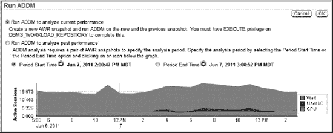

**图 11-4.** 从 Enterprise Manager 运行 ADDM

通过此页面，你可以运行 ADDM 来分析当前性能或调查过去的性能问题。

## 工作原理

ADDM 默认每小时分析一次 AWR 快照，并生成性能建议。这些建议按照实施后预期的收益进行排名。接下来列出了你可以从 ADDM 获得的建议类型：

*   昂贵的 SQL 语句
*   昂贵的 PL/SQL
*   RAC 问题
*   CPU 瓶颈
*   内存大小调整建议
*   数据库配置建议
*   I/O 瓶颈

如果你遇到数据库性能问题，ADDM 报告是首先寻找数据库瓶颈和问题区域的绝佳位置。ADDM 还会详细列出顶级资源消耗 SQL 语句，并就如何调优这些查询提出建议。


## 执行计划优化与一致性

执行计划描述了 Oracle 将如何检索数据以满足查询结果。当你提交一条 SQL 语句时，查询优化器会快速生成多个执行计划，并确定哪个计划效率最高。在大多数情况下，先前的默认行为会产生性能良好的执行计划。然而，你会遇到一些情况，即你了解环境的更多细节，并需要调整优化器对执行计划的选择。以下列出了一些功能，可用于影响优化器在选择计划时所使用的决策路径：

*   初始化参数
*   统计信息
*   提示
*   SQL 配置文件
*   SQL 计划管理（计划基线）
*   存储概要（已弃用，推荐使用计划基线）

理解这些功能如何影响优化器对执行计划的选择至关重要。在排查 SQL 性能问题时，你必须确定上述哪些功能已启用，以及它们如何影响查询行为。根据所实施的功能以及各种功能组合的影响，SQL 语句的性能可能会有天壤之别。

（影响优化器的）初始化参数和统计信息收集在第 13 章中有详细说明。使用提示是第 14 章的重点。本章的重点是 SQL 配置文件和计划基线。

*SQL 配置文件*是对统计信息的可选修正和改进。实现 SQL 配置文件的建议（及代码）通过 SQL 调优顾问的输出体现。你可以手动启用 SQL 配置文件，或将其配置为自动接受。SQL 配置文件有助于优化器推导出更好的执行计划。

*SQL 计划管理*允许你在数据库的表中存储和管理执行计划。*计划基线*由一个或多个已为某个 SQL 查询接受的、已存储的执行计划组成。当你运行一个查询时，如果该查询存在计划基线，优化器将优先考虑计划基线内的执行计划。*计划历史*是某个查询所有已接受和未接受的执行计划的超集。你可以手动将未接受计划的状态更改为已接受（这将把该计划移入计划基线）。这被称为*演化计划基线*。

计划基线有助于确保优化器始终选择相同的执行计划，而不受数据库环境变化的影响。计划基线提供以下好处：

*   在从一种数据库版本升级到另一种时保留性能；换句话说，有助于确保升级前后对同一查询使用相同的执行计划
*   当数据变更、统计信息更新或新的 SQL 配置文件可用时，保持性能稳定和一致
*   提供一种机制来接受新出现的更高效的执行计划（例如添加了新的索引或新的 SQL 配置文件可用时）

图 12-1 展示了优化器在选择执行计划时所做的决策流程。请花几分钟分析此图，并确保你理解各种功能如何影响优化器的行为。在查看图表时，请记住以下几点：

*   提示是唯一需要对 SQL 查询进行物理修改的功能。所有其他技术都可以在不更改查询的情况下用于提高性能。
*   初始化参数、统计信息、提示、SQL 配置文件和计划基线都可以独立运行。没有任何一个功能依赖于另一个功能的存在。
*   优化器在开箱即用的设置下也能正常工作。你不需要显式启用任何这些功能（如提示、SQL 配置文件等）。然而，为了获得 SQL 查询的最大性能，我们强烈建议你了解何时以及如何使用这些功能来帮助查询优化器做出最优决策。

当你查看这个镰刀形图表时，为了帮助理解优化器如何在低成本计划和计划基线计划之间进行选择，请考虑制定执行计划时采取的一般步骤：

1.  优化器首先考虑初始化参数、提示和 SQL 配置文件，以选择成本最低的计划。
2.  无论步骤 1 得出什么计划，如果该查询存在计划基线，优化器将从计划基线中选择成本最低的计划。此外，优化器将优先考虑在计划基线中状态为“固定”的计划。
3.  如果计划基线中的已接受计划无法重现（例如，所有计划基线计划所依赖的某个索引已被删除），则优化器选择步骤 1 中生成的成本最低的计划。此处的“最低成本”意味着使用最少的数据库资源，如 CPU、I/O 和内存。
4.  如果一个查询存在计划基线，并且低成本计划（来自步骤 1）的成本低于计划基线中的计划，则该低成本计划会自动以“未接受”状态添加到该查询的计划历史中。你可以选择将计划从计划历史移入计划基线，以便优化器在选择执行计划时考虑它们。这为你提供了灵活性，可以在出现更好的计划时使用它们（即计划的演化）。

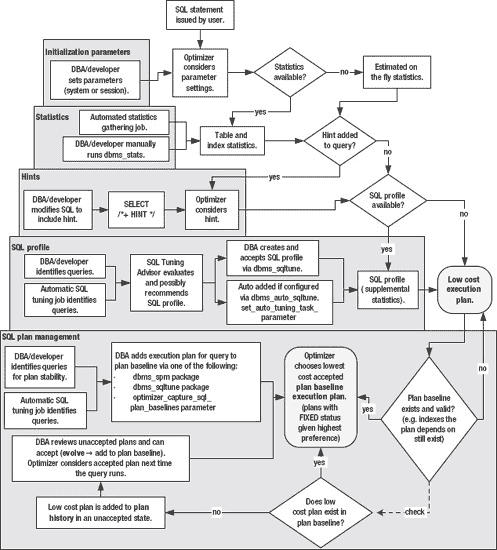

**图 12-1.** 影响优化器选择执行计划的 Oracle 数据库功能

初始化参数和提示等功能不需要额外许可，在所有版本的 Oracle 数据库中均可用。其他功能，如 SQL 配置文件，需要额外许可，且仅随企业版提供。表 12-1 总结了每种影响查询优化器的功能的特点。

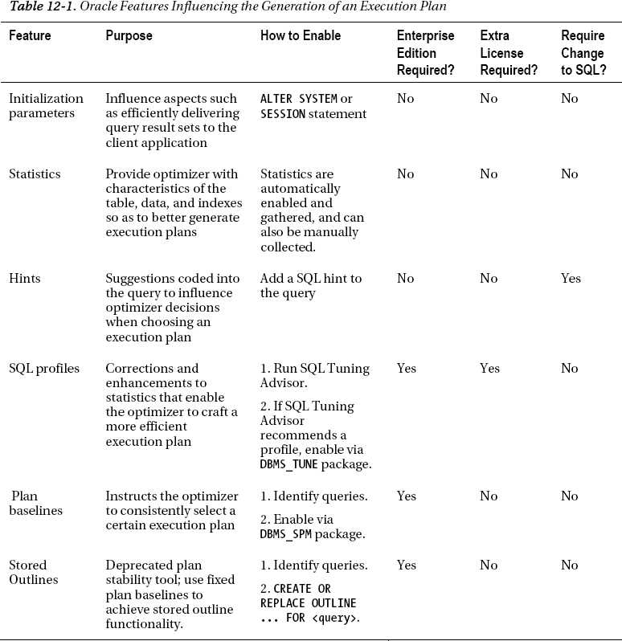

本章第一部分重点介绍 SQL 配置文件的管理。本章其余部分涉及计划基线的实施和使用。我们描述了这些工具使用中的实际和真实示例。在适当的情况下，我们也添加了如何通过企业管理员使用特定功能的说明。

### 12-1. 创建并接受 SQL 配置文件

#### 问题

你有一个性能不佳的查询，并希望从 SQL 调优顾问那里获得建议。你意识到，作为调优建议的一部分，SQL 调优顾问可能会建议为有问题的查询应用 SQL 配置文件。

#### 解决方案

针对有问题的查询运行 SQL 调优顾问。请记住，SQL 调优顾问可能会也可能不会推荐 SQL 配置文件作为性能问题的解决方案。要手动运行 SQL 调优顾问，请执行以下步骤：

1.  使用 `DBMS_SQLTUNE` 创建一个调优任务。
2.  执行该调优任务。
3.  生成调优建议报告。
4.  如果 SQL 配置文件是调优建议输出的一部分，则创建并接受它。

以下示例遵循了上述步骤。在此场景中，SQL 调优顾问建议为给定的查询应用 SQL 配置文件。

 **提示** 有关创建 SQL 调优任务的完整详细信息，请参阅第 11 章。第 11 章涵盖了诸如使用 AWR、内存或 SQL 调优集作为调优任务的 SQL 来源等主题。


### 步骤 1: 使用 DBMS_SQLTUNE 创建调优任务

第一步是创建一个与有问题的 SQL 语句相关联的调优任务。在以下代码中，SQL 文本被硬编码为输入到 `tune_sql` 变量：

```sql
DECLARE
  tune_sql  CLOB;
  tune_task VARCHAR2(30);
BEGIN
  tune_sql := 'select count(*) from mgmt_db_feature_usage_ecm2';
  tune_task := DBMS_SQLTUNE.CREATE_TUNING_TASK(
    sql_text   => tune_sql
   ,user_name  => 'STAGING'
   ,scope      => 'COMPREHENSIVE'
   ,time_limit => 60
   ,task_name  => 'TUNE1'
   ,description => 'Calling SQL Tuning Advisor for one statement'
);
END;
/
```

上述代码被放置在一个名为 `sqltune.sql` 的文件中，并按如下方式执行：

```sql
SQL> @sqltune.sql
```

如果你之后需要删除调优任务，可以使用 `DBMS_SQLTUNE.DROP_TUNING_TASK` 过程。显然，此时不要删除调优任务，因为在接下来的几个步骤中你还需要它。

 `注意` 在处理调优建议和 SQL 配置文件时，请确保你使用的数据库账户已被授予 `ADMINISTER SQL MANAGEMENT OBJECT` 系统权限。此权限包含了管理调优任务和 SQL 配置文件所需的所有权限。

### 步骤 2: 执行调优任务

此步骤运行 SQL 调优顾问，以生成与调优任务（在步骤 1 中创建）相关联的任何查询的建议：

```sql
SQL> exec dbms_sqltune.execute_tuning_task(task_name=>'TUNE1');
```

### 步骤 3: 运行调优建议报告

现在使用 `DBMS_SQLTUNE` 提取在步骤 2 中生成的任何调优建议：

```sql
set long 10000
set longchunksize 10000
set lines 132
set pages 200
select dbms_sqltune.report_tuning_task('TUNE1') from dual;
```

对于此示例，SQL 调优顾问建议创建一个 SQL 配置文件。以下是输出中的一段内容，包含了建议以及创建 SQL 配置文件所需的代码：

```
Recommendation (estimated benefit: 86.11%)
 ------------------------------------------
  - Consider accepting the recommended SQL profile to use parallel execution
    for this statement.
    execute dbms_sqltune.accept_sql_profile(task_name => 'TUNE1', task_owner
            => 'SYS', replace => TRUE, profile_type =>
            DBMS_SQLTUNE.PX_PROFILE);
-------------------------------------------
  Executing this query parallel with DOP 8 will improve its response time
  86.11% over the original plan. However, there is some cost in enabling
  parallel execution...
```

### 步骤 4: 创建并接受 SQL 配置文件

要实际创建 SQL 配置文件，你需要运行 SQL 调优顾问推荐的代码（来自步骤 3）——例如：

```sql
begin
-- This is the code from the SQL Tuning Advisor
dbms_sqltune.accept_sql_profile(
    task_name => 'TUNE1',
    task_owner => 'SYS',
    replace => TRUE,
    profile_type => DBMS_SQLTUNE.PX_PROFILE);
--
end;
/
```

当运行上述代码时，它会创建并启用 SQL 配置文件。现在，每当执行关联的 SQL 查询时，优化器在制定执行计划时都会考虑这个 SQL 配置文件。

 `提示` 你如何知道优化器是否正在使用 SQL 配置文件？开启 `AUTOTRACE`，在启用配置文件和禁用配置文件两种情况下查看执行计划。你应该能看到在启用配置文件时使用了成本更低的执行计划。此外，可以考虑检查 `V$SQL` 的 `SQL_PROFILE` 列。

#### 工作原理

Oracle 支持的创建 SQL 配置文件的唯一方法是运行 SQL 调优顾问，如果建议创建，则使用调优顾问的输出来创建 SQL 配置文件。换句话说，SQL 调优顾问会判断 SQL 配置文件是否有帮助，如果有，则会为给定查询生成创建 SQL 配置文件所需的代码。

“解决方案”部分详细说明了如何手动运行 SQL 调优顾问。请记住，从 Oracle Database 11g 开始，此调优任务作业会定期自动运行。有关自动 SQL 调优功能的详细信息，请参阅 第 11 章。你可以通过此查询轻松查看自动调优作业的输出：

```sql
SQL> SELECT DBMS_AUTO_SQLTUNE.REPORT_AUTO_TUNING_TASK FROM DUAL;
```

我们建议你定期查看自动调优作业的输出。SQL 调优顾问会在输出中提供创建和接受 SQL 配置文件的代码。

 `提示` 有关如何配置自动接受 SQL 配置文件的详细信息，请参阅配方 12-2。

如“解决方案”部分所述，SQL 配置文件是通过 `DBMS_SQLTUNE.ACCEPT_SQL_PROFILE` 过程创建和接受的。使用此过程时有许多可用选项（详见 表 12-2）。

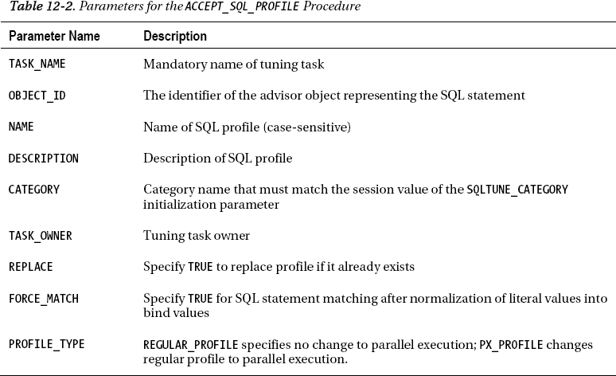

`ACCEPT_SQL_PROFILE` 的 `FORCE_MATCH` 参数需要进一步解释。回想一下，SQL 配置文件与一个 SQL 语句相关联。该 SQL 语句是通过哈希函数（SQL 签名）来识别的。哈希函数是在转换 SQL 文本并删除多余空格后生成的。当将 `FORCE_MATCH` 设置为 `TRUE` 时，这还会将字面值规范化为绑定值。这类似于通过 `CURSOR_SHARING` 数据库初始化参数的 `FORCE` 选项生成的算法。

例如，当 `FORCE_MATCH` 设置为 `TRUE` 时，以下两个 SQL 语句将生成相同的 SQL 签名：

```sql
SQL> select value from my_table where value = 'AA';
SQL> select value from my_table where value = 'bb';
```

这允许使用字面值的 SQL 语句共享同一个 SQL 配置文件。如果 SQL 语句中同时存在字面值和绑定变量，则字面值不会被规范化。

#### SQL 配置文件 与 数据库配置文件

令人困惑的是，Oracle 会选择 “profile” 这个名称并将其应用于两个不同的数据库功能，即 SQL 配置文件和数据库配置文件。也许在未来的版本中，Oracle 会考虑将 SQL 配置文件重命名为类似 SQL 可选更智能统计信息（使查询运行更快）这样的名字。无论如何，请确保不要混淆 SQL 配置文件和数据库配置文件。

简而言之，SQL 配置文件与一个 SQL 语句相关联，包含对统计信息的修正，以帮助优化器生成更高效的执行计划。SQL 调优顾问推荐并生成创建和接受 SQL 配置文件所需的代码，而数据库配置文件是一个分配给用户的对象，用于约束数据库资源使用并强制执行密码安全性。数据库配置文件是使用 `CREATE PROFILE` 语句创建的。

### 12-2. 自动接受 SQL 配置文件

#### 问题

你了解到自动 SQL 调优作业（在 Oracle Database 11g 或更高版本中）每天都会运行。你确定自动调优作业会为有问题的查询生成合理的 SQL 配置文件，现在希望启用自动接受自动调优作业生成的 SQL 配置文件。

 `提示` 有关修改自动 SQL 调优作业的完整详细信息，请参阅 第 11 章。

## 解决方案

使用 `DBMS_AUTO_SQLTUNE.SET_AUTO_TUNING_TASK_PARAMETER` 过程来启用自动接受自动 SQL 优化任务推荐的 SQL 配置文件——例如：

```
BEGIN
  DBMS_AUTO_SQLTUNE.SET_AUTO_TUNING_TASK_PARAMETER(
    parameter => 'ACCEPT_SQL_PROFILES', value => 'TRUE');
END;
/
```

如果要禁用 SQL 配置文件的自动接受，可以按照如下方式操作（使用 `FALSE` 参数）：

```
BEGIN
  DBMS_AUTO_SQLTUNE.SET_AUTO_TUNING_TASK_PARAMETER(
    parameter => 'ACCEPT_SQL_PROFILES', value => 'FALSE');
END;
/
```

 **注意** `DBMS_AUTO_SQLTUNE` 包需要 DBA 角色，或者已将该包的 `EXECUTE` 权限显式授予用户。此包在 Oracle 数据库 11g R2 或更高版本中可用。如果你使用的是更低版本的数据库，请使用 `DBMS_SQLTUNE` 包。

## 工作原理

在 Oracle 数据库 11g 或更高版本中，一个自动配置的作业会定期运行 SQL 优化顾问（运行周期由配置的维护窗口决定）。该作业从 AWR 中包含的性能指标中识别高资源消耗的 SQL 语句。当自动优化作业运行时，它偶尔会建议为性能不佳的 SQL 语句实现一个 SQL 配置文件。如果满足以下条件，Oracle 将自动接受该配置文件：

*   已通过 `DBMS_AUTO_SQLTUNE.SET_AUTO_TUNING_TASK_PARAMETER` 配置了自动接受。
*   使用该 SQL 配置文件后，性能增益（由 SQL 优化顾问确定）至少是未使用配置文件的三倍。

你可以通过此查询报告自动优化任务配置的详细信息：

```
SELECT
  parameter_name
 ,parameter_value
FROM dba_advisor_parameters
WHERE task_name = 'SYS_AUTO_SQL_TUNING_TASK'
AND   parameter_name
   IN ('ACCEPT_SQL_PROFILES',
       'MAX_SQL_PROFILES_PER_EXEC',
       'MAX_AUTO_SQL_PROFILES',
       'EXECUTION_DAYS_TO_EXPIRE');
```

以下是一些示例输出：

```
PARAMETER_NAME            PARAMETER_VALUE
------------------------- --------------------
EXECUTION_DAYS_TO_EXPIRE  30
ACCEPT_SQL_PROFILES       TRUE
MAX_SQL_PROFILES_PER_EXEC 20
MAX_AUTO_SQL_PROFILES     10000
```

 **提示** 自动实现的 SQL 配置文件在 `DBA_SQL_PROFILES` 视图的 `TYPE` 列中显示 `AUTO` 值。

你还可以使用 Enterprise Manager 来配置 SQL 配置文件的自动接受。从主数据库页面，导航到 Advisor Central 页面。接下来，单击 SQL Advisors 链接。现在单击 Automatic SQL Tuning Results 页面。然后单击 Automatic Implementation of SQL Profiles 的配置按钮。你应该会看到一个类似于图 12-2 的页面。

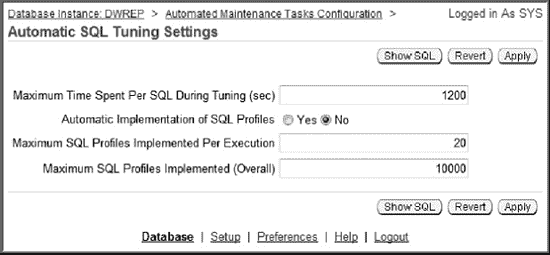

`图 12-2.` 配置 SQL 配置文件的自动接受

通过此屏幕，你可以管理诸如 SQL 配置文件的自动接受、优化会话的最长时间等功能。

### 12-3. 显示 SQL 配置文件信息

#### 问题

你已经创建并接受了多个 SQL 配置文件，现在想要查看与这些数据库对象相关的信息。

#### 解决方案

使用 `DBA_SQL_PROFILES` 视图来显示有关 SQL 配置文件的信息。以下是一个选择最有趣列的示例：

```
SQL> select name, type, status, sql_text from dba_sql_profiles;
```

以下是部分输出片段：

```
NAME                           TYPE    STATUS   SQL_TEXT
------------------------------ ------- -------- ------------------------------
SYS_SQLPROF_012eda58a1be0001   MANUAL  ENABLED  SELECT ecm_snapshot_id AS id...
SYS_SQLPROF_012ea20305980000   MANUAL  ENABLED  SELECT *  FROM inv_maint...
SYS_SQLPROF_012edf0316930003   MANUAL  ENABLED  SELECT /* + parallel(mgmt_db_f...
```

对于此数据库，有几个手动启用的 SQL 配置文件（如前述输出所示）。

 **注意** 由于 SQL 配置文件与特定的 SQL 语句关联（而非用户），因此没有与 SQL 配置文件关联的 `ALL` 或 `USER` 级别视图。

#### 工作原理

回想一下，SQL 配置文件包含对现有统计信息的改进。`DBA_SQL_PROFILES` 视图是查看 SQL 配置文件名称、属性和关联 SQL 文本的最佳来源。

要查看内部的 SQL 配置文件提示相关信息，你还可以额外查询 `DBMSHSXP_SQL_PROFILE_ATTR` 视图——例如：

```
SELECT
  a.name
 ,b.comp_data
FROM dba_sql_profiles          a
    ,dbmshsxp_sql_profile_attr b
WHERE a.name = b.profile_name;
```

以下是一些示例输出：

```
SYS_SQLPROF_0130520c90dc0002
<outline_data><hint><![CDATA[OPT_ESTIMATE(@"SEL$2",
NLJ_INDEX_SCAN, "FS"@"SEL$2", ("MAP"@"SEL$2"), "DB_FEAT_OPT_112_SUM_MV_IDX3",
SCALE_ROWS=0.3369001041)]]></h
```

前面的输出让你了解 SQL 配置文件中提示的类型。此信息供优化器使用，以更好地估计每个执行步骤的基数。这些数据使优化器在生成执行计划时能够做出更好的决策。

你还可以通过查询 `SQLOBJ$` 和 `SQLOBJ$DATA` 视图来查看此内部 SQL 配置文件信息。这些视图中的数据是 XML 格式的，因此在查询时必须使用 Oracle XML 函数格式化输出——例如：

```
SELECT
    extractvalue(value(a), '.') sqlprofile_hints
FROM sqlobj$      o
    ,sqlobj$data d
    ,table(xmlsequence(extract(xmltype(d.comp_data),'/outline_data/hint'))) a
WHERE o.name      = '&&profile_name'
AND   o. plan_id = d.plan_id
AND   o.signature = d.signature
AND   o.category = d.category
AND   o.obj_type = d.obj_type;
```

以下是输出的一个小示例：

```
OPT_ESTIMATE(@"SEL$EF0E05FC", INDEX_SCAN, "MGMT_TARGETS"@"SEL$4",
"MIDX3", SCALE_ROWS=50.68489486)
OPT_ESTIMATE(@"SEL$EF0E05FC", NLJ_INDEX_FILTER,
"MGMT_ECM_GEN_SNAPSHOT"@"SEL$3", ("MGMT_TARGETS"@"SEL$4"),
"IDX$$_1197C0001", SCALE_ROWS=0.4308705)
```

同样，这些配置文件统计信息并不强制优化器使用特定的执行计划。相反，这些统计信息为优化器提供了选择更高效执行计划的灵活性。

 **注意** 如果你使用的是 Oracle 数据库 10g，则使用 `SQLPROF$` 和 `SQLPROF$ATTR` 视图。

### 12-4. 禁用 SQL 配置文件

#### 问题

你认为某个查询不再需要 SQL 配置文件。你希望手动禁用（而非删除）该 SQL 配置文件。

#### 解决方案

首先验证要禁用的 SQL 配置文件的名称：

```
SQL> select name, status from dba_sql_profiles;
```

以下是部分输出片段：

```
NAME                           STATUS
------------------------------ --------
SYS_SQLPROF_012eda58a1be0001   ENABLED
```

现在使用 `DBMS_SQLTUNE.ALTER_SQL_PROFILE` 过程将配置文件的状态修改为禁用：

```
BEGIN
  DBMS_SQLTUNE.ALTER_SQL_PROFILE(
    name => 'SYS_SQLPROF_012eda58a1be0001',
    attribute_name => 'STATUS',
    value => 'DISABLED');
END;
/
```

#### 工作原理

SQL 配置文件的状态是几个可修改的属性之一。您还可以修改诸如名称、描述和类别等特征。有关可修改属性的描述，请参阅表 12-3。

 **注意** 您需要拥有 `ALTER ANY SQL PROFILE` 权限才能更改 SQL 配置文件。

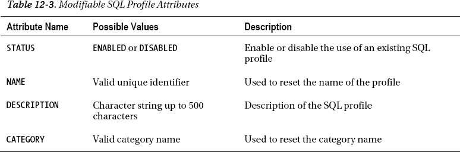

SQL 配置文件的类别有一些有趣的影响。类别允许您通过设置 `SQLTUNE_CATEGORY` 初始化参数（此参数可在会话或系统级别设置）来控制 SQL 配置文件的使用。当执行查询时，如果有可用的 SQL 配置文件，优化器会检查分配给该 SQL 配置文件的类别是否与 `SQLTUNE_CATEGORY` 的系统或会话级设置相同。如果 SQL 配置文件的类别与 `SQLTUNE_CATEGORY` 的设置匹配，那么优化器将考虑使用该 SQL 配置文件。

SQL 配置文件的默认类别是 `DEFAULT`。同时 `SQLTUNE_CATEGORY` 的默认值也是 `DEFAULT`。因此，除非您更改了 SQL 配置文件的类别或修改了 `SQLTUNE_CATEGORY` 参数，否则优化器将会使用该 SQL 配置文件作为输入。

您可以将类别更改为 `DEFAULT` 以外的值。这意味着只有那些会话，如果它们将 `SQLTUNE_CATEGORY` 初始化参数修改为与 SQL 配置文件类别相匹配的值，才能使用该配置文件。例如，假设您将 SQL 配置文件修改为类别 `TEST1`：

```sql
BEGIN
  DBMS_SQLTUNE.ALTER_SQL_PROFILE(
    name => 'SYS_SQLPROF_012eda58a1be0001',
    attribute_name => 'CATEGORY',
    value => 'TEST1');
END;
/
```

现在，唯一能看到并使用此配置文件的会话是那些将 `SQLTUNE_CATEGORY` 设置为 `TEST1` 的会话：

```sql
SQL> alter session set sqltune_category=TEST1;
```

这允许您将配置文件的使用隔离到仅那些 `SQLTUNE_CATEGORY` 设置与该 SQL 配置文件类别相匹配的会话。这使您能够测试实施 SQL 配置文件的影响，并可以通过简单地更改会话级或系统级的 `SQLTUNE_CATEGORY` 设置来快速回退。

您还可以从 Enterprise Manager 管理 SQL 配置文件的许多方面。从主数据库页面导航到“服务器”选项卡。在“查询优化器”部分，单击“SQL 计划控制”选项卡。您应该会看到一个类似于图 12-3 的屏幕。

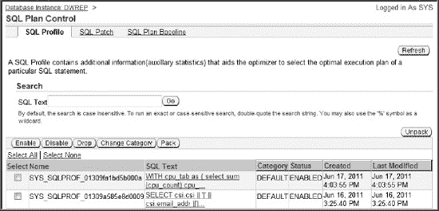

**图 12-3.** 管理 SQL 配置文件

从这个屏幕，您可以管理诸如启用、禁用、更改类别以及删除 SQL 配置文件等功能。

### 12-5. 删除 SQL 配置文件

#### 问题

您已对一个查询在附加和不附加 SQL 配置文件的情况下进行了测试。您确定查询性能在使用 SQL 配置文件后并未显著提升。您想要删除该 SQL 配置文件，以免数据字典中充斥着不必要和过时的信息。

#### 解决方案

使用 `DBMS_SQLTUNE.DROP_SQL_PROFILE` 过程来删除 SQL 配置文件。传入您要删除的 SQL 配置文件的名称，例如：

```sql
SQL> exec dbms_sqltune.drop_sql_profile('SYS_SQLPROF_012edef0d0a70002');
```

如果成功，您将看到以下输出：

```
PL/SQL procedure successfully completed.
```

#### 工作原理

删除 SQL 配置文件相当容易。如果您正在清理数据库或想要从测试环境中移除配置文件，可能需要执行此操作。如果您不确定 SQL 配置文件的名称，可以查询 `DBA_SQL_PROFILES` 以获取更多信息（详情请参阅配方 12-3）。

 **注意** 您需要拥有 `DROP ANY SQL PROFILE` 权限才能删除 SQL 配置文件。

如果您想删除数据库中的所有配置文件，可以使用 PL/SQL 循环遍历所有配置文件并删除它们：

```sql
declare
  cursor c1 is select name from dba_sql_profiles;
begin
  for r1 in c1 loop
    dbms_sqltune.drop_sql_profile(r1.name);
  end loop;
end;
/
```

### 12-6. 迁移 SQL 配置文件

#### 问题

您有一个测试数据库，并希望从中提取所有 SQL 配置文件，然后将它们迁移到生产数据库。

#### 解决方案

将 SQL 配置文件从一个数据库传输到另一个数据库涉及以下步骤：

1.  创建一个暂存表。
2.  填充该暂存表。
3.  将表从源数据库移动到目标数据库（使用 Data Pump 或数据库链接）。
4.  在目标数据库上，从暂存表中提取信息，以将 SQL 配置文件信息填充到数据字典中。

以下小节详细描述了这些步骤。

##### 步骤 1：创建暂存表

使用 `DBMS_SQLTUNE.CREATE_STGTAB_SQLPROF` 过程创建暂存表。此示例创建一个由 `MV_MAINT` 用户拥有的名为 `PROF_STAGE` 的表：

```sql
BEGIN
  dbms_sqltune.create_stgtab_sqlprof(
    table_name => 'PROF_STAGE',
    schema_name => 'MV_MAINT' );
END;
/
```

##### 步骤 2：填充暂存表

使用 `DBMS_SQLTUNE.PACK_STGTAB_SQLPROF` 过程，用 SQL 配置文件信息填充步骤 1 中创建的表。此示例用有关特定 SQL 配置文件的信息填充表：

```sql
BEGIN
  dbms_sqltune.pack_stgtab_sqlprof(
    profile_name => 'SYS_SQLPROF_012edf84806e0004',
    staging_table_name => 'PROF_STAGE',
    staging_schema_owner => 'MV_MAINT' );
END;
/
```

 **提示** `PROFILE_NAME` 参数可以包含通配符。例如，如果您想传输数据库中的所有 SQL 配置文件，可以将 `PROFILE_NAME` 设置为 `'%'`。

##### 步骤 3：将暂存表复制到目标数据库

您可以通过 Data Pump、旧的 `exp`/`imp` 实用程序或使用数据库链接将表从一个数据库复制到另一个数据库。此示例在目标数据库中创建一个数据库链接，然后从源数据库复制表：

```sql
create database link source_db
connect to mv_maint
identified by foo
using 'source_db';
```

创建数据库链接后，可以使用 `CREATE TABLE...AS SELECT` 语句直接从源端复制表：

```sql
SQL> create table PROF_STAGE as select * from PROF_STAGE@source_db;
```

##### 步骤 4：将暂存表的内容加载到目标数据库

现在在目标数据库中，解包该表以将配置文件信息加载到数据库中：

```sql
BEGIN
  DBMS_SQLTUNE.UNPACK_STGTAB_SQLPROF(
    replace => TRUE,
    staging_table_name => 'PROF_STAGE');
END;
/
```

如果未指定配置文件名称，默认为 `%` 通配符（意味着表中的所有配置文件都将被加载到目标数据库中）。

#### 工作原理

将 SQL 配置文件从一个数据库复制到另一个数据库相当容易。您只需创建一个特殊的表来保存配置文件信息，然后填充该表，将表复制到目标数据库，最后解包表的内容。表 12-4 描述了配置文件打包过程的所有参数。

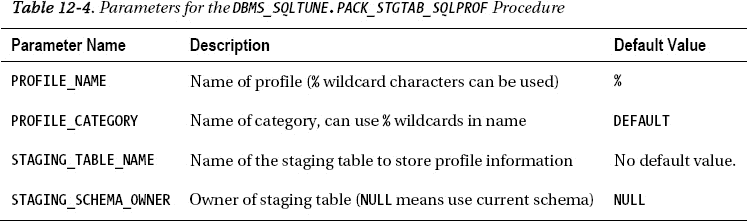

`DBMS_SQLTUNE.UNPACK_STGTAB_SQLPROF` 过程采用与打包过程相同的参数，并额外增加了一个 `REPLACE` 参数。`REPLACE` 参数指定如果配置文件已存在是否进行替换（可以是 `TRUE` 或 `FALSE`）。

### 12-7. 自动添加计划基线

#### 问题

您希望为数据库中每个重复执行的 SQL 查询自动创建计划基线。

### 12-8. 为单个 SQL 语句创建计划基线

#### 问题

您希望为当前正在执行的某个特定 SQL 语句创建一个计划基线。

#### 解决方案

手动将计划基线与 SQL 语句关联的过程如下：

1.  确定您想要为其创建计划基线的 SQL 语句。
2.  提供一个标识符（例如 `SQL_ID`）作为 `DBMS_SPM` 包的输入，以针对该 SQL 语句创建计划基线。

例如，假设您正在使用一个 SQL 语句，如下所示：

`SQL> select emp_id from emp where emp_id = 100;`

现在查询 `V$SQL` 视图以确定该查询的 `SQL_ID`：

```sql
select
  sql_id
 ,sql_text
from v$sql
where sql_text
    like 'select emp_id from emp where emp_id = 100';
```

以下是输出片段：

```text
SQL_ID        SQL_TEXT
------------- ------------------------------------------------------------
0qgmjf9krq285 select emp_id from emp where emp_id = 100
```

既然已经确定了 `SQL_ID`，就将其作为输入提供给 `DBMS_SPM.LOAD_PLANS_FROM_CURSOR_CACHE` 函数，为给定的查询创建计划基线——例如：

```sql
DECLARE
  plan1 PLS_INTEGER;
BEGIN
  plan1 := DBMS_SPM.LOAD_PLANS_FROM_CURSOR_CACHE(sql_id => '0qgmjf9krq285');
END;
/
```

现在，该查询应该在 `DBA_SQL_PLAN_BASELINES` 视图中有一个条目，显示其已关联一个已启用的计划基线——例如：

`SQL> select sql_handle, plan_name, sql_text from dba_sql_plan_baselines;`

以下是输出的一小部分：

```text
SQL_HANDLE                PLAN_NAME                                 SQL_TEXT
------------------------- ---------------------------------------- ----------------------
SQL_f34ef255797c4713      SQL_PLAN_g6mrkapwrsjsmd8a279cc           select emp_id.....
```

#### 工作原理

“解决方案”部分描述了如何使用游标缓存中的查询来确定单个 SQL 语句（基于 `SQL_ID`）以创建计划基线。为查询创建计划基线的方法有很多种，例如使用 SQL 文本、方案、模块等。例如，接下来基于部分 SQL 字符串加载一个计划基线：

```sql
DECLARE
  plan1 PLS_INTEGER;
BEGIN
  plan1 := DBMS_SPM.LOAD_PLANS_FROM_CURSOR_CACHE(
               attribute_name => 'sql_text'
              ,attribute_value => 'select emp_id from emp%');
END;
/
```

有关 `DBMS_SPM.LOAD_PLANS_FROM_CURSOR_CACHE` 函数可用输入参数的详细信息，请参见 `表 12-5`。

**注意：** 有关如何为 SQL 调优集中包含的 SQL 语句创建计划基线的示例，请参见配方 12-9。

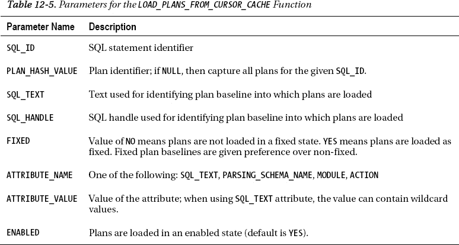

### 12-9. 为 SQL 调优集中包含的 SQL 创建计划基线

#### 问题

您面临以下情况：

*   您正在将数据库升级到新版本。
*   根据以往经验，您知道升级到更新版本的 Oracle 有时可能会导致 SQL 语句性能不佳，因为升级后的数据库优化器选择的执行计划比先前版本数据库的优化器效率更低（更差）。
*   您希望确保升级后 SQL 语句以可接受的性能执行。

本质上，您正在升级，并希望优化器在升级前后选择相同的执行计划。您不希望升级导致出现可能降低性能的新计划。

#### 解决方案

以下是自动为执行次数超过一次的 SQL 语句创建计划基线的步骤：

1.  将 `OPTIMIZER_CAPTURE_SQL_PLAN_BASELINES` 参数设置为 `TRUE`（在会话或系统级别）。
2.  执行两次或更多次您希望捕获其计划基线的查询。
3.  将 `OPTIMIZER_CAPTURE_SQL_PLAN_BASELINES` 设置为 `FALSE`。

接下来的示例说明了使用上述步骤为查询添加计划基线的过程。首先在会话级别设置指定的初始化参数：

`SQL> alter session set optimizer_capture_sql_plan_baselines=true;`

现在执行一个查询两次。当 `OPTIMIZER_CAPTURE_SQL_PLAN_BASELINES` 参数设置为 `TRUE` 时，对于运行两次或更多次的查询，Oracle 将自动为其创建计划基线：

`SQL> select emp_id from emp where emp_id=3000;`
`SQL> select emp_id from emp where emp_id=3000;`

现在将初始化参数设置回 `FALSE`。

`SQL> alter session set optimizer_capture_sql_plan_baselines=false;`

现在，该查询应该在 `DBA_SQL_PLAN_BASELINES` 视图中有一个条目，显示其已关联一个已启用的计划基线——例如：

```sql
SELECT
  sql_handle, plan_name, enabled, accepted,
  created, optimizer_cost, sql_text
FROM dba_sql_plan_baselines;
```

以下是输出的部分列表：

```text
SQL_HANDLE           PLAN_NAME                      ENA ACC...
-------------------- ------------------------------ --- ---...
SQL_790bd425fe4a0125 SQL_PLAN_7k2yn4rz4n095d8a279cc YES YES...
```

#### 工作原理

启用 `OPTIMIZER_CAPTURE_SQL_PLAN_BASELINES` 允许您自动捕获数据库中重复运行（超过一次）的查询的计划基线。“解决方案”部分描述了如何在会话级别使用此功能。您也可以设置该参数，以便为数据库中所有重复查询生成计划基线——例如：

`SQL> alter system set optimizer_capture_sql_plan_baselines=true;`

从此时起，数据库中任何运行超过一次的查询都将自动为其创建计划基线。我们不建议在生产环境中这样做，除非您已先仔细测试了此功能并确保不会产生任何不利的副作用（因为要为每个查询存储计划基线）。但是，您可能有一个测试环境，希望有意为每个重复运行的 SQL 语句创建计划基线。

**注意：** 默认情况下，`OPTIMIZER_CAPTURE_SQL_PLAN_BASELINES` 参数为 `FALSE`。

您也可以从 Enterprise Manager 管理计划基线的使用。从主数据库页面，导航到“服务器”选项卡。在“查询优化器”部分，单击“SQL 计划控制”选项卡。接下来，单击“SQL 计划基线”选项卡。您应该会看到一个类似于 `图 12-4` 的屏幕。

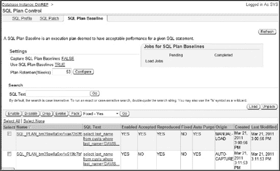

`图 12-4. 管理计划基线`

从此屏幕，您可以管理诸如启用、禁用、删除和演进计划基线等任务。


### 12-10. 修改计划基线

### 解决方案

要处理此问题，请将 AWR 中资源消耗最高的 SQL 查询作为创建计划基线的候选。此方案使用了创建 AWR 基线的技术。AWR 基线是由起始/结束快照 ID 指定的 AWR 活动快照。接下来的步骤展示了如何使用在 AWR 基线中找到的高资源消耗 SQL 语句创建并填充 SQL 调优集，然后为这些查询创建计划基线：

1.  创建一个 AWR 基线。
2.  创建一个 SQL 调优集对象。
3.  使用在 AWR 基线中找到的查询填充 SQL 调优集。
4.  使用该调优集作为 `DBMS_SPM` 的输入，为 SQL 调优集中包含的每个查询创建一个计划基线。

 **注意** 在如何使用 AWR 或内存中的高资源消耗查询填充 SQL 调优集方面，您拥有很大的灵活性。有关使用 SQL 调优集的完整详细信息，请参阅第 11 章。

### 步骤 1：创建 AWR 基线

第一步是创建一个 AWR 基线。例如，假设您知道在数据库中两个快照之间运行着高负载查询。下面的代码使用两个快照 ID 创建一个 AWR 基线：

```sql
BEGIN
  DBMS_WORKLOAD_REPOSITORY.create_baseline (
    start_snap_id => 26632,
    end_snap_id   => 26635,
    baseline_name => 'peak_baseline_apr15_11');
END;
/
```

如果您不确定数据库中有哪些可用快照，可以运行 AWR 报告或从 `DBA_HIST_SNAPSHOT` 中选择 `SNAP_ID`：

```sql
select snap_id, begin_interval_time
from dba_hist_snapshot order by 1;
```

### 步骤 2：创建 SQL 调优集对象

现在创建一个 SQL 调优集。接下来的代码片段创建了一个名为 `test1` 的调优集：

```sql
BEGIN
  dbms_sqltune.create_sqlset(
    sqlset_name => 'test1'
   ,description => 'STS from AWR');
END;
/
```

### 步骤 3：使用在 AWR 基线中找到的高资源消耗查询填充 SQL 调优集

现在，使用在 AWR 基线（步骤 1 创建）中找到的任何查询来填充 SQL 调优集（步骤 2 创建）：

```sql
DECLARE
  base_cur dbms_sqltune.sqlset_cursor;
BEGIN
  OPEN base_cur FOR
    SELECT value(x)
    FROM table(dbms_sqltune.select_workload_repository(
      'peak_baseline_apr15_11', null, null,'elapsed_time',
      null, null, null, 15)) x;
  --

  dbms_sqltune.load_sqlset(
    sqlset_name => 'test1',
    populate_cursor => base_cur);
END;
/
```

在前面的代码行中，AWR 基线名称被传递给 `DBMS_SQLTUNE` 包。基线内的查询按 `elapsed_time`（耗时）进行选择，并指定了前 15 个。

### 步骤 4：使用调优集作为 `DBMS_SPM` 的输入，为 SQL 调优集中包含的每个查询创建计划基线

现在，将调优集（步骤 3 填充）提供给 `DBMS_SPM` 包作为输入：

```sql
DECLARE
  test_plan1 PLS_INTEGER;
BEGIN
  test_plan1 := dbms_spm.load_plans_from_sqlset(
                  sqlset_name=>'test1');
END;
/
```

调优集中包含的任何查询现在应该在 `DBA_SQL_PLAN_BASELINES` 视图中都有相应的条目。

## 工作原理

“解决方案”部分展示的技术是一种非常强大的方法，用于为数据库中运行的最具资源消耗的查询创建计划基线。本方案的关键在于理解，您可以使用 SQL 调优集中包含的查询作为（`DBMS_SPM` 包的）输入。SQL 调优集可以从在 AWR 和内存中发现的高资源消耗语句中填充。这使您可以轻松地为问题最严重的查询创建计划基线。

为资源密集型查询设置计划基线有助于确保在您的系统（例如数据库升级、统计数据变化、数据集不同等）发生变化后，仍使用相同的执行计划。

请记住，一个计划基线中可能包含多个已接受的执行计划。如果您有一个希望优化器始终使用的特定计划，请考虑将该计划更改为 `FIXED`（固定）状态。有关将计划基线更改为 `FIXED` 状态的详细信息，请参见第 12-10 节。

### 12-10. 修改计划基线

### 问题

您有一个查询的多个已接受计划基线执行计划。您希望明确指示优化器优先使用其中一个已接受的计划。

### 解决方案

优化器将优先考虑状态为 `FIXED` 的计划基线。使用 `DBMS_SPM` 包和 `ALTER_SQL_PLAN_BASELINE` 函数将当前计划基线执行计划更改为 `FIXED`。以下是一个示例：

```sql
DECLARE
  pf PLS_INTEGER;
BEGIN
  pf := dbms_spm.alter_sql_plan_baseline(
    plan_name => 'SQL_PLAN_1wskqhvrwf8g60e23be79'
   ,attribute_name => 'fixed'
   ,attribute_value => 'YES');
END;
/
```

您可以查询 `DBA_SQL_PLAN_BASELINES` 的 `FIXED` 列来验证它现在是否为基线固定状态。下面是一个这样的查询：

```sql
SELECT
  sql_handle, plan_name, enabled, accepted, fixed
FROM dba_sql_plan_baselines;
```

以下是一些示例输出：

```
SQL_HANDLE           PLAN_NAME                      ENA ACC FIX
-------------------- ------------------------------ --- --- ---
SQL_457bf2f82571bd38 SQL_PLAN_4ayzkz0kr3g9s90e466fd YES YES NO
SQL_790bd425fe4a0125 SQL_PLAN_7k2yn4rz4n095d8a279cc YES YES YES
```

### 工作原理

您可以将固定计划基线视为一种建立优化器选择计划基线的优先级层次结构的方法。优化器将首先优先考虑任何已接受*且*固定的计划基线。如果没有可用的，则考虑已接受的非固定计划基线。添加到已包含固定计划基线的计划基线中的执行计划将被视为次要（除非您也将它们添加为固定计划）。

表 12-6 描述了 `ALTER_SQL_PLAN_BASELINE` 的可用参数。您可以指定 `SQL_HANDLE` 或 `PLAN_NAME` 或两者。如果 `SQL_HANDLE` 为 `NULL`，则必须指定 `PLAN_NAME`，反之亦然。

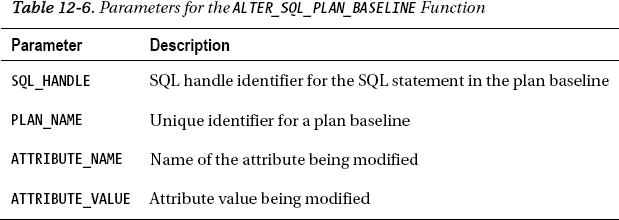

`ATTRIBUTE_NAME` 和 `ATTRIBUTE_VALUE` 参数由可用于更改计划基线各种属性的名称/值对组成。有关可能配对的完整说明，请参见表 12-7。

 **提示** 使用 `ALTER_SQL_PLAN_BASELINE` 的 `ENABLED` 属性可以禁用或重新启用计划基线以供使用。

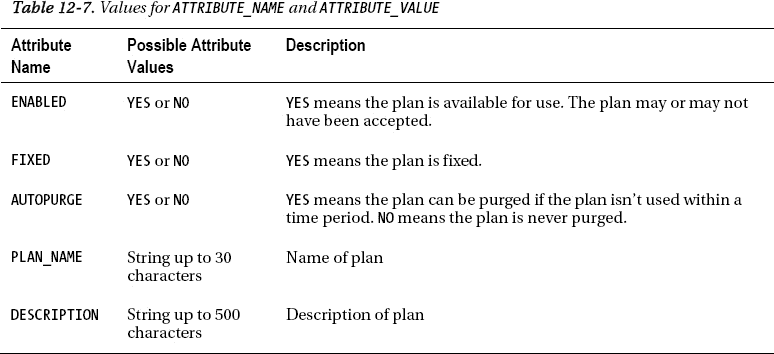

### 12-11. 确定是否存在计划基线

### 问题

您最近为某个查询实施了计划基线。您想要验证计划基线的配置。

### 解决方案

运行以下查询以查看有关已配置的任何计划基线的详细信息：

```sql
set pages 100
set linesize 132
col sql_handle form a20
col plan_name form a30
col sql_text form a20
col created form a20
--
SELECT sql_handle, plan_name, enabled
,accepted, created, optimizer_cost, sql_text
FROM dba_sql_plan_baselines;
```

前面查询的输出非常宽，已被修改以适应页面宽度：

```
SQL_HANDLE           PLAN_NAME                      ENA ACC
-------------------- ------------------------------ --- ---
SQL_b98d2ae2145eec3d SQL_PLAN_bm39aw8a5xv1xae72d2f5 YES YES
CREATED              OPTIMIZER_COST SQL_TEXT
-------------------- -------------- --------------------
21-MAR-11 10.53.29.0              2 select last_name from custs...
```

在输出中，有两个关键列：`SQL_HANDLE` 和 `PLAN_NAME`。每个查询都有一个关联的 `SQL_HANDLE`，它是查询的标识符。每个执行计划都有一个唯一的 `PLAN_NAME`。`PLAN_NAME` 在 `DBA_SQL_PLAN_BASELINES` 中是唯一的，而可能有多个行具有相同的 `SQL_HANDLE`（但具有不同的 `PLAN_NAME`）。


### 12-12. 显示计划基线执行计划

#### 工作原理

`DBA_SQL_PLAN_BASELINES` 视图提供了一种快速简便的方法，用于确定计划基线是否存在并正在使用。如果一个计划被启用并接受，则表明查询正在使用计划基线。

 **注意** 数据字典视图中没有 `ALL` 或 `USER` 级别的计划基线。这是因为计划基线与特定的 SQL 语句相关联，而不是与用户相关联。

如果您怀疑优化器是否正在考虑某个计划基线，请将 `AUTOTRACE` 设置为开，并查看输出，例如：

```sql
SQL> set autotrace trace explain;
SQL> select emp_id from emp where emp_id = 100;
```

以下是输出的一部分，表明此查询使用了 SQL 计划基线执行计划：

```
Execution Plan
----------------------------------------------------------
Plan hash value: 2872589290
--------------------------------------------------------------------------
..................
- SQL plan baseline "SQL_PLAN_g6mrkapwrsjsmd8a279cc" used for this statement
```

#### 问题

您希望快速查看有关现有计划基线的详细信息，例如相关的执行计划。

#### 解决方案

使用 `DBMS_XPLAN.DISPLAY_SQL_PLAN_BASELINE` 函数来显示执行计划和相应的计划基线详细信息。此示例报告特定计划的详细信息：

```sql
SELECT *
FROM TABLE(
DBMS_XPLAN.DISPLAY_SQL_PLAN_BASELINE(plan_name=>'SQL_PLAN_bm39aw8a5xv1xae72d2f5'));
```

以下是一些示例输出：

```
--------------------------------------------------------------------------------
SQL handle: SQL_b98d2ae2145eec3d
SQL text: select last_name from custs where last_name='DAVIS'
--------------------------------------------------------------------------------
--------------------------------------------------------------------------------
Plan name: SQL_PLAN_bm39aw8a5xv1xae72d2f5          Plan id: 2926760693
Enabled: YES     Fixed: NO      Accepted: YES     Origin: MANUAL-LOAD
--------------------------------------------------------------------------------
Plan hash value: 1824334906
---------------------------------------------------------------------------
| Id  | Operation         | Name  | Rows  | Bytes | Cost (%CPU)| Time     |
---------------------------------------------------------------------------
|   0 | SELECT STATEMENT  |       |     2 |    54 |     2   (0)| 00:00:01 |
|*  1 |  TABLE ACCESS FULL| CUSTS |     2 |    54 |     2   (0)| 00:00:01 |
---------------------------------------------------------------------------
```

#### 工作原理

`DBMS_XPLAN.DISPLAY_SQL_PLAN_BASELINE` 函数允许您显示计划基线中的一个或多个执行计划。此函数的返回类型是 PL/SQL 表类型。此函数接受三个参数（在 表 12-8 中描述）。

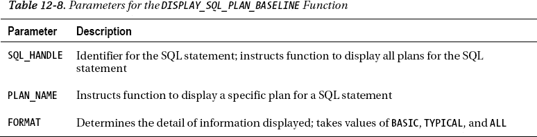

如果要显示 SQL 语句的所有计划，请使用 `SQL_HANDLE` 参数作为输入，例如：

```sql
SELECT *
FROM TABLE(
DBMS_XPLAN.DISPLAY_SQL_PLAN_BASELINE(sql_handle=>'SQL_b98d2ae2145eec3d'));
```

以下是输出的一部分，显示此 SQL 查询的计划基线中有多个计划：

```
--------------------------------------------------------------------------------
Plan name: SQL_PLAN_bm39aw8a5xv1x519fc7bf          Plan id: 1369425855
Enabled: YES     Fixed: NO      Accepted: NO      Origin: AUTO-CAPTURE
--------------------------------------------------------------------------------
Plan hash value: 16205770
-------------------------------------------------------------------------------
| Id  | Operation        | Name       | Rows  | Bytes | Cost (%CPU)| Time     |
-------------------------------------------------------------------------------
|   0 | SELECT STATEMENT |            |     2 |    54 |     1   (0)| 00:00:01 |
|*  1 |  INDEX RANGE SCAN| CUSTS_IDX1 |     2 |    54 |     1   (0)| 00:00:01 |
-------------------------------------------------------------------------------
Predicate Information (identified by operation id):
---------------------------------------------------
   1 - access("LAST_NAME"='DAVIS')
--------------------------------------------------------------------------------
Plan name: SQL_PLAN_bm39aw8a5xv1xae72d2f5          Plan id: 2926760693
Enabled: YES     Fixed: NO      Accepted: YES     Origin: MANUAL-LOAD
--------------------------------------------------------------------------------
Plan hash value: 1824334906

---------------------------------------------------------------------------
| Id  | Operation         | Name  | Rows  | Bytes | Cost (%CPU)| Time     |
---------------------------------------------------------------------------
|   0 | SELECT STATEMENT  |       |     2 |    54 |     2   (0)| 00:00:01 |
|*  1 |  TABLE ACCESS FULL| CUSTS |     2 |    54 |     2   (0)| 00:00:01 |
---------------------------------------------------------------------------
```

### 12-13. 向计划基线添加新计划（演进）

#### 问题

您有以下场景：

*   您有一个查询的现有计划基线。
*   您最近添加了一个查询可以使用的索引。
*   优化器确定查询现在有一个新的低成本计划可用，并将新计划以未接受状态添加到计划历史中。
*   您通过 SQL Tuning Advisor 的建议或查询 `DBA_SQL_PLAN_BASELINES` 视图注意到新计划。
*   您已经检查了新的执行计划，在测试环境中运行了查询，并确信新计划将带来更好的性能。

您希望将历史记录中的低成本计划进行演进，使其成为基线中已接受的计划。您意识到，一旦计划在基线中被接受，优化器就会使用它（如果它是基线中成本最低的计划）。


### 解决方案

首先验证相关查询是否存在未接受状态的执行计划（更多详情请参阅 配方 12-11 和 12-12）。以下是一个快速示例：

```sql
SELECT sql_handle, plan_name, enabled, accepted, optimizer_cost
FROM dba_sql_plan_baselines
WHERE sql_text like '%select emp_id from emp where emp_id = 100%';
```

输出显示有两个计划，其中一个未被接受但成本低得多：

```
SQL_HANDLE           PLAN_NAME                      ENA ACC OPTIMIZER_COST
-------------------- ------------------------------ --- --- --------------
SQL_f34ef255797c4713 SQL_PLAN_g6mrkapwrsjsm01205c23 YES NO               1
SQL_f34ef255797c4713 SQL_PLAN_g6mrkapwrsjsmd8a279cc YES YES              7
```

使用 `DBMS_SPM.EVOLVE_SQL_PLAN_BASELINE` 函数可以将计划从历史记录移动到基线中（即演进该计划）。在此示例中，使用 SQL 句柄（与 SQL 语句关联的唯一字符串）来演进计划：

```sql
SET SERVEROUT ON SIZE 1000000
SET LONG 100000
DECLARE
  rpt CLOB;
BEGIN
  rpt := DBMS_SPM.EVOLVE_SQL_PLAN_BASELINE(
    sql_handle => 'SQL_f34ef255797c4713');
  DBMS_OUTPUT.PUT_LINE(rpt);
END;
/
```

如果 Oracle 确定存在一个成本更低的未接受计划，你将看到类似以下的输出，表明该计划已被移动到接受状态（已演进）：

```
-------------------------------------------------------------------------------
                        Evolve SQL Plan Baseline
                              Report
-------------------------------------------------------------------------------

Inputs:
-------
  SQL_HANDLE = SQL_f34ef255797c4713
  PLAN_NAME  =
  TIME_LIMIT = DBMS_SPM.AUTO_LIMIT
  VERIFY     = YES
  COMMIT     = YES

Plan: SQL_PLAN_4fpttm0b55uwr918dd295
------------------------------------
  Plan was verified: Time used .09 seconds.
  Plan passed performance criterion: 11.56 times better than baseline plan.
  Plan was changed to an accepted plan.
```

你可以通过设置 `AUTOTRACE` 为 on 并运行查询来快速验证新的计划基线是否正在使用——例如：

```sql
SQL> set autotrace trace explain;
SQL> select emp_id from emp where emp_id = 100;
```

以下是一个小片段输出，表明正在使用新的计划基线：

```
SQL plan baseline "SQL_PLAN_g6mrkapwrsjsm01205c23" used for this statement
```

### 工作原理

SQL 计划管理的一个关键特性是，当查询优化器生成一个新的低成本计划时，如果这个新计划的成本低于计划基线中已接受的计划，那么这个新低成本计划会自动被添加到该查询的计划历史中，处于未接受状态。

你可以选择接受这个新的低成本计划，这将使其作为已接受的计划移动到计划基线中。将未接受的执行计划从计划历史移动到计划基线（`ENABLED` 和 `ACCEPTED`）被称为 **演进计划基线**。

为什么优化器会生成一个新计划？有多个因素会导致优化器创建一个与计划基线中现有计划不匹配的新执行计划：

*   有新的统计信息可用。
*   为查询分配了新的 SQL 配置文件。
*   索引被添加或删除。

这为你提供了一种强大的技术，以便在有新计划可用时进行管理和使用。你可以使用 `DBMS_SPM.EVOLVE_SQL_PLAN_BASELINE` 函数以以下模式运行：

*   指定要演进的计划名称。
*   提供一个要演进的计划列表。
*   不提供任何值运行，这意味着 Oracle 将演进计划基线存储库中所有未接受的计划。

表 12-9 描述了 `DBMS_SPM.EVOLVE_SQL_PLAN_BASELINE` 函数中使用的参数。

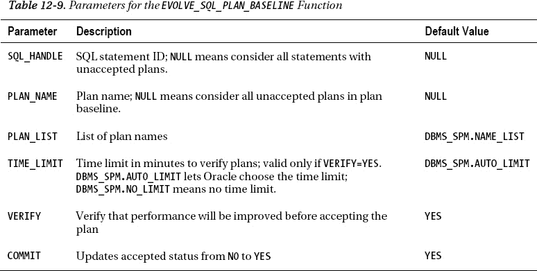

### 12-14. 禁用计划基线

#### 问题

你正在使用一个测试数据库，其中许多 SQL 语句有关联的计划基线。你想确定如果不禁用计划基线，性能差异会如何，因此希望临时禁用计划基线的使用。

#### 解决方案

要禁用数据库中任何 SQL 计划基线的使用，请将 `OPTIMIZER_USE_SQL_PLAN_BASELINES` 初始化参数设置为 `FALSE`：

```sql
SQL> alter system set optimizer_use_sql_plan_baselines=false scope=both;
```

前面的命令在 `SYSTEM` 级别禁用了计划基线的使用，并将该值记录在内存和服务器参数文件中。要重新启用计划基线的使用，请将该值设置回 `TRUE`。

你也可以在会话级别设置 `OPTIMIZER_USE_SQL_PLAN_BASELINES`。这将为当前连接用户在其会话持续时间内禁用计划基线的使用：

```sql
SQL> alter session set optimizer_use_sql_plan_baselines=false;
```

#### 工作原理

`OPTIMIZER_USE_SQL_PLAN_BASELINES` 的默认值是 `TRUE`，这意味着默认情况下，如果有计划基线可用，它们将被使用。启用时，优化器将为给定的 SQL 查询查找有效的计划基线执行计划，并选择成本最低的那个。这为你提供了一种快速简便的方法来在整个数据库或特定会话中禁用/启用计划基线。

如果你想禁用一个特定的计划基线，那么将其状态改为 `DISABLED`：

```sql
DECLARE
  pf PLS_INTEGER;
BEGIN
  pf := dbms_spm.alter_sql_plan_baseline(
    plan_name => 'SQL_PLAN_4ayzkz0kr3g9s6afbe2b3'
   ,attribute_name => 'ENABLED'
   ,attribute_value => 'NO');
END;
/
```

 **提示** 有关如何更改计划基线的更多详细信息，请参见 配方 12-10。

### 12-15. 移除计划基线信息

#### 问题

你有几个不再想使用的计划基线，因此希望移除它们。

#### 解决方案

你可以删除单个计划基线。这将使用 `PLAN_NAME` 参数删除单个计划基线：

```sql
DECLARE
  plan_name1 PLS_INTEGER;
BEGIN
  plan_name1 := DBMS_SPM.DROP_SQL_PLAN_BASELINE(
                   plan_name => 'SQL_PLAN_bm39aw8a5xv1x519fc7bf');
END;
/
```

你也可以删除与某个 SQL 语句关联的所有计划。此示例使用 `SQL_HANDLE` 参数移除与某个 SQL 语句关联的所有计划：

```sql
DECLARE
  sql_handle1 PLS_INTEGER;
BEGIN
  sql_handle1 := DBMS_SPM.DROP_SQL_PLAN_BASELINE(
                   sql_handle => 'SQL_b98d2ae2145eec3d');
END;
/
```

#### 工作原理

你可能偶尔会因为以下原因想要移除 SQL 计划基线：

*   你有旧的计划，因为对某个 SQL 语句来说更高效的计划（已演进）已可用而不再使用。
*   你有一些从未被接受的计划，现在想移除它们。
*   你有为不再需要的测试环境创建的计划。

如“解决方案”部分所示，你可以通过 `PLAN_NAME` 参数移除特定的计划基线。这将移除一个特定的计划。如果一个 SQL 语句关联了多个计划，你可以通过 `SQL_HANDLE` 参数移除该 SQL 语句的所有计划基线。

如果你有一个数据库，想要清除所有计划，那么可以将调用 `DBMS_SPM.DROP_SQL_PLAN_BASELINE` 封装在 PL/SQL 块中，通过循环遍历在 `DBA_SQL_PLAN_BASELINES` 中找到的任何计划来删除所有计划：

```sql
SET SERVEROUT ON SIZE 1000000
DECLARE
  sql_handle1 PLS_INTEGER;
  CURSOR c1 IS
    SELECT sql_handle
    FROM dba_sql_plan_baselines;
BEGIN
  FOR r1 IN c1 LOOP
    sql_handle1 := DBMS_SPM.DROP_SQL_PLAN_BASELINE(sql_handle => r1.sql_handle);
    DBMS_OUTPUT.PUT_LINE('PB dropped for SH: ' || r1.sql_handle);
  END LOOP;
END;
/
```

### 12-16. 传输计划基线

#### 问题

你有一个测试环境，并希望确保测试系统中的所有计划基线都被移动到生产数据库。

### 解决方案

按以下步骤传输计划基线：

1.  使用 `DBMS_SPM` 软件包和 `CREATE_STGTAB_BASELINE` 过程创建一个表。
2.  使用 `DBMS_SPM.PACK_STGTAB_BASELINE` 函数向该表填充计划基线。
3.  使用数据库链接或 Data Pump 将暂存表复制到目标数据库。
4.  使用 `DBMS_SPM.UNPACK_STGTAB_BASELINE` 函数导入计划基线信息。

本示例首先使用 `DBMS_SPM` 软件包创建一个名为 `EXP_PB` 的表：
```sql
BEGIN
  DBMS_SPM.CREATE_STGTAB_BASELINE(table_name => 'exp_pb');
END;
/
```

 **注意** 你无法在 `SYS` 用户下创建暂存表。

接下来，用数据库用户 `MV_MAINT` 创建的计划基线填充 `EXP_PB` 表：
```sql
DECLARE
  pbs NUMBER;
BEGIN
  pbs := DBMS_SPM.PACK_STGTAB_BASELINE(
           table_name => 'exp_pb',
           enabled => 'yes',
           creator => 'MV_MAINT');
END;
/
```

前面的代码用某个用户创建的所有计划基线填充了该表。你也可以通过 `PLAN_NAME`、`SQL_HANDLE`、`SQL_TEXT` 或其他各种条件来填充该表。唯一必需的参数是要填充的表的名称。

现在将暂存表复制到目标数据库。你可以使用数据库链接、Data Pump 或旧的 `exp`/`imp` 实用程序来完成此操作。

最后，在目标数据库上，使用 `DBMS_SPM.UNPACK_STGTAB_BASELINE` 函数获取 `EXP_PB` 表的内容并创建计划基线：
```sql
DECLARE
  pbs NUMBER;
BEGIN
  pbs := DBMS_SPM.UNPACK_STGTAB_BASELINE(
           table_name => 'exp_pb',
           enabled => 'yes');
END;
/
```

现在，你应该已将所有计划基线传输到了目标数据库。你可以查询 `DBA_SQL_PLAN_BASELINES` 来验证这一点。

### 工作原理

创建一个表，用计划基线信息填充它，复制该表，然后将其内容导入目标数据库，这是一个相当简单的过程。如本方案“解决方案”部分的第 2 步所示，使用了 `PACK_STGTAB_BASELINE` 函数（参见 表 12-10）。该函数在要导出的计划基线类型方面提供了相当大的灵活性。你可以将提取的计划基线限制为特定用户、或已启用的、或已接受的，等等。

同样，`DBMS_SPM.UNPACK_STGTAB_BASELINE` 函数在从暂存表提取并加载到目标数据库的计划基线类型方面也提供了极大的灵活性。`UNPACK_STGTAB_BASELINE` 的输入参数与 `PACK_STGTAB_BASELINE` 使用的参数相同（在 表 12-10 中描述）。

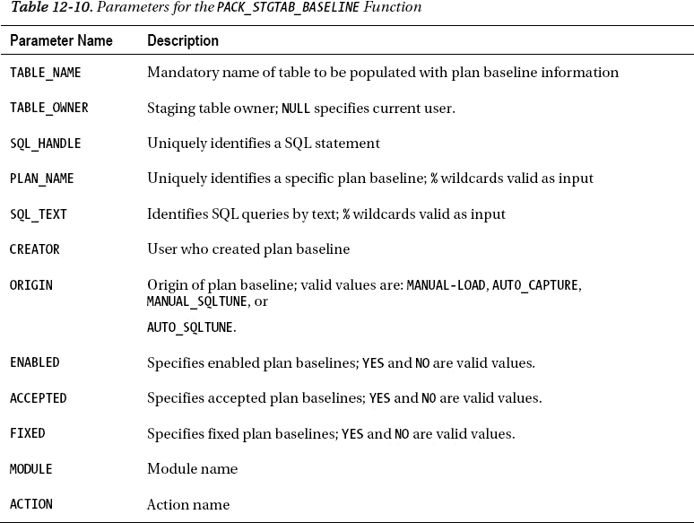

## 第 13 章

## 配置优化器

成本优化器为 SQL 语句确定最高效的执行计划。优化器在很大程度上依赖于你（或数据库）收集的统计信息。本章解释如何设置优化器目标以及如何控制优化器的行为。你将学习如何启用和禁用数据库的自动统计信息收集，以及何时手动收集统计信息。你将学习如何设置统计信息收集的首选项，以及如何在让优化器使用新统计信息之前对其进行验证。本章还解释了如何锁定统计信息、导出统计信息、收集系统统计信息、恢复旧版本的统计信息，以及如何处理缺失的统计信息。

绑定窥探行为（即优化器在解析 SQL 语句时查看绑定变量值）可能对执行计划产生不可预测的影响。本章解释了自适应游标共享，该功能旨在基于绑定变量的具体值来生成执行计划。

收集大表的统计信息始终是个问题，本章展示了如何使用增量统计信息收集功能来加速大型分区表的统计信息收集。你还将学习如何使用新的并发统计信息收集功能来优化大表的统计信息收集。

为表达式和列组收集扩展统计信息可以提高优化器性能，你将学习如何收集这些类型的统计信息。本章还解释了如何让数据库告诉你表中的哪些列是创建列组的候选列。

### 13-1. 选择优化器目标

#### 问题

你想为数据库设置成本优化器目标。

#### 解决方案

你可以通过设置优化器目标来影响成本优化器的行为。优化器将根据你设置的目标收集相应的统计信息。你使用 `optimizer_mode` 初始化参数来设置优化器目标。你可以将该参数设置为 `ALL_ROWS` 或 `FIRST_ROWS_n`，如下所示：
```sql
optimizer_mode=all_rows
optimizer_mode=first_rows_n          /* n 可以是 1,10,100 或 1000 */
```

`optimizer_mode` 参数的默认值是 `ALL_ROWS`。

#### 工作原理

`optimizer_mode` 参数的默认值 `ALL_ROWS` 的目标是最大化吞吐量——它最小化完成整个语句处理并获取所有请求行所需的资源使用。替代值 `FIRST_ROWS_n` 使用的目标是响应时间，即返回前 *n* 行所需的时间。

如果你将 `optimizer_mode` 参数设置为 `FIRST_ROWS_n`，所有会话都将使用最佳响应时间的优化器目标。但是，你也可以仅在会话级别更改优化器目标，方法是执行如下 SQL 语句：
```sql
SQL> alter session set optimizer_mode=first_rows_1;
```

请注意，`ALL_ROWS` 优化器模式设置偏向于全表扫描，因为其目标是最小化资源使用。另一方面，`FIRST_ROWS_n` 设置则倾向于索引访问，因为其目标是最小化响应时间，从而尽可能快地返回请求的行数。

除了 `optimizer_mode` 参数外，你还可以设置以下参数来影响优化器的行为：
*   `optimizer_index_caching`
*   `optimizer_index_cost_adj`
*   `db_file_multiblock_read_count`

通常，在数据库级别更改这些参数可能会导致优化器行为出现意外情况，包括某些查询的性能可能恶化。推荐的做法是将这些参数保持在其默认级别。不过，我们确实展示了（方案 13-11）如何在会话级别使用其中一个参数（`optimizer_index_cost_adj`）来提高长时间运行的查询的性能，方法是强制优化器使用索引。

### 13-2. 启用自动统计信息收集

#### 问题

你想在数据库中启用自动统计信息收集。

 **提示** Oracle 建议启用自动优化器统计信息收集。


