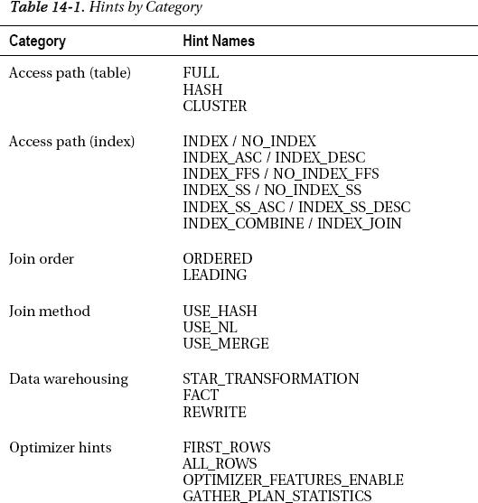
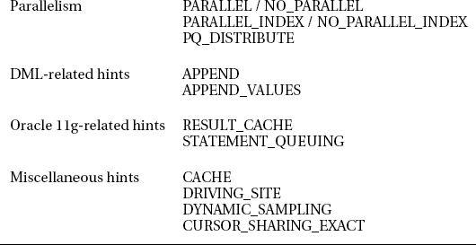

# 第 14 章 实现查询提示

在 SQL 中放置提示是提高性能的一种常见且简单的方法。提示会影响 Oracle 优化器，使其采取特定的路径来完成给定任务，从而覆盖优化器可能选择的默认路径。提示也可以被视为一把双刃剑。如果实施和维护不当，从长远来看它们可能会损害性能。

使用提示最常见的原因只是为了更快地从数据库中获取数据，许多可用的提示也是为此目的而设计的。Oracle 数据库支持超过 60 个提示，因此很明显，提示可以因多种原因被放置在 SQL 中。本章的目的是将这些提示分类为不同的子集，然后展示一些流行且对性能影响最大的提示的具体示例。

在 SQL 中放置提示的一些原因包括：更改数据库的访问路径、更改执行连接操作的查询的连接顺序或连接类型、用于 DML 的提示、以及用于数据仓库特定操作的提示，等等。此外，还有 Oracle 11g 的新提示，以利用 Oracle 11g 的一些新特性。

## 14-1. 编写提示

### 问题

您希望将一个提示放入 SQL 语句中。

### 解决方案

使用 `/*+ hint */` 语法将您的提示放入语句中——例如：

```
SELECT /*+ full(emp) */ * FROM emp;
```

请确保在加号后面留一个空格。`/*+` 序列正好是三个字符长，没有空格。通常，您希望将提示紧跟在开始 SQL 语句的动词之后。虽然不要求将此字符序列放在 SQL 动词之后，但这是惯例。

### 工作原理

提示由放置在 SQL 语句中的特殊字符界定。每个提示以正斜杠开始，后跟星号和加号字符。它们以星号和正斜杠结束：

```
SELECT /*+ full(emp) */ * FROM emp;
```

表 14-1 将许多最流行的提示分解为特定类别。此表旨在使您能够根据特定需求更容易地找到合适的提示，因此请记住，其中一些提示实际上可以属于多个类别。关于提示要记住的另一点是，对于许多提示，您可以启用某个特定特性或方面，也可以禁用该特性或方面。例如，有一个 `INDEX` 提示用于启用索引的使用。还有一个 `NO_INDEX` 提示，用于禁用索引的使用。对于 Oracle 数据库中许多可用的提示来说都是如此。

有关提示的完整列表，请参阅您所使用的数据库版本的《Oracle 数据库性能调优指南》。




## 14-2. 更改访问路径

### 问题

您有一个查询，您已确定它没有采用您期望的访问路径。

## 解决方案

您可以通过在查询中放置访问路径提示来更改 SQL 语句的访问路径。最常放置在查询中的两种访问路径提示是告诉 Oracle 优化器执行全表扫描或使用索引。通常，优化器在为查询选择最佳或至少合理的数据访问路径方面表现良好。但有时，由于表中数据的特定构成、对象的统计信息或特定数据库的配置，优化器不一定能做出最佳选择。在这些情况下，您可以通过在查询中放置提示来影响优化器。

当您决定在查询中放置提示时，您应该已经知道优化器没有做出您想要的选择。假设您想在查询中放置一个提示，告诉优化器修改访问路径以执行全表扫描，或更改优化器访问表中数据的方式。如果您的查询将返回大量行，则全表扫描是合适的。例如，如果您想对您的表执行全表扫描，您的提示将如下所示：

```sql
SELECT /*+ full(emp) */ empno, ename
FROM emp
WHERE DEPTNO = 20;
```

上述提示指示优化器绕过对 `EMP` 表上任何可能索引的使用，而只是扫描整个表以检索查询所需的数据。

反过来，假设您正在从 `EMP` 表中检索一个更小的数据子集，并且想要获取部门 20 中那些员工的平均工资。您可以告诉优化器在查询中使用给定表上的索引：

```sql
SELECT /*+ index(emp emp_i2) */ avg(sal)
FROM emp
WHERE deptno = 20;
```

 语法错误或不当的提示会被优化器忽略。

## 工作原理

访问路径提示，像许多提示一样，被放置在您的查询中，因为您已经知道优化器将为您的查询采用何种访问路径，并且您相信使用您通过提示指定的方法会更有效。在您使用提示之前，非常重要的一点是验证您是否没有得到您期望的或认为应该得到的访问路径。您还可以通过分析有提示和无提示时优化器的查询成本来衡量潜在的性能提升。

例如，您想将您的工资与公司内其他职位的工资进行比较，因此您编写了以下查询，以按职位获取最低、平均和最高工资。

```sql
SELECT job, min(sal), avg(sal), max(sal)
FROM emp
WHERE deptno=20
GROUP BY job;
```

```
-----------------------------------------------
| Id  | Operation                    | Name   |
-----------------------------------------------
|   0 | SELECT STATEMENT             |        |
|   1 |  HASH GROUP BY               |        |
|   2 |   TABLE ACCESS BY INDEX ROWID| EMP    |
|   3 |    INDEX RANGE SCAN          | EMP_I2 |
-----------------------------------------------
```

如果您想绕过查询中索引的使用，在查询中放置 `FULL` 提示将指示优化器绕过索引的使用：

```sql
SELECT /*+ full(emp) */ job, min(sal), avg(sal), max(sal)
FROM emp
WHERE deptno=20
GROUP BY job;
```

```
-----------------------------------
| Id  | Operation         | Name  |
-----------------------------------
|   0 | SELECT STATEMENT  |       |
|   1 |  HASH GROUP BY    |       |
|   2 |   TABLE ACCESS FULL| EMP  |
-----------------------------------
```

另一种告诉优化器绕过索引使用的方法是告诉优化器不要使用索引来检索给定查询的数据。在这种特定情况下，它与 `FULL` 提示效果相同：

```sql
SELECT /*+ no_index(emp) */ job, min(sal), avg(sal), max(sal)
FROM emp
WHERE deptno=20
GROUP BY job;
```

您也可以明确指定您希望绕过的索引名称：

```sql
SELECT /*+ no_index(emp emp_i2) */ job, min(sal), avg(sal), max(sal)
FROM emp
WHERE deptno=20
GROUP BY job;
```

在上述两种情况下，结果都是全表扫描。在另一种情况下，您的查询可能可以使用不同的索引。例如，在我们的 `EMP` 表上，我们在 `DEPTNO` 列上有一个索引，在 `HIREDATE` 列上也有一个索引。如果我们想执行一个查询来获取 1980 年入职的部门 20 的员工，我们的查询将如下所示：

```sql
SELECT empno, ename
FROM emp
WHERE DEPTNO = 20
AND hiredate
BETWEEN to_date('1980-01-01','yyyy-mm-dd')
AND to_date('1980-12-31','yyyy-mm-dd');
```

```
----------------------------------------------
| Id  | Operation                   | Name   |
----------------------------------------------
|   0 | SELECT STATEMENT            |        |
|   1 |  TABLE ACCESS BY INDEX ROWID| EMP    |
|   2 |   INDEX RANGE SCAN          | EMP_I1 |
----------------------------------------------
```

在这种情况下，优化器选择了 `EMP_I1` 索引，这是 `HIREDATE` 列上的索引。我们可以指示优化器绕过该索引的使用：

```sql
SELECT /*+ no_index(emp emp_i1) */ job, min(sal), avg(sal), max(sal)
FROM emp
WHERE deptno=20
GROUP BY job;
```

在这种情况下，我们不一定知道优化器接下来会做什么。它可能会决定使用我们在 `DEPTNO` 列上的另一个索引，或者它可能选择执行全表扫描。在使用提示时，尽可能具体地指示优化器该做什么是一个好的实践。因此，如果我们放置一个索引提示来告诉优化器使用 `DEPTNO` 列上的索引，我们可以看到优化器现在使用了该索引：

```sql
SELECT /*+ index(emp emp_i2) */ empno, ename
FROM emp
WHERE DEPTNO = 20
AND hiredate
BETWEEN to_date('1980-01-01','yyyy-mm-dd')
AND to_date('1980-12-31','yyyy-mm-dd');
```

```
----------------------------------------------
| Id  | Operation                   | Name   |
----------------------------------------------
| 0 | SELECT STATEMENT            |        |
| 1 |  TABLE ACCESS BY INDEX ROWID| EMP    |
| 2 |   INDEX RANGE SCAN          | EMP_I2 |
----------------------------------------------
```

索引提示的其他例子包括用于索引快速全扫描的 `INDEX_FFS` 和用于索引跳跃扫描的 `INDEX SS`。如果您有一个包含复合、多列索引的表，`INDEX_SS` 提示是合适的。即使查询不使用索引的前导列，也可能让 Oracle 使用该索引。有时，即使 `WHERE` 子句中提到的列不是索引的前导列，`INDEX_SS` 提示也可以有益于快速检索数据。例如，如果我们想获取所有获得佣金的员工的名字，我们的查询将如下所示：

```sql
SELECT ename, comm FROM emp
WHERE comm > 0;
```

```
----------------------------------
| Id  | Operation        | Name  |
----------------------------------
|   0 | SELECT STATEMENT |       |
|   1 |  TABLE ACCESS FULL| EMP  |
----------------------------------
```

如执行计划所示，没有使用索引。我们碰巧知道在我们的 `EMP` 表的 `SAL` 和 `COMM` 列上有一个复合索引。我们可以添加一个提示来使用此索引，以获得在 `COMM` 列上拥有索引的好处，即使它不是索引的前导列：

```sql
SELECT /*+ index_ss(emp emp_i3) */ ename, comm FROM emp
WHERE comm > 0;
```

```
----------------------------------------------
| Id  | Operation                   | Name   |
----------------------------------------------
|   0 | SELECT STATEMENT            |        |
|   1 |  TABLE ACCESS BY INDEX ROWID| EMP    |
|   2 |   INDEX SKIP SCAN           | EMP_I3 |
----------------------------------------------
```

 注意：提示会影响优化器，但优化器仍可能选择忽略查询中指定的任何提示。


### 14-3. 更改连接顺序

#### 问题

你遇到一个涉及多表连接的查询性能问题，且 Oracle 优化器没有选择你期望的连接顺序。

#### 解决方案

有两个提示（hint）——`ORDERED` 提示和 `LEADING` 提示——可用于影响查询中使用的连接顺序。

##### 使用 `ORDERED` 提示

你正在运行一个连接两个表 `EMP` 和 `DEPT` 的查询，以获取每个员工的部门名称。通过在查询中加入 `ORDERED` 提示，你可以看到该提示如何改变执行访问路径——例如：

```sql
SELECT ename, deptno
FROM emp JOIN dept USING(deptno);
```

```
---------------------------------------
| Id  | Operation          | Name     |
---------------------------------------
|   0 | SELECT STATEMENT   |          |
|   1 |  HASH JOIN         |          |
|   2 |   INDEX FULL SCAN  | PK_DEPT  |
|   3 |   TABLE ACCESS FULL| EMP      |
---------------------------------------
```

```sql
SELECT /*+ ordered */ ename, deptno
FROM emp JOIN dept USING(deptno);
```

```
---------------------------------------
| Id  | Operation          | Name     |
---------------------------------------
|   0 | SELECT STATEMENT   |          |
|   1 |  NESTED LOOPS      |          |
|   2 |   TABLE ACCESS FULL| EMP      |
|   3 |   INDEX UNIQUE SCAN| PK_DEPT  |
---------------------------------------
```

##### 使用 `LEADING` 提示

与使用 `ORDERED` 提示的示例类似，你同样可以控制指定查询的连接顺序。`LEADING` 提示的不同之处在于，你是在提示内部指定连接顺序，而对于 `ORDERED` 提示，则是在查询的 `FROM` 子句中指定。以下是一个示例：

```sql
SELECT /*+ leading(dept, emp) */ ename, deptno
FROM emp JOIN dept USING(deptno);
```

```
---------------------------------------
| Id  | Operation          | Name     |
---------------------------------------
|   0 | SELECT STATEMENT   |          |
|   1 |  NESTED LOOPS      |          |
|   2 |   TABLE ACCESS FULL| EMP      |
|   3 |   INDEX UNIQUE SCAN| PK_DEPT  |
---------------------------------------
```

从上述查询中，我们可以看到 `FROM` 子句中指定的表顺序是无关紧要的，因为连接顺序是由 `LEADING` 提示本身指定的。

#### 工作原理

指定这些提示的主要目的是用于已知最优连接顺序的多表连接。这通常基于对给定查询的经验，根据数据和表的构成得知。在这些情况下，指定这些提示可以节省优化器处理所有可能连接顺序以确定最优顺序所需的时间。这可以提高查询性能，尤其是在查询中需要连接的表数量增加时。

当使用这些提示中的任何一个时，你是在指示优化器关于表的连接顺序。因此，至关重要的是你需要知道该提示是否会提高查询的性能。Oracle 建议在可能的情况下使用 `LEADING` 提示而非 `ORDERED` 提示，因为 `LEADING` 提示内置了更多的灵活性。指定 `ORDERED` 提示时，连接顺序是根据 `FROM` 子句中的表列表来指定的；而对于 `LEADING` 提示，连接顺序是在提示本身内部指定的。

### 14-4. 更改连接方法

#### 问题

你的一个查询中，优化器选择了非最优的连接类型，你希望通过在查询中放置适当的提示来覆盖该连接类型。

#### 解决方案

有三种可能的连接类型：嵌套循环（nested loops）、哈希（hash）和排序合并（sort merge）。根据表的大小，某些连接类型比其他类型性能更好。你可以使用提示来指定你首选的连接方法。

##### 嵌套循环连接提示

要调用嵌套循环连接，请使用 `USE_NL` 提示，并将需要连接的两个表放在 `USE_NL` 提示内的括号中：

```sql
SELECT /*+ use_nl(emp, dept)  */ ename, dname
FROM emp JOIN dept USING (deptno);
```

```
-----------------------------------------------
| Id  | Operation                    | Name   |
-----------------------------------------------
|   0 | SELECT STATEMENT             |        |
|   1 |  NESTED LOOPS                |        |
|   2 |   NESTED LOOPS               |        |
|   3 |    TABLE ACCESS FULL         | DEPT   |
|   4 |    INDEX RANGE SCAN          | EMP_I2 |
|   5 |   TABLE ACCESS BY INDEX ROWID| EMP    |
-----------------------------------------------
```

嵌套循环连接在连接小表时通常效果最佳。在嵌套循环连接中，一个表被视为“驱动”表。这是连接中的外表。对于驱动外表中的每一行，都会在内表中搜索匹配的行。在上述语句的执行计划中，`EMP` 表是驱动外表，在执行计划中它显示为计划的最外层部分。`DEPT` 表是内表，显示为执行计划的最内层部分。

##### 哈希连接提示

要调用哈希连接，请使用 `USE_HASH` 提示，并将需要连接的两个表放在 `USE_HASH` 提示内的括号中：

```sql
SELECT /*+ use_hash(emp_all, dept)  */ ename, dname
FROM emp_all JOIN dept USING (deptno);
```

```
----------------------------------------------
| Id  | Operation          | Name    | Rows  |
----------------------------------------------
|   0 | SELECT STATEMENT   |         |  1037K|
|   1 |  HASH JOIN         |         |  1037K|
|   2 |   TABLE ACCESS FULL| DEPT    |     4 |
|   3 |   TABLE ACCESS FULL| EMP_ALL |  1037K|
----------------------------------------------
```

为了使优化器使用哈希连接，连接条件必须是等值连接（equijoin）。哈希连接最适合用于连接大量数据或需要表中大比例行的情况。优化器会使用两个表中较小的一个，根据两个表之间的连接键来构建哈希表。在上面的例子中，`DEPT` 表是较小的表，将用于构建哈希表。为了获得最佳性能，哈希表应完全驻留在内存中。

##### 排序合并连接提示

要调用排序合并连接，请使用 `USE_MERGE` 提示，并将需要连接的两个表放在 `USE_MERGE` 提示内的括号中：

```sql
SELECT /*+ use_merge(emp, dept)  */ ename, dname
FROM emp JOIN dept USING (deptno)
WHERE deptno != 20;
```

```
------------------------------------------------
| Id  | Operation                    | Name    |
------------------------------------------------
|   0 | SELECT STATEMENT             |         |
|   1 |  MERGE JOIN                  |         |
|   2 |   TABLE ACCESS BY INDEX ROWID| DEPT    |
|   3 |    INDEX FULL SCAN           | PK_DEPT |
|   4 |   SORT JOIN                  |         |
|   5 |    TABLE ACCESS FULL         | EMP     |
------------------------------------------------
```

排序合并连接与哈希连接类似，用于连接大量数据。与哈希连接不同的是，排序合并连接用于表之间的连接条件不是等值连接的情况。通常，哈希连接的性能优于排序合并连接，除非数据在两个表上已经排序。在此操作期间，来自两个表的输入数据会根据连接键进行排序，然后合并在一起。


