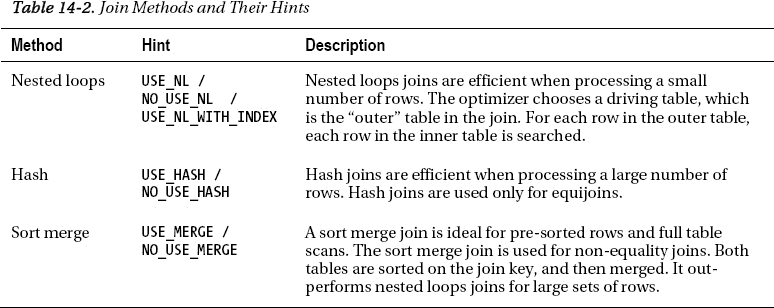
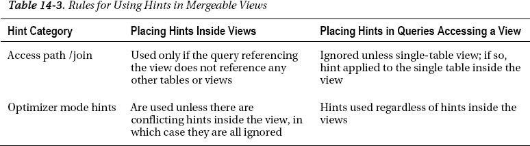
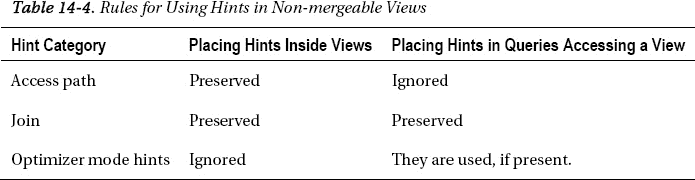
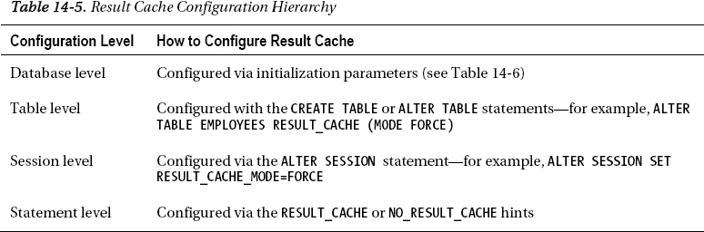
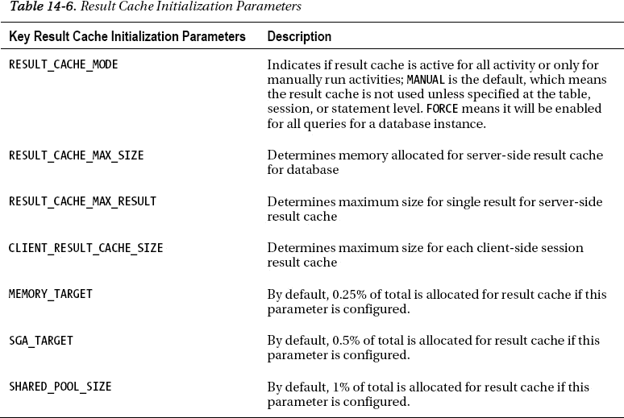
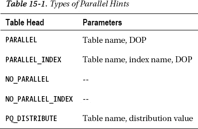
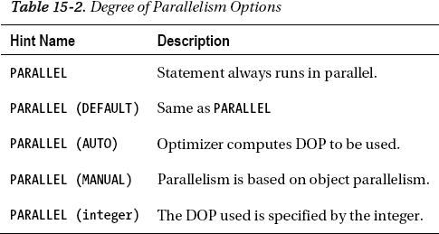

# 多表查询时的联接提示

如果您正在联接多个表，并希望在查询中为所有关联表调用特定的联接方法，则必须为每个联接条件添加一个提示——例如：

```sql
SELECT /*+ use_hash(employees, department) use_hash(departments, locations)  */
last_name, first_name, department_name,  city, state_province
FROM employees JOIN departments USING (department_id)
JOIN locations USING (location_id);
```

```
-----------------------------------------------------
| Id  | Operation               | Name              |
-----------------------------------------------------
|   0 | SELECT STATEMENT        |                   |
|   1 |  HASH JOIN              |                   |
|   2 |   HASH JOIN             |                   |
|   3 |    TABLE ACCESS FULL    | LOCATIONS         |
|   4 |    TABLE ACCESS FULL    | DEPARTMENTS       |
|   5 |   VIEW                  | index$_join$_001  |
|   6 |    HASH JOIN            |                   |
|   7 |     INDEX FAST FULL SCAN| EMP_NAME_IX       |
|   8 |     INDEX FAST FULL SCAN| EMP_DEPARTMENT_IX |
-----------------------------------------------------
```

## 工作原理

表 14-2 总结了可用于不同联接方法的各种提示。有时，由于以下几个因素，需要使用提示来指示优化器选择联接方法：

*   表上统计信息的状态
*   PGA 的大小
*   数据在联接时是否已排序
*   优化器做出了无法解释的选择

Oracle 建议尽可能不使用提示，因为随着时间的推移，在某一时刻、某种环境、某一数据库软件版本下最优的选择，下次可能就不再是最优的。然而，有时这些提示对于满足短期需求非常有帮助，或者可能是让优化器按照您意愿行事的唯一方法。



 **提示** 您的 PGA 大小会影响优化器为查询选择的联接方法。

## 14-5. 更改优化器版本

### 问题

您已升级到较新版本的 Oracle，并且遇到了与较新版本 Oracle 相关的查询性能问题。该问题仅限于少数查询，因此您希望在这些查询中放置一个提示，以使用先前版本的优化器规则和功能。

### 解决方案

为了为给定查询指定优化器版本，您需要在 `optimizer_features_enable` 提示中指定您期望的优化器版本。在括号内，用单引号括起所需的数据库版本。

```sql
SELECT /*+ optimizer_features_enable('10.2') */ *
FROM EMP JOIN DEPT USING(DEPTNO);
```

此方法主要用作升级后立即提高性能的临时措施，直到可以进行分析并找到针对查询和升级后数据库版本的解决方案。

### 工作原理

您可以修改给定查询的优化器版本。这可以通过 `optimizer_features_enable` 提示完成，并且仅对给定查询生效。使用此提示的主要原因是，在某个特定 Oracle 版本下表现良好的查询，在 Oracle 数据库版本升级后性能立即下降。

有一个 Oracle 初始化参数 `optimizer_features_enable`，可以为整个数据库实例更改它。如果您在升级数据库后立即遇到查询性能问题广泛发生，这是一个可选方案。然而，在数据库实例级别更改此参数通常并不可行，甚至并不理想，因为升级的主要原因是为了利用新特性。因此，除非存在重大且广泛的性能问题，否则不建议为整个数据库实例更改 `optimizer_features_enable` 参数。

如果您有一个特定的查询或一小部分关键查询在升级后性能不达标，一个快速恢复到升级前性能的方法是使用 `optimizer_features_enable` 提示，为给定查询指向特定版本的优化器。

## 14-6. 在快速响应与全局优化之间选择

### 问题

执行查询时，您可以在两个目标之间做出选择：

*   *快速初始响应*：尽快开始返回部分行。
*   *全局优化*：以牺牲前期处理时间为代价，最小化总体成本。

您的实例会为其配置一个默认目标。您可以按查询指定提示，以覆盖默认目标，并为特定查询获得所需的行为。

### 解决方案

有些提示可用于覆盖数据库实例的优化目标。在使用与 `optimizer_mode` 相关的任何提示之前，您首先需要确认数据库实例当前的设置。如果您拥有 `SELECT ANY DICTIONARY` 系统权限，可以查看 `optimizer_mode` 参数的设置值。

```sql
SQL> show parameter optimizer_mode

NAME                 TYPE        VALUE
-------------------- -------------------- --------------------
optimizer_mode       string      ALL_ROWS
```

如果我们为示例查询运行执行计划，我们可以看到使用数据库实例默认 `optimizer_mode` 设置时的执行计划。

```sql
SELECT *
FROM employees NATURAL JOIN departments;
```

```
------------------------------------------
| Id  | Operation          | Name        |
------------------------------------------
|   0 | SELECT STATEMENT   |             |
|   1 |  HASH JOIN         |             |
|   2 |   TABLE ACCESS FULL| DEPARTMENTS |
|   3 |   TABLE ACCESS FULL| EMPLOYEES   |
------------------------------------------
```

由于上述查询对表进行了全表扫描，而我们希望尽快看到一些行（但不一定是完整的结果集），我们可以传入一个 `FIRST_ROWS` 提示来完成此任务。很明显，这改变了优化器的执行计划以便尽快提供结果。

```sql
SELECT /*+ first_rows */ *
FROM employees NATURAL JOIN departments;
```

```
----------------------------------------------------
| Id  | Operation                    | Name        |
----------------------------------------------------
|   0 | SELECT STATEMENT             |             |
|   1 |  NESTED LOOPS                |             |
|   2 |   NESTED LOOPS               |             |
|   3 |    TABLE ACCESS FULL         | EMPLOYEES   |
|   4 |    INDEX UNIQUE SCAN         | DEPT_ID_PK  |
|   5 |   TABLE ACCESS BY INDEX ROWID| DEPARTMENTS |
----------------------------------------------------
```

如果我们需要相反的情况，并且数据库的默认 `optimizer_mode` 设置为 `FIRST_ROWS`，我们可以提供一个 `ALL_ROWS` 提示来告诉优化器在确定执行计划时使用该模式：

```sql
SQL> alter system set optimizer_mode=first_rows scope=both;

System altered.

SQL> show parameter optimizer_mode

NAME                 TYPE        VALUE
-------------------- -------------------- --------------------
optimizer_mode       string      FIRST_ROWS
```

```sql
SELECT /*+ all_rows */ *
FROM employees NATURAL JOIN departments;
```

```
------------------------------------------
| Id  | Operation          | Name        |
------------------------------------------
|   0 | SELECT STATEMENT   |             |
|   1 |  HASH JOIN         |             |
|   2 |   TABLE ACCESS FULL| DEPARTMENTS |
|   3 |   TABLE ACCESS FULL| EMPLOYEES   |
------------------------------------------
```

## 工作原理

通常，快速获得初始响应的目标是用户在等待结果时的良好选择。它使数据库引擎做出选择，允许行几乎立即从查询中返回。例如，为初始响应进行优化通常会产生一个嵌套循环连接，因为这样的连接可以从一开始就返回行。代价可能是更长的总体执行时间。

降低总体查询成本的目标通常是批处理过程的不错选择。没有真实的、人类用户在等待结果，因此可以接受在初始处理上花费更多时间以减少总体查询成本。一个例子可能是执行哈希连接，它在连接完成之前不能开始返回行，但其总执行时间可能比嵌套循环连接更短。

可以在查询中使用 `FIRST_ROWS` 或 `ALL_ROWS` 提示来更改优化器模式，该模式控制前述两个目标中哪一个应用于给定的查询。

要检查数据库实例当前的优化器模式，请检查 `optimizer_mode` 初始化参数的值。通过指定优化器目标提示，它可以覆盖数据库实例级别设置的优化器模式，以及会话级别的任何设置。

`FIRST_ROWS` 提示非常流行，因为它可以快速从查询返回第一个可能的行。`ALL_ROWS` 提示也很常见，因为 `ALL_ROWS` 是 `optimizer_mode` 参数的默认值。因此，通常不需要指定 `ALL_ROWS`。

## 14-7. 执行直接路径插入

### 问题

你正在执行一个 DML `INSERT` 语句，其执行速度比所需慢。你希望优化 `INSERT` 语句以使用直接路径插入技术。

### 解决方案

通过使用 `APPEND` 或 `APPEND_VALUES` 提示，你可以显著加快在数据库上执行插入操作的过程。以下是使用 `APPEND` 提示节省性能的示例。首先，我们有一个在两个表之间执行常规插入的查询：

```sql
INSERT INTO emp_dept
SELECT * FROM emp_ctas_new;
```

```
19753072 rows created.

Elapsed: 00:01:17.86
-------------------------------------------------
| Id  | Operation                | Name         |
-------------------------------------------------
|   0 | INSERT STATEMENT         |              |
|   1 |  LOAD TABLE CONVENTIONAL | EMP_DEPT     |
|   2 |   TABLE ACCESS FULL      | EMP_CTAS_NEW |
-------------------------------------------------
```

如果在相同的 `INSERT` 语句中放置 `APPEND` 提示，我们会看到性能上的显著提升：

```sql
INSERT /*+ append */ INTO emp_dept
SELECT * FROM emp_ctas_new;
```

```
19753072 rows created.

Elapsed: 00:00:12.15
-------------------------------------------
| Id  | Operation          | Name         |
-------------------------------------------
|   0 | INSERT STATEMENT   |              |
|   1 |  LOAD AS SELECT    | EMP_DEPT     |
|   2 |   TABLE ACCESS FULL| EMP_CTAS_NEW |
-------------------------------------------
```

`APPEND` 提示仅适用于带有子查询的 `INSERT` 语句；它不适用于带有 `VALUES` 子句的 `INSERT` 语句。对于后者，你需要使用 `APPEND_VALUES` 提示。以下是两个带有 `VALUES` 子句的 `INSERT` 语句示例，我们可以看到提示对执行计划的影响：

```sql
INSERT INTO emp_dept
VALUES (15867234,'Smith, JR','Sales',1359,'2010-01-01',200,5,20);
```

```
---------------------------------------------
| Id  | Operation                | Name     |
---------------------------------------------
|   0 | INSERT STATEMENT         |          |
|   1 |  LOAD TABLE CONVENTIONAL | EMP_DEPT |
---------------------------------------------
```

```sql
INSERT /*+ append_values */ INTO emp_dept
VALUES (15867234,'Smith, JR','Sales',1359,'2010-01-01',200,5,20);
```

```
-------------------------------------
| Id  | Operation        | Name     |
-------------------------------------
|   0 | INSERT STATEMENT |          |
|   1 |  LOAD AS SELECT  | EMP_DEPT |
|   2 |   BULK BINDS GET |          |
-------------------------------------
```

### 工作原理

`APPEND` 提示在从另一个表执行 DML 插入操作的语句中工作，即，在 `INSERT INTO ... SELECT` 语句中使用子查询。这适用于需要在表之间复制大量行的情况。通过绕过 Oracle 数据库缓冲区缓存块并将数据直接追加到段高水位标记之上，它节省了大量开销。这是一种非常流行的快速向表中插入行的方法。

当你指定这些提示之一时，Oracle 将执行直接路径插入。在直接路径插入中，数据被追加到表的末尾，而不是使用在该表当前分配块内找到的空闲空间。`APPEND` 和 `APPEND_VALUES` 提示在使用时，会自动将常规插入操作转换为直接路径插入操作。此外，如果你在插入期间使用并行操作，默认的操作模式是使用直接路径模式。如果你想绕过直接路径操作，可以使用 `NOAPPEND` 提示。

请记住，如果你正在使用这些提示运行，当多个应用程序进程向同一个表插入行时，存在争用的风险。如果两个追加操作同时插入行，性能将会下降，因为插入追加操作在段的高水位标记之上追加数据，一次只应执行一个操作。但是，如果你有分区对象，只要每个插入操作在给定表的不同分区上运行，你仍然可以运行多个并发的追加操作。

## 14-8. 在视图中放置提示

### 问题

你正在创建一个视图，并希望在该视图的查询中放置一个提示，以提高访问该视图的任何查询的性能。

## 解决方案

提示（hints）可以置于视图（view）中，因为视图本质上是数据库中存储的查询。根据所使用的提示类型以及被查询的视图类型，您可以判断您的提示是否会被使用。理解您拥有的视图类型至关重要，这样才能确定提示会对该视图产生何种影响。要理解这一点，您首先需要判断您的视图属于以下哪种类型：
*   可合并（mergeable）或不可合并（non-mergeable）视图
*   简单（simple）或复杂（complex）视图

简单视图是仅引用一个表，且不含任何分组函数或表达式的视图：
```
CREATE view emp_high_sal
AS SELECT /*+ use_index(employees) */ employee_id, first_name, last_name, salary
FROM employees
WHERE salary > 10000;
```

复杂视图可以引用多个表，或者包含分组子句，或者使用函数和表达式：
```
CREATE or replace view dept_sal
AS SELECT /*+ full(employees) */ department_id, department_name,
departments.manager_id, SUM(salary) total_salary, AVG(salary) avg_salary
FROM employees JOIN departments USING(department_id)
GROUP BY department_id, department_name, departments.manager_id;
```

可合并视图是指优化器可以用视图定义内部的查询来替换调用该视图的查询。例如，我们只想从 `emp_high_sal` 视图中查询所有行。优化器可以直接转到 `employees` 表：
```
SELECT * FROM emp_high_sal;
```
```
---------------------------------------
| Id  | Operation         | Name      |
---------------------------------------
|   0 | SELECT STATEMENT  |           |
|   1 |  TABLE ACCESS FULL| EMPLOYEES |
---------------------------------------
```
优化器已简单地用定义视图的查询替换了原查询：
```
SELECT /*+ full(employees) */ department_id, department_name,
departments.manager_id, SUM(salary) total_salary, AVG(salary) avg_salary
FROM employees JOIN departments USING(department_id)
GROUP BY department_id, department_name, departments.manager_id;
```
对于可合并视图，视图内部的提示会得以保留，因为基于调用该视图的查询，视图定义的基本结构保持不变。关于可合并视图的提示使用指南，请参见表 14-3。



对于不可合并视图，优化器必须将工作分解成两个部分。它必须先执行定义视图的查询，然后必须执行顶层查询。因此，视图本身内部定义的提示会得以保留。例如，我们正在查询 `dept_sal` 视图。从执行计划中可以看出，查询被分解成了若干部分：
```
SELECT manager_id, sum(total_salary)
FROM dept_sal
GROUP BY manager_id;
```
```
-------------------------------------------------------
| Id  | Operation                       | Name        |
-------------------------------------------------------
|   0 | SELECT STATEMENT                |             |
|   1 |  HASH GROUP BY                  |             |
|   2 |   VIEW                          | DEPT_SAL    |
|   3 |    HASH GROUP BY                |             |
|   4 |     MERGE JOIN                  |             |
|   5 |      TABLE ACCESS BY INDEX ROWID| DEPARTMENTS |
|   6 |       INDEX FULL SCAN           | DEPT_ID_PK  |
|   7 |      SORT JOIN                  |             |
|   8 |       TABLE ACCESS FULL         | EMPLOYEES   |
-------------------------------------------------------
```
关于不可合并视图的提示使用指南，请参见表 14-4。



理解提示和视图所有可能的场景可能会令人困惑，因此需要谨慎使用，并且仅在其他调优手段未能满足需求时才使用。

## 工作原理

如前所述，由于视图只是一个存储的查询，提示可以像在任何查询中一样轻松地置于视图内部。放置在视图中的提示类型将决定提示在视图内部是否以及如何被使用。就像在视图上执行 DML 操作一样，提示在何时会被使用或忽略也存在限制。

根据经验，视图越简单，提示有效的可能性越大。由于每个应用程序、每个查询和每个视图都具有独特性，要知道一个提示是否会被使用的唯一真正方法，就是简单地尝试该提示并执行执行计划来验证给定的提示是否被使用。

Oracle 不建议在视图中放置提示，因为底层对象可能随时间变化，您可能会遇到不可预测的执行计划。此外，视图可能是为某个特定用途创建的，但以后可能用于其他目的，而视图中的任何提示可能无法适用于所有场景。另外，放置在视图内部的提示的管理方式与直接执行查询本身时不同。在视图内部放置的任何提示被使用之前，优化器需要确定该视图是否可以与其调用查询合并。

您也可以考虑在访问视图的查询中放置提示。当在访问自身包含提示的视图的查询中放置提示时，理解优先级规则很重要。这尤其突显了在视图中放置提示之前需要谨慎的必要性。

 `提示` 在引用复杂视图的查询中放置的提示会被忽略。

### 14-9\. 缓存查询结果

#### 问题

您希望提高一组经常使用的查询的性能，并希望使用 Oracle 的结果缓存（result cache）来存储查询结果，以便在相同查询再次执行时能快速检索以供未来使用。


### 解决方案

结果缓存是 Oracle 11g 的新特性，其创建目的是将常用查询的结果存储在内存中，以便快速轻松地检索。如果你对某个查询执行执行计划，可以查看其结果是否会存储在结果缓存中：

```sql
SELECT /*+ result_cache */
job_id, min_salary, avg(salary) avg_salary, max_salary
FROM employees JOIN jobs USING (job_id)
GROUP BY job_id, min_salary, max_salary;
```

```
---------------------------------------------------------------------
| Id  | Operation                       | Name                      |
---------------------------------------------------------------------
|   0 | SELECT STATEMENT                |                           |
|   1 |  RESULT CACHE                   | 5t4cc5n1gdyfh46jdhfttnhx4g|
|   2 |   HASH GROUP BY                 |                           |
|   3 |    NESTED LOOPS                 |                           |
|   4 |     NESTED LOOPS                |                           |
|   5 |      TABLE ACCESS FULL          | EMPLOYEES                 |
|   6 |      INDEX UNIQUE SCAN          | JOB_ID_PK                 |
|   7 |     TABLE ACCESS BY INDEX ROWID | JOBS                      |
---------------------------------------------------------------------
```

然后，如果你查询 `V$RESULT_CACHE_OBJECTS` 视图，可以通过查看执行计划中的 `CACHE_ID` 值来验证查询结果是否已存储在结果缓存中。

```sql
SELECT ID, TYPE, to_char(CREATION_TIMESTAMP,'yyyy-mm-dd:hh24:mi:ss') cr_date,
BLOCK_COUNT blocks, COLUMN_COUNT columns, PIN_COUNT pins, ROW_COUNT "ROWS"
FROM   V$RESULT_CACHE_OBJECTS
WHERE  CACHE_ID = '5t4cc5n1gdyfh46jdhfttnhx4g';
```

```
        ID TYPE    CR_DATE              BLOCKS  COLUMNS  PINS       ROWS
---------- ------- ------------------- ------- -------- ----- ----------
         4 Result  2011-03-19:15:20:43       1        4     0         19
```

如果由于某些原因，你的数据库在数据库或表级别被设置为默认的 `FORCE` 模式，你可以使用 `NO_RESULT_CACHE` 提示来绕过结果缓存。如果我们在结果缓存模式设置为 `FORCE` 的情况下运行之前的查询，很明显结果缓存会被自动使用。

```sql
SQL> show parameter result_cache_mode
```

```
NAME                  TYPE          VALUE
--------------------  ------------  --------------------
result_cache_mode     string        FORCE
```

```sql
select job_id, min_salary, avg(salary) avg_salary, max_salary
from employees join jobs using (job_id)
group by job_id, min_salary, max_salary;
```

```
---------------------------------------------------------------------
| Id  | Operation                       | Name                      |
---------------------------------------------------------------------
|   0 | SELECT STATEMENT                |                           |
|   1 |  RESULT CACHE                   | 5t4cc5n1gdyfh46jdhfttnhx4g|
|   2 |   HASH GROUP BY                 |                           |
|   3 |    NESTED LOOPS                 |                           |
|   4 |     NESTED LOOPS                |                           |
|   5 |      TABLE ACCESS FULL          | EMPLOYEES                 |
|   6 |      INDEX UNIQUE SCAN          | JOB_ID_PK                 |
|   7 |     TABLE ACCESS BY INDEX ROWID | JOBS                      |
---------------------------------------------------------------------
```

如果我们使用 `NO_RESULT_CACHE` 提示重新运行，则不会使用结果缓存，语句将被执行：

```sql
SELECT /*+ no_result_cache */ job_id, min_salary, avg(salary) avg_salary, max_salary
FROM employees JOIN jobs USING (job_id)
GROUP BY job_id, min_salary, max_salary;
```

```
---------------------------------------------------
| Id  | Operation                       | Name    |
---------------------------------------------------
|   0 | SELECT STATEMENT                |         |
|   1 |  HASH GROUP BY                  |         |
|   2 |   NESTED LOOPS                  |         |
|   3 |    NESTED LOOPS                 |         |
|   4 |     TABLE ACCESS FULL           | EMPLOYEES|
|   5 |     INDEX UNIQUE SCAN           | JOB_ID_PK|
|   6 |    TABLE ACCESS BY INDEX ROWID  | JOBS    |
---------------------------------------------------
```

以下查询运行了两次，第一次未使用结果缓存，第二次使用了结果缓存，性能差异显著：

```sql
SELECT /*+ no_result_cache */
j.job_id, min_salary, avg(salary) avg_salary, max_salary, department_name
FROM employees_big e, jobs j, departments d
WHERE e.department_id = d.department_id
AND e.job_id = j.job_id
AND salary BETWEEN 5000 AND 9000
GROUP BY j.job_id, min_salary, max_salary, department_name;
```

```
JOB_ID      MIN_SALARY AVG_SALARY MAX_SALARY DEPARTMENT_NAME
---------- ---------- ---------- ---------- ------------------------------
ST_MAN           5500       7280       8500 Shipping
SA_REP           6000       7494      12000 Sales
HR_REP           4000       6500       9000 Human Resources
AC_ACCOUNT       4200       8300       9000 Accounting
IT_PROG          4000       7500      10000 IT
FI_ACCOUNT       4200       7920       9000 Finance
MK_REP           4000       6000       9000 Marketing

7 rows selected.

Elapsed: 00:00:21.80
```

```sql
SELECT /*+ result_cache */
j.job_id, min_salary, avg(salary) avg_salary, max_salary, department_name
FROM employees_big e, jobs j, departments d
WHERE e.department_id = d.department_id
AND e.job_id = j.job_id
AND salary BETWEEN 5000 AND 9000
GROUP BY j.job_id, min_salary, max_salary, department_name;
```

```
Elapsed: 00:00:00.08
```

### 工作原理

`result_cache` 提示如果出现在查询中，将覆盖任何数据库级、表级或会话级的结果缓存设置。在查询中使用提示之前，你需要确定数据库上结果缓存的配置。有两个独立的结果缓存需要关注：服务器端结果缓存和客户端结果缓存。服务器端结果缓存是 SGA 共享池的一部分，用于存储 SQL 查询结果和 PL/SQL 函数结果。查询时间可以显著改善，因为查询结果会首先在结果缓存中检查，如果结果存在，则直接从内存中提取，而无需执行查询。结果缓存最适用于运行频繁且产生相同结果的查询。

结果缓存可以在多个级别进行配置。如 表 14-5 所示，它可以在数据库级、会话级、表级或语句级进行配置。语句级是指定提示的地方。如果你决定在数据库中配置结果缓存，则需要配置几个初始化参数。表 14-6 回顾了这些参数。有些是结果缓存的特定参数，而其余与内存相关的参数则需要分析是否需要更改以适应结果缓存。





### 14-10. 将分布式查询定向到特定数据库

#### 问题

你正在连接两个或多个位于不同数据库上的表，并希望将工作定向到特定的数据库上执行，因为大部分数据都存放在远程数据库中。


#### 解决方案

默认情况下，当你连接存在于不同数据库的表时，查询起源的数据库是大部分工作发生的地方。你可以改变此行为，并告诉优化器哪个数据库将执行工作：

```
SELECT /*+ driving_site(employees) */ first_name, last_name, department_name
FROM employees@to_emp_link JOIN departments USING(department_id);
```

如果远程站点的数据量很大，或者你在远程站点上查询许多表，那么指定远程站点作为驱动是最合适的。为了处理分布式查询，优化器首先必须将远程表中的行传送到本地站点，然后再处理整个查询。这对本地数据库上的临时表空间可能非常耗费资源。因此，通过指示优化器在数据占比最大的站点执行工作，你可以显著提升查询性能。

指定这个提示时，你只需要在提示中指定远程表或表别名，就能引导优化器到将要执行工作的站点。如果你希望优化器在本地数据库执行工作，则无需指定任何提示；只有当你想将工作导向到远程数据库时，才需要指定此提示。

## 工作原理

分布式查询可能是一把双刃剑。通过能够连接来自远程数据库的表，它给用户带来数据透明性的印象，即他们需要检索的数据仿佛位于一个地方，因为他们可以编写单个查询来检索数据，而实际上这些数据可能驻留在两个或多个数据库中。这种简化查询编写的能力是执行分布式查询的一个关键优势。主要的缺点在于分布式查询的优化非常困难。本质上，发起查询的源数据库或本地数据库默认成为“驱动”数据库。本地站点的优化器不了解远程站点数据的构成或数量，因此工作被分割成若干部分，默认情况下查询不会作为一个整体进行优化。因此，理解每个数据库上数据的构成非常重要，以便尝试最佳地优化查询。对于分布式查询，你需要做出的关键决策是：你希望哪个数据库作为“驱动”站点。决定哪个站点应作为驱动站点的最大因素如下：

*   分布式查询涉及多少张表？
*   分布式查询涉及多少个数据库？
*   哪个数据库包含查询涉及的表最多？
*   哪个数据库包含的数据量最大？

本质上，如果大部分表或大量数据驻留在远程，那么使用远程数据库作为驱动站点可能是有益的。假设我们要连接三个表，以获取员工信息及其所在部门和工作地址。在此场景中，最大的员工表驻留在一个数据库上，而两个较小的表——部门表和位置表——驻留在我们的本地数据库上：

```
SELECT first_name, last_name, department_name, street_address, city
FROM employees@to_emp_link JOIN departments USING(department_id)
JOIN locations USING (location_id);
-------------------------------------------
|  Id  | Operation           | Name        |
-------------------------------------------
|    0 | SELECT STATEMENT    |             |
|    1 |  HASH JOIN          |             |
|    2 |   HASH JOIN         |             |
|    3 |    TABLE ACCESS FULL| LOCATIONS   |
|    4 |    TABLE ACCESS FULL| DEPARTMENTS |
|    5 |   REMOTE            | EMPLOYEES   |
-------------------------------------------
```

从执行计划中，我们可以看到`EMPLOYEES`表是远程表。这意味着在连接员工数据之前，所有这些员工数据都必须先传输到本地数据库，然后查询才能完成。在此情况下，员工数据是三者中最大的表。员工数量远多于部门或位置数量，因此在处理查询的剩余部分之前，会有大量数据被传输到本地数据库。所以，在这种情况下，通过让工作在员工数据所在的数据库上完成，性能可能会有所提升：

```
SELECT /*+ driving_site(employees) */
first_name, last_name, department_name, street_address, city
FROM employees@to_emp_link JOIN departments USING(department_id)
JOIN locations USING (location_id);

---------------------------------------------------------------
|  Id  | Operation                | Name                       |
---------------------------------------------------------------
|    0 | SELECT STATEMENT REMOTE  |                            |
|    1 |   HASH JOIN              |                            |
|    2 |    VIEW                  | index$_join$_001           |
|    3 |     HASH JOIN            |                            |
|    4 |      INDEX FAST FULL SCAN| EMP_DEPARTMENT_IX          |
|    5 |      INDEX FAST FULL SCAN| EMP_NAME_IX                |
|    6 |    HASH JOIN             |                            |
|    7 |     REMOTE               | DEPARTMENTS                |
|    8 |     REMOTE               | LOCATIONS                  |
---------------------------------------------------------------
```

现在，执行计划显示两个较小的表为远程表，因为`EMPLOYEES`表所在的数据库现在是查询的驱动站点。有时，当哪个站点应作为驱动站点不明显时，你可能需要通过试错来确定。

另一种简单的方法是直接判断哪个查询返回更快。如果我们想获取每个部门和位置的平均工资，查询如下所示：

```
SELECT department_name, city, avg(salary)
FROM employees_big@to_emp_link JOIN departments USING(department_id)
JOIN locations USING (location_id)
GROUP BY department_name, city
ORDER BY 2,1;
DEPARTMENT_NAME                CITY                           AVG(SALARY)
------------------------------ ------------------------------ -----------
Human Resources                London                                  6500
Public Relations               Munich                                 10000
Sales                          Oxford                           8955.88235
Accounting                     Seattle                               10150
Administration                 Seattle                                4400
Executive                      Seattle                          19333.3333
Finance                        Seattle                                8600
Purchasing                     Seattle                                4150
Shipping                       South San Francisco              3475.55556
IT                             Southlake                             5760
Marketing                      Toronto                                9500

11 rows selected.
```

`Elapsed: 00:00:42.87`

由于没有指定驱动站点提示，本地站点是驱动站点。如果我们发出相同的查询，但指定远程且更大的表作为驱动站点，我们仅仅从查询执行时间上就能看到好处：

```
SELECT /*+ driving_site(employees_big) */ department_name, city, avg(salary)
FROM employees_big@to_emp_link JOIN departments USING(department_id)
JOIN locations USING (location_id)
GROUP BY department_name, city
ORDER BY 2,1;
```

`Elapsed: 00:00:22.24`

另一种可以尝试确定哪个站点应作为驱动站点的方法是，弄清楚在每个站点上具体执行了什么工作。例如，以前面的查询为例，如果我们不使用提示，则执行以下步骤：

1.  获取查询的执行计划。
2.  在远程数据库上，确定查询的哪部分正在远程运行。

首先，我们可以查看查询的执行计划。再次说明，我们没有使用`driving_site`提示。

```
----------------------------------------------
|  Id  | Operation            | Name          |
----------------------------------------------
|    0 | SELECT STATEMENT     |               |
|    1 |  SORT GROUP BY       |               |
|    2 |   HASH JOIN          |               |
|    3 |    HASH JOIN         |               |
|    4 |     TABLE ACCESS FULL| LOCATIONS     |
|    5 |     TABLE ACCESS FULL| DEPARTMENTS   |
|    6 |    REMOTE            | EMPLOYEES_BIG |
----------------------------------------------
```

其次，我们可以确定在远程数据库上发生的操作是针对远程`EMPLOYEES_BIG`表的`SELECT`语句和列。你可以直接从远程数据库的数据字典或诸如 Enterprise Manager 之类的工具中检索此信息。

```
SELECT "SALARY","DEPARTMENT_ID"
FROM "EMPLOYEES_BIG" "EMPLOYEES_BIG"
```

如果我们使用相同的查询重复前述两个步骤，但这次为`EMPLOYEES`表插入一个`driving_site`提示，我们会得到以下结果。首先，我们可以获取带有`driving_site`提示的查询的执行计划：

```
-------------------------------------------------------------
|  Id  | Operation              | Name                       |
-------------------------------------------------------------
|    0 | SELECT STATEMENT REMOTE|                            |
|    1 |  RESULT CACHE          | 326m75n1yb5kt2qysx7f37cy2y |
|    2 |   SORT GROUP BY        |                            |
|    3 |    HASH JOIN           |                            |
|    4 |     HASH JOIN          |                            |
|    5 |      REMOTE            | LOCATIONS                  |
|    6 |      REMOTE            | DEPARTMENTS                |
|    7 |      TABLE ACCESS FULL | EMPLOYEES_BIG              |
-------------------------------------------------------------
```

其次，我们可以看到查询的哪部分正在远程站点上执行。此案例中，数据是从 Enterprise Manager 检索的：

```
SELECT "A2"."DEPARTMENT_NAME","A1"."CITY",AVG("A3"."SALARY")
FROM "EMPLOYEES_BIG" "A3","DEPARTMENTS"@! "A2","LOCATIONS"@! "A1"
WHERE "A2"."LOCATION_ID"="A1"."LOCATION_ID" AND "A3"."DEPARTMENT_ID"="A2"."DEPARTMENT_ID"
GROUP BY "A2"."DEPARTMENT_NAME","A1"."CITY" ORDER BY "A1"."CITY","A2"."DEPARTMENT_NAME"
```

没有驱动站点提示时，我们必须移动`EMPLOYEES_BIG`表的所有行，包括`SALARY`和`DEPARTMENT_ID`列。传输完这些数据后，才能处理查询结果。

使用了`driving_site`提示后，我们必须将`DEPARTMENTS`和`LOCATIONS`表的所有列的所有行移动到远程数据库。然后，才能处理查询结果。并且，因为我们使用了`driving_site`提示，查询结果编译完成后，完整的最终结果集必须被传输回发起查询的本地数据库。因此，你不仅需要考虑查询本身在数据库之间移动的数据，还需要考虑，如果你使用了`driving_site`提示，结果本身被传输回本地数据库的开销。

### 14-11. 收集扩展的查询执行统计信息

#### 问题

你希望为特定查询收集详细的执行计划统计信息，同时避免在收集期间对整个数据库实例的性能产生负面影响。

#### 解决方案

你可以使用 `GATHER_PLAN_STATISTICS` 提示。若在查询运行时加入此提示，它将生成详细的运行时统计信息。这是一个两步过程：

1.  使用 `gather_plan_statistics` 提示执行查询。
2.  使用 `dbms_xplan.display_cursor` 来显示结果。

请参见以下示例：

```sql
SELECT /*+ gather_plan_statistics */
city, round(avg(salary)) avg, min(salary) min, max(salary) max
FROM employees JOIN departments USING (department_id)
JOIN locations USING (location_id)
GROUP BY city;
```

```text
CITY                                          AVG        MIN        MAX
----------------------------------- ---------- ---------- ----------
London                                       6500       6500       6500
Seattle                                      8844       2500      24000
Munich                                      10000      10000      10000
South San Francisco                          3476       2100       8200
Toronto                                      9500       6000      13000
Southlake                                    5760       4200       9000
Oxford                                       8956       6100      14000
```

然后，你可以使用 `dbms_xplan` 来显示详细的查询统计信息。请确保 SQL Plus 的 `SERVEROUTPUT` 设置为 `OFF`，否则结果可能无法正确显示。

```sql
SELECT * FROM table(dbms_xplan.display_cursor(format=>'ALLSTATS LAST'));
```

```text
------------------------------------------------------------------------------------------
| Id  | Operation                   | Name          | Starts | E-Rows | A-Rows |  Buffers |
------------------------------------------------------------------------------------------
|   0 | SELECT STATEMENT            |               |      2 |        |     14 |       23 |
|   1 |   HASH GROUP BY             |               |      0 |     23 |      0 |       23 |
|*  2 |    HASH JOIN                |               |      0 |    106 |      0 |       23 |
|*  3 |     HASH JOIN               |               |      0 |     27 |      0 |       16 |
|   4 |      VIEW                   | index$_join$_4|      0 |     23 |      0 |        8 |
|*  5 |       HASH JOIN             |               |      0 |        |      0 |        8 |
|   6 |        INDEX FAST FULL SCAN | LOC_CITY_IX   |      0 |     23 |      0 |        4 |
|   7 |        INDEX FAST FULL SCAN | LOC_ID_PK     |      0 |     23 |      0 |        4 |
|   8 |      VIEW                   | index$_join$_2|      0 |     27 |      0 |        8 |
|*  9 |       HASH JOIN             |               |      0 |        |      0 |        8 |
|  10 |        INDEX FAST FULL SCAN | DEPT_ID_PK    |      0 |     27 |      0 |        4 |
|  11 |        INDEX FAST FULL SCAN | DEPT_LOC_IX   |      0 |     27 |      0 |        4 |
|  12 |      TABLE ACCESS FULL      | EMPLOYEES     |      0 |    107 |      0 |        7 |
------------------------------------------------------------------------------------------
```

`DISPLAY_CURSOR` 过程还有许多其他可用选项；更完整的选项列表请参阅《Oracle PL/SQL Packages and Types Reference Guide》。

#### 工作原理

`GATHER_PLAN_STATISTICS` 提示收集运行时统计信息；因此需要执行查询才能收集这些信息。如果你有一个查询的优化级别表现不佳，使用 `GATHER_PLAN_STATISTICS` 提示运行该查询可能很有用。它可以快速提供普通执行计划无法提供的信息，因为它显示了查询统计信息的估计值和实际值。由此，你可以确定优化器是否以最优方式执行 SQL，并判断是否需要任何优化。

请记住，收集这些额外的运行时统计信息需要消耗一些资源，因此请谨慎使用此选项。在某些情况下，测试运行时差异可能是值得的。此提示的一个关键好处是，额外的统计信息仅针对特定查询收集。这样，范围是有限的，不会影响数据库中的其他进程，甚至不会影响特定的会话。如果你想要一个更全局的设置来收集扩展统计信息，可以在会话或实例级别设置 `STATISTICS_LEVEL=ALL`。

一组需要快速查看的列是 `E-Rows` 和 `A-Rows` 列。通过查看这些列，你可以快速判断优化器是否基于准确的统计信息执行查询。如果这些列之间存在较大差异，则表明执行计划效率低下。进行准确分析所需的一个计算是针对 `E-Rows` 列的。你需要将 `Starts` 列与 `E-Rows` 相乘，才能准确地将总数与 `A-Rows` 进行比较。

### 14-12. 启用查询重写

#### 问题

你的数据库环境中存在物化视图，并且希望访问构成这些物化视图的源表的查询能够直接访问物化视图以检索结果。

#### 解决方案

可以使用 `REWRITE` 提示来指示优化器使用物化视图。物化视图必须启用查询重写功能，并且物化视图和相关对象的统计信息应是最新的，以增加查询被重写的可能性。请参见以下示例：

```sql
SELECT /*+ rewrite(dept_sal_mv) */ department_id,
sum(nvl(salary+(salary*commission_pct),salary)) total_compensation
FROM employees
GROUP BY department_id
having sum(nvl(salary+(salary*commission_pct),salary)) > 10000
ORDER by 2;
```

在这里我们可以看到，优化器在执行计划中使用了物化视图，而不是处理整个查询并重新计算汇总：

```text
-----------------------------------------------------
| Id  | Operation                       | Name        |
-----------------------------------------------------
|   0 | SELECT STATEMENT                |             |
|   1 |  SORT ORDER BY                  |             |
|   2 |   MAT_VIEW REWRITE ACCESS FULL  | DEPT_SAL_MV |
-----------------------------------------------------
```

## 工作原理

物化视图通常用于存储经常执行的查询的结果集。常规视图只是在数据字典中存储的查询，而物化视图本质上是存储这些查询结果的表。它们通常在查询中存在复杂的连接、汇总或聚合时创建。以下示例是一个物化视图，用于计算公司每个部门的总薪酬。假设此查询经常被公司高管用来确定其部门在向员工分配薪酬方面的表现：

```sql
CREATE MATERIALIZED VIEW DEPT_SAL_MV
ENABLE QUERY REWRITE
AS
SELECT department_id,
sum(nvl(salary+(salary*commission_pct),salary)) total_compensation
FROM employees
GROUP BY department_id;
```

由于结果存储在数据库中，优化器无需重新处理查询来检索数据。最终用户社区不必反复执行复杂的连接或聚合，因此这是一个相当大的性能优势。有些用户可能不知道你环境中的物化视图，并可能对星型模式或其他表执行原始查询。此时，`REWRITE`提示有助于提高那些可以使用物化视图的查询的性能。

如果你为物化视图启用了查询重写，并且执行了一个查询，其结果可以在该物化视图中找到，优化器可能会选择“重写”查询以直接针对物化视图进行，而不是处理查询本身。通常不需要提示，因为如果启用了查询重写，优化器会尝试重写查询。然而，即使这是期望的结果，优化器也可能选择不重写查询以使用物化视图。在这些情况下，你可以在查询中放置一个提示，让优化器使用物化视图，而不考虑执行成本。你可以在提示中放置实际的视图名称，或者不带视图名称地放置提示：

```sql
SELECT /*+ rewrite */ department_id,
sum(nvl(salary+(salary*commission_pct),salary)) total_compensation
FROM employees
GROUP BY department_id
having sum(nvl(salary+(salary*commission_pct),salary)) > 10000
ORDER by 2;
```

相反，如果出于某种原因你不希望优化器使用物化视图，也可以使用`NOREWRITE`提示。一个可能的原因是物化视图中的数据与源表相比已过时，而你希望确保获取最新的数据。在这里我们可以看到，优化器绕过了物化视图的使用，直接从`EMPLOYEES`表重新汇总了数据：

```sql
SELECT /*+ norewrite */ department_id,
sum(nvl(salary+(salary*commission_pct),salary)) total_compensation
FROM employees
GROUP BY department_id
having sum(nvl(salary+(salary*commission_pct),salary)) > 10000
ORDER by 2;
```

```
------------------------------------------
| Id  | Operation            | Name      |
------------------------------------------
|   0 | SELECT STATEMENT     |           |
|   1 |  SORT ORDER BY       |           |
|   2 |   FILTER             |           |
|   3 |    HASH GROUP BY     |           |
|   4 |     TABLE ACCESS FULL| EMPLOYEES |
------------------------------------------
```

## 14-13. 提升星型模式查询性能

### 问题

你工作在一个包含星型模式的数据仓库环境中，并且希望提高查询的性能。

### 解决方案

Oracle 有一个特定的解决方案称为“星型转换”，旨在帮助提高数据仓库环境中针对星型模式的性能。Oracle 提供了`STAR_TRANSFORMATION`和`FACT`提示来帮助使用星型模式提高查询性能。在你的查询中，你可以使用`STAR_TRANSFORMATION`或`FACT`提示，或者两者都用。以下查询是如何使用这些提示的示例：

```sql
SELECT /*+ star_transformation */ pr.prod_category, c.country_id,
t.calendar_year, sum(s.quantity_sold), SUM(s.amount_sold)
FROM sales s, times t, customers c, products pr
WHERE s.time_id = t.time_id
AND   s.cust_id = c.cust_id
AND   pr.prod_id = s.prod_id
AND   t.calendar_year = '2011'
GROUP BY pr.prod_category, c.country_id, t.calendar_year;
```

要仅使用`FACT`提示，只需将事实表名或别名放在提示的括号内：

```sql
SELECT /*+ fact(s) */ pr.prod_category, c.country_id,
```

有时，当两个提示都存在时，优化器更有可能执行星型转换：

```sql
SELECT /*+ star_transformation fact(s) */ pr.prod_category, c.country_id,
```

以下是经过星型转换的典型执行计划：

```
-----------------------------------------------------------------------
| Id  | Operation                                      | Name                  |
-----------------------------------------------------------------------
|   0 | SELECT STATEMENT                               |                       |
|   1 |  HASH GROUP BY                                 |                       |
|   2 |   HASH JOIN                                    |                       |
|   3 |    HASH JOIN                                   |                       |
|   4 |     HASH JOIN                                  |                       |
|   5 |      PARTITION RANGE ALL                       |                       |
|   6 |       TABLE ACCESS BY LOCAL INDEX ROWID        | SALES                 |
|   7 |        BITMAP CONVERSION TO ROWIDS             |                       |
|   8 |         BITMAP AND                             |                       |
|   9 |          BITMAP MERGE                          |                       |
|  10 |           BITMAP KEY ITERATION                 |                       |
|  11 |            BUFFER SORT                         |                       |
|  12 |             TABLE ACCESS FULL                  | CUSTOMERS             |
|  13 |            BITMAP INDEX RANGE SCAN             | SALES_CUST_BIX        |
|  14 |          BITMAP MERGE                          |                       |
|  15 |           BITMAP KEY ITERATION                 |                       |
|  16 |            BUFFER SORT                         |                       |
|  17 |             VIEW                               | index$_join$_016      |
|  18 |              HASH JOIN                         |                       |
|  19 |               INDEX FAST FULL SCAN             | PRODUCTS_PK           |
|  20 |               INDEX FAST FULL SCAN             | PRODUCTS_PROD_CAT_IX  |
|  21 |            BITMAP INDEX RANGE SCAN             | SALES_PROD_BIX        |
|  22 |      TABLE ACCESS FULL                         | TIMES                 |
|  23 |     TABLE ACCESS FULL                          | CUSTOMERS             |
|  24 |    VIEW                                        | index$_join$_004      |
|  25 |     HASH JOIN                                  |                       |
|  26 |      INDEX FAST FULL SCAN                      | PRODUCTS_PK           |
|  27 |      INDEX FAST FULL SCAN                      | PRODUCTS_PROD_CAT_IX  |
-----------------------------------------------------------------------

`Note`
`-----`
`- star transformation used for this statement`
```


#### 工作原理

在开始运行星型查询之前，有两个关键的配置要素需要在星型转换发生前处理好：
*   确保 `star_transformation_enabled` 参数被设置为 `TRUE`。
*   确保在事实表上，每个维度外键列都有位图索引。

如果你打算在星型模式中使用提示，无论是 `FACT` 提示还是 `STAR_TRANSFORMATION` 提示，都默认你已拥有一个配置得当的环境，否则优化器不会使用这些提示。这些提示对于星型转换并非必需，但使用其中任何一个，优化器都会尝试进行转换。然而，即使有提示，优化器也可能根据它认为的最佳执行计划来选择忽略该请求。星型查询非常高效且性能优异，因为其转换是专门为在星型模式中操作而设计的。

如果出于某种原因，你想避免在查询中使用星型转换，只需使用 `no_star_transformation` 提示，优化器将绕过星型转换的使用：
```sql
SELECT /*+ no_star_transformation */ pr.prod_category, c.country_id,
t.calendar_year, sum(s.quantity_sold), SUM(s.amount_sold)
FROM sales s, times t, customers c, products pr
WHERE s.time_id = t.time_id
AND   s.cust_id = c.cust_id
AND   pr.prod_id = s.prod_id
AND   t.calendar_year = '2011'
GROUP BY pr.prod_category, c.country_id, t.calendar_year;
```
从执行计划中，我们可以看到优化器没有转换我们的查询：
```
---------------------------------------------------------
| Id  | Operation                        | Name         |
---------------------------------------------------------
|   0 | SELECT STATEMENT                 |              |
|   1 |  HASH GROUP BY                   |              |
|   2 |   NESTED LOOPS                   |              |
|   3 |    NESTED LOOPS                  |              |
|   4 |     NESTED LOOPS                 |              |
|   5 |      NESTED LOOPS                |              |
|   6 |       PARTITION RANGE ALL        |              |
|   7 |        TABLE ACCESS FULL         | SALES        |
|   8 |       TABLE ACCESS BY INDEX ROWID| PRODUCTS     |
|   9 |        INDEX UNIQUE SCAN         | PRODUCTS_PK  |
|  10 |      TABLE ACCESS BY INDEX ROWID | CUSTOMERS    |
|  11 |       INDEX UNIQUE SCAN          | CUSTOMERS_PK |
|  12 |     INDEX UNIQUE SCAN            | TIMES_PK     |
|  13 |    TABLE ACCESS BY INDEX ROWID   | TIMES        |
---------------------------------------------------------
```
有时，让星型转换发生可能有些棘手。至关重要的是，你已用所有适当的位图索引正确配置了星型模式。即使缺少一个位图索引也可能影响查询发生星型转换的能力，因此，彻底验证配置非常重要，尤其是关于位图索引的配置。一些星型模式还采用事实表和维度表之间的位图连接索引来帮助实现星型转换。

## 第 15 章 并行执行 SQL

并行性可以通过为任务分配多个资源来帮助提高特定操作的性能。并行性最好在具有多个 CPU 的系统上使用，因为所使用的多个进程（即并行进程）将利用这些额外的 CPU 资源来更快地完成给定任务。

通常，并行性也最好用于大表或索引，以及具有大量数据的数据库。它非常适合在本质上就很庞大的数据仓库环境中使用。并行性不太适合 OLTP 环境，因为这些系统具有事务性质。

为了正确使用并行性，有几个重要因素需要理解：
*   系统上的 CPU 数量
*   相关初始化参数的正确配置
*   你想要为其调优并行的关键 SQL 语句
*   在数据库上配置的并行度（DOP）
*   目标 SQL 操作的实际性能与预期性能

并行性最常见的陷阱之一是过度使用。它有时被视为调优和加速 SQL 操作的灵丹妙药。反过来，并行性实际上可能导致性能更差而不是更好。因此，对于 DBA 来说，至关重要的是要理解其系统的物理配置，并配置与并行性相关的参数以最适合系统。向数据库的开发人员和用户普及基本知识将提高并行操作的成功率。何时适合使用并行性？如何在 SQL 操作中正确启用并行性？哪种类型的操作可以并行化？并行性是一个强大的工具，有助于显著提高数据库操作的性能，但随之而来的是责任。

本章重点介绍如何为并行性正确配置数据库、可并行化的关键操作、如何在 SQL 中引发并行性，以及一些用于查看并行操作是否以最佳方式运行的工具。

### 15-1. 为特定查询启用并行性

#### 问题

你有一个访问大表数据的慢速查询。你想看看是否可以通过指示 Oracle 使用多个进程来检索数据，从而加快查询速度。

#### 解决方案

有两种不同类型的提示可以放在你的 SQL 中，尝试通过使用多个进程（即并行性）来加速查询。一种提示用于数据检索本身，另一种用于帮助加速读取表上的索引的过程。

##### 表的并行提示

首先，你需要确定查询所需的并行度（DOP）。这指示 Oracle 将使用多少个进程来检索数据。其次，在查询内放置一个并行提示，指定要在其上执行并行 SQL 的表，以及用于查询的并行度，例如：
```sql
SELECT /*+ parallel(emp,4) */  empno, ename
FROM emp;
```
如果你在查询中使用表别名，则必须在提示中使用它，否则 Oracle 优化器将忽略该提示。
```sql
SELECT/*+ parallel(e,4) */  empno, ename
FROM emp e;
```
前面两个查询中的提示导致四个进程分担从 `EMP` 表读取行的工作。四个进程一起工作，就墙钟时间而言，会比一个进程独自完成所有工作更快地完成任务。

或者，你可以省略在提示中指定并行度。如果提示中只指定表名或别名，Oracle 将根据数据库初始化参数推导并行度，这可能给出也可能不给出你期望的并行度：
```sql
SELECT/*+ parallel(e) */  empno, ename
FROM emp e;
```

##### 索引的并行提示

指定 `parallel_index` 提示以控制对索引的并行访问。通常，只有当索引是本地分区索引时，你才能并行访问它。在这种情况下，你可以应用 `parallel_index` 提示。这是一个例子：
```sql
SELECT /*+ parallel_index(emp, emp_i4 ,4) */ empno, ename
FROM emp
WHERE deptno = 10;
```
`parallel_index` 提示有两个参数：表名和索引名。与为表指定并行度一样，如果你在索引提示中省略了并行度，数据库本身将为查询计算并行度。

如果你为表使用了别名，则必须在提示中使用别名。有关示例，请参阅前面关于“表的并行提示”的部分。


## 工作原理

为了有效地使用并行提示，您需要考虑以下几项：
*   您查询中涉及的表数量
*   您查询中表的大小
*   您系统上的 CPU 数量
*   您`WHERE`子句中的过滤列
*   哪些列有索引（如果有的话）

在查询中使用并行提示之前，您还必须分析和理解系统的三个关键组件：
*   系统配置，例如内存和 CPU 数量，甚至磁盘配置
*   与并行性相关的数据库配置参数
*   对象本身（表和索引）上指定的并行度

并行 SQL 必须谨慎使用，因为过度使用很常见，并且可能导致系统资源过度利用，最终导致性能`变慢`而非加快。过度使用是使用并行性时一个非常常见的错误。

根据查询中涉及的表的数量，您可能希望对一个或多个表启用并行性——这取决于它们的大小。一个经验法则是，如果一个表包含超过 1000 万行，或大小至少为 2GB，它可能是一个适合使用并行性的候选对象。

并行度应直接与系统上的 CPU 数量相关。如果您使用的是单 CPU 系统，使用并行 SQL 几乎没有（如果有的话）好处，结果返回速度甚至可能比完全不使用并行性还要慢。

要帮助确定是否可以在任何索引上使用并行性，您需要首先确定`WHERE`子句中的任何过滤列是否被索引。如果是，请检查表是否已分区。通常，对于大型表上的查询，`parallel_index`提示可能有助于提高查询速度。总的来说，在决定是否对查询使用并行性时，执行解释计划以确定是否会使用并行性是有帮助的。此外，查询中的某个对象可能已指定了并行性，因此在检查提示中的并行度之前，检查`USER_TABLES`或`USER_INDEXES`视图中的`DEGREE`列也是一个好主意。

表 15-1 显示了可以使用的不同并行提示。



Oracle 为您提供了许多选项来帮助您确定合适的并行度，无论您是想自己指定，还是希望 Oracle 为您的查询确定并行度。表 15-2 简要描述了这些选项。



### 表的并行提示

为了确定查询中是否使用了并行性，首先对您的查询执行解释计划。以下是一个简单查询及其关联的执行计划：

```
select * from emp;
```

```
--------------------------------------------------------------------------
| Id  | Operation         | Name | Rows  | Bytes | Cost (%CPU)| Time     |
--------------------------------------------------------------------------
|   0 | SELECT STATEMENT  |      |    14 |  1218 |     3   (0)| 00:00:01 |
|   1 |  TABLE ACCESS FULL| EMP  |    14 |  1218 |     3   (0)| 00:00:01 |
--------------------------------------------------------------------------
```

如果未使用并行性，您可以插入 parallel 提示，然后重新运行解释计划以验证优化器是否会在执行计划中使用并行性——例如：

```
select /*+ parallel(emp,4) */ * from emp;
```

```
----------------------------------------------------------------------
| Id  | Operation            | Name     |    TQ  |IN-OUT| PQ Distrib |
----------------------------------------------------------------------
|   0 | SELECT STATEMENT     |          |        |      |            |
|   1 |  PX COORDINATOR      |          |        |      |            |
|   2 |   PX SEND QC (RANDOM)| :TQ10000 |  Q1,00 | P->S | QC (RAND)  |
|   3 |    PX BLOCK ITERATOR |          |  Q1,00 | PCWC |            |
|   4 |     TABLE ACCESS FULL| EMP      |  Q1,00 | PCWP |            |
----------------------------------------------------------------------
```

 `注意` 需要正确设置适当的数据库初始化参数，才能通过使用提示启用并行性。

### 索引的并行提示

尽管并行化基于索引的查询要少见得多，但在某些情况下可能有益。例如，您可能希望并行化针对分区表的本地索引的查询。以下是一个示例查询及其产生的执行计划：

```
SELECT /*+ parallel_index(emp, emp_i3) */ empno, ename
FROM emp
WHERE hiredate between '2010-01-01' and '2010-12-31';
```

```
------------------------------------------------------------------------------------------
| Id  | Operation                                    | Name             |    TQ  |IN-OUT| PQ Dist |
------------------------------------------------------------------------------------------
|   0 | SELECT STATEMENT                             |                  |        |      |         |
|   1 |  PX COORDINATOR                              |                  |        |      |         |
|   2 |   PX SEND QC (RANDOM)                        | :TQ10000         |  Q1,00 | P->S |         |
|   3 |    PX PARTITION RANGE ITERATOR               |                  |  Q1,00 | PCWC |         |
|   4 |     TABLE ACCESS BY LOCAL INDEX ROWID        | EMP              |  Q1,00 | PCWP |         |
|   5 |      INDEX RANGE SCAN                        | EMP_I3           |  Q1,00 | PCWP |         |
------------------------------------------------------------------------------------------
```

在格式化提示时，您可以指定所有参数，以准确告知优化器使用哪个索引以及您期望的并行度。在以下查询中，我们告诉优化器希望使用`EMP_I3`索引，并行度为 4。

```
SELECT /*+ parallel_index(emp, emp_i3, 4) */ empno, ename
FROM emp
WHERE hiredate between '2010-01-01' and '2010-12-31';
```

如果您在提示中省略并行度，优化器将根据初始化参数设置确定并行度。例如，在以下示例中，提示中指定了表名和索引名，但未指定并行度。Oracle 将在这些情况下为我们计算并行度。

```
SELECT /*+ parallel_index(emp, emp_i3) */ empno, ename
FROM emp
WHERE hiredate between '2010-01-01' and '2010-12-31';
```

您也可以简单地在提示中放置表名，优化器也将确定可以使用哪个索引（如果有的话）。如果优化器确定没有合适的索引，则不会使用任何索引。在以下示例中，提示中只使用了表名：

```
SELECT /*+ parallel_index(emp) */ empno, ename
FROM emp
WHERE hiredate between '2010-01-01' and '2010-12-31';
```

 `注意` 从 Oracle 11g 第 2 版开始，`NOPARALLEL`和`NOPARALLEL_INDEX`提示已被弃用。请改用`NO_PARALLEL`和`NO_PARALLEL_INDEX`。

## 15-2. 在创建对象时启用并行性

### 问题

您需要在数据库中创建新的表，这些表将增长到非常大的尺寸，并且您希望加快对这些表的查询速度。

