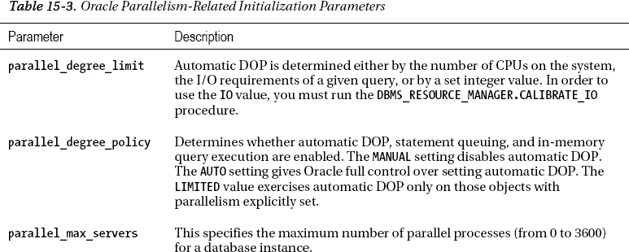
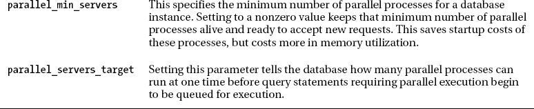
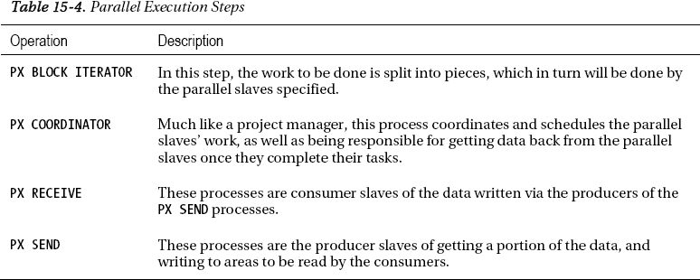
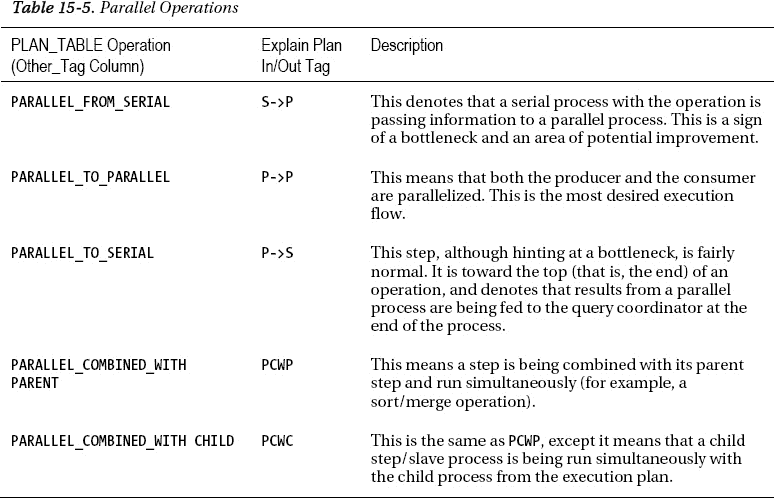
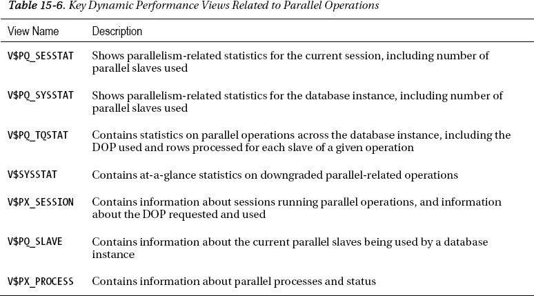
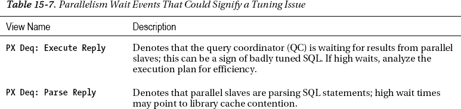
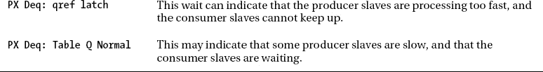

# 工作原理

并行 DDL 之所以流行，是因为它是在大量数据上执行操作的一种快速方式。工作被分成若干部分并发执行。假设你刚买了一栋新房子，正在搬家过程中。如果你正在用卡车装载箱子，四个人一起装肯定比一个人快得多。此外，并行 DDL 是在 DDL 命令掩护下执行 DML 类型操作的一种有吸引力的方式。

使用 `CREATE TABLE ... AS SELECT` 最常见的原因包括以下几点：

*   表结构已更改，需要重建表。
*   为某些特定应用目的创建类似结构。
*   从表中删除大量行。
*   需要从一个大表中删除多个列。

上述一些操作也可以严格使用并行 DML 来处理，但使用并行 DDL 相对于并行 DML 有一个明显的优势。由于 DDL 操作无法回滚，因此不会为这些操作生成撤销（undo），这使得操作更加高效。

并行 DDL 操作的并行度（DOP）由对象的 DOP 决定。这也包括语句中的查询部分。如果你选择，可以通过执行以下命令来覆盖对象的 DOP：

`ALTER SESSION FORCE PARALLEL DDL;`

如果你有一个非常大的表，需要从中删除许多行，请考虑使用 `CREATE TABLE ... AS SELECT`，而不是使用 DML `DELETE` 语句。删除行是一项昂贵的操作。在大型数据仓库环境中，当需要删除大量行时，执行删除操作的成本和时间可能会变得难以控制。由于删除操作的性质，它对数据库来说非常耗费资源，因为执行该操作会产生大量的重做（redo）和撤销（undo）。一个好的经验法则是，如果你正在删除一个表中不到 5-10% 的行，直接创建一个包含所有你想要保留的行的新表可能会更快。

下面是一个示例，我们从包含 1,234,568 行的 `EMP` 表中删除大约 20% 的行：

```
  delete /*+ parallel(emp,4) */ from emp
  where empno > 1000000
SQL> /

234568 rows deleted.

Elapsed: 00:00:09.94

--------------------------------------------------------------------------
| Id  | Operation                | Name     |    TQ  |IN-OUT| PQ Distrib |
--------------------------------------------------------------------------
|   0 | DELETE STATEMENT         |          |        |      |            |
|   1 |  PX COORDINATOR          |          |        |      |            |
|   2 |   PX SEND QC (RANDOM)    | :TQ10001 |  Q1,01 | P->S | QC (RAND)  |
|   3 |    INDEX MAINTENANCE     | EMP      |  Q1,01 | PCWP |            |
|   4 |     PX RECEIVE           |          |  Q1,01 | PCWP |            |
|   5 |      PX SEND RANGE       | :TQ10000 |  Q1,00 | P->P | RANGE      |
|   6 |       DELETE             | EMP      |  Q1,00 | PCWP |            |
|   7 |        PX BLOCK ITERATOR |          |  Q1,00 | PCWC |            |
|   8 |          TABLE ACCESS FULL| EMP      |  Q1,00 | PCWP |            |
--------------------------------------------------------------------------
```

这个删除操作耗时 9.94 秒。如果我们现在运行一个 `CREATE TABLE ... AS SELECT` 语句来实现相同的结果，我们可以看到性能上的差异。

```
create table emp_ctas_new2
parallel(degree 4)
nologging
as select /*+ parallel(a,4) */ * from emp_ctas
where empno <= 1000000
SQL> /
Elapsed: 00:00:01.70

--------------------------------------------------------------------------------------
| Id  | Operation                        | Name         |    TQ  |IN-OUT| PQ Distrib |
--------------------------------------------------------------------------------------
|   0 | CREATE TABLE STATEMENT           |              |        |      |            |
|   1 |  PX COORDINATOR                  |              |        |      |            |
|   2 |   PX SEND QC (RANDOM)            | :TQ10001     |  Q1,01 | P->S | QC (RAND)  |
|   3 |    LOAD AS SELECT                | EMP_CTAS_NEW |  Q1,01 | PCWP |            |
|   4 |     PX RECEIVE                   |              |  Q1,01 | PCWP |            |
|   5 |      PX SEND ROUND-ROBIN         | :TQ10000     |        | S->P | RND-ROBIN  |
|   6 |       TABLE ACCESS BY INDEX ROWID| EMP_CTAS     |        |      |            |
|   7 |        INDEX RANGE SCAN          | EMP_CTAS_PK  |        |      |            |
--------------------------------------------------------------------------------
```

创建表耗时 1.7 秒，比使用 `DELETE` 语句执行相同操作快了 5 倍以上。但是，如果表上有索引，你需要在选择此方法之前考虑这个因素，因为如果你重新创建一个表，还必须为该表重新创建相关的索引。尽管如此，它仍然可能更快，因为你可以并行地重新创建任何索引。

请记住，尽管前面的示例在这些语句上使用了并行 DDL，但即使你以串行模式运行，这个概念同样成立。当你需要从表中删除大量行时，`CREATE TABLE ... AS SELECT` 与并行执行的 DDL 或非并行串行执行的 DDL 下的 `DELETE` 相比，都是一个有利的选择。

并行创建表的一个潜在缺点是，这些操作的空间分配可能会导致表比串行创建时更碎片化。这是在并行创建表时应该考虑的一个权衡。操作中指定的 DOP 会生成相应数量的并行线程，并为每个线程分配一个区（extent）。因此，如果你为并行操作指定了 DOP 为 4，那么该操作至少会分配 4 个区。根据表空间的 `MINIMUM EXTENT` 大小，Oracle 会尝试在操作结束时修剪未使用的空间。不过，你应该预料到，并行创建表操作的空间效率确实不如串行运行的操作。

### 15-6. 并行创建索引

#### 问题

你需要尽快为一个大表创建索引，并希望使用多个进程来帮助加速索引创建。

#### 解决方案

任何时候拥有一个大表时，始终使用并行 DDL 创建该表的任何关联索引都是一个好主意，即使你希望索引的 DOP 在查询时是非并行化的。并行创建索引的主要好处是它确实能大大减少创建索引的时间。为一个大表并行创建索引总是有意义的，然后可以在创建操作完成后选择重置用于查询的 DOP。在以下示例中，我们使用 DOP 为 4 来创建索引，该 DOP 将在创建索引的过程中使用：

```
CREATE INDEX EMP_COPY_I1
ON EMP_COPY (HIREDATE)
PARALLEL(DEGREE 4);
```

然后，在索引创建完成后，我们可以选择使用以下任一示例将 DOP 重置为不同的值供查询使用：

`ALTER INDEX EMP_COPY_I1 NOPARALLEL;`
`ALTER INDEX EMP_COPY_I1 PARALLEL(DEGREE 1);`


## 15-7. 并行重建索引

### 问题

你有一个现有的索引需要快速重建，并且希望使用多个进程来加速索引重建过程。

### 解决方案

可能会出现需要重建索引的情况，其原因与重新创建索引的许多理由相同。要并行重建索引，请使用 `ALTER INDEX` 命令：

```sql
ALTER INDEX EMP_COPY_I1
REBUILD
PARALLEL(DEGREE 4);
```

```sql
--------------------------------------------------------------------------------
| Id  | Operation                   | Name        |    TQ  |IN-OUT| PQ Distrib |
--------------------------------------------------------------------------------
|   0 | ALTER INDEX STATEMENT       |             |        |      |            |
|   1 |  PX COORDINATOR             |             |        |      |            |
|   2 |   PX SEND QC (ORDER)        | :TQ10001    |  Q1,01 | P->S | QC (ORDER) |
|   3 |    INDEX BUILD NON UNIQUE   | EMP_COPY_I1 |  Q1,01 | PCWP |            |
|   4 |     SORT CREATE INDEX       |             |  Q1,01 | PCWP |            |
|   5 |      PX RECEIVE             |             |  Q1,01 | PCWP |            |
|   6 |       PX SEND RANGE         | :TQ10000    |  Q1,00 | P->P | RANGE      |
|   7 |        PX BLOCK ITERATOR    |             |  Q1,00 | PCWC |            |
|   8 |         INDEX FAST FULL SCAN| EMP_COPY_I1 |  Q1,00 | PCWP |            |
--------------------------------------------------------------------------------
```

如果你需要重建大型本地索引的一个分区，也可以使用并行来执行此操作。请参见以下示例：

```sql
ALTER INDEX emppart_i1
REBUILD PARTITION emppart2001_p
PARALLEL(DEGREE 4);
```

```sql
--------------------------------------------------------------------------------------
| Id  | Operation                   | Name       | Pstart| Pstop |IN-OUT| PQ Distrib |
--------------------------------------------------------------------------------------
|   0 | ALTER INDEX STATEMENT       |            |       |       |      |            |
|   1 |  PX COORDINATOR             |            |       |       |      |            |
|   2 |   PX SEND QC (ORDER)        | :TQ10001   |       |       | P->S | QC ORDER)  |
|   3 |    INDEX BUILD NON UNIQUE   | EMPPART_I1 |       |       | PCWP |            |
|   4 |     SORT CREATE INDEX       |            |       |       | PCWP |            |
|   5 |      PX RECEIVE             |            |       |       | PCWP |            |
|   6 |       PX SEND RANGE         | :TQ10000   |       |       | P->P | RANGE      |
|   7 |        PX BLOCK ITERATOR    |            |     2 |     2 | PCWC |            |
|   8 |         INDEX FAST FULL SCAN| EMPPART_I1 |     2 |     2 | PCWP |            |
--------------------------------------------------------------------------------------
```

### 工作原理

重建索引与从头重新创建索引相比，有一个关键优势，也有一个关键劣势。重建索引的优势在于，在重建操作完成之前，现有索引仍保持原位，因此可以被与重建过程并发运行的查询所使用。索引重建过程的主要缺点是，在重建期间你需要为两个索引都准备好空间。重建索引的一些关键原因包括：

*   重建随时间推移而变得碎片化的索引
*   在大量、直接路径加载数据后重建索引
*   你希望将索引移动到不同的表空间
*   由于关联表上的分区级操作，索引处于不可用状态。

## 15-8. 并行移动分区

### 问题

你需要将一个表分区移动到不同的表空间，并希望使用多个进程来完成此任务。

### 解决方案

假设你想将一个表分区移动到另一个表空间。例如，你在较慢、较便宜的存储上创建了一个表空间，并希望将较旧的数据移动到那里，以降低数据库的整体存储成本。要并行移动表分区以重建分区，你会发出如下命令：

```sql
ALTER TABLE EMP
MOVE PARTITION P2
TABLESPACE EMP_S
PARALLEL(DEGREE 4);
```

### 工作原理

用于移动分区的 `ALTER TABLE` 语句是移动分区表数据的一种简单、高效的方法。与本章中展示的其他一些并行 DDL 操作一样，需要将表分区移动到不同表空间的原因有几种：

*   你正在将较旧的数据移动到更便宜、更慢的存储上。
*   你正在将一系列分区整合到一个表空间中。
*   你正在将某些分区移动到单独的表空间，以对数据类型进行逻辑分组。

表分区通常用于存储历史数据。随着时间的推移，分区表经常需要进行分区维护。通过在移动数据库中表的分区时启用并行处理，可以更简单、更快地完成操作。随着维护窗口缩小和数据访问需求增长，这有助于更快地执行必要的分区移动，同时减少数据库表的停机时间。

## 15-9. 并行拆分分区

### 问题

你有一个包含大量数据的分区，并希望将该较大的分区拆分为两个或更多较小的分区。

### 解决方案

作为数据库管理员（DBA），有时会出现需要拆分分区的情况，此操作也可以并行完成。例如，假设你有一个分区表，其中包含一个包含大量数据的默认高端分区，并且你希望将该数据拆分为多个分区。在这种情况下，你可以并行拆分该默认分区，以加速分区拆分过程。以下是一个使用并行拆分分区的示例：

```sql
ALTER TABLE EMP
SPLIT PARTITION PMAX at ('2011-04-01') INTO
(PARTITION P4 TABLESPACE EMP_S,
PARTITION PMAX TABLESPACE EMP_S)
PARALLEL(DEGREE 4);
```


#### 工作原理

添加并行性可以加速拆分包含大量数据的分区的过程。以下是一个包含超过 1600 万行数据的分区示例，为拆分操作启用并行性减少了该操作所需的时间。首先，以并行方式执行拆分：

```sql
ALTER TABLE EMPPART SPLIT PARTITION emppart2000_p AT ('2000-01-01')
INTO (PARTITION emppart1990_p, PARTITION emppart2000_p)
PARALLEL(DEGREE 4);
```

`表已更改。`

`已用时间: 00:00:53.61`

然后，在一个类似的表上执行了相同的拆分操作，以查看串行执行拆分操作对性能的影响：

```sql
ALTER TABLE EMPPART2 SPLIT PARTITION emppart2000_p AT ('2000-01-01')
INTO (PARTITION emppart1990_p, PARTITION emppart2000_p);
```

`表已更改。`

`已用时间: 00:01:05.36`

再次提醒，对于并行操作，需要为每个并行操作分配一个区间。对于前面的分区拆分操作，使用了并行性的表分配了明显更多的区间：

```sql
SELECT segment_name, partition_name, extents
FROM dba_segments
WHERE segment_name LIKE '%EMP%'
AND owner = 'SCOTT'
ORDER BY 2,1;
```

```text
SEGMENT_NAME          PARTITION_NAME       EXTENTS
-------------------- -------------------- ----------
EMPPART               EMPPART1990_P               335
EMPPART2              EMPPART1990_P               121
EMPPART               EMPPART2000_P               338
EMPPART2              EMPPART2000_P               125
```

### 15-10. 启用自动并行度

#### 问题

你希望允许 Oracle 自动确定 SQL 语句是否应并行执行以及应使用何种并行度。

#### 解决方案

将 `PARALLEL_DEGREE_POLICY` 设置为 `AUTO`，以允许 Oracle 决定语句是否并行运行。你可以在系统级别或会话级别进行设置。要为所有 SQL 语句设置，请运行以下命令：

```sql
alter system set parallel_degree_policy=auto scope=both;
```

要为单个 SQL 语句设置，你可以修改会话以启用自动并行度：

```sql
alter session set parallel_degree_policy=auto;
```

#### 工作原理

默认情况下，Oracle 仅在表设置了并行度或使用了并行提示时才会并行执行语句。你可以通过 `PARALLEL_DEGREE_POLICY` 初始化参数，指示 Oracle 自动考虑对语句使用并行性。当 `PARALLEL_DEGREE_POLICY` 设置为 `AUTO` 时，Oracle 在发出 SQL 语句后执行以下步骤：

1.  解析语句。
2.  检查 `PARALLEL_MIN_TIME_THRESHOLD` 参数：
    *   如果执行时间小于设定的阈值，则该语句不使用并行性运行。
    *   如果执行时间大于设定的阈值，则该语句将根据优化器计算出的自动并行度并行运行。

`PARALLEL_DEGREE_POLICY` 可设置为三个不同的值：`AUTO`、`LIMITED` 和 `MANUAL`。`MANUAL` 是默认值，会关闭自动并行度。`LIMITED` 指示 Oracle 仅在那些显式设置了并行性的对象上使用自动并行度。`AUTO` 设置则让 Oracle 完全控制自动并行度的设置。使用自动并行度的一个先决条件是运行 `DBMS_RESOURCE_MANAGER.CALIBRATE_IO` 过程。该过程只需运行一次，它会收集系统硬件特性的信息。

采用自动并行度后，Oracle 不再基于可用的并行从属进程数量来降低并行操作的等级，而是使用 Oracle 11g R2 中的一项新特性，称为语句排队。通过语句排队，语句不会被降级，并将始终以其指定的并行度运行。如果没有足够的从属进程来满足该并行度，语句将被排队，直到有足够的资源可用。虽然看起来排队实际上可能会降低数据库中查询的性能，因为某些语句可能必须等待指定的并行度变为可用，但此设计旨在提高数据库的整体并行性能，因为以指定并行度运行较少语句的表现，通常优于运行更多但其中一些被降低了并行度的语句。还有许多其他与并行性相关的参数可以设置。表 15-3 列出了其他一些你可能需要为应用程序考虑的并行参数。





### 15-11. 检查并行执行计划

#### 问题

你想了解如何读取并行执行计划。


### 解决方案

阅读执行计划时，应从最内层到最外层、自下而上地解读。例如，这是我们使用并行提示针对 `EMP` 表执行的并行执行计划：

```
select /*+ parallel(emp,4) */ * from emp;
```

```
----------------------------------------------------------------------
| Id  | Operation            | Name     |    TQ  |IN-OUT| PQ Distrib |
----------------------------------------------------------------------
|   0 | SELECT STATEMENT     |          |        |      |            |
|   1 |  PX COORDINATOR      |          |        |      |            |
|   2 |   PX SEND QC (RANDOM)| :TQ10000 |  Q1,00 | P->S | QC (RAND)  |
|   3 |    PX BLOCK ITERATOR |          |  Q1,00 | PCWC |            |
|   4 |     TABLE ACCESS FULL| EMP      |  Q1,00 | PCWP |            |
----------------------------------------------------------------------
```

从上述计划的底部开始看，我们正在对 `EMP` 表执行全表扫描。紧接在表扫描之上的 `PX BLOCK ITERATOR` 负责接收这个全表扫描请求，并根据指定的并行度将其分解为多个块。`PX SEND` 进程将数据传递给消费进程。最后，`PX COORDINATOR` 是查询协调器用来从特定并行进程接收数据并返回给 `SELECT` 语句的进程。

如果您查看执行计划中的 `IN-OUT` 列，可以看到操作的执行流程，并判断是否存在任何瓶颈，或者计划中是否存在未并行化的部分，这可能导致预期性能下降。如 表 15-5 所示，通常表明可能存在瓶颈的操作是 `PARALLEL_FROM_SERIAL` 操作，因为它意味着并行进程是从串行操作中生成的，这表示流程中存在低效。

例如，您有一个按国家地区划分的系列员工表，某用户正在执行查询以从其中几个表中获取信息。然而，查询的构成方式导致了瓶颈。

```
select /*+ parallel(emp_north,4) */ * from emp_north
union
select * from emp_south;
```

```
------------------------------------------------------------------------------------
| Id  | Operation                      | Name          |    TQ  |IN-OUT| PQ Distrib |
------------------------------------------------------------------------------------
|   0 | SELECT STATEMENT               |               |        |      |            |
|   1 |  PX COORDINATOR                |               |        |      |            |
|   2 |   PX SEND QC (RANDOM)          | :TQ10002      |  Q1,02 | P->S | QC (RAND)  |
|   3 |    SORT UNIQUE                 |               |  Q1,02 | PCWP |            |
|   4 |     PX RECEIVE                 |               |  Q1,02 | PCWP |            |
|   5 |      PX SEND HASH              | :TQ10001      |  Q1,01 | P->P | HASH       |
|   6 |       BUFFER SORT              |               |  Q1,01 | PCWP |            |
|   7 |        UNION-ALL               |               |  Q1,01 | PCWP |            |
|   8 |         PX BLOCK ITERATOR      |               |  Q1,01 | PCWC |            |
|   9 |          TABLE ACCESS FULL     | EMP_NORTH     |  Q1,01 | PCWP |            |
|  10 |         BUFFER SORT            |               |  Q1,01 | PCWC |            |
|  11 |          PX RECEIVE            |               |  Q1,01 | PCWP |            |
|  12 |           PX SEND ROUND-ROBIN  | :TQ10000      |        | S->P |RND-ROBIN   |
|  13 |            TABLE ACCESS FULL   | EMP_SOUTH     |        |      |            |
------------------------------------------------------------------------------------
```

从上述执行计划输出中可以看出，`PX SEND` 进程是串行的，并且正在发送数据以馈入并行进程。这代表了此查询中的一个瓶颈。如果我们更改查询的所有方面以并行运行，可以看到执行计划有所改进：

```
select /*+ parallel(emp_north,4) */ * from emp_north
union
select /*+ parallel(emp_south,4) */ * from emp_south;
```

```
-------------------------------------------------------------------------------
| Id  | Operation                | Name          |    TQ  |IN-OUT| PQ Distrib |
-------------------------------------------------------------------------------
|   0 | SELECT STATEMENT         |               |        |      |            |
|   1 |  PX COORDINATOR          |               |        |      |            |
|   2 |   PX SEND QC (RANDOM)    | :TQ10001      |  Q1,01 | P->S | QC (RAND)  |
|   3 |    SORT UNIQUE           |               |  Q1,01 | PCWP |            |
|   4 |     PX RECEIVE           |               |  Q1,01 | PCWP |            |
|   5 |      PX SEND HASH        | :TQ10000      |  Q1,00 | P->P | HASH       |
|   6 |       UNION-ALL          |               |  Q1,00 | PCWP |            |
|   7 |        PX BLOCK ITERATOR |               |  Q1,00 | PCWC |            |
|   8 |         TABLE ACCESS FULL| EMP_NORTH     |  Q1,00 | PCWP |            |
|   9 |        PX BLOCK ITERATOR |               |  Q1,00 | PCWC |            |
|  10 |         TABLE ACCESS FULL| EMP_SOUTH     |  Q1,00 | PCWP |            |
-------------------------------------------------------------------------------
```

### 工作原理

表 15-4 和 15-5 描述了可用于确定并行操作执行计划的基本信息。要理解解读执行计划输出的基础知识，您应该了解两个方面：

*   可能的并行执行步骤（表 15-4）
*   每个步骤中发生的并行操作（表 15-5）

执行步骤是并行化计划的各个方面，而并行执行计划中发生的操作可以帮助您判断计划是否已优化，还是需要调整和改进。

与非并行操作一样，执行计划工具是确定优化器计划如何完成当前任务的非常有用的工具。在并行执行操作时，执行计划有与并行性相关的特定方面。理解这些非常重要，这样您才能判断操作是否以尽可能最优的方式运行。分析并行执行计划的一个关键方面是判断计划的任何部分是否以串行方式运行，因为这种瓶颈会降低给定操作的整体性能。这就是为什么理解执行计划中与并行操作相关的方面至关重要，最终目标是使操作的所有方面都实现并行化。





## 15-12. 监控并行操作

### 问题

您希望快速从数据库获取有关并行操作性能的信息。


## 解决方案

如果你查看 `V$SYSSTAT` 视图（该视图提供数据库中系统级统计信息，包括与并行相关的统计数据），你可以快速浏览到请求的并行度（DOP）是否实际被使用，以及是否有操作被降级：

```sql
SELECT name , value
FROM v$sysstat
WHERE name LIKE '%Parallel%';
```

```
---------------------------------------------------------------- ----------
Parallel operations not downgraded                                    10331
Parallel operations downgraded to serial                                 0
Parallel operations downgraded 75 to 99 pct                             0
Parallel operations downgraded 50 to 75 pct                             0
Parallel operations downgraded 25 to 50 pct                             0
Parallel operations downgraded 1 to 25 pct                              1

6 rows selected.
```

如果你查看 `V$PQ_SYSSTAT` 视图，你可以看到数据库中并行从属进程的活动情况。通过查看这些统计数据，你可以快速了解数据库上的并行是否配置得当。例如，如果你看到 `Servers Shutdown` 和 `Servers Started` 的值很高，则可能表明 `PARALLEL_MIN_SERVERS` 参数设置得太低，因为系统需要持续启动和停止并行进程，从而产生了开销。

```sql
SELECT * FROM v$pq_sysstat
WHERE statistic LIKE 'Server%';
```

```
STATISTIC                                 VALUE
------------------------------ --------------------
Servers Busy                                   0
Servers Idle                                   0
Servers Highwater                              4
Server Sessions                                8
Servers Started                                4
Servers Shutdown                               4
Servers Cleaned Up                             0

7 rows selected.
```

如果你在寻找关于某个并行操作的会话级统计信息，查看 `V$PQ_TQSTAT` 视图对于确定工作如何在并行从属进程之间拆分非常有用，同时它也能根据 `V$PQ_TQSTAT` 中的信息提供实际使用的并行度。让我们使用提示（hint）指定并行度为 4，再次对 `EMP` 表运行并行查询。

```sql
SELECT /*+ parallel(emp,4) */ * FROM emp;
```

查询完成后（仍在同一会话中），我们可以查询 `V$PQ_TQSTAT` 来获取该查询所用并行操作的信息：

```sql
SELECT dfo_number, tq_id, server_type, process, num_rows, bytes
FROM v$pq_tqstat
ORDER BY dfo_number DESC, tq_id, server_type DESC , process;
```

```
DFO_NUMBER        TQ_ID SERVER_TYP PROCESS        NUM_ROWS      BYTES
---------- ---------- ---------- ---------- ---------- ----------
         1          0 Producer   P000             298629   13211118
         1          0 Producer   P001             302470   13372088
         1          0 Producer   P002             315956   13978646
         1          0 Producer   P003             317512   14052340
         1          0 Consumer   QC              1234567   54614192
```

我们可以看到，在四个生产者并行从属进程之间，工作分配得相当均匀。我们还可以确认此查询实际使用的并行度是 4，与查询提示中指定的一致。

## 工作原理

分析数据库中并行操作性能的最快方法之一是分析动态性能视图。这些视图让你得以一窥数据库中并行处理的整体表现，从而可以指示你的数据库针对并行的调优是好是坏。它还可以提供非常具体的会话级详细信息，例如工作如何在从属进程之间拆分，以及给定操作实际使用的并行度信息。表 15-6 概述了与并行相关的动态性能视图。



## 15-13. 查找并行进程中的瓶颈

## 问题

你有一些并行进程性能不佳，希望进行分析以找出瓶颈。

## 解决方案

有许多与并行相关的等待事件。其中许多事件被认为是“空闲”等待事件——也就是说，它们通常不表示问题。如果你查询 `V$SYSTEM_EVENT` 视图，可以了解数据库实例中发生的与并行相关的等待。以下查询结果显示了一些可能发生的常见等待事件：

```sql
SELECT event, wait_class, total_waits
FROM v$session_event
WHERE event LIKE 'PX%';
```

```
EVENT                                      WAIT_CLASS   TOTAL_WAITS
------------------------------------------ ------------ -----------
PX Deq Credit: need buffer                 Idle               6667936
PX Deq Credit: send blkd                   Other              8161247
PX Deq: Execute Reply                      Idle                490827
PX Deq: Execution Msg                      Idle                685175
PX Deq: Join ACK                           Idle                 26312
PX Deq: Msg Fragment                       Idle                    67
PX Deq: Parse Reply                        Idle                 20891
PX Deq: Signal ACK                         Other                25729
PX Deq: Table Q Get Keys                   Other                 3141
PX Deq: Table Q Normal                     Idle              25120970
PX Deq: Table Q Sample                     Idle                 11124
PX Deq: Table Q qref                       Other              1705216
PX Idle Wait                               Idle                241116
PX qref latch                              Other              1208472
```

## 工作原理

表 15-7 描述了一些关键的与并行相关的等待事件。如果你遇到了严重的性能问题，浏览这些等待事件，看看是否存在过多的等待或等待时间，可能是值得的。如果存在，则可能表明并行从属进程的处理存在问题。再次强调，*通常*情况下，“空闲”事件并不表示问题。





## 15-14. 获取并行会话的详细信息

## 问题

你有一些性能不佳的并行进程，需要关于这些会话的更详细信息。

## 解决方案

通过开启会话跟踪，你可以获取关于并行会话的详细跟踪信息。这本质上是一个四步过程：

1.  在你的会话中设置事件。
2.  执行你的 SQL 语句。
3.  关闭你的会话跟踪。
4.  分析你的跟踪文件输出。

例如，你再次对 `EMP` 表执行一个并行查询。为了收集跟踪信息，你需要执行以下操作：

```sql
alter session set events '10391 trace name context forever, level 128';
```

```sql
select /*+ parallel(emp,4) */ * from emp;
```

```sql
alter session set events '10391 trace name context off';
```

然后，在跟踪文件中，你可以分析与并行相关的信息，例如以下内容：

```
kxfrDmpUpdSys
        allocated slave set: nsset:1 nbslv:4
          Slave set 0: #nodes:1
          Min # slaves 4: Max # slaves:4
            List of Slaves:
              slv 0 nid:0
              slv 1 nid:0
              slv 2 nid:0
              slv 3 nid:0
            List of Nodes:
              node 0
```

#### 工作原理

与其他会话跟踪一样，跟踪文件可以在 `user_dump_dest` 参数指定的目标位置找到。该跟踪文件显示了并行进程的详细信息。如果您在使用并行处理时遇到了显著的性能问题，并希望进一步调查此事件生成的跟踪文件的结果，那么直接向 Oracle 创建一个服务请求以获取最详细的信息可能是有益的。阅读和理解这些跟踪文件可能既困难又繁琐，将文件直接发送给 Oracle 支持部门进行分析可能更为便捷。另一种验证并行操作所用并行度（DOP）的方法是使用 `_px_trace` 工具，它也会生成一个跟踪文件：
```sql
alter session set "_px_trace"="compilation","execution","messaging";

select /*+ parallel(emp,4) */ * from emp;
```
然后，在跟踪文件中，您可以评估请求和使用的并行度：
```
kkscscid_pdm_eval
        pdml_allowed=0, cursorPdmlMode=0,                sessPdmlMode=0
        select /*+ parallel(emp,4) */ * from emp

kxfrDefaultDOP
        DOP Trace -- compute default DOP
            # CPU       = 2
            Threads/CPU = 2 ("parallel_threads_per_cpu")
            default DOP = 4 (# CPU * Threads/CPU)

kxfpAdaptDOP
        Requested=4 Granted=4 Target=8 Load=2 Default=4 users=0 sets=1
        load adapt num servers requested to = 4 (from kxfpAdaptDOP())
```

## 索引

### A
活动会话历史（ASH）信息，113，117，134–139
`ashrpt.sql` 脚本，135
`awrrpt.sql` 脚本，135
后台事件，135
阻塞会话，137
循环缓冲区，139
数据字典
`DBA_HIST_ACTIVE_SESS_HISTORY` 视图，142，144
`SESSION_STATE` 列，143
时间范围，144
`V$ACTIVE_SESSION_HISTORY` 视图，142–145
`DBA_HIST_ACTIVE_SESS_HISTORY` 视图，139
企业管理器
`DBA_HIST_EVENT_NAME` 视图，141
筛选器下拉菜单，141
筛选器选项，141，142
性能调优活动，140
示例报告，140
`SQL_ID`，141
时间范围，140
`P1/P2/P3` 值，136
实时/近实时会话信息，134
报告部分信息，138
SQL 命令类型，136
SQL 语句，136
用户事件，135
`ashrpt.sql` 脚本，140
自动化 SQL 调优，367
`ADDM`，368
在 AWR 中
创建 SQL 调优集对象，388–389
`DBMS_SQLTUNE.SELECT_WORKLOAD_REPOSITORY` 函数，389–390
确定起始和结束 AWR 快照 ID，389
查看资源密集型，384–386
`DBMS_AUTO_TASK_ADMIN.ENABLE/DISABLE` 过程，380–381
`DBMS_SQLTUNE.CREATE_SQLSET` 过程，383–384
`DBMS_SQLTUNE.CREATE_TUNING_TASK` 过程，398
SQL ID，游标缓存，399
`SQL_ID` 和 AWR 快照 ID，399–400
SQL 调优集名称，400–401
SQL 语句文本，399
图示表示，369
通过企业管理器，379
在内存中
`CAPTURE_CURSOR_CACHE_SQLSET` 参数描述，392
`DBMS_SQLTUNE.CAPTURE_CURSOR_CACHE_SQLSET` 过程，391–392
`DBMS_SQLTUNE.SELECT_CURSOR_CACHE` 函数，390–391
查看资源密集型，386–388
作业详细信息，370–371
维护任务视图描述，371
修改维护窗口，382
自动 SQL 调优，382
段建议，382
统计信息收集，382
SQL 调优顾问，368
来自 `ADDM`，404–407
来自企业管理器，403–404
优化器调优模式，402
来自 SQL Developer，403
手动运行的步骤，401
SQL 调优集，368


