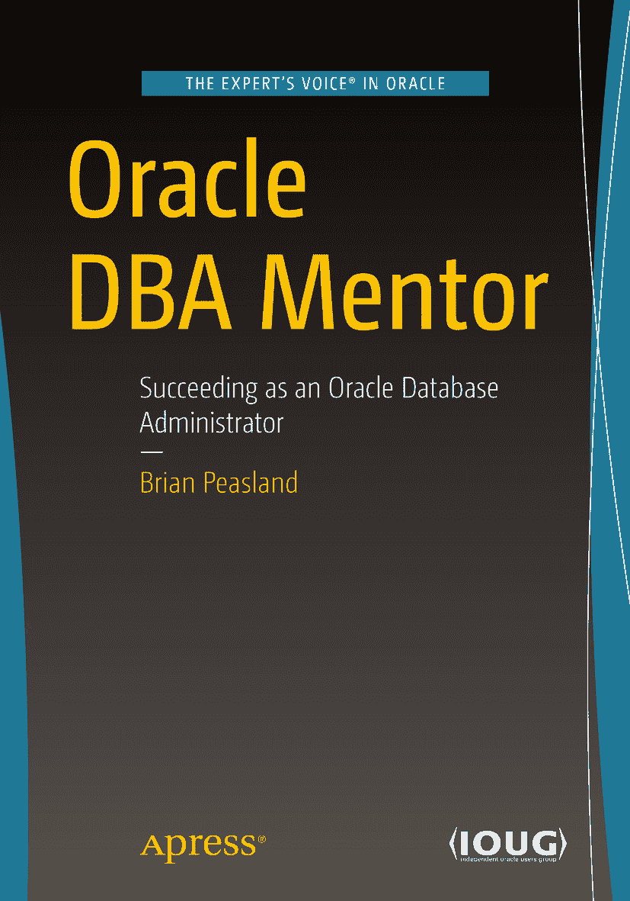

ISBN 978-1-4842-4320-6 电子书 ISBN 978-1-4842-4321-3 [`doi.org/10.1007/978-1-4842-4321-3`](https://doi.org/10.1007/978-1-4842-4321-3) © Brian Peasland 2019

本作品受版权保护。出版商保留所有权利，无论是涉及材料的全部还是部分，特别是翻译、转载、插图重用、朗诵、广播、缩微胶片或任何其他物理方式的复制，以及信息存储和检索、电子改编、计算机软件，或目前或未来已知或开发的类似或相异方法。书中可能出现商标名称、标识和图像。我们并非在每次出现商标名称、标识和图像时都使用商标符号，而仅以编辑方式并为了商标所有者的利益使用这些名称、标识和图像，绝无侵犯商标之意。本出版物中对商品名称、商标、服务标志及类似术语的使用，即使未特别标识，也不应被视为表达意见，即这些术语是否受专有权利约束。尽管本书中的建议和信息在出版时被认为是真实和准确的，但作者、编辑或出版商均不对可能出现的任何错误或遗漏承担法律责任。出版商对本出版物所含材料不作任何明示或暗示的保证。本书由 Springer Science+Business Media New York（地址：233 Spring Street, 6th Floor, New York, NY 10013；电话：1-800-SPRINGER；传真：(201) 348-4505；电子邮件：orders-ny@springer-sbm.com；网址：www.springeronline.com）面向全球图书贸易发行。Apress Media, LLC 是加利福尼亚州的有限责任公司，其唯一成员（所有者）是 Springer Science + Business Media Finance Inc (SSBM Finance Inc)。SSBM Finance Inc 是特拉华州的一家公司。

谨以此书献给我的三个儿子：Chay、Jace 和 Jenner

