# 3. 创建我们的服务器

本章是本书首次引入技术内容的章节。每位数据库管理员都需要一个可以试验想法、尝试新功能并验证更改是否有效的场所。数据库管理员需要一个非生产环境，因为他们在首次进行操作时，可能会弄坏某些东西。我们不希望生产环境中的东西被弄坏。理想情况下，当我们在生产环境中进行更改时，应是在充分理解、经过演练且毫无意外的情况下进行的。要达到这种状态通常需要多次尝试。生产数据库绝不应被视为游乐场。

许多组织会为数据库管理员及其他 IT 人员提供非生产区域。在理想情况下，这些非生产工作空间应尽可能与生产环境相匹配。但是，如果你的公司没有任何可供你使用的非生产环境，该怎么办？或者，如果你只是需要一个基本上为空的简单数据库来测试几个概念，该怎么办？

虚拟化技术已让 IT 员工的生活变得更好。当今的容器环境，如 Docker 和 Kubernetes，以及云技术，正在为 IT 基础设施带来类似的改进。本章将向你展示如何创建一个 Linux 虚拟机，并在其上安装和创建一个 Oracle 数据库。第 10 章将讨论测试平台和构建测试用例的重要性。你在接下来几章中构建的内容将为你提供这样一个测试平台。

即使你的公司为你提供了非生产区域供你使用，你仍然可能会发现在你的工作站或笔记本电脑上创建简单的测试平台是有益的。我们通常认为，非生产数据库分别用于我们的开发和测试工作，以产出和验证变更。我常说，虽然这些是非生产环境，但对某些人来说它们就是生产环境。如果你在一天中关闭了开发数据库，应用程序开发者将无法工作。如果你在一天中关闭了测试数据库，质量保证团队将无法验证变更。数据库管理员需要一个属于自己的个人工作区，在那里他们可以试验变更和新功能。他们需要对这个环境拥有完全的控制权，如果他们把事情搞砸了，也只会伤害到他们自己。提供一个测试平台服务器还可以让数据库管理员在不同的操作系统上运行数据库，这可能是他们环境所需要的。

## 下载 VirtualBox

在本章中，我们将使用 Oracle VM VirtualBox 来管理虚拟机（VMs）。当然，你也可以使用其他虚拟机管理程序，例如 VMware Fusion 或 Microsoft Hyper-V。我为本书选择了 VirtualBox，因为它是免费的，而且许多 Oracle 专业人士都在使用它。由于其广泛使用，你可以找到许多关于在 VirtualBox 上运行 Oracle 的有用资源。

要下载 VirtualBox，请将你的网页浏览器指向 `www.virtualbox.org`，在主屏幕上，点击大的“Download VirtualBox”按钮，即可显示该产品的最新版本。图 3-1 展示了在本章编写时可寻找的按钮及当时最新版本的示例。

图 3-1：VirtualBox 下载按钮

VirtualBox 可用于多个平台，包括 Windows、macOS 和 Linux。点击下载按钮后，你将被带到一个页面，以下载适用于你平台的产品。本章将向你展示如何在 Windows 桌面或笔记本电脑上使用 VirtualBox 创建一个在 Linux 上运行 Oracle 的测试平台服务器，但在其他平台上的指导也非常相似。在下载页面上，我将点击 “Windows hosts” 链接。选择你首选的平台，下载即会开始。下载完成后，运行安装软件。在 Windows 上，这就像双击下载的 `.exe` 文件一样简单。安装向导会引导你完成安装步骤。你可以接受向导提供的默认值。在某个时刻，会出现一个警告，提示安装过程会暂时重置你计算机的网络连接，因此在点击“是”按钮之前，请确保此时进行此操作是合适的。图 3-2 显示了此警告的一个示例。

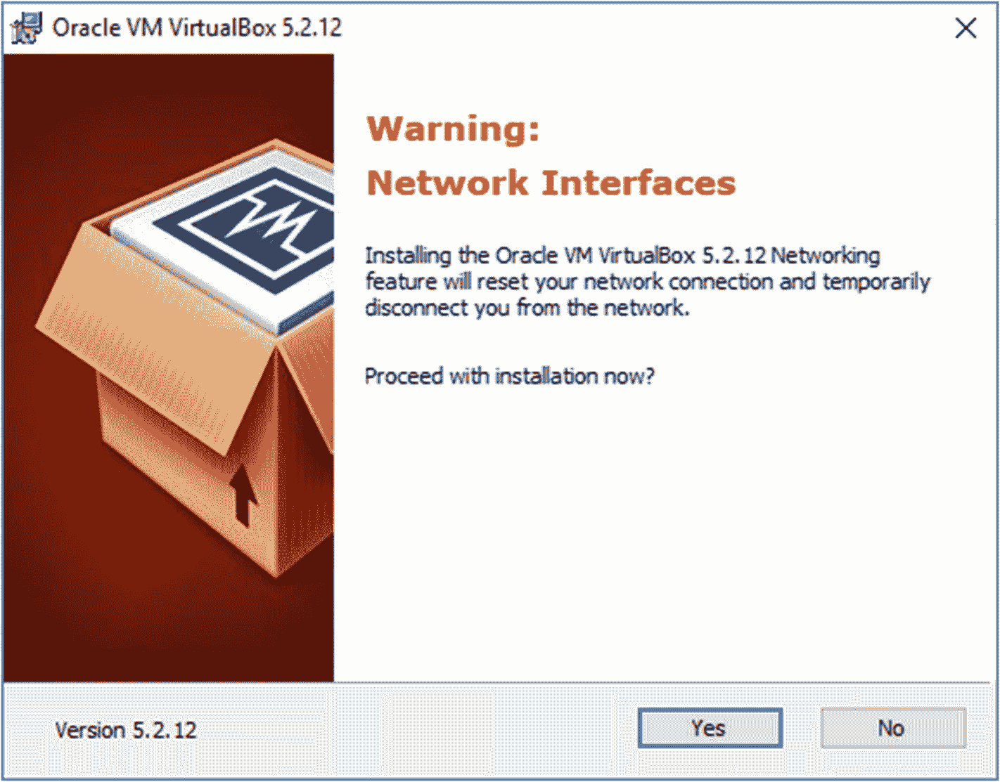

图 3-2：VirtualBox 安装网络警告

很简单。VirtualBox 现在已经安装好了。

## 下载 Oracle Linux

下一步是下载 Oracle Linux 操作系统。我们可以在 Windows 或其他认证的操作系统上运行 Oracle。我为本书选择 Linux，因为它被广泛使用。如果你能在 Linux 上运行 Oracle，那么你也具备了在其他任何支持的 Unix 变体上运行它的知识。此外，Oracle Linux 可以免费下载和使用；如果你需要操作系统的支持，则需要一份维护合同。

将网页浏览器指向 [`http://otn.oracle.com`](http://otn.oracle.com)，该网站现在被称为 Oracle Developer Network（之前是 Oracle Technology Network，因此 URL 中有 'otn'）。页面左侧有一个标题为“Essential Links”的部分。点击该部分中的“Software Downloads”链接。在图 3-3 中，我们可以看到“Software Downloads”链接是列表中的第二项。

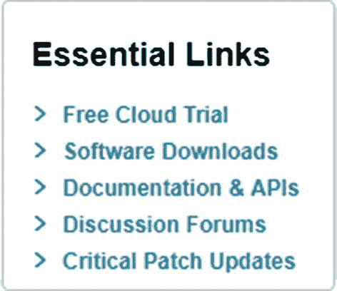

图 3-3

OTN Essential Links

在下一页，向下滚动到标题为“IT Infrastructure”的部分。点击该部分中标题为“Oracle Linux and Oracle Enterprise Kernel”的链接。你可以看到该链接是图 3-4 中的第一项。

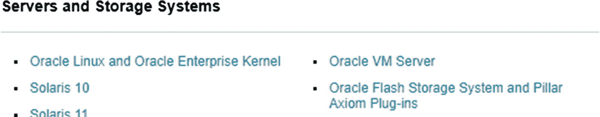

图 3-4

Oracle Linux 下载链接

点击图 3-4 中所示的“Oracle Linux and Enterprise Kernel”链接，将带你进入 Oracle Software Delivery Cloud 网站。如果你拥有 Oracle Single Sign-On 帐户（例如用于 My Oracle Support 的帐户），则单击“Sign In”按钮并输入你的凭据。如果你没有帐户，请单击“New User”链接并创建一个免费帐户。图 3-5 显示了“Sign In”按钮和“New User”注册链接。

图 3-5

Oracle Software Delivery Cloud 登录界面

在下一个界面中，在搜索框中输入“Oracle Linux”并单击“Search”按钮。显示的结果中，最新版本的操作系统将作为顶部链接，如图 3-6 所示。

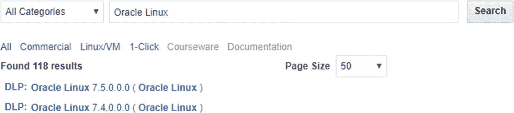

图 3-6

Oracle Linux 搜索结果

在撰写本文时，Oracle Linux 7.5 是最新版本，因此我将单击该链接。请单击在你阅读本文时的最新版本的链接。单击该链接会将此软件添加到购物车。接下来，单击购物车图标，图 3-7 显示了一个示例。

图 3-7

下载购物车图标

下一页显示你购物车的内容，其中应只包含一个产品。单击“Continue”按钮将带你进入 Oracle Standard Terms and Restrictions 页面。阅读条款后，勾选同意条款的复选框，然后单击“Continue”按钮。

下载页面允许你下载整个 Oracle Linux 产品套件。这远超过我们本书所需。我们只需要操作系统，在撰写本文时，其标题为“Oracle Linux Release 7 Update 5 for x86 (64 bit)”，并且是列表中的最后一项，如图 3-8 所示。

图 3-8

Linux 下载 ISO 文件

单击文件名以开始下载。在撰写本文时，该文件名是 `V975367-01.iso`。根据你尝试下载操作系统的时间，版本和文件名可能会有所不同。一旦软件下载到你的系统，你就可以开始创建虚拟机了。

### 创建服务器

要开始创建我们的测试服务器，只需启动 VirtualBox 程序。在图 3-9 中，您可以看到我已经创建了两个虚拟机，一个用于测试 Oracle 12.2 新特性，另一个用于试用 Oracle 多租户。如果您是第一次尝试创建，您的 VirtualBox 管理器可能不会显示任何虚拟机。

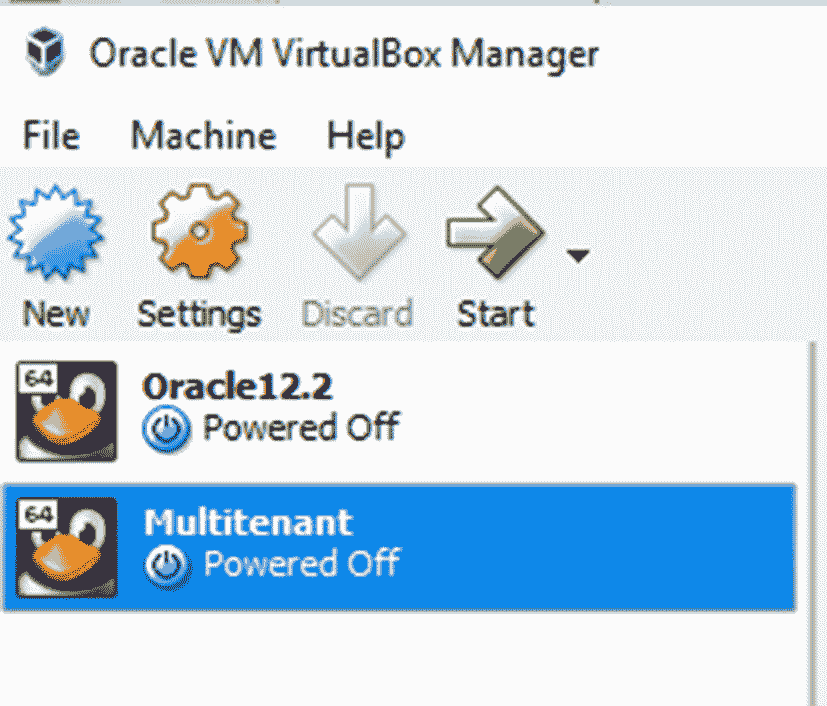
*图 3-9 Oracle VM VirtualBox 管理器*

很可能，您目前还没有创建任何虚拟机。点击 `新建` 按钮来创建您的第一个虚拟机。在对话框中，您需要为您的虚拟机起一个有意义的名字，并选择操作系统类型和版本。图 3-10 展示了一个示例。

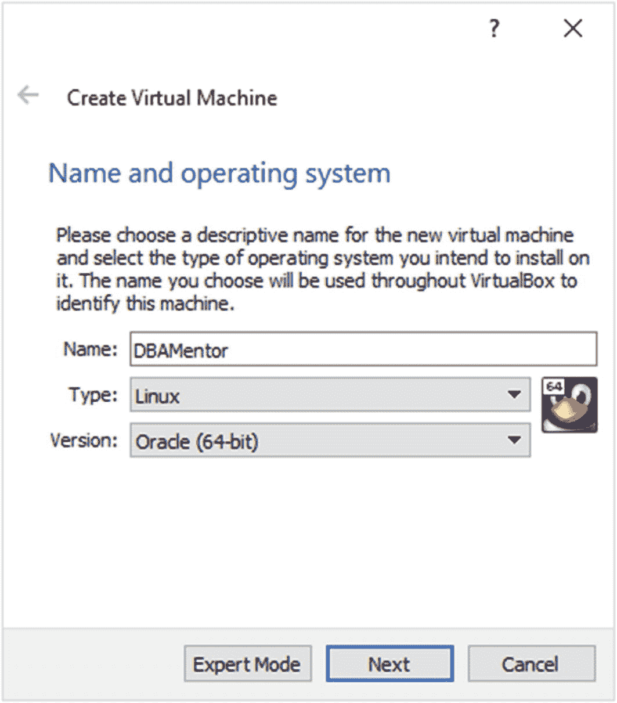
*图 3-10 创建虚拟机*

我以书名命名了这个虚拟机，但您可以提供任何您想要的名称。操作系统类型是 `Linux`，版本是 `Oracle (64-bit)`。然后点击 `下一步`。

下一步是为这个虚拟机分配内存。您至少需要分配 4GB 内存。此内存来自您的工作站或笔记本电脑，即 `主机`，因此请确保您的工作站或笔记本电脑至少有 8GB 的 RAM。每个 Oracle 版本都有不同的内存要求。本书中我们将安装的版本需要一个 4GB 的操作系统。如果您使用的内存较少，Oracle 将运行缓慢或可能根本无法运行。您的工作站或笔记本电脑需要足够的内存来运行虚拟机以及您可能打开的任何其他应用程序。如果您的主机有超过 8GB 的 RAM，您当然可以为虚拟机分配更多内存，但这对我们正在创建的测试环境益处不大。内存大小如图 3-11 所示。点击 `下一步`。

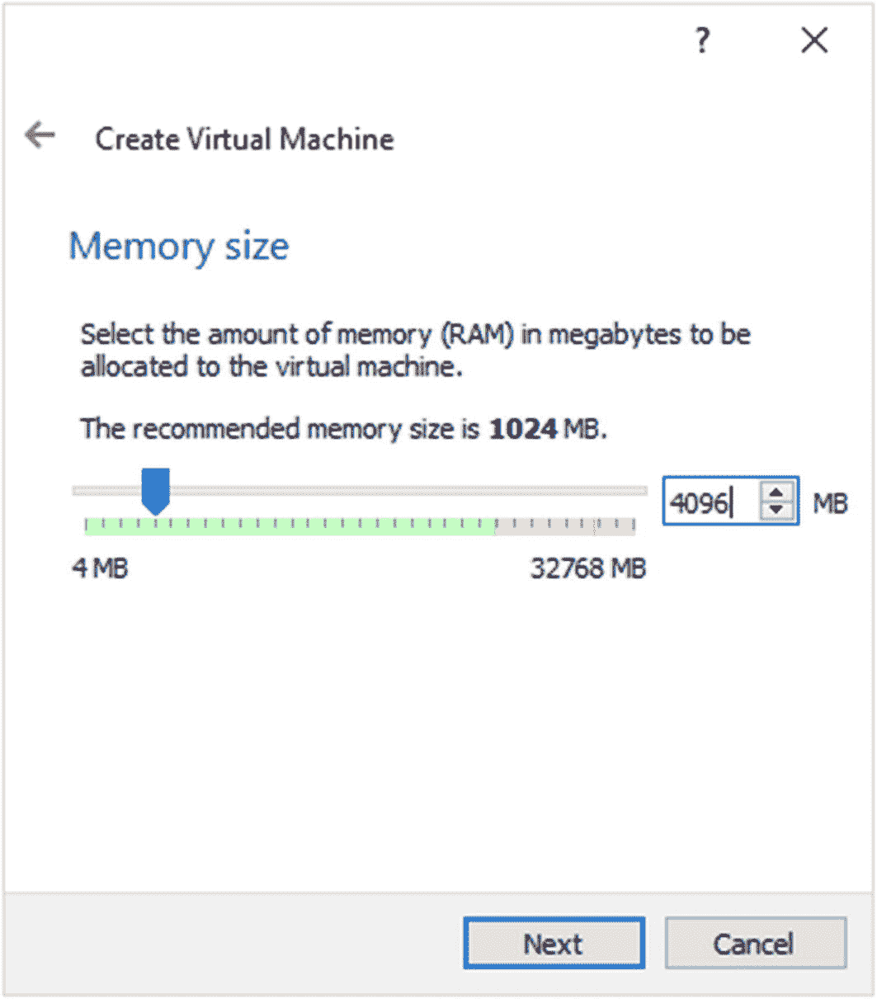
*图 3-11 设置内存大小*

在下一个屏幕上，确保选中“现在创建虚拟硬盘”，然后点击 `创建` 按钮。在之后的屏幕上，确认虚拟硬盘类型为 `VDI`，然后点击 `下一步`。虚拟硬盘可以是固定大小或动态分配的。动态分配磁盘的好处是，用于模拟硬盘的文件开始时很小，并根据需要增长，直到达到最大大小。固定大小选项将立即分配最大大小。我通常使用动态分配，但您也可以选择另一个选项。点击 `下一步`。

在下一个屏幕上，如图 3-12 所示，提供一个文件名和磁盘大小。我通常保持文件名与虚拟机名称相同。您可以点击文件名右侧的图标来为磁盘文件选择非默认的位置。对于这台机器，我们将创建一个 60GB 的磁盘。我们需要这个容量来为安装操作系统、安装 Oracle 软件和创建我们的第一个数据库提供足够的空间。点击 `创建` 按钮。

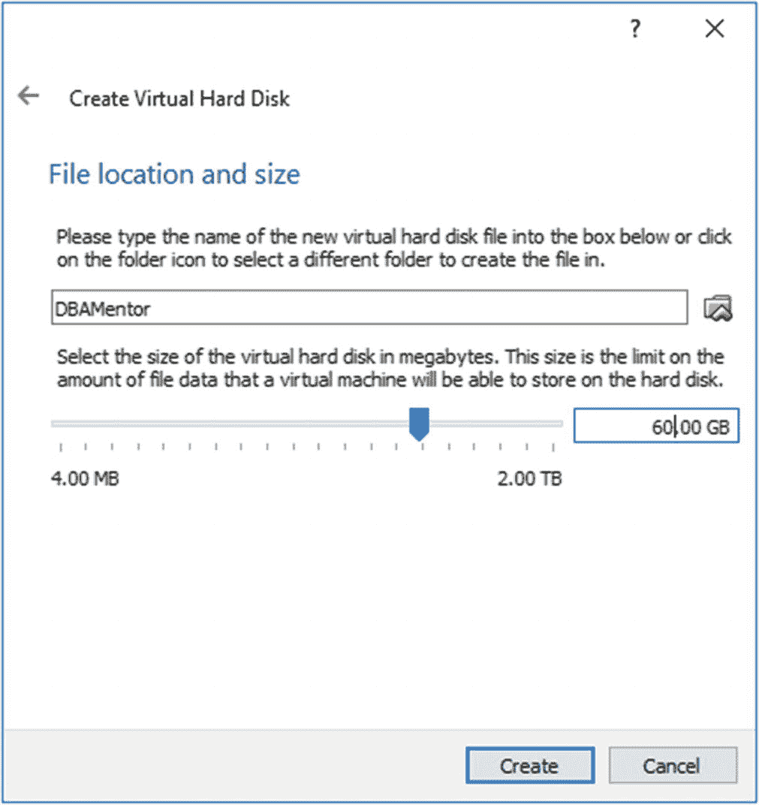
*图 3-12 创建虚拟硬盘*

在启动虚拟机之前，让我们更改一些 VirtualBox 未提示我们设置的其他选项。在 VirtualBox 管理器中，点击虚拟机，然后点击 `设置` 按钮（黄色齿轮图标）。您可以看到在图 3-13 中，`DBAMentor` 虚拟机被选中（蓝色显示）。

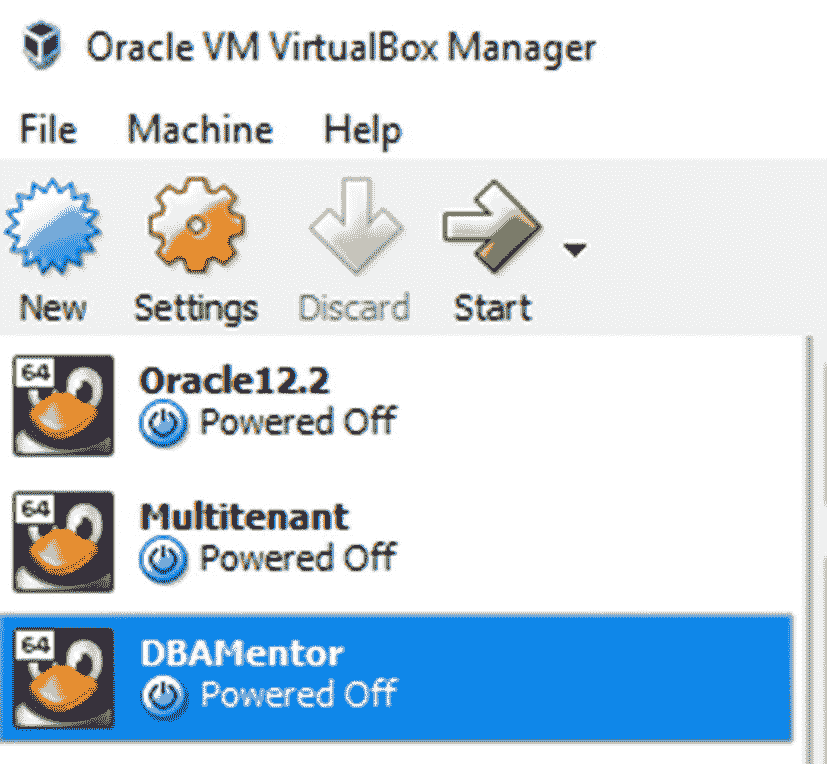
*图 3-13 访问虚拟机设置*

在 `设置` 页面，选择左侧导航窗格中的 `网络`。确保选中 `网卡 1` 选项卡，如图 3-14 所示。然后确保选中 `启用网络连接` 复选框，并且 `连接方式` 菜单选择了 `网络地址转换(NAT)`。`NAT` 网络适配器允许虚拟机连接到外部世界。

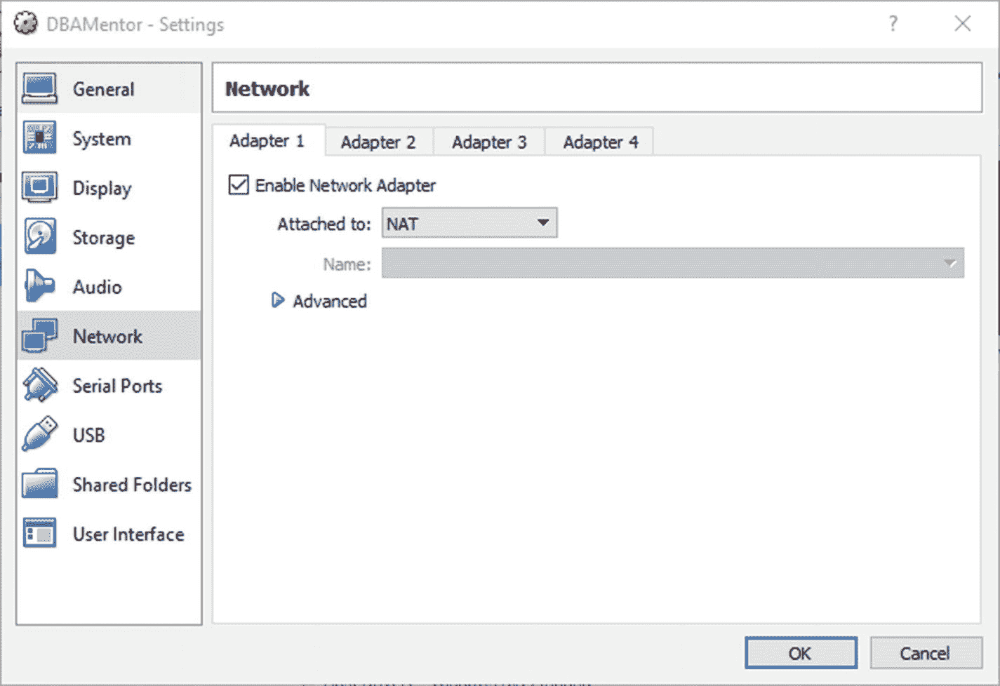
*图 3-14 启用网络适配器*

我们还需要第二个网络适配器，以便我们工作站或笔记本电脑上的工具可以连接到虚拟机内部的 Oracle 数据库。选择 `网卡 2` 选项卡。确保选中 `启用网络连接` 复选框。对于 `连接方式` 选项，选择 `仅主机(Host-Only)网络`，如图 3-15 所示。

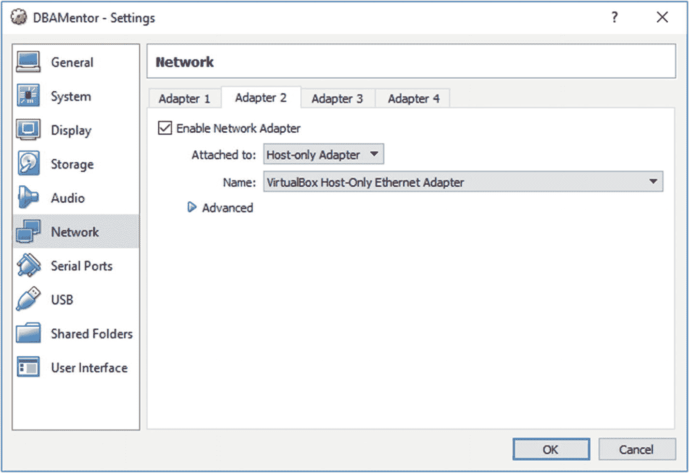
*图 3-15 选择仅主机适配器*

我们还将添加一个共享文件夹，以便我们可以在主机工作站和虚拟机之间轻松传递文件。在 `设置` 面板中，选择导航窗格中的 `共享文件夹`。点击那个看起来像文件夹带绿色加号的图标。这将弹出一个对话框。我打算将我工作站上的 `C:\temp` 目录映射到我的 Linux 客户机上的 `C_temp` 挂载点，并设置为每次启动虚拟机时自动挂载。您可以将共享文件夹映射到主机硬盘上的任何位置。因为我将共享文件夹映射到了 `C:\temp`，显然我是在 Windows 上运行 VirtualBox。如果您在 macOS 或 Linux 上运行，您的文件夹位置会不同。我的设置如图 3-16 所示。

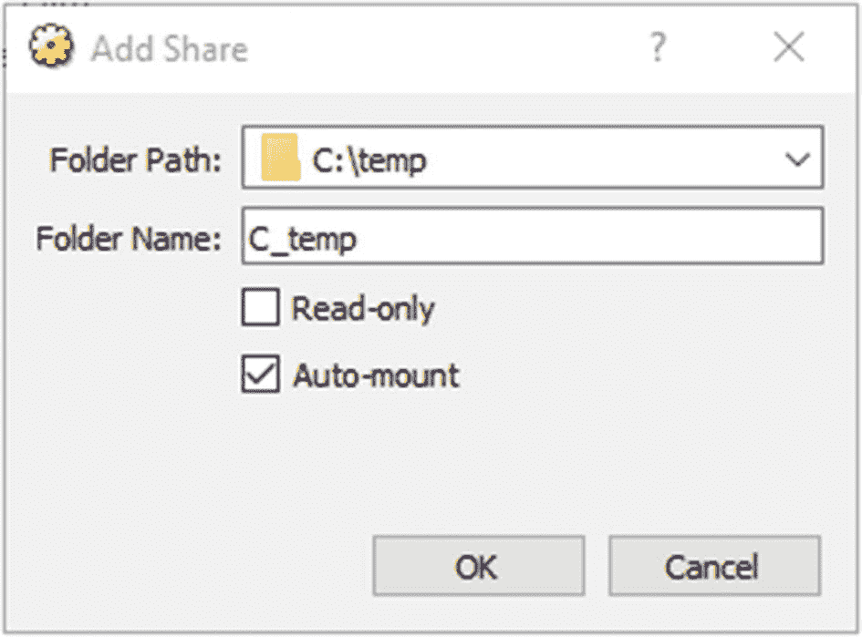
*图 3-16 共享文件夹定义*

在我点击 `确定` 后，设置看起来如图 3-17 所示。

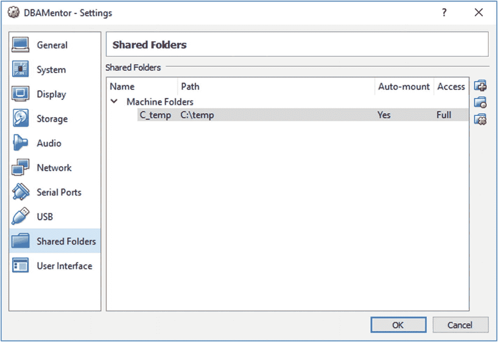
*图 3-17 共享文件夹设置*

点击 `确定` 接受当前设置。我们现在准备启动虚拟机。在 VirtualBox 管理器中，点击虚拟机并点击绿色的 `启动` 按钮。虚拟机还没有操作系统，所以 VirtualBox 要求我们指定一个。点击文件夹图标，导航到您为 Oracle Linux 下载的 ISO 文件，然后点击 `启动` 按钮。在图 3-18 中，我们可以看到我在撰写本文时下载的 `V975367-01.iso` 文件。

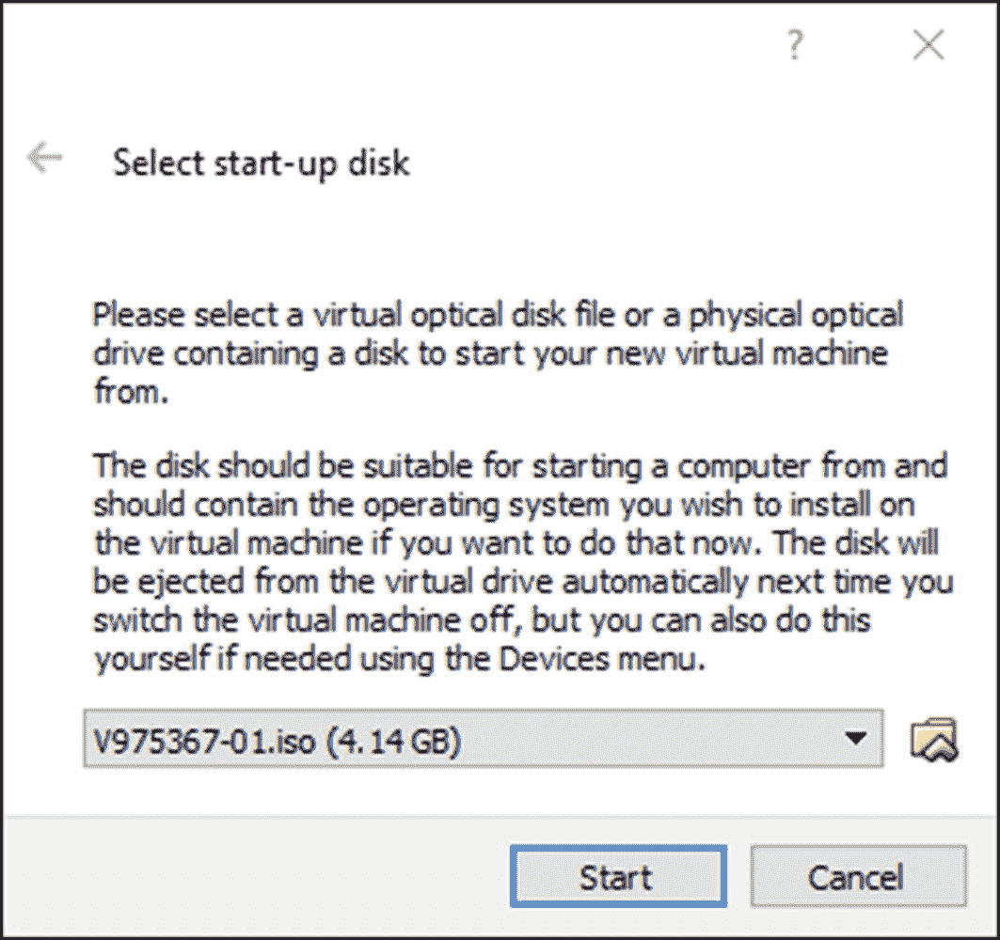
*图 3-18 ISO 位置*

当红色的 Oracle Linux 屏幕出现时，按 `I` 键，然后按 `Enter` 启动。如果您等待 60 秒，VirtualBox 将测试介质然后自行启动。

Oracle Linux 已启动，并希望获取一些信息以完成其配置。第一页要求您选择安装过程中偏好的语言，如图 3-19 所示。选择语言并点击 `继续` 按钮。

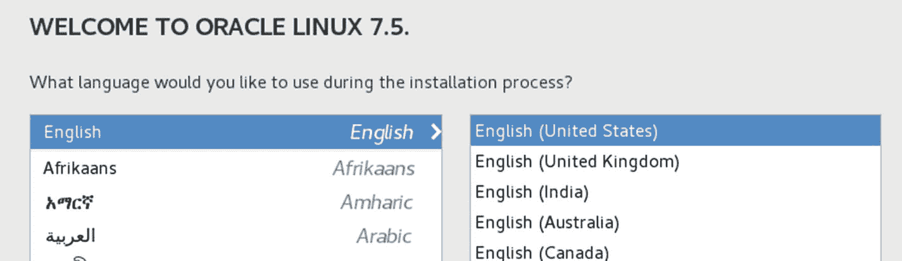
*图 3-19 安装过程的语言选择*

在 `安装概要` 屏幕上，您可以更改日期和时间、键盘和其他项目。确保这些设置适合您的环境。图 3-20 显示了 `软件选择` 按钮。点击该按钮。

*图 3-20 软件选择按钮*

## 安装与配置步骤

在选择安装类型时，图标提示将执行最小化安装，但我们希望确保功能更全面。我总是选择左侧的 `Server with GUI` 单选按钮，并勾选右侧的 `Performance Tools` 和 `System Administration Tools` 复选框。`Oracle Universal Installer` 是一个基于图形界面的工具。拥有图形界面的服务器为我们提供了安装 Oracle 所需的基础设施。我们也可以在没有图形界面的环境中安装 Oracle，但拥有它会使工作更轻松，正如我们将在第 5 章中看到的那样。点击图 3-29 中的图标以查看“软件选择”屏幕，其应如图 3-21 所示。请确保选择了 `Server with GUI` 以及两个附加组件。点击 `Done` 完成选择。

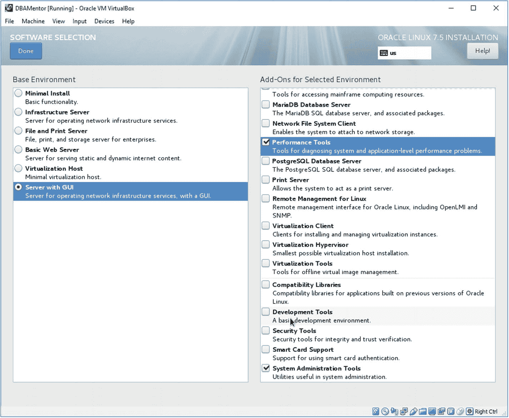

回到“安装摘要”屏幕，`Installation Destination` 按钮显示为红色文字，如图 3-22 所示，这意味着我们需要关注它。点击该按钮以修改安装目标。

确保选中了自动配置分区的单选按钮。然后点击 `Done` 按钮。如果您希望有更多手动控制权，可以手动配置虚拟机的硬盘分区。由于这是我们的第一台虚拟机，我们将让 `VirtualBox` 来完成这项工作。在“安装目标”屏幕上，存储选项应如图 3-23 所示。

还有一项需要处理。在“安装摘要”屏幕上，点击 `Network & Hostname` 按钮。在“网络和主机名”屏幕上，列表中应显示两个以太网适配器。（如果您还记得，我们在图 3-15 所示的步骤中定义了第二个网络适配器。）这两个网络适配器将被赋予适配器名称。在图 3-24 中，适配器名称是 `enp0s3` 和 `enp0s8`。您的适配器名称可能略有不同。

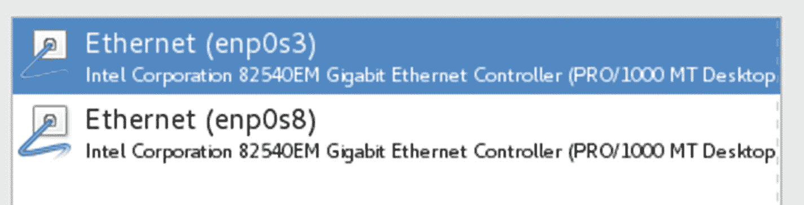

对于列出的第一个适配器，请确保右侧的按钮设置为 `On`，如图 3-25 所示。它默认为 `Off`，我们希望操作系统自动启动两个适配器。点击按钮以更改其值。然后选择另一个网络适配器，并确保它也设置为 `On`。

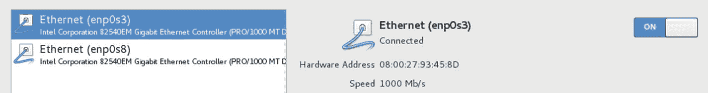

在“网络和主机名”屏幕的底部，您可以选择为此机器指定一个主机名，然后点击 `Apply` 按钮。在图 3-26 中，我将此机器命名为 `dbamentor.localdomain`。您可以为此机器指定任何有意义的名称。

网络配置完成。点击 `Done` 按钮。回到“安装摘要”页面，点击 `Begin Installation` 按钮。

在后台安装进行的同时，点击按钮设置 `root` 密码，如图 3-27 所示。设置 `root` 密码很简单，只需在对话框中输入两次密码，然后按 `Done` 按钮确认您的选择。

在 `Root Password` 按钮旁边是一个创建用户的按钮。当前显示“不会创建用户”。您可以在此刻创建用户，或者在操作系统重启时它会提示您创建用户。只是不要创建名为 `oracle` 的用户。在后面的章节中，我们将在安装软件时创建 `oracle` 用户。如果我们现在创建该用户，可能会创建得不正确。

操作系统安装完成后，会出现一个使您能够重启机器的按钮。点击该按钮进行重启。重启完成后，我们只剩下几个步骤。一是接受许可协议。点击图 3-28 中所示的按钮阅读许可协议。勾选表示您接受条款的复选框，然后点击 `Done`。

点击 `Finish Configuration` 按钮，我们快完成了。还需要再完成一个向导。这个最终向导看起来非常冗余，因为我们已经提供了这些答案，但我们需要完成它。如果您使用的是不同的 `Oracle Linux` 版本，向导步骤可能与我遇到的情况略有不同，但以下信息将帮助您完成安装。

向导的第一页要求我确认语言，然后点击 `Next`。然后我确认键盘设置并点击 `Next`。下一个屏幕询问我的位置偏好，我确认后点击 `Next`。在下一个屏幕上，我提供时区信息并点击 `Next`。随后的屏幕询问一些在线账户，我直接点击 `Skip` 按钮。然后询问我的姓名并定义我的用户 ID。当您进行到这一步时，输入虚拟值，因为我们稍后将为 `Oracle` 软件创建我们的账户。定义用户后，下一个屏幕要求提供密码，我输入后点击 `Next`。现在我已完成向导，可以点击按钮开始使用 `Oracle Linux`。如果您已完成所有这些步骤，应该会看到如图 3-29 所示的确认屏幕。

点击开始使用服务器的按钮后，我以在向导中提供的用户 ID 登录到 `Gnome` 界面。

虚拟机设置完成。在顶部菜单中，我选择 `Machine` ➤ `ACPI Shutdown` 来暂时关闭它。我们将在本书后面返回到这个虚拟机。

## 继续前进

本章中，我们为后续书中内容设置了一台虚拟机。我们将把这台虚拟机作为试验台，用于学习更多关于 Oracle 的知识。在第 10 章，我们将更详细地讨论试验台。不过，在读完本章后，你可能已经对它们的重要性有所体会。如果你回顾图 3-9，可以看到我的工作站已经有两个试验台，一个用于学习 Oracle 12.2 的新特性，另一个用于探索多租户选项。既然你已经知道如何用 VirtualBox 设置服务器，就可以开始利用虚拟机来测试无数的可能性了，其中一些甚至与数据库无关。

使用 VirtualBox，可以克隆虚拟机，从而无需为其他试验台重复这些步骤。克隆一个现有虚拟机意味着你可以更快地创建一个新的试验台。

在我们安装 Oracle 之前，需要先讨论文件布局，这是下一章的主题。最简单的做法是将所有文件放在一个单一位置。然而，这仅仅是安装 Oracle 和创建第一个数据库时最简单的方式。未来的维护工作会变得更困难。下一章将重点规划一个基础，以满足我们 Oracle 数据库的未来需求，确保成功。

