# 5. 安装 Oracle

## 数据库文件

OFA（最佳灵活架构）指南建议我们从`$ORACLE_BASE/oradata/db_name`开始存储数据库文件。如果您的数据库不只是用于测试环境，那么`ORACLE_BASE`所在的磁盘可能没有足够空间来存储所有文件。出于多种原因，DBA 将数据库文件分离到不同磁盘位置是非常常见的做法。他们可能需要多个磁盘单元，因为单个磁盘单元不够大。他们可能希望使用多个磁盘单元，以便将高度活跃的数据库文件隔离到不同的磁盘上，以减少磁盘争用。

如果使用多个磁盘，它们通常会被挂载到 Unix 或 Linux 服务器上，类似以下示例：

```
/u01/app/oracle/oradata/orcl/data01
/u01/app/oracle/oradata/orcl/data02
```

在上面的示例中，数据库名称是 `orcl`。需要注意，`data01` 和 `data02` 是具有不同挂载点的不同磁盘单元。在 Unix/Linux 上，它们看起来像是同一个磁盘下的子目录，但实际上并非如此。您的组织可能会为 Oracle 磁盘使用不同的目录结构，这完全可以接受。同样，请在整个企业内保持一致。

DBA 与存储管理员协作，可能会决定将联机重做日志放在它们自己的磁盘上以帮助提升性能。联机重做日志是写密集型文件，尤其对于事务率高的数据库而言。将联机重做日志移到它们自己的磁盘单元是分散磁盘 I/O 需求的常见做法。它们可能被放置在类似如下的挂载点上：

```
/u01/app/oracle/oradata/orcl/redo01
```

类似地，归档重做日志文件可以放在它自己的挂载点上，像这样：

```
/u01/app/oracle/oradata/orcl/arch
```

在 Windows 系统上，我们使用不同的驱动器盘符。即使在 Windows 服务器上，我也经常沿用这一惯例。我可以将两个数据磁盘设为：

```
D:\oracle\oradata\orcl
E:\oracle\oradata\orcl
```

而将我的联机和归档重做日志放在：

```
F:\oracle\oradata\orcl
G:\oracle\oradata\orcl
```

但这很难区分哪个是哪个。所以我会再包含一个子目录，使其更加清晰：

```
D:\oracle\oradata\orcl\data01
E:\oracle\oradata\orcl\data02
F:\oracle\oradata\orcl\redo01
G:\oracle\oradata\orcl\arch
```

现在，通过检查目录路径，我可以轻松识别我想在哪个磁盘设备上存放什么类型的文件。这个额外的子目录除了自记录驱动器的用途外，对数据库及其文件的管理并无实际帮助。您当然可以创建自己的命名约定，但再次强调，请在整个企业内保持一致。

关于数据库文件，还有一条 OFA 指南涉及文件本身的命名。OFA 指南建议我们将控制文件命名为 `controlXX.ctl`，联机重做日志命名为 `redoXX.log`，数据库文件命名为 `tablespace_nameXX.dbf`，其中 `XX` 是一个序列号。例如，我可能有三个控制文件，名称分别为 `control01.ctl`、`control02.ctl` 和 `control03.ctl`。联机重做日志将被命名为 `redo01.log`、`redo02.log` 和 `redo03.log`。`SYSTEM` 和 `SYSAUX` 表空间的数据库文件通常分别命名为 `system01.dbf` 和 `sysaux01.dbf`。一个包含多个文件的应用数据表空间，其文件可能命名为 `app_data01.dbf` 和 `app_data02.dbf`。

虽然 OFA 为数据库文件命名提供了指南，但 Oracle 托管文件（OMF）改变了一点做法。使用 OMF 时，DBA 只需为数据文件提供一个磁盘位置，并可选择为联机重做日志文件提供另一个磁盘位置。DBA 使用 `DB_CREATE_FILE_DEST` 和 `DB_CREATE_ONLINE_LOG_DEST_n` 参数来指定这些位置。之后，数据库会为 DBA 处理细节问题。数据库将按照类似 `ora_%u.ctl` 的约定命名控制文件，其中 `%u` 是一个唯一代码。数据文件则按照 `ora_%t_%u.dbf` 的约定命名，其中 `%t` 是表空间名称。OMF 在测试环境中运行良好。然而，我很少对生产数据库使用 OMF，因为 `DB_CREATE_FILE_DEST` 参数只能指定一个磁盘位置。

许多 DBA 不会在联机重做日志上使用 `.log` 扩展名，并且会忽略 OFA 指南。他们的理由是，某些系统管理员可能会偶然发现该文件，认为它只是一个充满文本的简单日志文件，并为了释放磁盘空间而删除它，却不知道这对数据库至关重要，删除它会导致数据库崩溃。相反，这些 DBA 会使用 `redoXX.orl`。只要他们在整个企业内保持一致，就不会有任何问题。

## 全景概览

在接下来的两章中，我们将在 Linux 机器上安装 Oracle 数据库软件并创建我们的第一个数据库。既然我们已经到了本章的末尾，我们对服务器上各项内容的放置位置有了更好的了解。表 4-2 显示了我们在本书剩余部分将使用的测试环境中文件的存放位置。

表 4-2

| 目录路径 | 内容 |
| --- | --- |
| `/u01/app/oracle` | `ORACLE_BASE` |
| `/u01/app/oracle/oraInventory` | Oracle 清单 |
| `/u01/app/oracle/product/12.2.0.1` | `ORACLE_HOME` |
| `/u01/app/oracle/admin` | 管理文件 |
| `/u01/app/oracle/diag/rdbms/orcl/orcl` | 诊断文件 |
| `/u01/app/oracle/oradata/orcl` | 数据库文件 |

如果您记不清某些文件的存放位置，可以使用表 4-2 作为参考。

如果我使用的是 Windows 服务器，所有 `/u01/app/oracle` 路径都将转换为 `C:\oracle`。

## 继续前进

本章向您介绍了思科最佳灵活架构（OFA）及其部分指南。知道在磁盘上哪里可以找到某些文件对 DBA 很重要。遵循这些指南可以更容易地找到文件，并减少由于某人不知道文件是什么而错误删除它造成的人为错误的机会。再次强调，无论您使用什么约定，即使偏离了 OFA 指南，也请在整个企业内保持一致。

下一章将重点介绍下载 Oracle 数据库软件并将其安装在我们的服务器上。我们将安装在表 4-2 中注明的 `ORACLE_HOME` 目录中。在第 6 章中，我们将创建我们的第一个数据库。在接下来的两章结束时，表 4-2 中注明的整个文件结构将被文件填满。

在第 3 章中，我们创建了将在本书中使用的服务器。在第 4 章中，我们讨论了文件系统的不同区域。如果您回想一下，Oracle 安装时会创建两个目录，分别称为 Oracle 基目录（Oracle Base）和 Oracle 主目录（Oracle Home）。本章将重点介绍首次安装 Oracle，使用基目录和主目录。在第 6 章中，我们将创建我们的第一个数据库。

本章将展示如何在我们的测试环境上安装 Oracle Database 12c 第 2 版（12.2）。如果您使用的是不同的 Oracle 版本，可以使用本章作为指南。如果您的版本比 12.2 稍低或稍高，那么本章大部分内容都是适用的。离 12.2 版本越远，您可能会看到越多的差异。


## 访问安装指南

Oracle 文档包含许多您可能遇到问题的答案。与本章相关的文档集称为 `Oracle Database Installation Guide`。对于任何安装 Oracle 的人来说，这份文档都是必读的。与所有 Oracle 文档一样，每个特定版本都有对应的更新指南。在撰写本文时，`Oracle 12.2` 是适用于本地部署的最新版本。在我首次安装 `Oracle 12.2` 之前，我特意阅读了该版本的 `安装指南`。一旦下一个版本 `Oracle Database 18c` 发布用于本地安装，我也会阅读该版本的 `安装指南`。其中大部分内容将是我已经知道的，因此阅读下一个版本的文档并不会花费太长时间。然而，我仍然会阅读最新的 `安装指南`，因为它可能包含一些新的信息。例如，新版本可能会更改支持 Oracle 数据库所需的最小内存量。如果您不阅读新版本的 `安装指南`，您可能会因为内存不足而遇到安装问题。`安装指南`的前言包含了新版本变更的摘要，非常值得一读。

### 提示

务必阅读当前版本的文档集。它可能包含您旧版本中没有的新信息。

所有 Oracle 产品的文档都可以从位于 [`https://docs.oracle.com`](https://docs.oracle.com) 的 Oracle 帮助中心访问。点击如图 5-1 所示的 `Database` 按钮，即可访问数据库文档。

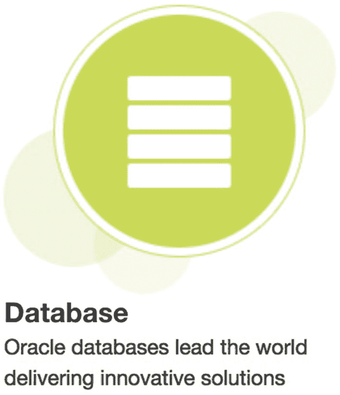

图 5-1: 数据库文档按钮

在主要的 `数据库文档` 页面上，我们可以看到不同的数据库文档集。我们感兴趣的是 `Oracle Database` 文档集，因此点击该按钮，如图 5-2 所示。

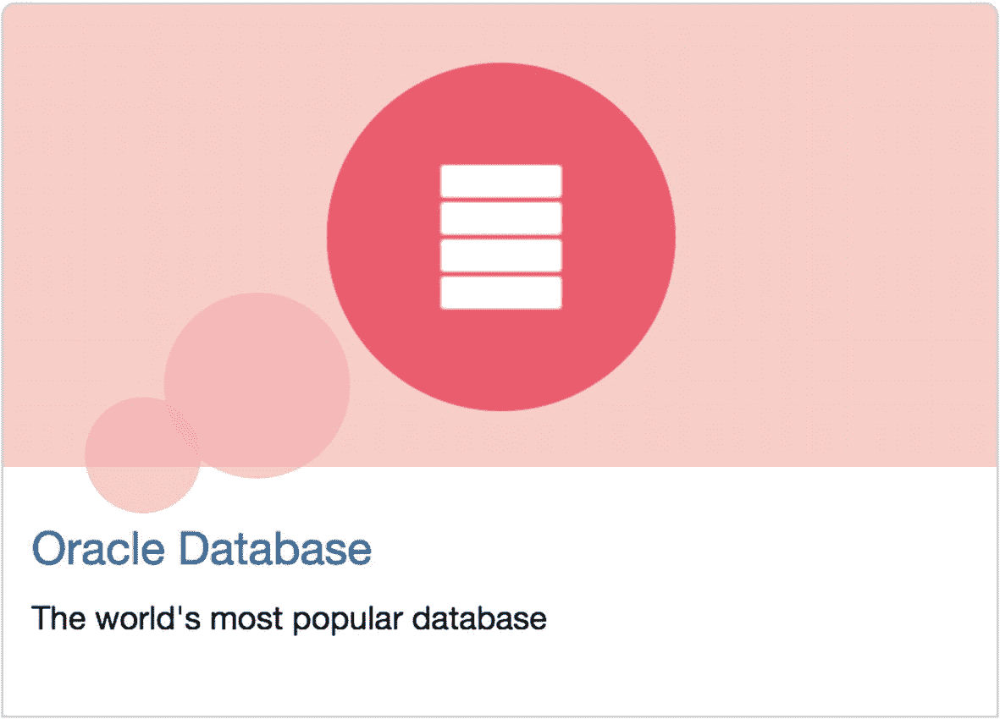

图 5-2: Oracle Database 文档按钮

下一个页面默认显示最新最好的文档版本，在撰写本文时是 `Oracle Database 18c` 文档。然而，本书是为 `Oracle 12.2` 编写的，因此在 `Oracle Database` 下方的下拉菜单中选择 `Oracle 12.2` 版本，如图 5-3 所示。

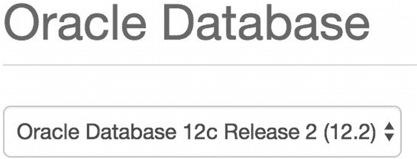

图 5-3: 数据库版本选择

如果您使用的是其他 Oracle 版本，可以从下拉列表中选择。选择感兴趣的版本后，下拉菜单下方的文档链接将更改为匹配该版本。

在标为 `主题` 的部分，点击 `安装与升级` 链接。您应该会看到适用于不同平台的安装指南，如 `AIX`、`Solaris`、`Windows` 和 `Linux`。我们的服务器（在第 3 章创建）使用的是 `Oracle Linux` 操作系统，因此通过点击 `HTML` 或 `PDF` 链接来选择 `Linux 数据库安装指南`，以满足您的偏好，如图 5-4 所示。


图 5-4: Linux 数据库安装指南链接

请花些时间熟悉 `安装指南` 的内容。在继续本章剩余内容之前，至少浏览一下这份文档是个不错的主意。本章不会涵盖该指南中的所有内容。如果您在继续之前不阅读本指南，请务必在未来某个日期阅读它。第 1 章到第 7 章是最重要的章节。如果您使用的是文件系统或 `自动存储管理器（ASM）`，则可以分别阅读第 8 章或第 9 章。第 11 章将引导您完成软件安装过程，这也是我们将在本章介绍的内容。

您的许多问题都能在这个指南中找到答案。我可以使用哪个确切的 Linux 版本？我的服务器需要多少内存和磁盘空间？安装 Oracle 软件的步骤是什么？甚至我们在第 4 章讨论的 `最佳灵活架构`，在这个指南中也有专门的附录进行介绍。

## 下载 Oracle 数据库软件

在安装 Oracle 数据库软件之前，我们需要从某个位置下载它。如果您与 Oracle 签订了有效的支持合同，可以从 [`https://edelivery.oracle.com`](https://edelivery.oracle.com) 下载。Oracle 也允许您从其 `Oracle 技术网络`（OTN）[`https://otn.oracle.com`](https://otn.oracle.com) 下载。技术网络要求您拥有 Oracle 账户，但注册是免费的。登录技术网络，然后在 `基本链接` 部分，点击 `软件下载`。在下一页，稍微向下滚动，直到看到 `数据库` 部分。点击 `Database 12c 企业版/标准版` 链接，您可以在图 5-5 中看到一个示例。

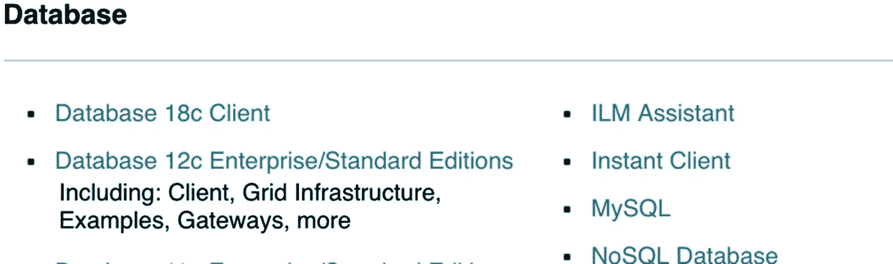

图 5-5: 开发者网络数据库下载链接

在下一页，有一个 `接受许可协议` 单选按钮，您必须选中以接受许可条款。在您接受许可协议之前，所有下载链接都将无法使用。在图 5-6 中，您可以看到 `OTN 许可协议` 的链接以及接受该许可的单选按钮。

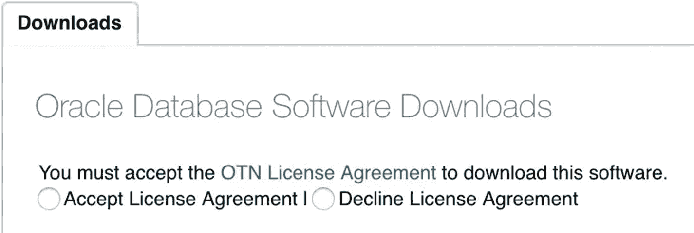

图 5-6: OTN 许可协议链接及接受选项

请务必点击 `OTN 许可协议` 链接并阅读许可条款！您不能将此软件用于任何需要获得许可的数据库。您不能将其用于生产数据库或业务的任何部分。您可以做的是将其用于简单的测试环境，正如我们将在本书中进行的那样。

点击单选按钮接受许可协议后，向下滚动直到看到 `Oracle Database 12c Release 2` 部分。点击 `Linux` 操作系统旁边的名为 `文件 1` 的链接。如果您使用的是其他操作系统，可以在同一部分看到可用的选项。`文件 1` 是数据库软件。如果您需要其他软件，请点击 `查看全部` 链接，它会将您带到一个页面，您可以在那里下载 `数据库客户端`、`网格基础设施`、`数据库网关` 和 `示例` 模式。我们只对数据库 `RDBMS` 软件感兴趣，因此将名为 `linuxx64_12201_database.zip` 的文件下载到您的工作站。


## 准备服务器

在开始实际安装之前，我们需要完成几项小任务。如果您的虚拟机尚未运行，请从 VirtualBox 中启动它，并以超级用户 `root` 身份登录。虚拟机首次启动时，会询问登录身份，但 `root` 不在列表中。请点击 `Not Listed` 链接，输入 `root` 作为用户名并提供密码。登录后，前往 `应用程序 ➤ 收藏` 并启动 `终端` 应用程序。这就是我们的命令窗口。在此窗口中，输入 `yum search oracle-rdbms`。`yum` 是一个 Linux 实用工具，可用于轻松下载和安装操作系统软件包。我们的命令将搜索 yum 仓库中名称包含字符串 `oracle-rdbms` 的软件包。我们可以在代码清单 5-1 中看到搜索结果。

```
[root@dbamentor ~]# yum search oracle-rdbms
Loaded plugins: refresh-packagekit, security
public_ol6_UEKR3_latest                                  | 1.2 kB     00:00
public_ol6_latest                                        | 1.4 kB     00:00
======================== N/S Matched: oracle-rdbms ========================
oracle-rdbms-server-11gR2-preinstall.x86_64 : Sets the system for Oracle single
...: instance and Real Application Cluster install for Oracle Linux 7
oracle-rdbms-server-12cR1-preinstall.x86_64 : Sets the system for Oracle single
...: instance and Real Application Cluster install for Oracle Linux 7
Name and summary matches only, use "search all" for everything.
Listing 5-1
Yum Search Results
```

应该会有两个结果，一个是 11gR2 的预安装文件，另一个是 12cR1 的。尽管我们安装的是 Oracle 12cR2，但 12cR1 的预安装文件同样适用。如果您看到其他版本，请安装与您要安装的 Oracle 版本最匹配的那个。

`Oracle Database Installation Guide` 中定义的大部分操作系统设置，将通过在我们的服务器上安装此文件为我们自动处理。此预安装文件仅适用于 Linux 操作系统。其他操作系统需要按照 `Installation Guide` 中的步骤手动配置。

在命令窗口中，按如下方式安装该文件：

```
yum install oracle-rdbms-server-12cR1-preinstall.x86_64
```

系统将提示您确认是否可以继续。按 ‘y’ 键并按回车键继续。同样，对于其他可能出现的提示，也回答 ‘y’。

为了将我们下载的 Oracle 数据库软件文件（在上一节中下载）放到数据库测试服务器上，我们需要使用第 3 章中设置的虚拟机与主机之间的文件共享（参考图 3-16）。以防您跳过了那部分内容，请转到 VirtualBox 管理器，单击 VM，然后单击 `设置` 按钮。接下来，单击 `共享文件夹` 图标。点击带有绿色加号的蓝色文件夹图标，以便添加共享文件夹。在我的 MacBook 笔记本电脑上，我将文件夹路径定义为我用户的桌面。在 Linux 端，这将被识别为 `HostDesktop`。我确保勾选了 `自动挂载` 选项，如图 5-7 所示。

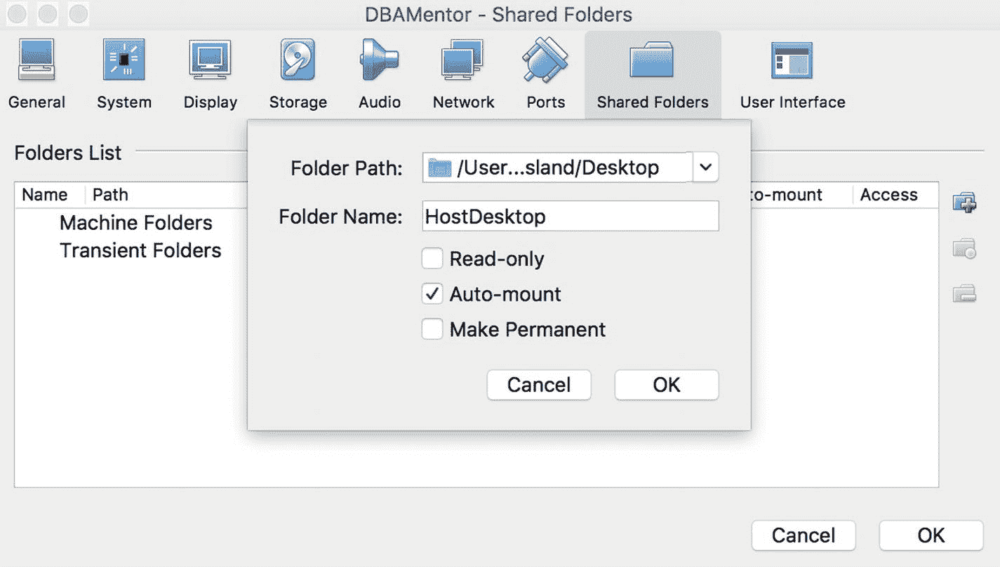

图 5-7: 共享文件夹配置

出于安全目的，您可以选择将此挂载点在 Linux VM 端设置为只读。这样，虚拟机就无法更改该目录中主机的文件。

在共享文件夹生效之前，我们需要安装增强功能包（Guest Additions），这是 Virtual Box 需要的额外操作系统组件，用于扩展虚拟机中操作系统的功能。增强功能包不仅让我们可以访问共享文件夹，还允许我们在虚拟机和主机环境之间复制和粘贴。增强功能包还能让我们更轻松地在虚拟机和主机之间移动鼠标。

在安装增强功能包之前，我们需要安装一些内核源代码。这可以通过以下命令完成：

```
yum install kernel-uek-devel-$(uname -r)
```

此命令指示 `yum` 安装一个软件包。该软件包的名称取决于您当前的 Linux 版本。`uname -r` 部分用于返回该操作系统版本。

安装该软件包后，重启您的虚拟机。以 `root` 身份重新登录，并从虚拟机窗口的 `设备` 菜单中选择 `插入增强功能包 CD 镜像`。系统会提示您运行该软件，因此请点击 `确定`。安装完成后，按 Enter 键关闭窗口。

在我们的所有更改生效之前，我们需要重启服务器。在 `终端` 窗口（`应用程序 ➤ 收藏`）中输入 `reboot` 以重启服务器。以 `root` 身份登录。我们现在需要更改 `oracle` 用户的密码。我们在本节前面安装的预安装文件为我们创建了用户。在 `终端` 窗口中，输入 `passwd oracle`，系统会两次提示您输入新密码。请记住此密码，因为您将在本书中一直使用它。退出 `root` 用户并以 `oracle` 用户身份登录。

打开一个 `终端` 窗口。在窗口中，输入 `df –h` 以查看已挂载的磁盘设备。您应该会看到一个类似于 `/media/sf_HostDesktop` 的条目。`sf` 代表 *shared folder*，而 `HostDesktop` 是我在图 5-7 中为共享文件夹命名的名称。

不幸的是，VirtualBox 的共享文件夹由 `root` 拥有。在我们的 `终端` 窗口中，输入 `su` 以 `root` 身份登录。提示时输入 root 密码。我们将把安装文件复制到 oracle 用户的主目录，并更改文件所有权，以便 `oracle` 可以接管。将数据库软件下载复制到虚拟机的命令如代码清单 5-2 所示。

```
cd /media/sf_HostDesktop
cp linuxx64_12201_database.zip /home/oracle/.
chown oracle:oinstall /home/oracle/linuxx64_12201_database.zip
exit
Listing 5-2: Copying DB Software to VM
```

最后一个命令退出 `root` 用户，您应返回到 `oracle` 用户。我们现在将解压下载的文件：

```
unzip /home/oracle/linuxx64_12201_database.zip
```

我们现在已经准备好开始安装了。


## 安装 Oracle

过去，甲骨文公司必须为每个平台创建不同的安装程序。Java 编程语言凭借其“一次编写，到处运行”的理念解决了这个问题。现在 Oracle 软件的安装程序是用 Java 编写的，无论你使用哪个平台，都是同一个程序。Oracle 现在将其称为 Oracle 通用安装程序 (`OUI`)。这不仅对甲骨文公司有益，对你也同样有益，因为你只需要学习如何使用一个安装工具。

### 启动 OUI

我们通过启动 `OUI` 来安装数据库软件。我们只需将目录更改为解压软件的位置，并如代码清单 5-3 所示执行程序。

```
cd /home/oracle/database
./runInstaller
```
**代码清单 5-3** 启动 OUI

### 初始设置步骤

`OUI` 启动。第一个屏幕是检查安全更新，如图 5-8 所示。目前，我们将这些字段留空并单击“下一步”按钮。我们将在后续章节中处理使用安全更新修补数据库软件的问题。

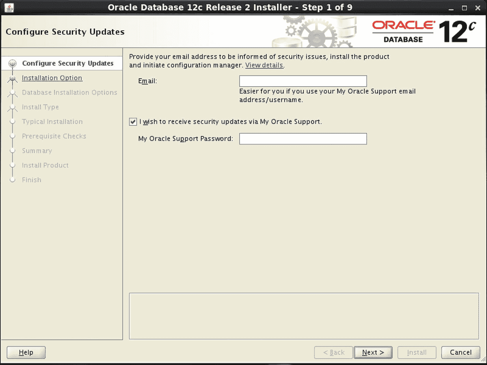
**图 5-8** OUI 配置安全更新步骤

单击“下一步”按钮后，系统将要求您确认是否希望保持不接收安全更新通知。单击“是”按钮。

### 选择安装类型

在下一个屏幕（如图 5-9 所示）中，我们将选择仅安装数据库软件的选项。此服务器上没有需要升级的数据库，我们将在下一章中处理创建数据库的问题。单击“下一步”按钮。

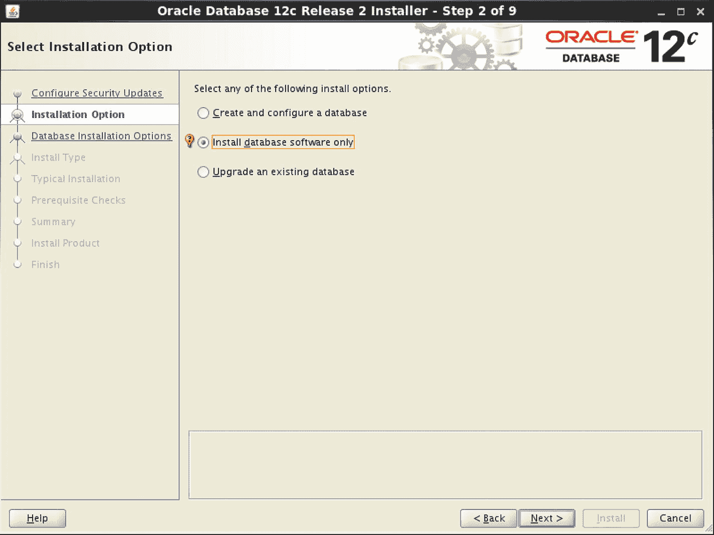
**图 5-9** OUI 安装选项步骤

我们将安装单实例数据库，因此请确保选中第一个选项，如图 5-10 所示，然后单击“下一步”。

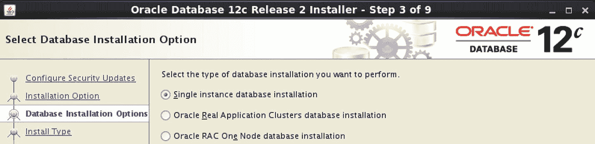
**图 5-10** OUI 数据库安装选项步骤

### 选择数据库版本

`OUI` 能够处理企业版和标准版。我通常希望拥有所有可用的功能，因此我将选择企业版并单击“下一步”。您可以在图 5-11 中看到此选择。

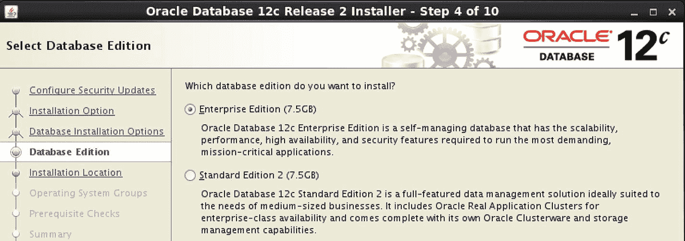
**图 5-11** OUI 数据库版本步骤

### 配置安装目录

在下一个屏幕上，我们现在有足够的信息来填写空白处。请记住，上一章定义了 Oracle 基础目录和 Oracle 主目录。此屏幕是我们告诉 `OUI` 这两个目录位置的地方。但首先我们需要创建 Oracle 基础目录。启动命令窗口并执行代码清单 5-4 中的命令。

```
su       (系统提示时输入 root 密码)
mkdir –p /u01/app/oracle
chown -R oracle:oinstall /u01
exit
```
**代码清单 5-4** 创建 Oracle 基础目录

然后如图 5-12 示例所示填写方框。第一个方框是 Oracle 基础目录的位置，通常由环境变量 `$ORACLE_BASE` 引用。第二个方框（虽然不那么明显）是 Oracle 主目录的位置，通常由环境变量 `$ORACLE_HOME` 引用。单击“下一步”继续。

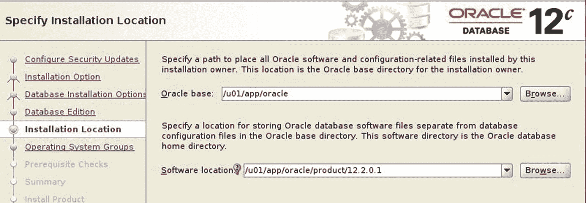
**图 5-12** OUI 安装位置步骤

### 创建 oraInventory 目录

还记得第 4 章中提到的，Oracle 需要一个地方来存储此服务器上 Oracle 软件产品的清单。我们将其称为 `oraInventory` 目录。`OUI` 将自动填充此值。在图 5-13 中，我们可以看到 `oraInventory` 目录位于图 5-12 所示 Oracle 基础目录的上一级。这是常见做法。当我们单击“下一步”时，`OUI` 可能会给我们一个警告消息，我们将予以确认。

我们还可以选择指定能够修改清单的操作系统组。如图 5-13 所示，默认的 `oinstall` 组已足够。单击“下一步”按钮。

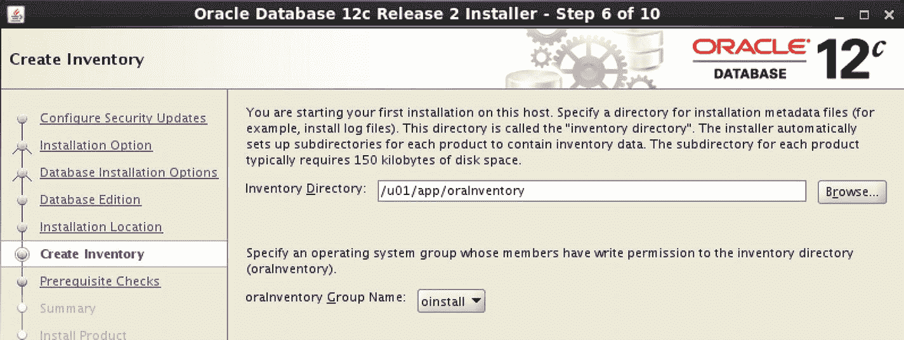
**图 5-13** OUI 创建清单步骤

### 指定操作系统用户组

在下一个屏幕中，系统要求我们为不同的功能指定不同的操作系统组。如果我们关心职责分离，可能会让组织中不同的人员负责数据库备份，在这种情况下，我们不希望这些员工拥有其他功能，因此可以在此屏幕上将他们的组与其他组区分开。由于这是一个测试环境，并且只有我们将访问它，默认的 `dba` 组已足够。如图 5-14 所示，Oracle 安装仅使用 `dba` 组的情况非常常见。单击“下一步”按钮。

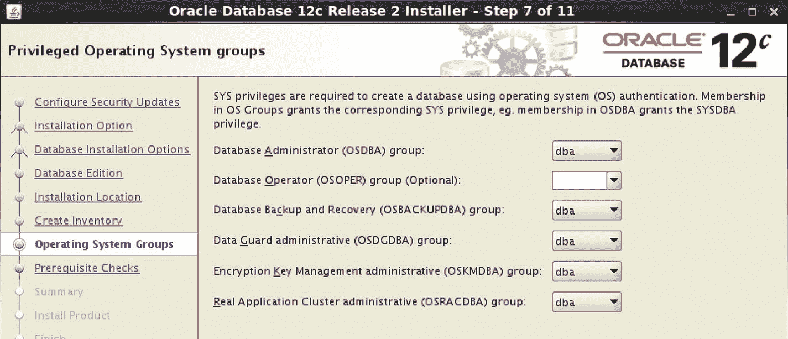
**图 5-14** OUI 操作系统组步骤

### 先决条件检查与摘要

下一个屏幕将进行一些先决条件检查。`OUI` 会在安装软件前验证您的服务器设置是否正确。如果有任何问题，`OUI` 会通知您。您应该在继续该屏幕之前修复任何发现的问题；否则，您可能需要在以后修复问题。当我安装软件时，`OUI` 没有发现任何问题，因此 `OUI` 自动进入“摘要”屏幕，如图 5-15 所示。

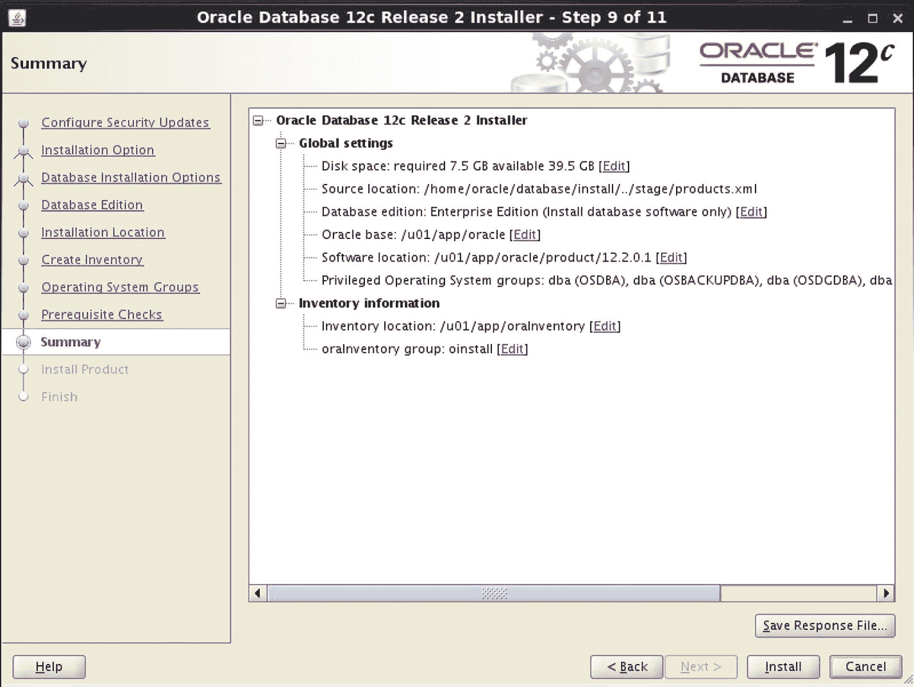
**图 5-15** OUI 摘要

### 保存响应文件与安装

一切准备就绪。我们已经回答了向导的所有问题，剩下的就是单击“安装”按钮。在图 5-15 向导的右下角，您可以看到一个标有“保存响应文件”的按钮。`OUI` 向您提出了一系列问题，您提供了答案。您可以将您的答案（即对这些问题的响应）保存在一个文件中。当您想要多次安装 Oracle 数据库软件时，这非常有用。您无需一步步通过向导，只需启动 `OUI` 并指向响应文件，`OUI` 将跳过所有这些屏幕。

我们可以在下一个屏幕上监控安装进度。我们可以看到 `OUI` 将把文件复制到 Oracle 主目录。文件复制完成后，`OUI` 将重新编译软件，也称为链接二进制文件。最后，系统将要求我们以 root 用户身份执行两个脚本。我们可以在图 5-16 中看到安装进度的示例。

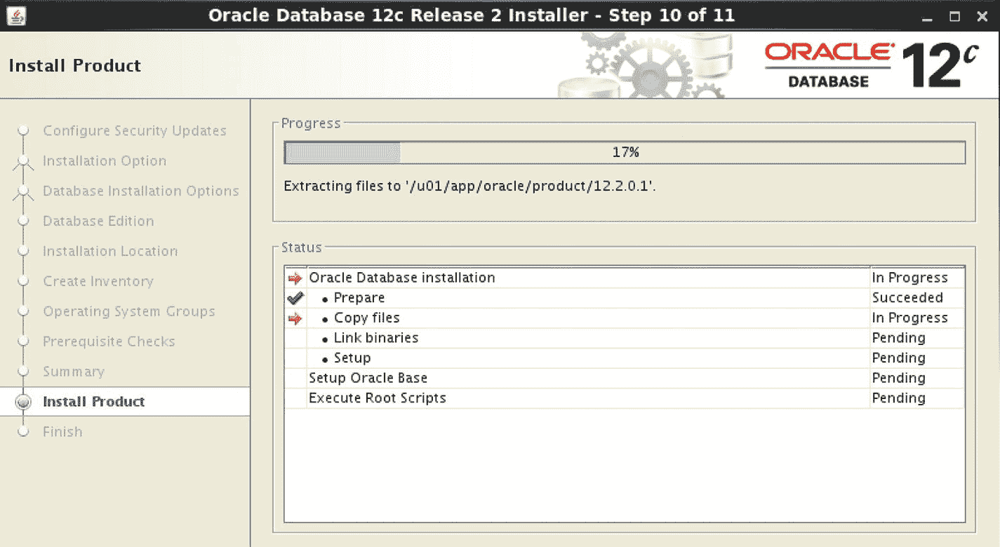
**图 5-16** OUI 安装进度

### 执行配置脚本

一旦 `OUI` 到达最后一步，它将弹出一个类似于图 5-17 的窗口。此窗口要求我们以 root 用户身份运行两个脚本。

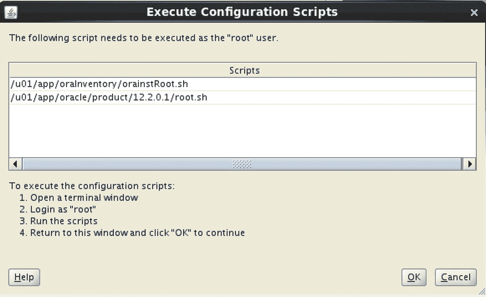
**图 5-17** OUI 执行配置脚本屏幕


在终端窗口中，执行清单 5-5 所示的命令。

```
su      (当提示时输入 root 密码)
/u01/app/oraInventory/orainstRoot.sh
/u01/app/oracle/product/12.2.0.1/root.sh
exit
清单 5-5
运行 root 脚本
```

最后一个脚本会有几个提示需要回答。只需按 `Enter` 键接受默认值即可。root 脚本运行完成后，点击图 5-17 所示窗口中的 `确定` 按钮。

`OUI` 随后会确认我们的安装已完成，如图 5-18 所示。点击 `关闭` 按钮。

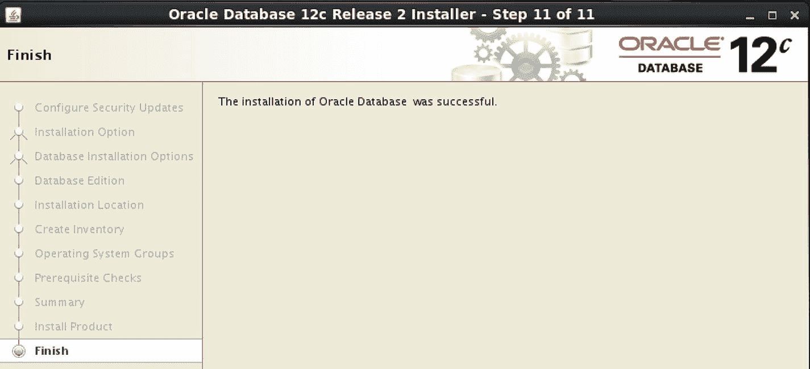

图 5-18

OUI 完成屏幕

让我们通过在终端窗口中执行清单 5-6 所示的命令来确认软件是否已安装。

```
cd /u01/app/oracle/product/12.2.0.1
ls –l
清单 5-6
验证软件已安装
```

我们应该会看到 Oracle 主目录中存在多个目录。

## 继续前进

Oracle 数据库软件现已安装在我们的测试平台上。我们无法直接进入本章，因为我们需要第 4 章的信息来回答 Oracle Universal Installer 的一些问题。对于向导的大多数提示，我们都简单地接受了默认值。

既然软件已安装，我们将在下一章创建我们的第一个数据库。我们将逐步完成另一个基于 Java 的向导，即数据库配置助手，并创建我们将在测试平台上使用的数据库。

