# 6. 创建我们的数据库

在上一章中，我们在测试服务器上安装了 Oracle 数据库软件。在本章中，我们将创建第一个 Oracle 数据库，并拥有一个功能齐全的系统，用于练习和学习 Oracle。

`OUI` 确实有一个选项，可以同时安装和创建数据库。在本书中，我们将分开执行这些操作：先安装软件，然后创建数据库。鼓励您稍后创建另一个虚拟机，测试同时安装和创建数据库。您可能会发现这个选项能节省时间。

## 创建数据库

Oracle 包含一个名为 `DBCA` 的向导，引导我们完成数据库创建步骤。与大多数向导以及我们在第 5 章使用的 `OUI` 一样，`DBCA` 是用 Java 编写的，因此无论您在哪个平台上运行，它的功能都相同。您可以手动创建 Oracle 数据库，但 `DBCA` 自动化了此过程，并降低了人为错误的可能性。除非您有特殊需求需要手动创建数据库，否则请始终使用 `DBCA`。

如果您的虚拟机未运行，请启动它。然后以 `oracle` 用户登录。从 应用程序 ➤ 系统工具 启动命令行窗口 `终端`。在我们启动 `DBCA` 之前，需要使用清单 6-1 中的命令设置环境。在您的 `终端` 窗口中键入这两个 `export` 命令。

```
export ORACLE_HOME=/u01/app/oracle/product/12.2.0.1
export PATH=$ORACLE_HOME/bin:$PATH
清单 6-1
设置环境变量
```

第一条命令设置一个指向我们的 Oracle 主目录的环境变量。第二条命令修改 `PATH` 环境变量。如果您不告诉操作系统在何处找到该实用程序，它将在其预定义的路径中搜索它。我们将 Oracle 主目录的 `bin` 子目录添加到路径中。如果您在其他 Unix 变体上运行，可能需要添加其他环境变量，如 `LD_LIBRARY_PATH`。在 Windows 平台上，这是不必要的，因为 `OUI` 在安装软件时已为我们定义了这些变量。定义环境变量后，在 `终端` 窗口中键入 `dbca` 并按 `Enter` 键。稍等片刻，`DBCA` 便会启动。初始 `DBCA` 屏幕如图 6-1 所示。

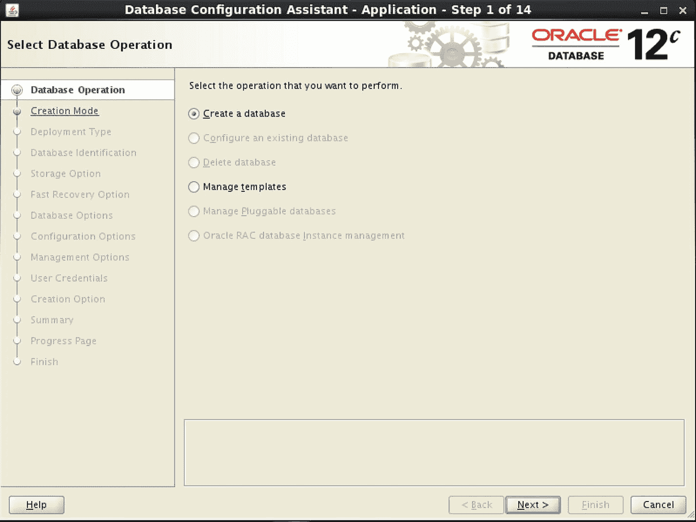

图 6-1

在 `DBCA` 中创建数据库

此时，我们只有两个选项。我们将选择创建数据库的选项。

如图 6-1 所示，`DBCA` 的功能不仅仅是创建 Oracle 数据库。它还可以用于配置现有数据库、删除数据库等等。由于此系统没有运行任何数据库，因此这些选项对我们不可用。`DBCA` 确实附带一些预定义的模板以简化管理，但出于我们的目的，我们将逐步浏览所有选项。确保选中创建数据库选项后，单击 `下一步`。`DBCA` 将前进到如图 6-2 所示的“创建模式”屏幕。

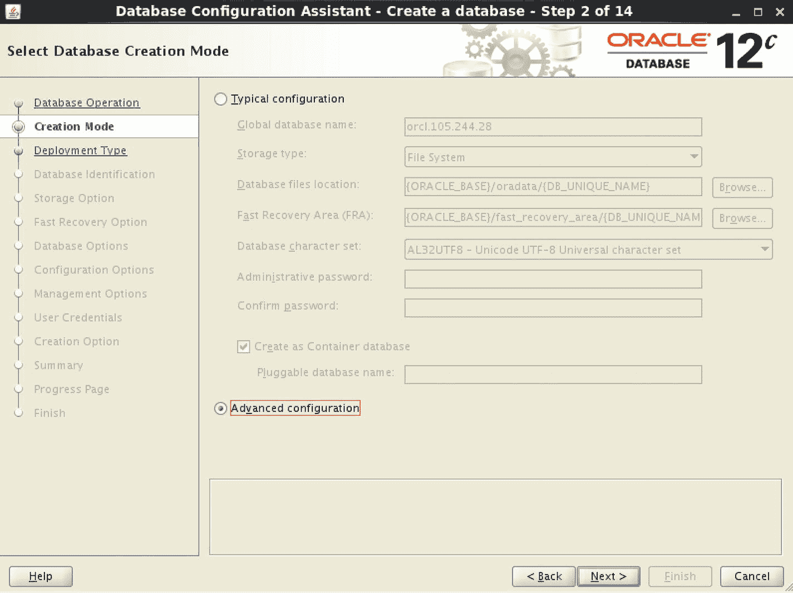

图 6-2

`DBCA` “创建模式”步骤

为了使数据库管理员的操作更简单，Oracle 提供了一个包含一些典型配置项目的简短大纲。如果选择了“典型配置”选项，`DBCA` 将跳过许多步骤。相反，我们将选择“高级配置”选项，并逐步完成每个步骤以了解更多关于此过程的信息。单击 `下一步` 前进到如图 6-3 所示的“数据库部署类型”屏幕。

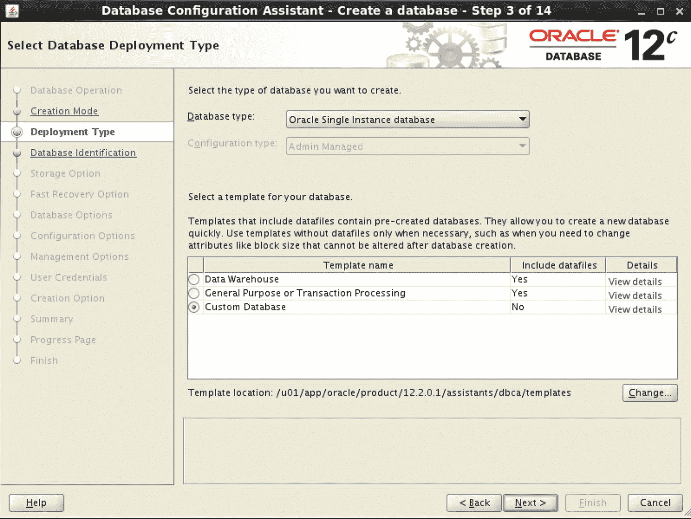

图 6-3

`DBCA` “部署类型”步骤

我们唯一可用的数据库类型是 Oracle 单实例数据库。如果下拉该菜单，您会看到 RAC 和 RAC One Node 的选项，但我们的服务器未配置为支持这些选择。此屏幕的其余部分要求我们选择一个模板。请注意，前两个模板包含数据文件。如果您选择这些模板中的任何一个，`DBCA` 的运行速度会快得多，因为它不是在创建数据库，而是在复制 Oracle 主目录中预先创建的数据库中已存在的文件。这些模板非常适合创建测试平台数据库，但切勿在生产环境中使用它们。您的生产数据库可能会获得您不想要的功能和配置。


### 提示

在创建生产数据库时，请始终选择 `Custom Database`（自定义数据库）选项。

本章中，我们将为测试环境创建一个数据库，但我们也想了解配置向导其余部分的行为，以便学习它会提出哪些问题。请选择 `Custom Database` 模板并点击 `Next`（下一步）。`DBCA` 将前进到如图 6-4 所示的 `Database Identification`（数据库标识）屏幕。图 6-4 中的图片是整个屏幕的一部分。

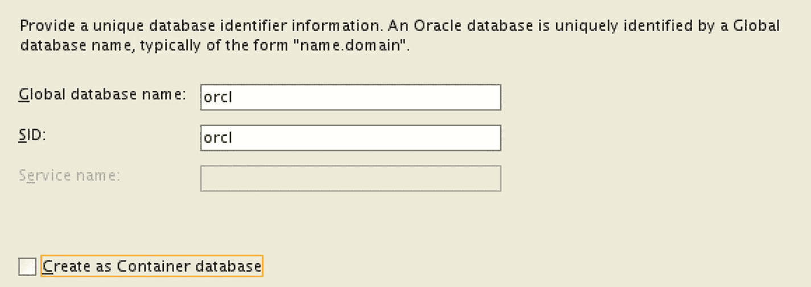

图 6-4

`DBCA` 的 `Database Identification`（数据库标识）步骤

我们将此数据库命名为 `orcl`，这是 `Oracle` 的简写。随着你数据库职业生涯的发展，你会发现其他人通常也用这个名字创建测试数据库。如果你不喜欢这个数据库名，你可以自由选择自己的名字。

**切勿**将这个名字用于生产环境。相反，应为生产数据库赋予一个有意义的名称。我通常包含一个字母标识来表明数据库是用于生产环境（`P`）、开发环境（`D`）还是测试环境（`T`）。例如，如果我们的生产数据库将支持财务应用程序，我可能将其命名为 `FINP`。该应用程序的开发和测试数据库可能分别命名为 `FIND` 和 `FINT`。这样，我不仅可以轻松识别数据库的主要应用程序，还可以识别其用途。

我也曾为一些测试环境创建过名为 `TEST` 的数据库。在使用新版本时，我可能会在名称中包含版本号，例如对于 Oracle 12.2 数据库命名为 `ORCL122`。我从不将版本号用于测试环境以外的任何东西，因为数据库很可能在未来某个时间点升级，届时名称就会变得不准确。

数据库名称限制为八个字符。如果使用 `P`、`D` 和 `T` 来指定类型（如上所述），那么只剩下七个字符来表示应用程序或其他用途。无论你使用什么，请确保它有意义，并在整个企业内保持一致。

在 `DBCA` 中，确保 `Global Database Name`（全局数据库名）和 `SID` 字段都设置为 `orcl`。确保 `Create As Container Database`（创建为容器数据库）选项未被选中。你需要取消选中此框，因为它是默认选中的。当你创建容器数据库时，你将使用 `Oracle Multitenant`（Oracle 多租户）选项。`Multitenant`（多租户）当然值得在以后探索，但现在我们将不使用该选项。点击 `Next`（下一步）按钮到达 `Storage Option`（存储选项）屏幕，如图 6-5 所示的一部分。

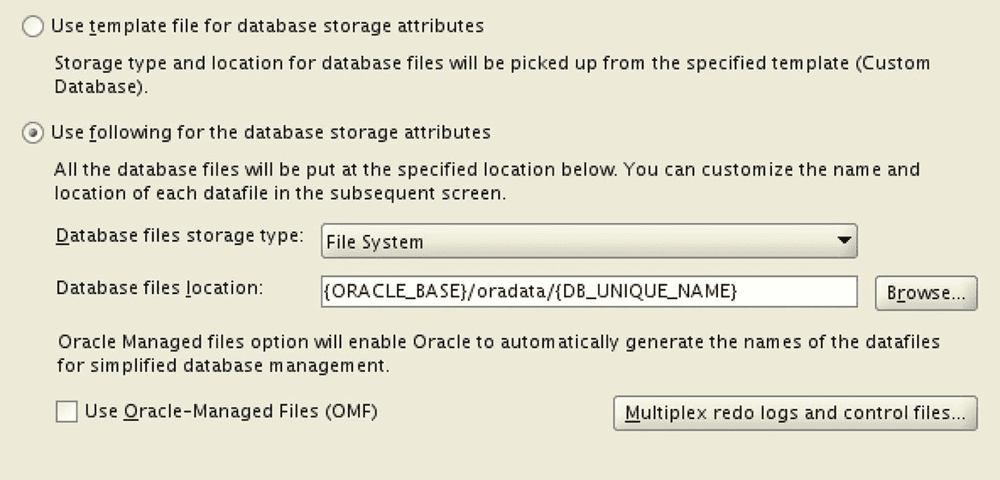

图 6-5

`DBCA` 的 `Storage Option`（存储选项）步骤

我们现在需要告诉 `DBCA` 数据库文件的存放位置。选择如图 6-5 所示的第二个单选按钮。我们将使用传统的文件系统，而不是 `Oracle` 的 `ASM`（自动存储管理）。默认位置就足够了。点击 `Next`（下一步）按钮前进到如图 6-6 所示的一部分的 `Fast Recovery Option`（快速恢复选项）屏幕。

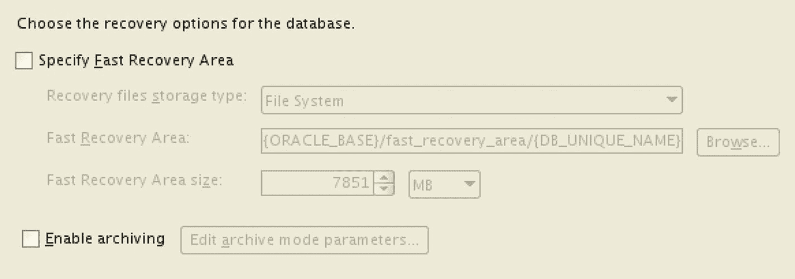

图 6-6

`DBCA` 的 `Fast Recovery Option`（快速恢复选项）步骤

如图 6-6 所示，我们可以选择定义一个 `Fast Recovery Area`（快速恢复区）。此选项允许我们定义一个位置，`Oracle` 可以将备份文件和事务日志写入其中。目前，我们将保持这些选项未选中，并点击 `Next`（下一步）按钮。`DBCA` 将前进到 `Network Configuration`（网络配置）屏幕，相关部分如图 6-7 所示。

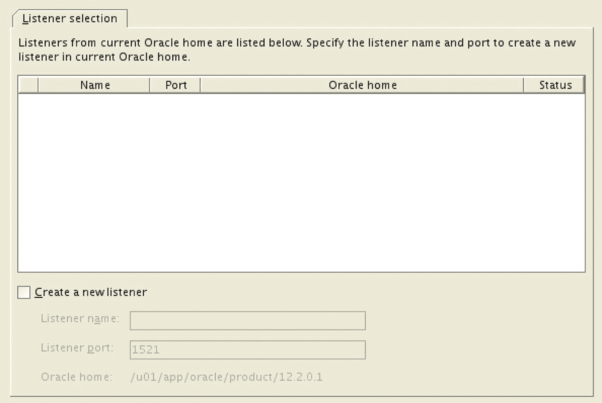

图 6-7

`DBCA` 的 `Network Configuration`（网络配置）步骤


## 跳过监听器创建

此时我们确实可以选择在`DBCA`中创建监听器。我们将通过直接点击“下一步”按钮跳过此部分。创建监听器很容易，本章稍后会进行展示。点击“下一步”按钮后，`DBCA`将进入“数据库选项”屏幕，其大部分内容如图 6-8 所示。

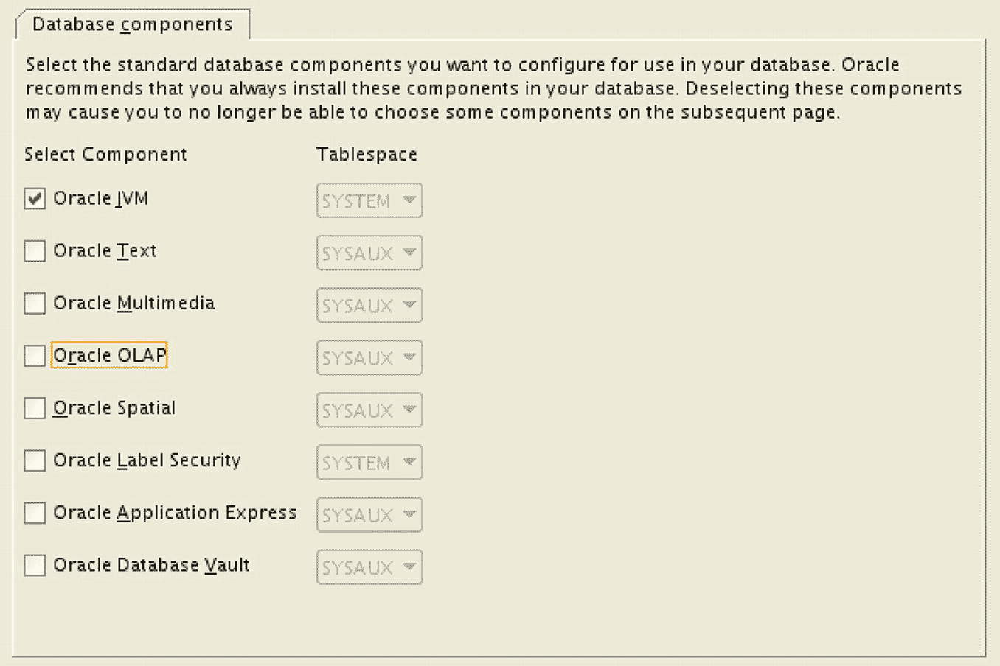

**图 6-8**
`DBCA` 数据库选项步骤

在此屏幕上，除了 `Oracle JVM` 组件外，请取消选中所有其他选项。本书不会涉及 `OLAP`、`Spatial` 或 `Application Express` 的内容。这些对我们来说是不必要的组件。如果您使用了预定义的模板，这些选项会自动包含在内。

当然，您可能有时希望测试和尝试这些额外选项。现在您知道如何创建测试数据库并根据需要包含这些选项了。

点击“下一步”按钮后，`DBCA` 将前进到“配置选项”屏幕，其大部分内容如图 6-9 所示。

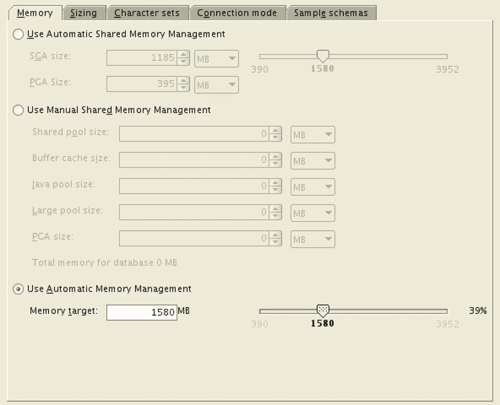

**图 6-9**
`DBCA` 配置选项步骤

在此屏幕上，您可以配置 Oracle 数据库将使用的内存占用空间。为了简化我们的操作，我们将选择使用自动内存管理（`AMM`）并采用 `DBCA` 的推荐值。`DBCA` 会根据数据库服务器的总内存计算此值。使用 `AMM`，Oracle 将根据工作负载决定为不同内存结构分配多少内存，从而简化管理任务。然而，对于生产用途，推荐选项很少是好选择，`DBA` 必须确定更好的值。其他选项卡允许我们控制其他配置项。建议您逐一点击这些选项卡查看其内容，但现在我们将接受默认值并点击“下一步”进入“管理选项”，部分内容如图 6-10 所示。

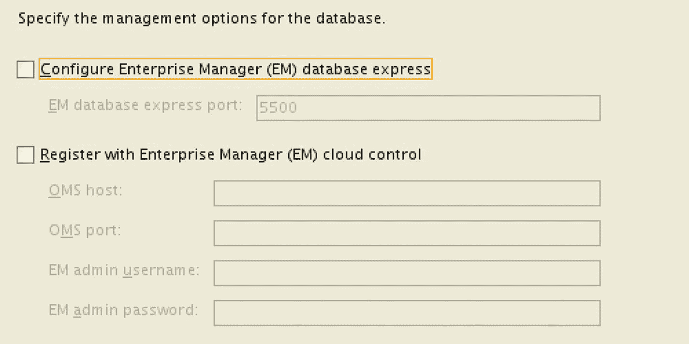

**图 6-10**
`DBCA` 管理选项步骤

此屏幕要求我们配置不同的管理选项。我们有三种选择：使用 `Enterprise Manager (EM) Database Express`、`Enterprise Manager Cloud Control` 或不使用任何选项。我们将通过取消选中任何复选框来将此数据库配置为不使用任何 `EM` 选项。这两种 `EM` 选项都是基于 `Web` 的数据库图形化管理工具。区别在于 `EM Database Express` 仅用于这一个数据库，而 `EM Cloud Control` 是一个集中式平台，能够管理您企业中的所有 `Oracle` 数据库。在本书中，我们将不使用这两种工具，尽管第 11 章将为有兴趣了解更多的人提供概述。取消选中复选框并点击“下一步”，`DBCA` 将前进到“用户凭证”屏幕，其部分如图 6-11 所示。

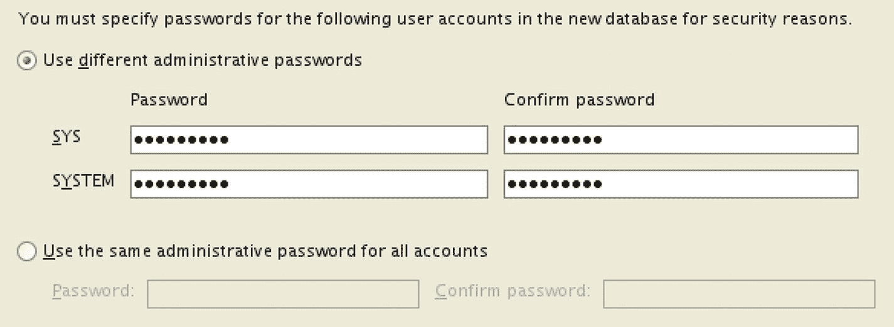

**图 6-11**
`DBCA` 用户凭证步骤

此屏幕要求我们提供 `SYS` 和 `SYSTEM` 用户的密码。`SYS` 用户是数据库中最强大的用户，并且还拥有数据字典的所有权。因此，其密码应是一个只有少数人知道的严格保密的秘密。`SYSTEM` 用户是 `DBA` 用于日常管理活动的帐户。为这些用户提供密码并点击“下一步”进入“创建选项”屏幕，其部分内容如图 6-12 所示。

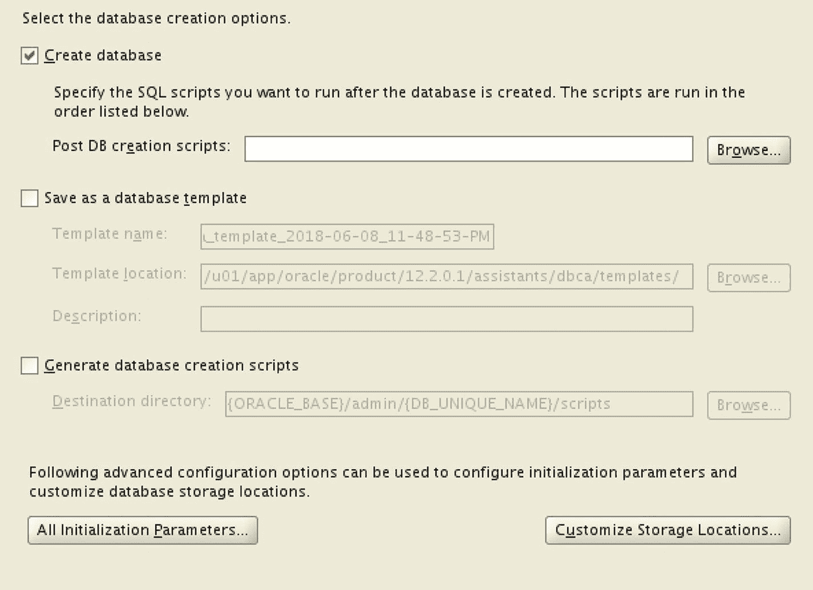

**图 6-12**
`DBCA` 创建选项步骤

当我们到达图 6-12 所示的屏幕时，我们已经提供了 `DBCA` 创建数据库所需的所有信息。现在 `DBCA` 想要知道如何继续。我们可以将所有设置的集合保存为其自己的模板，以加快未来的数据库创建，就像第 5 章中介绍的在安装 `Oracle` 时保存响应文件的选项一样。我们可以让 `DBCA` 创建脚本以便日后创建此数据库。现在，我们将确保选中“创建数据库”框。毕竟，这个选项是整个章节的重点。点击“下一步”，`DBCA` 将向我们显示我们选项的摘要，其中一部分可以在图 6-13 中看到。

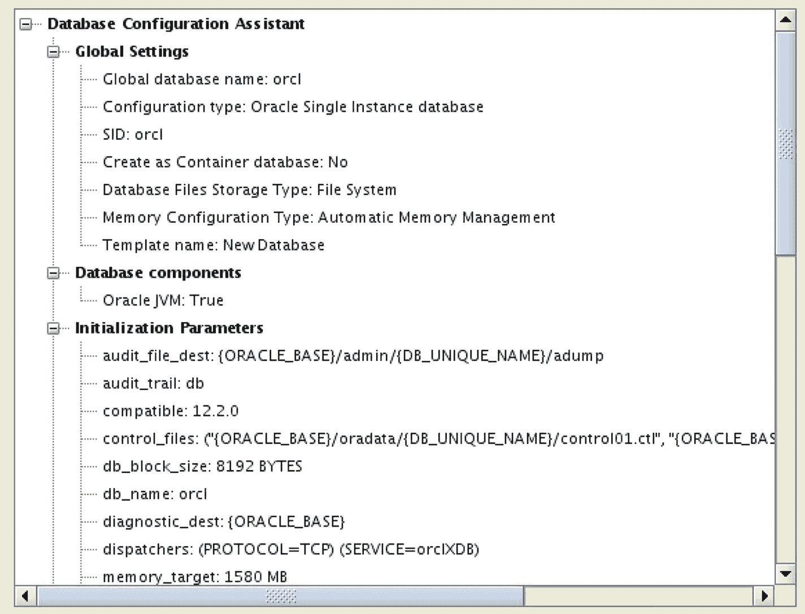

**图 6-13**
`DBCA` 摘要

我们最终会看到一个摘要屏幕。这让我们有机会复查所有已定义给 `DBCA` 的设置。如果某些内容看起来有问题，我们可以适当地点击“上一步”按钮来修改我们先前提供的答案。一旦我们满意，就点击“完成”按钮，`DBCA` 将开始工作。图 6-14 显示了 `DBCA` 创建数据库过程中的进度屏幕的一部分。

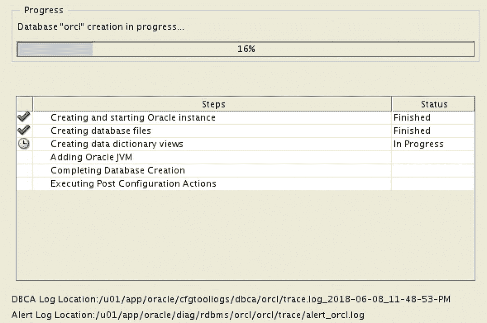

**图 6-14**
`DBCA` 进度屏幕

我们可以观看 `DBCA` 执行各个步骤。它将启动 `Oracle` 实例，然后创建数据库的文件和数据字典。此屏幕中的步骤列表取决于我们提供给 `DBCA` 的答案。

如果创建数据库时出现任何问题，首先应查看指定为 `DBCA` 日志位置的文件。

数据库创建完成后，`DBCA` 将显示最后一个屏幕，即“创建完成”面板，其部分内容如图 6-15 所示。

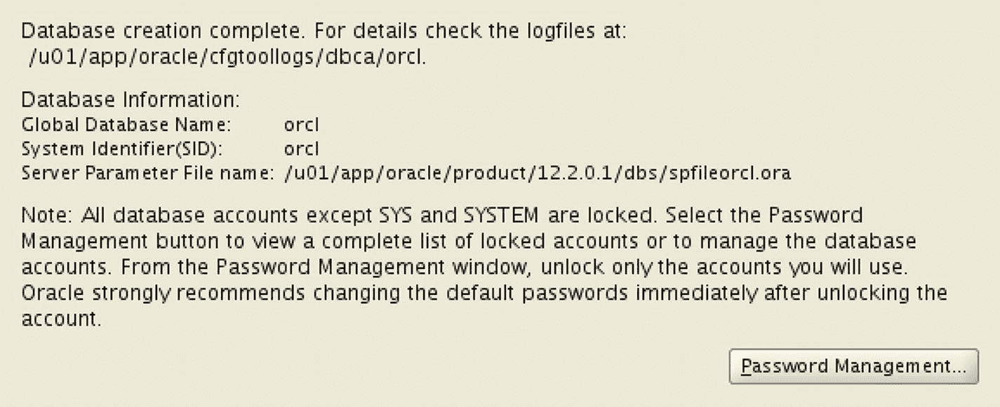

**图 6-15**
`DBCA` 数据库创建完成

点击“关闭”按钮退出该实用程序。我们的数据库现在已经创建完成并可以使用了。


