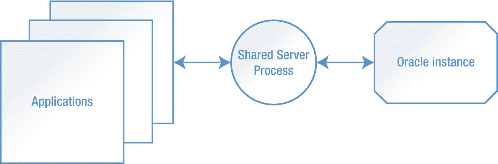
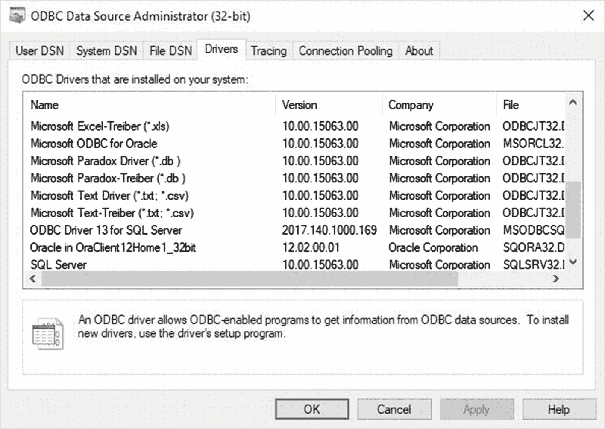
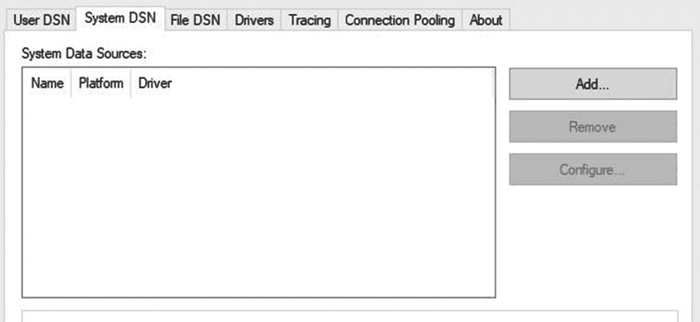
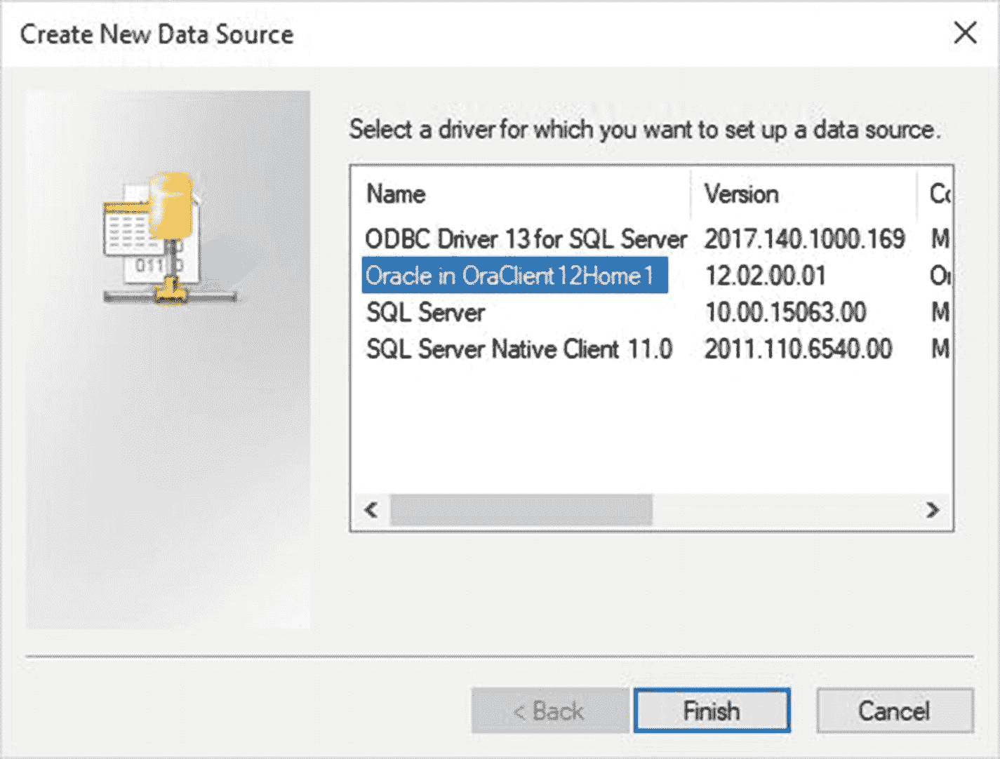
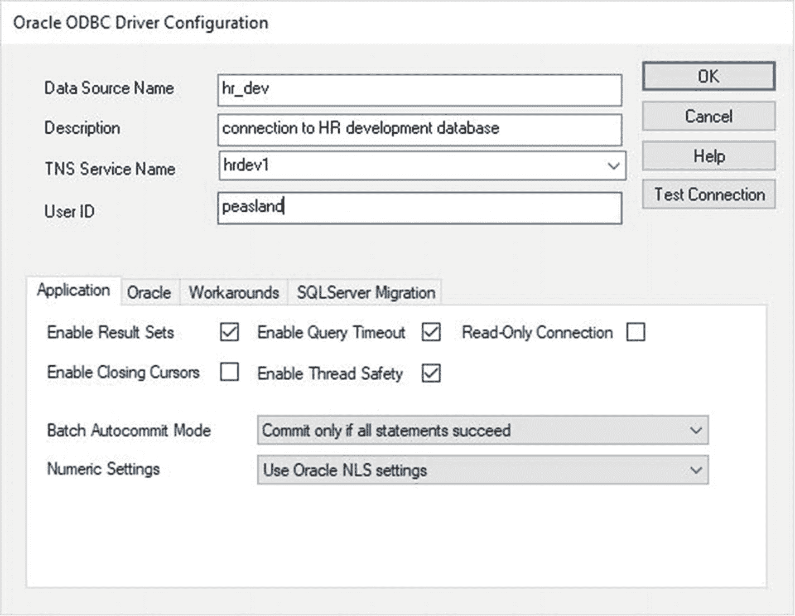
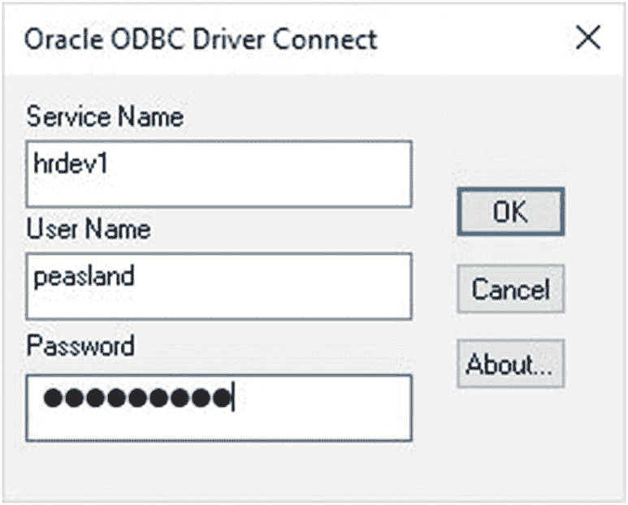
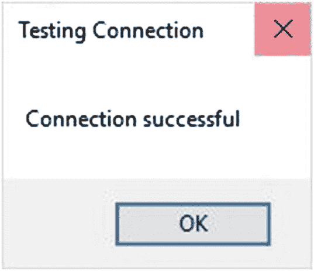

# 9. 连接到 Oracle

经过前几章的内容，我们现在在虚拟机中有了一个可运行的 Oracle 数据库。如果你一直遵循前面章节的建议，那么你已经实施了一些最佳实践。希望你也一直在阅读之前讨论过的一些 Oracle 文档。

在本章中，我们将讨论如何连接到一个运行的 Oracle 实例。毕竟，如果无法访问，那么将数据存储在数据库系统中有什么用呢？在本章中，我们将讨论连接到 Oracle 的不同方法。本书前面的所有示例都要求应用程序（通常是 `SQL*Plus`）与数据库位于同一台机器上。最终用户应用程序很少在数据库服务器上运行，因此它们需要连接到 Oracle 实例。

## 本地连接

Oracle 数据库运行在网络上某处的一台机器上。这台机器可能是你组织数据中心里的一台，也可能存在于云环境中。如果你能访问这台机器，你就可以与数据库建立本地连接。“本地”一词意味着你的数据库应用程序将与数据库位于同一台机器上。

在本节中，我们的数据库应用程序将是 `SQL*Plus`。我们在本书前面已经看到过几个使用 `SQL*Plus` 进行本地连接的示例。在我们创建的测试系统中，打开一个终端窗口。测试系统只有一个 Oracle 数据库，但服务器上可能存在多个 Oracle 实例，可能版本也不同。在我们能够连接到本地 Oracle 实例之前，我们需要设置环境，以便 `SQL*Plus` 连接知道要连接到哪个实例。我们通过更改环境变量来实现这一点。首先，我们将定义我们要连接的实例，称为系统标识符（`SID`）。接下来，我们将定义 Oracle 主目录。最后，我们将 Oracle 主目录的 `bin` 子目录添加到 `PATH` 中，这样我们只需键入可执行文件名（如“`sqlplus`”），系统就能找到它。设置环境变量如清单 [9-1] 所示。

```
[oracle@oracle122 ~]$ export ORACLE_SID=orcl
[oracle@oracle122 ~]$ export ORACLE_HOME=/u01/app/oracle/product/12.2.0.1
[oracle@oracle122 ~]$ export PATH=$ORACLE_HOME/bin:$PATH
清单 9-1
为本地连接设置环境
```

对于 Linux 操作系统上的 Oracle，这三个命令就是我们所需要的。在 Unix 平台上，你可能还有其他环境变量。在 Windows 上，数据库配置助手（`DBCA`）在安装和创建 Oracle 数据库时已经设置好了环境变量。环境变量定义正确后，我们就可以进行本地连接并向数据库发出一个简单的查询，如清单 [9-2] 所示。

```
[oracle@oracle122 ~]$ sqlplus peasland
SQL*Plus: Release 12.2.0.1.0 Production on Mon Jul 9 14:12:05 2018
Copyright (c) 1982, 2016, Oracle.  All rights reserved.
Enter password:
Last Successful login time: Mon Jul 09 2018 14:12:00 -05:00
Connected to:
Oracle Database 12c Enterprise Edition Release 12.2.0.1.0 - 64bit Production
SQL> select instance_name from v$instance;
INSTANCE_NAME
----------------
orcl
清单 9-2
本地连接
```

请注意，连接使用了我创建在第八章的 `DBA` 账户。这个简单的查询确认了我已连接到这台机器上正确的 Oracle 实例。

Oracle 确实提供了一个设置环境变量的快捷方式。在我们的 Linux 终端窗口中，键入“`. oraenv`”（一个句点后跟一个空格，然后是单词 `oraenv`）。这将询问你想使用哪个数据库，然后为你设置环境变量。在清单 [9-3] 中，我使用 `oraenv` 为 `orcl` 数据库设置环境。

```
[oracle@oracle122 ~]$ . oraenv
ORACLE_SID = [orcl] ? orcl
The Oracle base has been set to /u01/app/oracle
清单 9-3
执行 oraenv
```

请记住，我们手动定义了 Oracle 主目录。那么 Oracle 是如何知道这个数据库的主目录在哪里的呢？答案在于 `/etc/oratab` 文件，该文件是在安装数据库软件后运行 `root` 脚本时创建的。最初，文件中只有注释。当使用 `DBCA` 创建数据库时，该实用程序将在此文件中添加一个条目。现在让我们看看它的内容，如清单 [9-4] 所示。


```markdown

[oracle@oracle122 ~]$ cat /etc/oratab
#
# 此文件被 Oracle 工具程序使用。它由 root.sh 创建，
# 并在使用数据库配置助理（DBCA）创建数据库时，
# 或使用 ASM 配置助理（ASMCA）创建 ASM 实例时更新。
# 冒号 ':' 用作字段分隔符。换行符表示条目结束。
# 以井号 '#' 开头的行是注释。
#
# 条目格式如下：
#   $ORACLE_SID:$ORACLE_HOME::
#
# 第一个和第二个字段分别是数据库的系统标识符和主目录。
# 第三个字段指示 dbstart 工具在系统启动时是否应启动该数据库，
# "Y" 表示是，"N" 表示否。
#
# 不允许存在具有相同 $ORACLE_SID 的多个条目。
#
#
orcl:/u01/app/oracle/product/12.2.0.1:N
清单 9-4
Oratab 文件

文件大部分内容是注释，但请看最后一行。它显示名为 `orcl` 的 `ORACLE_SID` 对应的 Oracle 主目录是 `/u01/app/oracle/product/12.2.0.1`。当你使用 `oraenv` 设置环境时，它会查找此文件来定位 Oracle 主目录，从而正确设置你的环境变量。如果你使用 `DBCA` 创建数据库，该工具会自动填充 `oratab` 文件。如果你使用数据库升级助理（`DBUA`）升级到新的 Oracle 版本，`DBUA` 会自动修改此文件。如果你手动创建或升级数据库，则必须手动修改此文件。该行的最后部分是 `Y` 或 `N`，这是一个标志，用于告知 Oracle 提供的启动和关闭工具是否要处理此数据库。如果标志设置为 `Y`，这些工具在运行时会启动和关闭该数据库对应的 Oracle 实例。

此文件在 Windows 系统上不存在。Oracle 使用 Windows 注册表来指向该服务器上每个数据库的 Oracle 主目录。启动和关闭通过 Windows 服务和相应的注册表项实现自动化。

## 进程与继承 (Bequeath)

当我们建立本地连接时，底层发生了什么？要理解这一点，我们需要稍微回溯一下。启动一个 Oracle 实例会在数据库服务器上分配内存并创建许多进程。这些进程都执行 Oracle 数据库引擎所需的工作。在本书后面，我们将更深入地探讨这些用于支持 Oracle 实例的后台进程。

当应用程序连接到 Oracle 实例时，Oracle 会在数据库服务器上创建一个专用于该用户会话的进程。这被称为 `专用服务器进程`。应用程序与 `专用服务器进程` 对话，而 `专用服务器进程` 与 Oracle 实例对话。应用程序不直接与实例通信。图 9-1 显示了其工作流程。


图 9-1
专用服务器进程

在我们的例子中，应用程序是 `SQL*Plus`。`SQL*Plus` 是应用程序的名称，而 `sqlplus` 是我们调用来运行该应用程序的可执行文件。`SQL*Plus` 与一个 `专用服务器进程` 对话，该进程是在我们连接到实例时为我们创建的。在清单 9-5 中，我们将找出当前会话的进程标识符，然后查看服务器上运行的进程。

```
SQL> select spid from v$process
  2  where addr in (select paddr from v$session
  3                 where username='PEASLAND');
SPID
----------
7080

SQL> !ps -ef|grep 7080
oracle    7080  7069  0 14:37 ?        00:00:00 oracleorcl (DESCRIPTION=(LOCAL=YES)(ADDRESS=(PROTOCOL=beq)))
SQL> !ps -ef|grep 7069
oracle    7069  2752  0 14:37 pts/0    00:00:00 sqlplus
oracle    7080  7069  0 14:37 ?        00:00:00 oracleorcl (DESCRIPTION=(LOCAL=YES)(ADDRESS=(PROTOCOL=beq)))
清单 9-5
本地进程
```

从上面的输出中，我们可以从 `V$PROCESS` 视图看到我们的 `专用服务器进程` 的服务器进程标识符 (`SPID`) 是 `7080`。使用 `ps` 命令并通过 `grep` 过滤，我们可以看到服务器上运行着一个名为 `oracleorcl` 的进程。这就是我们的 `专用服务器进程`。让我们检查一下该行的其余部分。注意它显示 `LOCAL=YES` 和 `PROTOCOL=BEQ`。这些信息告诉我们这个 `专用服务器进程` 是用于本地连接的，并且它使用 `Bequeath` 通信协议。我们还可以看到进程 `7080` 有一个父进程，其服务器进程标识符 (`SPID`) 是 `7069`。如果我们再次使用 `ps` 和 `grep`，可以看到进程 `7069` 就是我们的 `sqlplus` 应用程序。

对于本地连接，你经常会看到使用 `Bequeath` 协议。`bequeath` 一词意为将某物传递给他人。在此上下文中，该协议只是简单地将连接直接传递给 `专用服务器进程`。`Bequeath` 总是使用 `专用服务器进程`，并且从不涉及 Oracle 监听器（Listener），这将在下一节讨论。

每个 `专用服务器进程` 都需要在数据库服务器上占用一定的内存和其他开销。随着互联网的爆炸式增长，越来越多的用户开始从数据库访问数据，人们逐渐认识到 `专用服务器进程` 架构会达到一些限制。甲骨文公司（Oracle Corporation）创建了 `共享服务器进程` 架构，在这种架构中，服务器上的进程由多个应用程序共享，如图 9-2 所示。


图 9-2
共享服务器进程

采用这种架构，服务器进程的数量可以显著减少。然而，如今我们在实践中很少看到这些的使用。今天我们有应用程序和 Web 服务器连接池。我们有 Java 连接池。所有这些都减少了数据库连接的数量。因此，当今的 Oracle DBA 通常不需要实施 `共享服务器` 架构。我在这里提及它只是为了让你知道它的存在，并对其含义有一个基本的了解。也许有一天你会发现它适合你的系统架构。

我们已经了解了本地于数据库服务器的应用程序如何连接到 Oracle 实例。下一个合乎逻辑的步骤是讨论位于另一台机器上、远离数据库服务器的应用程序如何连接到实例。实际上，应用程序几乎从不在数据库服务器上。通常，本地用于数据库的唯一应用程序是 DBA 手中的 `SQL*Plus`。最终用户在他们的桌面上运行应用程序，或者与 Web 服务器或其他应用程序服务器交互。所有这些连接请求都通过 Oracle 监听器（Listener）进行，这是下一节的主题。

在讨论 Oracle 数据库的进程时，还有最后一个注意事项。在 Unix 和 Linux 系统上，这些进程都作为服务器上独立的进程出现。在 Windows 系统上，它们是同一进程中的线程。在 Windows 进程中不容易看到线程，这确实使得在 Windows 上运行 Oracle 有时更难处理。

## Oracle 监听器

监听器的工作很简单。监听传入的连接请求（因此得名），建立连接，然后退到一边。太多人错误地认为监听器参与了应用程序和数据库之间的每次网络通信，但事实并非如此。一旦连接建立，对于该会话来说就不再需要监听器了。

```


### 提示

`Listener` 仅用于协调连接请求。

`Listener` 是数据库服务器上的另一个进程。它在特定端口上监听传入的连接请求。连接请求表明应用程序希望连接到该服务器上的特定 `Oracle` 实例。如果 `Listener` 知道该实例，它会指示实例启动一个服务器进程（专用或共享）。服务器进程和应用程序开始相互通信，之后 `Listener` 便退出该过程。

默认情况下，`Listener` 使用端口 `1521`。曾几何时，端口 `1526` 是某些平台的另一个默认端口。`Listener` 可以配置为使用不同的端口，但这样做几乎没有必要。将 `Listener` 移动到不同端口并不能帮助提高任何 `Oracle` 数据库的安全性，因为如今的端口扫描工具可以快速确定 `Listener` 实际使用的端口。此外，如果 `Listener` 运行在非默认端口上，数据库管理员需要手动配置 `LOCAL_LISTENER` 参数，以便实例能够找到 `Listener`。

让我们检查数据库服务器上 `Listener` 的状态。检查状态的命令是 `lsnrctl status`，如**清单 9-6** 所示。

```
[oracle@oracle122 ~]$ lsnrctl status
LSNRCTL for Linux: Version 12.2.0.1.0 - Production on 09-JUL-2018 22:48:36
Copyright (c) 1991, 2016, Oracle.  All rights reserved.
Connecting to (ADDRESS=(PROTOCOL=tcp)(HOST=)(PORT=1521))
STATUS of the LISTENER

Alias                   LISTENER
Version                 TNSLSNR for Linux: Version 12.2.0.1.0 - Production
Start Date              09-JUL-2018 13:44:41
Uptime                  0 days 9 hr. 3 min. 55 sec
Trace Level             off
Security                ON: Local OS Authentication
SNMP                    OFF
Listener Log File       /u01/app/oracle/diag/tnslsnr/oracle122/listener/alert/log.xml
Listening Endpoints Summary...
(DESCRIPTION=(ADDRESS=(PROTOCOL=tcp)(HOST=dbamentor)(PORT=1521)))
The listener supports no services
The command completed successfully
```
**清单 9-6** Listener 状态

从上面的输出中，有几点需要注意。我们可以轻松看到 `Listener` 的启动日期和运行时间。此输出还向我们展示了 `Listener` 日志文件的位置，以防我们需要对其操作进行故障排除。现在请注意“Listening Endpoints Summary”部分。从这一部分可以了解到三个重要信息。第一，`Listener` 使用 `TCP` 网络协议。第二，`Listener` 运行在主机 `dbamentor`（我们的测试平台）上。第三，`Listener` 使用端口 `1521`。

### 提示

重要的 `Listener` 配置信息是协议、主机和端口。

这三个部分是问题经常出错的地方，正如我们将在本章后面看到的。

端口下面的那行显示 `Listener` 当前不支持任何服务。此时没有服务的原因是服务器上没有运行 `Oracle` 实例。启动 `Oracle` 实例后，我们可以再次检查状态，如**清单 9-7** 所示。

```
[oracle@oracle122 ~]$ lsnrctl status
LSNRCTL for Linux: Version 12.2.0.1.0 - Production on 09-JUL-2018 23:01:00
Copyright (c) 1991, 2016, Oracle.  All rights reserved.
Connecting to (ADDRESS=(PROTOCOL=tcp)(HOST=)(PORT=1521))
STATUS of the LISTENER

Alias                 LISTENER
Version               TNSLSNR for Linux: Version 12.2.0.1.0 - Production
Start Date            09-JUL-2018 13:44:41
Uptime                0 days 9 hr. 16 min. 18 sec
Trace Level           off
Security              ON: Local OS Authentication
SNMP                  OFF
Listener Log File     /u01/app/oracle/diag/tnslsnr/oracle122/listener/alert/log.xml
Listening Endpoints Summary...
(DESCRIPTION=(ADDRESS=(PROTOCOL=tcp)(HOST=dbamentor)(PORT=1521)))
Services Summary...
Service "orcl" has 1 instance(s).
Instance "orcl", status READY, has 1 handler(s) for this service...
Service "orclXDB" has 1 instance(s).
Instance "orcl", status READY, has 1 handler(s) for this service...
The command completed successfully
```
**清单 9-7** 带有服务的 Listener

这次，我们可以看到两个服务：`orcl` 和 `orclXDB`。每当一个实例启动并向 `Listener` 注册自身时，至少会有两个服务在运行。第一个服务与数据库名称匹配。第二个服务用于 `Oracle XML` 数据库处理。现在我们拥有了建立连接所需的四个重要信息：网络协议、主机名、端口和服务。

正如您所料，我们可以使用 `lsnrctl` 实用程序停止和启动 `Listener`。示例如**清单 9-8** 所示。

```
[oracle@oracle122 ~]$ lsnrctl stop
LSNRCTL for Linux: Version 12.2.0.1.0 - Production on 09-JUL-2018 23:07:10
Copyright (c) 1991, 2016, Oracle.  All rights reserved.
Connecting to (ADDRESS=(PROTOCOL=tcp)(HOST=)(PORT=1521))
The command completed successfully
[oracle@oracle122 ~]$ lsnrctl start
LSNRCTL for Linux: Version 12.2.0.1.0 - Production on 09-JUL-2018 23:07:13
Copyright (c) 1991, 2016, Oracle.  All rights reserved.
Starting /u01/app/oracle/product/12.2.0.1/bin/tnslsnr: please wait...
TNSLSNR for Linux: Version 12.2.0.1.0 - Production
Log messages written to /u01/app/oracle/diag/tnslsnr/oracle122/listener/alert/log.xml
Listening on: (DESCRIPTION=(ADDRESS=(PROTOCOL=tcp)(HOST=dbamentor)(PORT=1521)))
Connecting to (ADDRESS=(PROTOCOL=tcp)(HOST=)(PORT=1521))
STATUS of the LISTENER

Alias                     LISTENER
Version                   TNSLSNR for Linux: Version 12.2.0.1.0 - Production
Start Date                09-JUL-2018 23:07:13
Uptime                    0 days 0 hr. 0 min. 0 sec
Trace Level               off
Security                  ON: Local OS Authentication
SNMP                      OFF
Listener Log File         /u01/app/oracle/diag/tnslsnr/oracle122/listener/alert/log.xml
Listening Endpoints Summary...
(DESCRIPTION=(ADDRESS=(PROTOCOL=tcp)(HOST=localhost)(PORT=1521)))
The listener supports no services
The command completed successfully
```
**清单 9-8** Listener 停止与启动

在启动时，`Listener` 最初不支持任何服务。实例注册到 `Listener` 可能需要长达五分钟的时间。


## Oracle 客户端

当 Oracle 数据库软件安装在服务器上时，它包含了支持数据库引擎所需的所有可执行文件和库文件。Oracle 数据库软件还包含 Oracle 的网络协议栈，以便 Oracle 实例能够与远程应用程序进行通信。

当工作站上的应用程序需要与 Oracle 交互时，其本身必须具备某种网络能力。应用程序将其请求发送到应用程序所在机器（有时称为客户端机器）上的 Oracle 网络协议栈。Oracle 网络协议栈将请求转发给操作系统的网络协议栈。操作系统通过通常基于 TCP/IP 的网络发送该请求。一旦请求到达数据库服务器，服务器的操作系统会将其发送到 Oracle 网络协议栈，然后再发送到 Oracle 实例。

对于工作站和应用服务器，Oracle 提供了 `Oracle Client` 软件。`Oracle Client` 包含与 Oracle 数据库完全相同的网络协议栈，以及一些实用程序，如 `SQL*Plus`。在安装任何将要访问 Oracle 数据库的应用程序之前，先安装 `Oracle Client` 软件是非常常见的做法。然而，这并非强制性要求。有些应用程序不需要 `Oracle Client`，因为它们自己提供了网络功能。另外值得一提的是，Oracle 公司确实提供了 `Oracle Instant Client` 软件，这是 `Oracle Client` 的精简版。

`Oracle Client` 比数据库软件小得多。在架构的客户端一侧，我们很少需要数据库的全部功能，因此较小的占用空间是理想的。`Oracle Client` 可以从 Oracle 技术网络上获取，位置与数据库软件相同。

在 Oracle 的早期，网络协议栈的 Oracle 部分被称为透明网络底层（TNS）。后来，它被更名为 `SQL*Net`。如今，该网络栈简称为 `Oracle Net`。原始的 TNS 缩写仍然可见，正如我们将在下一节中看到的。

## TNSNAMES

在本章前面的“Oracle 监听器”部分，您了解到监听器是连接请求的中介。回想一下，为了建立成功的连接，我们需要知道网络协议、主机、端口和服务名。这四个信息片段每次连接 Oracle 时都可能难以记住。值得庆幸的是，我们可以创建一个别名、一个快捷方式，使用一个名字来定义所有四个关键信息片段。

`$ORACLE_HOME/network/admin` 目录可能包含一个名为 `tnsnames.ora` 的文件。这就是我们别名的存放位置。用 Oracle 的术语来说，我们通常称这些为 *TNS 别名*。如果 `tnsnames.ora` 文件不存在，那只是因为我们尚未创建它。我们可以用任何文本编辑器创建一个。一个示例如清单 [9-9] 所示。

```
tnsaliasX =
(DESCRIPTION =
  (ADDRESS_LIST =
    (ADDRESS = (PROTOCOL = TCP)(HOST = localhost)(PORT = 1521))
  )
  (CONNECT_DATA =
    (SERVICE_NAME = orcl)
  )
)
清单 9-9
TNSNAMES 别名
```

在清单 [9-9] 中，别名名称是 `tnsaliasX`。别名可以是我们选择的任何名称。还记得那四个重要信息吗？我们可以在别名定义中看到它们：协议（`TCP`）、主机（`localhost`）、端口（`1521`）和服务名（`orcl`）都存在。现在我们只需要记住别名名称，就可以用它来连接数据库。在清单 [9-9] 中，别名是在数据库服务器上创建的，所以主机只是 `localhost`。您可以在测试环境中创建一个像这样的 TNS 别名来模拟非本地连接，正如我们将在本章中做的那样。如果这个别名是在工作站的 `Oracle Client` 的 `network/admin` 目录中创建的，主机值将指向一个特定的数据库主机。

一个 `tnsnames.ora` 文件当然可以包含多个别名以支持多个应用程序。我通常将别名命名为有意义的名称。清单 [9-9] 中的例子不是很具有意义，因为 `tnsaliasX` 可能暗示任何东西。一个更有意义的别名可能是 `hr_prod`，我们可以很容易地看出它是用于生产人力资源数据库的。尽量避免像 `prod` 或 `dev` 这样的通用别名，因为迟早您会拥有不止一个生产或开发数据库，然后您就不知道这个别名指的是哪一个了。

在本书中，我将把我的别名改为 `dbamentor`。我们可以使用 `tnsping` 实用程序测试该别名，如清单 [9-10] 所示。

```
[oracle@oracle122 admin]$ tnsping dbamentor
TNS Ping Utility for Linux: Version 12.2.0.1.0 - Production on 09-JUL-2018 23:53:24
Copyright (c) 1997, 2016, Oracle.  All rights reserved.
Used parameter files:
Used TNSNAMES adapter to resolve the alias
Attempting to contact (DESCRIPTION = (ADDRESS_LIST = (ADDRESS = (PROTOCOL = TCP)(HOST = localhost)(PORT = 1521))) (CONNECT_DATA = (SERVICE_NAME = orcl)))
OK (60 msec)
清单 9-10
TNSPING 实用程序
```

`tnsping` 实用程序查找提供的 TNS 别名，并尝试将其解析为协议、主机、端口和服务名。输出的最后一行简单地显示 `OK`。此实用程序用于确认在该主机上、使用该端口、运行着 Oracle 监听器，并且可以处理该服务名。基本上，`tnsping` 验证数据库的监听器具有相同的四个组件。`Tnsping` 不执行任何其他检查。`Tnsping` 不能用于验证该机器上是否运行着 Oracle 实例。

现在我们已经定义了一个 TNS 别名，我们可以用它来远程连接到 Oracle 实例。使用 `SQL*Plus`，我们只需在用户名后面加上 `@` 符号分隔的 TNS 别名。这个符号是 `SQL*Plus` 在提供的信息中识别 TNS 别名起始位置的方式。清单 [9-11] 中的示例使用 TNS 别名连接到数据库。

```
[oracle@oracle122 admin]$ sqlplus peasland@dbamentor
SQL*Plus: Release 12.2.0.1.0 Production on Mon Jul 9 23:57:28 2018
Copyright (c) 1982, 2016, Oracle.  All rights reserved.
Enter password:
Last Successful login time: Mon Jul 09 2018 14:37:40 -05:00
Connected to:
Oracle Database 12c Enterprise Edition Release 12.2.0.1.0 - 64bit Production
SQL> select spid from v$process
  2  where addr in (select paddr from v$session
  3                where username='PEASLAND');
SPID
SQL> !ps -ef|grep 15206
oracle   15206     1  0 Jul09 ?        00:00:00 oracleorcl (LOCAL=NO)
清单 9-11
使用 TNS 别名的 SQL*Plus
```

连接建立后，我们运行了本章前面清单 [9-5] 中的相同 SQL 语句，以找到我们连接的专用服务器进程。注意，这不再是 `LOCAL` 连接了。请记住，这个会话是从数据库服务器本身启动的，所以从技术上讲它是一个本地连接。然而，这个连接没有使用 `Bequeath` 协议，而是使用了 `TCP`。因此，对于 Oracle 来说，它看起来是一个远程、非本地的连接。

需要记住的重要事项是，远程连接需要知道网络协议、主机、端口和服务名。我们可以使用 TNS 别名来减轻我们记忆所有这些信息的负担。


## 常见 TNS 错误

如果连接请求失败，Oracle 会提供错误信息。对很多人来说，错误信息可能有点令人困惑。阅读本章，你已经在理解如何解决最常见的错误方面取得了很大进展，因为你已经知道了四个重要组成部分：协议、主机、端口和服务。很可能其中一个（或多个）组成部分定义不正确。在代码清单 9-12 中，我们可以看到`tnsping`工具收到了`TNS-12545`错误。

```
[oracle@oracle122 admin]$ tnsping dbamentor
TNS Ping Utility for Linux: Version 12.2.0.1.0 - Production on 10-JUL-2018 00:06:22
Copyright (c) 1997, 2016, Oracle.  All rights reserved.
Used parameter files:
Used TNSNAMES adapter to resolve the alias
Attempting to contact (DESCRIPTION = (ADDRESS_LIST = (ADDRESS = (PROTOCOL = TCP)(HOST = loclhost)(PORT = 1521))) (CONNECT_DATA = (SERVICE_NAME = orcl)))
TNS-12545: Connect failed because target host or object does not exist
```
代码清单 9-12
TNS-12545 错误

如果你仔细阅读错误信息，可以看到问题根本原因的线索。“目标主机”不存在。看一下输出中定义主机的其他部分。注意“localhost”缺少了字母*a*。一个简单的拼写错误导致了这个问题。更正`TNS`别名中的主机后问题就解决了。现在让我们看下一个示例，代码清单 9-13。

```
oracle@oracle122 admin]$ tnsping dbamentor
TNS Ping Utility for Linux: Version 12.2.0.1.0 - Production on 10-JUL-2018 00:10:58
Copyright (c) 1997, 2016, Oracle.  All rights reserved.
Used parameter files:
Used TNSNAMES adapter to resolve the alias
Attempting to contact (DESCRIPTION = (ADDRESS_LIST = (ADDRESS = (PROTOCOL = TCP)(HOST = localhost)(PORT = 15211))) (CONNECT_DATA = (SERVICE_NAME = orcl)))
TNS-12541: TNS:no listener
```
代码清单 9-13
TNS-12541 错误

这一次，错误信息说明没有运行的监听器。数据库管理员检查了监听器并确认它是启动并运行的。你从上面的输出中看到问题所在了吗？记住，监听器在特定机器的特定端口上运行。端口定义错了。端口应该是`1521`，而不是`15211`。

这是一个快速讨论端口的好地方。我们知道监听器使用特定端口，通常是`1521`。如果我们想连接到 Oracle 实例，防火墙需要允许访问这个端口。不那么明显的是，每个服务器进程（专用或共享）都有分配给它自己的端口，范围很广。仅仅通过防火墙开放`1521`端口可能不够。如果你怀疑防火墙阻止了连接，请与你的网络团队合作。如果你在云环境中运行 Oracle，请与你的云提供商合作。

在下一个示例代码清单 9-14 中，我们将为服务名指定一个不正确的值，并尝试使用`SQL*Plus`建立连接。

```
[oracle@oracle122 admin]$ sqlplus peasland@dbamentor
SQL*Plus: Release 12.2.0.1.0 Production on Tue Jul 10 00:14:31 2018
Copyright (c) 1982, 2016, Oracle.  All rights reserved.
Enter password:
ERROR:
ORA-12514: TNS:listener does not currently know of service requested in connect
descriptor
```
代码清单 9-14
ORA-12514 错误

`ORA-12514`错误告诉我们，监听器在该主机和端口上被联系到了，但它不知道我们提供的服务名。在这种情况下，数据库管理员需要检查`TNS`别名以确定指定了什么服务名。然后与“`lsnrctl status`”的输出进行比较，以确保服务名在那里。通常，`TNS`别名的`SERVICE_NAME`存在不匹配。

最后一个例子还引出了另外一点。注意这次错误编号以`ORA`开头，而不是`TNS`。在处理`TNS`错误时，你可能会看到 Oracle 代码交换前缀，但编号将保持不变。所以`ORA-12514`和`TNS-12514`是完全相同的错误。

## EZ Connect

`TNS`别名可以使你的生活更轻松，因为你不需要记住或输入协议、主机、端口和服务名。当你需要连接到一个远程数据库几次但不是很频繁时，`TNS`别名可能会使你的生活更加困难。使用`TNS`别名，你必须用文本编辑器打开`tnsnames.ora`文件，添加适当的别名，然后保存文件。最后，你可以在连接中使用该`TNS`别名。如果这是你唯一一次连接到该数据库，你还必须记得再次编辑`tnsnames.ora`文件以删除该别名。

Oracle Database 10*g*通过引入 EZ Connect 方法使生活变得容易了一些。使用 EZ Connect，你可以在传统上输入`TNS`别名的地方指定主机、端口和服务名。EZ Connect 总是假定协议是`TCP`，所以如果你需要不同的网络协议，你就必须定义`TNS`别名。

使用`SQL*Plus`时，“`@tnsalias`”结构用于定义要连接到的远程数据库。EZ Connect 的形式是`@//*hostname*:*port*/*service*`。如果你省略端口，EZ Connect 假定默认端口`1521`。EZ Connect 格式提供了所需信息中的三个部分：主机名、端口和服务。我们知道 EZ Connect 只使用`TCP`协议，所以这是第四个也是最后一个信息部分。

示例代码清单 9-15 展示了使用 EZ Connect 进行连接。

```
[oracle@oracle122 ~]$ sqlplus peasland/password@//localhost:1521/orcl
SQL*Plus: Release 12.2.0.1.0 Production on Tue Jul 10 08:53:23 2018
Copyright (c) 1982, 2016, Oracle.  All rights reserved.
Last Successful login time: Tue Jul 10 2018 08:53:16 -05:00
Connected to:
Oracle Database 12c Enterprise Edition Release 12.2.0.1.0 - 64bit Production
SQL>
```
代码清单 9-15
使用 SQL*Plus 的 EZ Connect

当与`SQL*Plus`一起使用 EZ Connect 时，你必须在`@`符号之前包含用户名和密码。如果你省略密码，将会收到错误。

并非所有应用程序都支持 EZ Connect。像`SQL*Plus`这样的 Oracle 自带工具将接受 EZ Connect，但许多第三方应用程序不会。通常，第三方应用程序始终连接到同一个数据库，因此不支持 EZ Connect 并不是什么大问题，因为我们会为该应用程序定义一个`TNS`别名。


### ODBC

开放数据库连接（`ODBC`）已经存在了很长时间。它的唯一目的是将应用程序连接到某种数据库。`ODBC`是一种软件驱动程序，有助于使数据库连接与所使用的数据库系统无关。

你是否支持过供应商声称可以使用`Oracle`或`SQL Server`的应用程序？供应商可能还支持其他数据库引擎。供应商通常不会为其软件编写两个不同的版本，一个用于`SQL Server`，一个用于`Oracle`。相反，供应商使用`ODBC`打开一个与数据库无关的连接。无论使用哪个数据库，应用程序代码基本相同。并非所有的`SQL`语句都是一样的。针对`Oracle`数据库执行的`SQL`语句可能与针对`SQL Server`执行的相同`SQL`语句性能不同。好的应用程序供应商会根据所使用的数据库引擎采用略有不同的代码路径。然而，由于`ODBC`，对数据库的调用是相同的。这有助于加快应用程序开发速度。

在应用程序所在的机器上，必须安装了`Oracle` `ODBC`驱动程序，该应用程序才能连接到`Oracle`。必须安装了`SQL Server` `ODBC`驱动程序才能连接到`SQL Server`，依此类推。

在`Windows`系统上，你可以使用`ODBC`数据源管理器实用程序查看已安装的驱动程序。在`Windows 10`工作站上，在搜索框（屏幕左下角）中键入“`ODBC`”，`Windows`将为你找到该实用程序。有两个实用程序，一个用于`32`位，一个用于`64`位。编译为`32`位应用程序的应用程序将使用`32`位`ODBC`驱动程序。编译为`64`位的应用程序将使用`64`位`ODBC`驱动程序。

在图 9-3 中，我们可以看到`32`位`ODBC`数据源管理器。单击“驱动程序”选项卡可显示已安装的驱动程序。你可能需要向下滚动一点才能看到`Oracle`的驱动程序。



图 9-3
`Windows 10`中的`ODBC`驱动程序

`Windows`通常包含许多预安装的`ODBC`驱动程序。你可以在列表中看到`Microsoft ODBC for Oracle`驱动程序。你还可以在列表中看到`ODBC Driver 13 for SQL Server`和`SQL Server`。

### 提示

永远不要使用`Microsoft ODBC for Oracle`驱动程序。`Oracle`提供的`ODBC`驱动程序效果要好得多。

在该列表的末尾附近，你可以看到名为`Oracle in OraClient12Home1_32bit`的驱动程序，这是在该机器上安装`Oracle Client`时安装的`Oracle` `ODBC`驱动程序。如果你想为应用程序使用`ODBC`连接到`Oracle`数据库，请为避免将来的麻烦，安装带有`ODBC`驱动程序的`Oracle Client`。其他`ODBC`驱动程序可能声称可以与`Oracle`一起使用，但我遇到了太多问题，尤其是性能方面的问题，因此只使用`Oracle`的`ODBC`驱动程序。

在使用`ODBC`之前，必须创建数据源名称（`DSN`）。应用程序指定用户名、密码和`DSN`来连接到数据库。如果你是为第三方应用程序创建`DSN`，供应商可能会告诉你`DSN`需要命名为什么。否则，你可以使用任何你选择的名称。`DSN`是为特定的`ODBC`驱动程序创建的。例如，你可能有一个名为`hr_orcl_dev`的`DSN`，它使用`Oracle` `ODBC`驱动程序，另一个名为`hr_mysql_dev`的`DSN`，它使用`MySQL` `ODBC`驱动程序。正是这些`DSN`指向了要使用的`ODBC`驱动程序。

`DSN`有两种类型：用户`DSN`和系统`DSN`。区别在于`DSN`的可见范围。用户`DSN`只能由创建它的用户使用。系统`DSN`可以由系统的任何用户使用。如果你的工作站仅供一个人使用，那么配置哪种`DSN`类型并不重要。如果你的工作站由多人使用，那么选择可能很重要。你希望其他人也使用这个相同的`DSN`吗？如果是，则创建系统`DSN`；否则，创建用户`DSN`。

让我们看看如何创建系统`DSN`。在`ODBC`数据源管理器中，单击“系统`DSN`”选项卡，如图 9-4 所示。然后单击“添加”按钮以创建系统`DSN`。



图 9-4
`ODBC`数据源管理器中的系统`DSN`选项卡

数据源窗口将询问你为此`DSN`使用哪个驱动程序。选择`Oracle`驱动程序，如图 9-5 所示，然后单击“完成”按钮。



图 9-5
创建新数据源窗口

尽管你单击了名为“完成”的按钮，但你还没有完成。这会弹出另一个窗口，如图 9-6 所示，你需要在其中提供数据源名称。如前所述，第三方应用程序供应商可能期望一个特定的名称。如果你选择，可以输入可选的描述。在下一个字段中，你需要指定`TNS`别名。如图 9-6 所示，我在`tnsnames.ora`配置文件中创建了一个名为`hrdev1`的别名，以指向正确的`Oracle`实例。你也可以输入用户名。第三方应用程序可能会在代码中指定用户名。



图 9-6
驱动程序配置

通常，可以忽略“应用程序”、“Oracle”、“解决方法”和“SQL Server 迁移”选项卡中的其余信息。默认值通常就足够了。当一切准备就绪时，单击“测试连接”按钮。你将收到另一个窗口，要求输入用户名和密码。如果在`DSN`定义中指定了用户名，此值将自动为你填写。窗口将如图 9-7 所示。



图 9-7
`ODBC`驱动程序连接

单击“确定”按钮测试连接。如果一切设置正确，你将收到另一个窗口，如图 9-8 所示，表明连接成功。



图 9-8
`ODBC`连接成功

如果出现错误，最终窗口将给你一条错误消息，你必须解决它。否则，单击“确定”关闭窗口并返回到`ODBC`数据源管理器实用程序。系统`DSN`选项卡应显示已创建的`DSN`。

你并不局限于将`ODBC`用于应用程序。它对于连接到数据库的脚本编写可能很有用。当今使用的一种流行脚本语言是`Python`。清单 9-16 中的示例显示了用于创建到`Oracle` `DSN`的`ODBC`连接的`Python`代码。如果你想使用`ODBC`，`Python`使用`pyodbc`库。

```python
import pyodbc
cnxn = pyodbc.connect("DSN=HRDEV1")
```
清单 9-16
`Python` `ODBC`示例

如果相同的`Python`代码需要连接到`SQL Server`，只需将对`pyodbc.connect`的调用更改为适当的`DSN`。


## JDBC

ODBC 自 20 世纪 90 年代初就已存在。在其推出后不久，Sun Microsystems 开发了 Java 编程语言，秉持其“一次编写，到处运行”的理念。

为方便 Java 程序连接数据库，Sun Microsystems 于 1997 年发布了 Java 数据库连接（`JDBC`）代码。`JDBC` 与 `ODBC` 非常相似，但它是 Java 专用的，而 `ODBC` 可被多种编程语言使用。

`JDBC` 驱动程序有两种类型：`thin`（瘦）和 `thick`（厚）。`Thin` `JDBC` 驱动非常方便，因为你无需安装任何东西。只需将 Java 归档文件（`.jar`）放置在 Java 程序可以访问的系统位置即可。无需安装其他任何内容。`thick` 驱动则要求你安装完整的 Oracle 客户端软件。实际上，`JDBC` 驱动有四种类型，但类型 1 和类型 2 被称为 `thick` 驱动。

经验法则是，尽可能使用 `thin` 驱动，因为部署要容易得多。否则，就使用 `thick` 驱动。如果你运行的是第三方应用程序，供应商会告诉你使用哪种 `JDBC` 驱动。就像 `ODBC` 驱动一样，尽可能使用数据库供应商提供的驱动。如果应用程序连接的是 Oracle 数据库，那就使用 Oracle 的 `JDBC` 驱动。

清单 9-17 中的示例展示了使用 `thin` `JDBC` 驱动定义到 Oracle 数据库的 `JDBC` 连接的 Java 代码。

```java
String url = "jdbc:oracle:thin:username/password@//myhost:1521/orcl";
```
清单 9-17
瘦 JDBC 驱动示例

## 继续前行

本章讨论了连接到 Oracle 数据库的各种方法。你必须能够建立这样的连接，才能访问其中包含的任何数据。我们讨论了监听器的作用以及四个关键信息：协议、主机名、端口和服务名。连接错误通常由这些信息之一指定不正确引起。其他常见的连接错误可能是由于监听器或 Oracle 实例未运行，或者端口被阻止造成的。

本书中的大多数示例将继续在数据库服务器本地使用 `SQL*Plus`。在未来的章节中，我们将介绍其他工具来与你的 Oracle 数据库进行交互。

我们用了九章才走到这里，但现在我们的测试平台已经建立并运行，并且我们知道如何连接到那里的 Oracle 实例。在下一章中，我们将讨论测试用例和测试平台。我们将探讨实验的力量以及如何从失败中学习。我们需要一个地方来实验和学习更多关于 Oracle 的知识。我们终于准备好将注意力转向那个领域了。

