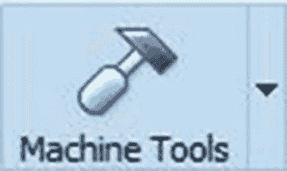
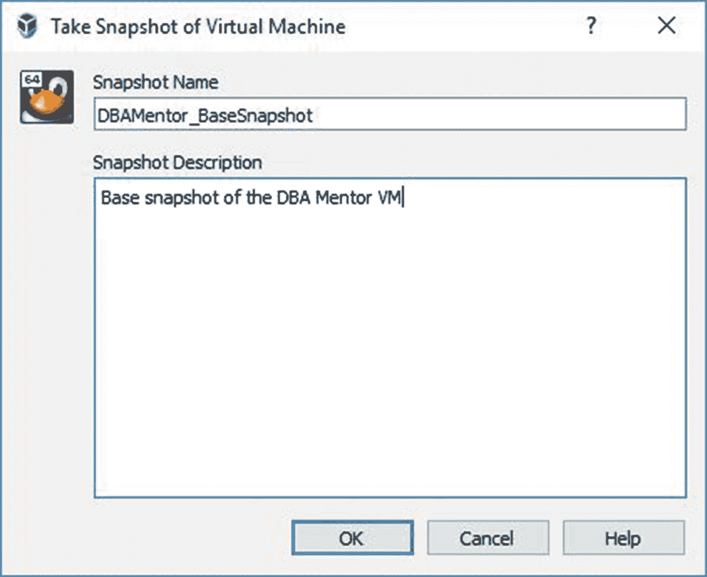
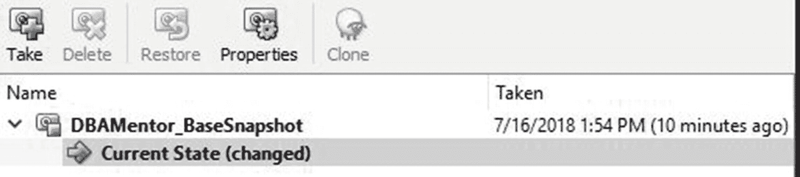
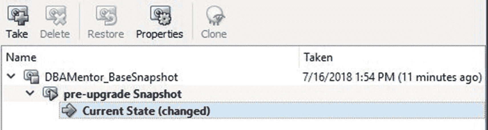
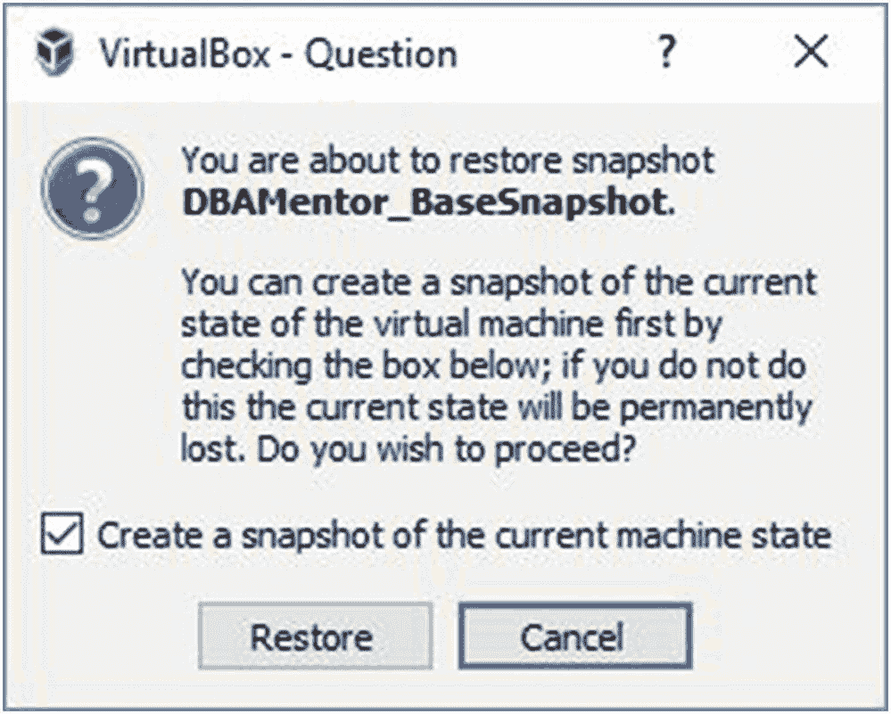
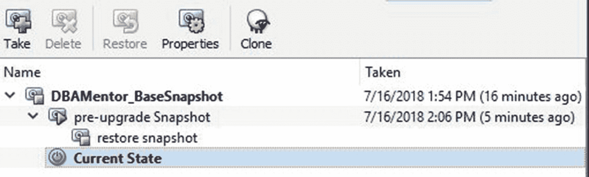

# 10. 测试用例

既然我们已在虚拟机中建立了一个可运行的数据库，是时候开始动手尝试了。前九章让我们走到了这一步，使我们能够触及本书的真正目的——学习更多关于 Oracle 数据库的知识。

本章致力于测试用例和测试平台。在本章中，我们将探讨为什么需要测试平台，以及如何创建测试用例来学习和确保我们知道自己在做什么。正如我们将在本章中看到的，测试用例是学习和探索更多关于 Oracle 数据库知识的绝佳方式。

## 失败

永远不要害怕失败。这是一个古老的建议，适用于任何人，甚至是数据库管理员。这个建议的结尾隐含着一个不那么明显的陈述，那就是从失败中学习。

失败本身毫无意义。你失败了。只有当你审视哪里出了问题，并随后确定一个更好的行动方案时，你才能成功。据说你从失败中学到的东西比从成功中学到的更多，所以不要害怕失败。兴奋起来吧！你即将学到新东西，并促进你的职业发展。你不仅会从失败中学习，还会对你的技能和知识获得信心。在你取得成功之后，你将有信心能够再次成功，并且知道即使再次失败，你也能找到解决办法。

我想写这一章的主要原因是，我在 Oracle 论坛上看到太多类似这样的问题：“我能否在不使用索引的情况下创建主键？”或者“我能否创建一个外键指向某个表，但引用的不是主键？”在我脑海里，一个小声音会立刻回应：“不，你不能，因为你没有尝试过。”这听起来有点粗鲁，所以我从不提供这样的答案，但这是事实。在第 15 章，我们将讨论如何利用 Oracle 论坛来促进你的职业发展。现在，请理解任何以“我能否”开头的问题，都意味着你已经立刻失败了，因为你没有去尝试。

### 提示

永远不要问“我能否 *X*？”先尝试。

从最初的失败中应该学到什么教训？显而易见的是，一个人需要尝试。首先尝试总是必要的。你可能会发现第一次尝试就成功了。如果你问别人“我能否 *X*？”然后去尝试，发现你本来就可以，那么你就浪费了大家的时间去问他们，而本可以自己完成这项工作。

几乎每个人都曾尝试过某事但失败了。他们审视哪里出了问题，然后决定用不同的方法再试一次。他们又失败了。那方法行不通，所以下一步分析情况的方法是判断新方法是否让他们更接近期望的目标。如果他们觉得这一步更接近理想的解决方案，他们就会确定下一步该怎么做。如果这个方法没有朝着需要的方向进展，可能就需要另一种不同的方法。

在你的职业生涯中，你会发现很多次，你的尝试和后续行动正将你引向错误的道路。在失败、学习、再次尝试、再次失败的过程中，你可能经常发现自己并没有离解决方案更近。这是学习过程的一部分。这些尝试中的每一次都会让你成为一个更好的数据库专业人员，但前提是你从失败中学习。

当你回溯试图找出在哪里走错了路时，你可能会回到之前的尝试，以确定从那个点起是否需要不同的路径。我们可能不得不回溯到更早的尝试。每个人都经历过终极失败，即我们尝试的一切都出错，我们必须回到谚语所说的“起点”，从头开始。

## 成功

失败的反面是成功。成功是每个人执行每项任务时所追求的目标。如果你正在冲泡一杯咖啡开启新的一天，你希望有一个成功的结果。如果你正在系鞋带，你希望有一个成功的结果。如果你正在设计一个数据库系统，你同样希望有一个成功的结果。

实现成功的最佳方式是定义成功的标准。你如何知道你的任务何时已成功完成？我知道我制作晨间咖啡的任务是成功的，当我正在饮用这杯饮料，我的大脑告诉我“味道好极了”。系鞋带任务成功的定义是：鞋带系紧后能使鞋子保持在原位，并且这种状态能维持足够长的时间。如果鞋带看似系好了，但走了五步后就松开了，那么系鞋带的任务就不算成功。

那么设计数据库系统呢？你如何定义成功？数据库启动并运行。表中填充了数据。最终用户可以访问数据。这就是成功吗？在某些情况下，这可能是一个成功的结果。然而，如果性能缓慢，且系统无法扩展以满足更大用户群的需求，人们可能会认为该系统是失败的。

你能越准确地定义成功标准，获得成功结果的机会就越大。成功标准需要得到所有利益相关者的签字确认，这样每个人才能对项目需要完成什么才算成功有清晰一致的理解。一位数据库管理员可能会架设一个新的数据库系统，并认为自己完成得很出色，取得了成功。而这位 DBA 的经理检查系统后，可能会说这是一个惨淡的失败。他们对于这个系统有着不同的成功标准。一个人很高兴，而另一个人则完全不满意。为了使系统的实施成为成功，所有利益相关者都需要明白成功意味着什么。清晰的沟通和明确界定的期望是成功的关键。

一旦达到成功标准，项目就完成了。随着时间的推移，人们可能会评估该解决方案，并决定他们想要新的成功标准。于是会启动一个新项目来实现这个新目标。在 IT 行业中，部署一个解决方案后，未来的整体愿景发生变化的情况非常常见。一个原本运行良好并满足其初始成功标准的数据库系统，现在需要被修改以适应组织不断变化的需求。

### 提示

确保你清楚了解你的成功标准。

本章展示的每个测试用例都将有定义好的成功标准。没有这些标准，我们将不知道何时停止处理该测试用例。即使是出于好意的人，也可能在项目生命周期内试图重新定义成功标准。这被称为范围蔓延，并且会显著影响项目在先前定义的约束条件（尤其是项目时间表）内取得成功的能力。

## 测试床

我们在本书中构建的虚拟机是我们的测试床之一。每位 Oracle 数据库管理员都需要一个测试床来练习和弄清楚事物的工作原理。生产环境是糟糕的测试床。我们应该在其他地方进行测试，只有在确切知道我们在做什么之后，才在生产环境中实施变更。

### 提示

除非你确切知道自己在做什么，否则切勿在生产环境中进行任何更改。

请记住，DBA 是数据的守护者。一个愚蠢的 DBA 才会第一次尝试某件事就在生产环境中进行，结果只能眼睁睁看着自己的行为摧毁数据库或使其对最终用户不可用。

大多数 IT 从业者都熟悉开发（dev）、测试和生产平台。应用程序代码首先在开发环境中创建和修改。一旦确定变更有效并能解决任务，这些变更就会被推广到测试环境。质量分析（QA）团队验证变更是否达到预期效果，且未破坏先前存在的功能。测试成功完成后，变更将被推广到生产环境。

数据库管理员需要一个地方来执行他们的工作。一些组织坚持让他们的 DBA 在应用程序开发人员工作的同一环境中工作。问题在于，DBA 可能会破坏东西，结果可能导致数据库无法运行。如果 DBA 破坏了数据库，开发人员和 QA 人员可能将无法进行他们的工作。最终用户不会注意到开发或测试数据库宕机了，但你的开发人员和 QA 人员肯定会注意到。你可以把开发和测试数据库视为开发人员和 QA 的“生产”环境。不要使用开发和测试数据库来尝试你的 DBA 任务，因为你有影响开发和 QA 工作的风险。

### 提示

开发和测试数据库对某些人来说就是生产环境，只不过不是你的应用程序最终用户。

数据库管理员需要自己的工作平台。他们需要属于自己的测试床。当今的虚拟化和云技术使得 DBA 更容易获得自己的测试床。本书已经展示了使用 VirtualBox 创建一个基于 Linux 的 Oracle 测试床是多么容易。DBA 可能拥有多个测试床。例如，DBA 可能有一个如我们在本书中创建的 Oracle 12.2 测试床，然后创建另一个专门用于测试从 12.2 升级到 18c 版本的测试床。升级测试完成后，DBA 可能不再需要那个测试床，此时可以将其销毁。

## 快照

虚拟化技术使得创建系统当前状态的时间点快照变得容易。如果数据库管理员后续操作导致系统出现问题，他们可以回滚到快照状态，就像从未做过任何更改一样，快速恢复运行。一些虚拟机管理程序允许您在系统运行时创建快照，而另一些则要求虚拟机处于关闭状态。

在 Oracle VM VirtualBox Manager 中，单击我们为本书创建的虚拟机。然后，点击如图 10-1 所示的 Machine Tools 图标的下拉箭头，选择 Snapshots。

*图 10-1 VirtualBox Machine Tools 图标*

您应该看到尚未创建任何快照。点击 Take 按钮来创建您的第一个快照。VirtualBox 将弹出一个如图 10-2 所示的对话框，您可以在其中定义快照的名称和描述。

*图 10-2 创建虚拟机快照*

您可以输入任何有助于理解该特定快照的名称或描述。例如，您可能会在数据库升级前创建一个快照，并将其命名为 “升级前快照”。

对运行 Oracle 数据库的虚拟机创建快照时，请确保数据库未运行；否则，将执行数据库的冷备份。这假设数据库的存储是虚拟机的一部分。如果存储位于虚拟机外部，您将需要以不同的方式处理数据库备份，很可能使用第 7 章中讨论的技术。

在 VirtualBox Manager 中，我们可以看到我们的快照。图 10-3 显示了快照，并且系统的当前状态是该快照的子项。

*图 10-3 VirtualBox Manager 中的虚拟机快照*

我们还可以看到快照的创建日期和时间。在图 10-4 中，我们有一个作为现有快照子项的新快照。

*图 10-4 多个快照*

要恢复到之前的快照，请先关闭虚拟机。选择要恢复的快照，然后单击 Restore 按钮。系统会弹出一个对话框要求您确认恢复。您将获得一个选项，可以选择先为当前机器创建一个快照，以便您可以返回到当前状态，如图 10-5 所示。

*图 10-5 恢复快照选项*

恢复操作完成后，我们可以看到已恢复的快照。请注意，在图 10-6 中，当前状态现在是我们所恢复到的快照的子项。

*图 10-6 快照已恢复*

快照是一种很好的方式，可以让您回退到一个已知的、希望是良好的状态。每个快照都会占用一定的磁盘空间。如果您创建了太多快照，可能会开始感受到磁盘空间的压力。删除不再需要的快照是一个好习惯。

