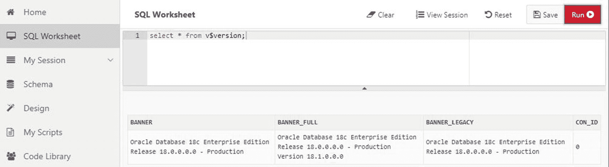
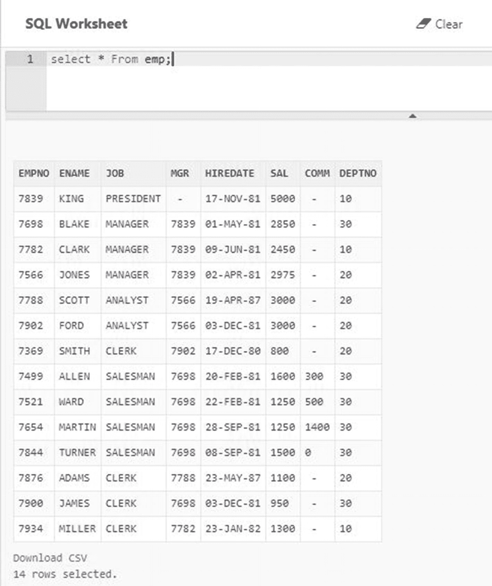

# LiveSQL

Oracle 为我们提供了一个名为 LiveSQL 的测试平台。这个平台是一个基于 Web 的查询工具，与一个真实的 Oracle 数据库交互。任何人都可以通过将 Web 浏览器指向 [`http://livesql.oracle.com`](http://livesql.oracle.com) 来访问 LiveSQL 并开始使用。在右上角，单击 Sign In 链接，使用相同的 Oracle 凭据访问 Oracle Technology Network 或 My Oracle Support。在左侧，单击 SQL Worksheet 项，如图 10-7 所示。



*图 10-7 LiveSQL*

在撰写本章时，Oracle 18c 仅在云端可用，这就是为什么我们没有在测试平台中使用该版本。正如您在图 10-7 中所看到的，LiveSQL 使用的是最新最好的 Oracle 版本。LiveSQL 是使用尚未发布用于本地部署的新版本并开始测试新功能的好方法。在本书编辑期间，LiveSQL 现在使用的是 19c 版本，该版本尚不可用于本地安装。

要输入任何查询，将其键入 SQL Worksheet，然后单击 Run 按钮。您可以输入任何有效的 SQL 语句，甚至可以创建表并用数据填充它们。图 10-8 显示了一个加载了一些测试数据到我的 LiveSQL 模式中的表。



*图 10-8 LiveSQL Emp 表*

您还可以将脚本存储在您的 LiveSQL 帐户中以备将来调用。

LiveSQL 不应用于生产目的，但它是一个极好的测试平台，特别是对于那些无法访问最新最好的 Oracle 版本的用户。当您不想花费时间启动虚拟机、安装 Oracle 和创建数据库时，LiveSQL 也是一个很好的测试平台。话虽如此，LiveSQL 并不是练习数据库恢复或其他需要访问数据库服务器的任务的理想测试平台。


## 测试用例

现在是时候构建一些测试用例了。正如本章前面所述，我们需要能够从失败中学习。测试用例让我们能够将任务付诸实践，分析问题所在，并在此基础上继续前进。

要编写测试用例，我们需要在心中有一个具体的任务。任务应尽可能具体。如果任务过于笼统，我们将无法准确定义成功标准。一个好的测试用例应指定输入、输出以及执行过程中的任何限制条件。例如，一个关于学习骑自行车的测试用例可能会指出，输入是一辆两轮自行车。输出是能够使用脚踏板推动自行车前进 20 英尺而不摔倒。限制条件是不得将脚放在地上以防止摔倒。

让我们回到本章前面提出的一个问题之一：“我能否在不使用索引的情况下创建主键？”成功的标准在于我们知道问题的答案。我们能否拥有一个主键（`PK`）而不使用索引？我们的输入将是我们创建的一张表。输出将是问题的答案。首先，我们将验证模式中对象数为零，然后创建一张表并在表上添加主键约束，如清单 10-1 所示。

```
SQL> select count(*) from user_objects;
COUNT(*)

SQL> create table pk_test_table (id number);
Table created.
SQL> alter table pk_test_table add constraint pk_constraint primary key (id);
Table altered.
SQL> select count(*) from user_objects;
COUNT(*)

SQL> select object_name,object_type from user_objects;
OBJECT_NAME          OBJECT_TYP
-------------------- ----------
PK_CONSTRAINT        INDEX
PK_TEST_TABLE        TABLE
清单 10-1
主键测试用例
```

该测试用例开始时，用户的模式中对象数为零。我们创建了一个非常简单的表，然后添加了一个主键约束。现在用户的模式中有两个对象，即该表和 Oracle 为我们创建的一个索引。该索引的名称与主键约束的名称相同。

请注意，这个表非常简单。测试用例通常可以使用非常简单的对象来证明或反驳当前的任务。

### 提示

保持测试用例尽可能简单，以避免给分析增加额外的复杂性。

到目前为止，我们还没有回答是否可以在没有索引的情况下拥有主键约束的问题。当我们创建主键约束时，Oracle 自动为我们创建了索引。要回答这个问题，我们必须确定是否可以删除该索引，如清单 10-2 所示。

```
SQL> drop index pk_constraint;
drop index pk_constraint
*
ERROR at line 1:
ORA-02429: cannot drop index used for enforcement of unique/primary key
清单 10-2
删除主键索引
```

当我们尝试删除索引时，Oracle 抛出了 `ORA-02429` 错误，操作失败。我们现在得到了问题的答案。我们无法拥有一个没有关联索引的主键约束。既然我们得到了问题的答案，该任务的成功标准现已完成。我们可能不喜欢这个答案，但我们终究得到了答案。

现在，让我们来解决本章前面提出的另一个问题：“我能否创建一个指向表的外键，但引用的不是主键？”对于我们的输入，我们需要一张包含两列的表，一列作为主键，另一列不属于主键约束的一部分。我们需要另一张表，尝试向父表的非 `PK` 列创建外键（`FK`）约束。我们的成功标准在于我们知道问题的答案。

我们还将删除在上一个测试用例中使用的表。清理用于测试用例的对象是个好习惯。在清单 10-3 中，旧的测试表被删除。创建了一个带有主键约束的父表。创建了一个子表。

```
SQL> drop table pk_test_table;
Table dropped.
SQL> create table parent_tbl (pk_id number, other_id number);
Table created.
SQL> alter table parent_tbl add constraint parent_tbl_pk primary key (pk_id);
Table altered.
SQL> create table child_tbl (id number);
Table created.
SQL> alter table child_tbl add constraint parent_child_fk
2  foreign key (id) references parent_tbl(pk_id);
Table altered.
SQL> alter table child_tbl drop constraint parent_child_fk;
Table altered.
清单 10-3
外键测试用例设置
```

在上面的代码中，我们创建了一张新表作为父表，并在该表上定义了一个主键约束。我们创建了一个子表。最后，我们使用 `PK` 列从子表到父表创建了一个外键约束，只是为了证明可以创建这样的约束。然而，由于这个约束并非用来回答我们的问题，它被删除了。在清单 10-4 中，让我们尝试向父表的非 `PK` 列创建外键约束。

```
SQL> alter table child_tbl add constraint parent_child_fk
2  foreign key (id) references parent_tbl(other_id);
foreign key (id) references parent_tbl(other_id)
*
ERROR at line 2:
ORA-02270: no matching unique or primary key for this column-list
清单 10-4
添加外键约束失败
```

我们又收到了一个 Oracle 错误。`ORA-02270` 表示 Oracle 无法为父表中的列找到唯一的或主键。请记住，失败意味着我们这里有学习的机会。错误信息表明我们需要引用父表中的主键或唯一约束。一张表只能有一个主键约束，因此让我们向父表的另一列添加一个唯一约束，然后再次尝试添加外键约束，如清单 10-5 所示。

```
SQL> alter table parent_tbl add constraint parent_unique unique (other_id);
Table altered.
SQL> alter table child_tbl add constraint parent_child_fk
2  foreign key (id) references parent_tbl(other_id);
Table altered.
清单 10-5
成功添加外键约束
```

这次我们成功了。我们回答了最初的问题。我们可以向一张表添加外键约束，但引用的可以是父表主键以外的东西。我们还从失败中学到了另一点：外键约束可以引用父表的主键或其他唯一约束。

在清单 10-5 之前，我提到一张表只能有一个主键约束。这是真的吗？对你来说，创建一个带有主键约束的测试表应该非常容易。然后尝试向该表添加另一个 `PK` 约束。它是成功了还是产生了错误？使用测试用例来挑战我们所有人认为理所当然的事情。仅仅因为我这么说，并不代表一张表只能有一个主键约束。请亲自测试一下。

让我们清理这个简单的测试用例，删除我们创建的两张表，从清单 10-6 中的父表开始。

```
SQL> drop table parent_tbl;
drop table parent_tbl
*
ERROR at line 1:
ORA-02449: unique/primary keys in table referenced by foreign keys
清单 10-6
删除父表
```

我们遇到了另一个错误。这个错误告诉我们，不能删除父表，因为有另一张表引用了它。让我们先删除子表，然后再删除父表，如清单 10-7 所示。

```
SQL> drop table child_tbl;
Table dropped.
SQL> drop table parent_tbl;
Table dropped.
清单 10-7
按正确顺序删除表
```

有时，在处理测试用例时，我们会学到一些我们本不打算探索的东西。在我们的案例中，我们了解到需要先删除子表，然后才能删除父表。


### 小贴士

保持开放心态。测试案例可能会教你意想不到的知识。

测试案例的作用远不止回答问题。它们让你得以探索。测试案例是自我学习 Oracle 数据库知识的绝佳方式。这些学习往往发生在你进行“假设”游戏时。例如，你可能在测试环境中摆弄 Oracle 分区，并创建了一个如代码清单 10-8 所示的分区表。

```
SQL> create table product_sales (
2  transaction_id number,
3  product_id number,
4  qty_sold number,
5  transaction_date date)
6  partition by range (transaction_date)
7  ( partition product_sales_2018q1
8      values less than (to_date('04-01-2018','MM-DD-YYYY')) tablespace users,
9   partition product_sales_2018q2
10      values less than (to_date('07-01-2018','MM-DD-YYYY')) tablespace users,
11   partition product_sales_2018q3
12      values less than (to_date('10-01-2018','MM-DD-YYYY')) tablespace users,
13   partition product_sales_2018q4
14      values less than (to_date('01-01-2019','MM-DD-YYYY')) tablespace users
15  );
Table created.
Listing 10-8
Partitioned Table Test Case
```

## 进行“假设”游戏

在摆弄分区表时，你很可能会尝试添加和删除分区以及创建分区索引。当从表中删除一个分区时，你可能会问自己：“如果我尝试从回收站中恢复被删除的分区会怎样？” 这个问题可能最初并不在你的测试案例中，但通过进行“假设”游戏，你一定能学到更多。在代码清单 10-9 中，我们正好探讨了这个问题。

```
SQL> alter table product_sales drop partition product_sales_2018q1;
Table altered.
SQL> select object_name,original_name from recyclebin;
no rows selected
Listing 10-9
Recovering a Dropped Partition
```

在上面的代码中，分区被删除了。查询回收站，我们发现它是空的。这回答了一个问题。你无法从回收站中恢复被删除的分区。如果我们删除整个表会怎样？该表由多个分区组成，当我们删除一个分区时，它并不在回收站中。让我们在代码清单 10-10 中继续探索并找出答案。

```
SQL> drop table product_sales;
Table dropped.
SQL>  select object_name,original_name,type from recyclebin;
OBJECT_NAME                    ORIGINAL_NAME               TYPE
------------------------------ --------------------------- ----------------
BIN$cSQeOfrrEVLgVQAAAAAAAQ==$0 PRODUCT_SALES               Table Partition
BIN$cSQeOfrrEVLgVQAAAAAAAQ==$0 PRODUCT_SALES               Table Partition
BIN$cSQeOfrrEVLgVQAAAAAAAQ==$0 PRODUCT_SALES               Table Partition
BIN$cSQeOfrrEVLgVQAAAAAAAQ==$0 PRODUCT_SALES               TABLE
SQL>  flashback table product_sales to before drop;
Flashback complete.
Listing 10-10
Recovering a Dropped Partitioned Table
```

我们可以看到该表及其三个分区都在回收站中，并且我们可以使用`FLASHBACK`命令来恢复该表。从这个测试案例中学到的教训是：你无法恢复被删除的分区本身，但可以恢复被删除的整个分区表。仅仅在我们的测试环境中进行这些“假设”游戏，我们就能学到很多关于 Oracle 分区表如何工作的知识。

永远不要害怕创建你自己的测试案例来证明或证伪你对 Oracle 数据库引擎的理论。你创建的测试案例越多，你就会越擅长创建它们。测试案例是 Oracle 数据库管理员的重要学习工具。

在第 16 章，我们将讨论通过撰写博客来助力你的数据库职业生涯。测试案例是极好的博客素材。许多 Oracle 博主为了阐明一个观点，会生成一个简单的测试案例来展示他们想传达的内容。在博客中使用测试案例的另一个好方法是向他人展示你所学到的东西。

## 示例模式

创建表并填充数据可能需要一些努力，这是人们不为自己构建测试案例的一个借口。Oracle 包含了一些供你使用的示例模式。在我们深入探讨之前，可能需要了解一点历史。

在 Oracle 数据库的早期，开发数据库引擎的软件开发人员需要一种方法来测试某些概念。他们和你一样需要测试数据！其中一位早期员工是一位名叫 Bruce Scott 的先生。他使用自己的姓氏`SCOTT`创建了一个模式。他需要一些表，于是为一个虚构的公司创建了用于员工的`EMP`表和用于部门的`DEPT`表。凭借这两张表，他会编写简单的 SQL 语句来展示 Oracle 的工作原理。这效果足够好，以至于 Oracle 的发行版开始包含一个创建`SCOTT`账户的脚本。该脚本将密码设置为`TIGER`，这是他女儿猫的名字。如今，你仍然能看到人们提及`scott/tiger`和`scott.emp`，指的就是这个账户及其一张表。

从 Oracle9*i*开始，Oracle 开始提供其他示例模式：用于虚构人力资源系统的`HR`和用于虚构订单录入模式的`OE`。`HR`模式在很大程度上取代了`SCOTT/TIGER`。如今，你可以在 Oracle 开发者网络上找到这些示例模式，位置与你下载 Oracle 数据库软件的地方相同。向下滚动数据库软件的文件列表，直到找到`Examples`文件。你可以在数据库服务器上解压此文件，并按照说明创建供你使用的示例模式。

如果示例模式不能满足你的需求，另一位 Oracle 员工 Dominic Giles 创建了一个数据生成器实用程序。如果你感兴趣，可以在[`www.dominicgiles.com/datagenerator.html`](http://www.dominicgiles.com/datagenerator.html)找到它。虽然这个产品是由 Oracle 员工创建的，但它并不是一个成熟的 Oracle 公司产品。数据生成器是为测试案例创建大量半随机数据的好方法。

## 继续前进

请记住，本书的目标不是给你所有问题的答案。本书旨在教你如何自己找到问题的答案。在前面的章节中，我们接触了 Oracle 文档集中的几本书。希望你已经开始接触到一些好的文档。在本章中，我们介绍了另一个强大的工具集，以帮助你学习更多关于 Oracle 数据库的知识——测试环境和测试案例。

永远不要害怕尝试。在尝试中，你会失败，但这没关系。正是通过检查失败、找出问题所在以及如何纠正，我们才学到了如此多的东西。从成功中我们学不到什么。问问你钦佩的任何数据库管理员他们失败的频率，他们肯定会回答“一直如此”。

在下一章中，我们将转向你将在管理 Oracle 数据库时使用的一些工具。我们已经在使用其中一个工具`SQL*Plus`，我们也将看到更多这样的工具。

