# 11. 工具

在本章中，我们将探讨可供我们使用的、有助于管理 Oracle 数据库的几种工具。我们已经在使用其中一种工具，`SQL*Plus`。我们将更全面地探索该工具以及其他一些工具。

Oracle 数据库管理员需要知道为工作选择哪些工具，这与木匠或机械师没什么不同。合适的工具用于合适的工作可以简化你的生活。就像你会用锤子钉钉子一样，你会使用数据库配置助手来创建数据库。

我可以为这里讨论的每种工具专门写一章。为了简洁起见，本章将提供这些工具的概述，并讨论你将用它们来做什么。与 Oracle 世界中的任何事物一样，这些工具还有很多可以留待日后学习。


## 连接到我们的数据库

在本书前面的章节中，我们创建了一台虚拟机并为测试环境构建了一个 Oracle 数据库。虽然我们始终可以使用虚拟机内的终端窗口并像之前那样使用`SQL*Plus`，但如果能从工作站连接到该虚拟机内的 Oracle 实例将会方便得多。

### 配置网络连接

回顾一下，在第 3 章创建虚拟机时，我们定义了两个网络适配器。其中一个是 NAT 适配器，用于让虚拟机访问外部世界、下载更新等。另一个网络适配器我们定义为“仅主机”（host-only）适配器，我们将通过它进行连接。在虚拟机的终端窗口中，输入`ip addr`命令；该命令将显示每个网络设备的 IP 地址。在我的虚拟机上，IP 地址如清单 11-1 所示。你的虚拟机地址可能略有不同，请记下你的具体设置。

```
[oracle@oracle122 ~]$ ip addr
1: lo:  mtu 65536 qdisc noqueue state UNKNOWN
link/loopback 00:00:00:00:00:00 brd 00:00:00:00:00:00
inet 127.0.0.1/8 scope host lo
valid_lft forever preferred_lft forever
inet6 ::1/128 scope host
valid_lft forever preferred_lft forever
2: enp0s3:  mtu 1500 qdisc pfifo_fast state UP qlen 1000
link/ether 08:00:27:6f:30:32 brd ff:ff:ff:ff:ff:ff
inet 10.0.2.15/24 brd 10.0.2.255 scope global dynamic enp0s3
valid_lft 75838sec preferred_lft 75838sec
inet6 fe80::d629:df95:c55b:252c/64 scope link
valid_lft forever preferred_lft forever
3: enp0s8:  mtu 1500 qdisc pfifo_fast state UP qlen 1000
link/ether 08:00:27:d6:0e:5c brd ff:ff:ff:ff:ff:ff
inet 192.168.56.101/24 brd 192.168.56.255 scope global dynamic enp0s8
valid_lft 712sec preferred_lft 712sec
inet6 fe80::777e:9533:78fd:6446/64 scope link
valid_lft forever preferred_lft forever
清单 11-1
虚拟机 IP 地址
```

我们需要寻找两个 IP 地址，一个以`10.0`开头，另一个以`192.168`开头。前者用于我们的 NAT 适配器，后者用于我们的仅主机适配器，这也是本章我们最关心的那个。在我的输出中，IP 地址是`192.168.56.101`，但你的地址可能略有不同。我的虚拟机运行在 Windows 工作站上，因此我将启动一个命令窗口（`CMD`）。在 Mac 上，你会启动一个终端窗口。在排除网络连接故障时，人们通常首先会问：“你能 ping 通它吗？”清单 11-2 给出了我的虚拟机的答案。

```
C:\Users\bpeasland\Desktop>ping 192.168.56.101 -n 3
Pinging 192.168.56.101 with 32 bytes of data:
Reply from 192.168.56.101: bytes=32 time<1ms TTL=64
Reply from 192.168.56.101: bytes=32 time<1ms TTL=64
Reply from 192.168.56.101: bytes=32 time<1ms TTL=64
Ping statistics for 192.168.56.101:
Packets: Sent = 3, Received = 3, Lost = 0 (0% loss),
Approximate round trip times in milli-seconds:
Minimum = 0ms, Maximum = 0ms, Average = 0ms
清单 11-2
Ping 虚拟机
```

从我的工作站上，可以成功 ping 通虚拟机。如果你遇到问题，请再次检查你的 IP 地址。可能有多个以`192.168`开头的地址，因此你可能需要逐一尝试。同时检查虚拟机的设置，确保其中一个网络适配器是作为仅主机适配器创建的。

### 设置静态 IP

虚拟机当前配置的问题在于，每次虚拟机启动时 IP 地址都可能改变。为了让配置更固定，在 Linux 虚拟机中，转到 应用程序 ➤ 系统工具 ➤ 设置。然后，点击网络图标。你应该会看到一个类似于图 11-1 的窗口。

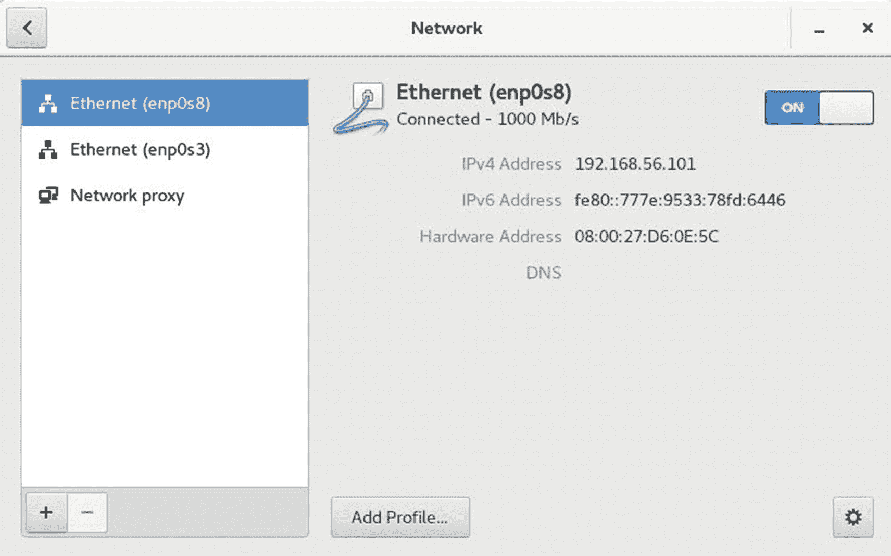

图 11-1: 网络设置

选择适配器（`enp0s8`）并确保 IPv4 地址以`192.168`开头。如果地址不正确，你可能需要选择另一个以太网适配器。在右下角，点击齿轮图标以更改此适配器的设置。将出现一个类似于图 11-2 的对话框。

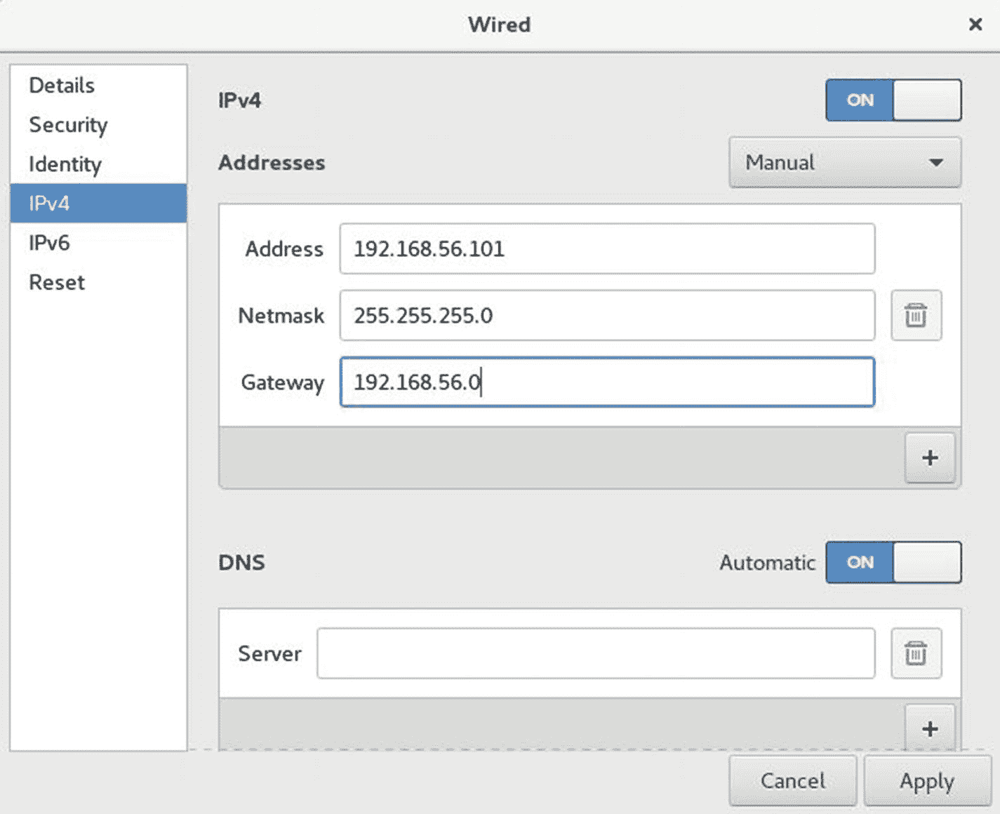

图 11-2: 手动设置 IP 地址

在“地址”下拉菜单中，选择“手动”。你现在将能够输入你的 IP 地址。我们正在使用自动生成的密码并将其永久设置为此虚拟机的地址，这样在虚拟机重启时它就不会改变。如图 11-2 所示填写“子网掩码”和“网关”字段，然后点击“应用”按钮。重启虚拟机以确保设置生效。你现在可以始终使用此 IP 地址从你的工作站或笔记本电脑连接到此虚拟机。唯一可能的影响是，如果在同一系统上运行的另一台虚拟机使用了相同的 IP 地址。

### 修改 Hosts 文件

现在 IP 地址是静态定义的，只要虚拟机处于启动并运行状态，我们随时都可以连接到它。然而，使用 IP 地址操作起来很麻烦，而且我们不想麻烦网络团队在 DNS 中创建别名。为了方便自己，我们将修改本地的“hosts”文件。在 Windows 上，使用资源管理器导航到`C:\Windows\System32\drivers\etc`目录，并使用任何文本编辑器打开名为`hosts`的文件。在 Mac 平台上，`hosts`文件位于`/etc`目录。在文件末尾附近，添加一行类似于清单 11-3 中最后一条目的内容。

```
# localhost name resolution is handled within DNS itself.
#      127.0.0.1       localhost
#      ::1             localhost
192.168.56.101      dbamentor
清单 11-3
Hosts 文件条目
```

输出的最后一行是我对`hosts`文件的新条目。它包含我的 IP 地址和我希望用来指代这台机器的任何别名。我使用的别名是`dbamentor`。保存文件，然后使用该别名进行 ping 测试，如清单 11-4 所示。

```
C:\Users\bpeasland\Desktop>ping dbamentor -n 3
Pinging dbamentor [192.168.56.101] with 32 bytes of data:
Reply from 192.168.56.101: bytes=32 time<1ms TTL=64
Reply from 192.168.56.101: bytes=32 time<1ms TTL=64
Reply from 192.168.56.101: bytes=32 time<1ms TTL=64
Ping statistics for 192.168.56.101:
Packets: Sent = 3, Received = 3, Lost = 0 (0% loss),
Approximate round trip times in milli-seconds:
Minimum = 0ms, Maximum = 0ms, Average = 0ms
清单 11-4
使用 Hosts 别名进行 Ping 测试
```

我现在可以在任何想要连接到虚拟机时使用这个别名。这比记住一个 IP 地址要容易得多。

### 建立 SSH 连接

如果我在 Mac 平台上运行虚拟机，那么我可以使用终端窗口建立到该机器的安全外壳（SSH）会话。在 Windows 上，我需要一个 SSH 客户端。我经常使用`PuTTY`或`MobaXterm`。这两个都是免费的实用程序，通过简单的 Google 搜索就能找到。无论你使用哪一个，看看是否能建立到该机器的 SSH 会话。清单 11-5 展示了我如何使用`MobaXterm`进行连接。

```
[bpeasland.winworkstation] ➤ ssh oracle@dbamentor
Warning: Permanently added 'dbamentor' (RSA) to the list of known hosts.
oracle@dbamentor's password:
Last login: Tue Jul 24 14:35:22 2018 from 192.168.56.1
/usr/bin/xauth:  file /home/oracle/.Xauthority does not exist
[oracle@dbamentor ~]$ hostname
dbamentor.localdomain
清单 11-5
从 MobaXterm 进行 SSH 连接
```

清单末尾的`hostname`命令向我们表明，我们确实连接到了我们的虚拟机。

既然我们已经从主机操作系统建立了连接，我们就可以使用主机上安装的任何实用程序来连接到虚拟机及其内部运行的数据库。


## SQL*Plus

本书中的许多示例已经使用了 **SQL*Plus**，这是一个命令行工具，用于启动和停止 Oracle 实例，以及向数据库发出 SQL 语句。正如本章将看到的，虽然还有其他查询工具，但 **SQL*Plus** 总是触手可及。当我们安装数据库软件时，**SQL*Plus** 就已经安装好了。至少，我们可以通过 SSH 连接到数据库服务器，然后使用 **SQL*Plus**。由于 **SQL*Plus** 是一个命令行工具，即使是基于文本的 SSH 会话也足以使用它。

### 提示

学会使用 **SQL*Plus**。它始终对你可用。

如果你在自己的工作站上安装了 Oracle Client 软件，**SQL*Plus** 也包含在其中。你需要设置一个 TNS 别名，如第[9]章所示，以便连接到任何其他机器上的数据库。

**SQL*Plus** 是 Oracle 判断“是否有效”的标准。任何查询工具都只是一个向数据库提交 SQL 语句并显示结果的应用程序。已经有很多次，向 Oracle 支持团队提交的服务请求都显示，在其他某个查询工具中，Oracle 数据库似乎没有返回正确的结果。提交服务请求的人会向 Oracle 提供 SQL 语句和一些示例数据，并展示从数据库返回的结果集看起来不正确。如果你遇到这种情况，Oracle 总是会要求你在 **SQL*Plus** 中重现该问题。如果它在 **SQL*Plus** 中能正常工作，那么问题就出在查询工具上，而不是数据库引擎。如果 SQL 语句在 **SQL*Plus** 中产生了错误结果，那么 Oracle 支持团队就需要处理该问题并提供解决方案。

**SQL*Plus** 有许多人们可能没有意识到的功能。你可以将 SQL 语句保存到文本文件中。你可以运行包含 SQL 语句的文件，以脚本方式执行多个操作。**SQL*Plus** 甚至可以生成格式化的报告。

**SQL*Plus** 中一个许多人没有意识到的隐藏功能是编辑你的命令的能力。**SQL*Plus** 会将当前命令保存在缓冲区中。考虑清单 [11-6] 中的例子，其中数据库管理员试图创建一个表空间，但发生了错误。很明显，DBA 在第 3 行和第 4 行两次指定了表空间的大小。

```
SQL> create tablespace apps_ts
2  datafile '/u01/app/oracle/oradata/orcl/apps_ts01.dbf'
3  size 5g
4  size 10g
5  extent management local auto;
size 10g
*
ERROR at line 4:
ORA-02180: invalid option for CREATE TABLESPACE
清单 11-6
不正确的 SQL*Plus 命令
```

DBA 想从这个命令中删除第 4 行，而不想重新输入整个 SQL 语句。DBA 可以输入小写字母 `l` 来列出缓冲区的内容，如清单 [11-7] 所示。

```
SQL> l
1  create tablespace apps_ts
2  datafile '/u01/app/oracle/oradata/orcl/apps_ts01.dbf'
3  size 5g
4  size 10g
5* extent management local auto
清单 11-7
列出 SQL*Plus 缓冲区
```

注意最后一行有一个星号。带星号的行是当前行。如果我们想删除第 4 行，我们需要使其成为当前行，然后发出命令来删除该行。我们只需输入感兴趣的行号，按回车键，然后输入 `del` 来删除当前行。一旦该行被删除，我们可以输入前斜杠 `/` 来执行缓冲区的内容，如清单 [11-8] 所示。

```
SQL> 4
4* size 10g
SQL> del
SQL> l
1  create tablespace apps_ts
2  datafile '/u01/app/oracle/oradata/orcl/apps_ts01.dbf'
3  size 5g
4* extent management local auto
SQL> /
extent management local auto
*
ERROR at line 4:
ORA-02180: invalid option for CREATE TABLESPACE
清单 11-8
在 SQL*Plus 缓冲区中删除一行
```

当列出缓冲区内容时，我们可以看到包含 `size 10g` 的行已被删除。再次执行语句时，又出现了另一个错误。问题在于 Oracle 不喜欢关键字 `auto`。它应该是 `autoallocate`。从星号我们可以看到，当前行（带错误的那一行）是我们正在编辑的行。我们可以更改当前行中的单词并重新执行命令，如清单 [11-9] 所示。

```
SQL> c /auto/autoallocate
4* extent management local autoallocate
SQL> /
Tablespace created.
清单 11-9
在 SQL*Plus 缓冲区中更改文本
```

`c` 命令将更改或在当前行执行文本替换。第一个字符是你的分隔符。在清单 [11-9] 中，分隔符是前斜杠 `/`，但你可以选择任何字符，特别是如果你要更改的文本包含前斜杠时。分隔符之后是要更改的文本，然后是分隔符，接着是更正后的文本。一旦 `auto` 被更改为 `autoallocate`，下一个前斜杠 `/` 就执行缓冲区的内容，表空间便成功创建。

**SQL*Plus** 中的这个缓冲区对于需要长期监控情况的 DBA 非常有帮助。输入命令并查看输出。然后，过一段时间后，只需输入前斜杠 `/` 就可以再次执行缓冲区。在清单 [11-10] 的例子中，DBA 需要知道实例中当前会话的数量并观察其随时间的变化。DBA 不必重复输入命令，只需在下次执行时按下前斜杠 `/` 即可。

```
SQL> select count(*) as num_sessions from v$session where username is not null;
NUM_SESSIONS
        103
SQL> /
NUM_SESSIONS
        105
SQL> /
NUM_SESSIONS
        104
清单 11-10
在 SQL*Plus 中多次执行缓冲区
```

如果 DBA 将来需要运行此语句，可能希望将其保存到一个脚本中。`save` 命令会将缓冲区的内容写入文件。通常使用 `.sql` 作为 SQL 脚本的文件扩展名。如果未指定路径，文件将保存在当前目录中。`@` 符号用于告诉 **SQL*Plus** 将该文件的内容加载到缓冲区并执行它。在清单 [11-11] 中，我们可以看到缓冲区的内容。我们将该 SQL 语句保存到文件中，然后将该文件作为脚本执行。

```
SQL> l
1* select count(*) as num_sessions from v$session where username is not null
SQL> save num_sessions.sql
Created file num_sessions.sql
SQL> @num_sessions.sql
NUM_SESSIONS
        104
清单 11-11
在 SQL*Plus 中保存缓冲区
```

**SQL*Plus** 是 Oracle DBA 的宝贵工具。它始终对你可用，而且一旦你学会了利用其缓冲区的威力，正如我们在前面的例子中看到的，你会发现它远比仅仅与数据库引擎进行命令行交互要好用得多。


## SQL 开发人员

虽然 SQL*Plus 是一款出色的命令行工具，但我们通常生活在图形用户界面（GUI）世界中。可以将 SQL Developer 视为 GUI 形式的 SQL*Plus。Oracle 的 SQL Developer 产品团队的主要目标是让你的工作更轻松。这款工具对于 Oracle 应用程序开发人员和数据库管理员来说都非常适用。最棒的部分是，SQL Developer 是免费使用的。

当你在服务器上安装 Oracle 数据库软件时，它会附带一个 SQL Developer 副本。但这个副本几乎可以肯定是过时的，因此你应该下载最新最好的版本。将你的网页浏览器指向 [`http://otn.oracle.com`](http://otn.oracle.com)，然后像你下载 Oracle 数据库软件时那样，点击“必备链接”部分中的“软件下载”。在下一个屏幕中，SQL Developer 列在“开发人员工具”下，尽管它严格来说并不是一个软件开发产品。点击 SQL Developer，你将被带到下载屏幕。你需要点击单选按钮以接受许可协议。如果要求进行身份验证，请使用与你下载 RDBMS 软件时相同的 Oracle 单点登录凭据。如果我是在为 Windows 下载，我总是会选择包含 Java 开发工具包（JDK）的版本。对于其他平台，你必须自行提供 JDK。

下载文件是一个 zip 压缩包。无需安装。只需将文件解压缩到某个目录即可。在软件文件夹中，你会看到 `sqldeveloper` 可执行文件。运行该文件，SQL Developer 就会启动。在本章前面，我们确保了我们有能力将工作站上的工具连接到我们虚拟机测试平台中的数据库。在本节中，我们将使用 SQL Developer 来完成这一操作。

如果你是第一次启动 SQL Developer，你应该会看到一个起始页。此页面包含一个“概述视频”链接以及许多教程和演示的链接。起始页只列出了三个教程和演示，但有一个链接指向更多在线内容。我强烈建议你花时间学习这些内容，因为它们能比这本书更详尽地解释 SQL Developer 的功能。起始页还包含一个指向 SQL Developer 文档的链接。

在你能够与数据库交互之前，你需要创建一个连接。在“连接”选项卡中（如图 11-3 所示），你可以看到我有三个文件夹来更好地组织我的连接。

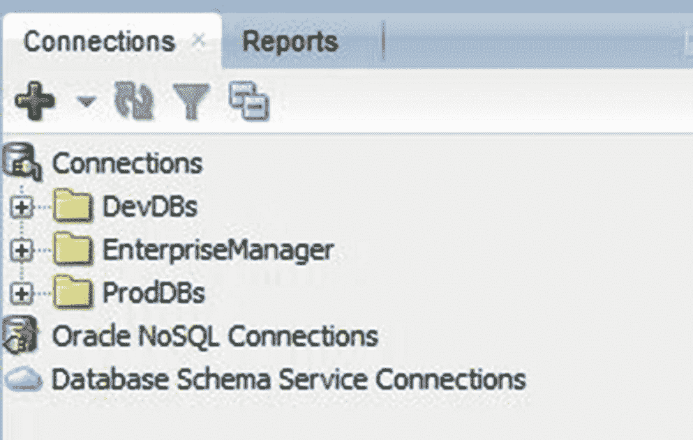

图 11-3 SQL Developer 中的连接

点击绿色的加号图标以创建新的数据库连接。将弹出一个屏幕，你需要在其中填写所有相关详细信息，如图 11-4 所示。

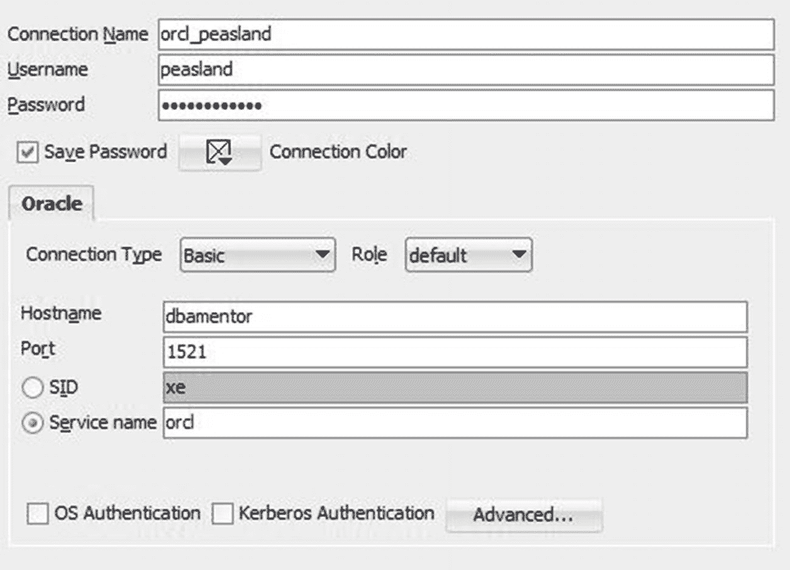

图 11-4 SQL Developer 连接详细信息

连接需要一个名称。我通常使用 *数据库名 _ 用户名* 的形式，但你可以自由使用任何对你有用的命名约定。输入用户名和密码。如果你不想每次都被提示输入密码，请勾选“保存密码”框，但前提是这台机器没有与他人共享。你可以使用“连接颜色”设置来直观地定义你的连接窗口。如果这是到生产数据库的连接，我通常会选择红色。当我打开到生产数据库的连接时，SQL Developer 会在窗口周围画一条红线。在“连接”选项卡中的名称也会显示为红色。这种视觉指示器有助于提醒我要小心，因为我的操作是在生产环境中，而不是在开发或测试环境中。

在图 11-4 的示例中，我选择了“基本”连接类型。如果你安装了 Oracle Client，并且定义了一个 TNS 别名，你可以将“连接类型”更改为“TNS”，然后选择该别名。由于我的连接是“基本”类型，我必须提供主机名、端口和服务名。输入所有信息后，点击“测试”按钮。如果出现错误，可能是由于虚拟机上运行的防火墙导致的。在我们测试平台虚拟机中，以 root 用户身份，在终端窗口中执行清单 11-12 中的以下命令以禁用防火墙。

```
systemctl stop firewalld
systemctl disable firewalld
```
清单 11-12 禁用 Linux 防火墙

连接成功测试后，点击“保存”按钮。双击连接将打开它并调出一个工作表。我们可以输入任何 SQL 语句，然后点击绿色的播放按钮（或按 `Ctrl-Enter`）来运行该语句，示例如图 11-5 所示。

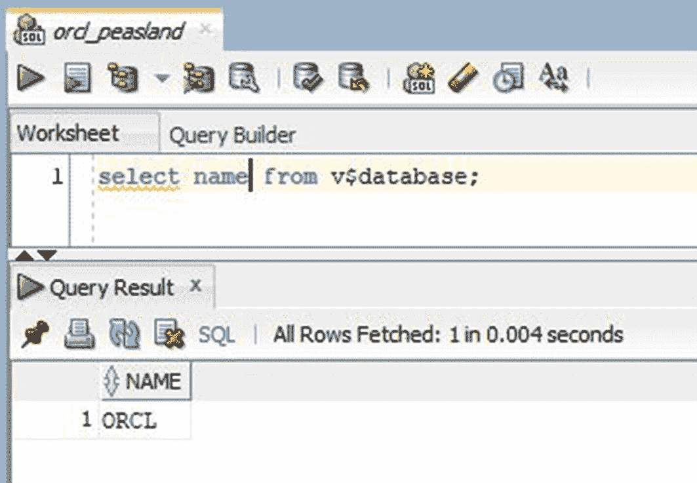

图 11-5 在 SQL Developer 中运行 SQL 语句

可以通过点击“运行脚本”按钮（或按 `F5`）来连续执行多个语句。“运行脚本”按钮位于绿色播放按钮的旁边。它看起来像一页文本，左下角有一个绿色的播放箭头。

在“查询结果”窗口中，可以按任何列对结果进行排序。如果你想保存结果，以免被下一次语句执行覆盖，请点击红色的图钉图标。下一次语句执行将在不同的结果选项卡中显示。

SQL Developer 的 Oracle 产品经理是 Jeff Smith。他在 [`www.thatjeffsmith.com`](http://www.thatjeffsmith.com) 上维护着一个博客，我强烈建议你将此页面加入书签。新版本会在此博客上发布。每次有新版本发布时，你都可以找到讨论新功能的博客文章，甚至可以看到它们的实际操作演示。

我发现我每天越来越多地使用 SQL Developer。这款产品是 Oracle 开发出的最实用的工具之一。像任何有价值的工具一样，它只是让我的工作更轻松。花些时间来学习如何利用这个工具吧。


## Oracle Enterprise Manager

你的 Oracle 数据库许可证中包含了 Oracle Enterprise Manager (EM) 产品。当 Enterprise Manager 首次推出时，它是一个 DBA 在其工作站上运行的 Java 应用程序。他们可以将其连接到 Oracle 数据库，并通过点击操作完成许多管理任务。与任何产品一样，EM 随时间不断成熟。如今的 EM 产品已是基于 Web 的，运行在数据库服务器或其他中央机器上。

Enterprise Manager 有两种形式：Enterprise Manager Database Express 或 Enterprise Manager Cloud Control。当你创建 Oracle 数据库时，可以创建 `EM DB Express`，并且它只能用于管理该数据库。如果你需要管理第二个数据库，你可以设置第二个 `EM DB Express` 实例。显而易见，如果你有超过几个 Oracle 数据库需要管理，你的 `EM DB Express` 实例数量将会开始增长。每个实例都有不同的 URL，因此数据库越多，意味着需要收藏的 `EM DB Express` URL 就越多。`EM Cloud Control (EM CC)` 是一个用于管理任意数量数据库的集中式管理平台。如果你的 Oracle 基础架构开始增长，请使用 `EM CC`。在本节后续部分中，当我们谈论 `EM DB Express` 或 `EM CC` 时，我们将仅称为 Enterprise Manager 或 EM。

Enterprise Manager 允许你管理你的 Oracle 数据库。例如，你可以查看有关表空间的详细信息，并创建新的表空间、删除旧的表空间或添加数据文件。我们可以在图 11-6 中的 EM 里看到多个表空间。

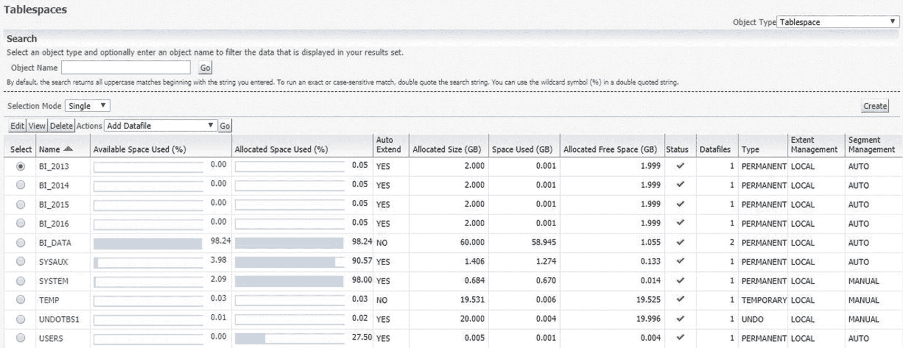

图 11-6
EM 表空间

Enterprise Manager 可以监控你的数据库，如果发现异常，它可以呼叫或发送电子邮件给数据库管理员，告知他们有一个需要关注的问题。如果需要，DBA 可以创建一个修复作业，这样下次 EM 发现该问题时，就能自动采取纠正措施。

Enterprise Manager 的一个缺点是它太容易导致违反许可协议。例如，如果你正在使用 EM 管理一个数据库，并进入性能主页，你可以获得一个显示 Oracle 实例当前性能的精美图表。示例如图 11-7 所示。

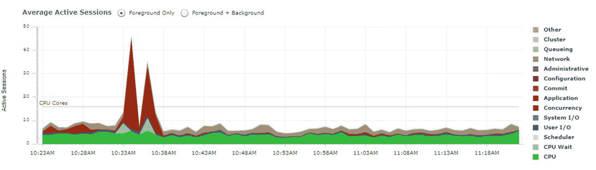

图 11-7
EM 性能页面

在此屏幕上没有任何地方告诉你，要访问此页面，你需要获得可选组件 Diagnostics Pack 的许可。如果你在性能主页，可以转到 `Setup ➤ Management Packs ➤ Packs for this Page` 来确定使用该页面需要许可哪些可选组件包。你可以在图 11-8 中看到，此页面需要获得 Diagnostics Pack 的许可。

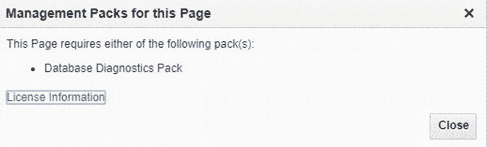

图 11-8
此页面的管理组件包屏幕

然而，如果你未获得此可选产品的许可，那么到现在已经为时已晚。一旦你访问了该页面，Oracle 就会向数据库表中写入一条记录，表明你已使用了此可选产品。如果你受到 Oracle 审计，他们会发现你的组织使用了未付费的产品。

为了防止意外使用组件包，请转到 `Setup ➤ Management Packs ➤ Management Pack Access`。在该页面上，取消勾选你未获许可使用的产品的复选框。如果 EM 在使用这些页面之前能询问以验证你是否拥有该产品的许可，那就更好了，但它并未这样做。

## 显示 SQL

Enterprise Manager 是一款出色的产品，尤其对于需要通过点击操作来完成管理任务的新手数据库管理员而言。与大多数管理工具一样，该界面为你省去了繁琐的细节。工具会询问你几个问题，只需点击按钮，任务即可完成。不幸的是，数据库管理员如果仅依赖任何 GUI 工具的点击特性，学到的东西就不会那么多。

在图 11-9 的示例中，数据库管理员正在创建一个新的表空间。只需要点击“确定”按钮，任务就完成了。

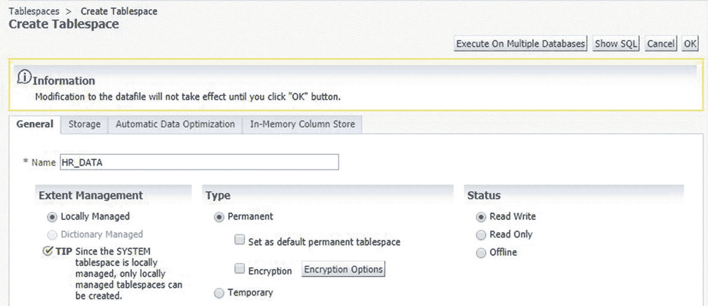

图 11-9
EM 创建表空间屏幕

你可以不点击“确定”按钮，而是点击 `Show SQL` 按钮，Enterprise Manager 会向你展示确切的 SQL 语句，类似于图 11-10。

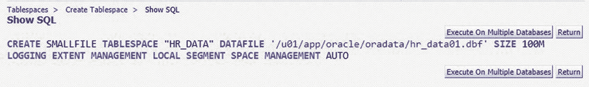

图 11-10
EM 显示 SQL 屏幕

许多工具都有能力向你展示它们将代表你发出的 SQL 语句。GUI 工具并不能变任何魔术。它们所做的一切就是询问你问题，并根据你填写的空白来构建 SQL 语句。然后，该工具将 SQL 语句提交给数据库引擎并等待回复。所有这些都是在幕后为你完成的。

使用这个 `Show SQL` 按钮是学习更多关于 SQL 语句及其工作原理的好方法。例如，如果我点击图 11-10 中所示的 `Return` 按钮，然后勾选复选框以使其成为大文件表空间（bigfile tablespace），我就可以看到新形成的 SQL 语句并弄清楚发生了什么变化。

### 提示

使用 `Show SQL` 按钮或类似功能，查看工具在后台为你做了什么。

下次当你使用 Enterprise Manager 或类似工具时，花些时间确定工具正在为你发出什么 SQL 语句。然后尝试更改一些选项，分析其对该 SQL 语句的影响。通过这种方式，你是在让工具教你更多关于 SQL 语句的知识，因为它们与当前任务相关。

你也可以在 `SQL Developer` 中创建表空间。要查看 `SQL Developer` 发送给数据库的 SQL 语句，请点击 `DDL` 选项卡，如图 11-11 所示。

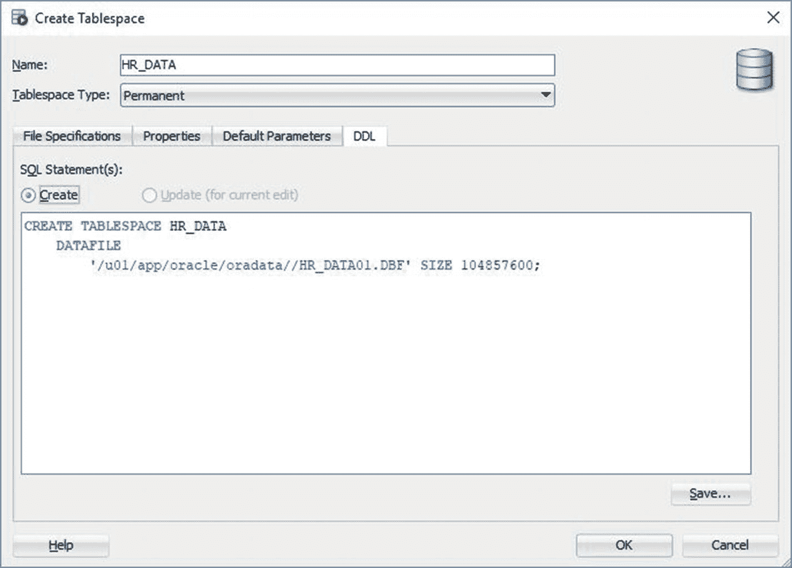

图 11-11
SQL Developer DDL 选项卡

尝试查找工具发送到数据库的确切 SQL 语句，是学习更多数据库管理知识的好方法。

我也会使用这个“显示 SQL”功能来帮助构建我的 SQL 语句。如果我在语法上遇到问题并需要一些帮助，我会逐步完成工具的向导，然后查看我在哪里出错了。我并不强制通过该工具运行此语句。我可以将 SQL 语句复制粘贴到 `SQL*Plus` 或 `SQL Developer` 中。

工具只会做其设计要做的事情。你会遇到一些情况，工具完成了你想做的大部分事情，但不是全部。你可以从工具中获取 SQL 语句，然后复制到 `SQL Developer` 中。从那里，你可以补充完整剩余部分，然后继续工作。如果工具无法完成确切的任务，看看它是否能通过显示它能做的 SQL 来给你一个起点。


