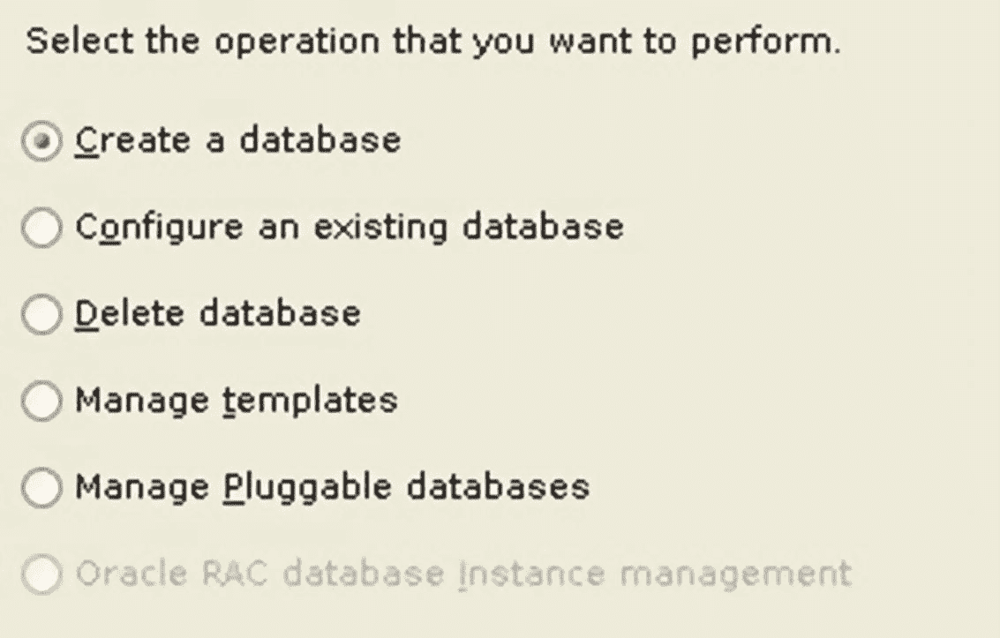
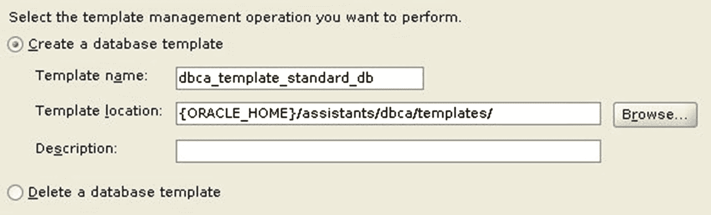
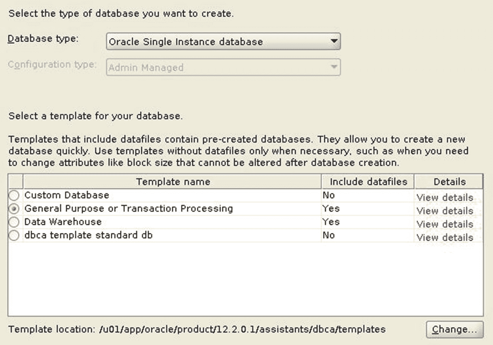

# 数据库配置助手

在第 6 章中，我们使用了数据库配置助手（`DBCA`）来创建我们的第一个 Oracle 数据库。如图 11-12 所示，`DBCA`还可以执行其他任务，例如删除数据库、管理`DBCA`模板以及配置现有数据库。

*图 11-12：`DBCA`操作*

配置现有数据库可用于添加或删除可选组件，如 Oracle Text、Oracle Multimedia、Oracle Spatial 等。

在创建 Oracle 数据库时，`DBCA`会引导您回答一系列问题。您可以选择将这些答案保存为模板，这样不仅可以简化未来数据库的创建过程，还能遵循您的标准。如果您选择“管理模板”选项，`DBCA`会询问您是创建一个还是删除一个模板，类似于图 11-13。

*图 11-13：`DBCA`创建模板*

您可以使用现有模板或通过检查现有数据库来创建模板。模板创建后，您可以在列表中看到它。在图 11-14 中，前三个模板是`DBCA`自带的，但最后一个模板是我创建的。

*图 11-14：`DBCA`模板选择*

