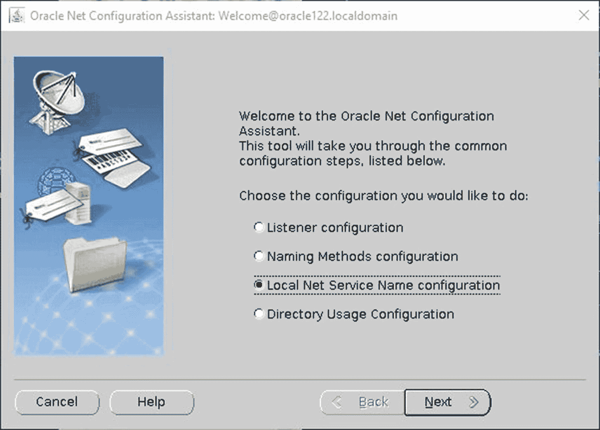

# 网络配置助手

Oracle 提供了一个网络配置助手（`NETCA`）来帮助配置 Oracle 数据库的网络组件。`NETCA`用于为 Oracle 数据库配置监听器以及任何 LDAP 身份验证。

在第 9 章中，我们通过手动编辑`tnsnames.ora`配置文件创建了一个`TNS`别名。大多数 Oracle 数据库管理员使用任何文本编辑器手动编辑`tnsnames.ora`。网络配置助手也可用于修改`tnsnames.ora`配置文件。

启动`NETCA`后，该实用程序应如图 11-15 所示。选择“本地网络服务名配置”并点击“下一步”。

*图 11-15：`NETCA`初始屏幕*

在下一个屏幕中，我们可以添加、重新配置、删除、重命名或测试`TNS`别名。向导将引导您完成剩余步骤。

如前所述，大多数 Oracle 数据库管理员手动编辑配置文件。有时，他们会遇到语法无法正常工作的问题。使用`NETCA`是确保语法正确构成的好方法。

