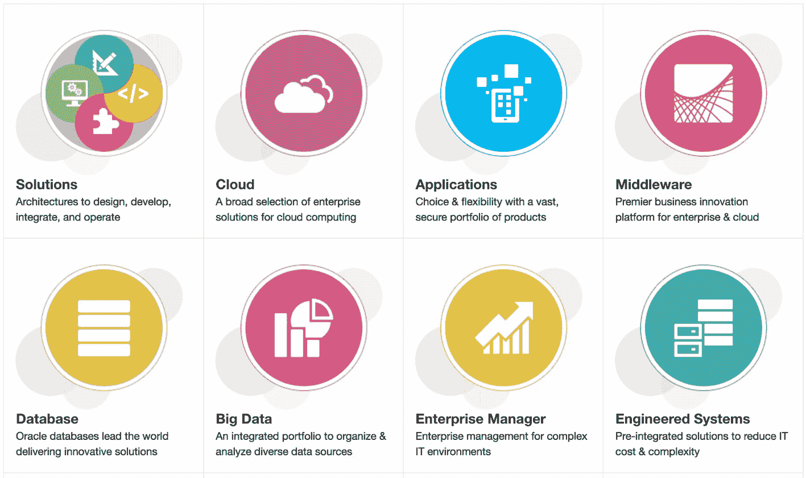
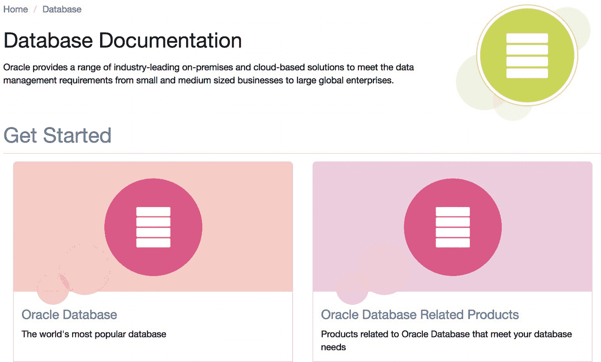
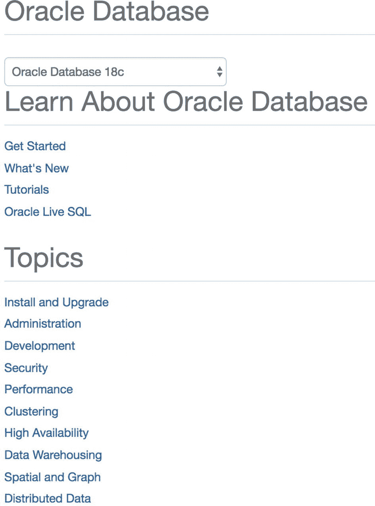
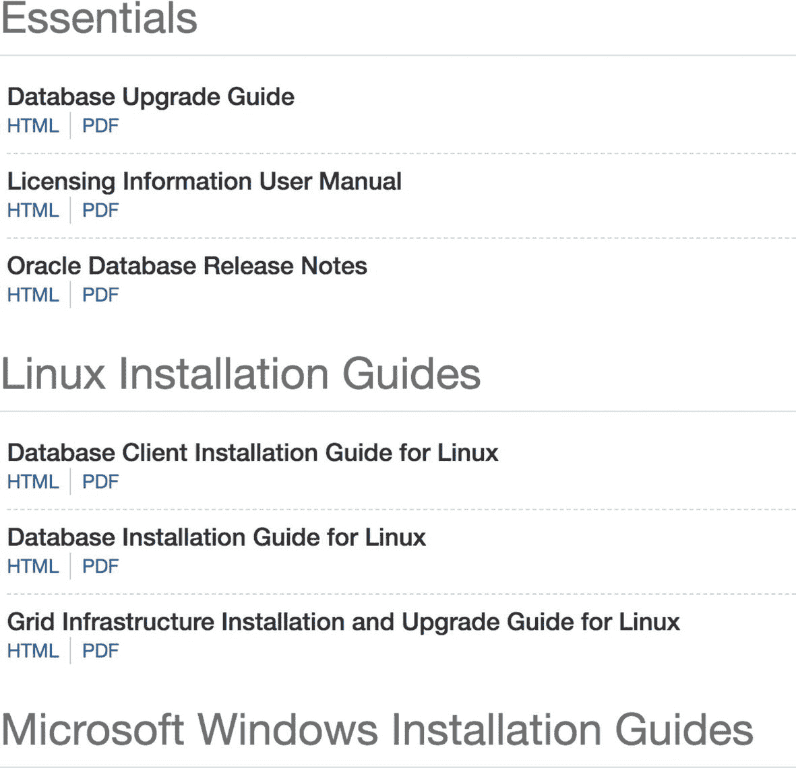
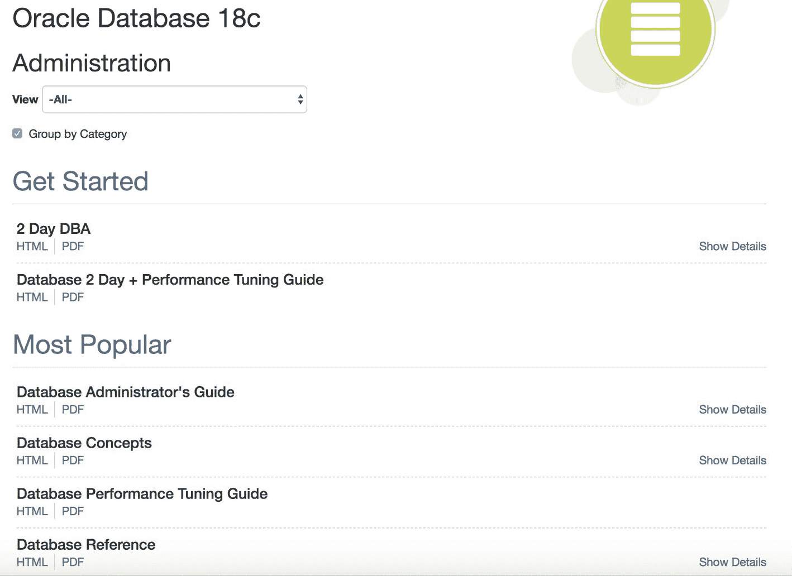
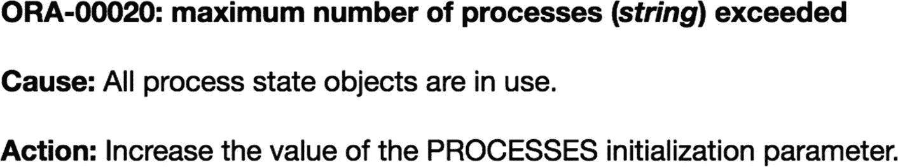
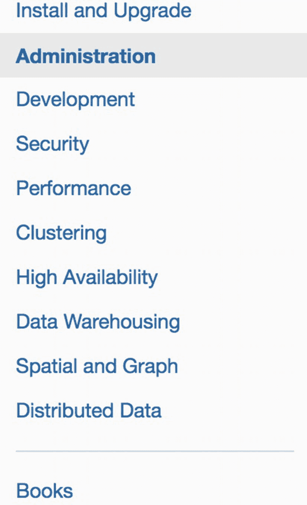
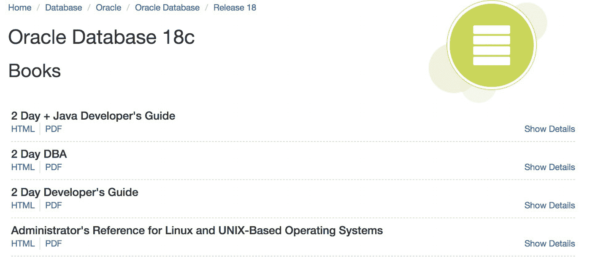

# 13. Oracle 文档

在前八章中，我们讨论了一些入门材料并搭建了我们的测试平台。在第 9 章至第 12 章，我们转向了使用 Oracle 数据库的主题，花时间连接 Oracle、运行测试用例，并检查我们将在管理职责中使用的各种工具。

本章将重点转向更深入地了解 Oracle。我撰写本书的主要目的是教您如何成为一名**自给自足**的 DBA。技术书籍是极好的资源，我的书架上就有许多，但大多数技术书籍都是独立的指南，它们教授书中所写的内容，却无助于您在此基础上扩展知识。正如我之前所说，本书的不同之处在于，它将教会您如何**自主学习**。本章以及接下来的三章，是您阅读本书时需要关注的核心所在。

如果您使用其他数据库系统，仍然可以利用这四章中的技巧来促进您在该领域的发展。本章我们将介绍 Oracle 产品文档，下一章介绍数据字典，第 15 章介绍 Oracle 的支持网站，第 16 章介绍如何使用社交媒体。如果您使用的是另一个数据库平台，例如 SQL Server 或 DB2，那么您可以参考其对应的数据字典、支持网站和相关的社交媒体网站。这些理念在您切换平台时同样适用。我甚至使用过这些相同的重点领域来学习非数据库系统。您可能在职业生涯的某个阶段已经使用过其中一些了。

归根结底，没有人能教会您 DBA 职业生涯中可能需要知道的一切。您必须花时间学习更多知识。毫无疑问，您会依赖多种信息来源来帮助您学习，从而胜任工作。我认识的所有优秀数据库管理员都**非常善于**利用此处以及第 14 章至第 16 章中介绍的每一种信息渠道。这绝非偶然。

正如本章所讨论的，世界上众多 Oracle 专家的主要信息来源是 Oracle 文档。在我的职业生涯中，我见过太多 Oracle 专业人士不惜一切代价避开 Oracle 文档集。文档是他们最后的求助手段。本书的读者将会明白，当您需要更多信息时，文档应该是您的第一站之一。当我问人们为什么不查阅 Oracle 文档时，他们可能会给我举例书中的错误。这很合理。任何书都可能出错。但当我深入探究时，我几乎总是得出结论：这个人不喜欢文档是因为它**难以使用**。在本章中，您将发现文档是多么**简单易用且有益**。

## RTFM

您可能见过这个缩写。其礼貌版本是“Read The Fine Manual”（阅读优质手册）。还有一种更冒犯性的版本，您可能会在现场听到，这里无需重复。如果您问任何人问题，他们用“RTFM”来回答，他们的意思是答案就在文档中。无论回答您问题的人意图是礼貌还是粗鲁，您需要遵循的方向都是去查阅文档。

正如任何父母都能告诉您的，他们的职责之一是帮助教导孩子如何成为社会中有礼貌的一员。我们不断提醒孩子们要说“请”和“谢谢”。有一天，我儿子问我：“你能帮帮我吗？”我答应了。他接着说的是“过来这里”。我总是告诉我的孩子们，如果他们想要别人的帮助，就应该尽量少给对方添麻烦。我告诉他们：“如果你们想让我帮忙，你们就过来找我。”不知为何，每当听到 RTFM 问题时，我总会想起这件事。您希望我帮忙找到您的 Oracle 答案，却不愿意自己稍作努力去查一下？回答问题的 Oracle 专业人士是自愿抽出自己的时间来做的。他们不喜欢被那些您自己就能回答的简单问题所打扰。我们不是来这里替您完成工作的。如果您提出的问题可能招致 RTFM 式的回答，请务必预先说明您已经查阅过 Oracle 文档，但难以找到答案（如果答案存在的话）。

我遇到的每一位 Oracle 大师都花费了无数时间**研读**Oracle 的文档集。我长期以来的观点是，他们之所以如此擅长这份工作，部分原因就在于花在文档上的时间。这不是他们成为领域专家的唯一原因，但我可以明确地说，我从未见过哪位 Oracle 专家或大师没有阅读过文档。如果您想发展您的 Oracle DBA 职业生涯，那么阅读 Oracle 文档至关重要。如果您阅读了本书讨论的 Oracle 文档指南，并花些时间学习其中的内容，您很容易就能跻身顶级数据库管理员之列。所有顶级的 DBA 都一遍又一遍地阅读文档，他们也会告诉您这样做。对 DBA 来说，最重要的指南或许是 `Oracle Database Concepts Guide`（Oracle 数据库概念指南），我们将在本章讨论。如果您真想成为顶尖的 Oracle DBA 之一，您将会非常熟悉 `Oracle Database Concepts Guide` 中的信息。

如果您想将自己提升至大师级别，您需要用细齿梳子般精细地研究文档。**钻研每一个细节**。拿文档中给出的例子，用它们形成测试用例，并围绕该概念进行试验。当我读到一些大师级 DBA 的博客文章时，总是感到惊讶，他们将 Oracle 文档中我完全一扫而过的一小部分内容拿出来，仔细检查每一个微小的细节。

我希望我已经说服您，您需要使用 Oracle 文档来提升技能并推进您的职业生涯。到目前为止，在本书中，我已向您推荐了 `Database Installation Guides`（数据库安装指南）（第 5 章）；`Database Backup and Recovery User’s Guide`（数据库备份与恢复用户指南）和 `Database Backup and Recovery Reference`（数据库备份与恢复参考）（第 7 章）；以及 `Database 2 Day + Security Guide`（数据库两天+安全指南）和 `Database Security Guide`（数据库安全指南）（第 8 章）。我让您自行去文档集中查阅这些指南进行阅读。让读者您自己决定，是刻意为之的。**您必须习惯阅读文档这个想法。**

### 提示

阅读 Oracle 文档是提升技能的必经之路。

我曾接触过一些产品，其文档仅是 20 或 40 页的 PDF 文件，可以从头到尾轻松读完。遗憾的是，Oracle 的文档集非常冗长。当你访问 [`https://docs.oracle.com`](https://docs.oracle.com) 时，会看到从“解决方案”到“行业”的 15 个不同类别。一开始，面对如此多的类别，你可能不确定该从何入手。前八个类别如图 13-1 所示。

图 13-1

Oracle 文档类别（部分视图）

我们在前面的章节中已经导航到 Oracle 数据库文档。但为了完整性，我们将在此处再次逐步讲解这些步骤。出于我们的目的，我们总是点击“数据库”类别。点击该类别后，会出现五个子类别，从 Oracle 数据库到其他数据库。对于本书，我们将始终点击 Oracle Database，即图 13-2 左下角的按钮。

图 13-2

数据库文档子类别（部分视图）

当你进入下一页时，可能不太明显的是，Oracle Database 类别包含了针对 Oracle 18c 版本的 147 本不同的文档书。这就是为什么人们不喜欢阅读 Oracle 文档。如果仅仅 Oracle 数据库就有 147 本不同的书要读，那么在 [`https://docs.oracle.com`](https://docs.oracle.com) 的其他类别中还有多少其他的书？文档书如此之多，很难知道该读哪一本。你可能会想：“光是找到 Oracle 数据库文档集就不容易了，现在你还想让我从 147 本不同的书中挑选？”别担心，本章将帮助你理清头绪。你使用文档集的经验越多，就越能更好地利用它来为自己服务。

### 提示

不要让庞大的 Oracle 文档量压垮你。

撰写文档的 Oracle 员工在网站组织方面做得很好，旨在帮助你更容易地找到所需内容。让导航到你需要的书籍更高效并非易事。在我职业生涯中使用这个文档集的过程中，我注意到它随着 Oracle 的每个版本而增长，导航也变得更加复杂。有很多 DBA 讨厌 Oracle 决定布局文档集的方式，但这就是我们必须面对的现实。

点击图 13-2 所示的 Oracle Database 按钮后，我们可以在图 13-3 中看到主要主题。

图 13-3

Oracle 数据库文档导航

首先要注意的是顶部的下拉菜单。每个新版本都与其前身不同，文档中的某些信息也随版本而变化。新功能被引入并记录。旧功能可能发生变化，这些变化也被记录下来。在撰写本文时，下拉菜单包含版本 11.2、12.1、12.2 和 18c。在本章撰写之后，Oracle 19c 文档现已可用。下拉菜单的最后一项是“早期版本”，它提供了对一直追溯到 Oracle 7.3.4 版本文档的访问。无论何时阅读 Oracle 文档，请确保选择你正在使用的正确版本，以获得尽可能准确的信息。无论何时阅读文档的某一页，页面顶部的导航面包屑会告诉你正在浏览的版本。

每当我阅读文档时，我总是在试图学习一些东西。然而，我试图学习的最重要的事情是：哪条信息位于文档的哪个位置。有这么多文档要读，不可能记住所有内容。值得庆幸的是，你不需要全部记住。你总是可以返回并在以后找到你读过的内容。例如，在阅读 *Database Installation Guide for Linux* 时，我不需要记住如果服务器有 4GB RAM，Oracle 数据库需要 4GB 交换空间。相反，我只需要记住交换空间信息在 *Installation Guide* 中。以后，当我在安装 Oracle 时，既然我知道去哪里找，就可以轻松地参考 *Installation Guide*。Oracle Database 有 147 本书要读，你很可能无法全部记住。

### 提示

最重要的事情是了解文档中各处的内容。

这是我能给你的最大建议。了解文档集中各处的内容。一旦你知道了这一点，信息量就不会显得那么庞大，你会开始更多地使用文档。像任何事情一样，你用得越多，就越擅长它。尽可能多地使用 Oracle 文档，你会发现它是一个无价的工具。我必须如此频繁地访问文档，以至于当我想在浏览器地址栏中输入 [docs.oracle.com](http://docs.oracle.com) 时，只需输入“do”，浏览器就会自动建议这个网站。

阅读时，你可能会想要记笔记。我发现记笔记是有益的。每次我写下学到的东西，都有助于我记住这个概念。通常，我的笔记会变成博客文章来分享所学。博客将在第 16 章讨论。

在更详细地讨论文档之前，我想补充最后一点。阅读每个新版本的文档。正如我之前所说，事情可能而且将会从一个 Oracle 版本到下一个版本发生变化。当新版本发布时，我读的第一样东西就是最新的 *Database New Features Guide*，它让我对新版本中的新特性有一个高层次的概览。之后，我会阅读本章将讨论的几本核心书籍。这样做不仅通过再次阅读信息巩固了现有知识，还让我惊喜地发现一些与新版本相关的新细节。我甚至学到了一些与旧版本相关但从未在该旧版本文档中解释过的内容。

不要害怕文档。越来越多地使用它，你将比你想象的更大地扩展你对 Oracle 数据库的知识。我对此深有感触。不要把文档看作以后可以处理的东西。让它成为你 Oracle 知识的主要资源。

## 安装与升级

在 Oracle 18c 版本的 Oracle Database 分类下，有一个名为 `Install and Upgrade` 的链接。它位于 `Topics` 标题下，如图 13-4 所示。

图 13-4：`Install and Upgrade` 链接

点击该链接会进入一个包含多本与安装和升级 Oracle 数据库相关书籍的部分，其部分内容如图 13-5 所示。

图 13-5：18c 安装指南（部分视图）

我们将在第 18 章讨论 `Database Upgrade Guide`。`Licensing Information User Manual` 是所有 Oracle 数据库管理员的必读书籍。这本书解释了 Oracle 的许可方式，非常重要，可以避免您的组织因不当使用 Oracle 而面临额外费用甚至更糟的情况。如果您因许可使用情况而被 Oracle 审计，您会庆幸自己阅读并遵守了本手册中的信息。

接下来页面上是针对不同平台安装 Oracle 的部分。我们在第 5 章探讨了 `Installation Guide for Linux`。希望您至少已经浏览过这份文档，了解其中呈现的信息。如果您日后需要在 Windows、Solaris 或 AIX 上安装 Oracle，您已经知道需要阅读哪些文档才能成功完成安装。

## 管理

由于本书侧重于 Oracle 数据库管理，因此需要阅读的文档主要领域是管理相关主题。如图 13-6 所示，`Topics` 下的 `Administration` 分类中的书籍链接位于 `Install and Upgrade` 链接下方。

图 13-6：`Administration` 主题

点击 `Administration` 链接后，您将看到几本可供阅读的书籍，其部分列表如图 13-7 所示。

图 13-7：18c 管理书籍（部分视图）

图 13-7 显示的是 Oracle 18c 版本的文档。如果您需要其他版本的文档，请返回上一页并从下拉菜单中选择您的版本。接下来我们将更详细地讨论这里列出的书籍。尝试熟悉这部分文档，因为在您的 DBA 职业生涯中，您将在这里花费大量时间。

## 2 天速成指南

Oracle 公司一定意识到了其文档集对客户来说可能多么令人生畏。Oracle 在其“2 天”系列中推出了几本书。我们可以在图 13-7 中看到其中两本。Oracle 还提供了 `Database 2 Day Developer’s Guide` 和 `Database 2 Day + Java Developer’s Guide`。这些书是获取相关主题入门材料并初步实践的绝佳方式。这些书并非让您只阅读该主题的唯一书籍。阅读 2 天速成指南后，请深入文档集的其余部分进一步研究。

图 13-7 中列出的 `2 Day DBA` 一书包含关于如何安装和创建 Oracle 数据库的章节、关于如何使用各种工具管理数据库的章节，以及关于如何配置网络、管理存储、提供数据库安全性以及执行备份和恢复的章节。还有一章专门讨论性能调优。这本 2 天速成指南听起来开始与本书及市场上的其他书籍非常相似。我们在本书中也按主题涵盖了相同的领域。请将 `2 Day DBA` 一书作为您图书馆中的另一个资源。

`Database 2 Day + Performance Tuning Guide` 引导您开始 Oracle 数据库性能调优这一非常庞大但令人兴奋的主题。这是我最喜欢的科目之一，即使我已经进行 Oracle 数据库性能调优 20 年，我仍然每天都在学习新东西。2 天+性能调优速成指南只是触及了皮毛，但它是一个很好的起点。

确保花些时间阅读 2 天速成指南。阅读它们后，您会遇到问题并寻求答案。这些问题的答案通常可以在我们将在本章讨论的其他书籍中找到。

## 概念指南

如果您只有一两本 Oracle 书籍的阅读时间，我会告诉您，文档集中有两本每个 Oracle DBA 都必须阅读的书。第一本是概念指南，第二本是下一节将讨论的 `Database Administrator’s Guide`。概念指南是必读书籍。这本书对您的 DBA 职业生涯如此重要，您应该从头到尾阅读它多遍。

### 提示

**阅读概念指南！它太重要了，不容错过！**

概念指南介绍了使 Oracle 数据库引擎工作的许多理论和模型。是否想过 Oracle 如何处理数据库事务？它就在里面。是否想过 Oracle 如何存储数据？它就在里面。需要了解更多关于索引的信息？它就在里面。

在阅读概念指南时，您可能会发现自己会转向其他书籍以获取该主题的更多信息，这是消化这些信息的可接受方式。我建议先从头到尾阅读概念指南，以了解其中的内容。然后回头阅读某一章，目标是尝试学习更多关于该主题的知识。如果需要，再扩展到其他信息来源。回来阅读下一章并重复。

概念指南包含六个主要部分：

*   第一部分，“Oracle 关系数据结构”，涵盖表、索引和其他模式对象以及如何确保数据完整性。

*   第二部分，“Oracle 数据访问”，涵盖 SQL 和 PL/SQL。

*   第三部分，“Oracle 事务管理”，涵盖事务如何工作以及如何确保数据一致性。

*   第四部分，“Oracle 数据库存储结构”，涵盖磁盘上的物理文件和逻辑存储实现。

*   第五部分，“Oracle 实例架构”，涵盖 Oracle 如何使用进程和内存使引擎工作。

*   第六部分，“Oracle 数据库管理和应用程序开发”，涵盖如何管理 Oracle 数据库以及为其进行开发。

请记住，本章前面我提到过，重要的是了解文档集中各部分的位置。概念指南打破了这个规则。这是一本您会想从头到尾学习的书。在理解所有内容之前，您可能需要多次通读这本书，并且可能需要跳转到其他来源。阅读概念指南不是一场竞赛，所以请慢慢来。在与 Oracle 打交道数十年后，我仍在阅读这本书。

## 管理员指南

`Administrator’s Guide` 是另一本至关重要的书。概念指南阐述了事情应该如何工作的理念，而 `Administrator’s Guide` 则向您展示了如何去做。这两本书相辅相成。我经常发现自己在这两本书之间来回翻阅。

### 提示

请阅读`管理员指南`！它至关重要，不容错过！

再次强调，这本书非常重要，你不会只想记住其中的内容。你需要花时间消化书中呈现的信息，并尽可能多地学习。

`管理员指南`包含六个主要部分：

*   第一部分，“基础数据库管理”，涵盖了如何创建和管理 Oracle 数据库，包括启动/关闭以及我们之前在本书中讨论的许多内容。
*   第二部分，“Oracle 数据库结构与存储”，涵盖了如何管理控制文件、数据文件、临时文件、重做日志和撤销（undo）。
*   第三部分，“模式对象”，涵盖了如何管理表、索引、视图等。
*   第四部分，“数据库资源管理与任务调度”，涵盖了如何利用资源管理器确保重要用户不被次要用户挤占资源，以及如何调度数据库作业。
*   第五部分，“分布式数据库管理”，涵盖了如何执行跨多个数据库的事务。如果你没有分布式数据库，可以跳读本节。
*   第六部分，“管理只读物化视图”，涵盖了如何使用可能提升应用性能的物化视图。你也可以选择跳读本节。

本书的前四部分对于你成为一名成功的 Oracle DBA 至关重要。最后两部分可以浏览一下。你可能永远用不到那些章节里的信息，但如果用到，你会知道去哪里查找。

## 性能调优指南

在你的数据库管理职业生涯中，让任何数据库引擎达到最佳性能迟早会成为一个关注焦点。数据库是用户交互的核心。用户希望访问数据，并且希望访问速度要快。每个 DBA 都会接到性能糟糕的报告，而诊断问题的根本原因并将性能恢复到可接受的水平，正是 DBA 的职责所在。

关于性能调优这个话题，可以写、也已经写了太多内容。在我职业生涯早期，Oracle 对性能调优的文档记录并不完善，但现在`数据库性能调优指南`已成为所有 Oracle DBA 的必读之物。性能调优是一个宏大的主题，要精通它需要付出大量努力。从这份指南开始，然后再寻找其他资料。

`性能调优指南`分为四个部分：

*   第一部分，“数据库性能基础”，涵盖了开始你的性能调优工作所需的基础知识。
*   第二部分，“诊断与调优数据库性能”，涵盖了如何衡量现有性能并收集有关性能问题的信息。
*   第三部分，“调优数据库内存”，涵盖了如何为 Oracle 实例调整内存大小以获得最佳性能。
*   第四部分，“管理系统资源”，涵盖了如何优化系统配置以实现最佳性能。

如果你是一名初级 DBA，那么可以先浏览这份指南，感受一下它的内容。随着你在职业生涯中不断进步，技能不断提升，你很可能会被分配更多的性能调优案例，并且会越来越深入地研究这本书。

## 错误消息

`Oracle 数据库错误消息`在传统意义上并不是一本供你阅读的书。更准确地说，它是一本参考书，包含了你可能遇到的所有有文档记录的 Oracle 错误消息列表。你需要在这里学习的是，当你遇到不理解的错误消息时，如何查阅本书。例如，如果你看到`ORA-00020`错误，你可以在书中找到它，并看到如图 13-8 所示的描述（或类似描述）。

图 13-8：错误消息示例

书中所有的错误消息都包含“原因”和“操作”两个部分。很多时候，仅凭错误消息本身可能不足以说明问题，这种情况下，“原因”和“操作”部分通常能帮助你理清问题并解决问题。遗憾的是，有些“原因”和“操作”部分是空白的。

## 备份与恢复

在第 7 章，我们讨论了备份与恢复的主题。在那一章，我指引你阅读`备份与恢复用户指南`。希望你已经花时间至少浏览过它。由于我们已经比较深入地介绍过那本书，本章将不再花时间讨论它。

第 7 章还提到了另一本需要查阅的书，即`数据库备份与恢复参考手册`。当你在书名中看到“参考手册”一词时，意味着该书详细列出了该主题的每一个选项。例如，虽然`备份与恢复用户指南`向你展示了如何使用恢复管理器（`RMAN`）来备份和恢复数据库，包括使用`BACKUP`、`RECOVER`和`RESTORE`命令的示例，但这些命令远不止指南中所展示的那些。每个命令都有许多选项，而指南只展示了这些命令最常用的选项。另一方面，`备份与恢复参考手册`则详细介绍了每个命令选项。如果你想了解这些命令的每一个细节，可以查阅这本参考手册。它不仅告诉你关于每个命令你需要知道的一切，还包含语法图，以便你能正确构建命令。很多时候，我把命令选项放错了顺序或错误地定义了命令。如果我去查这本参考手册，就能准确地看到如何构建我的命令并避免错误。花些时间浏览这本参考手册，以便了解它的内容。

## SQL 语言参考手册

与 Oracle 数据库交互的唯一方式是向其发送 SQL 命令。每一条 SQL 命令都在`Oracle 数据库 SQL 语言参考手册`中有详细记录。例如，看看你能否在这本书里找到`CREATE ROLE`命令。（提示：SQL 语句按字母顺序排列在第 10 章到第 19 章。）你首先会看到的是“用途”部分，描述了该命令的用途。“先决条件”部分描述了你成功执行该命令之前需要满足的条件。在这个例子中，你需要`CREATE ROLE`系统权限。“语法”部分的图示展示了如何正确构建语句。“语义”部分随后深入讨论了该命令的每个选项。最后，“示例”部分提供了一些不同选项的示例，以说明命令的工作原理。

除了这本参考手册中记录的各种 SQL 命令外，书中还讨论了 Oracle 提供的默认数据类型和函数。还讨论了可以在 SQL 语句中使用的运算符和表达式。

花时间浏览这份文档。你可能会惊讶地发现，其中包含了大量关于你日常向 Oracle 数据库发出的 SQL 语句的信息。

## PL/SQL 包与类型参考

*Oracle Database PL/SQL Packages and Types Reference*（Oracle 数据库 PL/SQL 包与类型参考）这份文档常常被忽视，这就是我在此提及它的原因。随着你在 Oracle DBA 职业生涯中不断进步，你将越来越多地使用 Oracle 为我们提供的各种 PL/SQL 包。到现在为止，你可能已经用过其中几个了。Oracle 提供的包名以“`DBMS_`”开头。你可能接触过 `DBMS_SCHEDULER` 或 `DBMS_OUTPUT` 等。这份参考文档详细介绍了 Oracle 开箱即用的每一个包。

这份参考文档概述了每个包的用途、通过 API 暴露给我们的数据类型和常量列表，以及任何使用说明。当我们遇到权限问题时，正是这些使用说明能帮上忙。你可能拥有执行某个 PL/SQL 包的权限，但也可能需要其他权限。例如，如果你尝试使用 `DBMS_STATS` 包来执行 `GATHER_TABLE_STATS` 却遇到权限错误，这份参考文档会告诉你，你需要是该表的所有者，或者拥有 `ANALYZE ANY` 系统权限。

花些时间浏览这份参考文档。显然，你无法记住这本书的全部内容。下次当你使用 Oracle 提供的 PL/SQL 包时，花点时间在这本书里查找该包，了解更多相关信息。如果你在使用某个自带的 PL/SQL 包时遇到问题，可以在这份参考文档中查找，看看是否能解决问题。

## 书库

当我们访问某个版本的文档集时，Oracle 会贴心地为我们提供不同的分类，就像本章中我们一直在看的“管理”分类。有时，我们很难找到想要的书，因为我们无法确定正确的分类。如果我们位于 Oracle 数据库文档的主着陆页，在“主题”列表下方有一个名为“访问我们的书库”的部分，如图 13-9 所示。

图 13-9：“浏览书库”链接

如果你已经选择了一个主题，相同的链接也会出现在左侧，主题列表下方。在图 13-10 中，你可以看到我选择了“管理”主题，其下方是“图书”链接。

图 13-10：“图书”链接

无论你如何到达那里，你都会被带到该 Oracle 数据库版本对应的完整图书列表。图 13-11 展示了其中一部分图书（该页面比图中显示的要长得多）。

图 13-11：Oracle Database 18c 图书

如果你滚动浏览图书列表，会发现它们是按字母顺序排列的。如果你找不到想要的书，可以来到这个所有图书的列表页，在浏览器中按 `Ctrl-F` 调出文本搜索框，输入关键词进行简单搜索。大多数浏览器使用 `Ctrl-F` 来调出文本搜索窗口。如果我要找一本关于 JSON 或多租户的书，通过搜索这些词就能轻松找到。

读一读这些书的标题是个好主意，这样你就知道有什么内容。你不必通读这些书，最多只需快速浏览一下。再次强调，本章的全部重点是学习如何导航文档集，了解什么内容在哪里，以便将来更容易找到你需要的东西。如果你看到一个有趣的书名，可以点击“显示详细信息”链接，获取一两句描述该书内容的文字。

## 其他书籍

我想通过非常高层次地讨论几本其他的 Oracle 文档书来结束本章，这些书可能在你 Oracle 职业生涯进阶过程中对你很重要。花些时间研究一下这些书，了解它们包含的内容。将来某个时候，你很可能会阅读这个列表中的大部分书籍。

*   `自动存储管理用户指南`：如果你为 Oracle 数据库使用 ASM，你需要参考本指南来了解如何在存储中操作文件。
*   `数据库新特性指南`：如本章前面提到的，当新版本发布时，这是我首先阅读的内容。它向你展示了该版本的新特性。如果你刚刚起步，一切都是新的。将来某个时候，你会升级到更高的版本，而这本书会让你知道可以期待什么。
*   `数据库安全指南`：每个人都需要保护他们的数据库。本书在第 8 章中有介绍，提供了大量关于该主题的精彩细节。
*   `数据库实用程序`：学习如何使用数据泵来导出和导入数据。学习如何使用 SQL*Loader 和外部表将数据从文本文件移入数据库，以及反向操作。
*   `多租户管理员指南`：Oracle 已声明多租户是 Oracle 未来的方向。届时，所有 Oracle 数据库将至少包含一个租户。即使你只有一个租户，也可以使用本指南来学习如何管理多租户特性。
*   `网络服务管理员指南`：本书向你展示如何配置 Oracle 网络。
*   `SQL 调优指南`：本书面向性能调优，但侧重于如何编写性能良好的 SQL 语句。

这个列表并非详尽无遗。你肯定还需要阅读其他书籍。许多书籍涉及你可能需要使用的特性，如 Oracle Text 或真正应用集群。如果你不使用这些特性，可以跳过那些书。云技术正开始要求我们投入更多关注，Oracle 也有关于其云数据库服务的文档（点击 [`https://docs.oracle.com`](https://docs.oracle.com) 处的“云”按钮）。

## 继续前进

对于新手来说，阅读 Oracle 文档并不是你愿意做的事情。在你职业生涯早期，由于其庞大的篇幅，甚至可能有点吓人。希望读完本章后，你不再对其体量感到畏惧。你应该已经了解了对职业生涯至关重要的关键书籍。你正在熟悉这些书中呈现的信息、格式和结构。你应该感到兴奋，因为你现在接触到了一个知识宝库。仅仅阅读这些书籍就能保证提升你的技能。深入钻研这些书，实践讨论的概念，并在测试环境中演练各项功能，这将比其他任何方式都能更好地增长你的 Oracle 知识。

我所遇到的每一位优秀的 Oracle DBA，都花费了大量时间不仅阅读文档，而且学习如何最大限度地利用它。记住，记住你读过的一切并不重要。重要的是了解什么内容在哪里，这样将来你可以再次查阅。像任何事情一样，你做得越多，它就变得越容易，所以从今天开始使用 Oracle 文档吧。

“了解内容在哪里”这条规则有两个例外：`概念指南`和`管理员指南`。我认为这两本指南是必读的。在你读完本书后，我强烈建议你阅读这两本指南。它们就是如此重要。

在下一章中，我们将了解更多关于数据字典的知识。我们将探索如何向 Oracle 数据库询问关于它自身的问题。毕竟，市面上没有哪本书能 100%确定地告诉你 DBA 将数据文件放在了磁盘的哪个位置，或者哪个用户拥有名为 `RPT30_180101` 的表。对于这类问题，我们需要询问数据字典。

