# 15. My Oracle Support

读完本书后，你很可能会产生更多问题并希望了解更多。在前面的两章中，我们开启了一段深入 Oracle 文档的旅程。正如你所发现的，Oracle 文档是学习更多 Oracle 知识的重要资源。文档集非常庞大，最大的障碍是弄清楚哪本书包含你想要的信息，这就是为什么我们花了两章来探索如何导航文档。

在上一章中，我们讨论了 Oracle 数据字典。所有优秀的数据库引擎都以数据字典或数据库目录的形式是自我文档化的。使用数据字典的最大障碍是弄清楚哪个视图包含你想要的信息。

如果你遇到一个问题，而 Oracle 文档和数据字典都没有包含你寻找的答案，那么下一个通常要去的地方就是 My Oracle Support。

## 登录 My Oracle Support

My Oracle Support，通常缩写为 `MOS`，是 Oracle 公司的支持门户。`MOS` 用户可以搜索知识库、获取补丁并提交援助请求。`MOS` 处理 Oracle 的所有产品。正如我们将在本章中看到的，`MOS` 还提供了更多功能。

要访问 My Oracle Support，请将 Web 浏览器指向 [`http://support.oracle.com`](http://support.oracle.com)，并使用你的 Oracle 单点登录 (`SSO`) 账户登录，如图 15-1 所示。回想一下，在第 3 章和第 5 章中，你使用了你的 Oracle `SSO` 账户从 Oracle 技术网络下载软件。如果你没有 Oracle `SSO` 账户，可以免费创建一个。图 15-1 显示了登录 `MOS` 的按钮。如果你没有 Oracle `SSO` 账户，请点击**新用户**链接。创建账户时，我通常使用公司电子邮件地址作为用户 ID。所有 Oracle `SSO` 账户都使用电子邮件地址作为用户 ID。如果你因支持问题填写服务请求，Oracle 支持会将通知发送到该电子邮件地址。

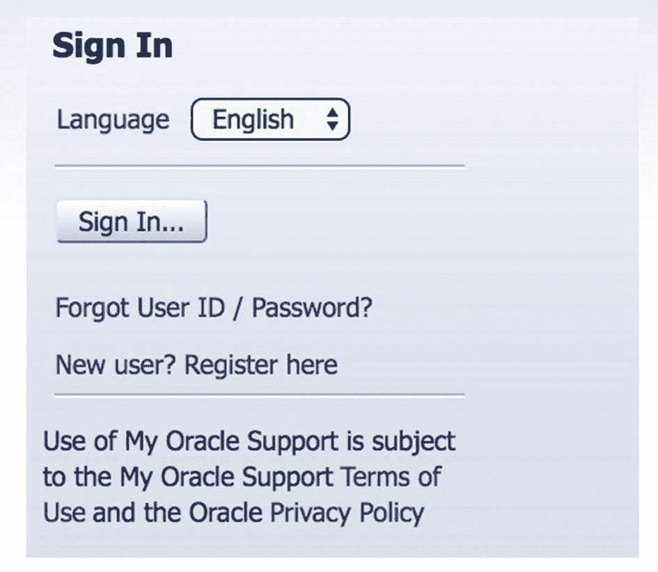
*图 15-1 My Oracle Support 登录屏幕*

登录后，你将被定向到 **MOS 仪表板**选项卡。在仪表板选项卡的右侧，有多个其他选项卡可用于导航到 `MOS` 的不同区域，如图 15-2 所示。

*图 15-2 MOS 导航选项卡*

## CSI

虽然访问 MOS 是免费的，但如果贵公司没有处于有效状态的 Oracle 支持合同，您在那里能做的事情将非常有限。当首次为公司的 Oracle 产品购买支持合同时，Oracle 会提供一个客户服务标识号。只要维护合同每年续签，您就可以继续使用该 CSI 号码。如果贵公司在不同时间购买了 Oracle 产品，您可能会拥有多个 CSI 号码。

第一个输入有效 CSI 号码的 MOS 账户将成为 CSI 管理员。如果贵公司已经有其他人担任 CSI 管理员，当您将该 CSI 输入到您的 MOS 账户时，管理员需要批准您使用该 CSI 号码。

如果贵公司的 CSI 号码已经输入到 MOS 中，请向您的数据库管理团队询问您应使用哪些 CSI 值。然后登录 My Oracle Support 并点击 `设置` 标签页。如图 15-3 左侧所示，点击 `我的账户` 链接。

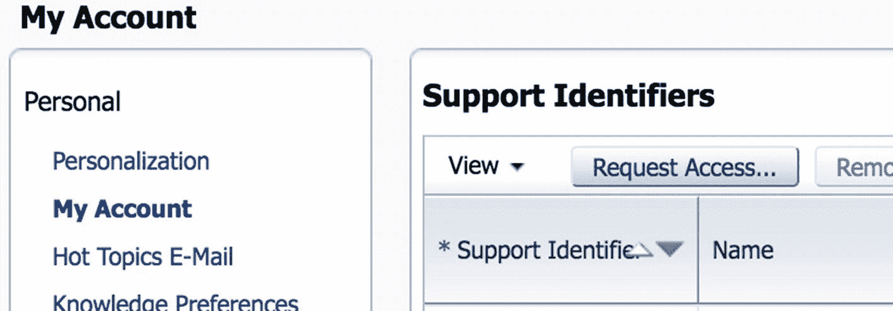
图 15-3

支持标识符

在“支持标识符”部分，您应该能看到与您的 MOS 账户关联的 CSI 号码。点击 `请求访问` 按钮。您将被转到如图 15-4 所示的屏幕，以将该 CSI 添加到您的账户。

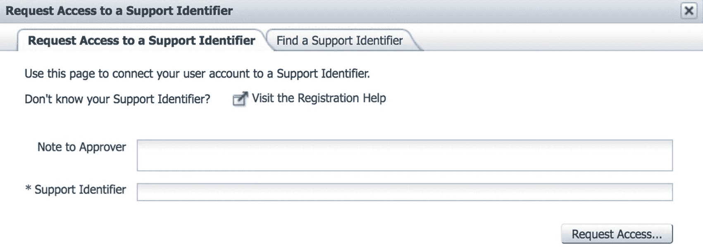
图 15-4

添加新 CSI

输入您需要访问的 CSI 值。系统将自动向您组织中的 CSI 管理员发送一封电子邮件。

CSI 管理员需要前往 MOS 中相同的 `设置` 标签页，并点击 `待处理的用户请求` 链接以批准您的访问。一旦获得批准，您就可以将此 CSI 值用于您的需求。

## 仪表板

首次登录 My Oracle Support 时，您将进入如图 15-5 所示的 `仪表板` 标签页。如果您想返回仪表板，只需点击页面顶部的其标签页即可。

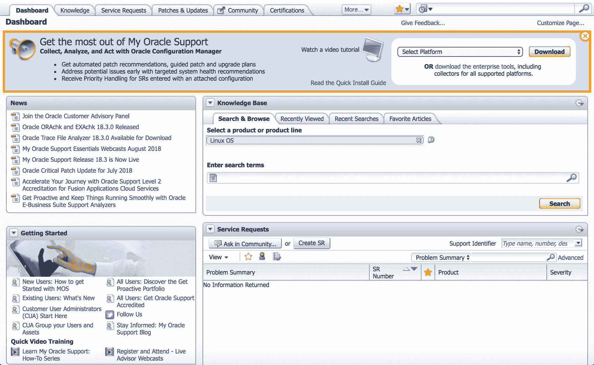
图 15-5

MOS 仪表板

`仪表板` 标签页是一个很好的起点。它包含最新消息、知识库快速搜索、未解决服务请求摘要以及入门指南等部分。

大多数人使用仪表板的默认设置，但您也可以根据需要对其进行定制。在页面的右上角，点击 `自定义页面` 链接。在那里，如果您不想看到某些仪表板面板，可以将其移除。您可以点击 `添加内容` 按钮来添加错误追踪器、补丁搜索等面板。

## 教程视频

在仪表板的“入门指南”部分，有一个标题为“学习 My Oracle Support：操作系列”的链接。我强烈建议您点击该链接，花些时间观看一些关于如何使用 MOS 的视频。这些视频将补充您在本章中阅读的内容。如果您点击该链接，您将看到一个类似于图 15-6 的页面。点击“播放视频”下的任意按钮以了解更多信息。

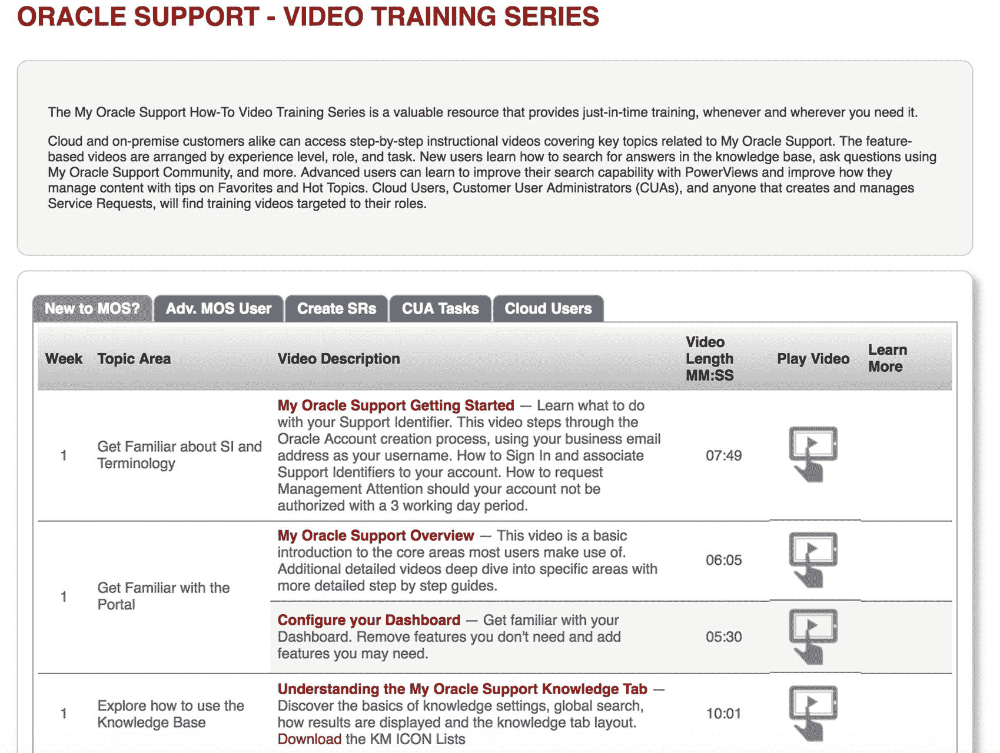
图 15-6

MOS 培训视频

图 15-6 显示了 `MOS 新手` 标签页，它为 My Oracle Support 的新用户提供视频。这里有许多短视频，描述了大部分功能。欢迎点击其他标签页，探索有哪些视频等着您。

## 知识库

当我访问 My Oracle Support 时，知识库是我花费时间最多的地方。如果您遇到问题，而 Oracle 文档或数据字典都无法帮助您解决问题，那么 MOS 知识库通常是您下一个应该查找的地方。

搜索知识库非常容易。它非常类似于使用 Google 或其他搜索引擎进行网络搜索。只需输入您的搜索文本并点击放大镜图标即可开始搜索。您可以在仪表板的“知识库”部分的框中输入搜索文本，也可以点击 `知识库` 标签页。每个页面的顶部都有一个类似于图 15-7 的搜索框。

图 15-7

MOS 搜索框

我通常使用页面顶部的搜索框，因为我知道无论我在 MOS 中的哪个位置，它总是在那里。搜索框左侧的下拉菜单会显示您最近的搜索词历史。

与进行任何网络搜索一样，您的术语越具体，获得相关命中结果的机会就越大。如果您只搜索“Oracle”，您将得到大量结果，其中许多可能对您的问题没有帮助。将您的确切错误消息复制并粘贴到搜索框中通常很有帮助。

图 15-8 显示了使用错误消息进行的一次搜索结果。搜索文本仍在框中。

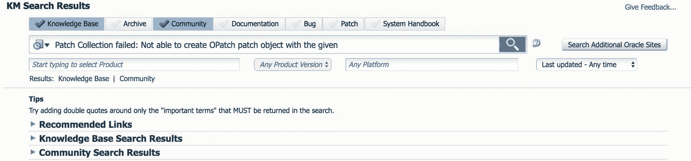
图 15-8

知识库搜索结果

MOS 会将搜索命中结果分解为不同的部分。在图 15-8 的示例中，这些部分是“推荐链接”、“知识库搜索结果”和“社区搜索结果”。点击蓝色三角形可展开每个部分。在图 15-8 的顶部，您会在 `知识库` 和 `社区` 旁边看到一个绿色复选标记。您可以点击该绿色复选标记将其关闭，并从结果中移除来自这些区域的命中结果。再次点击复选标记可显示结果中的命中项。

如果我在图 15-8 中点击 `知识库搜索结果` 旁边的蓝色三角形，然后点击第一个命中项，我将被带到如图 15-9 所示的 My Oracle Support 注释页面。MOS 中的每个文档都称为一个注释，并且都有一个 ID 号。在图 15-9 的示例中，我正在查看 MOS 注释 `1475147.1`。在 Oracle 支持的早期，注释是通过其文档 ID 或简称 Doc ID 来引用的。您可能仍然会看到人们引用 Doc ID 而不是 Note。即使在图 15-9 中的文章也写着“Doc ID”。如今的 Oracle DBA 会将 Doc ID 和 Note 互换使用。

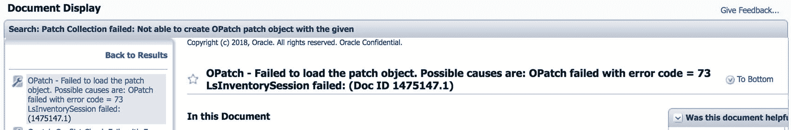
图 15-9

MOS 文档

在 My Oracle Support 之外披露 MOS 注释的内容是违反您的支持协议的。您会在图 15-9 中注意到，我只包含了标题，而没有包含文档的实际内容。另请注意页面顶部的“Oracle 机密”字样。

## 显示文档与书签功能

当你从搜索结果显示文档时，有两点需要注意。首先，左侧列出了符合你搜索条件的文档列表。你可以利用它轻松跳转到下一个感兴趣的文档，而不必在搜索结果和文档之间来回切换。当然，你也可以选择返回搜索结果。其次，注意文档标题左侧的空心金色星标。点击该星标即可为文档添加书签，如图 15-10 所示。

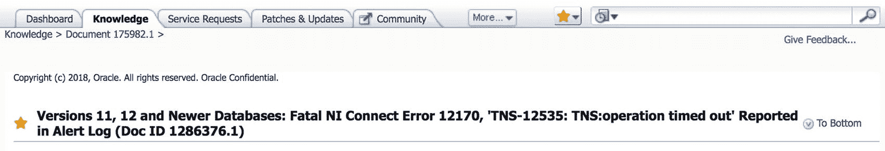

图 15-10  
MOS 书签功能

你会看到文档标题旁的金色星标现在变成了实心，表示已添加书签。那么在哪里访问你的书签呢？请看屏幕顶部搜索框的左侧。你应该能看到一个金色星标的下拉菜单。点击该金色星标，然后选择`Documents`即可查看你已收藏的书签。随着书签越来越多，你可能希望按主题进行组织。在同一个下拉菜单中，你可以选择`Manage Favorites`来创建文件夹以便更好地管理。

## 知识库使用建议

正如我之前所说，在使用 MOS 时，我花费大量时间在知识库中。如果我无法解决问题，通常其他人也遇到过相同情况，并且 Oracle Support 已将其记录下来供你查阅。这为每个人都节省了大量时间。如果你能阅读 MOS Note 并自行解决问题，Oracle Support 就无需花费时间与你一对一沟通，而你也不必等待 Oracle Support 来处理。如果你还记得第 13 章关于 Oracle 文档的内容，我提到过，当你寻求帮助时，最好表明你已提前做了一些工作。就像我们不应该问“RTFM”（请阅读手册）问题一样，我们也不应该提出那些通过简单 MOS 搜索就能找到答案的简单问题。请做好你自己的功课，为包括你自己在内的每个人节省时间。

像任何类型的搜索一样，你在 MOS 中搜索得越多，就会越熟练。你的搜索越具体，结果就越好。不要搜索“ORA-700”；相反，如果你的错误信息显示的是“ORA-700 [kesqsMakeSql-invstat:elpsTime]”，就应该搜索这个完整信息。那些括号内的文本具有很高的唯一性，能非常迅速地缩小结果范围。

## 服务请求

假设你遇到了一个无法解决的问题。Oracle 文档中没有任何帮助。你在 MOS Notes 中搜索了一个小时，没有一个真正解决你的问题或回答你的疑问。下一步通常是执行谷歌搜索。如果那也不成功，你该向谁求助？通常，最后的选择是向 Oracle Support 提交一个服务请求。在 MOS 中，点击`Service Requests`选项卡。你的屏幕应如图 15-11 所示。

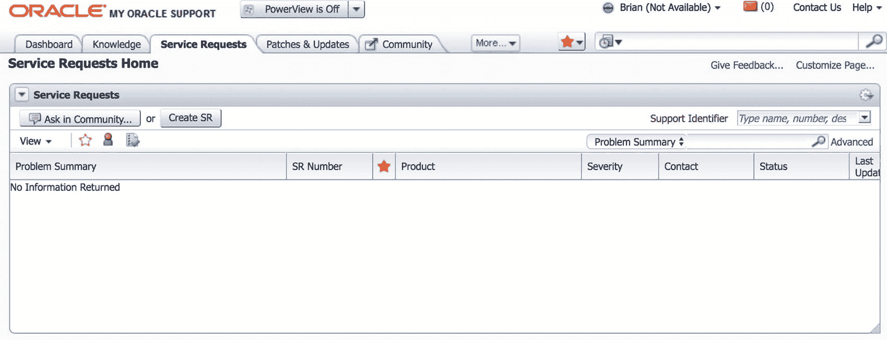

图 15-11  
MOS 服务请求选项卡

在服务请求选项卡中，你可以看到未解决的 SR 列表。你也可以点击`Create SR`按钮。当你创建一个新的服务请求时，系统会要求你提供一系列信息，以便将请求分配给正确的支持分析师。也许最重要的是确定你请求的严重级别，如图 15-12 所示。

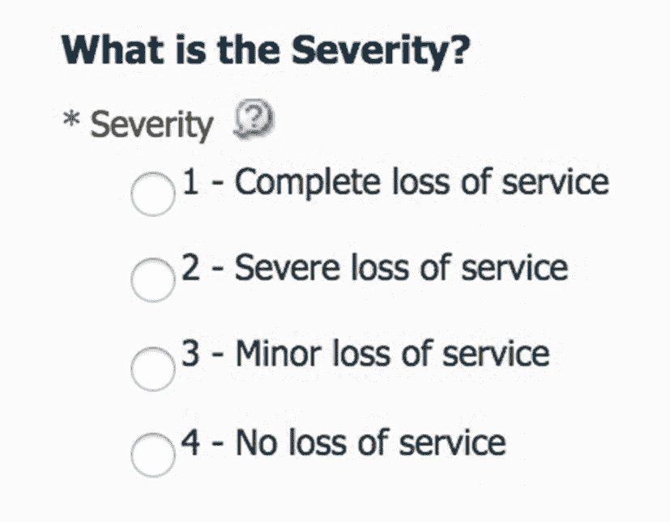

图 15-12  
SR 严重级别选项

如果这是一个生产系统，并且你完全丧失了服务，请选择严重级别为`1`。被归类为`Sev 1`的服务请求会立即获得 Oracle Support 的关注。如果你有`Sev 1`请求，请确保在 Oracle 回复你时能够及时响应。你的服务请求中很少有属于`Sev 1`或`Sev 2`类别的。大多数问题的严重级别较低。

选择严重级别后，你需要描述问题。如果你有确切的错误信息，请包含它们，这将有助于初步诊断。在图 15-13 中，我正在为生产环境中一个特定的`ORA-600`错误提交服务请求。

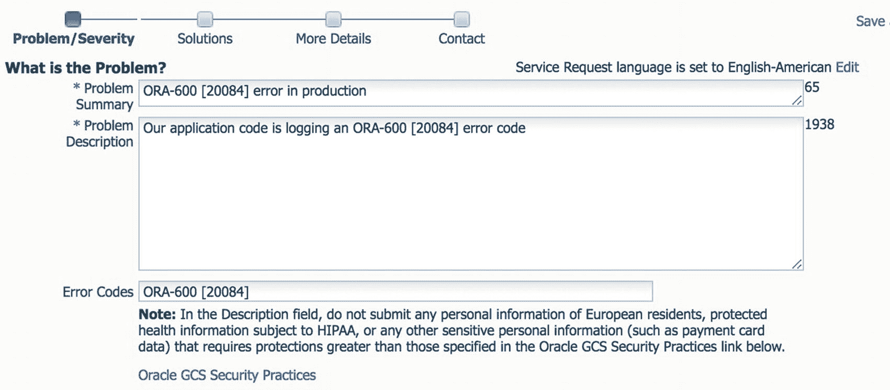

图 15-13  
SR 问题摘要

接下来，你需要提供一些关于问题所在位置的详细信息。在`Product`框中，开始键入产品名称。弹出菜单会显示与你键入内容匹配的产品。在图 15-14 中，我键入了“database”，并能够选择`Oracle Database Enterprise Edition`产品。

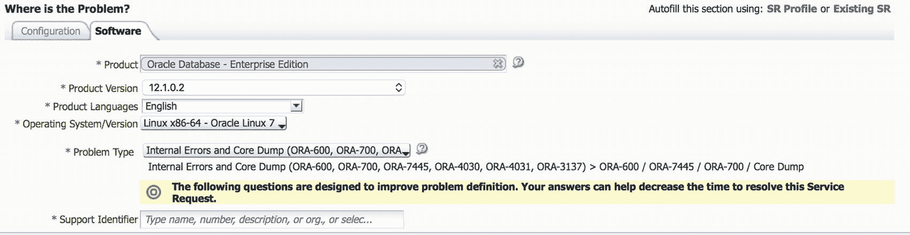

图 15-14  
SR 问题区域

选择产品后，你可以在`Product Version`字段中选择该产品的特定版本。务必包含版本号，因为某些问题可能特定于某个版本。在图 15-14 中，我选择了版本`12.1.0.2`。然后，我从`Operating System/Version`下拉列表中选择了`Oracle Linux 7`。

填写这部分最困难的部分是从`Problem Type`下拉菜单中选择正确的问题类型。问题类型是决定哪位 Oracle 分析师接收你问题的标准之一。如果选择错误，服务请求的处理时间可能会更长，因为接收问题的分析师需要确定将请求转交给谁。在选择之前，请仔细阅读所有问题类型。最后，在`Support Identifier`字段中输入你的`CSI`号码。如果你将光标放在该框中，弹出菜单会显示你可以访问的所有`CSI`号码。

当您准备好后，点击`下一步`按钮。在过去，提交一个服务请求仅此而已。但如今使用 Oracle 支持，您还有更多工作要做。无论好坏，您都需要预先提供更多信息。`MOS`也将查看您提供的信息，以确定是否存在已知的问题解决方案。以我为例，我正在填写一个关于`ORA-600 错误`的`SR`，因此`MOS`向我提出了一个问题，如图 15-15 所示。

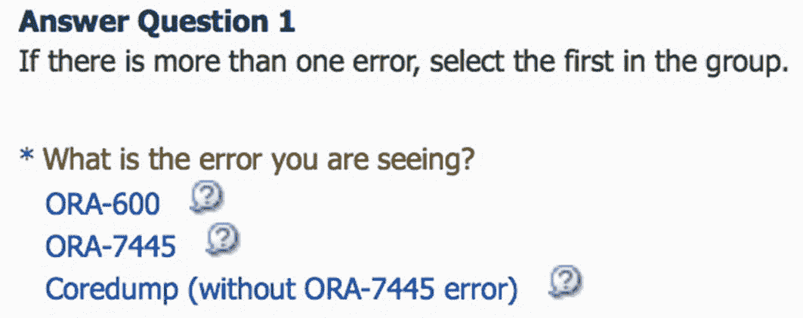

图 15-15

服务请求问题 1

我遇到了`ORA-600 错误`，所以我将点击第一个链接。如果您有不同的问题，您很可能会看到一个完全不同的问题。根据我提供的答案，`MOS`会给我一个它认为能帮助我的`注释`，如图 15-16 所示。

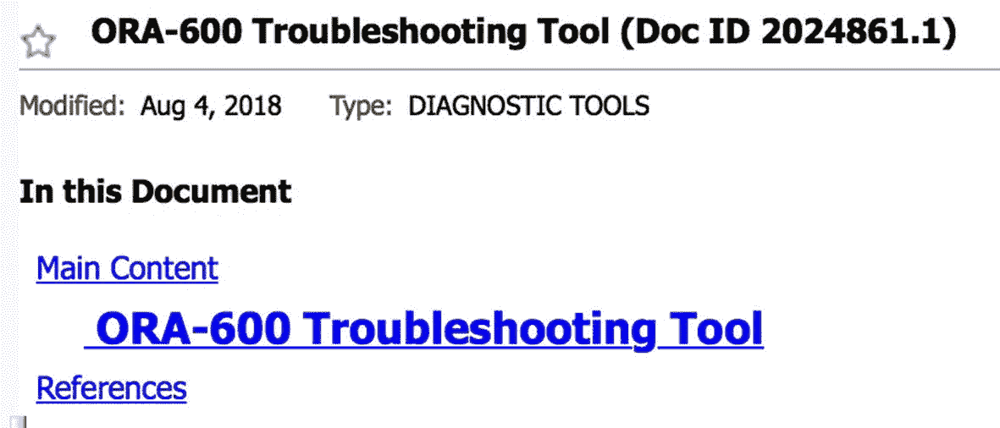

图 15-16

服务请求建议的注释

有时，建议的`注释`就能解决我的问题。有时则不能。这就是为什么在提交服务请求时，您需要做更多工作的一大原因。正如我所说，过去您填写问题陈述后，您的`SR`就创建好了。如今，`MOS`希望尽可能为您和支持分析师节省时间。在询问了您几个其他问题后，您可能一开始就解决了自己的问题。在图 15-17 中，我们可以看到，我们可以让`MOS`知道建议是否解决了我们的问题，或者我们是否想进入下一步。

图 15-17

服务请求导航按钮

如果我的问题尚未解决，我点击`下一步`按钮。下一个屏幕让我提供更多详细信息，以帮助分析师缩小问题的根本原因。图 15-18 显示`MOS`要求为我的服务请求提供更多详细信息。

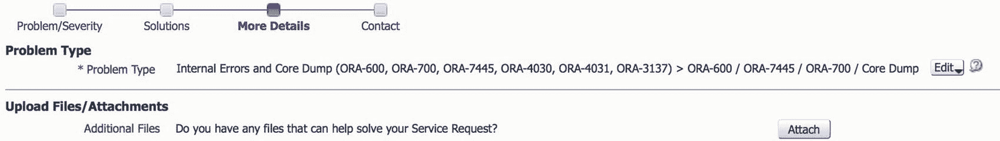

图 15-18

服务请求更多详细信息请求

在这种情况下，`MOS`要求我上传任何可能有帮助的文件。如果数据库创建了任何跟踪文件，现在是将它们上传到`MOS`的时候了。您可能被要求提供的其他详细信息将取决于问题的性质。

当您点击`下一步`按钮时，您将进入`联系人`屏幕。填写您的姓名、电话号码、电子邮件地址和首选联系方式。通常这些信息会根据您的个人资料信息自动填充。然后点击`提交`按钮，您的`SR`现在就进入了系统。

当支持分析师处理您的问题时，他们通常会要求提供额外信息。当他们更新`SR`时，您会通过首选联系方式收到通知。请用请求的信息修改`SR`，并帮助分析师帮助您。

这通常需要一些来回沟通：分析师查看您提供的信息，确定信息不足，然后更新`SR`要求您提供更多拼图碎片。他们可能会要求您尝试一些方法来规避或修复问题。希望这将使您能够满意地解决问题。

## 补丁与更新

`MOS`中的主要选项卡之一是`补丁与更新`。此部分是您可以下载任何所需补丁的地方。通常，您只会在通过服务请求与支持分析师合作时下载补丁。当分析师希望您应用补丁时，他们通常会在`SR`中包含补丁的直接链接。如果您知道补丁编号，可以将其输入补丁搜索字段，如图 15-19 所示。

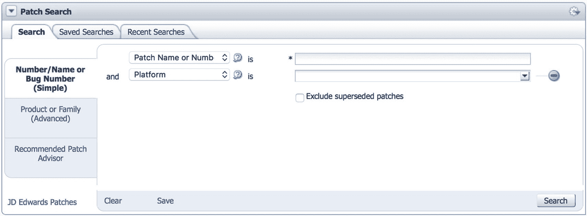

图 15-19

MOS 补丁搜索

虽然不是必须的，但指定平台通常也很有帮助。点击屏幕右下角的`搜索`按钮，您将被带到下载补丁的链接。我们将在第 17 章讨论 Oracle 数据库的打补丁。

## 认证

我经常看到人们问诸如“Oracle 18c 是否支持 Windows 2012？”这样的问题。提问者想知道特定的 Oracle 版本是否通过了特定操作系统的认证。您可以通过`认证`选项卡回答此类问题，该选项卡有一个显示一些快速链接的部分，如图 15-20 所示。

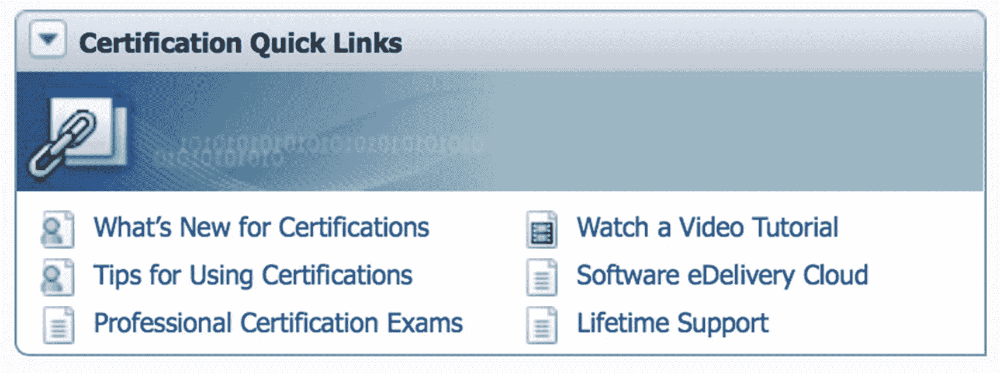

图 15-20

MOS 认证快速链接

花些时间观看教程视频是个好主意。但我们将继续介绍一个示例，说明如何使用`MOS`此选项卡中的搜索功能。在`认证搜索`部分，将鼠标光标放在`产品`框中并开始输入“database”；弹出菜单会让您选择与您输入内容匹配的任何产品。选择`Oracle Database`产品后，如图 15-21 所示，点击`版本`框。您可以选择显示的任何产品版本。在我们的示例中，我们将选择 18.0 版本。现在，将`平台`框保留为默认值`任意`。点击`搜索`按钮。

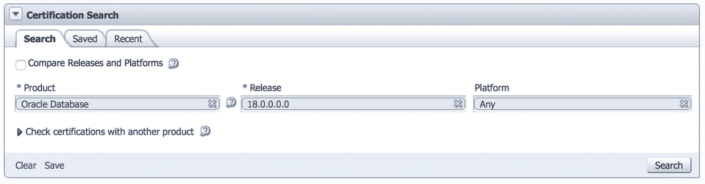

图 15-21

MOS 认证搜索部分

在撰写本文时，Oracle 18c 仅通过了 Linux 和 Solaris 平台的认证。更具体地说，`MOS`显示我，对于 Linux 平台，18c 通过了 SLES12、RHEL 6 和 7 以及 Oracle Linux 6 和 7 的认证。此时，Windows 操作系统并未出现在列表中。因此，回答最初的问题，Oracle 18c 在 Windows 2012 上不受支持。到您阅读本书时，我预计 Oracle 18c 会通过某些 Windows 操作系统版本的认证，因此您的结果可能会有所不同。

再举一个例子，让我们对产品“`Enterprise Manager Base Platform – OMS`”版本 13.3 在任意平台进行认证搜索。图 15-22 中的结果显示了通过认证可以运行此版本 Enterprise Manager 13.3 Cloud Control 的操作系统的一部分。如果我们展开结果的`数据库`部分，会得到更多信息。

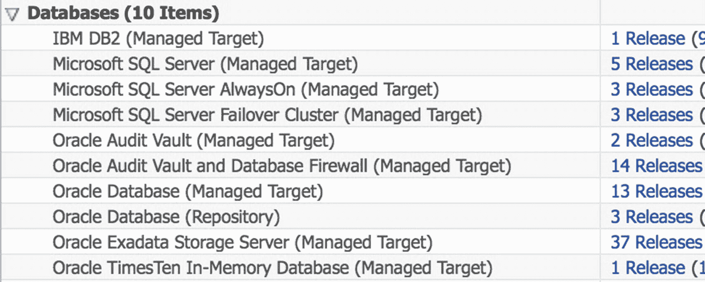

图 15-22

MOS EM 认证结果

我想在图 15-22 中指出的两行是`Oracle Database (Managed Target)`和`Oracle Database (Repository)`。您可以看到只有三个版本被认证为 Enterprise Manager 的仓库数据库。有 13 个不同的版本被认证为`EM`可以监控和管理的受管目标。我特意裁剪掉了右侧的版本号，以免泄露任何只有拥有有效`CSI`编号的人才能访问的特权信息。这个示例的要点是，`认证`选项卡显示的不仅仅是产品可以运行的`操作系统`。如果您搜索`Oracle Client`产品，结果将显示 Client 支持连接到哪些 Oracle 数据库版本。

## 相对时间

默认情况下，My Oracle Support 显示所谓的“相对时间”。它不会给我一个具体日期，而是显示“2 天前”之类的信息。请看图 15-23，其中展示了 MOS 中多个服务请求的日期。

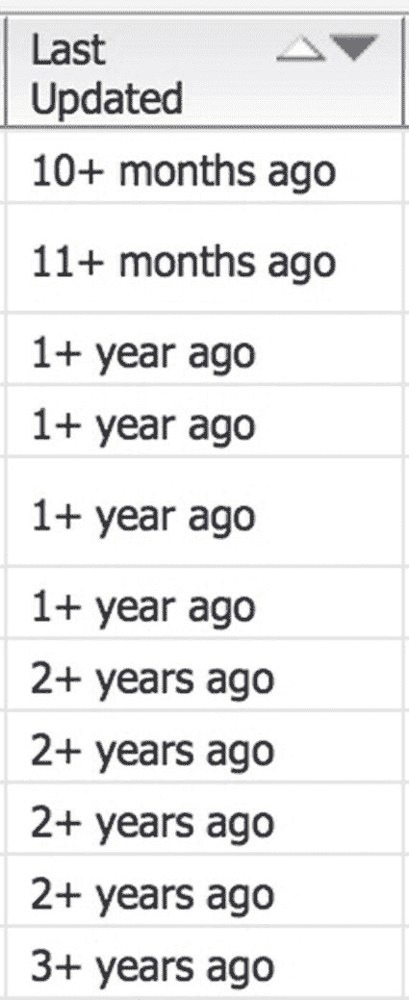
图 15-23
MOS 相对时间

这取决于个人偏好，但对我来说，“1+ 年前”这样的描述不够具体。那是 12 个月前吗？还是加号表示可能是 18 个月甚至 23 个月前？我倾向于显示确切的日期。在`查看`菜单中，您可以取消选中`显示相对时间`，之后您就会看到如图 15-24 所示的日期。

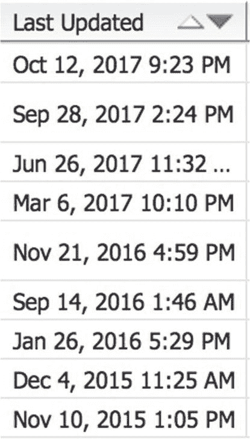
图 15-24
MOS 常规时间

在我看来，这样看起来更好。然而，您的偏好可能不同，这就是 MOS 给我们提供这个选项的原因。

如果您在`服务请求`标签页中开启了相对时间显示，那么在查看某个服务请求的详细信息时，这个设置也会延续。在图 15-25 中，服务请求历史记录的每个条目上显示的日期都是十个月或更久之前的相对时间。

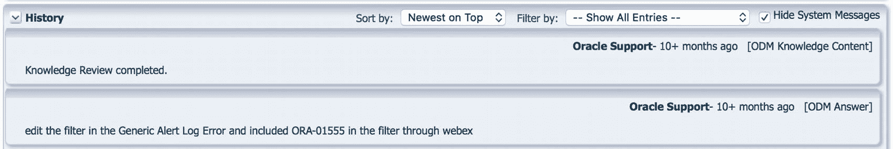
图 15-25
SR 中的 MOS 常规时间

如果您想看到确切的日期，您必须回到`服务请求`标签页，关闭相对时间显示，然后重新进入该服务请求。

如前所述，相对时间显示默认是开启的。我在本书中提到这一点，是因为如果您有不同的偏好，其控制方法并不显而易见。

## 继续前进

本章继续聚焦于如何自主学习。请记住，没有任何单一来源（甚至包括本书）能教会您推进 DBA 职业生涯所需的一切知识。您将需要查阅 Oracle 文档、数据字典，甚至可能还需要用到 My Oracle Support。对于拥有有效 Oracle 支持合同的用户来说，MOS 是一个极好的资源。

在下一章中，我们将继续探讨如何学习学习。下一章将讨论社交媒体及其在当今 Oracle DBA 职业生涯中的作用。社交媒体是紧跟快速发展的 Oracle 生态系统的重要途径。即使 My Oracle Support 让您失望时，它也是寻找答案的好方法。

