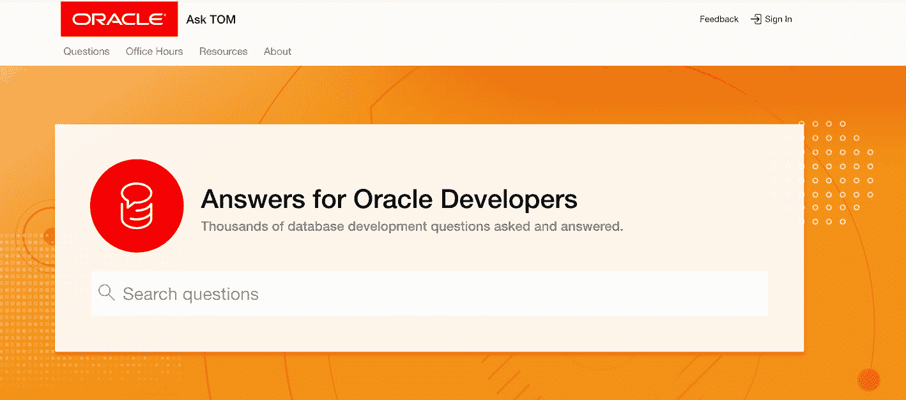

# 16. 社交媒体

在第 13 章中，我们讨论了如何利用 Oracle 文档来解答我们可能遇到的许多问题，并了解更多关于 Oracle 数据库引擎如何工作的知识。在接下来的章节中，我们发现了数据字典，并探索了它如何解答关于我们的特定 Oracle 数据库包含内容的问题。第 15 章讨论了 My Oracle Support，这是您在整个 Oracle DBA 职业生涯中获取问题答案的另一个资源。在本章中，我们将探讨社交媒体在协助当今数据库管理员方面所扮演的角色。社交媒体并非 Oracle DBA 专属。如果您使用其他平台，您也可能会发现本章中的信息同样有益。

当我最初为本书起草大纲时，我将本章安排在关于 My Oracle Support 的那一章之前。我听过很多人说他们会先使用社交媒体平台，只在最后万不得已时才使用 My Oracle Support。这种观点产生的原因是，My Oracle Support 在响应服务请求方面声誉不佳。很多时候，服务请求需要很长时间，而且似乎看不到问题解决的希望。就我个人而言，我与 MOS 有过不愉快的经历，不得不依赖社交媒体来寻找答案。

在我撰写本书时，我调换了社交媒体和 My Oracle Support 章节的顺序。做出这个与初稿不同的调整有两个原因。第一，除了服务请求，MOS 拥有一个强大的知识库，并且是您应该获取补丁和更新的唯一渠道。第二，社交媒体常常包含错误信息。尽管 MOS 存在问题，但它是一个权威来源，其中的信息非常可靠。随着时间的推移，您将学会何时利用 MOS，何时转向社交媒体。

## 社交媒体定义

什么是社交媒体？社交媒体包含了所有促进信息、思想和职业创建与共享的计算机技术。当人们想到社交媒体时，他们通常会想到像 Facebook、LinkedIn 和 Twitter 这样的平台。这些平台根据人们的共同兴趣将他们联系起来。Facebook 最初旨在连接家人和朋友，但企业用它来连接客户。LinkedIn 的创立是为了连接求职者和潜在雇主，但人们现在更频繁地用它来分享想法和讨论与职业无关的内容。Twitter 的创立是为了向可能想听您说话的人发送简短消息，但如今它已发展成一个在新闻事件发生时获取新闻信息的平台。

社交媒体平台随着时间的推移而演变，我们的职业生涯也是如此。虽然社交媒体平台的创建者可能设计他们的系统时有特定的意图，但用户才是使其满足自身需求的人。创建者通过为用户提供更好的体验来满足他们的需求作为回应，平台也随之进化。

当我最初进入信息技术领域时，互联网主要是一个研究项目。获取任何信息的最佳方式是阅读供应商提供给您的所有手册。当我刚开始接触 Oracle 数据库时，Oracle 公司会寄给客户一个装满纸质手册的盒子，并附带安装 Oracle 软件的 CD。随着时间的推移，Oracle 开始以电子版形式提供手册，客户可以将文档集安装在自己的电脑上。与许多供应商一样，Oracle 停止了其文档纸质书籍的发货。

技术改变了我们的工作方式，现在大多数文档都通过互联网访问。软件供应商建立了支持门户，这本身就是一种特定形式的社交媒体。您不仅可以访问供应商提供的文档，支持门户还允许您提问、阅读最佳实践等等。尽管仅限于拥有有效支持合同的用户，My Oracle Support 可以被视为一种社交媒体形式，但对于 Oracle DBA 来说非常重要。鉴于其重要性，我在本书中用一整章，即第 15 章，专门讨论了它。

因为事物在发展，*社交媒体*这个术语的定义也将随之演变。在本章中，我们将探讨的不仅仅是传统的社交媒体平台。本章将扩展社交媒体的含义，涵盖搜索引擎、博客、论坛，以及通过会议和用户组进行的交流。虽然其中一些并非真正的社交媒体平台，但它们对于您职业生涯的成功仍然至关重要。


## 搜索引擎

我将大量时间花在使用搜索引擎寻找答案上。我家附近的五金店营业到几点？莱昂内尔·梅西多大了？鸡蛋要煮多久？只需将问题输入你最喜欢的搜索引擎，你就能知道答案。人们在互联网上放置了海量信息，而搜索引擎是通往所需信息的门户。

在我的职业生涯中，唯一变化的是问题本身。Oracle 错误 `PRVG-2027` 是什么意思？当 `.patch_storage` 目录变得过大时，我该怎么办？Oracle 7 是什么时候发布的？如何创建一个多租户数据库？

通常，当人们想到搜索引擎时，他们指的是谷歌。其他搜索引擎也存在，但谷歌占据着至高无上的地位。你可以根据喜好使用雅虎、必应或其他引擎。它们都通向同一个互联网。谷歌之所以最常用，是因为它被认为能为你的搜索提供最相关的结果，但谷歌并非完美。如果谷歌没有找到你想要的东西，你可能需要使用其他搜索引擎。某些搜索引擎在特定地区表现更好。例如，在中国，你可能会使用百度。

无论你使用哪种搜索引擎，你的搜索词越具体，搜索结果可能就越相关。如果你搜索“Oracle”，可能不会得到任何有助于解决外键约束问题的结果。如果你搜索“oracle foreign key”，你会得到大量关于如何创建外键的相关结果，但如果你在寻找禁用外键的解决方案，那你就找错方向了。相反，搜索“oracle disable all foreign key constraints on a table”，你的搜索会更成功。你的搜索词越具体，你就能越快找到所需内容。

我通常使用的一个技巧是在搜索词中包含数据库平台。如果我搜索“disable all foreign key constraints on a table”，谷歌的前两个结果返回的是关于 SQL Server 平台的信息。在搜索词中添加“Oracle”一词，可以更快地将结果缩小到我的平台。有时你还需要包含你的 Oracle 版本。搜索词“oracle 12.2”将确保不会出现来自旧版 Oracle 10.1 的结果。包含平台及其版本是一个帮助获得最相关搜索结果的小技巧。

很多时候，你需要在搜索词中包含与你的问题相关的多行内容。有一次，在尝试修补 Oracle 数据库时，我遇到了如代码清单 16-1 所示的问题。

```
Queryable inventory could not determine the current opatch status.
Execute 'select dbms_sqlpatch.verify_queryable_inventory from dual'
and/or check the invocation log
/u01/app/oracle/cfgtoollogs/sqlpatch/sqlpatch_25889_2016_11_09_22_26_12/sqlpatch_invocation.log
for the complete error.
Listing 16-1
Example Problem
```

我不确定如何解决这个问题。我试着确定上述输出中的哪条信息可以作为一个好的搜索词。第一行看起来很通用，所以可能没用。第二个链接包含了一些具体的东西，`dbms_sqlpatch.verify_queryable_inventory`，所以我将其用作我的搜索词。不幸的是，结果与我的问题无关。当我查看上述输出中提到的日志文件时，我看到了代码清单 16-2 所示的附加信息。

```
verify_queryable_inventory returned ORA-20008: Timed out, Job
Load_opatch_inventory_1execution time is
more than 120Secs
Queryable inventory could not determine the current opatch status.
Listing 16-2
Example Problem Log File
```

现在我有了更具体的信息。我的搜索词现在是“`dbms_sqlpatch.verify_queryable_inventory` ORA-20008 Timed Out”。通过使搜索词非常具体，我可以尽快锁定最相关的结果。

对于许多读者来说，这些建议可能看起来是常识。然而，我发现，那些在网络搜索中找不到相关信息的人，往往使用的是过于笼统的搜索词。例如，如果你在搜索中包含任何错误代码，会很有帮助。如果搜索结果仍然过于宽泛，那么可以同时包含错误代码和错误信息，因为有些错误可能有多种信息。如果你的问题涉及多个错误代码，请将它们全部包含在搜索词中。所有这些都是我多年来在网上研究问题时学到的技巧。


## 博客

博客是一种网站，你可以在上面发布任何想要的内容，通常用于分享信息或发起讨论。博客作者撰写文章并将其发布到网站上。文章通常按照发布日期的倒序排列，最新的文章在顶部。

正如你将在本节后面看到的，我强烈建议所有读者为自己的数据库职业生涯开设一个博客。在你的职业生涯中，随着你的成长，你的博客的性质和范围也会发生变化。最终，你会找到自己的定位，并为全球社群提供有价值的内容，供大家欣赏。

### 博客平台

两个最常用的博客网站是 Blogger（ [`www.blogger.com`](http://www.blogger.com) ）和 WordPress（ [`www.wordpress.com`](http://www.wordpress.com) ）。这些网站都包含一个编辑器，让你可以快速轻松地创建内容。你可以从许多预定义的主题中选择，让博客的外观和风格符合你的个性。两个平台都允许免费托管博客。许多互联网服务提供商也提供在其他系统上托管你自己博客的功能。

### 开设博客的理由

许多人出于多种原因开设博客。在我最初几年的生涯中，博客还不存在。过了一段时间，网络搜索总是将我引向别人开设的博客。随着时间的推移，我了解到博客都始于作者想要分享的东西。当我作为一名数据库管理员写博客文章时，通常属于以下三类之一：

*   每当我解决了一个棘手的问题，我会写一篇博客文章，详细说明问题的具体情况以及我解决它所做的工作。
*   每当我学到新东西，我会写一篇博客文章，展示新概念的实际应用。我会尽量包含我在学习过程中学到的任何技巧，而这些在文档中并未写明或显而易见。
*   有些事情在我脑海中盘旋，我想与人们分享。

你会发现大多数与数据库相关的博客文章都属于这几类。当然，规则总有例外，你也可以让你的博客独具一格。写博客的一个很棒之处在于，作者自己定义内容。你可能对博客有一个与我上面所列举的不同的想法。

我鼓励所有读者开设自己的博客。除了与广大数据库社区分享信息这种利他的努力之外，写博客也有其利己的原因。如果你阅读我的博客并从中有所收获，那太好了！然而，我也是为自己而写博客。

### 写博客的个人益处

我写博客的一个原因是，将自己的想法写下来能加深我自己的理解。每当我必须写点什么并向他人解释时，我对该主题的理解会比我不写任何东西时更深入。人脑中会发生一些奇妙的事情：简单地向他人讲述内容的行为会让你自己更好地理解它。对许多人来说，写作也有助于他们更容易地记住主题。

我写博客的第二个原因是，我的博客是我个人文档的一部分。Oracle 文档不可能解释一切。它涵盖了很多，但文档中也有一些遗漏。例如，当 Oracle 12c 引入标识列（IDENTITY columns）时，这个功能与 SQL Server 中早已可用的功能非常相似，关于这个新功能我学到了一些东西。五年前，我写了一篇关于这个主题的博客文章。随着时间的推移，我无法记住我学到的确切细节，于是我参考自己的博客文章来提醒自己具体内容。我并不需要牢牢记住那篇博客文章中的每一条信息；我只需要记得我写过它，并且可以轻松地查阅。只需在谷歌上快速搜索“ [`www.peasland.net`](http://www.peasland.net) identity”，我就能很快找到我博客中的相关条目。

正如我在本节前面提到的，每当我解决了一个棘手的问题，我常常会写一篇博客文章。在我的职业生涯中，我遇到过一些无法通过 My Oracle Support 或谷歌搜索解决的问题。一旦我解决了问题，我知道其他人可能还没见过解决方案，我的解决方案就立即成为博客文章的候选内容。我把细节和解决方案发布到我的博客上。多年来，我收到了许多美好的评论，感谢我的博客文章通过解决他们的问题为他们节省了大量时间，这让我获得了丰厚的回报。

现在，我要透露一个大多数博主不会告诉你的秘密。我的博客对我自己的帮助最大！我无法告诉你我有多少次在博客上详细描述了一个难题。几年后，我又遇到了同样的问题。此时，我已经忘记了我曾经解决过这个问题。我对这个问题完全一片空白。就好像这是我这辈子第一次见到这个问题。我在 My Oracle Support 上快速搜索了一下，没有看到任何针对我这个问题的解决方案。我转向谷歌，搜索我的具体问题，果然，在搜索结果的最顶部附近，就是我很久以前写的一篇博客文章。我点击链接进入我自己的博客，那篇文章精确地描述了我现在遇到的问题，甚至还给出了一个不错的解决方案。然而，我甚至不记得自己写过那篇博客文章。所以，“写作有助于记忆”这个说法，在我这里可真是打了个大大的问号。


### 小贴士

今天就开始写博客吧。你的职业道路自然会越走越宽。

虽然为了分享和帮助他人而写作无疑是件高尚的事，但它同样会对你的职业生涯有所裨益。大多数博主都不太愿意承认他们的博客活动中带有一点利己的成分，但这确实存在。除了之前提到的写博客的好处，你可能还会看到职业上的成长。我个人就曾被网络杂志联系，邀请我为他们撰写内容，部分原因就是他们读了我博客上的文章。我知道有些数据库管理员通过博客盈利，靠发布广告获得收入。如果你是一名独立顾问，写博客将是必不可少的，因为客户可以借此评估你的专业水平。

今天就开始建立你自己的博客吧。如前所述，你可以免费使用 `Blogger` 或 `WordPress`。起初，你可能会苦于不知写什么好。写得越多，你越能找到自己的风格，而且我保证，你的 `Oracle` 职业生涯也会随之成长。写博客不一定非常耗时。你可以随心所欲地决定更新频率，或疏或密。我经常是间歇性地写，一个月发几篇，然后沉寂一段时间。有些博主则更有规律，尽量做到每周至少发一篇。

网上有很多优秀的博客值得关注。以下是一些供你参考的选择。我关注了所有这些博主，并从他们身上学到了很多东西。

*   Brian Peasland ( [`www.peasland.net`](http://www.peasland.net) )：当然是我的博客！
*   Connor McDonald ( [`https://connor-mcdonald.com`](https://connor-mcdonald.com) )：`Oracle` 员工，是广受欢迎的 `Ask TOM` 网站背后的核心推动者之一。
*   Jonathan Lewis ( [`https://jonathanlewis.wordpress.com`](https://jonathanlewis.wordpress.com) )：全球首屈一指的 `Oracle 优化器` 工作原理专家。
*   Tim Hall ( [`https://oracle-base.com/blog`](https://oracle-base.com/blog) )：Tim Hall 在展示关于如何使用 `Oracle` 的几乎所有知识方面都做得非常出色。
*   Jeff Smith ( [`www.thatjeffsmith.com`](http://www.thatjeffsmith.com) )：`SQL Developer` 工具的 `Oracle` 产品经理。这个博客总是提供关于如何充分利用该产品的绝佳技巧。
*   Mike Dietrich ( [`https://mikedietrichde.com`](https://mikedietrichde.com) )：负责补丁和升级的 `Oracle` 产品经理。

如果您的博客未上榜，请不要感到不快。以上只是我定期关注的几个博客，作为你入门的一个绝佳推荐。随着你在职业生涯中不断进步，并在数据库社区中建立人脉，你会了解到其他有用的博客，你可能也想关注。

几乎所有博客都提供注册 `RSS` 订阅的功能。`RSS` 能让你及时获知博客的更新。你需要一个能处理 `RSS` 订阅源的新闻阅读器。我使用一个叫做 `NewsBlur` 的产品，它需要支付少量年费。市面上还有其他新闻阅读器，有些甚至是免费的。我早上会查看新闻阅读器，看看有哪些新博客文章等我阅读，而不是逐个访问每个博客，结果却发现很多博客当天并没有新内容。

## Twitter

`Twitter` 是一个社交媒体平台，用于向多人（称为关注者）发送消息。你可以关注任何拥有 `Twitter` 账户的人，任何人也可以关注你。当你发送一条消息（称为推文）时，所有关注你的人都会在他们的 `Twitter` 信息流中看到它。同样，你的信息流也会显示你所关注者的推文。

就在不久前，推文还被限制在 140 个字符以内，这意味着信息需要非常简洁。如果有人想发布更长的消息，他们会将其作为图片或视频发送。由于消息长度较短，`Twitter` 通常最适合向你的关注者受众发布新闻。

什么构成新闻可能因人而异。一些 `Oracle` 专业人士认为他们选择的早晨咖啡就是新闻。另一些人则认为告诉我他们午休时间跑了多少英里很重要。就我个人而言，我不认为那是新闻，即使他们可能是顶尖的 `Oracle` 专业人士，我也倾向于不在 `Twitter` 上关注这类人。同样，你也不会看到我在 `Twitter` 上谈论我的非职业生活，但正如俗话所说，人各有志。你可能会发现，更多地了解一个人的非 `Oracle` 日常是建立联系和 bonding 的绝佳方式。你可以让 `Twitter` 按你想要的方式运作，无需认同我对此的看法。

我关注的 `Twitter` 账户通常分为两类：个人和公司。以下是我关注的部分个人账户（并非详尽列表）：

*   Mike Dietrich (`@MikeDietrichDE`): 负责升级和补丁的 `Oracle` 产品经理
*   Christian Antognini (`@ChrisAntognini`): `Oracle` 性能专家
*   Franck Pachot (`@FranckPachot`): `Oracle DBA`
*   Markus Michalewicz (`@OracleRACPM`): `Real Application Clusters` 的 `Oracle` 产品经理
*   Tim Hall (`@oraclebase`): 我关注其博客的同一个 Tim Hall
*   Jeff Smith (`@thatjeffsmith`): `SQL Developer` 的 `Oracle` 产品经理
*   Jonathan Lewis (`@JLOracle`): `Oracle 优化器` 专家

以下是我关注的公司 `Twitter` 账户：

*   Orachrome (`@orachrome`): 出色的 `Oracle` 性能调优产品 `Lighty` 制造商的 `Twitter` 账户
*   Oracle DB Support (`@OracleDBSupport`): `Oracle Support` 的 `Twitter` 账户
*   Oracle SQL Developer (`@OracleSQLDev`): `Oracle SQL Developer` 产品的 `Twitter` 账户
*   Oracle VirtualBox (`@virtualbox`): `Oracle VirtualBox` 产品的 `Twitter` 账户

我关注的账户还有很多。这个列表只是一个示例。我目前关注了 88 个不同的 `Twitter` 账户。我知道有人关注的比我多得多。一旦你开始关注几个账户，`Twitter` 会推荐其他账户给你关注。如果你愿意，请随时在 `Twitter` 上关注我，账号是 `@BPeaslandDBA`。

`Twitter` 不是寻求帮助的好资源，尽管我看到有人试图用它来解决问题。这个平台不容易支持详细深入的来回讨论。幸运的是，我们有更好的平台来解决问题。


## 询问 TOM

几乎每位 Oracle 专业人士都曾在某个时候使用过 Oracle 的 Ask TOM 网站。许多年前，Oracle 公司聘请了一位名叫 Tom Kyte 的顾问。除了被派往客户现场解决 Oracle 问题外，Tom Kyte 还建立了一个网站，你可以向他提问，Ask TOM 由此诞生。你可以访问该站点：`https://asktom.oracle.com`。该网页已随时间演变，现在看起来如图 16-1 所示。



图 16-1 Ask TOM 主页

在主页上，你可以立即开始搜索问题的答案。不要被标题迷惑。这个站点既适用于数据库管理员，也适用于 Oracle 开发人员。在提出任何问题之前，请务必先进行搜索。很可能在过去已经有人问过同样的问题。

尽管 Ask TOM 站点多年来发生了变化，但所有旧的答案仍然可用。该站点提供了丰富、详细且包含大量示例的问答历史记录。请将此网站加入浏览器书签并经常使用，尤其是在你遇到 Oracle 问题卡住时。

2016 年，Tom Kyte 从 Oracle 公司退休。Oracle 不希望 Ask TOM 这一资源消失，因为它对全球 Oracle 社区来说已变得非常宝贵。在 Tom Kyte 退休之际，Oracle 转向了其他员工，即 Connor McDonald 和 Chris Saxon，来维持该站点的运行。不久之后，他们扩展了站点，纳入了许多各自领域专长的员工。`Ask TOM` 不再指代特定个人，而是被重新命名为 `Ask TOM` 或 Ask The Oracle Masters。Oracle 公司仍使用相同的名称，但更改了品牌以反映这是一个专家团队，而非特定个人。

如果你试图获取与 Oracle 相关问题的答案，并且搜索 `Ask TOM` 档案库没有找到任何相关内容，你可以发布自己的问题。只需点击“Questions”选项卡并填写所需信息即可。

## 讨论论坛

讨论论坛是与全球 Oracle 专业人士互动的好方法。在这些论坛中，你可以提出问题并就问题来回讨论，直到找到解决方案。如今的讨论论坛通常通过网络浏览器访问。市面上有很多讨论论坛，但在我看来，只有少数几个拥有可观的流量，值得关注。

`Oracle-L` (`www.freelists.org/list/oracle-l`) 已经存在了很长时间。这实际上是一个讨论列表。访问上面的 URL 订阅该列表，你将通过电子邮件收到每一条更新。如果你选择订阅 `Oracle-L`，请务必设置电子邮件规则，将这些邮件路由到一个文件夹，而不是堵塞你的收件箱。你回复讨论串的方式是回复你收到的电子邮件。`Oracle-L` 设计于讨论论坛实现网络化之前。虽然按照今天的标准，与讨论组的交互方式有点过时，但这个讨论列表值得一提，仅仅是因为在那里回答问题的人才水平很高。

`Oracle Groundbreakers` 论坛 (`https://community.oracle.com/community/technology_network_community`) 在更名之前曾被称为 Oracle Technology Network (OTN) 社区。`Oracle Groundbreakers` 是一个免费使用的讨论论坛。你只需要一个 Oracle 单点登录账户即可访问。你可能在本书前面下载 Oracle 软件以创建测试平台时创建过这个账户。

`My Oracle Support Community (MOSC)` (`https://community.oracle.com/community/support/`) 是另一个基于网络的讨论论坛。该站点与 Oracle Developer Community 集成。如果你访问这两者，本质上你使用的是同一个站点。这很方便，因为不必从一个站点跳转到另一个站点。当你订阅任一站点中的讨论空间时，新内容会出现在同一个收件箱中。

如果有两个站点并且它们是集成的，那为什么还要有两个站点呢？`Oracle Groundbreakers` 面向所有人，对公众开放。`MOSC` 则面向拥有付费 Oracle 支持合同的 Oracle 客户，因此得名。你甚至可以从 My Oracle Support 内部通过点击 Community 选项卡进入 `MOSC`。当你在 `MOS` 中创建服务请求时，你可以选择通过点击 Community 中的提问按钮来在 `MOSC` 中发起讨论，如图 16-2 所示。


图 16-2 MOS “在社区中提问”按钮

这两个网站的主要区别在于，Oracle 支持员工经常会在 `MOSC` 中参与并提供答案。值得庆幸的是，你不必在两者之间做选择，因为它们是集成的并且协同工作得很好。

无论你使用哪个讨论论坛，都需要遵循一些规则。不遵守这些规则将导致众多喜欢攻击新受害者的论坛喷子出现。不幸的是，任何讨论论坛中都有太多粗鲁和居高临下的人。避开他们恶劣态度的最好方式是遵循一些众所周知的准则参与讨论：

*   主题行应包含问题的简要描述，而不是陈述整个问题。
*   发布你的 Oracle 版本。你的版本不是“12c”，而是类似 12.1.0.2 或 12.2 这样的具体版本。很多答案是特定于版本的。了解你的版本能让你获得针对问题的正确答案。未能包含你的版本信息，可能会得到诸如“哪个版本？”这样的简短回复，或者来自论坛喷子的攻击。


- 不要发布 **RTFM** 问题。感谢本书的第 13 章，你现在知道如何使用 Oracle 文档了。如果你能阅读**精细的手册**，你就可以自己回答这些问题。不要通过发布你自己就能查到的问题来浪费志愿者宝贵的时间。
- 不要发布你可以轻易搜索到的问题。本章前面，我们讨论了如何使用搜索引擎寻找答案。如果通过简单的网络搜索就能轻易找到答案，就不应该将其发布到讨论论坛。人们通常会回复"**LMGTFY**"，这是“让我为你谷歌一下”的缩写。他们的回复后面会附上一个指向 [`http://lmgtfy.com`](http://lmgtfy.com) 的链接，展示谷歌搜索结果。
- 如果可能，发布展示你工作的示例代码，并包含哪些部分不工作。例如，如果你正在处理一条 SQL 语句，请发布创建示例表并用示例数据填充它的代码。然后发布无法工作的 SQL 语句，并尽你所能解释它应该如何工作。有了所有这些信息，回复者就可以在他们的数据库中创建该表，并尝试相同的 SQL 语句，从而找出解决问题的方法。
- 发布完整的错误信息。如果你说你收到了一个 ORA-00942 错误，却什么也不提供，你不太可能得到好的答案。请发布收到错误的 SQL 语句，然后将整个错误堆栈复制并粘贴到你的初始帖子中。
- 切勿要求立即帮助或说你的请求很紧急。回答问题的人并非有偿工作。他们是志愿者，他们有自己的工作要做。他们会在有空时回答你的问题。如果你想要立即解决，请向 My Oracle Support 提交服务请求。

当你与这些论坛互动时，请开始作为问题的回答者参与进来。我经常看到有些人只问问题却从不分享他们的知识。当有更多人关注问题时，讨论论坛会变得更好。在你职业生涯的初始阶段，你可能不具备回答很多不同问题所需的技能组合，这是可以预料的。尽管如此，还是尝试回答几个问题。正如我在讨论博客的部分所说，当你尝试以书面形式解释某事时，神奇的事情会发生：你自己实际上学到了更多东西。在讨论论坛中也是如此。你回答的问题越多，你就越能理解 Oracle 是如何工作的。开始时，尝试每天回答一个问题。如果可以找到简单的问题，就从简单的开始。然后逐步提高难度。

回答问题并成为讨论论坛主要参与者的另一个原因是你将非常熟悉 Oracle 文档。我通常只需点击几下鼠标就能在 Oracle 文档中查找到我需要的任何东西，因为我知道确切该去哪里查找。直到我开始回答问题，我才更善于知道如何使用文档。当我回答一个问题时，我会尽量包含指向文档相关部分的链接。这样，读者可以找到更多信息。找到那个链接确实需要额外的时间，但我节省了输入大量额外信息的时间，这些信息读者可以在文档中看到。如果存在疑问，文档也作为证明我所言属实的一种方式。

我在讨论论坛回答问题的最后一个原因是我每天学到的东西很多。人们会发布一些我在常规工作中永远见不到的最奇怪的问题。此外，有人会用一些我以前不知道的东西来回复一个问题。无论我对 Oracle 产品了解多少，我也永远不会知道一切。每个人都可以教我一些东西。仅仅阅读不同的讨论帖就经常让我受益匪浅。在我的职业生涯中，有很多次我遇到一个问题，而我之前已经在某个讨论论坛中接触过这个问题。我对这个问题已经有所了解。我所需要做的就是找到讨论该问题的论坛帖子，然后我就能轻松获得解决方案。

如果你确实在讨论论坛回答问题，请准备好犯错。学习如何恰当地回答问题需要一段时间。太多的人会因为你的错误而抨击你，有时非常粗鲁。忽略负面情绪，找出你错在哪里以及下次如何更好地回应。不要让负面情绪阻止你回答未来的问题。像任何事情一样，你做得越多，你就会做得越好。回答问题也是如此。

## YouTube

我越来越多地看到 Oracle 专业人士在 YouTube 上发布视频。我是从通过博客和讨论论坛以书面形式分享信息开始的。对我来说，尝试以视频形式分享 Oracle 概念是一个陌生的概念。我在一个 YouTube 频道上发布了几个视频，但这真的不适合我。这不是我擅长的事情。值得庆幸的是，有些 Oracle 专业人士做得非常好，并在 YouTube 上发布了很棒的视频。你可能会喜欢自己制作一些视频来分享你的知识。

YouTube 上大多数与 Oracle 相关的内容都是操作指南视频。由于视频是预先录制的，该平台很难发挥与讨论论坛相同的作用。例如，在 YouTube 上搜索"Oracle SQL Developer"，你会发现许多视频展示了如何使用该产品的特定功能。

当你找到一个发布你喜欢内容的人时，订阅他们的 YouTube 频道。这样，当他们发布新内容时，你会收到通知。


