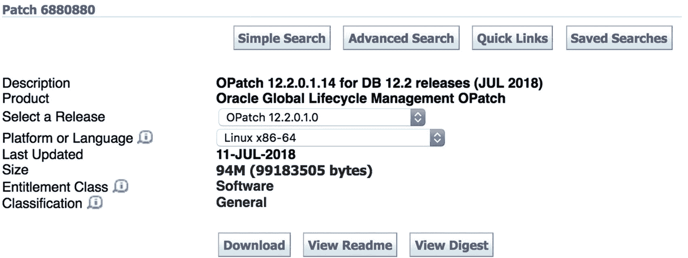

# 17. 打补丁

在前四章中，我们讨论了你学习和成长 Oracle DBA 职业生涯的不同途径。Oracle 文档是必读的。最终，你将需要与 Oracle 支持互动。希望你已开始使用社交媒体来扩大与世界各地 Oracle 专业人士的交流。

本章的重点转向维护你的 Oracle 数据库。回想一下，本书前面我们构建了一台虚拟机并创建了第一个 Oracle 数据库作为测试平台。随后的章节通过讨论恢复和备份以及数据库安全性来加固安装。现在，是时候让该数据库在系统的整个生命周期内持续工作了。

## 补丁概述

如果你工作得当，Oracle 补丁是不可避免的。遗憾的是，我遇到过许多从未给 Oracle 数据库打过补丁的 Oracle 数据库管理员，甚至包括一些从业多年的。你应该定期应用补丁。

应用 Oracle 补丁通常是出于以下两个原因之一：

*   修复已知问题：这些补丁应只在 Oracle 支持的指导下应用。

*   保持数据库软件最新：尤其是为了堵塞安全漏洞。这些补丁应在发布时及时应用。

补丁只能从`My Oracle Support`获取。你需要付费的 Oracle 支持合同才能下载补丁。如果你从第三方遇到补丁，不要下载和安装它。首先，这不是官方补丁，你将来可能会遇到支持和法律问题。此外，你无法保证第三方没有在补丁中引入某种恶意软件。


## 补丁管理最佳实践

### 重要提示

只从`MOS`下载补丁。你需要一份有效的支持合同。

你从`MOS`下载的每个补丁都会包含一个`Readme`文件，可能是文本格式或`HTML`格式。务必阅读`Readme`文件。虽然这听起来是理所当然的建议，但我经常在`Oracle`讨论论坛上看到有人问如何应用某个特定的补丁。`Readme`文件的存在是有原因的。它包含了如何应用该补丁的逐步说明。`Readme`文件也包含了该补丁的已知问题以及已知的安装问题。如果你需要回滚补丁，说明也在`Readme`文件中。即使你熟悉应用补丁，每次也要阅读`Readme`文件。就在你以为自己知道流程时，`Oracle`可能会做出一些改变，旧的补丁安装方式就不再有效了。

### 关键规则

务必阅读补丁的`Readme`文件。

无论何时应用补丁，绝对不要先在生产环境中应用。始终通过你的开发生命周期基础设施来应用补丁。如果你有条件，先在开发数据库中应用补丁，然后在测试数据库中应用，最后才在生产数据库中应用。在每个阶段之间留出间隔。如果可能，从开发到测试至少等待一周，然后再等待一周才应用到生产环境。这意味着整个流程大约需要两周时间。你需要这种刻意的延迟，以便在补丁进入生产环境之前发现其可能引发的任何问题。等到补丁进入生产环境时，你应该对自己的应用能力以及补丁不会破坏任何应用或数据库功能充满信心。

很多时候，我会在将补丁安装到开发数据库之前，先在一个测试环境中应用它。我的测试环境与开发、测试和生产环境没有相同的模式对象，但它让我可以在一个无人使用的系统上练习补丁安装。虽然我们经常将开发和测试视为非生产平台，但我喜欢说“开发环境对某人而言就是生产环境”。如果你的开发数据库宕机，应用开发者可能就无法工作。相比生产环境，我们在开发和测试中承担的风险更大，但我们也可以通过先在测试环境中工作来最小化风险。

## Oracle 版本解析

我们在第[5]章为测试环境安装的`Oracle`数据库是`Oracle 12.2.0.1`版本。在你的企业中可能存在更新和更旧的版本。新版本发布后，我们会将数据库向前迁移，这个过程称为升级，我们将在下一章介绍。`Oracle`公司也会将这些版本称为*releases*。你可以互换使用术语`release`和`version`。

除非我们是在与其他数据库管理员、`Oracle`支持分析师或需要了解确切技术细节的人交谈，否则我们通常会说“`Oracle 12c`”。这个表示法不是一个正确的版本号。字母`c`是一个营销标签。

我的数据库管理职业生涯始于使用`Oracle 7.1`版本。那时，版本上还没有营销标签。我将我的第一个`Oracle`数据库升级到了`Oracle 7.2`，然后是`Oracle 8.0`版本。就在`Oracle 8.1`即将发布之际，互联网爆发了。有些人称此为“互联网泡沫时代”。许多支持网络的应用程序已经在`Oracle`数据库后端运行，但`Oracle`公司希望宣称自己拥有为互联网准备就绪的数据库。第一个`Oracle 8.1`版本被营销为`Oracle8i Database`，其中的`i`代表互联网。当时`IT`行业刚刚结束为所有东西贴上`e`标签（代表电子，如`e-mail`、`e-documents`等）的潮流。现在，地球上每个`IT`供应商都想成为互联网公司，我们开始看到字母`i`随处可见。直到今天，我们仍然有苹果公司的`iPhone`、`iPad`和`iTunes`。

`Oracle`公司总是希望与竞争对手保持距离，因此开始不时地更改营销标签。在`Oracle8i`之后，我们迎来了`Oracle9i Database`。就在我们为下一个主要`Oracle`数据库版本发布做准备时，我们这些非`Oracle`员工的`Oracle`专业人士开始将下一个版本称为`10i`，但我们错了。当`Oracle 10`发布时，它的营销标签是`Oracle Database 10g`，其中的`g`代表网格计算。`Oracle 10g`是`Oracle`公司真正开始大力推广`Oracle`真正应用集群及其他网格基础设施技术的版本。这个营销标签一直延续到了`Oracle 11g`版本。正如你可以想象的那样，在第一个`Oracle 12`数据库发布之前，我们这些非`Oracle`员工又开始称其为`Oracle 12g`，结果再次出错。等到`Oracle 12`发布时，云计算已成为全球`IT`供应商最喜欢的话题。于是，`Oracle`给了我们`Oracle Database 12c`。

所有这些字母都不能真正告诉我们`Oracle`的版本号。`Oracle8i`实际上对应`Oracle`版本`8.1.5`、`8.1.6`和`8.1.7`。`Oracle9i`经历了一系列版本，从`9.0.1`到`9.2.0.7`。`Oracle 12c`提供了`Oracle 12.1.0.1`、`12.1.0.2`、`12.2.0.1`和`12.2.0.2`。如你所见，每个营销标签都对应多个不同的版本。

如果你在与`Oracle`专业人士交谈，确切的版本号可能对你们的讨论很重要。你不应该只说`Oracle 12c`，而应该说出完整的版本号。无论版本号的差异多么微小，每个版本都会改变特性和功能，这可能对你们的讨论产生重大影响。如果你在与非`Oracle`人员交谈，使用营销标签通常就足够了。


### 提示

了解你的受众，特别是在提及特定的 Oracle 版本时需要注意。

然后是补丁集。当 Oracle 8.1.7 发布时，其版本号是`8.1.7.0`。经过一段时间，Oracle 公司发布了一个修复了若干漏洞的补丁集。数据库管理员将`8.1.7.1`补丁集安装在已有的`8.1.7.0` Oracle 主目录之上。当`8.1.7.2`补丁集发布时，DBA 将其安装在相同的主目录上。Oracle 还发布了`8.1.7.3`和`8.1.7.4`补丁集，后者是`8.1.7`版本的最终补丁集。在那个年代，当你从`8.1.6`升级到`8.1.7`时，这是一次数据库*升级*，而补丁集则会改变版本号的第四位数字。

当然，事情随时间而变化。从`Oracle 11.2`开始，Oracle 停止发布我们过去所认为的补丁集。看起来像是补丁集的东西，现在变成了一个完整的版本。Oracle 将版本号的第四位数字改为表示一次升级而非补丁集。`Oracle 11.2.0.2`版本不是安装在`11.2.0.1`之上，而是安装在一个新的 Oracle 主目录中。如果你回看前面讨论`Oracle 12c`的段落，你会看到列表中的版本号都有四位数字，因为我们开始以不同于过去的方式来思考这些 Oracle 版本。

过去普遍认为，没有人会将关键的生产 IT 系统托付给第一个版本。当 Oracle 8.0 发布时，它被认为是第一个 Oracle 8 版本，所以人们避开了它。他们等待第一个或第二个补丁集。更谨慎的做法是，DBA 等待第一个补丁集发布，即在第一个非零版本（`8.1`）发布之后的第一个补丁集。其理念是第一个版本存在缺陷，让别人去解决这些问题更为明智。我们的系统至关重要，不能暴露在漏洞面前。我们将等待一个良好、稳定的版本发布，然后再推进我们的 Oracle 版本。

在 Oracle 11g 初始发布之后，我们开始看到 Oracle 公司在下一个主要版本发布之前进行重大更改。`Oracle 11.1`可用，而`Oracle 11.2`为网格基础设施引入了 SCAN 监听器和其他新功能。在`Oracle 12.1.0.1`发布之后，`12.1.0.2`版本引入了 Oracle 新的内存数据库功能。过去属于补丁集版本变更的情况，现在正在引入重大变更。关键在于，如果你害怕变更引发问题，并且想要一个稳定的版本，那么每一个新版本都会带来变更，而你必须不断前进。

在讨论论坛中，我经常看到有人询问哪个 Oracle 版本是稳定版本。答案是你今天使用的任何受支持版本。在撰写本文时，完全受支持的版本是`Oracle 11.2.0.4`、`12.1.0.2`和`18`。（我稍后会谈到`Oracle 18`版本后面没有数字的事实。）Oracle 数据库是一个拥有超过 30 年历史的成熟产品。许多公司使用 Oracle 来满足其数据库需求，它们根本无法承受事务失败或系统长时间停机，它们信任当今的 Oracle 版本。这并不是说 Oracle 版本没有缺陷。软件中总是存在漏洞，而且将来也会一直存在。

为什么 Oracle 公司开始在其产品的下一个主要版本发布之前引入新功能？答案是，他们希望更快地推向市场，以抵御竞争对手以更快速度发布新功能的步伐。整个 IT 世界已经转向更快速地部署软件新功能。这种转变带来了敏捷开发方法论，在组织中增加了 DevOps 人员，并促进了云计算的兴起，从而加快了变更的步伐。采用这种更快节奏的并非只有 Oracle 公司。

如果你有留意，你会发现没有 Oracle 13、14、15、16 或 17 版本。我们从`Oracle 12c`直接跳到了`Oracle 18c`。`Oracle 12.1`于 2013 年推出。`Oracle 12.2`于 2016 年发布给 Oracle 的云客户，并于 2017 年发布给本地部署客户。由于 Oracle 公司希望更定期地发布，他们改变了编号方案以匹配发布的日历年份。`Oracle 18`被如此命名是因为它在 2018 年发布。当 Oracle 在 2019 年发布其新版本时，它被命名为`Oracle 19`。根据你应用到`Oracle 18c`数据库的补丁不同，版本号可能是`18.1`、`18.2`等。

如果你到目前为止还没有被所有这些版本号完全搞糊涂，那么 Oracle 的季度补丁（我们将在本章讨论）会更改版本号以表示所应用的补丁。如果你在 2018 年 7 月将补丁应用到`Oracle 12.1.0.2`数据库，从技术上讲，版本号是`12.1.0.2.180717`，表示已应用 2018 年 7 月 17 日的补丁。

这些版本号足以让人开始头晕。我提及这些版本号的历史，是为了让你能更好地理解为什么编号方案多年来会发生变化以及各个数位的含义。Oracle 公司在`Oracle 18c`版本中再次更改了补丁及其影响版本的方式，正如我们将在本章后面看到的。

## OPatch

Oracle 目前使用一个基于 Java 的工具来为其数据库软件应用补丁。该工具名为 OPatch，显然是 Oracle Patch 的缩写。由于此工具基于 Java，无论您在哪个平台上运行 Oracle，它都是相同的工具，这一特性使 Oracle DBA 的工作更加轻松。如果我们负责不同平台上的 Oracle，例如 Linux 和 Windows，我们无需采用不同的打补丁方式。在两种系统上，流程通常是相同的。

大多数补丁都会告知应用该补丁所需的最低 OPatch 版本。您可能需要先为补丁软件本身打补丁。要查看当前的 OPatch 版本，请使用清单 17-1 中的示例。

```
[oracle@dbamentor ~]$ $ORACLE_HOME/OPatch/opatch version
OPatch Version: 12.2.0.1.6
OPatch succeeded.
Listing 17-1
OPatch Version
```

当您安装 Oracle 数据库软件时，它会自动将 OPatch 包含在 `$ORACLE_HOME/OPatch` 目录中。通常，安装的 OPatch 版本已经过时，而您应该使用更新的版本。在清单 17-1 中，我们可以看到 OPatch 版本是 12.2.0.1.6，这是我们在测试平台上安装 Oracle 12.2 软件时安装的版本。

要获取最新版本，我们需要登录 My Oracle Support，然后单击 Patches & Updates 选项卡。OPatch 通过补丁 6880880 下载，您可以在相应的搜索框中输入该补丁编号。然后单击 Search 按钮。您需要选择所需的 OPatch 版本和平台。图 17-1 显示我已选择了 Linux x86-64 平台和 12.2 版本以匹配我的测试环境。



图 17-1
OPatch 下载

将 OPatch 更新下载到您的测试环境。您也应该查看 Readme 文件以获取说明。Readme 文件会告诉您将下载的文件解压缩到 `$ORACLE_HOME` 目录。首先备份旧的 OPatch 版本始终是一个好主意。我已将下载的 zip 文件放在 `$HOME` 目录中。我现在将把 OPatch 安装到 `$ORACLE_HOME`。首先，将 OPatch 目录移动到备份位置。将 zip 文件复制到 `$ORACLE_HOME` 并解压缩。然后我检查新的 OPatch 版本，以确保它高于默认安装的 12.2.0.1.6。这些步骤如清单 17-2 所示。

```
[oracle@dbamentor ~]$ cd $ORACLE_HOME
[oracle@dbamentor 12.2.0.1]$ mv OPatch OPatch.old
[oracle@dbamentor 12.2.0.1]$ cp $HOME/p6880880_122010_Linux-x86-64.zip .
[oracle@dbamentor 12.2.0.1]$ unzip p6880880_122010_Linux-x86-64.zip
[oracle@dbamentor 12.2.0.1]$ $ORACLE_HOME/OPatch/opatch version
OPatch Version: 12.2.0.1.14
OPatch succeeded.
Listing 17-2
Updating OPatch
```

我们已成功更新 OPatch，现在已准备好应用一些补丁。

### 提示

OPatch 总是通过下载补丁 6880880 来更新。

## 季度补丁

每个季度，Oracle 公司都会发布一批新的补丁。这些补丁在每年的一月、四月、七月和十月发布，通常在该月最接近 17 号的星期二发布。

Oracle 只为完全支持的版本提供补丁。在下一章中，我们将讨论如何将数据库升级到更新的版本。季度补丁只是您希望保持数据库版本最新的原因之一。

当 Oracle 公司最初开始发布季度补丁时，这些补丁只包含修复软件中安全漏洞的补丁。这些补丁被称为该季度的累积补丁更新（CPU）。顾名思义，补丁是累积的，这意味着为某个季度发布的补丁包含该季度的所有修复以及之前季度的修复。如果您像我们在测试环境中那样安装 Oracle 12.2.0.1，您无需为该版本查找每一个发布的 CPU。只需应用最新、最好的 CPU，您就全部跟上了。

跟上季度的 CPU 是帮助保护组织数据库基础设施安全的方法之一。许多组织都有规定必须应用安全补丁的政策。遗憾的是，有太多公司没有此类政策，导致数据库未打补丁，结果存在大量安全漏洞。如果您的组织没有任何此类政策，请与管理层合作制定一项，哪怕只为数据库。

如果您希望在安全补丁发布时收到通知，请使用您的 Oracle 单点登录账户登录 [`http://otn.oracle.com`](http://otn.oracle.com)。然后将鼠标悬停在 Account 按钮上并单击 Account 链接。接下来，单击 Subscriptions。展开名为“Oracle security notifications”的部分，并勾选 Security Alerts 旁边的框。单击 Save 按钮。

当季度补丁只包含安全修复时，下载和安装很容易，因为您只有一个选择。随着时间的推移，事情变得更加困难。Oracle 公司决定创建一种新的季度补丁类型，称为补丁集更新（PSU）。PSU 包含相同的安全修复以及其他他们认为对所有人环境都安全的错误修复。当 PSU 创建时，CPU 重命名为安全补丁更新（SPU）。我认为他们本可以在首字母缩略词上做得更好，因为 PSU 和 SPU 太相似了。Oracle 开始将 SPU 和 PSU 的集合称为 CPU。今天，如果您听到 CPU，它指的是季度补丁的集合。Oracle 还将名称更改为关键补丁更新（Critical Patch Updates），但它们仍然是累积的。

直到 Oracle 11.2，您每个季度都可以选择应用 SPU 或 PSU。世界各地的许多数据库管理员只应用 SPU，因为它对他们的 Oracle 环境引入的改动最少。然而，Oracle 公司的官方建议是应用 PSU，但选择权在 DBA 手中。当 Oracle 12.1 发布时，该版本不再提供 SPU。Oracle 只为 12.1 版本发布 PSU。Oracle 公司为 12c* 取消了这一选择。更令人困惑的是，建议在 Windows 上运行 Oracle 的 DBA 应用捆绑补丁（BP）而不是 PSU。BP 包含 PSU 中的所有内容以及更多的错误修复。

Oracle 12.2 改变了季度补丁。Oracle 12.2 引入了发布更新（RU）和发布更新修订版（RUR）补丁。发布更新（RU）包含安全修复和错误修复，就像 PSU 一样。RU 还包含对 Oracle 优化器的修复，该优化器负责确定执行发送到数据库的所有 SQL 语句的有效方法。


