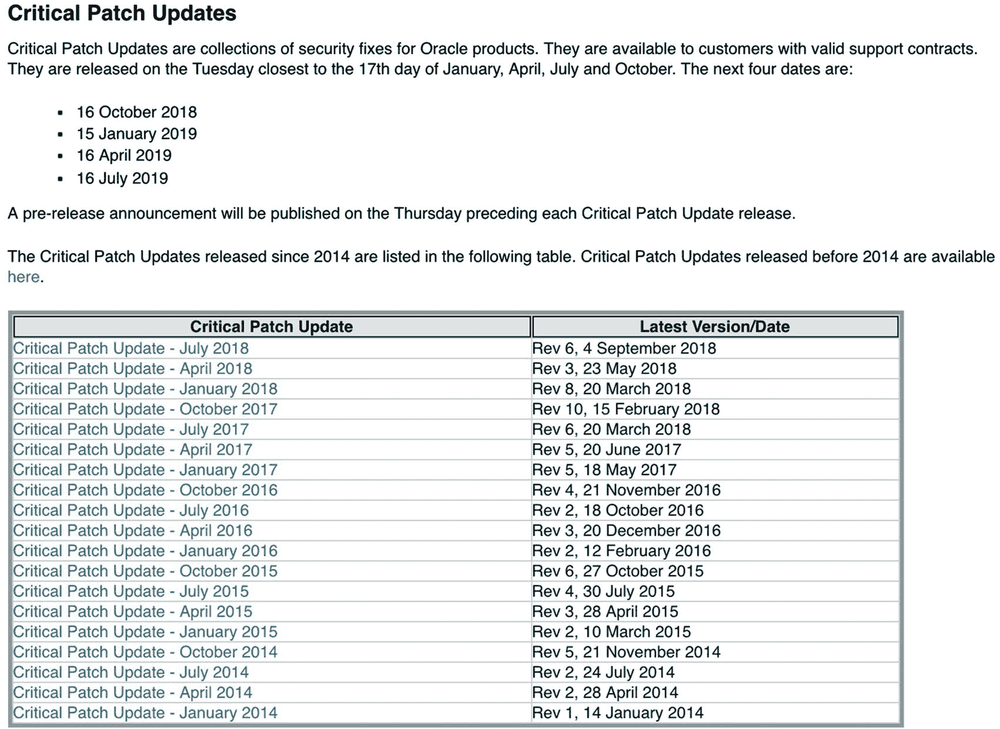
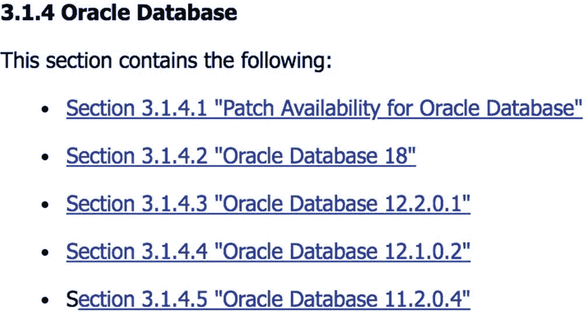
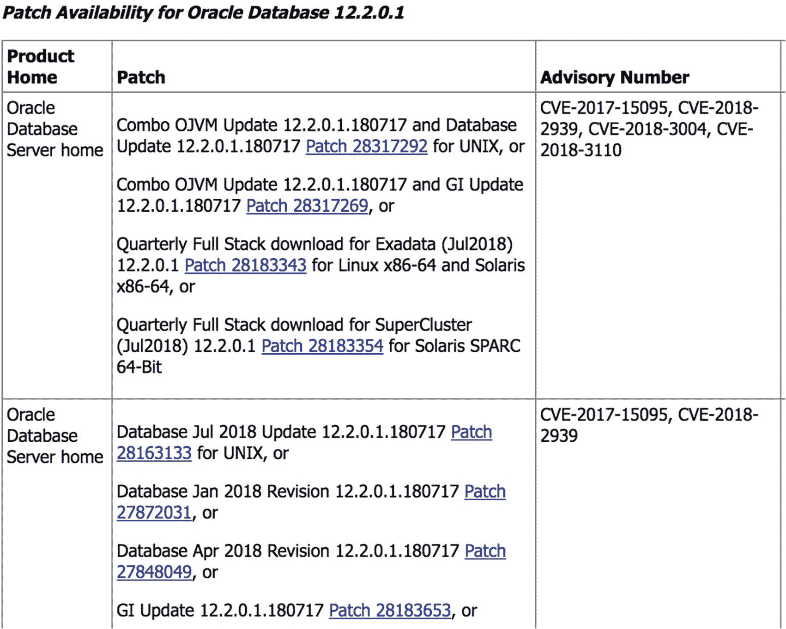
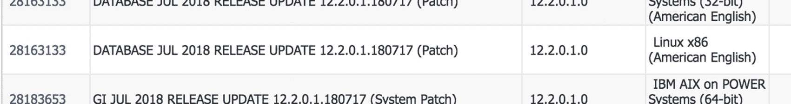
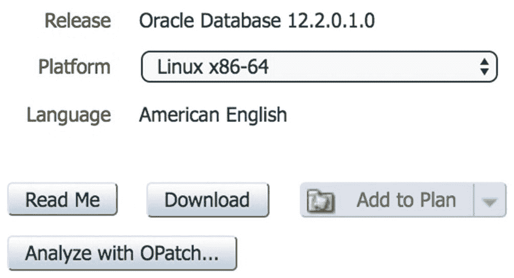
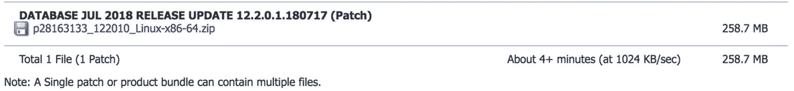

# Oracle 季度补丁概述

## 版本更新与 RU/RUR 说明

在某个时间点，`Oracle 18` 发布了。接下来的一个季度，Oracle 发布了 `18 RU`，这将 Oracle 版本变更为 `18.1`。第二个 `RU` 将 Oracle 版本变更为 `18.2`，依此类推。如果你将 `RU` 应用到 `Oracle 18` 数据库，你将获得尽可能多的修复。请注意，将 `RU` 应用到 `Oracle 18` 数据库会改变版本号，使其看起来像是进行了 Oracle 升级，但实际情况并非如此。`RU` 是一个补丁，而不是升级。更令人困惑的是，将 `RU` 应用到 `Oracle 12.2` 数据库并不会将版本变更为 `12.3` 或更高版本。

有些人不喜欢对 Oracle 优化器做如此多的改动。一个糟糕的改动可能导致优化器选择低效的执行计划，进而影响应用程序性能。Oracle 为我们提供了 `RUR`，它包含与 `RU` 相同的安全和错误修复，但不包含优化器修复，这意味着 `RUR` 将优化器保持在相同的功能水平。`Oracle 18` 发布后的第一个季度，只有 `RU` 可用。第二个季度，DBA 可以选择应用下一个 `RU` 或应用 `RUR`。然而，优化器变更只会冻结六个月，所以 `RUR` 只能为你争取一点时间。Oracle 公司建议你每季度应用 `RU`。他们的立场是，`RUR` 仅适用于特殊情况。

## 版本补丁建议

所有这些可能会令人困惑，尤其是考虑到所有的缩写。为了简化问题，以下是针对每个 Oracle 版本的季度补丁建议。除非你有特定原因，否则请遵循 Oracle 的建议来确定应应用哪个季度补丁。

*   `11.2.0.4` 之前的版本：升级到较新的版本
*   `Oracle 11.2.0.4`：应用 `PSU`
*   `Oracle 12.1`：应用 `PSU`（如果在 Windows 上，则应用 `BP`）
*   `Oracle 12.2`：应用 `RU`
*   `Oracle 18` 和 `19`：应用 `RU`

## 如何获取季度补丁

出于某种我一直未能弄明白的原因，获取这些季度补丁并不像你想象的那么容易。Oracle 为我们发布了一个链接，但你需要多点击几次才能真正下载补丁。我们将逐步介绍如何找到季度补丁。将 Web 浏览器指向 [`http://otn.oracle.com`](http://otn.oracle.com) 并寻找标题为“Essential Links”的框，部分如图 17-2 所示。


*图 17-2 OTN Essential Links*

在该列表中，你可以看到“Critical Patch Updates”的链接。点击该链接。请注意，你可以在 My Oracle Support 的仪表板上找到类似的链接。这两个链接都会带你前往“Critical Path Updates, Security Alerts and Bulletins”页面。向下滚动一点，直到你看到标题为“Critical Patch Updates”的部分，如图 17-3 所示。


*图 17-3 CPU 链接*

这部分的第一段告诉你接下来四个 CPU 的发布日期，以便你提前知晓。随后的表格包含指向每个季度补丁的链接。你可以下载过去几年的每一个 CPU，但除了最近的 CPU（位于表格顶部）之外，很少有理由下载其他任何补丁。点击最近的 CPU 链接。

下一页是该季度的“Critical Patch Update Advisory”。描述之后的表格包含了他们提供的每一个 Oracle 产品的补丁。列表相当广泛，并按字母顺序排列。你需要向下滚动以找到“Oracle Database Server”，如图 17-4 所示。


*图 17-4 Oracle Database Server 链接*

不要点击左侧包含不同版本的那个链接。相反，点击该表格右侧写着“Database”的链接。如果你最近没有进行身份验证，系统会要求你提供凭据以连接到 `MOS`。到此为止的所有内容都是公开的，但下一页是一个 `MOS Note`，这意味着你需要一个付费的支持合同。

季度补丁的 `MOS Note` 提供了你想阅读的相关信息。其中一个部分详细说明了该季度的新增内容。在新信息部分，Oracle 提供了他们所谓的“Post Release Patches”。当 `CPU` 首次发布时，它仅适用于少数平台。其他平台会在很短的时间后发布。本节将告诉你这些平台计划在何时发布该季度的补丁。

该 `MOS Note` 的第 3 节提供了补丁的详细信息。此时我只对 Oracle 数据库的补丁感兴趣。第 3.1.4 节，如图 17-5 所示，列出了指向当前每个受支持版本补丁的链接。


*图 17-5 Oracle Database 版本列表*

我们的测试平台包含 `12.2.0.1` 版本，因此点击该链接将跳转到第 3.1.4.3 节。如果你有不同的 Oracle 版本，可以相应地点击。请注意，版本列表相当短。只显示了受支持的版本。任何不在列表中的版本都不受支持，并且不会收到季度补丁。你必须升级到列表中的某个版本。

点击数据库版本后，浏览器将显示一个表格，列出该版本的补丁。经过所有这些点击，我们现在可以查看要下载的补丁号了。如果你想包含 Oracle Java 虚拟机 (`OJVM`) 补丁，它们位于表格的第一个框中。第二个框如图 17-6 所示，它不包含 `OJVM` 补丁。


*图 17-6 Oracle CPU 补丁链接*

我们的测试平台运行在 Linux 上，属于 UNIX 类别。点击图 17-6 所示表格中的补丁 `28163133` 链接（此补丁是表格第二行中列出的第一个补丁）。

下一页包含指向每个 UNIX 平台的链接。向下滚动到 Linux x86-64 平台那一行，并点击左侧的链接。我们在图 17-7 中看到这只是页面上众多补丁中的一个。另请注意，因为这是一个 `Oracle 12.2` 数据库，我们正在下载的是版本更新 (`RU`) 类型的补丁。


*图 17-7 Linux 补丁下载*

如果你点击了错误的超链接，安装补丁到你的系统时会遇到问题。确保你选择了正确的那个。在下一个屏幕（如图 17-8 所示）中，请确保平台是正确的。即使你点击了适用于你平台的正确超链接，有时 `MOS` 会在这里弄错，所以请仔细检查平台。


*图 17-8 PSU 平台选择*

你可以通过点击“Read Me”按钮查看补丁的 Readme 文件。Readme 文件也会包含在下载中。点击 `Download` 按钮，将出现图 17-9 所示的屏幕。


*图 17-9 下载链接*


我们终于到了这一步！虽然希望过程能更简单些，但经过之前的一系列点击操作，我们现在终于可以开始下载补丁了。点击链接开始下载。下载完成后，请将补丁解压缩到一个单独的空目录中。

## 安装 PSU

绝大多数补丁的安装都是一个两步过程。首先更新 Oracle 软件，然后更新内部数据库。有些补丁可能只包含其中一步，但大多数都有两步。应用 PSU 始终是两步过程。第一步使用`OPatch`，第二步则使用另一个工具`datapatch`。无需担心更新`datapatch`工具——它是`OPatch`的一部分，在更新`OPatch`时已经同步更新。

现在 PSU 已经下载并解压完成，让我们定义环境变量。`PATH`环境变量需要包含`$ORACLE_HOME/bin`和`$ORACLE_HOME/OPatch`目录。

在空目录中解压补丁文件后，会出现三个文件：一个以补丁编号命名的子目录、压缩包文件和一个名为`PatchSearch.xml`的文件，如清单 17-3 所示。此代码示例中也声明了环境变量。

```
[oracle@dbamentor PSU]$ ls
28163133  p28163133_122010_LINUX-x86-64.zip  PatchSearch.xml
[oracle@dbamentor PSU]$ export ORACLE_HOME=/u01/app/oracle/product/12.2.0.1
[oracle@dbamentor PSU]$ export PATH=$ORACLE_HOME/OPatch:$ORACLE_HOME/bin:$PATH
[oracle@dbamentor PSU]$ export ORACLE_SID=orcl
清单 17-3
准备就绪，开始打补丁
```

补丁文件名通常采用`p*编号*_ 版本 _ 平台.zip`的格式。在清单 17-3 中，补丁文件以粗体显示，可以看出这是适用于 Linux x86-64 平台的 12.2.0.1 数据库的补丁编号 28163133。下个季度的 PSU 将使用完全不同的补丁编号。

要应用补丁，必须先停止此主目录下运行的所有 Oracle 软件。同时切换到解压操作创建的目录中。在清单 17-4 中，我们在测试环境上关闭 Oracle 软件。

```
[oracle@dbamentor PSU]$ sqlplus /nolog
SQL*Plus: Release 12.2.0.1.0 Production on Sat Sep 8 19:32:03 2018
Copyright (c) 1982, 2016, Oracle.  All rights reserved.
SQL> connect / as sysdba
Connected.
SQL> shutdown immediate
Database closed.
Database dismounted.
ORACLE instance shut down.
SQL> exit
Disconnected from Oracle Database 12c Enterprise Edition Release 12.2.0.1.0 - 64bit Production
[oracle@dbamentor PSU]$ cd 28163133/
清单 17-4
关闭 Oracle
```

接下来，我们运行`opatch apply`命令来安装补丁。请注意，虽然我在此展示了应用补丁的步骤，但这并不能替代阅读补丁的 Readme 文件以获取完整说明。

`OPatch`启动时，总会显示诸如`OPatch`版本、`Oracle Home`目录以及本次`OPatch`执行生成的日志文件位置等信息。`OPatch`会运行一些预检查以确保补丁顺利安装。如果任何预检查失败，`OPatch`将在此处终止执行。数据库管理员需要解决问题后重新运行`opatch`。在清单 17-5 中，我们指示`opatch`对当前目录中的补丁进行应用。

```
[oracle@dbamentor 28163133]$ opatch apply
Oracle Interim Patch Installer version 12.2.0.1.14
Copyright (c) 2018, Oracle Corporation.  All rights reserved.
Oracle Home       : /u01/app/oracle/product/12.2.0.1
Central Inventory : /u01/app/oraInventory
from           : /u01/app/oracle/product/12.2.0.1/oraInst.loc
OPatch version    : 12.2.0.1.14
OUI version       : 12.2.0.1.4
Log file location : /u01/app/oracle/product/12.2.0.1/cfgtoollogs/opatch/opatch2018-09-11_22-54-18PM_1.log
Verifying environment and performing prerequisite checks...
OPatch continues with these patches:   28163133
Do you want to proceed? [y|n]
清单 17-5
opatch apply 预检查
```

一旦所有检查通过，`opatch`工具会询问是否继续进行补丁安装。您需要确保此主目录下运行的所有 Oracle 软件都已关闭，然后用`y`回应。`opatch`工具会要求您确认所有软件都已关闭，如清单 17-6 所示。

```
Do you want to proceed? [y|n]
y
User Responded with: Y
All checks passed.
Please shutdown Oracle instances running out of this ORACLE_HOME on the local system.
(Oracle Home = '/u01/app/oracle/product/12.2.0.1')
Is the local system ready for patching? [y|n]
清单 17-6
OPatch 确认
```

一旦您回应`y`，`opatch`工具将开始工作。它首先备份`ORACLE_HOME`中所有将被修改的文件。这样，万一您需要回滚补丁，`opatch`工具可以直接从备份中恢复这些文件。

`opatch`工具可能会通知您，当前`ORACLE_HOME`目录中不存在某些可选组件的补丁。此消息仅供参考，`opatch`工具将跳过该部分补丁。之后，我们可以看到`opatch`工具正在为主目录中安装的各种组件应用补丁。为简洁起见，我对清单 17-7 中的输出进行了修剪，因为我们不需要看到`opatch`工具更新的每一个组件。

```
Is the local system ready for patching? [y|n]
y
User Responded with: Y
Backing up files...
Applying interim patch '28163133' to OH '/u01/app/oracle/product/12.2.0.1'
ApplySession: Optional component(s) [ oracle.oid.client, 12.2.0.1.0 ] , [ oracle.has.crs, 12.2.0.1.0 ] , [ oracle.ons.daemon, 12.2.0.1.0 ] , [ oracle.network.cman, 12.2.0.1.0 ]  not present in the Oracle Home or a higher version is found.
Patching component oracle.assistants.server, 12.2.0.1.0...
Patching component oracle.rdbms.rman, 12.2.0.1.0...
Patching component oracle.rdbms.rsf.ic, 12.2.0.1.0...
Patching component oracle.rdbms, 12.2.0.1.0..
Patching component oracle.sdo, 12.2.0.1.0...
Patch 28163133 successfully applied.
Log file location: /u01/app/oracle/product/12.2.0.1/cfgtoollogs/opatch/opatch2018-09-11_22-54-18PM_1.log
OPatch succeeded.
清单 17-7
OPatch 安装补丁
```

`opatch`工具完成后，我们希望看到两条消息。第一条是“补丁`xxxxx`已成功应用。”第二条是“`OPatch`成功。”如果我们没有看到这些消息，则说明出现了问题，我们需要查看日志文件以寻找解决问题的线索。

`opatch`工具工作完成后，软件更新的第一阶段就完成了。现在需要启动监听器和数据库，然后运行`datapatch`工具来完成第二阶段。监听器和数据库实例的启动过程如清单 17-8 所示。

```
[oracle@dbamentor 28163133]$ lsnrctl start
LSNRCTL for Linux: Version 12.2.0.1.0 - Production on 11-SEP-2018 23:06:22
Copyright (c) 1991, 2016, Oracle.  All rights reserved.
Starting /u01/app/oracle/product/12.2.0.1/bin/tnslsnr: please wait...
TNSLSNR for Linux: Version 12.2.0.1.0 - Production
Log messages written to /u01/app/oracle/diag/tnslsnr/dbamentor/listener/alert/log.xml
Listening on: (DESCRIPTION=(ADDRESS=(PROTOCOL=tcp)(HOST=dbamentor)(PORT=1521)))
Connecting to (ADDRESS=(PROTOCOL=tcp)(HOST=)(PORT=1521))
STATUS of the LISTENER
```


## 17.x 补丁应用过程

`别名`                   LISTENER
`版本`                   适用于 Linux 的 TNSLSNR：版本 12.2.0.1.0 - 生产版
`开始日期`               2018 年 9 月 11 日 23:06:22
`运行时间`               0 天 0 小时 0 分 0 秒
`跟踪级别`               关闭
`安全性`                 开启：本地操作系统认证
`SNMP`                   关闭
`监听器日志文件`         `/u01/app/oracle/diag/tnslsnr/dbamentor/listener/alert/log.xml`
监听端点摘要...
`(DESCRIPTION=(ADDRESS=(PROTOCOL=tcp)(HOST=dbamentor)(PORT=1521)))`
监听器不支持任何服务
命令成功完成

```sql
[oracle@dbamentor 28163133]$ sqlplus /nolog
SQL*Plus: Release 12.2.0.1.0 Production on Tue Sep 11 23:06:25 2018
Copyright (c) 1982, 2016, Oracle.  All rights reserved.
SQL> connect / as sysdba
Connected to an idle instance.
SQL> startup
ORACLE instance started.
Total System Global Area 1660944384 bytes
Fixed Size                  8621376 bytes
Variable Size             989856448 bytes
Database Buffers          654311424 bytes
Redo Buffers                8155136 bytes
Database mounted.
Database opened.
SQL> exit
Disconnected from Oracle Database 12c Enterprise Edition Release 12.2.0.1.0 - 64bit Production
```

**代码清单 17-8** 打补丁后启动 Oracle

接下来，我们将运行 `datapatch` 实用程序。唯一的命令行选项是告诉 `datapatch` 在其输出中使用详细模式，如**代码清单 17-9**所示。

```sql
[oracle@dbamentor 28163133]$ datapatch -verbose
SQL Patching tool version 12.2.0.1.0 Production on Tue Sep 11 23:08:42 2018
Copyright (c) 2012, 2018, Oracle.  All rights reserved.
Log file for this invocation: /u01/app/oracle/cfgtoollogs/sqlpatch/sqlpatch_9674_2018_09_11_23_08_42/sqlpatch_invocation.log
Connecting to database...OK
Bootstrapping registry and package to current versions...done
Determining current state...done
Current state of SQL patches:
Bundle series DBRU:
ID 180717 in the binary registry and not installed in the SQL registry
Adding patches to installation queue and performing prereq checks...
Installation queue:
Nothing to roll back
The following patches will be applied:
28163133 (DATABASE JUL 2018 RELEASE UPDATE 12.2.0.1.180717)
Installing patches...
Patch installation complete.  Total patches installed: 1
Validating logfiles...
Patch 28163133 apply: SUCCESS
logfile: /u01/app/oracle/cfgtoollogs/sqlpatch/28163133/22313390/28163133_apply_ORCL_2018Sep11_23_08_53.log (no errors)
SQL Patching tool complete on Tue Sep 11 23:09:54 2018
```

**代码清单 17-9** Datapatch 实用程序

`datapatch` 将连接到数据库并应用当前补丁。我们希望在输出末尾附近看到消息 “Patch *xxxxx* apply:SUCCESS”。

每次我们应用补丁并更新数据库的内部部分时，都存在使一些数据字典对象变为无效的风险。我们可以运行随附的 `utlrp.sql` 脚本（如**代码清单 17-10**所示）来重新编译任何无效对象。

```sql
[oracle@dbamentor 28163133]$ sqlplus /nolog
SQL*Plus: Release 12.2.0.1.0 Production on Tue Sep 11 23:12:06 2018
Copyright (c) 1982, 2016, Oracle.  All rights reserved.
SQL> connect / as sysdba
Connected.
SQL> @?/rdbms/admin/utlrp.sql
PL/SQL procedure successfully completed.
```

**代码清单 17-10** 运行 utlrp.sql

为简洁起见，我在**代码清单 17-10**的脚本调用中间和执行结束时省略了输出。

恭喜！补丁现已成功应用，没有任何问题。剩下的唯一事情就是验证数据库是否认为它已被修补。我们通过查询一个 DBA 视图来执行此操作，如**代码清单 17-11**所示。

```sql
SQL> select description,status from dba_registry_sqlpatch;
DESCRIPTION                                        STATUS
-------------------------------------------------- ----------
DATABASE JUL 2018 RELEASE UPDATE 12.2.0.1.180717   SUCCESS
```

**代码清单 17-11** 查询 DBA_REGISTRY_SQLPATCH

我们可以从 `DBA_REGISTRY_SQLPATCH` 视图中看到，RU（发布更新）已成功应用于此数据库。曾有过这样的情况：`opatch` 实用程序指出一切成功，`datapatch` 也是如此，但此视图未正确填充。如果您使用 Oracle Enterprise Manager (EM) 来监控数据库，EM 将查询此视图以确定是否已应用最新的补丁。在补丁结束时自己查询此视图是确保 EM 获得正确信息的好方法。

## 继续前行

为 Oracle 数据库打补丁对于修复数据库操作中的错误、填补安全漏洞并帮助保护数据安全是必要的。您应该定期为数据库应用季度 CPU（关键补丁更新）补丁。除非已为您的版本应用了最新最好的 CPU，否则切勿将 Oracle 数据库投入生产状态。

正如本章所述，季度 CPU 补丁是为完全支持的 Oracle 版本发布的。在某个时间点，无论您是谁，您当前的版本都会过时，Oracle 公司将停止为其发布补丁。每个数据库管理员在其职业生涯的某个阶段都必须将其数据库升级到更新的版本。下一章将讨论各种升级技术。

