# 18. 升级

数据库首次创建后，数据库管理员将通过应用常规季度补丁（如前一章所述）来维护它。DBA 还可能需要在 Oracle Support 的指导下应用其他补丁以修复错误。经过一段时间（可能是几个月甚至几年）后，数据库管理员将需要将数据库升级到更新的版本。本章将讨论不同的升级路径并提供一些最佳实践。


## 升级的理由

我遇到过许多数据库管理员，他们不敢将自己的 Oracle 数据库升级到更新的版本。拒绝升级最常见的理由是那句老话："没坏就别修"。他们当前的配置运行良好，系统又至关重要，因此他们选择维持现状。他们的心态是，升级任何数据库总会带来一定风险，而升级后可能出现的问题使得升级变得不值得。但事实恰恰相反——收益远大于风险。即使今天一切运行良好，你仍有许多理由应该升级你的 Oracle 数据库。本节将详细说明一些升级的理由，顺序不分先后。

正如我们在第 17 章所见，每季度发布的安全补丁仅适用于完全受支持的版本。在撰写本文时，补丁仅适用于 `11.2.0.4`、`12.1.0.2`、`12.2.0.1` 和 `18` 版本。如果你的 Oracle 数据库不在此列表中，那么你将存在永远无法修补的安全漏洞。即使数据库及其应用程序可能运行良好，黑客也会乐于利用你的疏忽。务必使用受支持的版本以获取安全补丁，并使你的数据库环境尽可能安全。

如果你提交服务请求，Oracle 支持也可能要求你升级到受支持的版本。如果你运行的是不支持的版本，支持分析师最喜欢的回应就是让你升级并检查问题是否仍然存在。错误一直在被修复，如果是一个已知且已被修复的错误，分析师为何要浪费时间去追踪你的问题？他们希望数据库升级能解决问题，从而以最小的工作量关闭服务单。

你的公司很可能已经支付了 Oracle 支持合同的费用。升级是该合同的一部分。如果你不升级数据库，你就是在为支持服务多付费。你已经为更新的数据库版本付过费了，所以尽情使用它吧。话虽如此，有一个拒绝升级 Oracle 数据库的理由。如果你没有付费的支持合同，那么升级到较新版本可能会让你与 Oracle 公司产生法律纠纷。如果你的支持合同到期，你不能升级到该合同到期后发布的版本。如果你没有支持合同，请不要升级。如果你没有支持合同，那么这个数据库对你的公司来说一定不是很重要。

你的新数据库版本具有许多新功能。升级后，许多新功能将可供你使用。虽然完成一次 Oracle 升级可能需要付出相当大的努力，但这些新功能通常是出色的省时工具。有些新功能减轻了数据库管理员的工作量。其他功能可能缩短应用程序开发时间。新功能可以让你将数据库架构转向一个有利于组织需求的新方向。

我经常在讨论论坛上看到人们询问如何在新操作系统上安装非常旧的 Oracle 版本，这简直令人抓狂。Oracle 版本针对不同的操作系统平台进行了认证，而 Oracle 公司不会费力确保非常古老的 Oracle `8.0.5` 版本能在更新得多的操作系统 Windows Server 2016 上运行。服务器超过保修期后，系统管理员定期更换硬件没有问题。更换硬件时，管理员通常会借此机会也升级操作系统。如果你的公司正在更换旧硬件（理应如此），数据库管理员也应该升级 Oracle（理应如此）。

正如我们将在本章后面看到的，你可以从有限的旧版本子集直接升级到较新的 Oracle 版本。例如，无论你多么努力，都无法将 Oracle `7.3.4` 数据库直接升级到 Oracle `12.2.0.1`。你必须先升级到一个中间版本。如果你的数据库非常旧，你可能需要进行多次升级。在达到最终版本之前需要完成的升级次数越多，追踪任何升级问题可能就越困难。是第一次、第二次还是第三次升级导致了你的问题？如果你的 Oracle 版本保持最新，升级过程就不会那么痛苦。

除了获得 Oracle 的支持，以及保持与操作系统的认证组合外，数据库管理员还需要注意应用软件供应商的支持。第三方应用程序针对特定的数据库版本进行了认证。如果你想升级应用程序，可能也需要升级数据库以跟上步伐。遗憾的是，太多的应用软件供应商落后于最新的 Oracle 版本。我经常听到数据库管理员抱怨他们无法升级数据库，因为应用软件供应商尚未支持它，即使该 Oracle 版本已经发布多年！如果你的应用软件供应商在 Oracle 版本方面非常落后，你可能要考虑重新评估未来与该供应商的业务关系。

在第 16 章中，我们讨论了如何通过社交媒体与世界各地的 Oracle 专业人士互动。他们中的许多人非常愿意帮助你解决 Oracle 问题，并教你更多关于 Oracle 数据库的知识。虽然许多人使用 Oracle 已经很长时间了，但请不要期望他们记得非常旧版本的确切细节。我从 `7.1` 版本就开始使用 Oracle，但除了今天版本中仍然适用的内容外，我对它记得很少。我几乎不记得 Oracle `9.2` 版本特有的那些详细细节。我会在讨论论坛上回答问题，但如果你的版本太旧，我可能不会像你希望的那样有帮助。我已经熟练掌握如何在 Oracle 文档中查找东西，但我不会为了回答一个问题而去翻找一套旧文档。我更可能会以尽可能礼貌的方式建议你升级到较新版本。帮助你的 Oracle 专业人士是自愿提供帮助的。他们中很少有人是收费为你提供服务的，所以，请保持你的版本更新，以帮助他们更好地帮助你。

希望本节能说服你升级数据库。你不需要在新版本一发布时就立即升级，偶尔跳过一个版本也是完全可以接受的。例如，我有许多生产数据库运行的是 Oracle `12.1.0.2`，但我会将它们升级到 Oracle `18.3`，跳过 `12.2.0.1` 版本。我的最佳实践是最多跳过一个版本。即使可能，我也不会从 `12.1.0.2` 版本直接升级到 `19c`。跳过两个版本（`12.2` 和 `18`）的风险太大了。

## 升级与新功能指南

每当新的 Oracle 版本发布时，有两本书是必须从头到尾仔细阅读的。第 13 章讨论了 Oracle 文档集。到现在，你应该知道如何访问它们了，因此本章将跳过这些细节。

《数据库升级指南》包含了如何升级到新版本的信息。这本书提供了如何升级数据库的说明。你必须阅读它，以降低在升级过程中出错的可能性。本章将涵盖你可以在那本书中找到的内容，但无论如何你仍然必须阅读它。如果你已经执行过许多次数据库升级，并且新版本发布了，请阅读新版本的《升级指南》。Oracle 一直在改变升级过程。大部分升级过程是相同的，但他们会在一些地方加入一些不同的变化。《升级指南》包含了成功升级所需的详细信息。


### 提示

请阅读 *升级指南*！

升级数据库后，请务必阅读对应版本的 *数据库新特性指南*。每个新版本都有一些值得探索的新特性。其中一些特性和功能对您及您的组织可能价值不大，而另一些新特性将成为企业中广受欢迎的改变。

除了介绍该版本的新特性外，*新特性指南* 还包含已弃用和已过时特性的列表。*已弃用* 的特性仍然可用且完全受支持。认为弃用特性不受支持是一种误解。只要某个版本仍在支持期内，Oracle 数据库中任何仍然可用的特性都是受支持的。当一个特性被弃用时，Oracle 公司是在告知我们该特性将来会被移除。Oracle 从不会告诉我们特性何时会变得不可用。据我回忆，LONG 和 LONG RAW 数据类型已被弃用很久，但它们至今仍然存在。有时，一个特性在一个主要版本中被弃用，在下一个版本中就被移除。当一个特性被弃用时，数据库管理员有责任弄清楚它是否会影响组织，并确定如何应对。很多时候，一个弃用的特性会被一个新特性取代，DBA 只需转向使用这个替代特性即可。

一个 *已过时* 的特性是不再可用的特性。如果 DBA 工作得当，这不应该是个意外，因为该特性之前已被弃用，并且 DBA 已将该功能迁移到了其他地方。例如，DBA 与应用开发团队合作，将 LONG 和 LONG RAW 列分别迁移到了 CLOB 和 BLOB。一旦 LONG 和 RAW 变得过时，DBA 就无需担心。

事情偶尔也会有疏漏，在我们有机会采取行动之前，某个特性就变得过时了。如果我们升级到新版本数据库，可能会遇到问题。DBA 应在升级活动的早期规划阶段阅读 *新特性指南*，并确定任何已过时的特性是否会带来问题。

## 升级方法论

有多种升级方法可供选择，下一节将进行讨论。无论您选择哪种方法升级 Oracle 数据库，都有一些您应该始终遵循的步骤，以给自己最佳的成功机会。升级生产数据库确实涉及一定风险，错误可能是危险的。遵循这些步骤，您将显著降低该风险：

1.  阅读新版本的 *安装指南*。您可能已经阅读了当前版本的指南。新版本可能有新的安装要求。
2.  阅读新版本的 *升级指南*。尽可能多地学习成功升级所需的知识。
3.  创建一个类似于本书中使用的测试环境。安装当前版本并创建一个数据库。安装新版本的数据库并将您的数据库升级到此目标版本。您可能会学到一些关于升级到此版本的知识。记录所有经验教训。
4.  选择一个您将用于升级生产数据库的升级方法。每种升级方法都有其自身的优缺点。一旦您确定了最适合您特定情况的升级方法，在您推进开发和测试环境时使用该方法进行升级。如果您没有开发或测试环境，请务必为您的组织获取。更改在未经非生产环境适当验证之前，不应被推送到生产环境。
5.  在尽可能接近生产环境的开发数据库上安装新版本。安装新版本时，请逐步记录该过程。
6.  使用步骤 4 中选择的方法升级数据库。逐步记录该过程。记录升级所需的停机时间长度，这将用于规划生产升级的维护窗口。
7.  针对升级后的数据库测试应用程序。如果公司有，利用自动化测试工具确保没有功能损坏且性能仍可接受。如果出现问题，确定如何修复。如果性能不可接受，确定如何解决问题。无论哪种情况，都要确定在推进过程中如何缓解问题。此测试期应至少持续两周，根据最终用户在开发数据库中的活跃程度，可能需要更长时间。数据库中的活动越多，问题就会越快被发现。如果数据库几乎未被使用，发现问题可能需要更长时间。
8.  如果可能，至少保留一个尚未升级的开发数据库。如果您在升级后的数据库上遇到问题，可以尝试在旧版本上执行相同过程，以查看问题是否也存在。如果问题在旧版本中也存在，则升级并非原因。
9.  在 IT 团队中的每个人都对第一次开发升级感到满意后，计划升级任何剩余的开发数据库（除了上面步骤中提到的保留一个）。使用步骤 5 和 6 中的说明作为指导。升级其他开发环境是微调您所创建文档的机会。
10. 使用您的文档安装和升级测试数据库。理想情况下，一切应按照您的说明按计划进行。如果安装和升级过程有所不同，请相应地更新您的文档。
11. 让测试数据库在新版本上运行至少两周。在此期间，您应该寻找任何由升级引起的新问题。在此周期结束时，您应该已在开发和测试环境中测试了应用程序，并确信升级不会导致生产环境中的任何应用程序问题。您也应该对升级过程本身充满信心。


## 升级准备与执行

12. 为生产环境升级安排一个停机窗口。所有相关的 IT 团队成员都应参与该计划。每个人都知道将要发生什么以及升级将在何时进行。

13. 在停机窗口开始前，在数据库服务器上安装新版 Oracle。软件安装不需要任何停机时间，可以提前完成。请将第 5 步中创建的文档作为您的操作指南，安装过程应能顺利进行。

14. 现在是升级生产数据库的时候了。在升级开始前，对数据库进行一次完整的备份。万一升级过程中出现问题，可能导致数据库处于无法运行的状态。您需要手头有这份备份，以便在需要时能恢复到升级前的状态。

15. 升级生产数据库。请将第 6 步中创建的文档作为您的操作指南。这会让您对升级顺利进行充满信心。同时，由于无论进行到哪一步，您都知道下一步该做什么，这也能减少人为错误的几率，并缩短停机窗口。如果需要，可以打印出文档，并在完成每一步后将其划掉。

16. 升级结束后，立即对数据库进行一次完整的备份。数据库升级并非易事。万一服务器或磁盘出现故障，您现在就有了升级后数据库的副本以备不时之需进行恢复。不要跳过第 14 步和第 16 步，因为有一天它们很可能会帮您避免一场灾难。

17. 升级完成后，继续监控应用程序的功能和性能数周。在开发和测试环境中进行的测试工作，很少能涵盖应用程序及其最终用户在生产环境中执行的所有操作。

Oracle 将安装和升级过程记录在两本不同的手册中，您可以参考上述的第 1 步和第 2 步进行阅读。然而，这些手册是为通用环境编写的。您的环境是您组织所特有的。不要省略编写自己的逐步操作文档，因为这是您如何完成（专为您量身定制的）安装和升级的“行动手册”。不止一次，这种简单的文档编写任务使我避免了许多升级错误。

不要跳过升级前后的备份。您可能永远用不到它们，它们看起来也像是不必要的步骤。然而，只需经历一次糟糕的升级，您就会庆幸自己做了这些额外的工作。

## 升级方法

您可以使用三种不同的升级方法。所有方法都能将您的数据库升级到新版本。正如您能想到的，存在三种方法是因为它们的操作方式略有不同，并且各有优缺点，我们将在本节中探讨。这三种方法分别是：使用数据库升级助手 (`DBUA`)、执行手动升级，以及使用某种形式的导出/导入来迁移数据库。

在我们详细探讨这些方法之前，需要特别说明一点：无论您选择哪种方法，Oracle 公司都建议您在开始升级过程之前，为数据库应用最新的补丁集更新 (PSU) 或修订更新 (RU)。在极少数情况下，旧版本中的一个错误在尝试升级到新版本时会导致问题。这个错误在旧版本上运行数据库时不一定会引发问题，但只在升级时才会“暴露其丑陋的面目”。如果您的数据库版本是最新的，就能减少遇到此类升级问题的几率。

### 数据库升级助手

数据库升级助手 (`DBUA`) 是一个基于 Java 的、图形化的向导式实用程序，它将引导您完成升级过程。回答几个问题，多次点击“下一步”按钮，然后看着 `DBUA` 为您完成工作。由于 `DBUA` 是用 Java 编写的，无论您的 Oracle 数据库运行在哪个操作系统平台上，它都是同一个实用程序。`DBUA` 还有一个静默模式，您可以实现流程自动化并在命令行模式下运行。

我的建议是，对于数据库升级，尽可能多地使用 `DBUA`。这种数据库升级方法通常具有最短的停机窗口。停机窗口时长不由数据库大小决定。`DBUA` 大大降低了人为错误的几率，因为它为您自动化了许多过程。`DBUA` 甚至会运行先决条件检查，如果发现问题，会在尝试升级之前停止。

更短的停机窗口和降低的风险是使用 `DBUA` 的两个好处。该实用程序的一个缺点是，升级过程不能同时将数据库迁移到不同的服务器。另一个缺点是，`DBUA` 还要求待升级的数据库是少数几个版本之一。这称为直接升级。在本章中，我们将把测试环境中的数据库升级到 Oracle 18.3 版本。只有源数据库版本是 11.2.0.3、11.2.0.4、12.1.0.1、12.1.0.2 或 12.2.0.1 时，才能直接升级到 18.3。如果您的数据库是其他版本，则无法使用 `DBUA` 升级到 18.3 版本。

《数据库升级指南》总会列出可以进行直接升级的版本。如果您运行的是其他版本，那么您有两个选择：升级到一个支持直接升级的版本，或者使用导出/导入工具。导出/导入的升级路径稍后会讨论。

例如，如果数据库是 10.2.0.5 版本，您可以升级到 11.2.0.4，然后再升级到 18.3。这种情况需要执行两次升级。如果这适用于您，我强烈建议您执行一次升级，然后等待一段时间，确保没有问题。在您确信 11.2.0.4 版本运行良好后，再升级到 18c。不要尝试在同一个停机窗口内，从 10.2.0.5 直接升级到 11.2.0.4，然后再升级到 18.3。

### 手动升级

您总是可以选择执行手动升级。在 `DBUA` 出现之前，这是最受青睐的方法。手动升级与使用 `DBUA` 有两个相同的特点。第一，您只能为支持直接升级的版本执行手动升级。实际上，`DBUA` 执行的步骤与手动升级相同，只是它为您自动化了过程。第二，停机窗口相似，但实际上会稍长一些，因为数据库管理员需要手动执行一些 `DBUA` 能更快完成的步骤。手动升级最大的缺点是步骤由 DBA 手动执行，人为错误的几率大大增加。由于风险增加，几乎每次都会推荐使用 `DBUA` 而非手动升级。

执行手动升级时，数据库管理员必须为数据库准备新的 Oracle 主目录。然后，数据库被干净地关闭。DBA 更改其环境以使用新的软件版本。数据库以 `MIGRATE` 模式启动，并运行脚本来升级数据库。完成后，DBA 使用新版本重启数据库。

如果 `DBUA` 是更好的选择，为什么还要执行手动升级？唯一的理由是数据库管理员可以在升级过程中进行干预。`DBUA` 会按其预设程序执行。可能会有一些特殊情况，您希望在升级过程中手动介入并添加一个步骤。这种情况将非常、非常罕见。因此，在当今的 Oracle 环境中，手动升级不太可能被采用。


### 导出/导入

最后一种升级路径是使用导出和导入实用程序。你可以使用多种不同类型的实用程序。当人们谈论导出/导入升级路径时，通常指的是使用 Oracle 的数据泵实用程序 `impdp` 和 `expdp`。举另一个例子，你也可以将数据导出到文本文件，然后使用 `SQL*Loader` 导入。数据复制工具，如 `Oracle GoldenGate`，也可用于将数据迁移到更新的 Oracle 版本。你还可以使用具有类似功能的第三方实用程序。

使用导出/导入升级路径时，你需要创建一个运行新版本的数据库。你从旧数据库导出数据，然后导入到新数据库中。从技术上讲，这并不是数据库升级，因为新数据库根本没有更改版本。

使用导出/导入升级路径有两个主要原因。第一，你希望一步完成升级，而你当前的 Oracle 版本不支持直接升级。例如，使用导出/导入，你可以从 Oracle 7.1 一步升级到 18.3。第二，你可以同时迁移到不同的数据库服务器。你将在一个服务器上导出数据，将转储文件移动到新服务器，然后在那里导入。如果你使用数据泵，你可以通过网络将数据从一个数据库传输到另一个数据库。

这种方法有两个大问题。第一，所需时间取决于数据库大小。数据库越大，导出所需时间就越长，导入所需时间也越长，道理很简单。如果你的数据库非常大，完成此升级方法所需的时间可能会无法接受。第二，确保你迁移所有内容存在一定的风险。如果你导出到文本文件，你将缺少索引、约束、存储过程、视图以及许多其他方案对象。你必须单独迁移这些对象。如果你使用数据泵，转储文件可以包含所有方案对象，从而降低此风险。数据泵是在 Oracle 10*g* 中引入的。如果你是从更旧的版本升级，你也可以使用传统的导出和导入实用程序 `exp` 和 `imp`。

### 如何选择？

在大多数情况下，数据库管理员使用 `DBUA` 来执行升级。只要你可以执行直接升级，就选择此升级方法。如果你要迁移到不同的服务器，或者你的版本非常旧并且你想避免多次升级，请使用导出/导入方法。如今，手动升级几乎不再使用。

## 安装 18c

在升级我们的测试数据库之前，我们需要在虚拟机上安装更新版本的数据库软件。在第 5 章中，我们逐步讲解了在测试机上安装 Oracle 12.2.0.1 软件的过程。现在是时候升级我们在第 6 章中创建的那个数据库了。使用第 5 章中的信息，从 Oracle 技术网 `https://otn.oracle.com` 下载新版本：点击 Essential Links 部分的 Software Downloads，然后点击 Database 18c Enterprise/Standard Editions 链接。为简洁起见，我在此不再重复第 5 章中的后续说明。唯一变化的是正在下载的版本。将软件下载到虚拟机后，在其自己的目录中解压该文件。18c 版本的一个变化是，你将该文件解压到你想要的 Oracle 主目录中。下载的 zip 文件是主目录的镜像。这是与先前版本相比的一个微小变化。

首先，创建主目录，如清单 18-1 所示。

```
[oracle@dbamentor ~]$ cd /u01/app/oracle/product
[oracle@dbamentor product]$ mkdir 18.3
[oracle@dbamentor product]$ cd 18.3
[oracle@dbamentor 18.3]$ pwd
/u01/app/oracle/product/18.3
清单 18-1
创建 18c 主目录
```

然后将下载的文件放入此目录并解压。

下载文件解压后，启动 `runInstaller` 实用程序。在本节中，我将展示与我们在第 5 章安装的 12.2 版本相比已更改内容的屏幕截图。从图 18-1 中我们可以立即看到，初始屏幕有些不同。

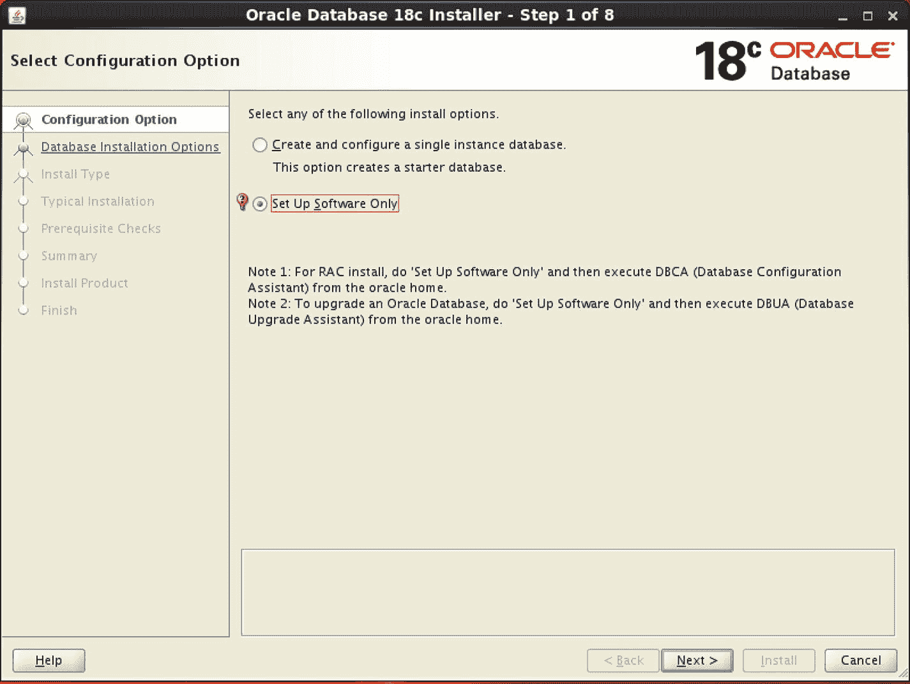

图 18-1

Oracle 18c 安装程序步骤 1

选择“仅设置软件”选项，因为我们在此系统上已经有一个数据库。图 18-1 中的注释 2 确认这对于我们的测试机是正确的选择。单击下一步。在下一个屏幕（步骤 2）上，选择“执行单实例安装”选项，然后单击下一步。在下一个屏幕上，选择了企业版。单击下一步。

在步骤 4 的屏幕上，我们需要确保 Oracle 基目录正确。在以前的版本中，`OUI` 会询问我们 Oracle 主目录。在 18c 中，`OUI` 假定产品安装在其解压的位置。从图 18-2 中我们可以看到，软件位置对于我们的主目录是正确的。我们没有选项来更改软件位置。单击下一步。

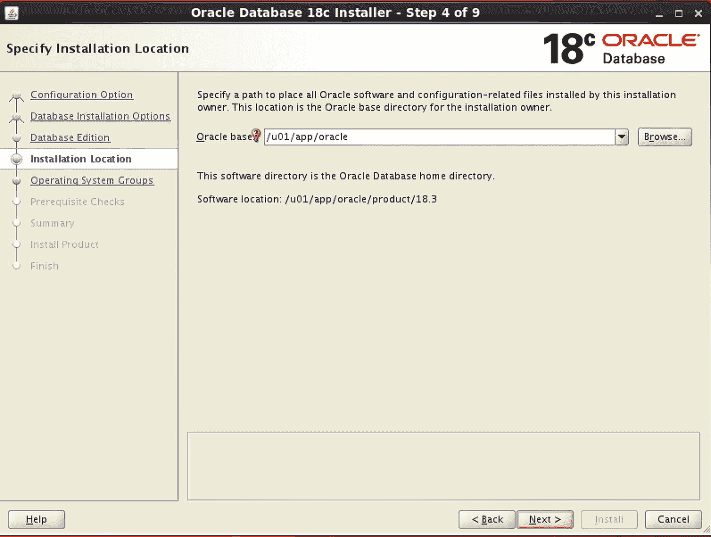

图 18-2

Oracle 18c 安装程序 Oracle 主目录

下一个屏幕询问操作系统组；默认值是可接受的，因此单击下一步。在步骤 6 中，Oracle Universal Installer (`OUI`) 执行其先决条件检查。图 18-3 显示我们的测试机系统上有一个检查失败。

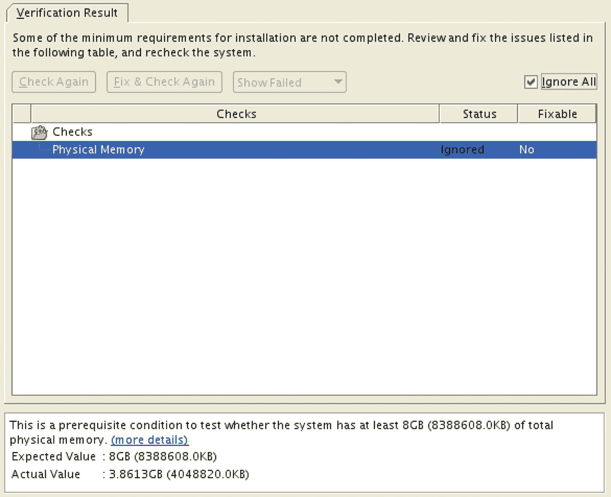

图 18-3

Oracle 18c 先决条件检查

`OUI` 发现数据库服务器没有足够的物理内存。当我们安装 Oracle 12.2 版本时，这不是问题。每个 Oracle 版本的要求都有所不同，而此版本提高了我们所需的内存量。由于这是一个虚拟机，我们可以轻松地将其关闭，增加内存，然后重新启动。确保你的主机工作站或笔记本电脑有足够的内存可以分配给虚拟机。因为这是一个测试机，我们可以选择其他选项忽略发现的问题并继续，因此图 18-3 中勾选了“忽略所有”框。在确认我们打算忽略该问题后，我们可以单击“安装”按钮。

安装将继续进行，`OUI` 将要求以 root 身份运行脚本。运行此脚本时，系统会要求你确认是否可以覆盖 `oraenv` 和 `coraenv` 文件。在安装 12.2 版本时我们没有被问到这个问题，因为这些文件当时还不存在。我们将用新版本覆盖它们，以防 18c 更改了文件内容。新版本现已安装完毕，可以进行数据库升级了。


## 预升级信息工具

在升级数据库之前，您需要针对当前版本运行预升级信息工具。这是一个 Java 归档文件，它会生成一系列需要修复的项目列表，以确保升级成功。要运行预升级信息工具，我们需要将会话的环境变量设置为指向当前数据库，如清单 18-2 所示。

```
[oracle@dbamentor ~]$ export ORACLE_HOME=/u01/app/oracle/product/12.2.0.1
[oracle@dbamentor ~]$ export ORACLE_BASE=/u01/app/oracle
[oracle@dbamentor ~]$ export ORACLE_SID=orcl
[oracle@dbamentor ~]$ export PATH=$ORACLE_HOME/bin:$PATH
清单 18-2
预升级设置环境变量
```

然后，我们使用该 Oracle 主目录中的 Java 可执行文件来运行 JAR 文件。清单 18-3 显示了预升级实用程序的一次示例运行。

```
[oracle@dbamentor ~]$ $ORACLE_HOME/jdk/bin/java -jar /u01/app/oracle/product/18.3/rdbms/admin/preupgrade.jar
==================
PREUPGRADE SUMMARY
==================
/u01/app/oracle/cfgtoollogs/orcl/preupgrade/preupgrade.log
/u01/app/oracle/cfgtoollogs/orcl/preupgrade/preupgrade_fixups.sql
/u01/app/oracle/cfgtoollogs/orcl/preupgrade/postupgrade_fixups.sql
Execute fixup scripts as indicated below:
Before upgrade log into the database and execute the preupgrade fixups
@/u01/app/oracle/cfgtoollogs/orcl/preupgrade/preupgrade_fixups.sql
After the upgrade:
Log into the database and execute the postupgrade fixups
@/u01/app/oracle/cfgtoollogs/orcl/preupgrade/postupgrade_fixups.sql
Preupgrade complete: 2018-09-14T14:21:32
清单 18-3
运行预升级信息工具
```

预升级信息工具为我们创建了三个文件：一个日志文件，以及两个修复脚本（一个升级前用，一个升级后用）。第一步是阅读 `preupgrade.log` 文件的内容。如清单 18-4 所示，日志文件的开头部分提供了一些基本信息，例如当前数据库的版本以及我们要升级到的版本。

```
Report generated by Oracle Database Pre-Upgrade Information Tool Version
18.0.0.0.0 on 2018-09-14T14:21:32
Upgrade-To version: 18.0.0.0.0
=======================================
Status of the database prior to upgrade
=======================================
Database Name:  ORCL
Container Name:  ORCL
Container ID:  0
Version:  12.2.0.1.0
Compatible:  12.2.0
Blocksize:  8192
Platform:  Linux x86 64-bit
Timezone File:  26
Database log mode:  ARCHIVELOG
Readonly:  FALSE
Edition:  EE
Oracle Component                       Upgrade Action    Current Status
----------------                       --------------    --------------
Oracle Server                          [to be upgraded]  VALID
JServer JAVA Virtual Machine           [to be upgraded]  VALID
Oracle XDK for Java                    [to be upgraded]  VALID
Oracle Workspace Manager               [to be upgraded]  VALID
Oracle XML Database                    [to be upgraded]  VALID
Oracle Java Packages                   [to be upgraded]  VALID
清单 18-4
预升级日志文件介绍性信息
```

日志文件的下一部分，如清单 18-5 所示，向我们展示了需要完成的操作。

```
==============
BEFORE UPGRADE
==============
REQUIRED ACTIONS
================
None
RECOMMENDED ACTIONS
===================
1.  (AUTOFIXUP) Gather stale data dictionary statistics prior to database
upgrade in off-peak time using:
EXECUTE DBMS_STATS.GATHER_DICTIONARY_STATS;
Dictionary statistics do not exist or are stale (not up-to-date).
Dictionary statistics help the Oracle optimizer find efficient SQL
execution plans and are essential for proper upgrade timing. Oracle
recommends gathering dictionary statistics in the last 24 hours before
database upgrade.
For information on managing optimizer statistics, refer to the 12.2.0.1
Oracle Database SQL Tuning Guide.
清单 18-5
日志文件操作
```

该工具没有发现任何需要我们完成的必需操作。但它此时推荐了一项操作，即更新过时的数据字典统计信息。务必尽量遵循所有推荐的操作，以确保升级过程更顺利。日志文件为我们提供了要执行的确切命令，如清单 18-6 所示。

```
SQL> EXECUTE DBMS_STATS.GATHER_DICTIONARY_STATS;
PL/SQL procedure successfully completed.
清单 18-6
更新字典统计信息
```

预升级信息工具继续为我们提供一些有价值的信息。在我们的案例中，该实用程序告知我们，有两个表空间在升级过程中将自动扩展。它还通知我们归档日志目标目录将需要大约 3GB 的空间，因此我们需要确保有足够的可用空间。这两点都可以在清单 18-7 中看到。

```
INFORMATION ONLY
================
2.  To help you keep track of your tablespace allocations, the following
AUTOEXTEND tablespaces are expected to successfully EXTEND during the
upgrade process.
Min Size
Tablespace                        Size     For Upgrade
----------                     ----------  -----------
SYSTEM                             720 MB      1140 MB
TEMP                                20 MB       150 MB
Minimum tablespace sizes for upgrade are estimates .
3.  Ensure there is additional disk space in LOG_ARCHIVE_DEST_1 for at least
3139 MB of archived logs.  Check alert log during the upgrade that there
is no write error to the destination due to lack of disk space.
Archiving cannot proceed if the archive log destination is full during
upgrade.
Archive Log Destination:
Parameter    :  LOG_ARCHIVE_DEST_1
Destination  :  /u01/app/oracle/oradata/arch/
The database has archiving enabled.  The upgrade process will need free
disk space in the archive log destination(s) to generate archived logs to.
清单 18-7
预升级信息部分
```

然后，日志文件以关于一个可以在升级前运行以修复任何问题的脚本信息，结束了升级前部分。清单 18-8 包含了测试环境的预升级脚本。

```
ORACLE GENERATED FIXUP SCRIPT
=============================
All of the issues in database ORCL
which are identified above as BEFORE UPGRADE "(AUTOFIXUP)" can be resolved by executing the following
SQL>@/u01/app/oracle/cfgtoollogs/orcl/preupgrade/preupgrade_fixups.sql
清单 18-8
预升级修复脚本
```

预升级实用程序无法生成命令来修复所有升级前可能需要关注的问题。如果有修复脚本无法处理的问题，实用程序会告知我们这一情况。为稳妥起见，我们在数据库中运行了预升级修复脚本，如清单 18-9 所示。


## 升级前修复脚本执行

```
SQL> @preupgrade_fixups.sql
正在执行 Oracle 升级前修复脚本
由以下工具自动生成:       Oracle 升级前脚本
版本: 18.0.0.0.0 构建: 1
生成日期:            2018-09-14 14:21:30
目标源数据库:     ORCL
源数据库版本: 12.2.0.1.0
升级目标版本:  18.0.0.0.0

升级前                             升级前
操作                              问题是否
编号  升级前检查名称                已修复    需要数据库管理员进一步操作
------  ------------------------  ----------  ----------------------------
1.  dictionary_stats          是         无。
2.  tablespaces_info          否          仅供参考。
                                   进一步操作是可选的。
3.  min_archive_dest_size     否          仅供参考。
                                   进一步操作是可选的。

修复脚本已运行并解决了它们能处理的问题。但是，
升级前工具最初识别出的一些问题仍未修复，
并且仍然存在于数据库中。
根据具体问题的严重程度及其性质，
这可能意味着您的数据库尚未准备好进行升级。
要解决遗留问题，请首先查看
preupgrade_fixups.sql 文件，并在其中搜索上面列出的
失败的 CHECK NAME（检查名称）或 Preupgrade Action Number（升级前操作编号）。
在那里，您将找到来自升级前工具的原始对应诊断消息，
其中更详细地解释了仍需要完成的工作。
PL/SQL 过程已成功完成。
```

### 回到日志文件中，剩下的只有升级后部分。

## 升级后信息

```
=================
升级后
=================
必需操作
============
无
建议操作
===================
4.  使用 `DBMS_DST` 包升级数据库时区文件。
    数据库当前使用的时间区文件版本为 26，而目标版本 `18.0.0.0.0`
    自带的时间区文件版本为 31。
    Oracle 建议升级到所需（最新）版本的时区文件。
    更多信息，请参阅 `18.0.0.0.0` 版《Oracle 数据库全球化支持指南》中的
    “升级时区文件和带时区的时间戳数据”。
5.  （自动修复）升级后使用以下命令收集字典统计信息：
    `EXECUTE DBMS_STATS.GATHER_DICTIONARY_STATS;`
    Oracle 建议在升级后收集字典统计信息。
    字典统计信息为 Oracle 优化器提供 essential 信息，以帮助其找到高效的 SQL 执行计划。
    数据库升级后，统计信息需要重新收集，因为升级过程中可能会有表发生显著变化，
    或者可能有新表尚未收集统计信息。
6.  升级后，并在系统有代表性工作负载时，使用以下命令收集固定对象统计信息：
    `EXECUTE DBMS_STATS.GATHER_FIXED_OBJECTS_STATS;`
    此建议适用于所有升级前运行。
    固定对象统计信息为 Oracle 优化器提供 essential 信息，以帮助其找到高效的 SQL 执行计划。
    这些统计信息是特定于生成它们的 Oracle 数据库版本的，在数据库升级后可能已经过时。
    有关管理优化器统计信息的详细信息，请参阅 `12.2.0.1` 版《Oracle 数据库 SQL 调优指南》。
ORACLE 生成的修复脚本
=============================
上面识别出的、数据库 ORCL 中所有标记为升级后“（自动修复）”的问题
都可以通过执行以下命令来解决：
SQL>`@/u01/app/oracle/cfgtoollogs/orcl/preupgrade/postupgrade_fixups.sql`
```

日志文件中的输出告诉我们没有必需操作。建议升级时区信息并收集字典和固定对象统计信息。`升级前信息工具` 已生成一个升级后修复脚本，我们可以执行该脚本来执行这些推荐操作。

我们现在已准备好开始数据库升级。新的 Oracle 软件已安装，并且已执行 `升级前实用程序`。该实用程序建议的所有操作已在升级前执行。


## 升级数据库

在本次升级中，我们将使用 `Database Upgrade Assistant`。大多数 Oracle 升级都使用此工具，因为它能通过自动化升级过程，实现最短的停机窗口并最大程度降低风险。

首先，我们需要将会话的环境变量指向新的软件主目录，但保留相同的 `Oracle SID`。然后，我们需要启动 `DBUA` 工具。代码清单 18-11 展示了如何在我们的 Linux 测试环境中设置环境变量并启动 `DBUA`。

```
[oracle@dbamentor ~]$ export ORACLE_HOME=/u01/app/oracle/product/18.3
[oracle@dbamentor ~]$ export ORACLE_SID=orcl
[oracle@dbamentor ~]$ export PATH=$ORACLE_HOME/bin:$PATH
[oracle@dbamentor ~]$ dbua
代码清单 18-11
设置升级环境
```

在如图 18-4 所示的初始屏幕上，`DBUA` 会询问要升级哪个数据库。如果服务器上有多个数据库，`DBA` 需要从列表中选择。我们的测试环境只有一个数据库。如果从另一台服务器运行此工具，则必须提供 `SYSDBA` 凭据。通常，您是在数据库服务器本身上运行此工具，因此 `SYSDBA` 的用户名和密码可以留空。

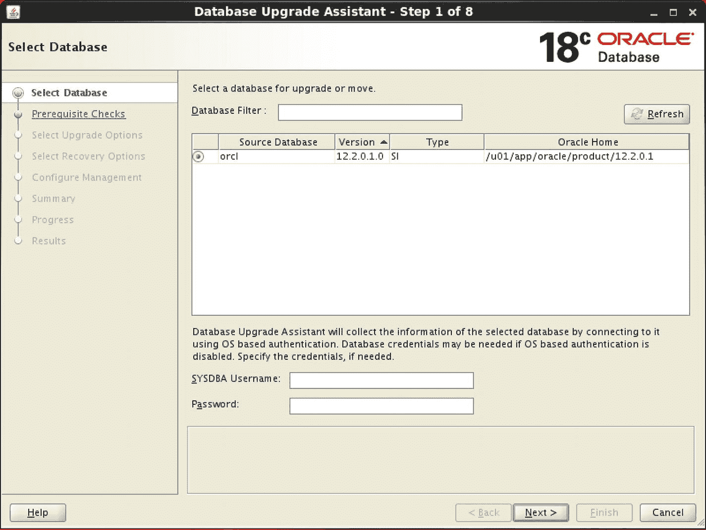

**图 18-4**
**DBUA 升级目标选择**

点击 `Next` 按钮后，`DBUA` 将花费几分钟时间收集有关待升级数据库的信息。`DBUA` 完成此任务后，将执行一些先决条件检查。图 18-5 显示了这些检查的结果。

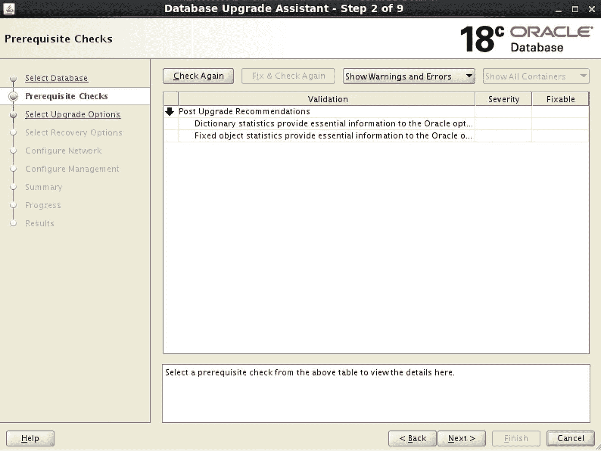

**图 18-5**
**DBUA 先决条件检查屏幕**

如果我们很好地修复了 `Pre-Upgrade Information Tool` 发现的任何问题，那么先决条件检查应该会通过，且不会有任何额外发现。在图 18-5 中，唯一的是一些升级后的建议，这些我们已经知道并将在最后处理。

点击 `Next` 后，系统会要求我们提供一些升级选项，如图 18-6 所示。

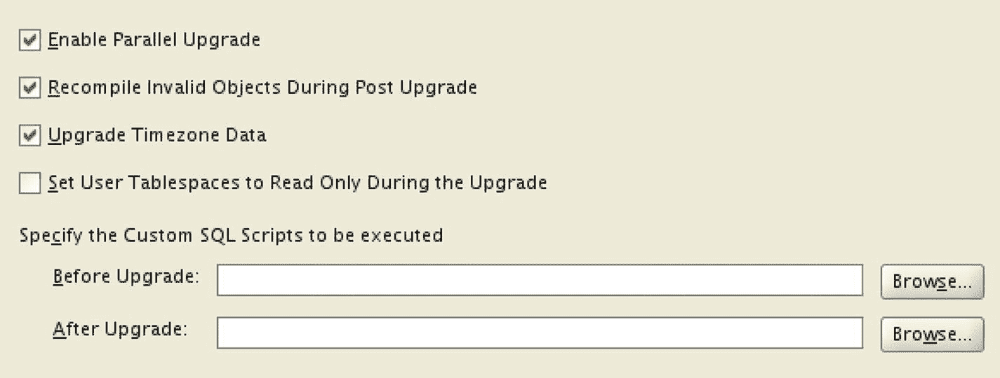

**图 18-6**
**DBUA 升级选项**

图 18-6 中的前三个选项默认被选中，我们通常保持这些选项不变。第一个选项通过并行执行许多任务让升级过程运行得更快。如果您正在此服务器上运行多个数据库，您可能希望取消选中此框，以使并行操作不会对其他数据库性能产生负面影响。第二个选项将运行一个脚本，重新编译在升级期间变为无效的对象。没有充分的理由取消选中此框。第三个选项升级时区数据。同样，几乎没有理由避免这样做。

第四个选项指示 `DBUA` 将用户表空间更改为 `只读`。此选项用于在升级失败时促进快速回退，但 Oracle 建议您如果担心此问题，则使用有保证的还原点。

`DBUA 步骤 3` 的最后一部分允许您在升级前后执行自定义脚本。如果您愿意，可以将 `升级后` 部分指向由 `Pre-Upgrade Installation Tool` 生成的修复脚本。

在 `步骤 4` 中，如图 18-7 所示，`DBUA` 询问我们，如果升级过程中发生故障，我们希望如何处理数据库恢复。

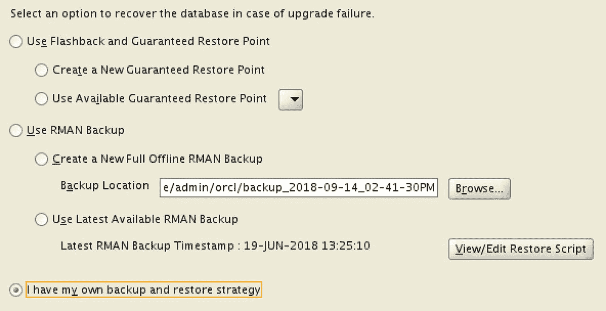

**图 18-7**
**DBUA 还原选项**

如果您选择使用 `闪回` 和有保证的还原点，或者选择使用 `RMAN` 备份，并且在升级过程中发生错误，`DBUA` 将自动使用您选择的选项将您恢复到起始点。如果您选择最后一个选项，即使用您自己的备份和恢复策略，`DBUA` 将无法为您恢复。您将必须自己执行恢复操作。

如前所述，Oracle 的建议是使用有保证的还原点。这是让您恢复到升级前状态的最快方法，但您必须已经定义了 `闪回恢复区`。另一个很好的选择是 `RMAN` 备份。

记得我说过您需要在开始升级过程之前执行备份吗？`DBUA` 的 `步骤 4` 就是您定义该策略的地方。如果您选择最后一个选项，您的备份应该在启动 `DBUA` 之前进行。

由于这是一个测试环境，我将选择使用我自己的备份和恢复策略，并点击 `Next` 进入 `DBUA` 的下一个屏幕，如图 18-8 所示。`DBUA` 的 `步骤 5` 要求我们创建一个新的 `监听器`。

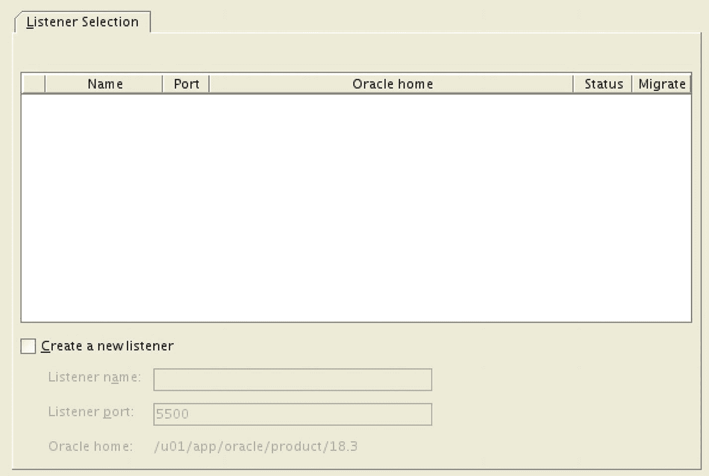

**图 18-8**
**DBUA 监听器选择**

`DBUA` 看不到当前的 `监听器`，因为它是在旧的 Oracle 主目录下运行的。它确实为我们提供了创建新 `监听器` 的选项，但我们不希望服务器上运行两个监听器。升级完成后，我将向您展示如何轻松地将 `监听器` 移动到新的主目录。在此步骤中接受默认设置并点击 `Next` 按钮。

在 `步骤 6` 中，`DBUA` 要求我们定义管理选项，即我们是否想使用 `Oracle Enterprise Manager (EM) Database Express` 或 `EM Cloud Control` 来管理此数据库。默认情况下，选择了 `EM Database Express`。我在图 18-9 中取消选择了该选项。

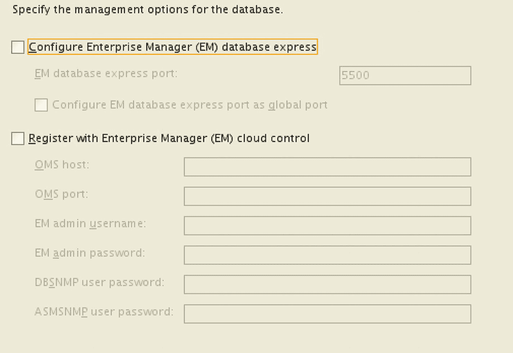

**图 18-9**
**DBUA 管理选项**

如果我使用 `Cloud Control`，我可以轻松地在以后添加此数据库。如果我将来需要，我可以使用 `Database Configuration Assistant (DBCA)` 添加 `Database Express`。目前，我们将不使用任何 `Enterprise Manager`。如果您想使用 `EM`，请选择 `Database Express` 选项。在升级结束时，`DBUA` 将为您提供有关如何使用它的信息。

当我们点击 `Next` 按钮时，我们将转到所选选项的数据库摘要页面，如图 18-10 所示。

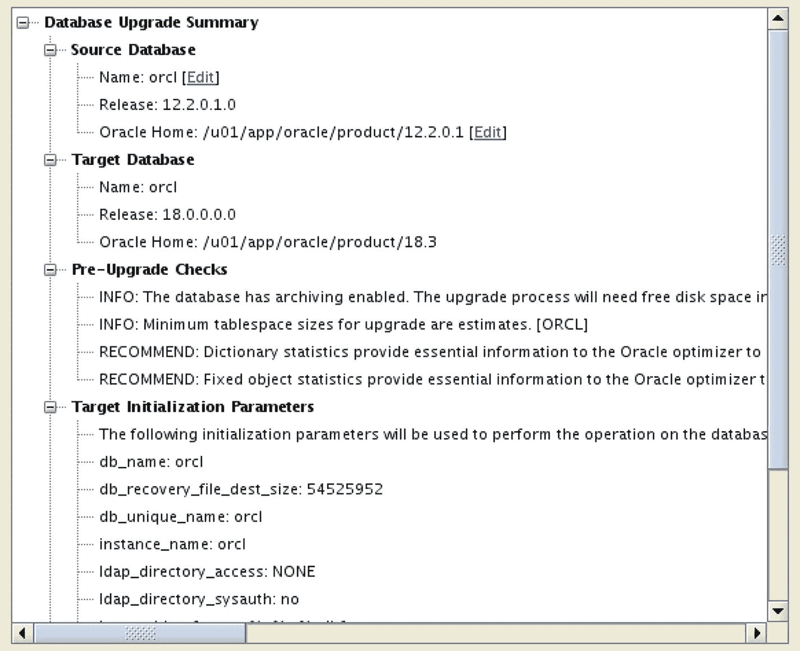

**图 18-10**
**DBUA 摘要**

此屏幕是我们继续之前最后确认一切是否正确的机会。到目前为止，`DBUA` 尚未进行任何更改，也未尝试升级数据库。当您点击 `Finish` 按钮时，升级将开始。此时数据库将不可用。您可以在计划的停机窗口之前提前到达此点，为计划开始的升级节省一些时间。

现在是让 `DBUA` 为我们完成所有艰巨工作的时候了。点击 `Finish` 按钮，然后坐下来观看它工作。我们可以在图 18-11 中看到 `进度` 屏幕的示例。

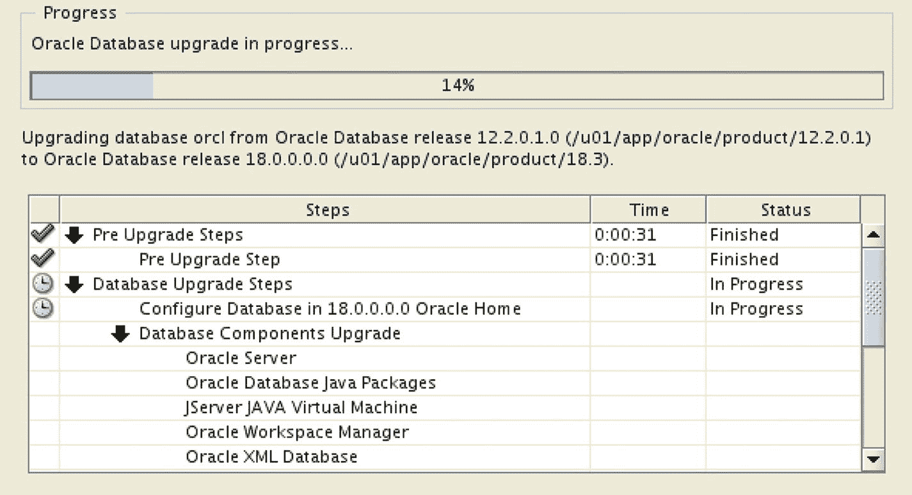

**图 18-11**
**DBUA 进度屏幕**

当 `DBUA` 正在升级数据库时，它将继续显示 `进度` 屏幕，以便您可以跟踪进度。一段时间后，升级将完成，`DBUA` 将显示一个类似于图 18-12 的最终结果页面。


