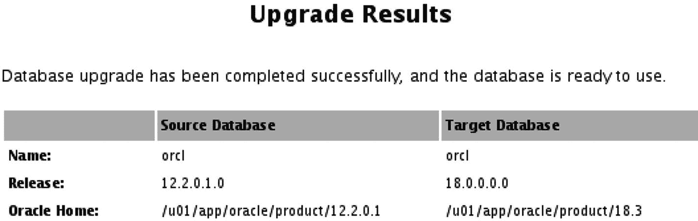
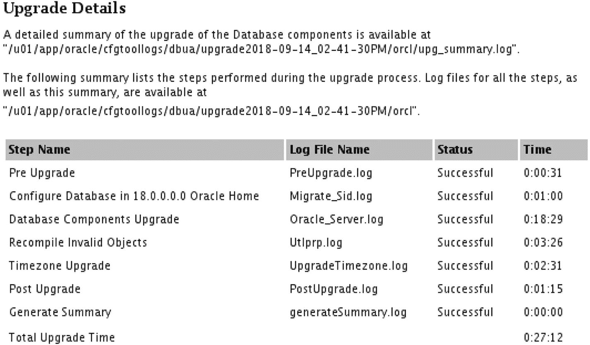

# DBUA 升级结果



图 18-12：DBUA 升级结果页面

升级结果显示数据库已从 12.2 升级到 18c。如果向下滚动结果页面，升级详情部分将显示每个步骤的完成耗时，如图 18-13 所示。



图 18-13：升级详情部分

一个有趣的点是，我们升级到的是 18.3 版本，但图 18-13 中的升级详情显示的是 18.0 版本。我们可以看到，对于这个测试库，总升级时间约为 27 分钟。即使对于非常大的数据库，我也通常会计划一小时的停机时间。希望您从升级开发和测试数据库时能获得良好的时间预估。当您对结果满意时，点击“关闭”按钮以结束 DBUA 会话。

## 升级后任务

升级完成后，还有一些额外的任务需要处理。我们已经知道需要运行 Pre-Upgrade Installation Tool 为我们生成的升级后修复脚本。我们需要将环境更改为新的 Oracle 主目录，然后执行该脚本。在清单 18-12 中，我们将环境设置为新的软件主目录并运行升级后修复脚本。

```
[oracle@dbamentor ~]$ export ORACLE_HOME=/u01/app/oracle/product/18.3
[oracle@dbamentor ~]$ export ORACLE_SID=orcl
[oracle@dbamentor ~]$ export PATH=$ORACLE_HOME/bin:$PATH
[oracle@dbamentor ~]$ sqlplus /nolog
SQL*Plus: Release 18.0.0.0.0 - Production on Fri Sep 14 16:31:20 2018
Version 18.3.0.0.0
Copyright (c) 1982, 2018, Oracle.  All rights reserved.
SQL> connect / as sysdba
Connected.
SQL> @/u01/app/oracle/cfgtoollogs/orcl/preupgrade/postupgrade_fixups.sql
Executing Oracle POST-Upgrade Fixup Script
Auto-Generated by:       Oracle Preupgrade Script
Version: 18.0.0.0.0 Build: 1
Generated on:            2018-09-14 14:21:32
For Source Database:     ORCL
Source Database Version: 12.2.0.1.0
For Upgrade to Version:  18.0.0.0.0
```
清单 18-12：升级后修复脚本

为简洁起见，省略了部分脚本输出。

我总是执行的一项检查是确保 DBUA 已更新`oratab`文件，使其指向该数据库的新主目录。DBUA 从未跳过此步骤，但我仍然会检查它，也许是出于习惯。清单 18-13 显示我的`oratab`文件已被更新。

```
[oracle@dbamentor ~]$ cat /etc/oratab
#
# This file is used by ORACLE utilities.  It is created by root.sh
# and updated by either Database Configuration Assistant while creating
# a database or ASM Configuration Assistant while creating ASM instance.
# A colon, ':', is used as the field terminator.  A new line terminates
# the entry.  Lines beginning with a pound sign, '#', are comments.
#
# Entries are of the form :
#   $ORACLE_SID:$ORACLE_HOME::
#
# The first and second fields are the system identifier and home
# directory of the database respectively.  The third field indicates
# to the dbstart utility that the database should , "Y", or should not,
# "N", be brought up at system boot time.
#
# Multiple entries with the same $ORACLE_SID are not allowed.
#
#
orcl:/u01/app/oracle/product/18.3:Y
```
清单 18-13：Oratab 更新

`oratab`文件确实指向了新的 Oracle 主目录。

如果您记得本章前面的内容，DBUA 询问了我们希望如何处理 Oracle 监听器。我们指示 DBUA 不要对监听器做任何操作。始终建议监听器的运行版本与您的最高数据库版本相同。如果您在同一服务器上运行 Oracle 12.2 数据库以及 Oracle 18 数据库，请使用 Oracle 18 监听器。

要切换到新的监听器，只需关闭旧的监听器，将任何配置文件复制到新主目录，然后使用新版本启动监听器。步骤如清单 18-14 所示。

## 监听器升级

```
[oracle@dbamentor ~]$ export ORACLE_HOME=/u01/app/oracle/product/12.2.0.1
[oracle@dbamentor ~]$ $ORACLE_HOME/bin/lsnrctl stop
LSNRCTL for Linux: Version 12.2.0.1.0 - Production on 14-SEP-2018 16:35:57
Copyright (c) 1991, 2016, Oracle.  All rights reserved.
Connecting to (ADDRESS=(PROTOCOL=tcp)(HOST=)(PORT=1521))
The command completed successfully
[oracle@dbamentor ~]$ cp /u01/app/oracle/product/12.2.0.1/network/admin/*.ora /u01/app/oracle/product/18.3/network/admin/.
cp: cannot stat `/u01/app/oracle/product/12.2.0.1/network/admin/*.ora': No such file or directory
[oracle@dbamentor ~]$ export ORACLE_HOME=/u01/app/oracle/product/18.3
[oracle@dbamentor ~]$ $ORACLE_HOME/bin/lsnrctl start
LSNRCTL for Linux: Version 18.0.0.0.0 - Production on 14-SEP-2018 16:36:55
Copyright (c) 1991, 2018, Oracle.  All rights reserved.
Starting /u01/app/oracle/product/18.3/bin/tnslsnr: please wait...
TNSLSNR for Linux: Version 18.0.0.0.0 - Production
Log messages written to /u01/app/oracle/diag/tnslsnr/dbamentor/listener/alert/log.xml
Listening on: (DESCRIPTION=(ADDRESS=(PROTOCOL=tcp)(HOST=dbamentor)(PORT=1521)))
Connecting to (ADDRESS=(PROTOCOL=tcp)(HOST=)(PORT=1521))
STATUS of the LISTENER

Alias                     LISTENER
Version                   TNSLSNR for Linux: Version 18.0.0.0.0 - Production
Start Date                14-SEP-2018 16:36:55
Uptime                    0 days 0 hr. 0 min. 56 sec
Trace Level               off
Security                  ON: Local OS Authentication
SNMP                      OFF
Listener Log File         /u01/app/oracle/diag/tnslsnr/dbamentor/listener/alert/log.xml
Listening Endpoints Summary...
(DESCRIPTION=(ADDRESS=(PROTOCOL=tcp)(HOST=dbamentor)(PORT=1521)))
Services Summary...
Service "orcl" has 1 instance(s).
Instance "orcl", status READY, has 1 handler(s) for this service...
Service "orclXDB" has 1 instance(s).
Instance "orcl", status READY, has 1 handler(s) for this service...
The command completed successfully
```

`cp`命令会在旧主目录的`network/admin`子目录中查找任何`*.ora`文件。它在 Listing 18-14 中没有找到任何文件，因此`cp`命令给出了一个错误。监听器不需要任何配置文件。通常，默认的、没有任何配置文件的配置就足够了。在将监听器更改为新主目录时，传入连接将不可用，因此您可能需要为此迁移安排一个短暂的停机窗口。

接下来，我检查数据库以查看它认为自己的版本是什么，如 Listing 18-15 所示。

## 版本检查

```
SQL> select banner_full from v$version;
BANNER_FULL
--------------------------------------------------------------------------------
Oracle Database 18c Enterprise Edition Release 18.0.0.0.0 - Production
Version 18.3.0.0.0

SQL> select version from v$instance;
VERSION
-----------------
18.0.0.0.0

SQL> select comp_name,version,status from dba_registry;
COMP_NAME                                VERSION    STATUS
---------------------------------------- ---------- ----------
Oracle Database Catalog Views            18.0.0.0.0 VALID
Oracle Database Packages and Types       18.0.0.0.0 VALID
JServer JAVA Virtual Machine             18.0.0.0.0 VALID
Oracle XDK                               18.0.0.0.0 VALID
Oracle Database Java Packages            18.0.0.0.0 VALID
Oracle Real Application Clusters         18.0.0.0.0 OPTION OFF
Oracle XML Database                      18.0.0.0.0 VALID
Oracle Workspace Manager                 18.0.0.0.0 VALID
```

所有的版本信息都核对无误。Oracle 表明这是一个 18.0 数据库，但如果您看第一个查询，我们可以看到横幅显示版本是我们预期的 18.3。此外，`DBA_REGISTRY`视图中的所有组件都显示为`VALID`或选项已关闭。

最后的检查是查找无效对象。我们让`DBUA`重新编译了任何无效对象，但我们想双重检查重新编译是否涵盖了所有内容，如 Listing 18-16 所示。

## 无效对象检查

```
SQL> select count(*) from dba_objects where status='INVALID';
COUNT(*)
----------
0
```

如果上面的查询返回非零计数，我们需要进一步调查，确定哪些对象无效以及它们为什么保持无效状态。如果对象是应用程序模式的一部分，很可能它们无效的原因与数据库升级无关。如果 Oracle 提供的模式中存在无效对象，您将需要与 Oracle 支持部门合作来修复它们。

至此，我们确信升级是成功的。只剩下一个任务，那就是对数据库进行一次良好的备份。在完成所有辛苦工作后，我们不想再重复这个过程。


## 降级

大多数人从未考虑过对 Oracle 数据库进行降级。我曾在讨论论坛上发起过一个投票，询问有多少人执行过 Oracle 数据库降级。在 675 名受访者中，只有 14 人实践过 Oracle 数据库降级，这个数字至今仍让我感到困惑。我希望更多的 Oracle 数据库管理员至少能偶尔练习一下降级操作。

降级是最后的手段。如果你已在新的 Oracle 版本上对应用程序进行了充分测试，并且测试了升级过程，那么你将永远不需要降级。虽然我实践过降级，但我从未需要对生产数据库进行降级，尽管有一次非常接近。我只会在升级完成后无法修复数据库中的问题时才考虑降级。例如，在升级到 12.1.0.2 时，我遇到了许多优化器问题，导致查询性能低下。在我几乎要执行数据库降级时，我了解到其他人也遇到了同样的问题，而 Oracle 提供了一些隐藏的初始化参数来解决我的问题。

你应该在升级前后都进行备份，这意味着你有能力回溯到任一时间点。现在考虑一下，如果在升级完成并为应用程序用户开放数据库后才发现问题，会发生什么。自升级完成以来，这些应用程序用户已经在数据库中生成了事务。你不能使用升级后创建的备份，因为该备份是用于新版本的。如果你想使用升级前的备份，你当然可以回退到旧版本，但你将无法前滚升级后的任何事务。如果你选择使用该升级前的备份，你将面临数据丢失，这一点简单明了。

在理想情况下，数据库升级后的第二天早上我来到办公室，没有人会说什么。最终用户根本不知道数据库现在是一个闪亮的新版本。没有人抱怨，也没有报告问题。有时事情会发生，而数据库管理员的工作就是修复数据库，因为升级破坏了某些东西。有些问题容易解决，有些则可能很困难。尽快解决问题，因为你真的不想回退到旧版本。在极少数情况下，你可能需要做出决定：升级并非明智之举，需要回到旧版本。你有两个选择：从升级前的备份恢复并丢失自那时起的所有事务，或者执行降级。对我来说，数据丢失是一个糟糕的选择，降级是更好的选择，这就是为什么当我发现许多数据库管理员根本不考虑降级时感到惊讶。这一点非常重要，我再强调一遍。降级可能是你在不丢失任何数据的情况下回退到旧数据库版本的唯一选择。

新版本的 Oracle *升级指南* 总是专门用一章来讲 Oracle 降级。如果你必须执行降级，你会想要非常仔细地阅读该章。它将包含如何执行降级的分步说明。步骤取决于你可能正在使用和安装的各种选项，因此本章不会重复该过程。从高层来看，降级步骤是：关闭数据库，使用旧版本软件以 `DOWNGRADE` 模式启动，然后运行 `catdwgrd.sql` 脚本。

`DBUA` 不执行降级。降级是一个手动过程。我建议你在职业生涯的不同阶段在测试环境中练习 Oracle 降级。我们的测试环境是练习的完美场所。只需关闭虚拟机，并对服务器及其存储进行快照。全部启动后，按照 *升级指南* 中的步骤降级到旧版本。数据库降级后，你可以选择恢复到快照瞬间回到新版本，或者可以再次练习升级，这也不是个坏主意。

## 继续前进

本章讨论了如何将 Oracle 数据库升级到新版本。我们在测试环境中逐步完成了升级过程，现在拥有一个可以运行和把玩的 Oracle 18c 数据库。我们讨论了数据库升级和阅读 Oracle 文档的重要性。我们甚至提到了数据库降级。

在下一章中，我们将更专注于维护 Oracle 数据库。我们将探讨容量规划，以确保数据库能够处理未来的负载。你构建的东西可能今天适用，但明天可能就太小了。

