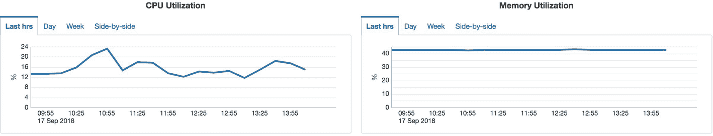
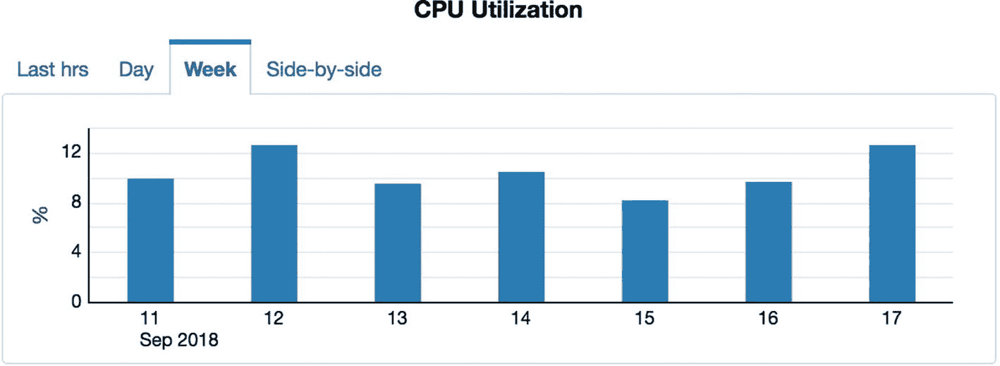
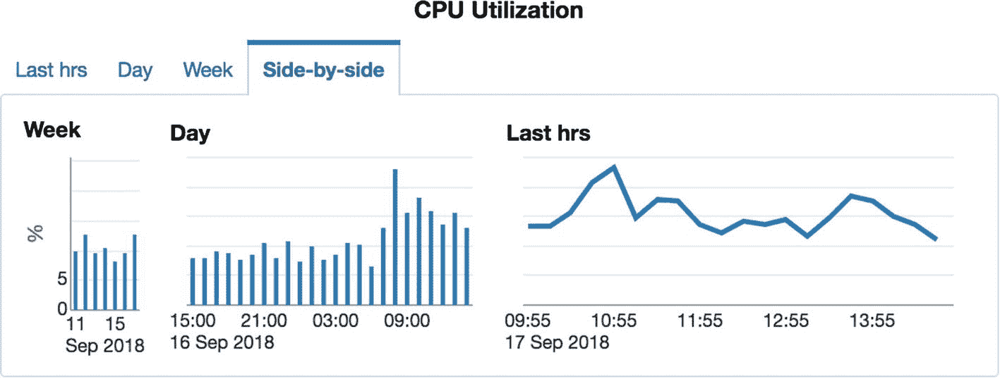
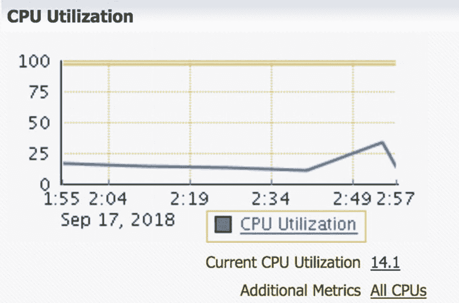
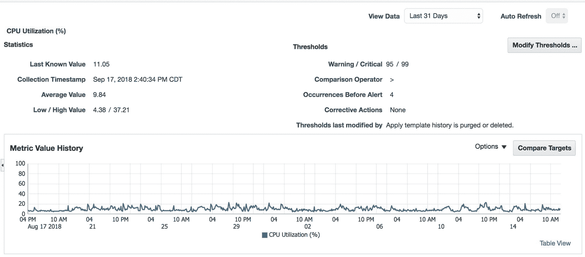
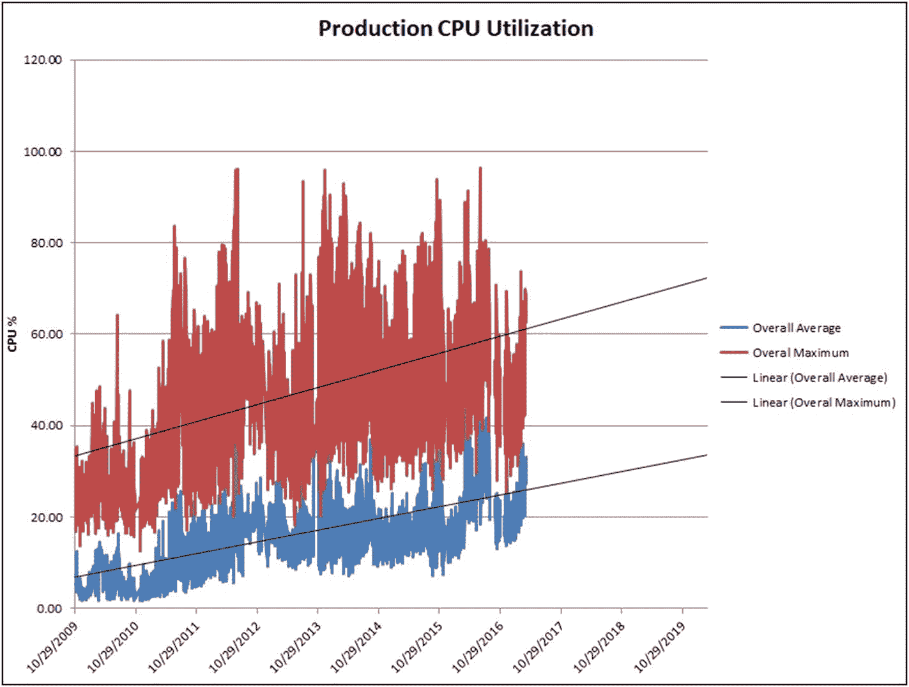
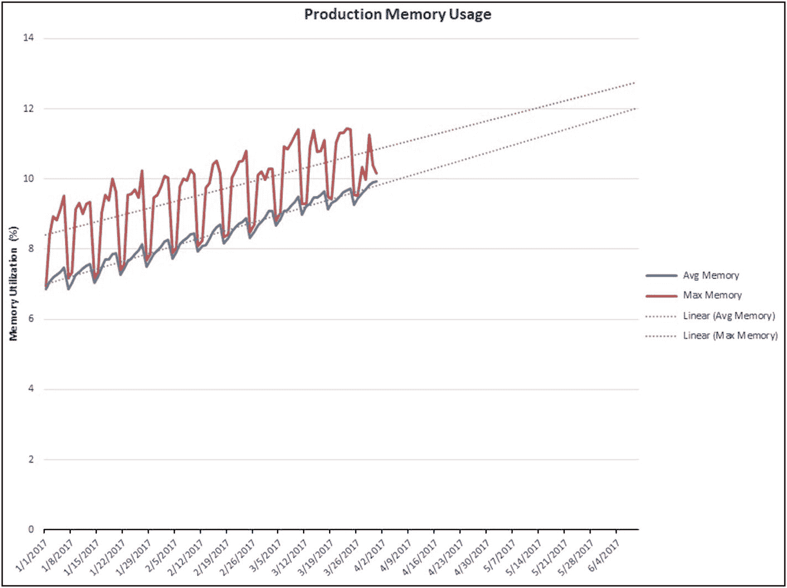

# 企业管理器

如果您的环境中尚未安装，我强烈建议您尽快让 Oracle 企业管理器 (EM) 运行起来。您会庆幸自己花时间安装、配置并开始使用 EM。关于 EM 的专著可谓汗牛充栋，因此我们在此不再赘述其细节。如果您的环境里没有 EM，本章将向您展示一些唾手可得的信息，这或许能让您信服，在不久的将来将其纳入您的 DBA 基础架构。

企业管理器会持续监控您的系统，并捕获有关其配置、资源利用率以及数据库和操作系统性能的信息。正如我们将在本章中看到的，您当然可以创建自己的例程来捕获资源利用率，但正如俗话所说，为何要重复造轮子？让我们来看看 EM 为我们收集的信息示例，这些信息开箱即用，无需额外定制。在 EM 云控制中，您可以转到 `目标` ➤ `主机`，然后单击感兴趣的特定服务器。在摘要屏幕向下滚动一点，您可以看到一些图表，显示该服务器的 CPU 和内存利用率，如图 19-1 所示。



图 19-1 EM 资源利用率摘要

这两张图表向我们展示了该服务器的 CPU 和内存利用率。当我们初次进入此页面时，图表默认显示过去四小时的活动情况。对于容量规划而言，四个小时是不够的。此视图用于帮助发现即时的性能问题。如果您想查看更长时间段的信息，可以单击 `天` 选项卡或 `周` 选项卡。图 19-2 显示了查看过去一周数据的同一服务器。



图 19-2 过去一周的 EM CPU 利用率

其中一个更有趣的图表是并排视图，如图 19-3 所示。



图 19-3 EM CPU 利用率并排视图

图 19-3 中的图表如其名所示，并排展示了所有三张图表。对本章而言不幸的是，这里的数据只回溯七天。一周的历史数据远远不足以帮助发现资源利用率的趋势。关键在于，企业管理器正在为我们捕获这些信息。我们只需要善加利用。为了进行准确的容量规划，我们需要尽可能多的数据点。一周甚至一个月的数据可能都不够。我建议至少使用一年的指标数据，不过，我倾向于将我的数据保留整个系统生命周期的长度。

在 EM 中查看同一台主机时，选择 `主机` ➤ `监控` ➤ `CPU 详细信息`。这将带我们更深入地查看 EM 对该服务器上该资源的指标，如图 19-4 所示。



图 19-4 EM CPU 利用率详细信息

在图 19-4 的图表中，我们可以看到过去一小时的 CPU 利用率。单击图表图例中的 `CPU 利用率` 超链接，将转到下一个屏幕，如图 19-5 所示。默认情况下，视图显示过去 24 小时的数据，但这里将顶部的 `查看数据` 下拉菜单更改为 31 天。



图 19-5 过去 31 天的 EM CPU 利用率

现在我们对于该服务器的历史 CPU 利用率有了更好的了解。从图 19-5 的图表中我们可以看到，过去一个月的 CPU 利用率显示出相对稳定的消耗状态。当然，每天之内有起伏，但总体上图表呈现出一种水平的、线性的模式。我们没有看到任何尖峰，图表也未显示出随时间增长的趋势。话虽如此，可以说，31 天的数据不足以恰当地确定未来的容量规划。

企业管理器在其存储库中存储 CPU 利用率的指标值。我使用了清单 19-1 中的查询从企业管理器存储库获取服务器的 CPU 利用率。

```sql
select rollup_timestamp,trunc(average,2) as host_avg,
trunc(maximum,2) as host_max
from sysman.mgmt$metric_daily
where metric_column='cpuUtil'
and target_name='myhost.acme.com' and metric_label='Load'
order by rollup_timestamp;
```
清单 19-1 EM CPU 利用率存储库查询

如果您在 EM 存储库数据库中运行上述查询，您可以看到其中有多少数据。通常，它会是 90 天或更少的数据。请注意，这是您的 EM 存储库数据库，而不是该服务器上的数据库。

使用该查询提取数据值并将其存储在 Excel 电子表格中是一个简单的操作。通过卸载到 Excel，您可以将数据点保留的时间远比 EM 在其存储库中保留的时间长得多。您还可以用这些信息创建图表。图 19-6 显示了我根据同一查询创建的简单图表，用于存储随时间变化的数据值。



图 19-6 CPU 趋势线

在图 19-6 的图表中，我添加了一条线性趋势线，预测未来三年的资源利用率。为此，我只需右键单击折线图，选择 `添加趋势线`，然后修改趋势线的属性，将其预测期设为 1,095 天，大约三年。

这并不困难。企业管理器已经在为我捕获这些数据。我所做的只是将其存储在 Excel 中并创建一个快速简便的图表。我现在对未来的需求有了很好的了解。该图表使用了七年的数据，这意味着我对我的预测也有很高的置信度。

还记得在第 17 章中我们讨论过的了解您的受众吗？像图 19-6 所示的图表对大多数人来说都易于理解。蓝线是每天的平均 CPU 消耗量。红线是每天的最大 CPU 消耗量。趋势线显示了我们的预测。您无需成为 Oracle 专家就能理解其意。IT 经理和 IT 团队的其他成员可以立即从这种简单的分析中受益。

同样，我们可以使用清单 19-2 中的查询，从 EM 存储库获取受监控服务器的内存使用情况。

```sql
select rollup_timestamp,trunc(average,2) as host_avg,
trunc(maximum,2) as host_max
from sysman.mgmt$metric_daily
where metric_column='usedLogicalMemoryPct'
and target_name='myhost.acme.com'
order by rollup_timestamp;
```
清单 19-2 EM 内存利用率存储库查询

同样，我们将上述查询的数据点复制到 Excel 电子表格，并绘制随时间变化的图表。图 19-7 中的图表显示了来自另一个生产系统的内存使用情况。



图 19-7 内存趋势线


