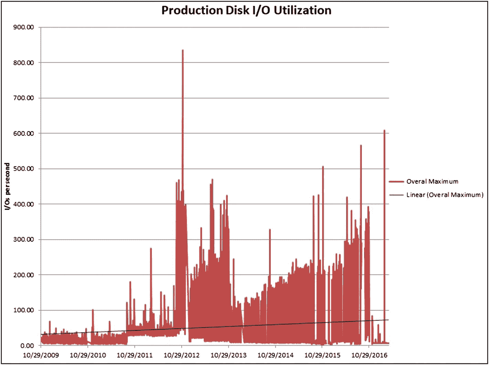
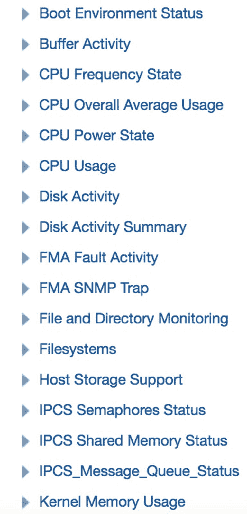
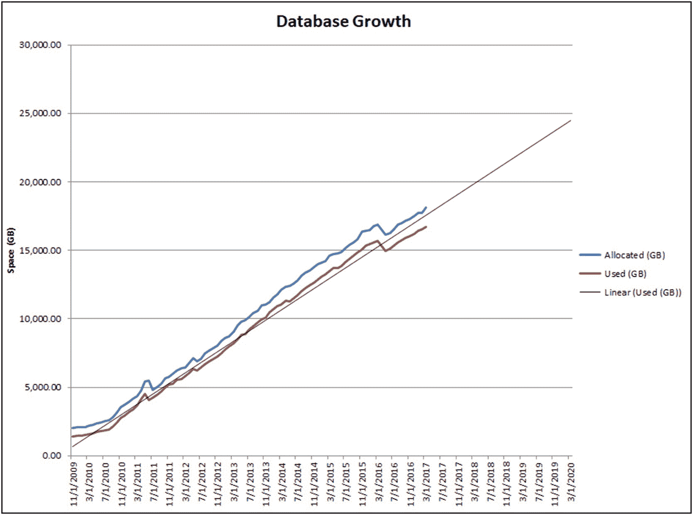

# 监控与容量规划图表

在图 19-7 的图表中，我们仍然可以看到线性增长，但趋势是向上的。与 CPU 图表类似，此图表显示了平均每日利用率以及最大每日利用率。在进行容量规划时，我们需要能够处理最大值。我们需要能够处理该资源需求的峰值。

在 Excel 中生成的这样一个简单图表，对于预测和解释您的资源需求大有帮助。如果图表显示我将在可预见的未来达到某个资源限制，那么就很容易证明花费额外资金提供更多该资源是合理的。

与来自 Enterprise Manager 存储库的 CPU 和内存查询类似，我们也可以查看以每秒输入/输出操作数衡量的磁盘利用率。清单 19-3 中的查询可用于从 EM 存储库中获取受监控服务器的这些值。

```sql
select rollup_timestamp,trunc(average,2) as host_avg,
trunc(maximum,2) as host_max
from sysman.mgmt$metric_daily
where metric_column='totiosmade'
and target_name='myhost.acme.com'
order by rollup_timestamp;
```
**清单 19-3**
**EM 磁盘利用率存储库查询**

同样，上面查询的输出很容易写入 Excel 电子表格，并随时间绘制图表，以显示类似于图 19-8 的图形。



**图 19-8**
**磁盘趋势线**

图 19-8 中的图表显示了从一个真实生产系统观察到的、在任意给定日期出现的最大 IOPS。图中有一条由 Excel 生成的趋势线，但我们可以看到大多数数据点都在趋势线之上，并且在许多情况下远高于该趋势线。该图表是能够处理许多不同资源利用峰值的一个很好的例子。该系统多次产生了超过 400 个 IOPS。无论趋势线显示什么，磁盘子系统都需要能够处理图表中的所有那些峰值。

到目前为止展示的 CPU、内存和磁盘利用率图表都是从 Enterprise Manager 存储库获取的数据。如果您愿意查看，EM 还保存着更多的度量指标。我倾向于关注前面提到的“三大”指标，但有时也需要查看其他指标。当选择了服务器目标后，选择 `Host` ➤ `Monitoring` ➤ `All Metrics` 以查看您可以使用的广泛数据。图 19-9 仅显示了可选类别中的几个。该列表中的每个项目都可以展开以查看该类别中的度量指标。



**图 19-9**
**EM 度量指标类别**

如前所述，EM 会保留一段时间的度量指标，但通常不足以支持容量规划决策。为此，您必须将数据从 EM 存储库中取出并存储在其他地方。本章中展示的查询可以帮助您开始弄清楚数据在该存储库中的存储位置。如果您没有访问 Enterprise Manager 的权限，请立即搭建一个 EM 环境。EM 已经包含在您的 Oracle 许可证中，因此您无需额外付费。您也可以使用第三方工具，但可能需要为其支付额外费用。

## 数据字典

在第 14 章中，我们探讨了数据字典及其在 Oracle 数据库中的作用。每个 Oracle 数据库都会跟踪许多度量指标，并允许您在数据字典中查看。您可能想用于容量规划的关键指标之一是数据库的总体大小。数据字典只会告诉您数据库的当前大小。如果您想保留此信息以随时间绘制图表（正如您对容量规划通常期望的那样），那么您必须将数据存储在表中。在清单 19-4 中，我们创建了一个表来保存数据库中段的已分配总空间和已使用总空间。随后的`INSERT`语句可用于用当前日期的值填充该表。只需安排该`INSERT`语句在 Oracle 作业中每月运行一次即可。

```sql
CREATE TABLE db_size (
date_collected  DATE,
gb_allocated   NUMBER,
gb_used   NUMBER);
INSERT INTO db_size
SELECT sysdate, df.gb_alloc, ds.gb_used
FROM (SELECT round(sum(bytes)/1024/1024/1024,2) AS gb_alloc
FROM dba_data_files) df
JOIN (SELECT round(sum(bytes)/1024/1024/1024,2) AS gb_used
FROM dba_segments) ds;
```
**清单 19-4**
**跟踪数据库大小**

如果我们跟踪随时间推移的增长情况，就可以生成一个类似于图 19-10 的图表，同样是在 Excel 中添加了趋势线。



**图 19-10**
**数据库增长趋势线**

在图 19-10 的图表中，我们可以看到这个数据库随时间的增长是非常线性的，这使得生成准确的预测变得容易。我们需要知道的事情之一是容量何时将达到其限制。在为 CPU 和内存显示的图表中，利用率表示为总可用量的百分比。例如，在图 19-6 中，CPU 利用率超过 60%，甚至偶尔接近 100%。但图表中显示的没有一天达到 100%的标记，所以我们仍有资源可用。在图 19-10 的图表中，数值以总千兆字节表示。我们需要知道数据库可用的磁盘空间量。如果我们知道磁盘可以容纳 20TB 的数据，那么当趋势线越过 20,000GB 线时，我们将耗尽磁盘空间。如果磁盘可以容纳 25TB 的数据，我们就有更多时间。因为趋势是一致的，我们可以准确预测我们将耗尽磁盘空间的日期。这使我们能够在达到阈值之前提前为服务器购买更多磁盘。

到目前为止，在本章中，我们已经看到了涵盖 CPU、内存和磁盘这三大领域的简单图表，并且我们将磁盘领域细分为 IOPS 和数据库大小。这四张图是我每月为我的生产数据库系统生成的图表，也是我发现对容量规划最有用的图表。

Oracle 数据字典拥有的度量指标多到您永远无法完全了解其用途。如果本章中的图表不足以满足您的容量规划需求，您应该能够通过查询从数据字典中获取所需的度量指标。然后创建一个表并用数据填充它。确保该表有一个列来显示该度量指标是何时收集的。该列将成为至关重要的列，以便按正确的时间顺序显示度量指标值进行排序。

如果您想查看数据字典中不同的度量指标，可以从查询`V$SYSSTAT`开始。关于这个视图以及大多数其他`V$`视图需要注意的一点是，统计信息是在实例的整个生命周期内递增的。当实例重新启动时，统计信息将重置为零。


