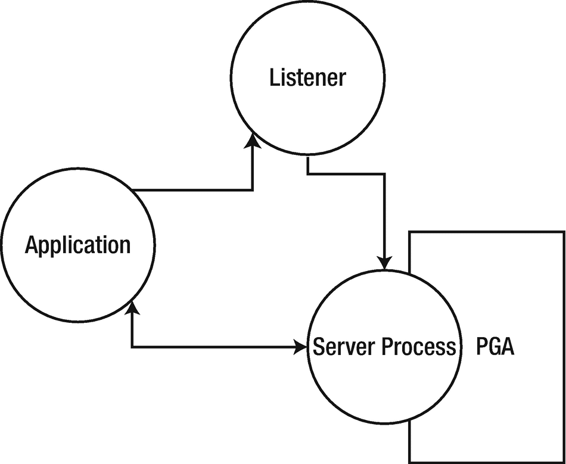
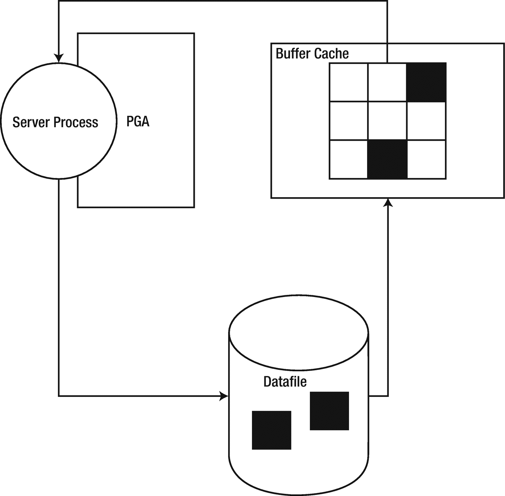
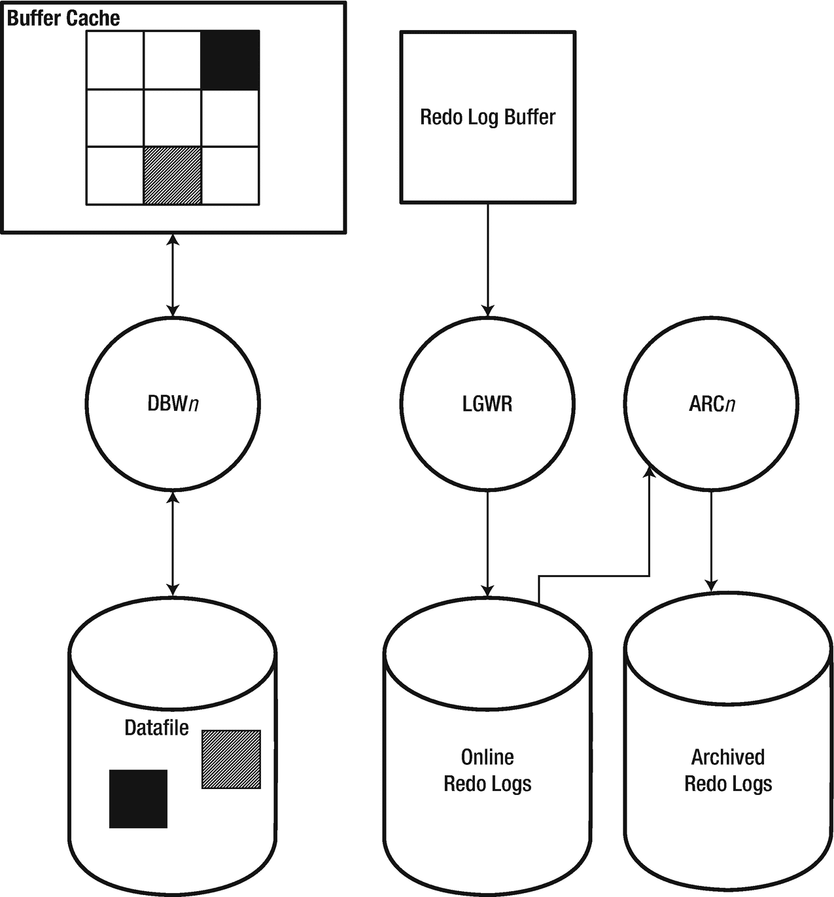
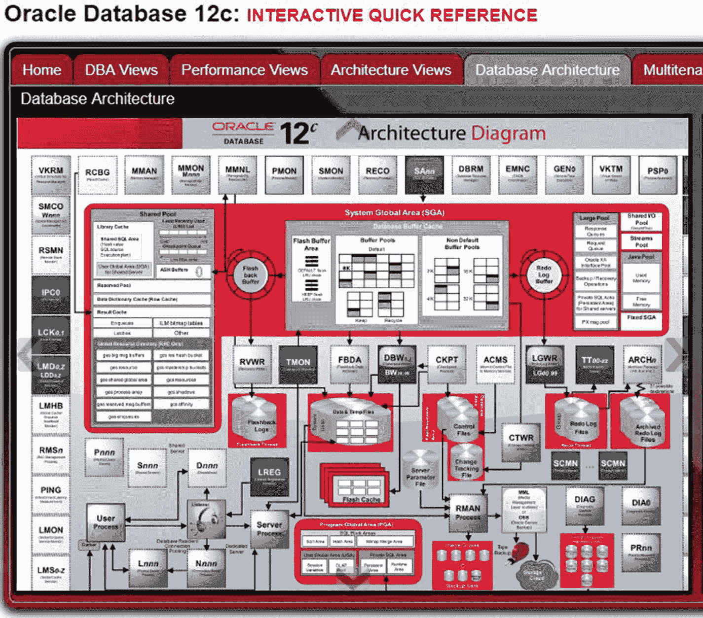
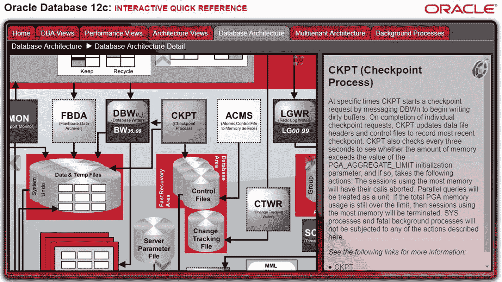
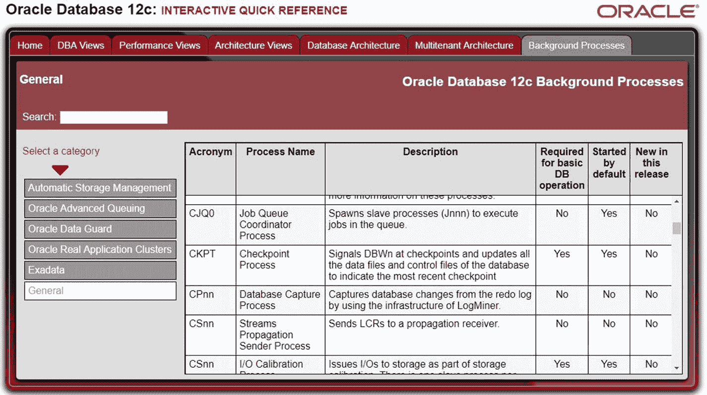
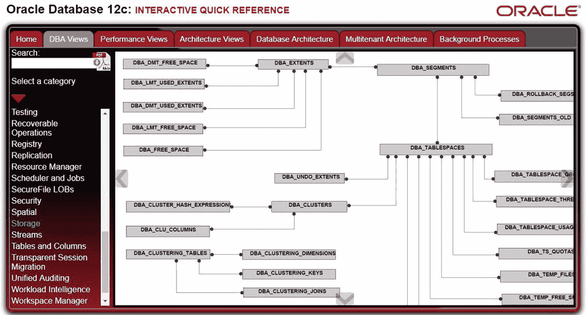
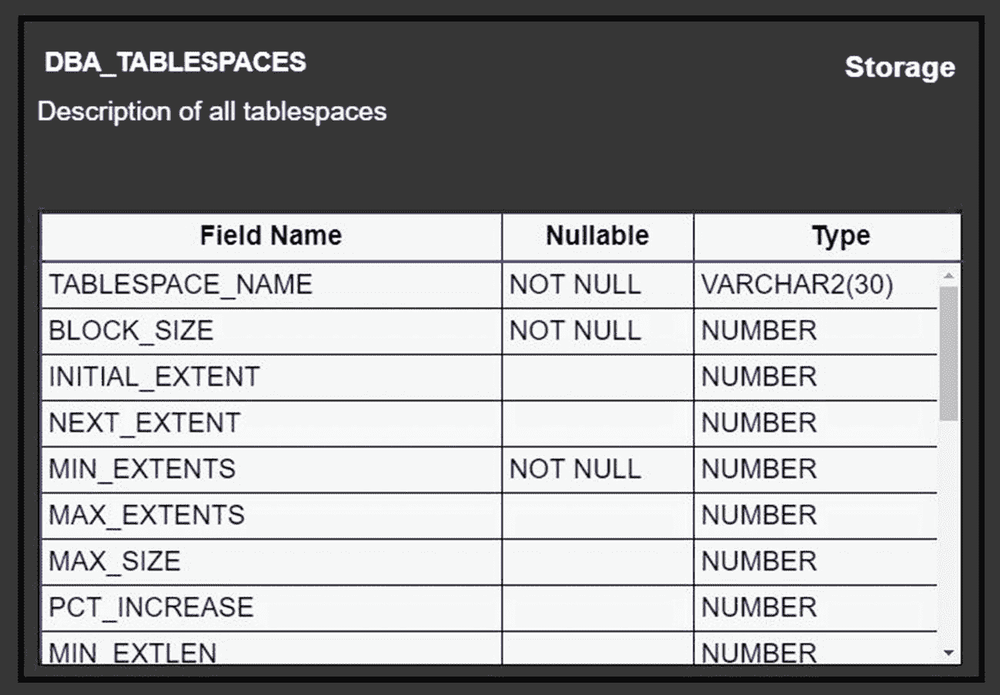

# 后台进程

分配所有这些内存固然很好，但仅靠内存分配是无法完成任何工作的。需要有东西将数据移入和移出内存。在 Unix 和 Linux 环境中，Oracle 大量使用在服务器上运行的不同进程或小程序。每个进程都有自己的工作要做。这些进程协同工作，使 Oracle 实例得以运行。在 Windows 服务器上，工作由同一进程中的不同线程完成。

当您启动 Oracle 实例时，会分配内存并自动启动若干进程。这些被称为 `后台进程`，因为它们在后台工作以管理实例。这与特定于用户会话的进程不同。

有些后台进程是 `强制性` 的。如果一个强制性进程终止，实例也将终止。毕竟，如果一个实例必需的进程不存在，它就无法存活。其他进程是 `可选` 的，其启动取决于实例的配置。回想一下，在第 7 章中，我们为测试平台设置了归档日志模式。以此模式配置时，Oracle 实例将启动一个进程，将在线重做日志（ORL）的内容复制到归档日志目标位置。这是该进程唯一的工作。由于归档日志模式不是必需的，支持它的进程也就不是必需的。如果一个可选进程异常终止，实例将继续保持运行。通常，某个强制性进程会检测到可选进程已关闭并尝试重启它。

每个新的 Oracle 版本都可能带来新的进程，有些是强制性的，有些是可选的。请查阅您所用特定版本的 *《数据库概念》* 指南，以了解实例可能生成的不同进程。有时，创建新进程是为了支持新功能。其他时候，Oracle 公司会创建新进程，以分担某个已不堪重负的进程的工作。例如，自我了解以来，每个 Oracle 版本都有一个 `PMON` 进程。`PMON` 仍然存在，但 Oracle 12*c* 现在已将 `PMON` 的部分职责剥离出来，放入了 `CLMN` 和 `CLnn` 进程中，我们将在下一节看到。

## 强制性进程

本节描述 Oracle 12.2 实例的强制性进程。

*   `进程监视器 (PMON)`：此进程负责监控其他进程并在其后进行清理。`PMON` 会清理缓冲区高速缓存。一旦用户会话结束，`PMON` 将释放该会话持有的任何资源，包括任何事务锁。在 Oracle 12*c* 中，`PMON` 包含几个辅助进程，即 `CLMN` 和 `CLnn`。
    *   `清理主进程 (CLMN)`：当 `PMON` 知道用户进程需要清理工作时，它会将工作委托给 `CLMN`。然后 `CLMN` 负责确保工作完成。因为清理工作本身可能就很繁重，几乎没有时间进行监督，所以 `CLMN` 会将实际工作委托给下一个进程。
    *   `清理辅助进程 (CLnn)`：这些是执行实际清理工作的进程。`CLMN` 是监督者，`CLnn` 执行实际工作。`nn` 是两位数字的占位符。如果运行多个进程，您可能会看到 `CL01` 和 `CL02` 进程。

*   `进程管理器 (PMAN)`：此进程监控和控制调度程序和共享服务器进程、作业队列进程以及任何可重启的后台进程。

*   `系统监视器 (SMON)`：此进程执行系统清理工作。`PMON` 及其助手负责进程清理。`SMON` 负责其余部分。实例启动时，`SMON` 将恢复任何未提交的事务。`SMON` 还会清理任何临时段。

*   `监听器注册 (LREG)`：此进程告知监听器（Listener）实例已启动、正在运行并准备好接受连接请求。它会定期向监听器更新与实例的当前连接数。在 12*c* 之前，此进程的工作由 `SMON` 执行。

*   `数据库写入器 (DBWn)`：此进程也称为 `DBWR`，负责将缓冲区高速缓存中的脏块写回数据库文件。通常有一个进程 (`DBW0`)，但繁重的工作负载可能需要多个进程。

*   `日志写入器 (LGWR)`：此进程负责将重做日志缓冲区（Redo Log Buffer）的内容写入在线重做日志。

*   `检查点 (CKPT)`：此进程启动检查点活动。发生检查点时，它会提示 `DBWR` 采取行动。`CKPT` 将更新控制文件以及每个数据文件头中的最新系统更改号 (`SCN`)。

*   `可管理性监视器 (MMON)`：此进程更新和管理自动工作量资料库 (`AWR`)。
    *   `轻量级可管理性监视器 (MMNL)`：此进程从活动会话历史缓冲区读取统计信息，并将数据写入磁盘，这些都是 `AWR` 的一部分。

*   `恢复进程 (RECO)`：此进程清理任何分布式事务中的失败。分布式事务是涉及一个以上 Oracle 数据库的事务。


### 可选后台进程

并非所有进程都是必需的。本节将详细介绍可选后台进程。

*   *归档进程 (`ARC*n*)`*：这些进程将在线重做日志的内容复制到归档日志目标位置。仅当数据库处于归档日志模式时，此进程才会启动。

*   *作业队列进程 (`CJQ0` 和 `J*nnn*)`*：这些进程在 Oracle 调度器中执行作业。`CJQ0` 是主作业协调器进程。每个运行的作业将在不同的从属进程 `J*nnn*` 中执行。

*   *并行查询从属进程 (`P*nnn*)`*：这些进程负责执行工作以支持并行 SQL 语句。用户的会话是主进程，它将工作分配给并行查询从属进程。

*   *Data Guard 监视器 (`DMON`)*：当实现 Data Guard Broker 以支持备用数据库时，会启动此进程。

*   *受管恢复进程 (`MRP`)*：此进程在备用数据库上运行以重放事务。

*   *队列监视器进程 (`QMN*n*)`*：此进程管理 Oracle Streams 和高级队列。

*   *锁监视器 (`LMON`)*：此进程帮助管理实时应用集群 (`RAC`) 数据库的锁。

正如您从上面的列表中可以想象的，如果您没有使用归档日志模式、并行查询、备用数据库或 `RAC`，您将不会在系统上看到这些进程。

实际上还有许多其他可选的后台进程。上面列出的是最常见的。

## 用户进程

最后要讨论的一类进程是用户会话的进程。在本节之后，我们将尝试将所有内容——进程、文件和内存结构——整合在一起，并构建一个架构图。

用户总是通过使用某个应用程序连接到 `Oracle` 实例。该应用程序可能简单如 `SQL*Plus` 或某个命令行工具，但它们仍然是应用程序。应用程序在其自己的计算机进程中运行。在当今的计算机环境中，应用程序通常运行在数据库服务器以外的机器上。

当应用程序请求连接到实例时，`Oracle` 会在数据库服务器上创建一个*服务器进程*。根据配置，该进程可能专用于单个用户，这种情况下称为*专用服务器进程*；或者该进程可能被多个应用程序连接共享使用，这种情况下称为*共享服务器进程*。`Oracle` 公司创建了共享服务器进程的功能，以应对互联网时代的爆炸式增长。数据库需要能够支持比基于 `Web` 的应用程序诞生之前多得多的用户。`Oracle` 公司决定为我们提供拥有共享服务器进程的能力。大约在同一时期，`Web` 服务器的开发者也为我们带来了连接池等美妙的东西。在应用层使用连接池比使用共享服务器进程更为常见。我管理过的每个 `Oracle` 数据库都使用了专用服务器进程。如果可能，我建议避免使用共享服务器进程，因为它会给 `DBA` 带来额外的管理负担。您只需知道，当有需求证明其合理性时，该功能是存在的。在本章的其余部分，我们将使用术语*服务器进程*来指代专用类型或共享类型，具体取决于数据库配置。

没有任何应用程序直接连接到实例。当应用程序请求连接时，`Oracle` 会确保有一个可用的服务器进程。应用程序仅与服务器进程通信。服务器进程代表应用程序与实例对话。您可以将服务器进程视为中间人。监听器接受传入的连接请求，并促进应用程序和服务器进程之间的连接。之后，监听器就不再参与两者之间发生的任何事情。应用程序总是通过监听器进行连接是一个误解。

## 整合说明

我们已经讨论了构成数据库的各种文件，以及构成实例的内存结构和进程。现在是时候理清所有内容，并了解这些组件如何协同工作了。我们将从上次中断的地方开始，查看应用程序、监听器和服务器进程之间的交互，如图 20-1 所示。



图 20-1

应用程序连接

如前一节所述，应用程序联系监听器，后者调解连接请求并让应用程序进程开始与服务器进程对话。服务器进程为其使用分配 `PGA`。

在某个时刻，应用程序将通过发出 `SQL` 语句提出请求。我们假设满足此请求所需的数据块当前不在缓冲区高速缓存中。这些块需要被读入缓冲区高速缓存。可能会让一些人感到惊讶的是，正是用户会话的服务器进程从数据文件中读取，如图 20-2 所示。



图 20-2

将数据块读入缓冲区高速缓存

一旦数据块进入缓冲区高速缓存，服务器进程就可以访问其中的数据。如果该块已经在缓冲区高速缓存中，则无需从数据文件读取。如果 `SQL` 操作导致直接路径读取，则从数据文件返回的箭头直接指向服务器进程，而不使用缓冲区高速缓存。

然后，用户会话通过事务修改高速缓存中数据块的内容。该块现在被标记为脏块。信息被写入重做日志缓冲区，以便在必要时能够重放该事务。最终，`LGWR` 将重做信息写入在线重做日志，`DBW*n*` 将脏块写入数据文件，但这两者不一定是同时发生的。图 20-3 展示了与缓冲区高速缓存、重做日志缓冲区以及后台进程的交互。



图 20-3

将事务写入磁盘

如果开启了归档日志模式，归档进程会将在线重做日志复制到归档日志目标位置。


## 交互式快速参考

与其依赖我绘制的 Oracle 架构图，你不如在*数据库概念*指南中寻找一些优质的可视化图示。此外，Oracle 公司提供了一个交互式网页，让你可以探索 Oracle 架构。你可以通过以下 URL 访问此网页：
```
www.oracle.com/webfolder/technetwork/tutorials/obe/db/12c/r1/poster/OUTPUT_poster/poster.html
```

进入该网页后，点击**数据库架构**选项卡。这将带你到一个复杂的图示（在图 20-4 中复制显示），展示了架构的每一个组成部分。



图 20-4 交互式快速参考 数据库架构选项卡

我们可以看到所有的进程和内存结构，并能跟踪活动流经此架构的过程。其内容远比本章所写的要多得多。此处未讨论的进程和内存结构不如提及的那些重要，但随着你深入探索 Oracle 的工作原理，它们可能对你很重要。

要与图示交互，请双击它。图像将被放大，你可以使用鼠标将其移动到感兴趣的区域。如果你想了解更多关于图中某个项目的信息，请点击它。在图 20-5 中，我点击了**检查点进程**。



图 20-5 交互式快速参考 CKPT 详细信息

右侧窗格列出了我点击的`CKPT`进程的相关信息。这些详细信息的底部是链接，指向 Oracle 文档中更详细讨论该项目的部分。

如果你点击**后台进程**选项卡，你可以获取所有后台进程的信息。进程非常多，这个网站按各种类别对它们进行了分类。在图 20-6 中，我点击了**通用**类别。



图 20-6 交互式快速参考 后台进程选项卡

回想一下，在第 14 章我们讨论了数据字典。这个交互式工具也提供了关于数据字典视图的文档。点击**DBA 视图**、**性能视图**或**架构视图**选项卡。在图 20-7 中，**DBA 视图**选项卡上选择了**存储**类别。通过跟随图中的连线，我们可以看到视图之间是如何关联的。如果你知道视图名称的一部分，可以使用搜索框更容易地找到它。



图 20-7 交互式快速参考 DBA 视图选项卡

点击一个视图将显示其描述。如果我们点击`DBA_TABLESPACES`视图，我们可以看到其所有的列，类似于图 20-8 所示。



图 20-8 交互式快速参考 `DBA_TABLESPACES`描述

试用一下交互式快速参考，看看它是否能帮助你的职业生涯。Oracle 没有为 Oracle 18c 版本发布类似的产品，很可能是因为在 Oracle 公司决定更改其版本编号方案之前，18c 最初被命名为 12.2.0.2。

一个 Oracle 11*g*交互式快速参考指南发布在以下 URL：
```
www.oracle.com/webfolder/technetwork/tutorials/obe/db/11g/Poster/11g_interactive.html
```
此工具的 11*g*版本确实需要你的浏览器安装 Adobe Flash。

## 实例启动

当启动一个 Oracle 实例时，实例会经历三个阶段：`NOMOUNT`、`MOUNT`和`OPEN`，按此顺序进行。在清单 20-6 中，我们连接到了一个空闲实例，这意味着它尚未运行。然后实例以`NOMOUNT`模式启动，接着前进到`MOUNT`，最后到`OPEN`。

```sql
SQL> connect / as sysdba
Connected to an idle instance.
SQL> startup nomount
ORACLE instance started.
Total System Global Area 2147483648 bytes
Fixed Size                  2926472 bytes
Variable Size             687868024 bytes
Database Buffers         1442840576 bytes
Redo Buffers               13848576 bytes
SQL> alter database mount;
Database altered.
SQL> alter database open;
Database altered.
```
清单 20-6 将实例推进通过启动阶段

数据库管理员可以启动实例并让其前进到这三个阶段中的任何一个。在上面的例子中，DBA 以`NOMOUNT`模式启动了实例。但是 DBA 本可以指定`STARTUP MOUNT`或`STARTUP OPEN`来直接前进到那些阶段。如果在`STARTUP`命令上没有指定阶段，默认操作是前进到`OPEN`阶段。

当实例以`NOMOUNT`模式启动时，磁盘上访问的唯一文件是参数文件。实例启动，分配内存，并生成支持实例所需的后台进程。当实例前进到`MOUNT`模式时，首次访问控制文件。当实例前进到`OPEN`模式时，访问数据库的其他文件。如果需要，`SMON`会执行恢复以回滚实例终止时任何未提交的事务。一旦完成，数据库即对业务开放，并允许连接到实例。

当你需要对控制文件执行操作时，你会使用`NOMOUNT`模式。请记住，在此阶段尚未访问控制文件。如果你需要手动重新创建控制文件，你需要处于`NOMOUNT`模式。

`MOUNT`模式用于当你需要访问控制文件但不需要访问其余数据文件时。如果你想移动或重命名数据文件，你会使用此阶段。`MOUNT`模式也用于为数据库配置归档日志模式或执行完整数据库恢复时。

大多数时候，你会使用`OPEN`阶段。毕竟，我们希望实例开放并准备好处理业务。你会将其他阶段用于维护活动。

还有另一种启动模式需要讨论。你可以以`RESTRICTED`模式打开实例。在此模式下，实例启动到`OPEN`阶段。但是，只有那些具有`RESTRICTED SESSION`系统权限的用户才被允许连接到实例。当你想要为维护活动访问数据库，但又不希望这些活动对最终用户产生负面影响时，你会使用此方法。

## 继续前行

本章讨论了 Oracle 架构的许多方面：文件、进程和内存结构。本章的信息只是触及了表面。你需要确保阅读 Oracle 文档中的*数据库概念*指南，以丰富你的知识。

在下一章中，我们将讨论 Oracle 数据库的一些高级选项。即使不使用这些选项，你当然也可以建立职业生涯。这些选项的存在是为了扩展 Oracle 数据库的功能。在许多情况下，这些选项需要额外的许可费用，但从长远来看，通过节省人力或第三方产品的成本，它们实际上可以为你的公司省钱。


