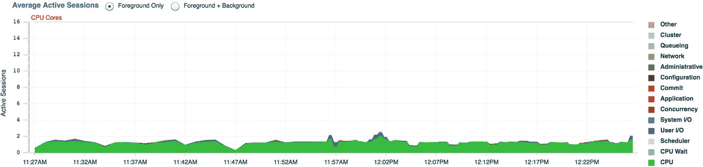
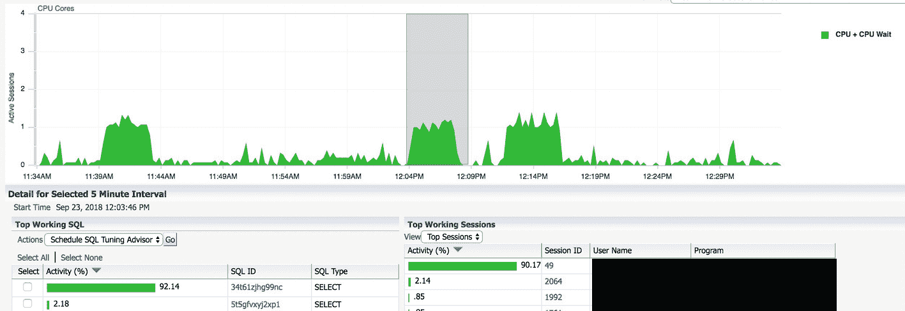

# 21. 高级选项

在本章中，我们将探讨 Oracle 数据库中可供您在企业架构中采用的若干高级选项。这些选项之所以存在，是因为它们扩展了核心数据库产品的功能。在某些情况下，可以自行设计实现类似功能；而在另一些情况下，则无法实现。

本章讨论的大多数选项都要求使用 `Oracle 企业版`，并且除 `Enterprise Manager` 外，通常需要额外付费。这些选项大多不包含在常规数据库许可证中。虽然它们需要额外支出，但如果您需要其服务，这些花费通常是值得的。如上所述，通过自行编码在应用程序中实现 Oracle 选项提供的某些功能，可能无需实际资金投入。然而，公司仍需承担人工成本。您不仅需要开发该功能，未来还需持续维护。若希望进一步扩展功能，还会产生额外的开发时间。许多渴望获得此类功能的组织，在看到 Oracle 选项的成本后，便决定自行开发功能。尽管这个选择看似诱人，但他们往往未能从长远角度考虑。Oracle 公司实现的功能很可能远优于自研解决方案。最后，这些额外选项提供的功能在很大程度上与应用程序无关。应用程序甚至可能不知道或不关心该选项是否在使用中。如果您自行编码实现功能，可能需要将其部署到下一个应用程序中，这意味着您的功能现在需要在多个地方进行维护。如果您使用 Oracle 的选项，则无需自行维护该功能，它全部集中在一个地方——数据库。

由于这些功能是额外付费项目，Oracle 公司会在审计期间详细检查每个功能的使用情况。如果您的公司接受审计，Oracle 会要求您对企业的所有数据库运行一系列脚本。这些脚本将检测您是否曾在数据库中使用过该功能。只要有一次使用记录，审计脚本就能检测到该功能的使用。如果您没有该选项的许可证，您将违反 Oracle 合同，Oracle 公司可能会采取法律行动。

如果您确实想试用某个选项，请勿在您的任何开发、测试或生产数据库中使用该功能。即使只是进行简单测试，这样做也会触发 Oracle 公司在审计时能够发现的标记。相反，应搭建一个测试环境，在那里试用该功能。测试完成后，您可以销毁该测试环境。Oracle 的技术网络许可证允许您测试高级选项的功能，但在您支付额外费用之前，无法使用任何选项进行实际开发工作。在您的测试环境中放入一些样本数据，为您的组织推导出一个概念验证。试用该功能，看看它能为您的项目做什么，不能做什么。在本书的前几章中，我们创建了自己的测试环境，因此您知道如何为这类活动创建一个区域。除非您已获得该选项的许可证，否则请勿在非测试环境中尝试本章的示例！

阅读本章时，不要试图成为每个选项的专家。相反，尝试理解每个选项旨在为您和您的企业提供的价值。未来，当您参与某个新项目的设计时，可能会想起存在一个可以提供帮助的选项。届时，您的组织可以进一步探索该选项，并判断其是否值得额外成本。

## 诊断包

这是我无法割舍的一项额外付费选项。上次我参加工作面试时，我询问了他们是否为其 `Oracle` 基础设施获得了 `诊断包` 的许可。如果他们没有许可该选项，我很有可能会因此拒绝任何工作邀请。`诊断包` 对我来说就是如此重要。并非所有人都会同意我的看法。

作为一名高级 DBA，我经常需要解决许多性能问题。在检查 `Oracle` 性能时，`诊断包` 是一个巨大的时间节省工具。虽然它需要额外成本，并且必须为您希望使用的所有数据库获取许可证，但这笔钱非常值得。如果我没有获得此选项的许可，我的公司将不得不额外雇佣两到三名数据库管理员。它为我节省的时间就是这么多。提到的额外员工数量可能还是保守估计。

`诊断包` 主要用于数据库性能活动。很多时候，当我在处理性能问题时，借助 `诊断包`，我可以在几分钟内确定问题的根本原因。没有它，我可能需要花费数天时间来寻找瓶颈。如果需要将当前的糟糕性能与上个月的良好性能进行比较，`诊断包` 让我可以在几分钟内完成。没有它，我可能需要花费一周时间来完成比较。它确实为我节省了这么多时间。

`诊断包` 包含以下内容：

*   自动数据库诊断监视器 (`ADDM`)
*   活动会话历史 (`ASH`)
*   自动工作量仓储 (`AWR`)
*   `AWR 仓储`

通过 `Oracle Enterprise Manager` 来体验 `诊断包` 是最佳方式。您可以通过 `SQL` 语句与 `诊断包` 交互，但 `EM` 会为您完成这项工作，并显示有用且信息丰富的图表，帮助您一目了然地了解数据库及其性能的状况。例如，如果我们在 `EM` 中导航到一个数据库，然后点击 性能 ➤ 性能主页，我们可以看到一张显示当前实例活动的图表，如图 21-1 所示。

*图 21-1 EM 性能图表*

在图 21-1 中可能看不清楚，但图表顶部有一条红线，表示该系统有 16 个 CPU 核心。当图表超过红线时，表明最终用户正在经历性能不佳的问题。在图 21-1 中，图表远低于该线。这并不一定意味着性能良好，因为可能有少数会话遇到困难，但对于大多数用户而言，整体性能应该是良好的。

图表右侧有一个颜色编码的图例，显示了用户会话花费时间的分类。图表主要呈现绿色，从图例中我们可以看到这代表用户在 CPU 上进行处理所花费的时间。如果我们将鼠标悬停在图例中的某个项目上，它会变为黄色高亮显示，图表中相应的分类也会相应改变。这有助于查看图表中不易看到的一些分类。

如果我们点击某个分类，`EM` 会深入探究该领域。由于主导分类是 `CPU`，我将深入探究该领域。在图 21-2 的图表中，有一个可以左右拖动的阴影框。

*图 21-2 EM 下钻到 CPU 使用情况*

