# 使用 Enterprise Manager 和 Diagnostics Pack 进行性能诊断

我们可以从图 21-2 中看到，CPU 利用率有几个尖峰。如果我们将阴影框拖到其中一个尖峰上，`Top Working SQL`和`Top Working Sessions`会相应更新。在这个案例中，我们看到在该阴影框所代表的时间段内，来自一个用户的单个 SQL 语句占用了超过 90%的 CPU。如果我是在处理一个用户抱怨性能差的问题，第一个图表可能不会提供太多信息。通过深入分析 CPU 利用率，我能够看到一个用户确实使用了大量 CPU，并且很可能很快找到了根本原因。请注意，我遮盖了用户名称和程序列，以隐藏可能的专有信息。

`SQL ID`和`Session ID`列包含超链接。我可以快速深入查看会话的详细信息，甚至是 SQL 语句。在图 21-3 中，我点击了 SQL 语句以查看它为何使用如此多的 CPU。

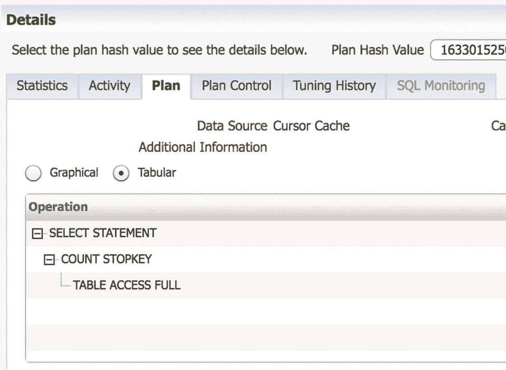

图 21-3

EM SQL 详细信息执行计划

通过深入查看 SQL 语句，我可以看到确切的 SQL 文本。我点击了`Plan`选项卡，并从图形化的执行计划切换到了表格形式。我看到正在执行一个`Full Table Access`步骤。这看起来不太对，于是我点击了`Statistics`选项卡，如图 21-4 所示。

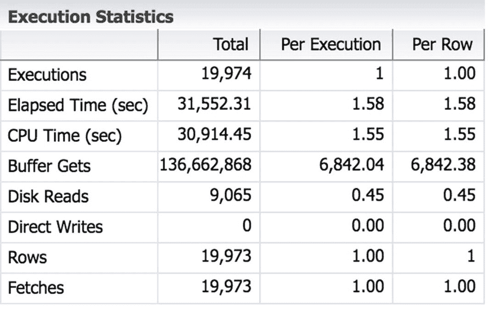

图 21-4

EM SQL 详细信息统计信息

我从该 SQL 语句的统计信息中看到，该 SQL 已被执行了 19,974 次。它产生了超过 1.36 亿次的缓冲区读取。这意味着用户会话从`Buffer Cache`中读取了数据超过 1.36 亿次。从`Buffer Cache`读取需要 CPU。如果我查看`Per Execution`列，可以看到这个 SQL 语句每次执行需要 6,842 次缓冲区读取。进一步查看该列，我看到这个 SQL 语句每次执行只返回一行。作为数据库管理员，我知道数据库的块大小是 8,192 字节。将缓冲区读取次数乘以块大小，`8,192 × 6,842`，表明仅仅为了返回一行数据，就需要从缓存中读取超过 50MB 的数据！对于训练有素的 Oracle 性能专家来说，很容易诊断出执行全表扫描导致了性能问题。如果我能利用索引来加速查询，就可以显著减少 CPU 时间，同时为其他用户释放 CPU 资源。

这个问题的解决很好地说明了为什么`Diagnostics Pack`非常有价值。只需点击几下鼠标，我就能深入下去，找出问题查询并确定它为何表现如此糟糕。如果没有通过`Enterprise Manager`提供的`Diag Pack`的这种能力，我就需要手动运行多个脚本，计算和解释结果，然后再弄清楚需要运行哪些脚本来引导我进一步深入。`EM`和`Diag Pack`使这个过程快得多。

`Enterprise Manager`中另一个有用的视图是选择 `Performance ➤ SQL Monitoring`。在图 21-5 中，我点击了`Database Time`列，按降序对 SQL 语句进行排序，以便查看运行时间最长的 SQL 语句。再次说明，我在图中遮盖了敏感信息。我想展示真实的生产性能，这意味着专有信息需要被隐藏。后续的图形也因同样原因有被遮盖的部分。

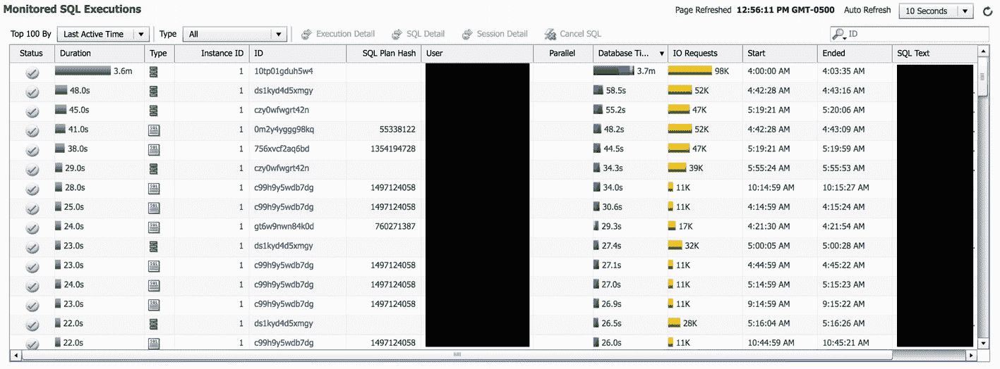

图 21-5

EM SQL 监控

在图 21-5 中，我们可以看到顶部的一个 SQL 语句显示的`Database Time`远大于其他语句。虽然还没有人抱怨性能问题，但我们可能想花几分钟看看是否能主动处理。顺便说一句，数据库管理员应该寻找机会，在系统管理上更具主动性。在最终用户抱怨之前解决问题。

点击这个 SQL 语句的`ID`，会带我们查看关于该 SQL 语句的更多详细信息，如图 21-6 所示。

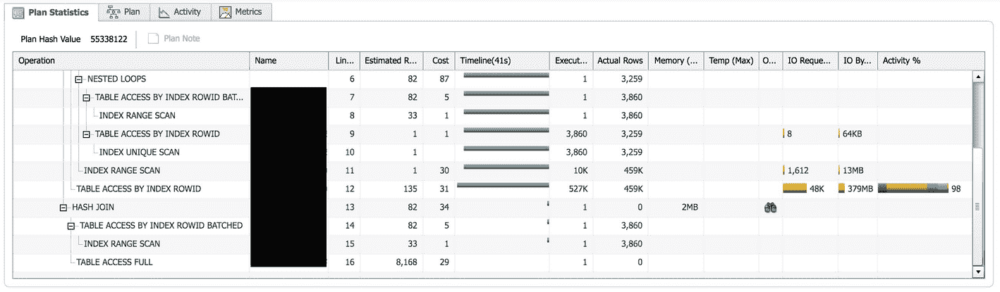

图 21-6

EM SQL 计划统计信息选项卡

如果我们查看该列的`Plan Statistics`选项卡，`Activity %`列中的条形图可以很好地指示这个 SQL 语句的时间花费在哪里。在这个案例中，该 SQL 语句 98%的活动是用于通过索引访问一个表。也许在这个案例中，要么是使用的索引不对，要么是全表扫描会更高效。

我们将捕获这些信息，并弄清楚需要多少工作量才能使这个 SQL 语句更高效。只需在`EM`中点击几下，利用`Diag Pack`，我们就能够快速发现一个潜在问题并主动解决它。

`Diagnostics Pack`还包括`Automatic Database Diagnostic Monitor`，即`ADDM`。`ADDM`会查看一段时间内（通常是一小时）的整体数据库性能，并就如何提高性能提出建议。需要注意的是，`ADDM`是自动完成这些工作的，我们不需要进行设置。

如果我们查看一个性能图表，`EM`会在图表下方显示一个小剪贴板图标，在图 21-7 中已圈出。我们可以点击该图标查看`ADDM`运行的结果。

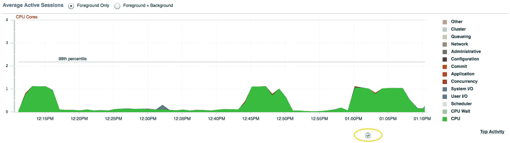

图 21-7

EM ADDM 运行图标

点击此图标将带我们进入`EM`中的`ADDM`部分。我们可以看到一个图表，显示了过去 24 小时的`ADDM`运行情况。现在我们看到了多个剪贴板。在图 21-8 中，我点击了图表中活动峰值最大处下方的图标。

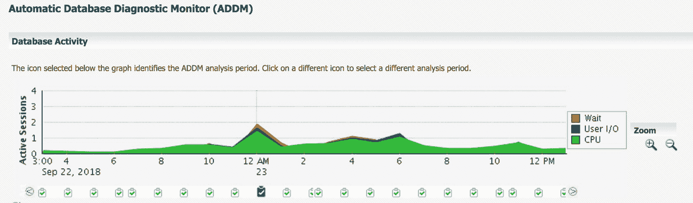

图 21-8

EM ADDM 屏幕

当我们点击其中一个图标查看`ADDM`结果时，图表下方的信息会相应改变。在点击图 21-8 中最大峰值下的剪贴板图标后，`ADDM`呈现了图 21-9 所示的发现结果。

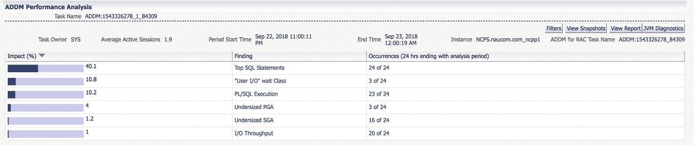

图 21-9

ADDM 性能分析

我们可以看到，`ADDM`已确定在此期间，顶级 SQL 语句对整体数据库性能的影响占了 40%。如果我们点击`Finding`列中的链接，就可以深入查看这些顶级 SQL 语句，如图 21-10 所示。

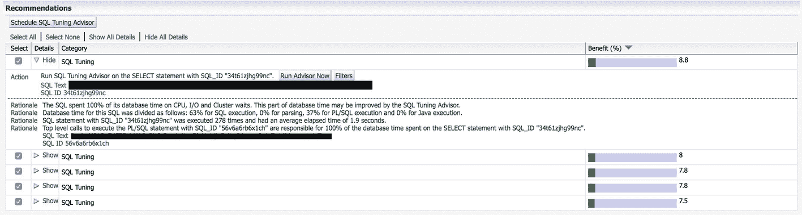

图 21-10

ADDM 顶级 SQL 语句建议

`ADDM`发现了五个 SQL 语句。所有语句似乎都有相似的影响。我们可以点击`Schedule SQL Tuning Advisor`按钮，让 Oracle 就如何调整该 SQL 语句提供建议。点击此按钮需要获得可选的`Tuning Pack`许可，这将在下一节讨论。


关于建议器（advisor）推荐的一般性注意事项，例如你在`ADDM`结果中会看到的，我需要特别说明一点。建议器总是会给出建议。我尚未见过哪个建议器说“一切都很好，无需更改”。如果你持续查看建议器结果，就会不断进行修改，进而在一个领域耗费大量时间。我曾遇到一个建议器要求更改，我照做了。下一次运行该建议器时，它却基本上要求改回去。我也照做了。你大概能猜到，再下一次运行时，它又想要最初的更改。如果我继续听从这些建议，就会陷入一个无尽的循环。请对`建议器`和其他`专家系统`的建议持保留态度。知道何时该停止，转而处理其他`DBA`任务。

到目前为止，我们已经看到了`诊断包`的实际应用，它能快速下钻到遇到性能问题的单个会话或 SQL 语句。`诊断包`还包含`自动工作负载仓库 (AWR)`，用于在实例级别捕获信息。当我们想要对实例性能进行详细分析时，`AWR`通常非常有用。开箱即用时，`AWR`每小时捕获一次实例性能快照，但你也可以根据需要手动捕获快照。许多指标将是自实例启动以来的活动指示器。例如，有一个指标跟踪自实例启动以来的磁盘读取总数。所有这些指标收集都是自动发生的。数据存储在`SYSAUX`表空间中，默认保留 30 天，除非你修改保留期。

当数据库管理员想要查看整体性能时，他们会运行`AWR`报告。`AWR`报告需要指定起始和结束快照。然后，报告会计算差值，并利用时间间隔来生成平均值。例如，对于磁盘读取，`AWR`报告会将结束快照中的磁盘读取数减去起始快照中的磁盘读取数，从而获得该间隔期间的磁盘读取总数。如果快照间隔 60 分钟，`AWR`报告会将总磁盘读取数除以 3,600，从而得到该报告期间每秒的平均磁盘读取数。

要生成`AWR`报告，你可以在`SQL*Plus`中运行`$ORACLE_HOME/rdbms/admin/awrreport.sql`脚本，或者可以导航到`Enterprise Manager`中的`性能 ➤ AWR ➤ AWR 报告`，如图 21-11 所示。

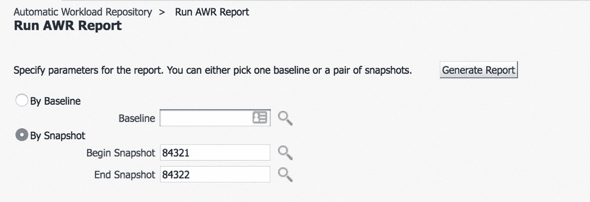

图 21-11

指定`AWR`报告参数

在图 21-11 的示例中，我选择了`按快照`选项。我点击放大镜图标调出快照列表，并为我的报告期间选择了其中两个。然后我点击了`生成报告`按钮。几分钟后，图 21-12 中所示的报告便显示在浏览器中。报告的第一部分包含一些介绍性信息，如主机名、数据库版本等。

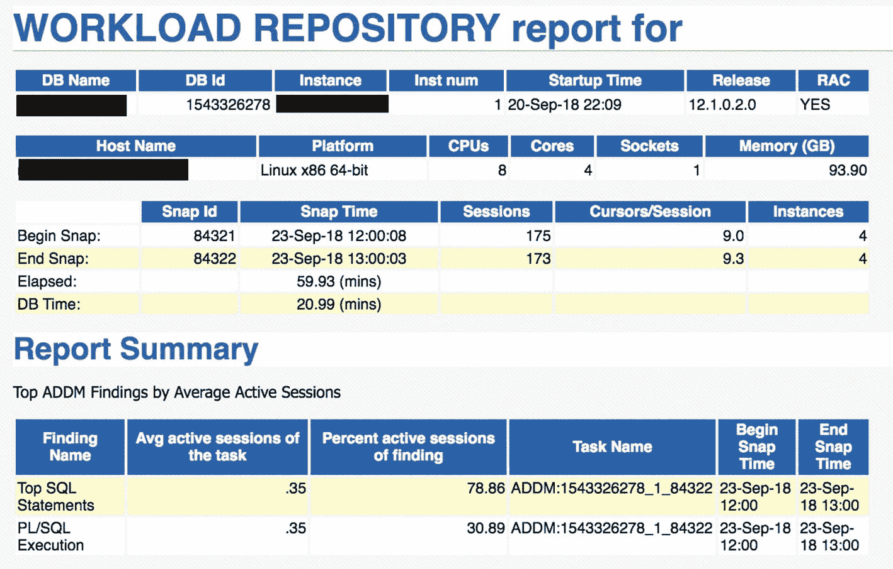

图 21-12

`AWR`报告示例

如果你已获得`诊断包`许可，就可以查看`AWR`报告中的信息页面。如何利用`AWR`报告是另一本书的主题。如果你想要更多信息，我建议从阅读《Oracle 数据库性能调优指南》开始。

如果你没有`诊断包`的许可，可以使用`Statspack`来模拟其功能。`Statspack`是`诊断包`的前身。使用`Statspack`，你需要运行一些脚本来进行设置。然后，你必须计划一个任务来执行数据收集。`Statspack`包含在你的许可中，因此无需额外费用，但它已不再进行新功能开发，因为新版本带来了新特性。Oracle 将其开发精力投入到了扩展`AWR`，而非`Statspack`上。

`AWR`的一个缺点是，仓库将数据保留 30 天后会自动清除。你可以更改保留期，但那样你的`AWR`磁盘使用量将会增长，而这在生产系统中通常是我们不希望的。Oracle 提供了将`AWR`数据自动迁移到`AWR 仓库`的功能。如果你已获得`诊断包`许可，就可以享用`AWR 仓库`。在`Enterprise Manager`中，点击`性能 ➤ AWR ➤ AWR 仓库`，并按照指示进行设置。你需要创建另一个 Oracle 数据库，并且这个数据库不应与你的生产数据库位于同一服务器上。`AWR 仓库`的配置如图 21-13 所示。我们可以看到它是由我创建的，其数据库版本是 12.1.0.2，当前磁盘空间使用率为 75%。

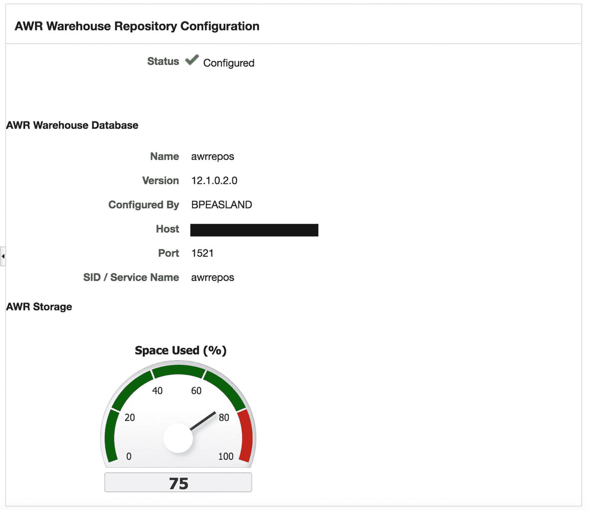

图 21-13

`AWR 仓库`配置

图 21-14 显示有三个数据库在`AWR 仓库`中持有数据，总计占用 105GB 磁盘空间。

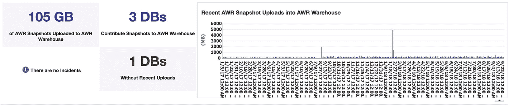

图 21-14

`AWR 仓库`详情

`AWR 仓库`的最佳用途是能够将今天的性能与相当久以前的性能进行比较。在我的`AWR 仓库`中，我将保留期定义为两年。在仓库中保留数据多久取决于你的业务周期。我的业务随着日历有淡旺季之分。我希望能够与一年多前的同期进行比较，因此选择了两年的保留期。一旦仓库创建好，我就可以创建一个`AWR`报告，显示两个时期之间的差异。我最常在尝试将数据库或应用程序升级后的性能与去年同期的性能进行关联分析时使用此功能。


## 调优包

调优包是诊断包的绝佳伴侣。我们已经看到，诊断包中的 ADDM 提供了一个按钮，可以生成一个带有调优包的会话。这是我偶尔会使用的包，但我并不像坚持使用诊断包那样坚持要使用它。调优包包含以下功能：

*   实时 SQL 监控
*   SQL 调优顾问
*   SQL 访问顾问
*   SQL 概要文件
*   内存顾问
*   对象重组

### 使用 SQL 调优顾问

如果我们回到如图 21-10 所示的 ADDM 发现，可以单击`安排 SQL 调优顾问`按钮。下一个屏幕要求我们填写一些关于如何安排此工作的信息，如图 21-15 所示。

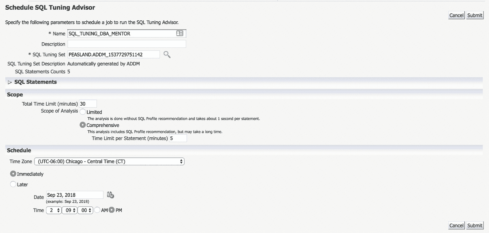

图 21-15 安排 SQL 调优顾问

在图 21-15 中，我将此顾问运行的名称更改为`SQL_TUNING_DBA_MENTOR`。如果需要，可以使用默认名称。分析的范围在`Scope`部分定义。有限的范围资源消耗要少得多，但不会让顾问考虑所有备选方案。如果希望更全面的范围，并且不想在实例活动的高峰时段运行，可以将执行安排在较安静的时间，明天再检查结果。一切准备就绪后，单击`提交`按钮。根据我的选项，我的顾问运行将立即执行。当我单击`提交`按钮时，我可以查看任务运行情况，如图 21-16 所示。

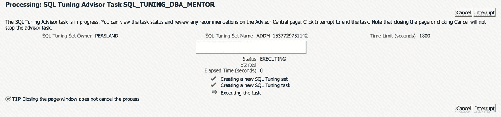

图 21-16 调优顾问执行

顾问运行最终将完成。结果可以在图 21-17 中看到。

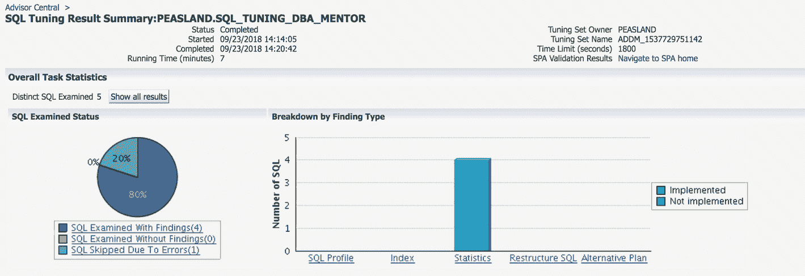

图 21-17 调优顾问总体发现

一眼看去，我可以发现最大的发现类型与统计信息相关。如果向下滚动，可以看到一个表和一个索引的过时统计信息导致了问题，如图 21-18 所示。对象名称和模式被模糊处理以保护专有信息。

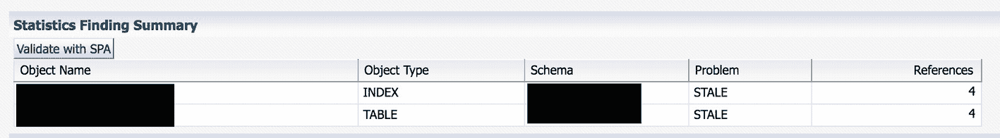

图 21-18 调优顾问统计信息发现

无需做太多工作，我就能够利用诊断包的`ADDM`功能告诉我某些 SQL 语句存在问题。然后，我利用调优包的顾问功能告诉我某个表及其索引的统计信息已过时。这种节省时间的方式会一次又一次地带来回报，这使得诊断包和调优包的成本更容易接受。

### 使用 SQL 访问顾问

在企业管理器中，我们可以导航到`性能 ➤ SQL ➤ SQL 访问顾问`来使用调优包的该部分。我们可以在图 21-19 中看到初始的`SQL 访问顾问`屏幕。

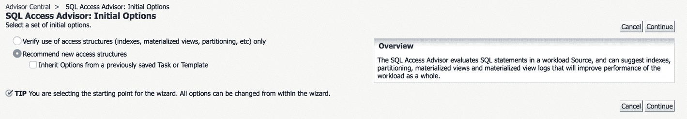

图 21-19 SQL 访问顾问

在初始选项中，我将查看访问顾问是否会推荐任何新结构。该顾问将查看数据库中执行的 SQL 语句，并在适当时推荐任何新索引、分区或物化视图。在下一个屏幕上，顾问要求我分析哪个工作量，如图 21-20 所示。

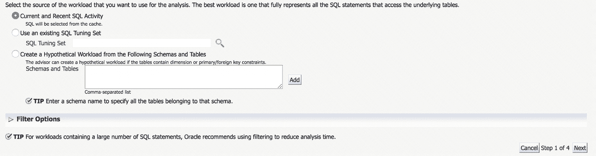

图 21-20 SQL 访问顾问工作量

我选择使用当前和最近的 SQL 活动。在下一个屏幕上，我选择了要访问的结构类型。我还选择了`全面`范围。我的选项如图 21-21 所示。

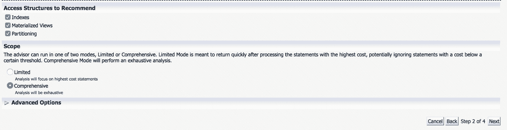

图 21-21 SQL 访问顾问选项

下一个屏幕要求类似调优顾问所请求的调度选项。准备就绪后，提交作业，访问顾问将开始工作。范围越全面、顾问需要分析的 SQL 语句越多，作业完成所需的时间就越长。分析完成后，我们可以查看类似于图 21-22 的报告。

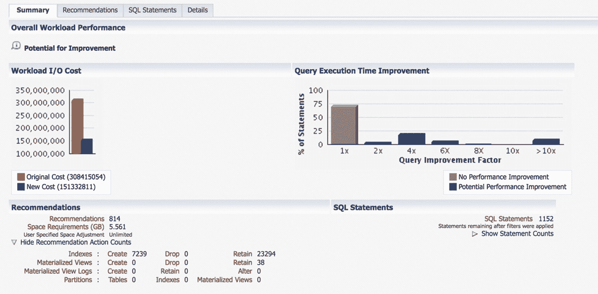

图 21-22 SQL 访问顾问摘要选项卡

`摘要`屏幕显示原始`I/O`成本超过 3.08 亿次`I/O`操作。如果我们实施此顾问运行的结果，新成本将不到该数字的一半，约为 1.51 亿次`I/O`操作。顾问建议我们创建 7,239 个新索引。我通常不会引入那么多变更，因此让我们通过单击`建议`选项卡更深入地研究这些发现。我们可以在图 21-23 中看到这些建议。

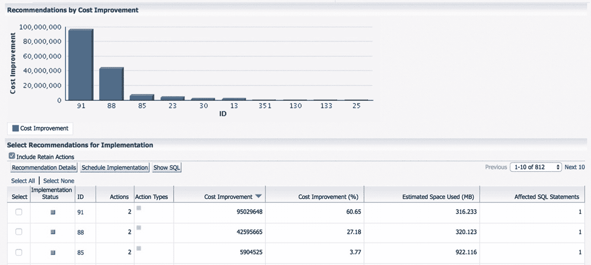

图 21-23 SQL 访问顾问建议选项卡

该顾问有 812 条建议。如果我们查看条形图，可以看到建议 ID 91 将贡献近 1 亿次`I/O`操作的改进。建议 88 是下一个最大的改进。查看图表下方的表格，我们可以看到这两条建议分别贡献了 60.65%和 27.18%的成本改进，总计 87.83%。

数据库管理员可以逐一检查系统中的每个 SQL 语句并单独分析它们，或者可以使用`SQL 访问顾问`节省大量时间。这个顾问运行在七分钟内分析了 1,152 个不同的 SQL 语句。在顾问工作时，DBA 同时处理了其他活动。

### 总结

调优包对于 DBA 来说是一个巨大的时间节省工具。但是，如果应用程序来自其他供应商，DBA 通常不负责调优 SQL 语句。那是软件供应商的工作。调优包由需要支持内部开发应用程序的 DBA 使用。


## 分区

分区是一项需要额外付费的可选功能，它允许你将一个表细分为更小的表，称为 `分区`。分区对应用是透明的，它使得这些较小的表能够像一个大表一样协同工作。当一个表需要处理非常大量的行（通常是数百万行或更多）时，才会对其进行分区。小表通常无法从分区中获益。

图 21-24 中的示意图展示了一个典型网店中的 `ORDER_DETAILS` 表。随着客户填写订单，订单的详细信息会存储在此表中。由于这是一个高流量网站，每天销售大量产品，数据库管理员（DBA）已根据下单年份对该表进行了分区。图 21-24 的示意图显示了该表的四个分区，分别对应 2016 年至 2019 年。在 2020 年到来之前，DBA 将需要为该年添加一个分区。

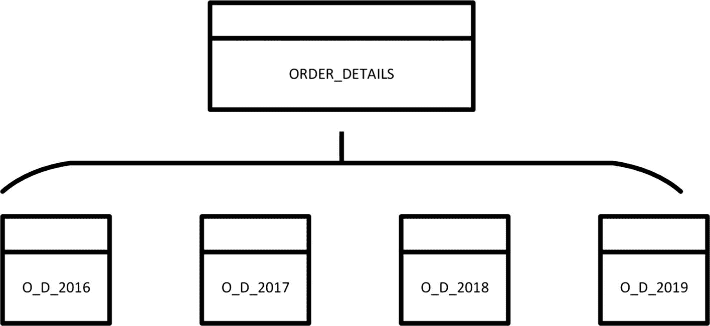
图 21-24 `ORDER_DETAILS` 分区表

用户和应用程序通常不会直接引用分区。相反，它们仍然查询 `ORDER_DETAILS` 表。`ORDER_DETAILS` 表在存储上并不存在，它只存在于数据字典中。实际存储在磁盘上的是各个分区。当用户或应用程序查询 `ORDER_DETAILS` 表时，Oracle 会从各个分区中提取数据。对表进行分区主要有两个原因：存储和性能。

一个表位于且仅位于一个表空间中。然而，如果表被分区，那么各个分区可以被放置在不同的表空间中。这使得 DBA 可以根据需要将较旧、较少使用的分区放在较慢的磁盘存储上。例如，2016 年的 `ORDER_DETAILS` 分区可以放在“慢速”磁盘上，而 2018 和 2019 年的分区因为更新，可以放在更快的磁盘上。DBA 通过在不同类型的磁盘存储上创建不同的表空间，并将分区移动到相应的表空间来实现这一点。由于 2016 年的数据不会改变，DBA 随后可以将该表空间更改为 `只读`，从而让 `RMAN` 备份它一次，并在后续备份中跳过它。

一个经过适当分区的表可以受益于 Oracle 的 `分区修剪` 功能。在图 21-24 的示例图中，很少有人会查看较旧年份的订单详情。通常，我们会查询最近的订单。DBA 可以在表中存储订单详情日期的列上创建索引。但是，如果我们查询的日期范围足够大，比如上个季度的订单详情，Oracle 的优化器可能会认为索引的选择性不足，并执行全表扫描，读取回溯数年的详情。这可能导致极差的性能。如果表是按照详情日期分区的，Oracle 将自动移除或修剪掉无需访问的非参与分区。在我们的例子中，如果我们要查询 2018 年第四季度的所有订单详情，Oracle 将只访问 2018 年的分区，并忽略其余分区，因为它知道它们没有任何记录可以满足该 `SQL` 语句。

当人们对 Oracle 表进行分区时，最大的错误是未能查看针对该表执行的最常见的 `SQL` 语句。你应该尽可能地利用 `分区修剪`。如果你经常按订单详情日期进行查询，那么按订单 ID 列分区将不会给你带来任何 `分区修剪` 的好处。在决定分区列之前，请确保你知道哪些 `SQL` 语句需要受益于 `分区修剪`。

在 Oracle 提供分区选项之前，人们实现了一种被称为“穷人的分区”的方法。他们通过创建多个较小的表，然后创建一个对所有这些表执行 `UNION ALL` 操作的视图来实现。虽然这个解决方案让你能享受到与 Oracle 分区选项相同的存储优势，但它不能自动参与 `分区修剪`。

在代码清单 21-1 中，我们可以看到如何对图 21-24 中的表进行分区的示例。

```
CREATE TABLE ORDER_ENTRY.ORDER_DETAILS (
ORDER_ID NUMBER(38,0) NOT NULL,
ORDER_DETAIL_DATE_BEGIN DATE NOT NULL,
ORDER_ITEM_ID NUMBER NOT NULL,
ORDER_ITEM_COST NUMBER(38,2) NOT NULL,
DATE_ITEM_SHIPPED DATE)
TABLESPACE ORDER_ENTRY_DATA
PARTITION BY RANGE (ORDER_DETAIL_DATE)
(PARTITION o_d_2016  VALUES LESS THAN (TO_DATE('01/01/2017 00:00:00','MM/DD/YYYY HH24:MI:SS')) TABLESPACE ORDER_ENTRY_DATA,
PARTITION o_d_2017  VALUES LESS THAN (TO_DATE('01/01/2018 00:00:00','MM/DD/YYYY HH24:MI:SS')) TABLESPACE ORDER_ENTRY_DATA,
PARTITION o_d_2018  VALUES LESS THAN (TO_DATE('01/01/2019 00:00:00','MM/DD/YYYY HH24:MI:SS')) TABLESPACE ORDER_ENTRY_DATA,
PARTITION o_d_2019  VALUES LESS THAN (TO_DATE('01/01/2020 00:00:00','MM/DD/YYYY HH24:MI:SS')) TABLESPACE ORDER_ENTRY_DATA,
PARTITION o_d_max  VALUES LESS THAN (MAXVALUE) TABLESPACE ORDER_ENTRY_DATA);
```
代码清单 21-1 分区表示例

在上面的示例中，`ORDER_DETAILS` 表按照 `ORDER_DETAIL_DATE` 列进行分区。第一个分区 `O_D_2016` 包含该列值小于 2017 年 1 月 1 日的所有记录。2017 年分区包含值大于 2016 年分区且小于 2018 年 1 月 1 日的所有记录。最后一个分区是一个兜底分区，用于存放值高于其他分区且小于该列可能最大值的所有记录。我经常包含这个兜底分区，以防 DBA 忘记添加下一年的分区。一旦 DBA 发现了错误，他们可以在维护窗口期间采取纠正措施，但这样，应用程序功能就不会因为人为错误而中断。

到目前为止展示的示例使用了 `范围分区`。分区是基于特定的值范围定义的。Oracle 支持以下分区方案：

*   `范围分区`：可能是最常用的分区方法。数据基于值的范围进行分区，正如我们前面讨论的那样。

*   `列表分区`：DBA 定义分区以保存一个离散值列表。例如，你可以按州或国家，或类似的政府边界进行分区。例如，在美国，可以有 50 个分区，每个州一个。

*   `哈希分区`：对值运行哈希算法以确定使用哪个分区。

*   `自动列表分区`：Oracle 会自动为你扩展列表分区表。

*   `间隔分区`：与 `范围分区` 非常相似。我们不是定义具体的边界范围，而是可以使用数据类型的间隔。例如，在日期数据类型上，我们可以将间隔定义为该日期的年份部分。

*   `复合分区`：表先使用一种方法分区，然后使用第二种方法进行子分区。一个常见的例子是使用基于日期的 `范围分区`，然后使用 `哈希分区` 来进一步细分数据。

如果你处理的数据量非常大，分区选项可能正是你所需要的。并非所有东西都应该分区，但这个选项确实有助于驯服大型数据集。


## 真正的应用集群

在上一章中，我们探讨了 Oracle 数据库和实例之间的区别。请记住，数据库是磁盘上的文件，而实例是服务器上的内存和进程的集合。对于许多 Oracle 部署，数据库和实例之间是一对一的关系。这种架构有两个问题。第一，如果服务器不可用，任何人都无法访问数据。第二，性能受限于该服务器上的资源上限。Oracle 真正的应用集群解决了这两个问题。Oracle RAC 是一个高可用性和高可扩展性的解决方案。你不必在两者之间二选一，通过 Oracle RAC 可以兼得。

使用 Oracle RAC，其架构拥有多个实例，每个实例位于自己的服务器上。这些实例可以同时访问同一个数据库，即磁盘上的相同文件。通过 Oracle RAC，实例与数据库之间形成了多对一的关系。图 21-25 中的示意图展示了一个 Oracle RAC 系统。

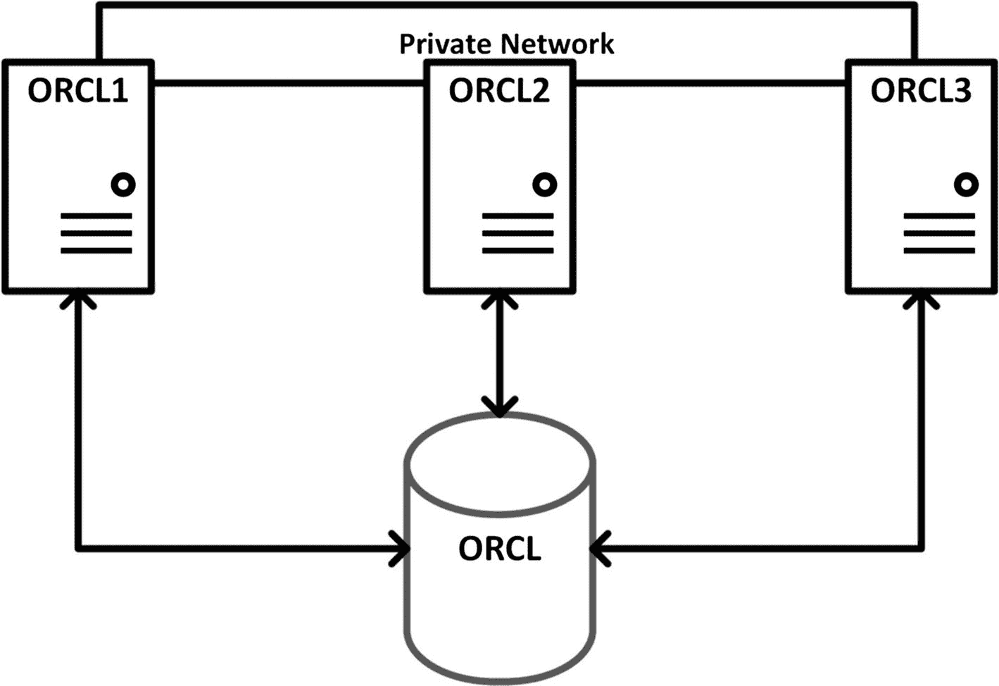

图 21-25 Oracle RAC 系统

我们可以看到磁盘上的数据库 `ORCL`。磁盘必须在配置中的所有系统之间共享。因此，磁盘通常是网络附加存储或存储区域网络。为避免单点故障，磁盘系统应具有内置冗余。此外，磁盘需要可通过多条路径访问。

在配置中的服务器之间创建了一个私有网络。该网络速度很高，用于实例间的通信。重要的是，该网络必须是私有的，这样其他网络活动才不会对 Oracle RAC 性能产生负面影响。

在图 21-25 的示意图中，我们为这个 Oracle RAC 系统设置了三台服务器。这些服务器形成一个*集群*，意味着多台机器作为一个整体协同工作。使集群正常工作的粘合剂是称为网格基础设施的 Oracle 软件，它必须在创建 Oracle RAC 数据库之前安装并运行。

每台服务器上都运行着一个实例。实例名称与数据库名称相同，但附加了实例标识符。对于 `ORCL` 数据库，我们有实例 `ORCL1`、`ORCL2` 和 `ORCL3`。

用户会话可以连接到任何一个实例。高可用性得以实现，因为如果一台服务器不可用，集群中的另一台服务器（称为*节点*）可以接管工作。如果系统配置了透明应用故障切换，当某个实例终止时，会话可以从一个实例迁移到另一个实例。

通过向集群添加更多节点可以实现可扩展性。Oracle RAC 系统通常使用成本较低的服务器作为集群中的节点。如果需要更多资源，只需在配置中添加另一个节点。需要双倍资源？那就增加一倍的节点。

请记住，Oracle 数据库软件需要在集群的所有节点上获得许可。Oracle 真正的应用集群也需要在所有节点上获得许可。虽然这听起来可能需要大量额外的许可费用，但它通常比购买一台具有足够资源来支持工作负载的更大容量的服务器更便宜。

如果你正在寻找高可用性或高可扩展性的解决方案，请关注 Oracle RAC。你将能够通过一次购买同时享受这两个方面的优势。

## 多租户

Oracle 多租户是 Oracle 数据库的未来方向。多租户技术将虚拟化带到了 Oracle 层面。本书前面我们创建了一个虚拟机作为我们的测试服务器。我们使用虚拟机是为了拥有自己独立的数据库服务器，而无需额外的物理硬件。如果我们能在 Oracle 中创建虚拟数据库，那不是很好吗？这正是多租户所提供的。

在多租户出现之前，Oracle DBA 可以通过在同一数据库服务器上运行多个实例来整合服务器。每个实例都有自己的数据库，所以请不要将其与 Oracle RAC 混淆。例如，我们可能有一个 Oracle 数据库支持公司的人力资源应用程序，另一个数据库支持公司的会计系统。为了降低成本，我们可以将两者托管在同一台物理机器上。我们有两个数据库，每个都有自己的实例。正如我们在上一章所知，当我们启动实例时，每个实例都需要自己的 `SGA` 和自己的后台进程。每个实例都会带来一定数量的开销。

Oracle 数据库管理员后来尝试将它们合并到同一个数据库中，将人力资源表放在自己的模式中，将会计表放在另一个模式中。只要两个系统没有相同的公共同义词或对 `PUBLIC` 的相同授权，这种方法就可行。

为了促进数据库整合，Oracle 提供了多租户选项。使用多租户，我们有一个大部分为空的容器数据库。然后我们插入一个人力资源数据库，再插入另一个会计数据库。所有的资源和开销都发生在容器数据库中。我们可以插入许多数据库，称为可插拔数据库，而不会增加开销。每个 `PDB` 都与其他 `PDB` 隔离。`PDB` 甚至不知道其他 `PDB` 的存在。

多租户对于 Oracle 数据库管理员来说也是一个巨大的时间节省器。DBA 不是分别修补每个数据库，而是修补容器数据库。所有的 `PDB` 都通过这一单次操作完成修补。如果 DBA 使用 `RMAN` 进行备份，备份容器也会备份所有 `PDB`。如果 DBA 添加另一个 `PDB`，则无需为确保其得到备份而进行任何额外工作。

Oracle 多租户对应用程序是透明的。应用程序连接到实例，并且只能看到那个 `PDB`，这与非多租户数据库没有什么不同。应用程序无需做任何改变即可与多租户一起工作。

虽然不是必须的，但 Oracle 多租户通常部署在 Oracle RAC 之上。在整合数据库服务器时，我们可能不希望将它们全部放在一台服务器上。如果那台服务器发生故障，所有的 `PDB` 都会宕机，给多个应用程序带来问题。此外，可能还会担心所有这些应用程序的工作负载对一台服务器来说太大了。Oracle RAC 凭借其高可用性和高可扩展性，解决了这些担忧。许多客户正在将数十个或超过一百个 Oracle 数据库从单独的服务器迁移到带有多租户的 Oracle RAC 集群上，从而使用更少的机器。Oracle RAC 和多租户是两个不同的产品，它们之间实际上没有必然联系。你可以使用其中一个，也可以两者都使用。我们越来越多地看到 Oracle RAC 与多租户一起部署。

Oracle 公司已声明多租户是未来的方向。Oracle 12*c* 已弃用非多租户的 Oracle 数据库。虽然你仍然可以创建一个非多租户的数据库，就像我们在测试环境中所做的那样，但在未来某个时候，这将不再是一个选项。只要你将自己限制在一个 `PDB` 内，你今天就可以开始使用多租户并在未来继续使用，而无需产生任何额外成本。如果你想要第二个或更多的 `PDB`，那就是你必须开始为多租户选项获取许可的时候。


