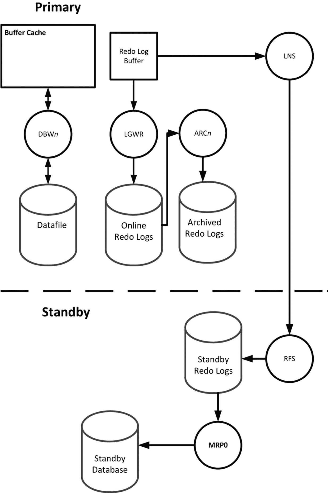

# 数据卫士

## 概述

为 Oracle 数据库的高可用性能力锦上添花的产品叫做 `Data Guard`。Oracle `RAC` 在为您的生产数据中心提供数据库高可用性方面表现出色。但如果该数据中心因某些原因不可用了怎么办？您的业务需求可能需要在另一个数据中心运行一份数据库的副本。`Data Guard` 通过将事务从主站点传输到备用站点来实现这一点。当事务在主数据库中修改数据时，该事务将不断更新备用数据库。如果主数据中心发生故障，`DBA` 可以打开备用数据库，让应用程序继续执行其业务。

## 与传统方法的对比

没有 `Data Guard` 的话，唯一的选择是备份数据库并在备用站点的硬件上执行恢复。如果数据库足够大，执行恢复所需的时间可能会超出业务可接受的范围。此外，如果备份不是最新的，将会导致大量数据丢失。有了 `Data Guard`，则无需恢复任何内容，因为数据库始终存在且可用。

## 数据丢失配置

可以将 `Data Guard` 配置为零数据丢失，或者，对于那些担心潜在性能影响的场景，配置为最小数据丢失。零数据丢失配置意味着当事务提交时，它必须在主备数据库中都完成提交。站点间的延迟时间可能会在零数据丢失配置中引发性能问题。`DBA` 可能希望将 `Data Guard` 配置为最小数据丢失，这样应用程序性能就不会受到影响。虽然我们从不愿意丢失数据，但这却是数据库管理员部署 `Data Guard` 时最典型的配置。在大多数配置中，最小数据丢失解决方案意味着一秒或更短的数据丢失。我曾与一个每周处理超过 `1TB` 事务量的大型主数据库合作，备用数据库最多落后主库一秒。理想情况下，我们希望采用零数据丢失方案，但其性能代价对业务来说过于高昂。丢失一秒的事务则更容易接受。

## 架构

`图 21-26` 中的示意图展示了 Oracle 架构如何变化以支持 `Data Guard`。

图的第一部分取自前一章。当 `Data Guard` 就绪后，一个名为 `LNS` 的新进程会将重做日志从主数据库传输到备用站点。这与 `LGWR` 将重做日志写入联机重做日志文件的操作差别不大。唯一的变化是 `LNS` 将重做日志写入到备用实例上运行的 `RFS` 进程。当 `RFS` 接收到重做日志后，它会将其写入备用重做日志文件。受管理恢复进程 (`MRP0`) 从备用重做日志文件中读取重做日志，并用这些事务更新备用数据库。

在 Oracle 术语中，此图中有两个活动。首先是重做日志 `传输`，即向备用数据库发送重做日志的行为。其次是重做日志 `应用`，即重放这些事务的行为。`LNS` 负责重做传输。`MRP0` 负责重做应用。

## 操作模式：切换与故障转移

当两个系统都就绪后，备用数据库就静静地待在那里，不断更新，直到接到行动指令。如果 `DBA` 执行 `切换` 操作，两个数据库将互换角色。主库变为备用库，反之亦然。切换会有短暂的停机时间。在此停机期间，所有已提交的事务都将确保被发送到备用库并在那里应用。切换是一个零数据丢失操作。因为角色正在互换，所以显而易见主数据库需要是可用的。如果主数据库不可用，那么唯一的选择是执行 `故障转移` 操作。当 `DBA` 发起故障转移时，备用库成为主库，而旧的主库本质上变成了一个死库，不再属于此配置的一部分。故障转移导致的数据丢失量取决于 `Data Guard` 的配置。

## 许可要求

`Data Guard` 不需要额外许可。但是，备用数据库确实需要获得许可。如果您想创建备用数据库，请与您的 Oracle 销售代表或经销商联系，告知他们您有兴趣购买专门用于备用数据库的许可。只要该数据库仅用作备用数据库，他们很可能会为您提供此 Oracle 许可的折扣。

Oracle 确实有一个名为 `Active Data Guard` 的付费附加组件。除了需要为备用 Oracle 数据库购买许可外，您还可以购买额外的 `Active Data Guard` 来获得更多功能。通常，备用数据库只是静静地应用重做日志。虽然这在灾难发生时非常有用，但在那之前它几乎无法用于任何有价值的事情。借助 `Active Data Guard`，您可以以只读模式打开备用数据库，并将其用作报表数据库，从而将资源密集型的报表任务分流到此系统。在只读模式下，`Active Data Guard` 也会重放事务，使备用库与主库保持同步。

## Active Data Guard

`Active Data Guard` 可以检测并自动修复主库和备用库中的数据块损坏。因为数据库在事务上是一致的，所以数据块在两个位置包含相同的数据。如果在主库中检测到数据块损坏，`Active Data Guard` 将从备用库获取该数据块的内容并替换主库中的损坏块。如果在备用库中检测到数据块损坏，操作方式相同。

在 Oracle `12c` 之前，`DBA` 必须在零数据丢失和更好性能之间做出选择。借助 `12c` 中的 `Active Data Guard`，`DBA` 可以两者兼得。Oracle `12c` 引入了新的 `远端同步` 功能，让您在保持相同性能水平的同时实现零数据丢失。

`Active Data Guard` 还支持滚动升级。这将减少升级 Oracle 数据库的停机窗口。如果没有 `Active Data Guard`，升级将导致更大的停机窗口，因为主数据库在升级期间对最终用户不可用。

需要权衡这些额外的 `Active Data Guard` 功能与成本，以确定该产品是否值得额外花费。请记住，`Data Guard` 包含在您的 Oracle 企业版数据库许可中。`Active Data Guard` 则不包含。

## 兼容性

最后，`Data Guard` 和 `Active Data Guard` 可与`多租户`和 Oracle `RAC` 一起使用。您可以混合搭配这些组件以满足您的要求。

