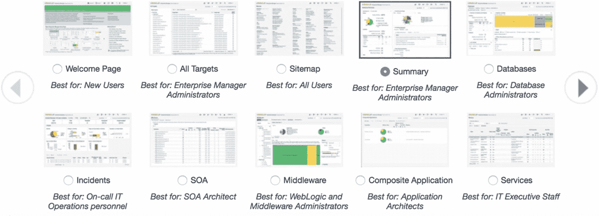
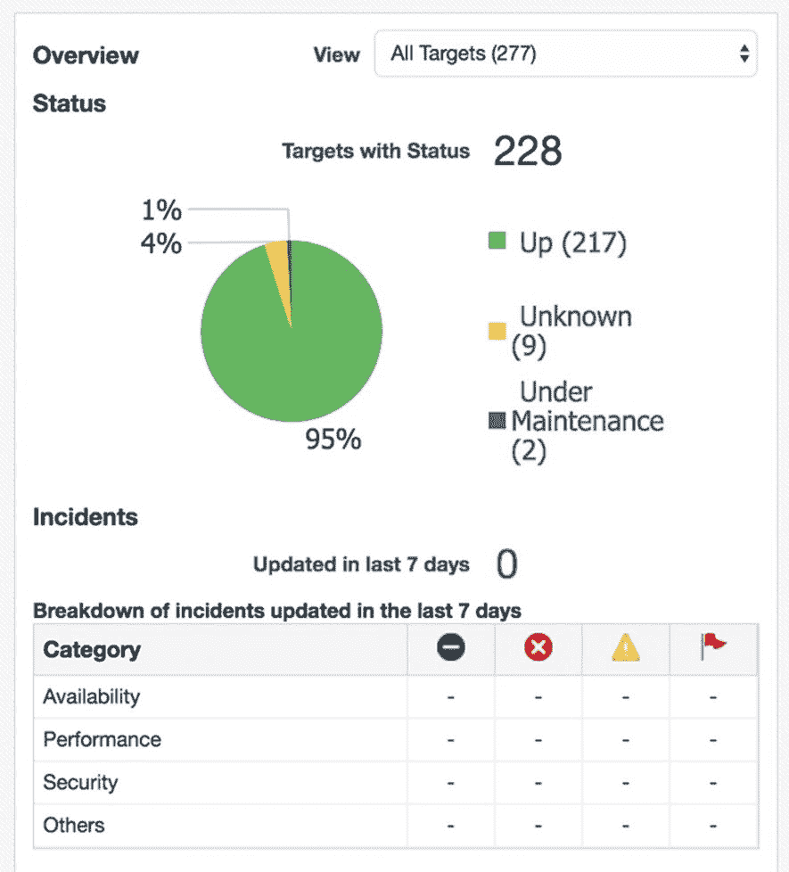
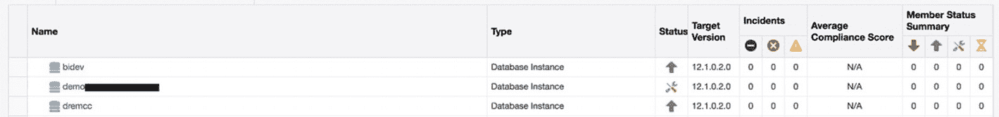
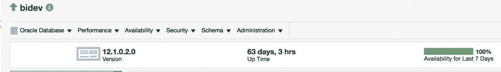
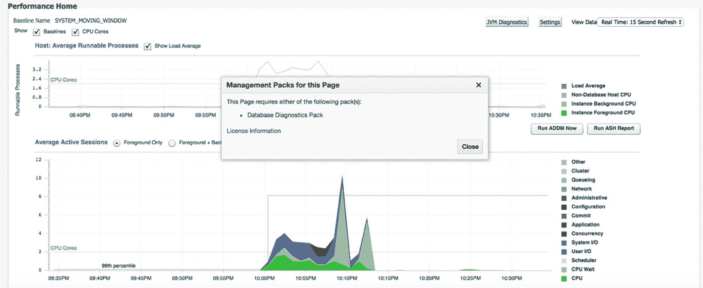
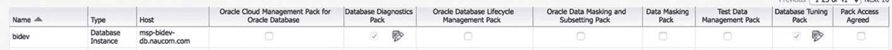

# 企业管理器

在本书中，包括本章在内，我们已经看到了一些 Oracle 企业管理器（EM）的截图。企业管理器是 Oracle 的监控和管理控制台。它不仅可以管理您的 Oracle 数据库及其服务器，还可以管理 Web 服务器等众多其他组件。EM 已包含在您当前的 Oracle 许可中，因此与本章讨论的其他选项不同，使用它**无需额外付费**。

## EM DB Express 与 EM Cloud Control

企业管理器有两种不同的发行版：`EM DB Express` 和 `EM Cloud Control`。`EM DB Express` 可以通过 `数据库配置助手` 创建，用于管理**一个且仅一个**数据库。如果您有第二个数据库，则需要将 Web 浏览器指向另一个 `EM DB Express` 实例。您想通过 EM 管理的数据库越多，如果使用 `EM DB Express`，您需要收藏的 URL 就越多。

`EM Cloud Control` 是一个集中式版本，可以管理任意数量的 Oracle 数据库。`EM Cloud Control` 应部署在它自己的服务器上。它还需要一个单独的数据库作为其存储库。如果您仅将此数据库用于 `EM Cloud Control` 存储库，则此存储库数据库**无需额外许可**。

本章的这一部分将重点介绍 `EM Cloud Control`，并将其简称为 EM。如果您拥有超过两到三个 Oracle 数据库，您可能希望使用 Cloud Control 而非 `EM DB Express`，尽管这个数量尚有争议。有人可能会说，您需要管理更多数据库时才考虑 `EM Cloud Control`。

## EM 界面与导航

连接到 EM 后，系统会提示您选择欢迎页面，如图 21-27 所示。

*图 21-27：EM 主页选择*

我通常选择“概览”屏幕，但您可以自由选择最适合您角色的页面。“概览”屏幕显示了在给定时间您所管理目标的运行状况概览。图 21-28 展示了一个“概览”屏幕的示例。

*图 21-28：EM 概览屏幕的“概览”部分*

在图 21-28 中，我可以看到 EM 正在管理 228 个目标。其中两个目标正在进行计划维护，九个状态未知。如果状态为“关闭”或“未知”，这就提示我需要进一步调查。图表下方的表格显示了过去七天内发生的事件。此系统没有任何需要关注的事件。导航到 `目标` ➤ `数据库` 会显示受管数据库列表，如图 21-29 所示。

*图 21-29：EM 受管数据库*

图 21-29 显示了一些受管数据库及其状态、数据库版本和任何未解决的事件。如果我们点击其中一个数据库，就可以获取该目标的信息并进行管理。在图 21-30 中，我点击了 `bidev` 数据库以查看该特定目标的详细信息。

*图 21-30：EM 数据库目标*

我们可以看到数据库名称旁边有一个绿色的向上箭头，表明此实例状态为“向上”。我们可以看到数据库的版本和运行时间。在版本和运行时间上方有多个下拉菜单，可用于监控和管理数据库。在讨论 `诊断包` 时，我们已经看到了 `性能` 菜单中的许多项目。`可用性` 菜单允许我们备份和恢复数据库，并在配置中添加备用数据库。`安全` 菜单是我们创建用户、分配权限和修改审计策略的地方。`模式` 菜单让我们能够创建数据库对象。`管理` 菜单允许我们配置存储和处理计划任务。这里还有很多值得探索的内容，所以如果您有 EM 访问权限，请四处看看，找找您感兴趣的功能。

## 监控与告警

EM 将监控您的数据库、服务器和其他受管目标，寻找超出正常运行条件范围的情况。如果出现问题，EM 将引发事件，并可以向 DBA 发送通知，以便他们调查问题。DBA 有能力修改告警阈值，以便在问题不够严重时不会收到通知。如果开箱即用的监控指标无法满足您的需求，您可以创建自己的自定义指标。

## 管理额外付费包

EM 的一个问题是，它太容易让人无意中使用到额外付费的选项，例如 `诊断` 和 `调优包`。仅仅导航到数据库的 `性能主页` 页面，就需要为 `诊断包` 购买许可。您可以通过点击 `设置` ➤ `管理包` ➤ `此页的包` 来查看特定页面所需的许可，如图 21-31 所示。

*图 21-31：EM “此页的包”*

在图 21-31 中，我们可以看到 `性能主页` 页面。我们还可以看到，要使用此页面，必须为 `数据库诊断包` 购买许可。从我的角度来看，大问题在于，在您进入该页面之前，无法看到此页面需要什么。到那时，您已经触发了表示您正在使用额外付费选项的标志。EM 现在允许您在数据库级别控制这些额外付费选项的页面。导航到 `设置` ➤ `管理包` ➤ `管理包访问`，您将看到一个类似于图 21-32 的屏幕。

*图 21-32：EM 包访问选项*

对于每个受管数据库，您可以取消选中您未获许可的选项。不幸的是，这些选项默认是启用的。请确保您因缺乏许可而不应使用的选项的复选框被取消选中。每个数据库可以单独配置。取消选中这些复选框后，您就不会意外地发出您已使用了额外付费选项的信号。

`诊断` 和 `调优包` 的复选框显示为灰色，因为这两个包由每个数据库中的 `CONTROL_PACK_MANAGEMENT_ACCESS` 初始化参数控制。有效值为 `NONE`、`DIAGNOSTIC` 或 `DIAGNOSTIC+TUNING`。在 Oracle 企业版中，默认是在数据库级别启用这两个包。请适当设置此参数以确保符合您的许可协议。

