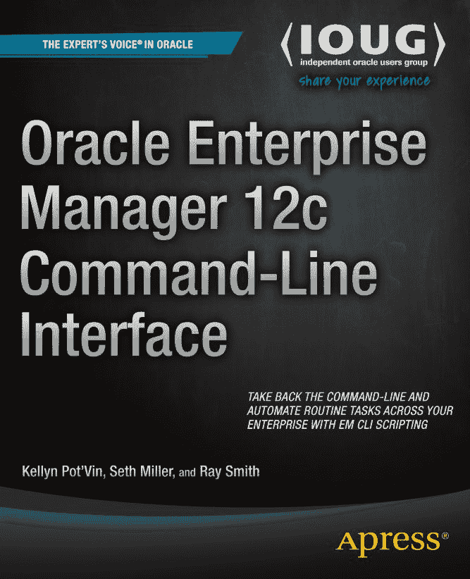

# Oracle Enterprise Manager 12c 命令行界面

## 作者

Kellyn Pot'Vin
Seth Miller
Ray Smith

## 版权信息

Oracle Enterprise Manager 12c 命令行界面

版权所有 © 2014 Kellyn Pot’Vin, Seth Miller, Ray Smith

本书受版权法保护。出版者保留所有权利，无论涉及材料的全部或部分，具体包括翻译权、重印权、图例的再利用权、朗诵权、广播权、缩微胶片或其他任何物理方式的复制权，以及信息存储与检索、电子改编、计算机软件方面的传播权，或当前已知或未来开发的任何类似或不同方法的权利。此法律保留的例外情况是：用于评论或学术分析的简短摘录，或专门为在计算机系统上输入和执行而提供的材料，仅供作品购买者专用。仅在出版者所在地版权法现行版本的规定下，才允许复制本出版物或其部分内容，且必须始终获得 Springer 的许可。使用许可可通过版权结算中心的 RightsLink 获取。侵权行为将根据相应的版权法追究责任。

ISBN-13 (平装): 978-1-4842-0239-5

ISBN-13 (电子): 978-1-4842-0238-8

本书中可能出现商标名称、标识和图片。我们并非每次出现商标名称、标识或图片时都使用商标符号，而是仅以编辑方式并为了商标所有者的利益而使用这些名称、标识和图片，无商标侵权意图。

本书中对商品名称、商标、服务标志及类似术语的使用，即使未特别标明，也不应被理解为表达其是否受专有权约束的意见。

尽管本书中的建议和信息在出版时被认为是真实准确的，但作者、编辑或出版商均不对任何可能存在的错误或遗漏承担任何法律责任。出版商对本出版物所含材料不作任何明示或暗示的担保。

## 出版团队

Managing Director: Welmoed Spahr
Lead Editor: Jonathan Gennick
Developmental Editor: James Markham
Technical Reviewer: Hans Forbrich and Sarah Brydon
Editorial Board: Steve Anglin, Mark Beckner, Ewan Buckingham, Gary Cornell, Louise Corrigan, Jim DeWolf, Jonathan Gennick, Robert Hutchinson, Michelle Lowman, James Markham, Matthew Moodie, Jeff Olson, Jeffrey Pepper, Douglas Pundick, Ben Renow-Clarke, Dominic Shakeshaft, Gwenan Spearing, Matt Wade, Steve Weiss
Coordinating Editor: Jill Balzano
Copy Editor: April Rondeau
Compositor: SPi Global
Indexer: SPi Global
Artist: SPi Global
Cover Designer: Anna Ishchenko

## 发行信息

本书通过 Springer Science+Business Media New York（地址：233 Spring Street, 6th Floor, New York, NY 10013；电话：1-800-SPRINGER；传真：(201) 348-4505；电子邮件：`orders-ny@springer-sbm.com`；或访问：`www.springeronline.com`）向全球图书贸易发行。Apress Media, LLC 是一家位于加利福尼亚州的有限责任公司，其唯一成员（所有者）是 Springer Science + Business Media Finance Inc (SSBM Finance Inc)。SSB M Finance Inc 是特拉华州的一家公司。

有关翻译信息，请发送电子邮件至`rights@apress.com`，或访问`www.apress.com`。

Apress 和 friends of ED 的图书可批量购买用于学术、企业或促销用途。大多数书名也提供电子书版本和许可。更多信息，请参考我们的“批量销售–电子书许可”网页：`www.apress.com/bulk-sales`。

作者在文中引用的任何源代码或其他补充材料，读者均可访问`www.apress.com`获取。有关如何查找图书源代码的详细信息，请访问`www.apress.com/source-code/`。

## 献辞

我将本书献给我的孩子们，Sam、Cait 和 Josh，他们是我每天树立榜样的理由。
—Kellyn Pot’Vin-Gorman

我将本书献给我的合著者们：感谢 Kellyn 在我作为书籍作者的首次旅程中提供了急需的指导，感谢 Ray 的鼓励以及恰到好处的坚持。
—Seth Miller

我将本书献给 IOUG 的所有志愿者和工作人员。感谢你们帮助我成为一名更好的技术专家，也成为一个更好的人。
—Ray Smith

## 目录概览

关于作者
关于技术评审
致谢

 第 1 章：架构
 第 2 章：安装、安全框架及 EM12c 版本 4
 第 3 章：术语与基础
 第 4 章：命令行操作
 第 5 章：通过 Shell 脚本实现自动化
 第 6 章：高级脚本编写
 第 7 章：使用软件库与 Oracle 可扩展性交换中心
 第 8 章：EM CLI 脚本示例
索引

## 详细目录

关于作者
关于技术评审
致谢

 第 1 章：架构

*   企业管理器框架
*   EM CLI 动词
*   EM CLI 客户端软件
*   EM CLI 与 EMCTL
*   代理启动与停止
*   集中化
*   访问
*   安全保障

 第 2 章：安装、安全框架及 EM12c 版本 4

*   EM CLI 与 WebLogic 安装
*   要求
*   创建 WebLogic 域配置配置文件
*   过滤掉 Fusion Middleware
*   Jython
*   支持的 Java 版本
*   路径与环境变量
*   客户端或远程目标安装
*   EM CLI 高级套件
*   通过 OMS 进行 EMCLI 安装
*   安装后配置
*   补丁与升级
*   使用 EM CLI 客户端打补丁
*   为远程客户端安装打补丁
*   EM 安全框架
*   EM CLI 中的安全性
*   EM CLI 设置的安全模式
*   HTTPS 可信证书

## 第二章：动词与任务

发布版 4 中的重要动词
黄金代理更新动词
BI Publisher 报告动词
云服务动词
其他动词
Fusion 中间件置备动词
作业动词
目标数据动词
小结

