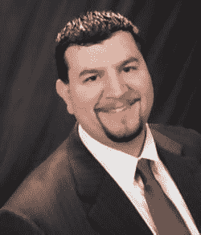

# 关于作者

**Kellyn Pot'Vin-Gorman** 是 Oak Table Network 成员。在加入 Oracle 担任战略客户计划顾问成员（一个专门的 Enterprise Manager 专家团队）之前，她曾是 Oracle ACE 总监。她专注于环境优化调优、自动化以及构建健壮的企业级系统。Kellyn 几乎只处理多 TB 级大小的数据库，包括 Exadata 和固态硬盘解决方案，并因在 Enterprise Manager 12c 及其命令行接口方面的广泛工作而闻名。她的博客 `http://dbakevlar.com` 以及她在社交媒体上以 `DBAKevlar` 为名的活动，因其洞察力和内容而备受尊重。她是多本技术书籍的合著者，为 ODTUG、OTN 和 All Things Oracle 主持网络研讨会，并曾在 Oracle Open World、HotSos、Collaborate 和 KSCOPE 以及众多其他美国和欧洲会议上发表演讲。Kellyn 是女性技术协会（WIT）的坚定倡导者，她认为诸如克服刻板印象的教育以及提供早期机会是应对挑战之路的一部分。

**Seth Miller** 是一名 Oracle ACE，自 2005 年以来一直从事 Oracle 技术工作。他曾在医疗、医疗器械制造和环境科学等多个行业担任 DBA，现在是一名顾问和 Oracle 大学认证讲师。Seth 是 Oracle 产品和 Oracle 社区的坚定倡导者，担任 IOUG 志愿者参与总监、双子城 Oracle 用户组副总裁，参与有关 Oracle 技术的社交媒体对话，并参与 Oracle-L 邮件列表的讨论。Seth 是 IOUG Collaborate 和 Oracle OpenWorld 会议的定期演讲者，也是 OTN 网络研讨会的主持人。他的博客 `http://sethmiller.org` 发布与 Oracle 及其他技术相关的文章。Enterprise Manager 在 Seth 心中占有特殊的地位，因为它既能减轻 IT 管理员的负担，同时又能赋予他们权力。

**Ray Smith** 是一名 Oracle ACE 和敬业的 IOUG 志愿者。他目前担任 *SELECT Journal* 和最佳实践手册的执行编辑，以及 IOUG 最好的工作——COLLABORATE 会议的新演讲者导师。他是 COLLABORATE、Oracle Open World 和区域用户组的定期演讲者。Ray 的博客 `http://oramanageability.wordpress.com` 专门讲解 Oracle Enterprise Manager 的方方面面。他最近在波特兰州立大学设立了西北 Oracle 用户组“女性技术”奖学金。他是 Oracle Enterprise Manager 客户咨询委员会的自豪成员，并且是一位毫不掩饰的 OEM 倡导者。

