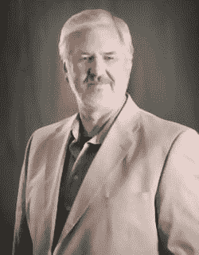
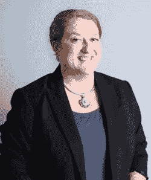

# 关于技术评审者

Oracle ACE 总监兼电气工程师**Hans Forbrich**自 1984 年以来一直在使用 Oracle 技术。在 20 世纪 90 年代，Hans 在北美电信行业为 Oracle 工作积累了丰富的经验。他于 2002 年底离开 Oracle，创立了 Forbrich Consulting Ltd.，这是一家专注于通过智能架构、管理和培训来利用 Oracle 许可的私营公司。在实践中，Hans 使用了 Oracle Enterprise Manager 系列产品，自 Oracle 8 早期阶段问世以来一直如此。

Hans 已幸福结婚 30 多年，有三个成年子女。在“业余”时间，Hans 喜欢与妻子 Susanne 一起欣赏艺术，并且是埃德蒙顿歌剧合唱团的成员。

**莎拉·布莱登** 是一位经验丰富的技术专家，在基于 Oracle 和 UNIX 的应用程序领域拥有超过二十年的经验。自 1996 年起担任 Oracle 数据库管理员（DBA），莎拉使用过从 7.1 版开始的所有 Oracle 版本，并且是 Oracle 认证大师。她在 7x24 小时环境的系统设计与支持、Oracle RAC 部署以及 Oracle 数据库的安全与审计考虑方面拥有广泛的经验。

此前，莎拉曾是贝莱德（Blackrock）的高级 Oracle 专家，该公司是全球最大的金融服务公司，管理着超过 3 万亿美元的资产。莎拉目前是 PayPal 的高级技术人员（数据库工程）。

致谢

我感谢我的丈夫蒂姆·戈尔曼（Tim Gorman），他是任何人所能期望的最佳伴侣，并感谢 Oracle 社区持续的支持和对知识的追求。

我的妻子凯蒂（Katie）为我的生活带来了秩序，我的两个孩子艾萨克（Isaac）和阿达琳（Adalyn）每天都与我分享他们无尽的欢乐。我要感谢 Oracle 社区，他们总能让我渴望成为一名更好的技术专家，其能力令人惊叹。

我的妻子瓦莱丽（Valerie）让我的生活每天都变得更好。她对这个项目的鼓励对于项目的完成至关重要。我还要感谢那些出色的 Oracle 员工，他们使 OEM 成为了一个优秀的工具。维尔纳·德格鲁特（Werner De Gruyter）、安娜·麦科勒姆（Ana McCollum）、阿迪什·弗莱（Adeesh Fulay）和莫琳·伯恩（Maureen Byrne）都通过用户反馈和理解，表现出对改进 OEM 的真正兴趣。他们的见解使这一切变得清晰。

